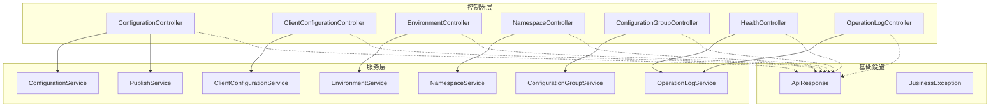
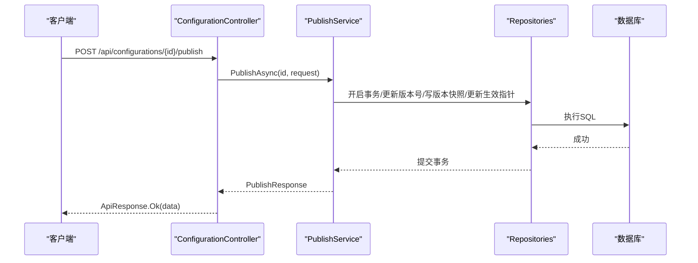
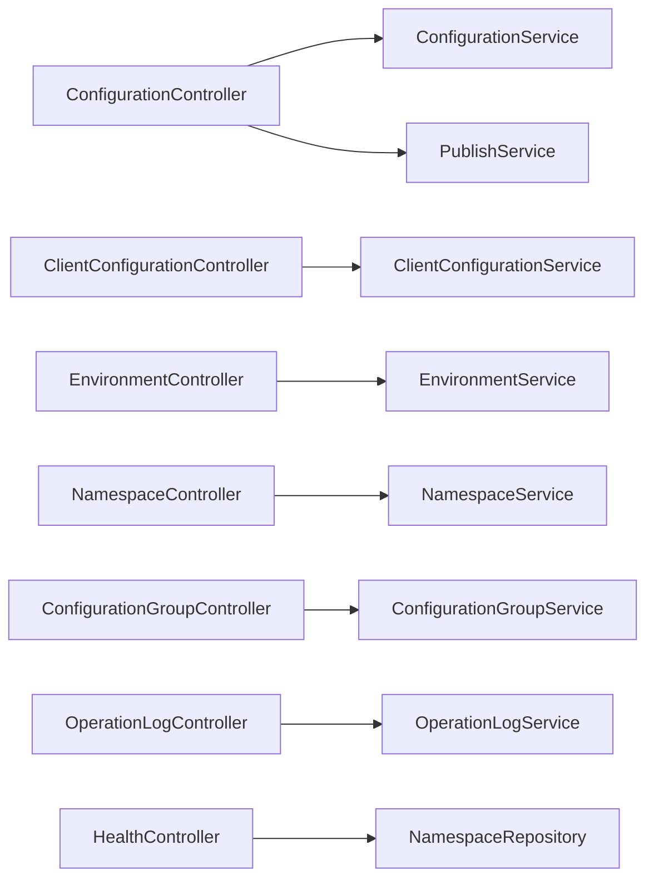

# API接口文档

<cite>
**本文引用的文件**
- [ConfigurationController.cs](file://k_config_center/src/Controllers/ConfigurationController.cs)
- [ClientConfigurationController.cs](file://k_config_center/src/Controllers/ClientConfigurationController.cs)
- [EnvironmentController.cs](file://k_config_center/src/Controllers/EnvironmentController.cs)
- [NamespaceController.cs](file://k_config_center/src/Controllers/NamespaceController.cs)
- [ConfigurationGroupController.cs](file://k_config_center/src/Controllers/ConfigurationGroupController.cs)
- [HealthController.cs](file://k_config_center/src/Controllers/HealthController.cs)
- [OperationLogController.cs](file://k_config_center/src/Controllers/OperationLogController.cs)
- [ApiResponse.cs](file://k_config_center/src/Infrastructure/ApiResponse.cs)
- [BusinessException.cs](file://k_config_center/src/Infrastructure/BusinessException.cs)
- [ConfigurationRequests.cs](file://k_config_center/src/Models/Requests/ConfigurationRequests.cs)
- [EnvironmentRequests.cs](file://k_config_center/src/Models/Requests/EnvironmentRequests.cs)
- [NamespaceRequests.cs](file://k_config_center/src/Models/Requests/NamespaceRequests.cs)
- [ConfigurationGroupRequests.cs](file://k_config_center/src/Models/Requests/ConfigurationGroupRequests.cs)
- [CommonResponses.cs](file://k_config_center/src/Models/Responses/CommonResponses.cs)
- [后端方案.md](file://docs/技术方案/后端方案.md)
</cite>

## 目录
1. [简介](#简介)
2. [项目结构](#项目结构)
3. [核心组件](#核心组件)
4. [架构总览](#架构总览)
5. [详细接口说明](#详细接口说明)
6. [依赖关系分析](#依赖关系分析)
7. [性能与可用性](#性能与可用性)
8. [故障排查指南](#故障排查指南)
9. [结论](#结论)
10. [附录](#附录)

## 简介
本接口文档面向配置中心系统的管理端与客户端两类使用者，覆盖所有RESTful端点、请求参数、响应格式、错误码约定、认证与安全建议、版本管理与兼容性策略，以及SDK集成最佳实践。系统采用统一响应包裹与业务异常机制，HTTP状态码一律为200，业务成功或失败通过code字段表达。

## 项目结构
后端基于ASP.NET Core控制器分层：
- Controllers：对外暴露REST端点，仅负责参数接收与响应包装
- Services：业务逻辑实现（发布、回滚、下线、查询等）
- Repositories：数据访问层（SqlSugar封装）
- Models：请求/响应模型与领域对象
- Infrastructure：统一响应、业务异常、数据库初始化、Swagger过滤器等

图表来源
- [ConfigurationController.cs:1-115](file://k_config_center/src/Controllers/ConfigurationController.cs#L1-L115)
- [ClientConfigurationController.cs:1-47](file://k_config_center/src/Controllers/ClientConfigurationController.cs#L1-L47)
- [EnvironmentController.cs:1-52](file://k_config_center/src/Controllers/EnvironmentController.cs#L1-L52)
- [NamespaceController.cs:1-50](file://k_config_center/src/Controllers/NamespaceController.cs#L1-L50)
- [ConfigurationGroupController.cs:1-53](file://k_config_center/src/Controllers/ConfigurationGroupController.cs#L1-L53)
- [HealthController.cs:1-31](file://k_config_center/src/Controllers/HealthController.cs#L1-L31)
- [OperationLogController.cs:1-31](file://k_config_center/src/Controllers/OperationLogController.cs#L1-L31)
- [ApiResponse.cs:1-10](file://k_config_center/src/Infrastructure/ApiResponse.cs#L1-L10)

章节来源
- [ConfigurationController.cs:1-115](file://k_config_center/src/Controllers/ConfigurationController.cs#L1-L115)
- [ClientConfigurationController.cs:1-47](file://k_config_center/src/Controllers/ClientConfigurationController.cs#L1-L47)
- [EnvironmentController.cs:1-52](file://k_config_center/src/Controllers/EnvironmentController.cs#L1-L52)
- [NamespaceController.cs:1-50](file://k_config_center/src/Controllers/NamespaceController.cs#L1-L50)
- [ConfigurationGroupController.cs:1-53](file://k_config_center/src/Controllers/ConfigurationGroupController.cs#L1-L53)
- [HealthController.cs:1-31](file://k_config_center/src/Controllers/HealthController.cs#L1-L31)
- [OperationLogController.cs:1-31](file://k_config_center/src/Controllers/OperationLogController.cs#L1-L31)
- [ApiResponse.cs:1-10](file://k_config_center/src/Infrastructure/ApiResponse.cs#L1-L10)

## 核心组件
- 统一响应：所有接口返回{ code, message, data }，HTTP始终200；成功时code=0
- 业务异常：抛出BusinessException会被全局处理转换为统一失败响应
- 分页：列表接口返回{ items, total }结构
- 软删除：删除操作仅标记deleted_at，查询默认过滤已删除记录
- 版本与发布：配置项支持草稿、发布、回滚、下线；版本快照不可变

章节来源
- [ApiResponse.cs:1-10](file://k_config_center/src/Infrastructure/ApiResponse.cs#L1-L10)
- [BusinessException.cs:1-11](file://k_config_center/src/Infrastructure/BusinessException.cs#L1-L11)
- [CommonResponses.cs:1-52](file://k_config_center/src/Models/Responses/CommonResponses.cs#L1-L52)
- [后端方案.md:482-509](file://docs/技术方案/后端方案.md#L482-L509)

## 架构总览
下图展示一次“发布配置”的调用链：控制器接收请求并委托服务完成事务性发布，最终返回新版本信息。

图表来源
- [ConfigurationController.cs:65-83](file://k_config_center/src/Controllers/ConfigurationController.cs#L65-L83)

章节来源
- [ConfigurationController.cs:65-83](file://k_config_center/src/Controllers/ConfigurationController.cs#L65-L83)

## 详细接口说明

### 通用约定
- 基础路径
  - 管理端：/api
  - 客户端：/api/client
- 统一响应体
  - { code, message, data }
  - HTTP状态码始终为200，业务结果由code决定
- 分页结构
  - { items: T[], total: number }
- 软删除
  - 删除接口仅标记deleted_at，查询默认不返回已删除记录
- 内容格式
  - text/json/yaml/properties（以具体接口为准）

章节来源
- [ApiResponse.cs:1-10](file://k_config_center/src/Infrastructure/ApiResponse.cs#L1-L10)
- [CommonResponses.cs:1-52](file://k_config_center/src/Models/Responses/CommonResponses.cs#L1-L52)
- [后端方案.md:482-509](file://docs/技术方案/后端方案.md#L482-L509)

### 命名空间 Namespace
- GET /api/namespaces
  - 描述：获取命名空间列表（全量，后续演进分页）
  - 响应：data为NamespaceResponse数组
- POST /api/namespaces
  - 描述：创建命名空间
  - 请求体：NamespaceCreateRequest
  - 约束：namespaceKey全局唯一（未软删），重复返回20001
- PUT /api/namespaces/{id}
  - 描述：更新名称/描述/状态
  - 请求体：NamespaceUpdateRequest
  - 约束：key不可改；不存在或已软删返回10002
- DELETE /api/namespaces/{id}
  - 描述：软删除
  - 约束：存在未删除的下级环境拒绝，返回20004

章节来源
- [NamespaceController.cs:1-50](file://k_config_center/src/Controllers/NamespaceController.cs#L1-L50)
- [NamespaceRequests.cs:1-14](file://k_config_center/src/Models/Requests/NamespaceRequests.cs#L1-L14)
- [后端方案.md:482-509](file://docs/技术方案/后端方案.md#L482-L509)

### 环境 Environment
- GET /api/environments?namespaceId={id}
  - 描述：按命名空间筛选环境列表（升序sort_order）
  - 响应：data为EnvironmentResponse数组
- POST /api/environments
  - 描述：创建环境
  - 请求体：EnvironmentCreateRequest
  - 约束：environmentKey在同命名空间内唯一，重复返回20002
- PUT /api/environments/{id}
  - 描述：更新名称/描述/排序/状态
  - 请求体：EnvironmentUpdateRequest
  - 约束：key与所属命名空间不可改；不存在或已软删返回10002
- DELETE /api/environments/{id}
  - 描述：软删除
  - 约束：存在未删除的下级配置组拒绝，返回20004

章节来源
- [EnvironmentController.cs:1-52](file://k_config_center/src/Controllers/EnvironmentController.cs#L1-L52)
- [EnvironmentRequests.cs:1-17](file://k_config_center/src/Models/Requests/EnvironmentRequests.cs#L1-L17)
- [后端方案.md:482-509](file://docs/技术方案/后端方案.md#L482-L509)

### 配置组 Configuration Group
- GET /api/configuration-groups?namespaceId={id}&environmentId={id}
  - 描述：按命名空间与环境筛选配置组列表
  - 响应：data为ConfigurationGroupResponse数组
- POST /api/configuration-groups
  - 描述：创建配置组
  - 请求体：ConfigurationGroupCreateRequest
  - 约束：groupKey在同环境内唯一，重复返回20003
- PUT /api/configuration-groups/{id}
  - 描述：更新名称/描述/状态
  - 请求体：ConfigurationGroupUpdateRequest
  - 约束：key与所属环境不可改；不存在或已软删返回10002
- DELETE /api/configuration-groups/{id}
  - 描述：软删除
  - 约束：存在未删除的配置项拒绝，返回20004

章节来源
- [ConfigurationGroupController.cs:1-53](file://k_config_center/src/Controllers/ConfigurationGroupController.cs#L1-L53)
- [ConfigurationGroupRequests.cs:1-16](file://k_config_center/src/Models/Requests/ConfigurationGroupRequests.cs#L1-L16)
- [后端方案.md:482-509](file://docs/技术方案/后端方案.md#L482-L509)

### 配置项 Configuration
- GET /api/configurations
  - 描述：配置项列表（当前编辑态，附hasUnpublishedChange标记）
  - 查询参数：groupId, namespaceId, environmentId, status(DRAFT/PUBLISHED/OFFLINE), keyword
  - 响应：data为ConfigurationResponse数组
- GET /api/configurations/{id}
  - 描述：配置详情（当前编辑态+生效版本快照）
  - 响应：data为ConfigurationDetailResponse
  - 约束：不存在或已软删返回10002
- POST /api/configurations
  - 描述：新建配置（初始DRAFT，版本号0）
  - 请求体：ConfigurationCreateRequest
  - 约束：同组内configurationKey唯一，重复返回30001
- PUT /api/configurations/{id}
  - 描述：保存编辑（草稿），不产生版本，不改变status
  - 请求体：ConfigurationUpdateRequest
  - 约束：目标不存在返回10002
- DELETE /api/configurations/{id}
  - 描述：软删除
- POST /api/configurations/{id}/publish
  - 描述：发布配置（事务：版本号+1→写快照→更新生效指针→审计日志）
  - 请求体：PublishRequest
  - 约束：无未发布变更返回30002；并发冲突返回30004（可重试）
  - 响应：data为PublishResponse（versionId, versionNumber）
- POST /api/configurations/{id}/rollback
  - 描述：回滚到历史版本（生成ROLLBACK类型的新版本，版本号线性递增）
  - 请求体：RollbackRequest
  - 约束：目标版本不存在返回30003
  - 响应：data为PublishResponse
- POST /api/configurations/{id}/offline
  - 描述：下线配置（status置OFFLINE）
  - 约束：仅PUBLISHED可下线，否则返回10001
- GET /api/configurations/{id}/versions?pageIndex={n}&pageSize={m}
  - 描述：版本历史分页（按version_number倒序）
  - 响应：data为PageResponse<ConfigurationVersionResponse>
- GET /api/configurations/{id}/versions/{versionNumber}
  - 描述：指定版本快照详情
  - 响应：data为ConfigurationVersionResponse
  - 约束：版本不存在返回10002

章节来源
- [ConfigurationController.cs:14-113](file://k_config_center/src/Controllers/ConfigurationController.cs#L14-L113)
- [ConfigurationRequests.cs:1-27](file://k_config_center/src/Models/Requests/ConfigurationRequests.cs#L1-L27)
- [后端方案.md:482-509](file://docs/技术方案/后端方案.md#L482-L509)

### 客户端读取 Client
- GET /api/client/configurations?namespaceKey={ns}&environmentKey={env}&groupKey={grp}
  - 描述：按业务key批量拉取已发布配置（仅PUBLISHED且未软删）
  - 响应：data为ClientConfigurationResponse数组（含md5、versionNumber）
- GET /api/client/configurations/{configurationKey}?namespaceKey={ns}&environmentKey={env}&groupKey={grp}
  - 描述：拉取单个已发布配置
  - 响应：data为ClientConfigurationResponse
  - 约束：不存在或未发布返回10002
- GET /api/client/notifications?namespaceKey={ns}&environmentKey={env}&groupKey={grp}&md5={md5}
  - 描述：长轮询变更探测（最长挂起30秒，每2秒对比一次）
  - 响应：data为ClientNotificationResponse（changed, md5）
  - 行为：changed=true时需重新拉取配置并使用新md5

章节来源
- [ClientConfigurationController.cs:13-45](file://k_config_center/src/Controllers/ClientConfigurationController.cs#L13-L45)
- [CommonResponses.cs:10-21](file://k_config_center/src/Models/Responses/CommonResponses.cs#L10-L21)

### 健康检查 Health
- GET /api/health/database
  - 描述：数据库连通性检查（轻量Count）
  - 响应：data包含canConnect与namespaceCount
  - 失败：返回内部错误码10000（异常详情仅服务端日志）

章节来源
- [HealthController.cs:13-29](file://k_config_center/src/Controllers/HealthController.cs#L13-L29)

### 操作日志 Operation Log
- GET /api/operation-logs
  - 描述：多维度检索（分页），按创建时间倒序
  - 查询参数：namespaceId, environmentId, groupId, configurationId, operation(CREATE/UPDATE/PUBLISH/ROLLBACK/OFFLINE/DELETE), operator(模糊), startTime(含), endTime(不含), pageIndex, pageSize
  - 响应：data为PageResponse<OperationLogResponse>

章节来源
- [OperationLogController.cs:12-29](file://k_config_center/src/Controllers/OperationLogController.cs#L12-L29)
- [CommonResponses.cs:23-51](file://k_config_center/src/Models/Responses/CommonResponses.cs#L23-L51)

## 依赖关系分析
- 控制器与服务解耦：控制器仅做入参校验与响应包装，业务逻辑在Service层
- 统一响应与异常：ApiResponse与BusinessException贯穿各控制器，保证契约一致
- 版本与发布：ConfigurationController将发布/回滚/下线委托给PublishService，确保事务性与一致性
- 客户端接口：ClientConfigurationController提供只读能力，屏蔽内部主键，使用业务key定位资源

图表来源
- [ConfigurationController.cs:1-115](file://k_config_center/src/Controllers/ConfigurationController.cs#L1-L115)
- [ClientConfigurationController.cs:1-47](file://k_config_center/src/Controllers/ClientConfigurationController.cs#L1-L47)
- [EnvironmentController.cs:1-52](file://k_config_center/src/Controllers/EnvironmentController.cs#L1-L52)
- [NamespaceController.cs:1-50](file://k_config_center/src/Controllers/NamespaceController.cs#L1-L50)
- [ConfigurationGroupController.cs:1-53](file://k_config_center/src/Controllers/ConfigurationGroupController.cs#L1-L53)
- [OperationLogController.cs:1-31](file://k_config_center/src/Controllers/OperationLogController.cs#L1-L31)
- [HealthController.cs:1-31](file://k_config_center/src/Controllers/HealthController.cs#L1-L31)

章节来源
- [ConfigurationController.cs:1-115](file://k_config_center/src/Controllers/ConfigurationController.cs#L1-L115)
- [ClientConfigurationController.cs:1-47](file://k_config_center/src/Controllers/ClientConfigurationController.cs#L1-L47)
- [EnvironmentController.cs:1-52](file://k_config_center/src/Controllers/EnvironmentController.cs#L1-L52)
- [NamespaceController.cs:1-50](file://k_config_center/src/Controllers/NamespaceController.cs#L1-L50)
- [ConfigurationGroupController.cs:1-53](file://k_config_center/src/Controllers/ConfigurationGroupController.cs#L1-L53)
- [OperationLogController.cs:1-31](file://k_config_center/src/Controllers/OperationLogController.cs#L1-L31)
- [HealthController.cs:1-31](file://k_config_center/src/Controllers/HealthController.cs#L1-L31)

## 性能与可用性
- 长轮询优化：客户端变更探测接口最长挂起30秒，期间周期性对比指纹，减少无效请求
- 版本快照：已发布配置读取来自版本快照，避免读取编辑中的草稿，提高一致性
- 软删除：删除不物理移除，降低误删风险，同时保持关联数据可追溯
- 并发控制：发布接口对并发冲突返回可重试错误码，客户端应实现退避重试

章节来源
- [ClientConfigurationController.cs:34-45](file://k_config_center/src/Controllers/ClientConfigurationController.cs#L34-L45)
- [ConfigurationController.cs:65-83](file://k_config_center/src/Controllers/ConfigurationController.cs#L65-L83)

## 故障排查指南
- 常见错误码
  - 10000：服务器内部错误（非业务异常）
  - 10001：业务状态非法（如非已发布配置不可下线）
  - 10002：资源不存在
  - 20001：命名空间key冲突
  - 20002：环境key冲突
  - 20003：配置组key冲突
  - 20004：存在未删除的下级资源，拒绝删除
  - 30001：配置key冲突
  - 30002：无未发布变更（重复发布）
  - 30003：目标回滚版本不存在
  - 30004：发布并发冲突（可重试）
- 排查步骤
  - 确认请求参数是否完整、类型正确
  - 检查资源是否存在且未被软删除
  - 对于发布/回滚类操作，确认当前状态与目标版本合法性
  - 遇到并发冲突时，实施指数退避重试
  - 健康检查失败时优先排查数据库连接与权限

章节来源
- [后端方案.md:482-509](file://docs/技术方案/后端方案.md#L482-L509)
- [HealthController.cs:13-29](file://k_config_center/src/Controllers/HealthController.cs#L13-L29)
- [ConfigurationController.cs:65-83](file://k_config_center/src/Controllers/ConfigurationController.cs#L65-L83)

## 结论
本API文档覆盖了配置中心的全部管理端与客户端接口，明确了统一响应、错误码、版本与发布流程、软删除策略与长轮询机制。遵循本文档的约定可实现稳定、可观测、易集成的配置管理能力。

## 附录

### 认证授权与安全建议
- 鉴权：建议在网关或中间件层统一实现JWT/OAuth2鉴权，控制器内不直接处理令牌
- 传输安全：强制HTTPS，启用HSTS
- 输入校验：服务端严格校验请求体与路径参数，防止注入与越权
- 敏感信息：不在日志中输出敏感内容（如配置内容、密钥）
- 限流与防抖：对高频接口（如长轮询）进行速率限制与熔断保护
- 审计：关键操作（发布、回滚、下线、删除）均记录操作日志

[本节为通用安全建议，不直接引用具体代码文件]

### API版本管理与向后兼容
- 版本策略：当前所有接口位于/api前缀下，未来可通过/api/v1、/api/v2演进
- 兼容性原则：
  - 新增可选字段与接口，保持旧客户端可用
  - 废弃字段保留但标记弃用，逐步迁移
  - 错误码区间固定，禁止修改既有码值
- 客户端适配：通过协商头部或URL前缀选择版本；服务端对未知版本返回明确错误

[本节为通用版本策略，不直接引用具体代码文件]

### SDK集成指导与最佳实践
- 基础库
  - 统一解析{ code, message, data }，code=0视为成功
  - 对10000/30004等错误实现指数退避重试
- 客户端拉取
  - 首次拉取后缓存md5，使用长轮询接口检测变更
  - changed=true时重新拉取并更新本地缓存
- 管理端操作
  - 发布/回滚/下线等操作需幂等与重试保护
  - 删除为软删除，恢复需重建
- 错误处理
  - 区分业务错误与系统错误，向用户呈现友好提示
  - 记录必要上下文（资源ID、操作类型、时间）便于审计

[本节为通用集成建议，不直接引用具体代码文件]