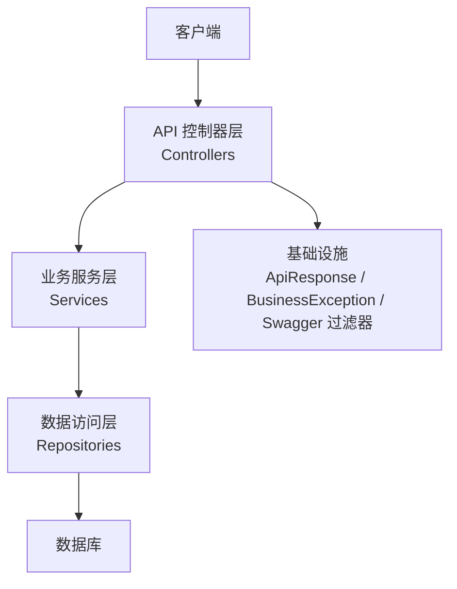
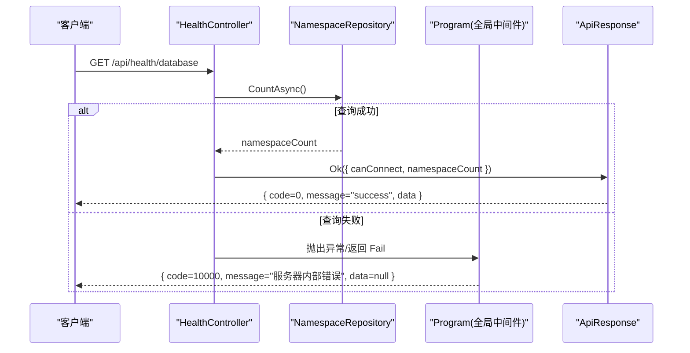
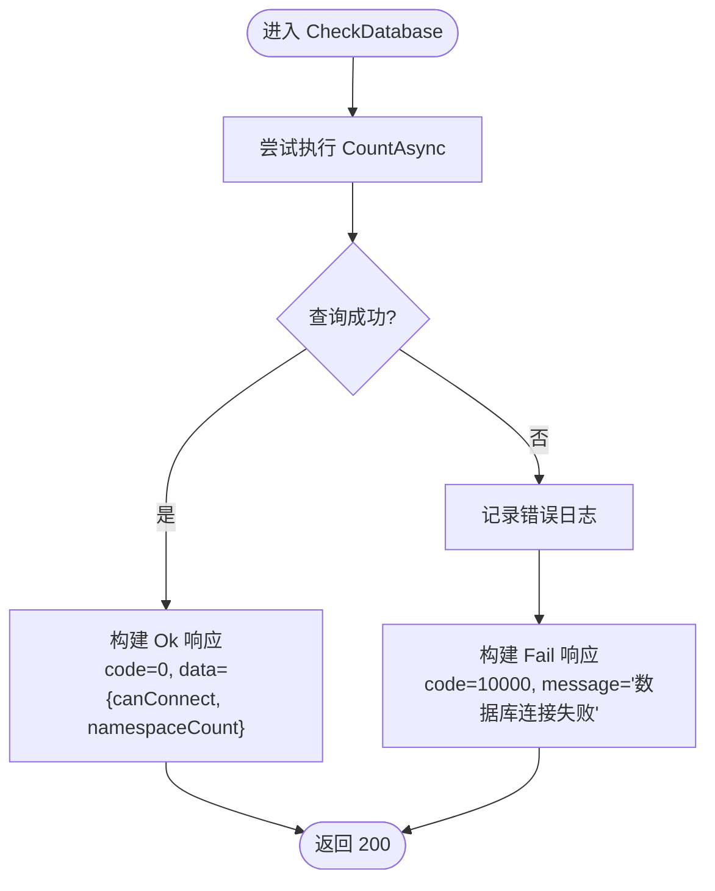
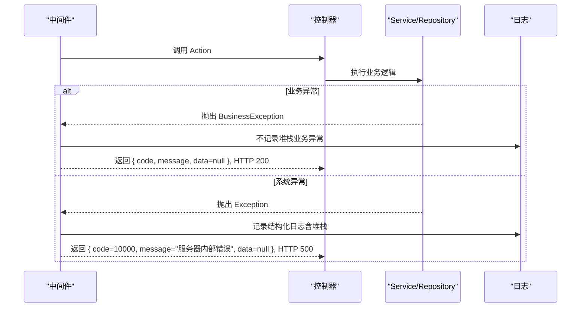
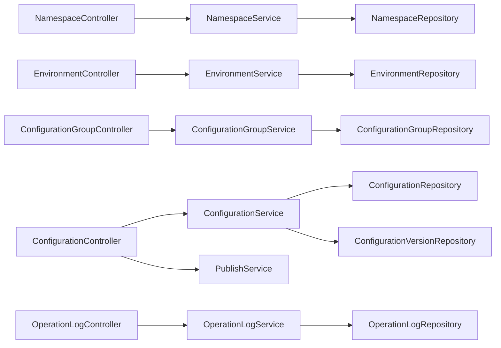

# 公共接口

<cite>
**本文引用的文件**
- [Program.cs](file://k_config_center/Program.cs)
- [HealthController.cs](file://k_config_center/src/Controllers/HealthController.cs)
- [ApiResponse.cs](file://k_config_center/src/Infrastructure/ApiResponse.cs)
- [BusinessException.cs](file://k_config_center/src/Infrastructure/BusinessException.cs)
- [SwaggerOperatorHeaderFilter.cs](file://k_config_center/src/Infrastructure/SwaggerOperatorHeaderFilter.cs)
- [ConfigurationController.cs](file://k_config_center/src/Controllers/ConfigurationController.cs)
- [EnvironmentController.cs](file://k_config_center/src/Controllers/EnvironmentController.cs)
- [NamespaceController.cs](file://k_config_center/src/Controllers/NamespaceController.cs)
- [ConfigurationGroupController.cs](file://k_config_center/src/Controllers/ConfigurationGroupController.cs)
- [OperationLogController.cs](file://k_config_center/src/Controllers/OperationLogController.cs)
- [appsettings.json](file://k_config_center/appsettings.json)
- [后端方案.md](file://docs/技术方案/后端方案.md)
</cite>

## 目录
1. [简介](#简介)
2. [项目结构](#项目结构)
3. [核心组件](#核心组件)
4. [架构总览](#架构总览)
5. [详细组件分析](#详细组件分析)
6. [依赖关系分析](#依赖关系分析)
7. [性能考虑](#性能考虑)
8. [故障排查指南](#故障排查指南)
9. [结论](#结论)
10. [附录](#附录)

## 简介
本章节面向调用方，统一说明配置中心后端的公共接口规范与约定，包括：
- 健康检查接口：用于服务可用性检测与数据库连通性验证。
- 统一响应格式：所有接口返回统一的 JSON 结构，HTTP 状态码在业务成功时均为 200，业务失败通过 code 表达。
- 全局错误处理：业务异常与系统异常的捕获、日志记录与统一响应。
- 错误码规范：分段式错误码定义与使用约定。
- API 版本管理：当前对外版本为 v1，向后兼容性策略与演进原则。

## 项目结构
本项目采用分层架构：
- Controllers：仅负责参数接收、调用 Service、包装 ApiResponse。
- Services：业务逻辑实现。
- Repositories：数据访问层，唯一允许接触 ISqlSugarClient 与 Entities 的层级。
- Infrastructure：基础设施（统一响应、业务异常、Swagger 过滤器等）。
- Models：请求与响应模型、领域模型。

图表来源
- [Program.cs:14-34](file://k_config_center/Program.cs#L14-L34)
- [HealthController.cs:7-11](file://k_config_center/src/Controllers/HealthController.cs#L7-L11)

章节来源
- [Program.cs:14-34](file://k_config_center/Program.cs#L14-L34)

## 核心组件
- 统一响应封装：所有接口返回 { code, message, data }，成功时 HTTP 200，业务失败由 code 表达，data 为 null。
- 业务异常：抛出 BusinessException 携带错误码与消息，由全局中间件统一转为统一响应。
- 全局异常处理：捕获业务异常与系统异常，分别以 200 + 业务码或 500 + 内部错误码返回，并记录结构化日志。
- 健康检查：提供数据库连通性检查端点，返回连接状态与统计信息。
- 审计操作头：非 GET 写操作建议携带 X-Operator 请求头，用于审计日志记录。

章节来源
- [ApiResponse.cs:3-9](file://k_config_center/src/Infrastructure/ApiResponse.cs#L3-L9)
- [BusinessException.cs:3-10](file://k_config_center/src/Infrastructure/BusinessException.cs#L3-L10)
- [Program.cs:71-92](file://k_config_center/Program.cs#L71-L92)
- [HealthController.cs:7-29](file://k_config_center/src/Controllers/HealthController.cs#L7-L29)
- [SwaggerOperatorHeaderFilter.cs:6-24](file://k_config_center/src/Infrastructure/SwaggerOperatorHeaderFilter.cs#L6-L24)

## 架构总览
下图展示了从请求到响应的整体流程，包含健康检查、统一响应与全局异常处理的协作关系。

图表来源
- [HealthController.cs:17-29](file://k_config_center/src/Controllers/HealthController.cs#L17-L29)
- [Program.cs:71-92](file://k_config_center/Program.cs#L71-L92)
- [ApiResponse.cs:3-9](file://k_config_center/src/Infrastructure/ApiResponse.cs#L3-L9)

## 详细组件分析

### 健康检查接口
- 端点：GET /api/health/database
- 功能：执行轻量数据库连通性检查（对命名空间表做 Count），返回连接状态与计数。
- 成功响应：HTTP 200，{ code=0, message="success", data={ canConnect=true, namespaceCount } }
- 失败响应：HTTP 200，{ code=10000, message="数据库连接失败", data=null }；异常详情仅记录服务端日志。
- 适用场景：服务可用性探测、容器编排健康探针、监控告警。

图表来源
- [HealthController.cs:17-29](file://k_config_center/src/Controllers/HealthController.cs#L17-L29)

章节来源
- [HealthController.cs:7-29](file://k_config_center/src/Controllers/HealthController.cs#L7-L29)

### 统一响应格式
- 结构：{ code, message, data }
- 语义：
  - code：业务状态码，0 表示成功；其他值表示具体业务错误。
  - message：人类可读的错误描述（成功时为 success）。
  - data：业务数据对象；失败时为 null。
- 约定：HTTP 状态码在业务层面始终为 200，错误通过 code 表达，避免将内部异常堆栈暴露给客户端。

章节来源
- [ApiResponse.cs:3-9](file://k_config_center/src/Infrastructure/ApiResponse.cs#L3-L9)
- [后端方案.md:482-496](file://docs/技术方案/后端方案.md#L482-L496)

### 全局错误处理
- 业务异常：抛出 BusinessException(code, message)，由全局中间件捕获并返回 { code, message, data=null }，HTTP 仍为 200。
- 系统异常：捕获未处理异常，记录结构化日志（含异常栈），返回 { code=10000, message="服务器内部错误", data=null }，HTTP 500。
- 客户端断开：长轮询取消等 OperationCanceledException 静默结束，不写响应。

图表来源
- [Program.cs:71-92](file://k_config_center/Program.cs#L71-L92)
- [BusinessException.cs:3-10](file://k_config_center/src/Infrastructure/BusinessException.cs#L3-L10)

章节来源
- [Program.cs:71-92](file://k_config_center/Program.cs#L71-L92)
- [BusinessException.cs:3-10](file://k_config_center/src/Infrastructure/BusinessException.cs#L3-L10)

### 错误码规范
- 分段约定：
  - 0：成功
  - 10000+：通用错误（如服务器内部错误、参数校验失败、资源不存在）
  - 20000+：基础维度（命名空间/环境/配置组相关冲突与约束）
  - 30000+：配置与发布（配置 key 冲突、无未发布变更、回滚版本不存在、并发冲突）
- 使用约定：
  - 新增错误码按分段追加，禁止修改既有码值。
  - 业务异常与失败响应优先使用 ErrorCode 枚举，保持编译期检查与自文档化。
  - 对外契约中 code 为 int，message 仅包含必要且安全的业务说明。

章节来源
- [后端方案.md:482-496](file://docs/技术方案/后端方案.md#L482-L496)

### API 版本管理与向后兼容
- 版本标识：v1（Swagger 文档中声明）。
- 路径前缀：/api/*，未知路径返回 404，避免误解析前端页面。
- 向后兼容策略：
  - 新增字段：可在响应 data 中扩展，客户端忽略未知字段。
  - 废弃字段：保留但标记废弃，逐步迁移。
  - 行为变更：仅在重大版本升级时引入，并提供过渡期与迁移指引。
  - 错误码：禁止修改既有码值，新增码值按分段追加。

章节来源
- [Program.cs:36-59](file://k_config_center/Program.cs#L36-L59)
- [Program.cs:99-105](file://k_config_center/Program.cs#L99-L105)
- [后端方案.md:482-496](file://docs/技术方案/后端方案.md#L482-L496)

### 审计操作头（X-Operator）
- 目的：记录写操作的执行人，便于审计追踪。
- 规则：
  - 非 GET 写操作建议携带 X-Operator 请求头。
  - 缺失时默认记为 system。
  - 该头在 Swagger 中统一声明，无需逐接口标注。

章节来源
- [SwaggerOperatorHeaderFilter.cs:6-24](file://k_config_center/src/Infrastructure/SwaggerOperatorHeaderFilter.cs#L6-L24)

## 依赖关系分析
- 控制器依赖服务层：各 Controller 仅做参数接收与响应包装，业务逻辑下沉至 Service。
- 服务层依赖仓储层：Service 通过 Repository 访问数据，Repository 是唯一接触 ISqlSugarClient 与 Entities 的层级。
- 基础设施贯穿全链路：ApiResponse 与 BusinessException 被广泛复用，保证响应与错误处理一致性。

图表来源
- [Program.cs:14-34](file://k_config_center/Program.cs#L14-L34)
- [NamespaceController.cs:8-49](file://k_config_center/src/Controllers/NamespaceController.cs#L8-L49)
- [EnvironmentController.cs:8-51](file://k_config_center/src/Controllers/EnvironmentController.cs#L8-L51)
- [ConfigurationGroupController.cs:8-52](file://k_config_center/src/Controllers/ConfigurationGroupController.cs#L8-L52)
- [ConfigurationController.cs:8-114](file://k_config_center/src/Controllers/ConfigurationController.cs#L8-L114)
- [OperationLogController.cs:7-30](file://k_config_center/src/Controllers/OperationLogController.cs#L7-L30)

章节来源
- [Program.cs:14-34](file://k_config_center/Program.cs#L14-L34)

## 性能考虑
- 健康检查使用轻量 Count 查询，避免重负载影响探针稳定性。
- 列表接口支持分页与过滤条件组合，减少不必要的数据传输。
- 全局异常处理避免泄露内部细节，降低响应体大小与安全风险。
- 建议在高频读路径引入缓存（如 Redis）以降低数据库压力（后续演进项）。

[本节为通用指导，不直接分析具体文件]

## 故障排查指南
- 健康检查失败：
  - 检查数据库连接字符串配置是否正确。
  - 查看服务端日志中的“数据库连接失败”错误详情。
- 业务异常：
  - 根据返回的 code 定位错误类型（如资源不存在、重复 key、并发冲突等）。
  - 结合操作日志与 X-Operator 头追溯操作人。
- 系统异常：
  - 查看服务端日志中的“未处理异常”结构化日志，获取异常堆栈与上下文。
  - 确认是否为客户端断开导致的 OperationCanceledException（此类情况无需处理）。

章节来源
- [HealthController.cs:24-28](file://k_config_center/src/Controllers/HealthController.cs#L24-L28)
- [Program.cs:71-92](file://k_config_center/Program.cs#L71-L92)
- [SwaggerOperatorHeaderFilter.cs:6-24](file://k_config_center/src/Infrastructure/SwaggerOperatorHeaderFilter.cs#L6-L24)

## 结论
本公共接口文档明确了健康检查、统一响应、全局错误处理、错误码规范与 API 版本管理等关键约定。遵循这些约定可确保调用方稳定接入、快速定位问题，并为后续功能演进提供一致的契约基础。

[本节为总结性内容，不直接分析具体文件]

## 附录
- 配置中心 API 版本：v1
- 基础路径：/api/*
- 健康检查：GET /api/health/database
- 审计头：X-Operator（写操作建议携带）
- 统一响应：{ code, message, data }
- 错误码分段：0、10000+、20000+、30000+

章节来源
- [Program.cs:36-59](file://k_config_center/Program.cs#L36-L59)
- [HealthController.cs:10-17](file://k_config_center/src/Controllers/HealthController.cs#L10-L17)
- [SwaggerOperatorHeaderFilter.cs:6-24](file://k_config_center/src/Infrastructure/SwaggerOperatorHeaderFilter.cs#L6-L24)
- [ApiResponse.cs:3-9](file://k_config_center/src/Infrastructure/ApiResponse.cs#L3-L9)
- [后端方案.md:482-496](file://docs/技术方案/后端方案.md#L482-L496)