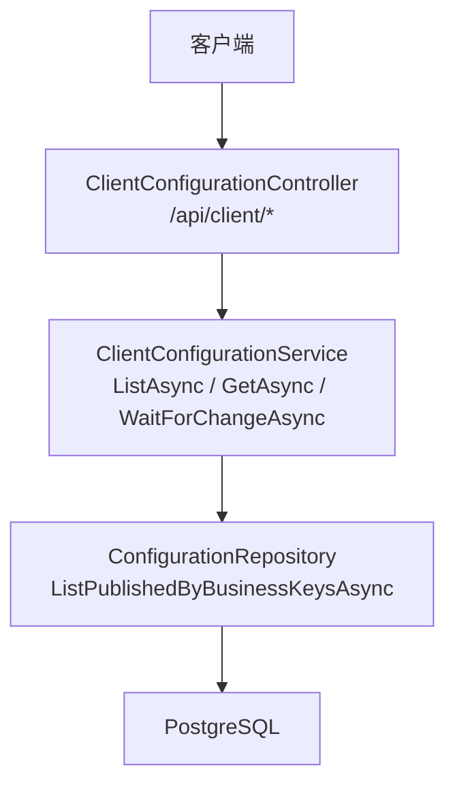
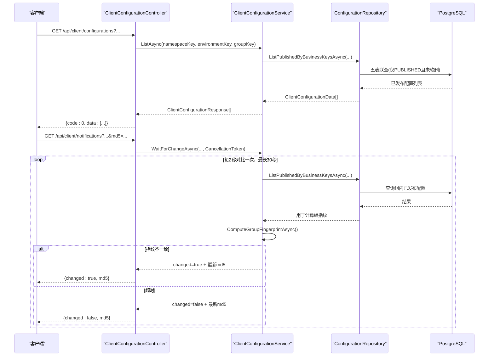
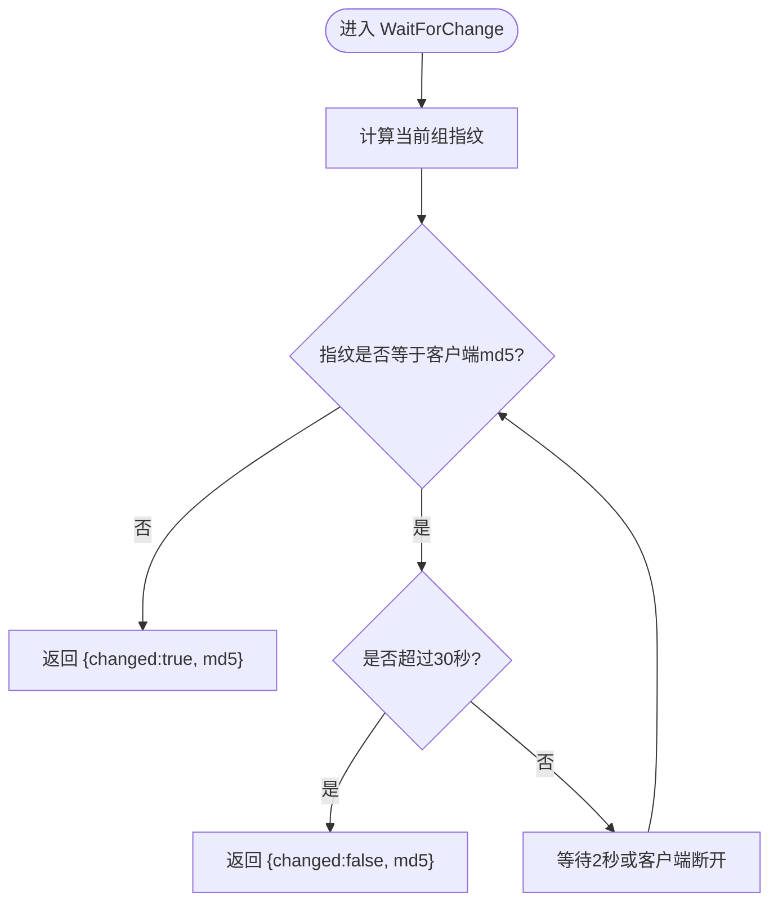
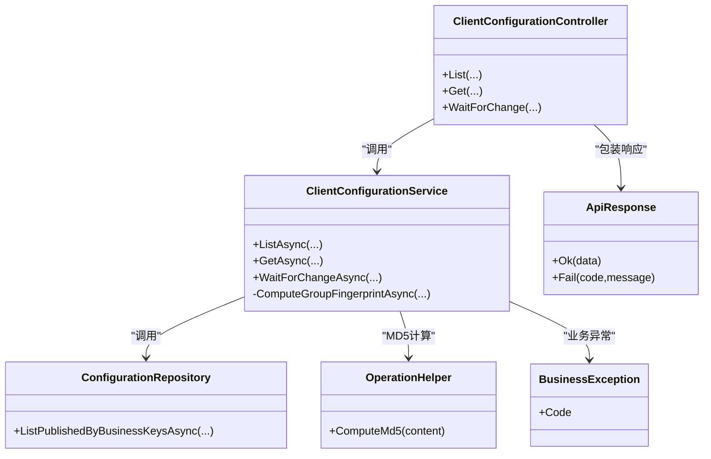

# 客户端API

<cite>
**本文引用的文件**
- [ClientConfigurationController.cs](file://k_config_center/src/Controllers/ClientConfigurationController.cs)
- [ClientConfigurationService.cs](file://k_config_center/src/Services/ClientConfigurationService.cs)
- [ConfigurationRepository.cs](file://k_config_center/src/Repositories/ConfigurationRepository.cs)
- [ApiResponse.cs](file://k_config_center/src/Infrastructure/ApiResponse.cs)
- [BusinessException.cs](file://k_config_center/src/Infrastructure/BusinessException.cs)
- [OperationHelper.cs](file://k_config_center/src/Infrastructure/OperationHelper.cs)
- [CommonData.cs](file://k_config_center/src/Models/Domain/CommonData.cs)
- [后端方案.md](file://docs/技术方案/后端方案.md)
- [Program.cs](file://k_config_center/Program.cs)
</cite>

## 目录
1. [简介](#简介)
2. [项目结构](#项目结构)
3. [核心组件](#核心组件)
4. [架构总览](#架构总览)
5. [详细组件分析](#详细组件分析)
6. [依赖关系分析](#依赖关系分析)
7. [性能与优化建议](#性能与优化建议)
8. [故障处理与重试策略](#故障处理与重试策略)
9. [认证、授权与安全](#认证授权与安全)
10. [多语言SDK集成示例与最佳实践](#多语言sdk集成示例与最佳实践)
11. [结论](#结论)

## 简介
本章节面向应用客户端，说明如何通过客户端API获取已发布配置、探测变更以及连接与错误处理约定。客户端接口位于统一前缀 /api/client，仅暴露只读能力：批量拉取、单条拉取、长轮询变更探测。所有响应采用统一包裹 { code, message, data }，HTTP 状态码始终为 200（业务失败通过 code 表达）。

## 项目结构
客户端读取链路从控制器到服务层再到数据访问层，职责清晰、分层明确：
- 控制器：接收请求参数，调用服务并返回统一响应
- 服务：封装业务规则（如组指纹计算、长轮询挂起）
- 仓库：执行五表联查，仅返回已发布且未软删的配置快照

图表来源
- [ClientConfigurationController.cs:7-45](file://k_config_center/src/Controllers/ClientConfigurationController.cs#L7-L45)
- [ClientConfigurationService.cs:7-54](file://k_config_center/src/Services/ClientConfigurationService.cs#L7-L54)
- [ConfigurationRepository.cs:105-124](file://k_config_center/src/Repositories/ConfigurationRepository.cs#L105-L124)

章节来源
- [后端方案.md:581-595](file://docs/技术方案/后端方案.md#L581-L595)
- [ClientConfigurationController.cs:7-45](file://k_config_center/src/Controllers/ClientConfigurationController.cs#L7-L45)

## 核心组件
- 控制器：提供三个端点
  - GET /api/client/configurations?namespaceKey=&environmentKey=&groupKey= 批量拉取
  - GET /api/client/configurations/{configurationKey}?namespaceKey=&environmentKey=&groupKey= 单条拉取
  - GET /api/client/notifications?namespaceKey=&environmentKey=&groupKey=&md5= 长轮询变更探测
- 服务：实现组指纹计算、长轮询挂起与取消、异常转换
- 仓库：按业务 key 定位命名空间/环境/组，仅返回 PUBLISHED 且未软删的配置项，内容取自生效版本快照

章节来源
- [ClientConfigurationController.cs:13-45](file://k_config_center/src/Controllers/ClientConfigurationController.cs#L13-L45)
- [ClientConfigurationService.cs:11-54](file://k_config_center/src/Services/ClientConfigurationService.cs#L11-L54)
- [ConfigurationRepository.cs:105-124](file://k_config_center/src/Repositories/ConfigurationRepository.cs#L105-L124)

## 架构总览
客户端读取流程如下：
- 批量/单条拉取：控制器绑定参数 → 服务调用仓库进行五表联查 → 返回已发布配置的 key、content、format、md5、versionNumber
- 长轮询：控制器传入 CancellationToken → 服务循环计算组指纹并与客户端 md5 对比 → 不一致立即返回 changed=true；一致则挂起最长 30 秒后返回 changed=false；客户端断开时由 token 取消

图表来源
- [ClientConfigurationController.cs:19-45](file://k_config_center/src/Controllers/ClientConfigurationController.cs#L19-L45)
- [ClientConfigurationService.cs:31-54](file://k_config_center/src/Services/ClientConfigurationService.cs#L31-L54)
- [ConfigurationRepository.cs:105-124](file://k_config_center/src/Repositories/ConfigurationRepository.cs#L105-L124)

## 详细组件分析

### 批量拉取已发布配置
- 路径：GET /api/client/configurations
- 查询参数：namespaceKey、environmentKey、groupKey
- 行为：仅返回 status='PUBLISHED' 且未软删的配置项，内容来自 published_version_id 指向的版本快照
- 返回 data：数组，每项包含 configurationKey、content、format、md5、versionNumber
- 错误：若组不存在或无已发布配置，data 为空数组；单条拉取不存在时返回业务错误码 10002

章节来源
- [ClientConfigurationController.cs:13-21](file://k_config_center/src/Controllers/ClientConfigurationController.cs#L13-L21)
- [ClientConfigurationService.cs:11-17](file://k_config_center/src/Services/ClientConfigurationService.cs#L11-L17)
- [ConfigurationRepository.cs:105-124](file://k_config_center/src/Repositories/ConfigurationRepository.cs#L105-L124)

### 单条拉取已发布配置
- 路径：GET /api/client/configurations/{configurationKey}
- 查询参数：namespaceKey、environmentKey、groupKey
- 行为：同批量拉取的可见性规则；不存在或未发布返回 10002
- 返回 data：单个对象，字段同上

章节来源
- [ClientConfigurationController.cs:23-32](file://k_config_center/src/Controllers/ClientConfigurationController.cs#L23-L32)
- [ClientConfigurationService.cs:19-25](file://k_config_center/src/Services/ClientConfigurationService.cs#L19-L25)

### 长轮询变更探测
- 路径：GET /api/client/notifications
- 查询参数：namespaceKey、environmentKey、groupKey、md5（可选，首次可不传）
- 行为：
  - 服务端计算“组指纹”：将组内全部已发布配置按 key 排序拼接 "key=md5" 后整体求 MD5
  - 若指纹与客户端 md5 不一致，立即返回 changed=true 与最新 md5
  - 若一致，挂起最长 30 秒，期间每 2 秒对比一次；超时返回 changed=false 与最新 md5
  - 客户端断开时通过 CancellationToken 立即结束挂起
- 返回 data：{ changed: boolean, md5: string }

图表来源
- [ClientConfigurationService.cs:27-54](file://k_config_center/src/Services/ClientConfigurationService.cs#L27-L54)

章节来源
- [ClientConfigurationController.cs:34-45](file://k_config_center/src/Controllers/ClientConfigurationController.cs#L34-L45)
- [ClientConfigurationService.cs:27-54](file://k_config_center/src/Services/ClientConfigurationService.cs#L27-L54)

### 组指纹计算
- 目的：保证任一配置发布/回滚/下线/删除都能触发变更通知
- 算法：读取组内已发布配置的 key 与生效版本 md5，按 key 排序拼接后整体求 MD5
- 空组也有确定指纹（空串 MD5），确保“最后一个配置被删除”也能触发通知

章节来源
- [ClientConfigurationService.cs:46-54](file://k_config_center/src/Services/ClientConfigurationService.cs#L46-L54)
- [ConfigurationRepository.cs:105-124](file://k_config_center/src/Repositories/ConfigurationRepository.cs#L105-L124)

## 依赖关系分析
- 控制器依赖服务，服务依赖仓库，仓库直接访问数据库
- 统一响应包装 ApiResponse 在控制器层使用
- 业务异常 BusinessException 在服务层抛出，由全局中间件转换为统一错误响应
- 工具 OperationHelper 提供 MD5 计算等通用能力

图表来源
- [ClientConfigurationController.cs:7-45](file://k_config_center/src/Controllers/ClientConfigurationController.cs#L7-L45)
- [ClientConfigurationService.cs:7-54](file://k_config_center/src/Services/ClientConfigurationService.cs#L7-L54)
- [ConfigurationRepository.cs:105-124](file://k_config_center/src/Repositories/ConfigurationRepository.cs#L105-L124)
- [ApiResponse.cs:1-10](file://k_config_center/src/Infrastructure/ApiResponse.cs#L1-L10)
- [BusinessException.cs:1-11](file://k_config_center/src/Infrastructure/BusinessException.cs#L1-L11)
- [OperationHelper.cs:1-30](file://k_config_center/src/Infrastructure/OperationHelper.cs#L1-L30)

章节来源
- [ClientConfigurationController.cs:7-45](file://k_config_center/src/Controllers/ClientConfigurationController.cs#L7-L45)
- [ClientConfigurationService.cs:7-54](file://k_config_center/src/Services/ClientConfigurationService.cs#L7-L54)
- [ConfigurationRepository.cs:105-124](file://k_config_center/src/Repositories/ConfigurationRepository.cs#L105-L124)
- [ApiResponse.cs:1-10](file://k_config_center/src/Infrastructure/ApiResponse.cs#L1-L10)
- [BusinessException.cs:1-11](file://k_config_center/src/Infrastructure/BusinessException.cs#L1-L11)
- [OperationHelper.cs:1-30](file://k_config_center/src/Infrastructure/OperationHelper.cs#L1-L30)

## 性能与优化建议
- 长轮询挂起不阻塞线程池：使用 CancellationToken + Task.Delay，避免占用工作线程
- 组指纹计算仅在每次轮询周期执行一次，减少重复计算
- 批量拉取优先于多次单条拉取，减少网络往返
- 客户端缓存本地 md5，仅在 changed=true 时重新拉取
- 合理设置轮询间隔与超时：默认 2 秒检查、最长 30 秒超时，可根据业务容忍度调整
- 避免频繁重连：断线重连采用指数退避，防止雪崩

[本节为通用指导，不直接分析具体文件]

## 故障处理与重试策略
- 统一响应结构：{ code, message, data }，HTTP 始终 200；业务失败通过 code 表达
- 常见错误码：
  - 0：成功
  - 10000：服务器内部错误
  - 10002：资源不存在（单条拉取时配置不存在或未发布）
- 长轮询取消：客户端断开时，服务端通过 RequestAborted 取消挂起，不写响应
- 重试策略：
  - 网络错误：指数退避重试，限制最大重试次数
  - 业务错误 10002：提示用户或降级处理，不建议无限重试
  - 长轮询超时：客户端应主动重新发起请求以刷新 md5

章节来源
- [ApiResponse.cs:1-10](file://k_config_center/src/Infrastructure/ApiResponse.cs#L1-L10)
- [BusinessException.cs:1-11](file://k_config_center/src/Infrastructure/BusinessException.cs#L1-L11)
- [Program.cs:71-94](file://k_config_center/Program.cs#L71-L94)
- [后端方案.md:463-496](file://docs/技术方案/后端方案.md#L463-L496)

## 认证、授权与安全
- 阶段一未引入用户体系：操作人从请求头 X-Operator 提取，缺省为 system
- 客户端接口为只读，无需鉴权；管理端接口需遵循 X-Operator 约定
- 安全建议：
  - 生产环境启用 HTTPS
  - 通过网关或反向代理限制来源 IP
  - 对敏感配置内容加密传输与存储
  - 审计日志记录 operator 与 client_ip_address

章节来源
- [OperationHelper.cs:14-20](file://k_config_center/src/Infrastructure/OperationHelper.cs#L14-L20)
- [后端方案.md:597-603](file://docs/技术方案/后端方案.md#L597-L603)

## 多语言SDK集成示例与最佳实践
以下为各语言 SDK 的集成要点与最佳实践（基于现有 API 契约）：

- 通用约定
  - 基础 URL：http(s)://{host}/api/client
  - 参数：namespaceKey、environmentKey、groupKey 必须提供；md5 可选
  - 响应：统一 { code, message, data }，data 为数组或对象
  - 错误：code != 0 表示失败，message 为人类可读描述

- 批量拉取
  - 方法：GET
  - 路径：/configurations
  - 参数：namespaceKey、environmentKey、groupKey
  - 返回：data 为数组，每项含 configurationKey、content、format、md5、versionNumber

- 单条拉取
  - 方法：GET
  - 路径：/configurations/{configurationKey}
  - 参数：namespaceKey、environmentKey、groupKey
  - 返回：data 为对象，字段同上

- 长轮询
  - 方法：GET
  - 路径：/notifications
  - 参数：namespaceKey、environmentKey、groupKey、md5（可选）
  - 返回：data 为 { changed: boolean, md5: string }
  - 行为：changed=true 时重新拉取配置；changed=false 时等待下一次轮询

- 最佳实践
  - 启动时先批量拉取并缓存本地 md5
  - 使用长轮询探测变更，避免频繁轮询
  - 断线重连采用指数退避，避免雪崩
  - 对 content 进行格式解析（text/json/yaml/properties）
  - 记录关键事件日志以便排查

[本节为概念性指导，不直接分析具体文件]

## 结论
客户端API提供简洁稳定的只读能力：批量/单条拉取已发布配置与长轮询变更探测。通过统一响应结构与错误码、非阻塞长轮询、组指纹机制，确保高效可靠的配置同步。结合缓存、重试与限流策略，可在高并发场景下保持稳定。后续可演进为事件驱动的通知机制以提升实时性。

[本节为总结，不直接分析具体文件]