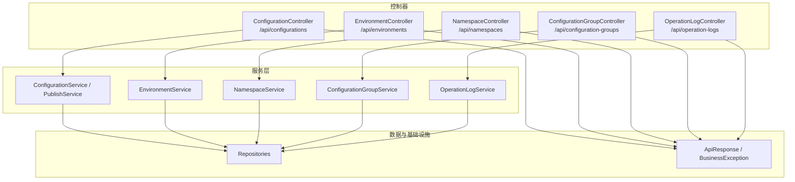
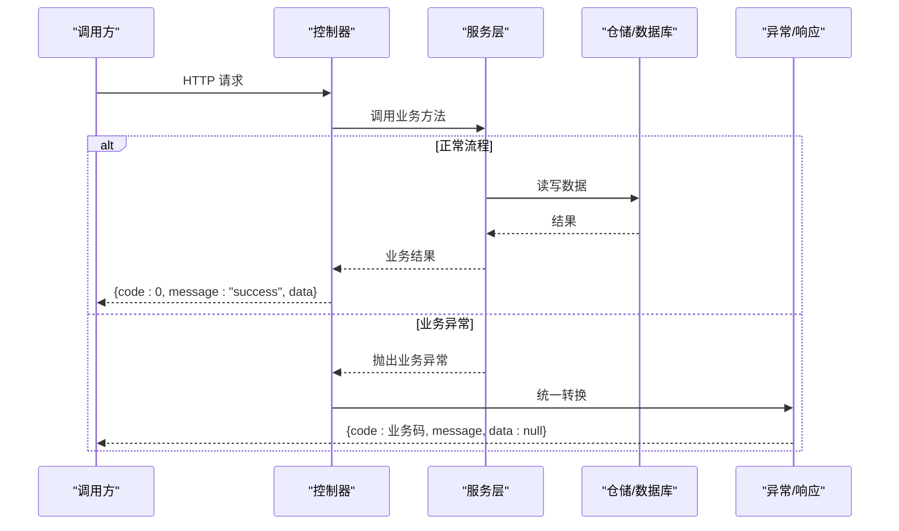
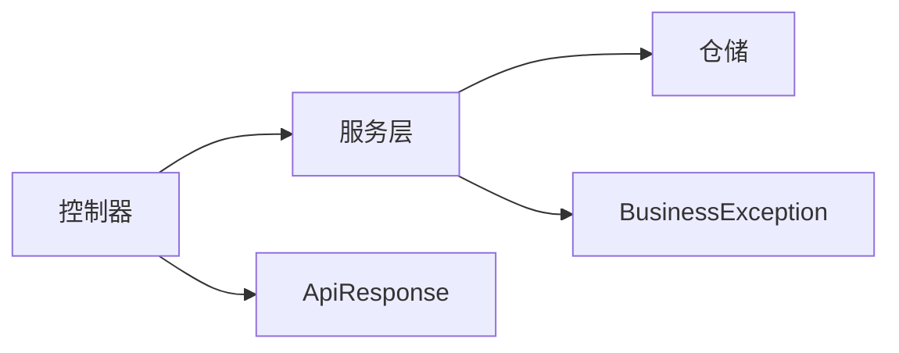

# 管理端API

<cite>
**本文引用的文件**
- [ConfigurationController.cs](file://k_config_center/src/Controllers/ConfigurationController.cs)
- [EnvironmentController.cs](file://k_config_center/src/Controllers/EnvironmentController.cs)
- [NamespaceController.cs](file://k_config_center/src/Controllers/NamespaceController.cs)
- [ConfigurationGroupController.cs](file://k_config_center/src/Controllers/ConfigurationGroupController.cs)
- [OperationLogController.cs](file://k_config_center/src/Controllers/OperationLogController.cs)
- [ConfigurationRequests.cs](file://k_config_center/src/Models/Requests/ConfigurationRequests.cs)
- [EnvironmentRequests.cs](file://k_config_center/src/Models/Requests/EnvironmentRequests.cs)
- [NamespaceRequests.cs](file://k_config_center/src/Models/Requests/NamespaceRequests.cs)
- [ConfigurationGroupRequests.cs](file://k_config_center/src/Models/Requests/ConfigurationGroupRequests.cs)
- [ConfigurationResponses.cs](file://k_config_center/src/Models/Responses/ConfigurationResponses.cs)
- [CommonResponses.cs](file://k_config_center/src/Models/Responses/CommonResponses.cs)
- [ApiResponse.cs](file://k_config_center/src/Infrastructure/ApiResponse.cs)
- [BusinessException.cs](file://k_config_center/src/Infrastructure/BusinessException.cs)
- [后端方案.md](file://docs/技术方案/后端方案.md)
</cite>

## 目录
1. [简介](#简介)
2. [项目结构](#项目结构)
3. [核心组件](#核心组件)
4. [架构总览](#架构总览)
5. [详细接口说明](#详细接口说明)
6. [依赖关系分析](#依赖关系分析)
7. [性能与一致性](#性能与一致性)
8. [故障排查指南](#故障排查指南)
9. [结论](#结论)
10. [附录：错误码与最佳实践](#附录错误码与最佳实践)

## 简介
本文件为配置中心“管理端”的API文档，覆盖命名空间、环境、配置组、配置项（含发布/回滚/下线/版本历史）以及操作审计等全部管理端能力。所有接口统一返回 { code, message, data } 结构体，HTTP 状态码固定为 200，业务错误通过 code 表达；删除均为软删除，列表默认过滤已删除记录。

## 项目结构
管理端API由多个控制器组成，每个控制器负责一个资源域，仅做参数接收、调用服务层并包装 ApiResponse。请求与响应模型位于 Models/Requests 与 Models/Responses，统一错误封装在 Infrastructure。

图表来源
- [ConfigurationController.cs:1-115](file://k_config_center/src/Controllers/ConfigurationController.cs#L1-L115)
- [EnvironmentController.cs:1-52](file://k_config_center/src/Controllers/EnvironmentController.cs#L1-L52)
- [NamespaceController.cs:1-50](file://k_config_center/src/Controllers/NamespaceController.cs#L1-L50)
- [ConfigurationGroupController.cs:1-53](file://k_config_center/src/Controllers/ConfigurationGroupController.cs#L1-L53)
- [OperationLogController.cs:1-31](file://k_config_center/src/Controllers/OperationLogController.cs#L1-L31)
- [ApiResponse.cs:1-10](file://k_config_center/src/Infrastructure/ApiResponse.cs#L1-L10)
- [BusinessException.cs:1-11](file://k_config_center/src/Infrastructure/BusinessException.cs#L1-L11)

章节来源
- [ConfigurationController.cs:1-115](file://k_config_center/src/Controllers/ConfigurationController.cs#L1-L115)
- [EnvironmentController.cs:1-52](file://k_config_center/src/Controllers/EnvironmentController.cs#L1-L52)
- [NamespaceController.cs:1-50](file://k_config_center/src/Controllers/NamespaceController.cs#L1-L50)
- [ConfigurationGroupController.cs:1-53](file://k_config_center/src/Controllers/ConfigurationGroupController.cs#L1-L53)
- [OperationLogController.cs:1-31](file://k_config_center/src/Controllers/OperationLogController.cs#L1-L31)
- [ApiResponse.cs:1-10](file://k_config_center/src/Infrastructure/ApiResponse.cs#L1-L10)
- [BusinessException.cs:1-11](file://k_config_center/src/Infrastructure/BusinessException.cs#L1-L11)

## 核心组件
- 统一响应：所有接口返回 { code, message, data }，成功时 code=0；业务异常会转换为该结构，HTTP 始终 200。
- 软删除：所有 DELETE 均写 deleted_at，不物理删除；列表查询默认排除已删除记录。
- 权限控制：当前代码未实现鉴权中间件或访问限制，建议在生产部署前接入网关或框架级鉴权（如基于角色/资源的授权）。
- 并发与事务：发布/回滚/下线等关键路径使用事务保证原子性，并发冲突会返回特定错误码以便客户端重试。

章节来源
- [ApiResponse.cs:1-10](file://k_config_center/src/Infrastructure/ApiResponse.cs#L1-L10)
- [BusinessException.cs:1-11](file://k_config_center/src/Infrastructure/BusinessException.cs#L1-L11)
- [后端方案.md:482-509](file://docs/技术方案/后端方案.md#L482-L509)

## 架构总览
管理端API遵循“控制器薄、服务重、仓储持久化”的分层设计。控制器只负责路由与参数绑定，业务逻辑集中在 Service，数据访问在 Repository。统一错误处理将业务异常转为标准响应。

图表来源
- [ConfigurationController.cs:1-115](file://k_config_center/src/Controllers/ConfigurationController.cs#L1-L115)
- [ApiResponse.cs:1-10](file://k_config_center/src/Infrastructure/ApiResponse.cs#L1-L10)
- [BusinessException.cs:1-11](file://k_config_center/src/Infrastructure/BusinessException.cs#L1-L11)

## 详细接口说明

### 通用约定
- 基础URL：/api
- 响应格式：{ code, message, data }
- 分页：data.items 为数组，data.total 为总数
- 时间：UTC
- 删除：软删除
- 鉴权：当前未内置，需外部接入

章节来源
- [ApiResponse.cs:1-10](file://k_config_center/src/Infrastructure/ApiResponse.cs#L1-L10)
- [CommonResponses.cs:1-52](file://k_config_center/src/Models/Responses/CommonResponses.cs#L1-L52)
- [后端方案.md:482-509](file://docs/技术方案/后端方案.md#L482-L509)

---

### 命名空间管理（/api/namespaces）
- GET /api/namespaces
  - 描述：获取命名空间列表（全量，后续演进分页）
  - 查询参数：无
  - 响应：data 为 NamespaceResponse[]
- POST /api/namespaces
  - 描述：创建命名空间
  - 请求体：NamespaceCreateRequest
  - 约束：namespaceKey 全局唯一（忽略软删除），重复返回 20001；创建后 key 不可改
  - 响应：data 为新建的 NamespaceResponse
- PUT /api/namespaces/{id}
  - 描述：更新名称/描述/状态
  - 路径参数：id
  - 请求体：NamespaceUpdateRequest
  - 约束：key 不可改；不存在或已软删除返回 10002
  - 响应：data=null
- DELETE /api/namespaces/{id}
  - 描述：软删除
  - 路径参数：id
  - 约束：存在未删除的下级环境拒绝并返回 20004
  - 响应：data=null

章节来源
- [NamespaceController.cs:1-50](file://k_config_center/src/Controllers/NamespaceController.cs#L1-L50)
- [NamespaceRequests.cs:1-14](file://k_config_center/src/Models/Requests/NamespaceRequests.cs#L1-L14)
- [后端方案.md:482-509](file://docs/技术方案/后端方案.md#L482-L509)

---

### 环境管理（/api/environments）
- GET /api/environments
  - 描述：按命名空间筛选环境列表（按 sort_order 升序）
  - 查询参数：namespaceId（可选）
  - 响应：data 为 EnvironmentResponse[]
- POST /api/environments
  - 描述：创建环境
  - 请求体：EnvironmentCreateRequest
  - 约束：environmentKey 在同命名空间内唯一（忽略软删除），重复返回 20002；创建后 key 与所属命名空间不可改
  - 响应：data 为新建的 EnvironmentResponse
- PUT /api/environments/{id}
  - 描述：更新名称/描述/排序/状态
  - 路径参数：id
  - 请求体：EnvironmentUpdateRequest
  - 约束：key 与所属命名空间不可改；不存在或已软删除返回 10002
  - 响应：data=null
- DELETE /api/environments/{id}
  - 描述：软删除
  - 路径参数：id
  - 约束：存在未删除的下级配置组拒绝并返回 20004
  - 响应：data=null

章节来源
- [EnvironmentController.cs:1-52](file://k_config_center/src/Controllers/EnvironmentController.cs#L1-L52)
- [EnvironmentRequests.cs:1-17](file://k_config_center/src/Models/Requests/EnvironmentRequests.cs#L1-L17)
- [后端方案.md:482-509](file://docs/技术方案/后端方案.md#L482-L509)

---

### 配置组管理（/api/configuration-groups）
- GET /api/configuration-groups
  - 描述：按命名空间/环境筛选配置组列表
  - 查询参数：namespaceId（可选）、environmentId（可选）
  - 响应：data 为 ConfigurationGroupResponse[]
- POST /api/configuration-groups
  - 描述：创建配置组
  - 请求体：ConfigurationGroupCreateRequest
  - 约束：groupKey 在同环境内唯一（忽略软删除），重复返回 20003；创建后 key 与所属环境不可改
  - 响应：data 为新建的 ConfigurationGroupResponse
- PUT /api/configuration-groups/{id}
  - 描述：更新名称/描述/状态
  - 路径参数：id
  - 请求体：ConfigurationGroupUpdateRequest
  - 约束：key 与所属环境不可改；不存在或已软删除返回 10002
  - 响应：data=null
- DELETE /api/configuration-groups/{id}
  - 描述：软删除
  - 路径参数：id
  - 约束：存在未删除的配置项拒绝并返回 20004
  - 响应：data=null

章节来源
- [ConfigurationGroupController.cs:1-53](file://k_config_center/src/Controllers/ConfigurationGroupController.cs#L1-L53)
- [ConfigurationGroupRequests.cs:1-16](file://k_config_center/src/Models/Requests/ConfigurationGroupRequests.cs#L1-L16)
- [后端方案.md:482-509](file://docs/技术方案/后端方案.md#L482-L509)

---

### 配置项管理（/api/configurations）
- GET /api/configurations
  - 描述：配置项列表（当前编辑态，附 hasUnpublishedChange 标记；已软删除不返回）
  - 查询参数：groupId（可选）、namespaceId（可选）、environmentId（可选）、status（DRAFT/PUBLISHED/OFFLINE，可选）、keyword（按 key 模糊匹配，可选）
  - 响应：data 为 ConfigurationResponse[]
- GET /api/configurations/{id}
  - 描述：配置详情（当前编辑态 + 生效版本快照；从未发布过 publishedVersion 为 null）
  - 路径参数：id
  - 响应：data 为 ConfigurationDetailResponse
  - 错误：不存在或已软删除返回 10002
- POST /api/configurations
  - 描述：新建配置（初始 DRAFT，版本号 0；md5 服务端计算）
  - 请求体：ConfigurationCreateRequest
  - 约束：configurationKey 在同组内唯一，重复返回 30001
  - 响应：data 为新建的 ConfigurationResponse
- PUT /api/configurations/{id}
  - 描述：保存编辑（草稿），不产生版本、不改变 status
  - 路径参数：id
  - 请求体：ConfigurationUpdateRequest
  - 错误：目标不存在返回 10002
  - 响应：data=null
- DELETE /api/configurations/{id}
  - 描述：软删除（保留版本快照与审计日志）
  - 路径参数：id
  - 响应：data=null
- POST /api/configurations/{id}/publish
  - 描述：发布配置（事务：版本号+1 → 写版本快照 → 更新生效指针 → 写审计日志）
  - 路径参数：id
  - 请求体：PublishRequest
  - 错误：无未发布变更返回 30002；并发冲突返回 30004（可重试）
  - 响应：data 为 PublishResponse
- POST /api/configurations/{id}/rollback
  - 描述：以目标历史版本内容重新发布（生成 ROLLBACK 类型新版本，版本号线性递增）
  - 路径参数：id
  - 请求体：RollbackRequest
  - 错误：目标版本不存在返回 30003
  - 响应：data 为 PublishResponse
- POST /api/configurations/{id}/offline
  - 描述：下线配置（status 置 OFFLINE，仅 PUBLISHED 可下线）
  - 路径参数：id
  - 错误：非 PUBLISHED 返回 10001
  - 响应：data=null
- GET /api/configurations/{id}/versions
  - 描述：版本历史列表（按 version_number 倒序分页）
  - 路径参数：id
  - 查询参数：pageIndex（默认1）、pageSize（默认20）
  - 响应：data 为 PageResponse<ConfigurationVersionResponse>
- GET /api/configurations/{id}/versions/{versionNumber}
  - 描述：单个版本快照
  - 路径参数：id、versionNumber
  - 错误：版本不存在返回 10002
  - 响应：data 为 ConfigurationVersionResponse

章节来源
- [ConfigurationController.cs:1-115](file://k_config_center/src/Controllers/ConfigurationController.cs#L1-L115)
- [ConfigurationRequests.cs:1-27](file://k_config_center/src/Models/Requests/ConfigurationRequests.cs#L1-L27)
- [ConfigurationResponses.cs:1-75](file://k_config_center/src/Models/Responses/ConfigurationResponses.cs#L1-L75)
- [后端方案.md:482-509](file://docs/技术方案/后端方案.md#L482-L509)

---

### 操作审计（/api/operation-logs）
- GET /api/operation-logs
  - 描述：操作日志分页列表（多维度检索，按创建时间倒序；时间区间闭开区间 [startTime, endTime)）
  - 查询参数：namespaceId（可选）、environmentId（可选）、groupId（可选）、configurationId（可选）、operation（CREATE/UPDATE/PUBLISH/ROLLBACK/OFFLINE/DELETE，可选）、operator（模糊匹配，可选）、startTime（可选）、endTime（可选）、pageIndex（默认1）、pageSize（默认20）
  - 响应：data 为 PageResponse<OperationLogResponse>

章节来源
- [OperationLogController.cs:1-31](file://k_config_center/src/Controllers/OperationLogController.cs#L1-L31)
- [CommonResponses.cs:1-52](file://k_config_center/src/Models/Responses/CommonResponses.cs#L1-L52)

---

### 请求与响应示例（文本描述）
- 成功示例（创建命名空间）
  - 请求：POST /api/namespaces，请求体包含 NamespaceKey、NamespaceName、Description
  - 响应：{ code: 0, message: "success", data: { id, namespaceKey, namespaceName, description, ... } }
- 失败示例（重复 key）
  - 请求：POST /api/namespaces，重复的 NamespaceKey
  - 响应：{ code: 20001, message: "命名空间 key 已存在", data: null }
- 失败示例（资源不存在）
  - 请求：GET /api/configurations/{id}，id 不存在
  - 响应：{ code: 10002, message: "资源不存在", data: null }
- 失败示例（非法状态）
  - 请求：POST /api/configurations/{id}/offline，非 PUBLISHED 状态
  - 响应：{ code: 10001, message: "业务状态非法", data: null }
- 失败示例（并发冲突）
  - 请求：POST /api/configurations/{id}/publish，并发发布
  - 响应：{ code: 30004, message: "发布并发冲突", data: null }

章节来源
- [ApiResponse.cs:1-10](file://k_config_center/src/Infrastructure/ApiResponse.cs#L1-L10)
- [后端方案.md:482-509](file://docs/技术方案/后端方案.md#L482-L509)

---

### 权限控制与访问限制
- 当前代码未内置鉴权与访问控制。建议在网关或应用层增加认证与授权（例如基于角色的访问控制 RBAC），对管理端接口进行保护。
- 建议最小权限原则：不同角色仅开放必要接口；对敏感操作（发布/下线/删除）增加二次确认与审计。

[本节为概念性说明，不直接分析具体文件]

---

### 错误处理策略
- 统一响应：所有接口返回 { code, message, data }，HTTP 固定 200。
- 业务异常：通过 BusinessException 抛出，由全局处理统一转为上述结构。
- 常见错误码：
  - 10000 服务器内部错误
  - 10001 业务状态非法
  - 10002 资源不存在
  - 20001 命名空间 key 冲突
  - 20002 环境 key 冲突
  - 20003 配置组 key 冲突
  - 20004 级联删除冲突
  - 30001 配置 key 冲突
  - 30002 无未发布变更
  - 30003 回滚版本不存在
  - 30004 发布并发冲突

章节来源
- [BusinessException.cs:1-11](file://k_config_center/src/Infrastructure/BusinessException.cs#L1-L11)
- [后端方案.md:482-509](file://docs/技术方案/后端方案.md#L482-L509)

---

### 最佳实践
- 幂等性：创建类接口应确保 key 唯一；重复提交应返回明确错误码。
- 并发安全：发布/回滚等关键路径支持并发冲突码，客户端应退避重试。
- 软删除：删除前先检查下级依赖，避免误删导致不一致。
- 审计：所有变更操作均记录操作日志，便于追溯。
- 校验：服务端计算 md5，不信任前端传值；严格校验必填字段与枚举值。

[本节为通用指导，不直接分析具体文件]

## 依赖关系分析
- 控制器与服务层解耦：控制器仅路由与参数绑定，服务层承载业务规则与事务。
- 仓储抽象：Repository 提供数据访问，便于替换存储实现或扩展查询。
- 统一错误：BusinessException 与 ApiResponse 贯穿全链路，保证对外契约一致。

图表来源
- [ConfigurationController.cs:1-115](file://k_config_center/src/Controllers/ConfigurationController.cs#L1-L115)
- [ApiResponse.cs:1-10](file://k_config_center/src/Infrastructure/ApiResponse.cs#L1-L10)
- [BusinessException.cs:1-11](file://k_config_center/src/Infrastructure/BusinessException.cs#L1-L11)

章节来源
- [ConfigurationController.cs:1-115](file://k_config_center/src/Controllers/ConfigurationController.cs#L1-L115)
- [ApiResponse.cs:1-10](file://k_config_center/src/Infrastructure/ApiResponse.cs#L1-L10)
- [BusinessException.cs:1-11](file://k_config_center/src/Infrastructure/BusinessException.cs#L1-L11)

## 性能与一致性
- 事务边界：发布/回滚/下线等关键操作在事务中执行，保证版本与状态一致性。
- 并发控制：并发冲突返回 30004，客户端应指数退避重试，避免雪崩。
- 列表优化：列表默认过滤已删除记录，减少无效数据；可按维度组合过滤提升查询效率。
- 版本快照：版本不可变，利于回溯与对比；注意存储增长与归档策略。

[本节为通用指导，不直接分析具体文件]

## 故障排查指南
- 常见问题定位：
  - 资源不存在（10002）：检查 id 是否正确、是否已被软删除。
  - 业务状态非法（10001）：检查当前状态是否允许执行该操作（如非 PUBLISHED 不能下线）。
  - 重复 key（2000x/30001）：检查命名空间/环境/配置组/配置项 key 的唯一性约束。
  - 级联删除冲突（20004）：先清理下级资源再删除上级。
  - 无未发布变更（30002）：确认是否存在草稿变更后再发布。
  - 回滚版本不存在（30003）：确认目标版本号是否存在。
  - 并发冲突（30004）：稍后重试，降低并发度。
- 日志与审计：
  - 通过操作日志接口检索相关操作的 operator、时间、IP、详情，辅助定位问题。

章节来源
- [OperationLogController.cs:1-31](file://k_config_center/src/Controllers/OperationLogController.cs#L1-L31)
- [后端方案.md:482-509](file://docs/技术方案/后端方案.md#L482-L509)

## 结论
本管理端API采用清晰的分层设计与统一的响应/错误规范，覆盖命名空间、环境、配置组、配置项及审计等核心能力。生产部署建议补充鉴权与限流，结合审计日志完善可观测性与合规性。

[本节为总结性内容，不直接分析具体文件]

## 附录：错误码与最佳实践
- 错误码分段：
  - 0：成功
  - 10000+：通用错误（服务器内部错误、业务状态非法、资源不存在）
  - 20000+：基础维度（命名空间/环境/配置组 key 冲突、级联删除冲突）
  - 30000+：配置与发布（配置 key 冲突、无未发布变更、回滚版本不存在、发布并发冲突）
- 最佳实践：
  - 客户端对所有非 0 的 code 进行友好提示与重试策略（尤其是 30004）。
  - 对敏感操作启用二次确认与强制审计。
  - 定期归档版本快照与操作日志，控制存储成本。

章节来源
- [后端方案.md:482-509](file://docs/技术方案/后端方案.md#L482-L509)