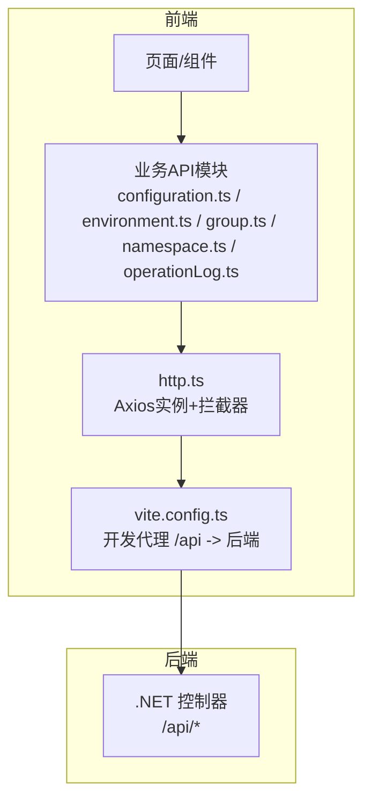
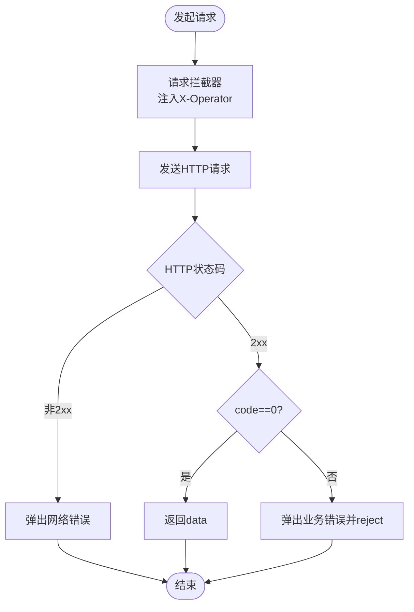
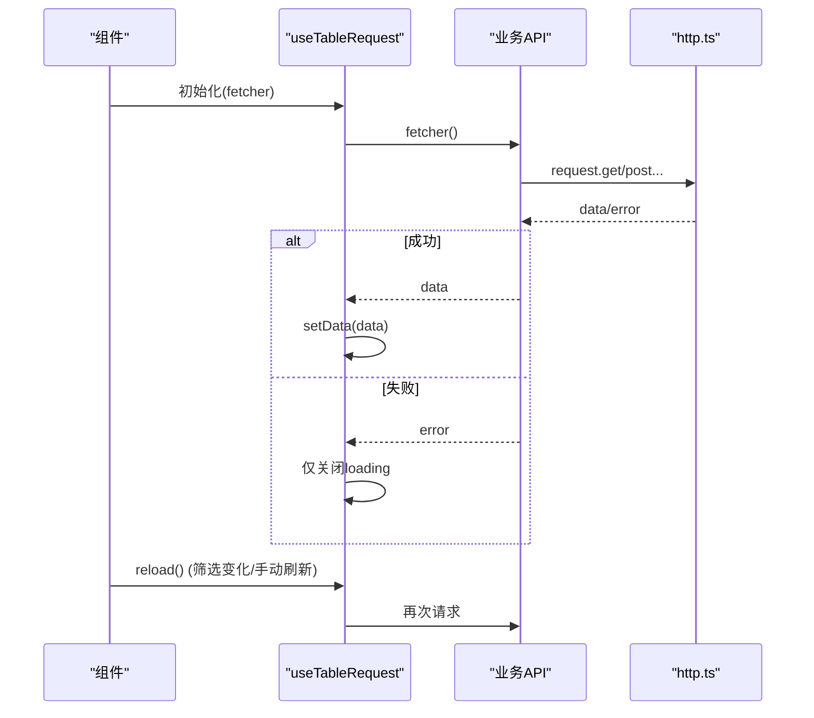
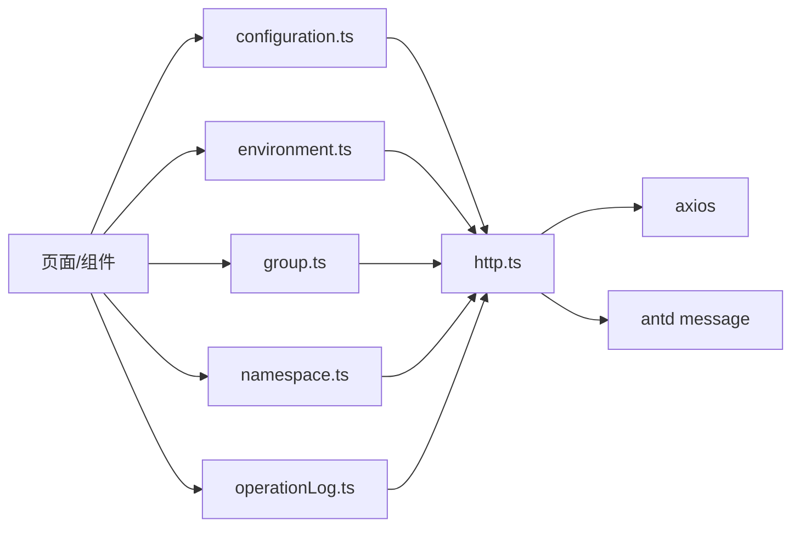

# API集成

<cite>
**本文引用的文件**
- [web/src/api/http.ts](file://web/src/api/http.ts)
- [web/src/api/types.ts](file://web/src/api/types.ts)
- [web/src/api/configuration.ts](file://web/src/api/configuration.ts)
- [web/src/api/environment.ts](file://web/src/api/environment.ts)
- [web/src/api/group.ts](file://web/src/api/group.ts)
- [web/src/api/namespace.ts](file://web/src/api/namespace.ts)
- [web/src/api/operationLog.ts](file://web/src/api/operationLog.ts)
- [web/src/hooks/useTableRequest.ts](file://web/src/hooks/useTableRequest.ts)
- [web/vite.config.ts](file://web/vite.config.ts)
- [web/package.json](file://web/package.json)
</cite>

## 目录
1. [简介](#简介)
2. [项目结构](#项目结构)
3. [核心组件](#核心组件)
4. [架构总览](#架构总览)
5. [详细组件分析](#详细组件分析)
6. [依赖关系分析](#依赖关系分析)
7. [性能考量](#性能考量)
8. [故障排查指南](#故障排查指南)
9. [结论](#结论)
10. [附录](#附录)

## 简介
本文件面向配置中心前端（React + TypeScript）的API集成实现，系统性说明HTTP请求封装、拦截器与错误处理、各业务模块API封装方式、TypeScript类型定义规范、自定义Hook设计模式以及错误处理策略与重试机制建议。目标是帮助开发者快速理解并稳定扩展API调用能力。

## 项目结构
前端API相关代码集中在 web/src/api 与 web/src/hooks：
- api/http.ts：Axios实例、请求/响应拦截器、统一错误提示、通用请求方法薄封装
- api/types.ts：前后端对齐的TypeScript类型定义（请求/响应/分页/枚举等）
- api/*.ts：按后端控制器划分的业务API封装（configuration、environment、group、namespace、operationLog）
- hooks/useTableRequest.ts：通用表格数据加载Hook，封装loading/data/reload三件套
- vite.config.ts：开发代理配置，将 /api 请求转发到后端服务
- package.json：依赖声明（axios、antd等）



图表来源
- [web/src/api/http.ts:1-55](file://web/src/api/http.ts#L1-L55)
- [web/vite.config.ts:12-21](file://web/vite.config.ts#L12-L21)

章节来源
- [web/src/api/http.ts:1-55](file://web/src/api/http.ts#L1-L55)
- [web/vite.config.ts:12-21](file://web/vite.config.ts#L12-L21)
- [web/package.json:11-22](file://web/package.json#L11-L22)

## 核心组件
- Axios实例与拦截器
  - baseURL为/api，超时30秒
  - 请求拦截器：非GET写操作自动注入X-Operator头，值来自localStorage或默认portal
  - 响应拦截器：后端统一返回{code,message,data}，code=0视为成功直接返回data；否则弹出错误并reject
  - 网络层错误：非2xx时优先展示后端message，否则展示网络错误信息
- 通用请求方法
  - request.get/post/put/delete，泛型T表示业务数据类型，调用方无需再解包
- 类型系统
  - ApiResponse/PageResponse/各实体CRUD请求与响应类型，严格对齐后端Models
- 业务API模块
  - configuration、environment、group、namespace、operationLog，分别对应后端控制器路由前缀
- 表格数据Hook
  - useTableRequest提供data/loading/reload，支持防抖式重载与竞态保护

章节来源
- [web/src/api/http.ts:11-52](file://web/src/api/http.ts#L11-L52)
- [web/src/api/types.ts:6-247](file://web/src/api/types.ts#L6-L247)
- [web/src/api/configuration.ts:15-59](file://web/src/api/configuration.ts#L15-L59)
- [web/src/api/environment.ts:4-20](file://web/src/api/environment.ts#L4-L20)
- [web/src/api/group.ts:8-24](file://web/src/api/group.ts#L8-L24)
- [web/src/api/namespace.ts:4-19](file://web/src/api/namespace.ts#L4-L19)
- [web/src/api/operationLog.ts:4-9](file://web/src/api/operationLog.ts#L4-L9)
- [web/src/hooks/useTableRequest.ts:3-37](file://web/src/hooks/useTableRequest.ts#L3-L37)

## 架构总览
下图展示了从页面发起请求到后端响应的完整链路，包括拦截器、类型约束与错误处理。

```mermaid
sequenceDiagram
participant UI as "页面/组件"
participant API as "业务API模块"
participant HTTP as "http.ts"
participant VITE as "vite.config.ts 代理"
participant BE as "后端控制器"
UI->>API : 调用 listConfigurations(...)
API->>HTTP : request.get<T>(url, params)
HTTP->>HTTP : 请求拦截器(注入 X-Operator)
HTTP->>VITE : GET /api/configurations?...
VITE->>BE : 转发到后端
BE-->>VITE : {code,message,data}
VITE-->>HTTP : 响应体
HTTP->>HTTP : 响应拦截器(code=0则返回data; 否则提示错误并reject)
HTTP-->>API : 业务数据 T
API-->>UI : 返回数据供渲染
```

图表来源
- [web/src/api/http.ts:17-39](file://web/src/api/http.ts#L17-L39)
- [web/vite.config.ts:12-21](file://web/vite.config.ts#L12-L21)
- [web/src/api/configuration.ts:18-20](file://web/src/api/configuration.ts#L18-L20)

## 详细组件分析

### HTTP请求封装与拦截器
- 基础配置
  - baseURL=/api，timeout=30s，避免长耗时请求阻塞
- 请求拦截器
  - 非GET写操作自动设置X-Operator头，便于后端审计追踪
- 响应拦截器
  - 业务成功：code=0，直接返回data，调用方只关心业务数据
  - 业务失败：弹出错误提示并reject，上层可捕获处理
  - 网络错误：非2xx时优先使用后端message，兜底显示网络错误
- 通用方法
  - get/post/put/delete均带泛型T，保证类型安全



图表来源
- [web/src/api/http.ts:17-39](file://web/src/api/http.ts#L17-L39)

章节来源
- [web/src/api/http.ts:11-52](file://web/src/api/http.ts#L11-L52)

### 类型定义最佳实践
- 统一响应包装
  - ApiResponse<T>：code/message/data，所有接口遵循此结构
  - PageResponse<T>：items/total，用于分页列表
- 领域类型
  - 命名空间、环境、配置组、配置项、版本、操作日志等均有对应的Response/Create/Update/Query类型
- 枚举与状态
  - ConfigStatus、ChangeType、OperationType等以字面量联合类型表达，增强可读性与校验
- 时间字段
  - 统一使用ISO 8601字符串，避免前端日期解析歧义
- 可选字段
  - 列表展示用的联查字段（如namespaceName、environmentKey）标记为可选，体现后端补充语义

章节来源
- [web/src/api/types.ts:6-247](file://web/src/api/types.ts#L6-L247)

### 业务模块API封装
- 配置项（configuration.ts）
  - 列表：listConfigurations(params)，支持namespaceId/environmentId/groupId/status/keyword过滤
  - 详情：getConfiguration(id)，返回当前编辑态与生效版本快照
  - 创建/更新/删除：create/update/delete
  - 发布/回滚/下线：publishConfiguration/rollbackConfiguration/offlineConfiguration
  - 版本历史：listVersions/getVersion
- 环境（environment.ts）
  - 列表：listEnvironments(namespaceId?)，按sortOrder升序
  - 创建/更新/删除：create/update/delete
- 配置组（group.ts）
  - 列表：listGroups({namespaceId?, environmentId?})
  - 创建/更新/删除：create/update/delete
- 命名空间（namespace.ts）
  - 列表：listNamespaces()
  - 创建/更新/删除：create/update/delete
- 操作日志（operationLog.ts）
  - 分页查询：listOperationLogs(params)，支持operator/time/page参数

章节来源
- [web/src/api/configuration.ts:15-59](file://web/src/api/configuration.ts#L15-L59)
- [web/src/api/environment.ts:4-20](file://web/src/api/environment.ts#L4-L20)
- [web/src/api/group.ts:8-24](file://web/src/api/group.ts#L8-L24)
- [web/src/api/namespace.ts:4-19](file://web/src/api/namespace.ts#L4-L19)
- [web/src/api/operationLog.ts:4-9](file://web/src/api/operationLog.ts#L4-L9)

### 自定义Hook：useTableRequest
- 设计目标
  - 封装表格数据加载的loading/data/reload三件套，减少重复逻辑
- 行为特性
  - 首次挂载与fetcher变化时自动触发reload
  - 使用requestIdRef防止竞态：仅最新一次请求的结果能更新state
  - 错误已由http拦截器统一提示，Hook内部catch后仅收尾loading
- 使用建议
  - fetcher建议使用useCallback包裹，确保依赖变化时正确重新加载
  - 适用于分页、筛选条件变化的场景



图表来源
- [web/src/hooks/useTableRequest.ts:7-37](file://web/src/hooks/useTableRequest.ts#L7-L37)
- [web/src/api/http.ts:25-39](file://web/src/api/http.ts#L25-L39)

章节来源
- [web/src/hooks/useTableRequest.ts:1-38](file://web/src/hooks/useTableRequest.ts#L1-L38)

### 开发与部署代理
- 开发阶段
  - vite.config.ts中配置了/api代理到http://localhost:9002，解决跨域问题
- 构建产物
  - 构建输出到../k_config_center/wwwroot，便于单一应用部署

章节来源
- [web/vite.config.ts:12-25](file://web/vite.config.ts#L12-L25)

## 依赖关系分析
- 运行时依赖
  - axios：HTTP客户端
  - antd：消息提示（message.error）
  - react/react-dom：UI框架
- 构建与工具
  - vite：开发服务器与构建
  - typescript：类型检查
- 模块依赖图



图表来源
- [web/src/api/configuration.ts:1-20](file://web/src/api/configuration.ts#L1-L20)
- [web/src/api/environment.ts:1-9](file://web/src/api/environment.ts#L1-L9)
- [web/src/api/group.ts:1-12](file://web/src/api/group.ts#L1-L12)
- [web/src/api/namespace.ts:1-8](file://web/src/api/namespace.ts#L1-L8)
- [web/src/api/operationLog.ts:1-8](file://web/src/api/operationLog.ts#L1-L8)
- [web/src/api/http.ts:1-14](file://web/src/api/http.ts#L1-L14)

章节来源
- [web/package.json:11-22](file://web/package.json#L11-L22)

## 性能考量
- 超时与重试
  - 当前未启用全局重试，建议在http.ts中基于axios重试插件或自定义拦截器实现指数退避重试，针对幂等GET请求更合适
- 并发控制
  - 对高频列表刷新可使用节流/防抖，结合useTableRequest的竞态保护避免覆盖
- 缓存策略
  - 对不频繁变更的数据（如命名空间、环境、配置组列表）可引入内存缓存或SWR/React Query，减少重复请求
- 传输优化
  - 列表接口按需分页，避免一次性拉取全量
- 资源体积
  - 按需引入antd组件，减少打包体积

[本节为通用指导，不直接分析具体文件]

## 故障排查指南
- 常见错误定位
  - 业务错误：响应拦截器会弹出message，检查后端返回的code与message
  - 网络错误：检查代理配置与后端服务是否启动
  - 权限/审计：确认X-Operator头是否正确注入（非GET写操作）
- 调试步骤
  - 浏览器Network面板查看请求URL、请求头、响应体
  - 在http.ts响应拦截器处打断点，观察body.code与error.response.data.message
  - 确认vite代理target与后端端口一致
- 常见问题
  - 跨域：确保开发模式下通过vite代理访问/api
  - 类型不匹配：核对types.ts中的字段是否与后端一致
  - 列表不刷新：检查useTableRequest的fetcher依赖是否变化

章节来源
- [web/src/api/http.ts:17-39](file://web/src/api/http.ts#L17-L39)
- [web/vite.config.ts:12-21](file://web/vite.config.ts#L12-L21)

## 结论
本项目的前端API集成采用“统一Axios实例+拦截器+类型化业务模块”的分层设计，配合useTableRequest Hook实现了稳定的表格数据加载体验。通过严格的TypeScript类型定义与统一的错误处理策略，降低了出错概率与维护成本。后续可在不侵入业务代码的前提下，扩展重试、缓存、监控等横切能力。

## 附录
- 关键路径速查
  - Axios与拦截器：[web/src/api/http.ts](file://web/src/api/http.ts)
  - 类型定义：[web/src/api/types.ts](file://web/src/api/types.ts)
  - 配置项API：[web/src/api/configuration.ts](file://web/src/api/configuration.ts)
  - 环境API：[web/src/api/environment.ts](file://web/src/api/environment.ts)
  - 配置组API：[web/src/api/group.ts](file://web/src/api/group.ts)
  - 命名空间API：[web/src/api/namespace.ts](file://web/src/api/namespace.ts)
  - 操作日志API：[web/src/api/operationLog.ts](file://web/src/api/operationLog.ts)
  - 表格数据Hook：[web/src/hooks/useTableRequest.ts](file://web/src/hooks/useTableRequest.ts)
  - 开发代理：[web/vite.config.ts](file://web/vite.config.ts)
  - 依赖清单：[web/package.json](file://web/package.json)