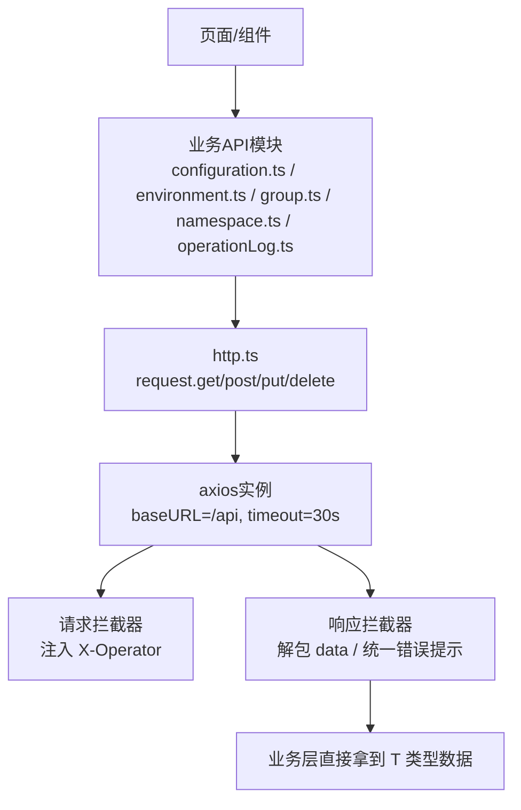
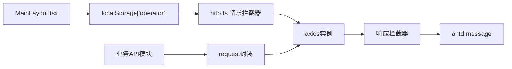

# HTTP客户端封装

<cite>
**本文引用的文件**
- [web/src/api/http.ts](file://web/src/api/http.ts)
- [web/src/api/types.ts](file://web/src/api/types.ts)
- [web/src/api/configuration.ts](file://web/src/api/configuration.ts)
- [web/src/api/environment.ts](file://web/src/api/environment.ts)
- [web/src/api/group.ts](file://web/src/api/group.ts)
- [web/src/api/namespace.ts](file://web/src/api/namespace.ts)
- [web/src/api/operationLog.ts](file://web/src/api/operationLog.ts)
- [web/src/layouts/MainLayout.tsx](file://web/src/layouts/MainLayout.tsx)
</cite>

## 目录
1. [简介](#简介)
2. [项目结构](#项目结构)
3. [核心组件](#核心组件)
4. [架构总览](#架构总览)
5. [详细组件分析](#详细组件分析)
6. [依赖关系分析](#依赖关系分析)
7. [性能考虑](#性能考虑)
8. [故障排查指南](#故障排查指南)
9. [结论](#结论)
10. [附录：使用示例与最佳实践](#附录使用示例与最佳实践)

## 简介
本文件面向前端工程中的HTTP客户端封装，围绕axios实例的统一配置、请求/响应拦截器、X-Operator头注入机制、统一错误处理策略，以及get/post/put/delete方法的类型安全封装进行系统化说明。同时给出基于本项目API模块的使用示例与最佳实践，帮助开发者快速、正确地调用后端接口并处理响应数据。

## 项目结构
前端HTTP相关代码集中在 web/src/api 目录下：
- http.ts：定义axios实例、拦截器与通用request方法封装
- types.ts：前后端对齐的TypeScript类型（含统一响应体ApiResponse等）
- 各业务API模块（configuration.ts、environment.ts、group.ts、namespace.ts、operationLog.ts）：基于request封装具体接口



图表来源
- [web/src/api/http.ts:11-52](file://web/src/api/http.ts#L11-L52)
- [web/src/api/configuration.ts:19-58](file://web/src/api/configuration.ts#L19-L58)
- [web/src/api/environment.ts:7-19](file://web/src/api/environment.ts#L7-L19)
- [web/src/api/group.ts:11-23](file://web/src/api/group.ts#L11-L23)
- [web/src/api/namespace.ts:7-18](file://web/src/api/namespace.ts#L7-L18)
- [web/src/api/operationLog.ts:7-8](file://web/src/api/operationLog.ts#L7-L8)

章节来源
- [web/src/api/http.ts:11-52](file://web/src/api/http.ts#L11-L52)
- [web/src/api/types.ts:7-17](file://web/src/api/types.ts#L7-L17)

## 核心组件
- Axios实例与基础配置
  - baseURL：/api，所有相对路径自动拼接
  - timeout：30秒，避免长耗时请求无反馈
- 请求拦截器
  - 非GET写操作自动注入 X-Operator 请求头
  - operator值来源于 localStorage['operator']，缺省为 'portal'
- 响应拦截器
  - 成功响应：当后端返回 code === 0 时，直接返回 data 字段，业务层无需再解包
  - 业务失败：弹出错误消息并reject Promise，携带业务message或错误码信息
  - HTTP错误：优先取后端返回的 message，否则回退到网络层错误信息，统一提示后reject
- request方法封装
  - get<T>(url, params?)：查询参数以params形式传递
  - post<T>(url, data?)：提交JSON数据
  - put<T>(url, data?)：更新数据
  - delete<T>(url)：删除资源
  - 泛型T即业务数据类型，调用方直接获得强类型结果

章节来源
- [web/src/api/http.ts:11-52](file://web/src/api/http.ts#L11-L52)
- [web/src/api/types.ts:7-17](file://web/src/api/types.ts#L7-L17)

## 架构总览
下图展示了从页面调用到后端响应的完整流程，包括拦截器对请求头的注入与响应体的解包。

```mermaid
sequenceDiagram
participant UI as "页面/组件"
participant API as "业务API模块"
participant REQ as "request封装"
participant AX as "axios实例"
participant RI as "请求拦截器"
participant RO as "响应拦截器"
participant S as "后端服务"
UI->>API : 调用 listConfigurations(...)
API->>REQ : request.get<ConfigurationResponse[]>(...)
REQ->>AX : 发起 GET /api/configurations
AX->>RI : 进入请求拦截器
RI-->>AX : 写入 X-Operator 头(非GET写操作)
AX->>S : 发送HTTP请求
S-->>AX : 返回 {code,message,data}
AX->>RO : 进入响应拦截器
RO->>RO : code===0? 是则返回data; 否则提示错误并reject
RO-->>REQ : 返回业务数据 T
REQ-->>API : 返回 T
API-->>UI : 渲染/处理数据
```

图表来源
- [web/src/api/http.ts:17-40](file://web/src/api/http.ts#L17-L40)
- [web/src/api/configuration.ts:19-24](file://web/src/api/configuration.ts#L19-L24)

## 详细组件分析

### Axios实例与基础配置
- baseURL设置为/api，简化各API模块的路径书写
- timeout设置为30秒，避免长时间阻塞；超时将触发网络层错误，由响应拦截器统一提示
- 通过create创建独立实例，便于后续扩展（如多环境切换、重试策略等）

章节来源
- [web/src/api/http.ts:11-14](file://web/src/api/http.ts#L11-L14)

### 请求拦截器与X-Operator头注入
- 触发条件：仅对非GET写操作注入X-Operator头
- 数据来源：localStorage.getItem('operator')，若为空则使用默认值'portal'
- 作用：后端审计日志记录操作人，便于追踪变更来源
- 注意：GET读操作不注入该头，减少不必要的头部开销

章节来源
- [web/src/api/http.ts:17-22](file://web/src/api/http.ts#L17-L22)
- [web/src/layouts/MainLayout.tsx:33-45](file://web/src/layouts/MainLayout.tsx#L33-L45)

### 响应拦截器与统一错误处理
- 成功分支：当后端返回code为0时，直接返回data字段，业务层无需再判断code
- 业务失败：弹出错误消息（优先使用后端message），并reject Promise，携带业务错误信息
- HTTP错误：优先展示后端返回的message，否则展示网络层错误信息，统一提示后reject
- 效果：页面代码只关注业务数据，错误提示集中管理，降低重复逻辑

章节来源
- [web/src/api/http.ts:25-40](file://web/src/api/http.ts#L25-L40)
- [web/src/api/types.ts:7-11](file://web/src/api/types.ts#L7-L11)

### request对象的类型安全封装
- get<T>(url, params?): 查询参数以对象形式传入，自动序列化为查询字符串
- post<T>(url, data?): 提交JSON数据，返回类型为T
- put<T>(url, data?): 更新数据，返回类型为T
- delete<T>(url): 删除资源，返回类型为T
- 泛型T由调用方指定，结合types.ts中的类型定义，实现端到端的类型推导

章节来源
- [web/src/api/http.ts:46-52](file://web/src/api/http.ts#L46-L52)
- [web/src/api/types.ts:7-17](file://web/src/api/types.ts#L7-L17)

### 业务API模块示例
- configuration.ts：提供配置项的增删改查、发布、回滚、下线、版本历史等接口
- environment.ts：提供环境的增删改查接口
- group.ts：提供配置组的增删改查接口
- namespace.ts：提供命名空间的增删改查接口
- operationLog.ts：提供操作日志的分页查询接口

章节来源
- [web/src/api/configuration.ts:19-58](file://web/src/api/configuration.ts#L19-L58)
- [web/src/api/environment.ts:7-19](file://web/src/api/environment.ts#L7-L19)
- [web/src/api/group.ts:11-23](file://web/src/api/group.ts#L11-L23)
- [web/src/api/namespace.ts:7-18](file://web/src/api/namespace.ts#L7-L18)
- [web/src/api/operationLog.ts:7-8](file://web/src/api/operationLog.ts#L7-L8)

## 依赖关系分析
- http.ts依赖：
  - axios：HTTP客户端库
  - antd message：统一错误提示
  - types.ts ApiResponse：统一响应体类型
- 业务API模块依赖：
  - http.ts request：统一的请求方法与拦截器能力
  - types.ts：各实体与请求/响应类型
- MainLayout.tsx：
  - 维护operator状态并持久化到localStorage，供请求拦截器读取



图表来源
- [web/src/layouts/MainLayout.tsx:33-45](file://web/src/layouts/MainLayout.tsx#L33-L45)
- [web/src/api/http.ts:17-40](file://web/src/api/http.ts#L17-L40)

章节来源
- [web/src/api/http.ts:1-55](file://web/src/api/http.ts#L1-L55)
- [web/src/api/types.ts:7-17](file://web/src/api/types.ts#L7-L17)
- [web/src/layouts/MainLayout.tsx:33-45](file://web/src/layouts/MainLayout.tsx#L33-L45)

## 性能考虑
- 合理设置timeout：避免请求长期挂起影响用户体验
- 仅在写操作注入X-Operator头：减少不必要的头部传输
- 响应拦截器统一解包：减少业务层重复处理逻辑，提升可维护性
- 分页查询：对于列表类接口，建议使用分页参数以减少数据传输量

[本节为通用指导，不直接分析具体文件]

## 故障排查指南
- 未显示错误提示
  - 检查后端是否返回code非0且message为空；此时会显示“请求失败”或“业务错误码 xxx”
  - 确认网络层错误是否被正确捕获并提示
- X-Operator未生效
  - 确认当前页面是否设置了localStorage['operator']
  - 确认是否为非GET写操作（GET不会注入该头）
- 类型不匹配
  - 确保调用request.get/post/put/delete时传入正确的泛型T
  - 核对types.ts中对应实体的字段是否与后端一致

章节来源
- [web/src/api/http.ts:25-40](file://web/src/api/http.ts#L25-L40)
- [web/src/api/http.ts:17-22](file://web/src/api/http.ts#L17-L22)
- [web/src/api/types.ts:7-17](file://web/src/api/types.ts#L7-L17)

## 结论
本HTTP客户端封装通过axios实例的统一配置、请求/响应拦截器的集中处理、以及request方法的类型安全封装，实现了：
- 统一的错误提示与响应解包
- 自动注入X-Operator头用于审计追踪
- 强类型的API调用体验
- 简洁易用的业务接口封装

遵循本文的最佳实践，可在保证类型安全的同时，显著提升前端的可维护性与开发效率。

[本节为总结性内容，不直接分析具体文件]

## 附录：使用示例与最佳实践

### 基本用法
- 获取配置项列表
  - 调用方式：listConfigurations(params)
  - 返回类型：ConfigurationResponse[]
  - 参考路径：[web/src/api/configuration.ts:19-20](file://web/src/api/configuration.ts#L19-L20)
- 获取配置详情
  - 调用方式：getConfiguration(id)
  - 返回类型：ConfigurationDetailResponse
  - 参考路径：[web/src/api/configuration.ts:23-24](file://web/src/api/configuration.ts#L23-L24)
- 新建配置
  - 调用方式：createConfiguration(data)
  - 返回类型：ConfigurationResponse
  - 参考路径：[web/src/api/configuration.ts:27-28](file://web/src/api/configuration.ts#L27-L28)
- 更新配置
  - 调用方式：updateConfiguration(id, data)
  - 返回类型：null
  - 参考路径：[web/src/api/configuration.ts:31-32](file://web/src/api/configuration.ts#L31-L32)
- 删除配置
  - 调用方式：deleteConfiguration(id)
  - 返回类型：null
  - 参考路径：[web/src/api/configuration.ts:35-35](file://web/src/api/configuration.ts#L35-L35)
- 发布配置
  - 调用方式：publishConfiguration(id, data)
  - 返回类型：PublishResponse
  - 参考路径：[web/src/api/configuration.ts:38-39](file://web/src/api/configuration.ts#L38-L39)
- 回滚配置
  - 调用方式：rollbackConfiguration(id, data)
  - 返回类型：PublishResponse
  - 参考路径：[web/src/api/configuration.ts:42-43](file://web/src/api/configuration.ts#L42-L43)
- 下线配置
  - 调用方式：offlineConfiguration(id)
  - 返回类型：null
  - 参考路径：[web/src/api/configuration.ts:46-47](file://web/src/api/configuration.ts#L46-L47)
- 版本历史列表
  - 调用方式：listVersions(id, pageIndex?, pageSize?)
  - 返回类型：PageResponse<ConfigurationVersionResponse>
  - 参考路径：[web/src/api/configuration.ts:50-54](file://web/src/api/configuration.ts#L50-L54)
- 单个版本快照
  - 调用方式：getVersion(id, versionNumber)
  - 返回类型：ConfigurationVersionResponse
  - 参考路径：[web/src/api/configuration.ts:57-58](file://web/src/api/configuration.ts#L57-L58)

### 环境与组
- 环境列表
  - 调用方式：listEnvironments(namespaceId?)
  - 返回类型：EnvironmentResponse[]
  - 参考路径：[web/src/api/environment.ts:7-8](file://web/src/api/environment.ts#L7-L8)
- 创建环境
  - 调用方式：createEnvironment(data)
  - 返回类型：EnvironmentResponse
  - 参考路径：[web/src/api/environment.ts:11-12](file://web/src/api/environment.ts#L11-L12)
- 更新环境
  - 调用方式：updateEnvironment(id, data)
  - 返回类型：null
  - 参考路径：[web/src/api/environment.ts:15-16](file://web/src/api/environment.ts#L15-L16)
- 删除环境
  - 调用方式：deleteEnvironment(id)
  - 返回类型：null
  - 参考路径：[web/src/api/environment.ts:19-19](file://web/src/api/environment.ts#L19-L19)
- 配置组列表
  - 调用方式：listGroups(params?)
  - 返回类型：ConfigurationGroupResponse[]
  - 参考路径：[web/src/api/group.ts:11-12](file://web/src/api/group.ts#L11-L12)
- 创建配置组
  - 调用方式：createGroup(data)
  - 返回类型：ConfigurationGroupResponse
  - 参考路径：[web/src/api/group.ts:15-16](file://web/src/api/group.ts#L15-L16)
- 更新配置组
  - 调用方式：updateGroup(id, data)
  - 返回类型：null
  - 参考路径：[web/src/api/group.ts:19-20](file://web/src/api/group.ts#L19-L20)
- 删除配置组
  - 调用方式：deleteGroup(id)
  - 返回类型：null
  - 参考路径：[web/src/api/group.ts:23-23](file://web/src/api/group.ts#L23-L23)

### 命名空间与操作日志
- 命名空间列表
  - 调用方式：listNamespaces()
  - 返回类型：NamespaceResponse[]
  - 参考路径：[web/src/api/namespace.ts:7-7](file://web/src/api/namespace.ts#L7-L7)
- 创建命名空间
  - 调用方式：createNamespace(data)
  - 返回类型：NamespaceResponse
  - 参考路径：[web/src/api/namespace.ts:10-11](file://web/src/api/namespace.ts#L10-L11)
- 更新命名空间
  - 调用方式：updateNamespace(id, data)
  - 返回类型：null
  - 参考路径：[web/src/api/namespace.ts:14-15](file://web/src/api/namespace.ts#L14-L15)
- 删除命名空间
  - 调用方式：deleteNamespace(id)
  - 返回类型：null
  - 参考路径：[web/src/api/namespace.ts:18-18](file://web/src/api/namespace.ts#L18-L18)
- 操作日志分页查询
  - 调用方式：listOperationLogs(params)
  - 返回类型：PageResponse<OperationLogResponse>
  - 参考路径：[web/src/api/operationLog.ts:7-8](file://web/src/api/operationLog.ts#L7-L8)

### 最佳实践
- 始终使用request的泛型T来约束返回类型，避免any带来的类型丢失
- 对于列表接口，尽量使用分页参数，减少数据传输量
- 在写操作前确保已设置localStorage['operator']，以便审计追踪
- 遇到错误时，优先查看响应拦截器提示；如需自定义处理，可在调用处捕获Promise异常
- 保持types.ts与后端模型同步，确保前后端类型一致性

[本节为使用示例与最佳实践，不直接分析具体文件]