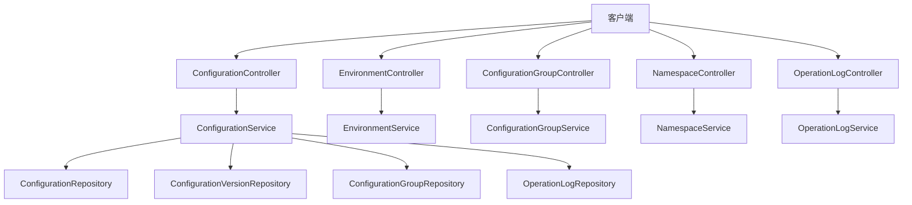
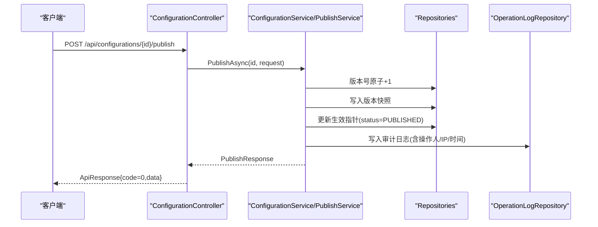
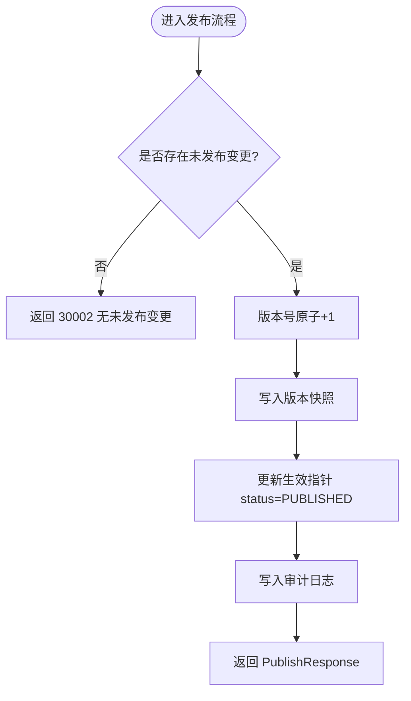
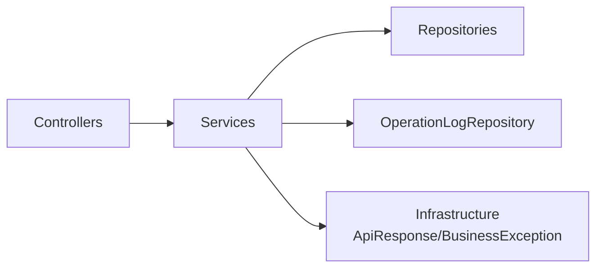

# 业务模块API

<cite>
**本文引用的文件**
- [ConfigurationController.cs](file://k_config_center/src/Controllers/ConfigurationController.cs)
- [EnvironmentController.cs](file://k_config_center/src/Controllers/EnvironmentController.cs)
- [ConfigurationGroupController.cs](file://k_config_center/src/Controllers/ConfigurationGroupController.cs)
- [NamespaceController.cs](file://k_config_center/src/Controllers/NamespaceController.cs)
- [OperationLogController.cs](file://k_config_center/src/Controllers/OperationLogController.cs)
- [ConfigurationRequests.cs](file://k_config_center/src/Models/Requests/ConfigurationRequests.cs)
- [EnvironmentRequests.cs](file://k_config_center/src/Models/Requests/EnvironmentRequests.cs)
- [ConfigurationGroupRequests.cs](file://k_config_center/src/Models/Requests/ConfigurationGroupRequests.cs)
- [NamespaceRequests.cs](file://k_config_center/src/Models/Requests/NamespaceRequests.cs)
- [CommonResponses.cs](file://k_config_center/src/Models/Responses/CommonResponses.cs)
- [ConfigurationResponses.cs](file://k_config_center/src/Models/Responses/ConfigurationResponses.cs)
- [ApiResponse.cs](file://k_config_center/src/Infrastructure/ApiResponse.cs)
- [BusinessException.cs](file://k_config_center/src/Infrastructure/BusinessException.cs)
- [ConfigurationService.cs](file://k_config_center/src/Services/ConfigurationService.cs)
</cite>

## 目录
1. [简介](#简介)
2. [项目结构](#项目结构)
3. [核心组件](#核心组件)
4. [架构总览](#架构总览)
5. [详细组件分析](#详细组件分析)
6. [依赖关系分析](#依赖关系分析)
7. [性能考虑](#性能考虑)
8. [故障排查指南](#故障排查指南)
9. [结论](#结论)
10. [附录](#附录)

## 简介
本文件面向配置中心后端提供的管理端 API，系统化说明各业务模块的接口定义、参数与返回结构、错误码约定以及调用最佳实践。覆盖的模块包括：
- 命名空间（namespace）
- 环境（environment）
- 配置组（configuration group）
- 配置项（configuration）
- 操作日志（operation log）

所有接口统一通过控制器接收请求，委托服务层处理业务逻辑，并以统一的响应格式返回。删除均为软删除，列表查询默认过滤已删除记录。

## 项目结构
后端采用分层设计：
- Controllers：HTTP 路由与参数绑定，仅做请求接收与 ApiResponse 包装
- Services：业务编排与校验，封装事务型操作与审计日志写入
- Repositories：数据访问（由 Service 调用）
- Models：请求模型（Requests）与响应模型（Responses）
- Infrastructure：统一响应、异常、工具方法等横切能力

图表来源
- [ConfigurationController.cs:1-115](file://k_config_center/src/Controllers/ConfigurationController.cs#L1-L115)
- [EnvironmentController.cs:1-52](file://k_config_center/src/Controllers/EnvironmentController.cs#L1-L52)
- [ConfigurationGroupController.cs:1-53](file://k_config_center/src/Controllers/ConfigurationGroupController.cs#L1-L53)
- [NamespaceController.cs:1-50](file://k_config_center/src/Controllers/NamespaceController.cs#L1-L50)
- [OperationLogController.cs:1-31](file://k_config_center/src/Controllers/OperationLogController.cs#L1-L31)
- [ConfigurationService.cs:1-110](file://k_config_center/src/Services/ConfigurationService.cs#L1-L110)

章节来源
- [ConfigurationController.cs:1-115](file://k_config_center/src/Controllers/ConfigurationController.cs#L1-L115)
- [EnvironmentController.cs:1-52](file://k_config_center/src/Controllers/EnvironmentController.cs#L1-L52)
- [ConfigurationGroupController.cs:1-53](file://k_config_center/src/Controllers/ConfigurationGroupController.cs#L1-L53)
- [NamespaceController.cs:1-50](file://k_config_center/src/Controllers/NamespaceController.cs#L1-L50)
- [OperationLogController.cs:1-31](file://k_config_center/src/Controllers/OperationLogController.cs#L1-L31)

## 核心组件
- 统一响应：所有接口 HTTP 状态码均为 200，业务结果通过 code/message/data 表达
- 错误码：按区间分段（0/10000+/20000+/30000+），新增不破坏既有契约
- 软删除：所有 DELETE 仅标记 deleted_at；列表查询默认排除已删除
- 审计日志：关键写操作均记录操作人、IP、时间、关联维度与详情

章节来源
- [ApiResponse.cs:1-10](file://k_config_center/src/Infrastructure/ApiResponse.cs#L1-L10)
- [BusinessException.cs:1-11](file://k_config_center/src/Infrastructure/BusinessException.cs#L1-L11)
- [ConfigurationService.cs:104-109](file://k_config_center/src/Services/ConfigurationService.cs#L104-L109)

## 架构总览
下图展示一次“发布配置”的端到端调用链：控制器接收参数并委托服务，服务在事务内完成版本递增、快照写入、生效指针更新与审计日志记录。

图表来源
- [ConfigurationController.cs:65-83](file://k_config_center/src/Controllers/ConfigurationController.cs#L65-L83)
- [ConfigurationService.cs:46-64](file://k_config_center/src/Services/ConfigurationService.cs#L46-L64)
- [ConfigurationService.cs:104-109](file://k_config_center/src/Services/ConfigurationService.cs#L104-L109)

## 详细组件分析

### 命名空间（Namespace）
- 路由前缀：/api/namespaces
- 能力
  - 列表：GET /api/namespaces
  - 创建：POST /api/namespaces
  - 更新：PUT /api/namespaces/{id}
  - 删除：DELETE /api/namespaces/{id}（软删除）
- 请求模型
  - 创建：NamespaceCreateRequest（key 全局唯一，创建后不可改）
  - 更新：NamespaceUpdateRequest（仅名称/描述/状态）
- 返回结构
  - 列表/创建返回 NamespaceResponse（包含 id、key、名称、描述、状态、时间戳等）
- 约束与错误码
  - key 冲突：20001
  - 资源不存在：10002
  - 存在未删除的下级环境时拒绝删除：20004

章节来源
- [NamespaceController.cs:1-50](file://k_config_center/src/Controllers/NamespaceController.cs#L1-L50)
- [NamespaceRequests.cs:1-14](file://k_config_center/src/Models/Requests/NamespaceRequests.cs#L1-L14)

### 环境（Environment）
- 路由前缀：/api/environments
- 能力
  - 列表：GET /api/environments?namespaceId=...
  - 创建：POST /api/environments
  - 更新：PUT /api/environments/{id}
  - 删除：DELETE /api/environments/{id}（软删除）
- 请求模型
  - 创建：EnvironmentCreateRequest（同命名空间内 key 唯一，创建后不可改）
  - 更新：EnvironmentUpdateRequest（仅名称/描述/排序/状态）
- 返回结构
  - 列表/创建返回 EnvironmentResponse（包含 id、key、名称、描述、排序、状态、时间戳等）
- 约束与错误码
  - key 冲突：20002
  - 资源不存在：10002
  - 存在未删除的下级配置组时拒绝删除：20004

章节来源
- [EnvironmentController.cs:1-52](file://k_config_center/src/Controllers/EnvironmentController.cs#L1-L52)
- [EnvironmentRequests.cs:1-17](file://k_config_center/src/Models/Requests/EnvironmentRequests.cs#L1-L17)

### 配置组（Configuration Group）
- 路由前缀：/api/configuration-groups
- 能力
  - 列表：GET /api/configuration-groups?namespaceId=...&environmentId=...
  - 创建：POST /api/configuration-groups
  - 更新：PUT /api/configuration-groups/{id}
  - 删除：DELETE /api/configuration-groups/{id}（软删除）
- 请求模型
  - 创建：ConfigurationGroupCreateRequest（同环境内 key 唯一，创建后不可改）
  - 更新：ConfigurationGroupUpdateRequest（仅名称/描述/状态）
- 返回结构
  - 列表/创建返回 ConfigurationGroupResponse（包含 id、key、名称、描述、状态、时间戳等）
- 约束与错误码
  - key 冲突：20003
  - 资源不存在：10002
  - 存在未删除的配置项时拒绝删除：20004

章节来源
- [ConfigurationGroupController.cs:1-53](file://k_config_center/src/Controllers/ConfigurationGroupController.cs#L1-L53)
- [ConfigurationGroupRequests.cs:1-16](file://k_config_center/src/Models/Requests/ConfigurationGroupRequests.cs#L1-L16)

### 配置项（Configuration）
- 路由前缀：/api/configurations
- 能力
  - 列表：GET /api/configurations?groupId=...&namespaceId=...&environmentId=...&status=...&keyword=...
  - 详情：GET /api/configurations/{id}
  - 创建：POST /api/configurations
  - 保存编辑（草稿）：PUT /api/configurations/{id}
  - 删除：DELETE /api/configurations/{id}（软删除）
  - 发布：POST /api/configurations/{id}/publish
  - 回滚：POST /api/configurations/{id}/rollback
  - 下线：POST /api/configurations/{id}/offline
  - 版本历史：GET /api/configurations/{id}/versions?pageIndex=...&pageSize=...
  - 指定版本快照：GET /api/configurations/{id}/versions/{versionNumber}
- 请求模型
  - 创建：ConfigurationCreateRequest（md5 由服务端计算）
  - 更新：ConfigurationUpdateRequest（仅更新当前态字段，不产生版本）
  - 发布：PublishRequest（变更备注可选）
  - 回滚：RollbackRequest（目标版本号必填）
- 返回结构
  - 列表：ConfigurationResponse[]，附带 hasUnpublishedChange 标记
  - 详情：ConfigurationDetailResponse（当前编辑态 + 生效版本快照）
  - 版本历史：PageResponse<ConfigurationVersionResponse>
  - 发布/回滚：PublishResponse（新快照 id 与版本号）
- 约束与错误码
  - 配置 key 冲突：30001
  - 无未发布变更重复发布：30002
  - 回滚目标版本不存在：30003
  - 发布并发冲突：30004
  - 非已发布状态下线：10001
  - 资源不存在：10002

图表来源
- [ConfigurationController.cs:65-83](file://k_config_center/src/Controllers/ConfigurationController.cs#L65-L83)
- [ConfigurationService.cs:46-64](file://k_config_center/src/Services/ConfigurationService.cs#L46-L64)

章节来源
- [ConfigurationController.cs:1-115](file://k_config_center/src/Controllers/ConfigurationController.cs#L1-L115)
- [ConfigurationRequests.cs:1-27](file://k_config_center/src/Models/Requests/ConfigurationRequests.cs#L1-L27)
- [ConfigurationResponses.cs:1-75](file://k_config_center/src/Models/Responses/ConfigurationResponses.cs#L1-L75)
- [ConfigurationService.cs:1-110](file://k_config_center/src/Services/ConfigurationService.cs#L1-L110)

### 操作日志（Operation Log）
- 路由前缀：/api/operation-logs
- 能力
  - 分页查询：GET /api/operation-logs（支持多维度过滤与时间区间）
- 过滤条件
  - namespaceId、environmentId、groupId、configurationId、operation、operator、startTime、endTime、pageIndex、pageSize
- 返回结构
  - PageResponse<OperationLogResponse>（items、total）
- 说明
  - 日志只读，不提供删除能力；时间区间为闭开区间 [startTime, endTime)

章节来源
- [OperationLogController.cs:1-31](file://k_config_center/src/Controllers/OperationLogController.cs#L1-L31)
- [CommonResponses.cs:23-51](file://k_config_center/src/Models/Responses/CommonResponses.cs#L23-L51)

## 依赖关系分析
- 控制器与服务解耦：控制器仅负责参数绑定与 ApiResponse 包装，业务规则集中在 Service
- 服务与仓储解耦：Service 通过 Repository 访问数据，便于替换实现与单元测试
- 审计日志贯穿写操作：Service 内部统一调用 OperationLogRepository 记录操作人与 IP
- 统一错误与响应：BusinessException 与 ApiResponse 收敛错误表达，对外契约稳定

图表来源
- [ConfigurationController.cs:1-115](file://k_config_center/src/Controllers/ConfigurationController.cs#L1-L115)
- [ConfigurationService.cs:1-110](file://k_config_center/src/Services/ConfigurationService.cs#L1-L110)
- [ApiResponse.cs:1-10](file://k_config_center/src/Infrastructure/ApiResponse.cs#L1-L10)
- [BusinessException.cs:1-11](file://k_config_center/src/Infrastructure/BusinessException.cs#L1-L11)

章节来源
- [ConfigurationController.cs:1-115](file://k_config_center/src/Controllers/ConfigurationController.cs#L1-L115)
- [ConfigurationService.cs:1-110](file://k_config_center/src/Services/ConfigurationService.cs#L1-L110)

## 性能考虑
- 列表优化：配置项列表一次性拉取生效版本的 md5 进行内存比对，避免逐条回查数据库
- 软删除与过滤：列表查询默认过滤已删除记录，减少无效数据
- 版本快照不可变：版本表不设软删除，保证可追溯性与一致性
- 分页与索引：版本历史与日志查询使用分页，建议对常用过滤字段建立索引

[本节为通用指导，无需具体文件引用]

## 故障排查指南
- 常见错误码
  - 10000：服务器内部错误（非业务异常）
  - 10001：业务状态非法（如非已发布配置不可下线）
  - 10002：资源不存在
  - 20001：命名空间 key 冲突
  - 20002：环境 key 冲突
  - 20003：配置组 key 冲突
  - 20004：存在未删除的下级资源，拒绝删除
  - 30001：配置 key 冲突
  - 30002：无未发布变更（重复发布）
  - 30003：回滚目标版本不存在
  - 30004：发布并发冲突（可重试）
- 排查步骤
  - 检查请求参数是否满足唯一性约束（key 冲突）
  - 确认资源是否存在（10002）
  - 确认当前状态是否允许操作（10001）
  - 查看操作日志定位问题上下文（操作人、IP、时间、详情）
  - 对于并发冲突（30004），客户端应退避重试

章节来源
- [BusinessException.cs:1-11](file://k_config_center/src/Infrastructure/BusinessException.cs#L1-L11)
- [ConfigurationService.cs:46-64](file://k_config_center/src/Services/ConfigurationService.cs#L46-L64)
- [ConfigurationService.cs:89-102](file://k_config_center/src/Services/ConfigurationService.cs#L89-L102)

## 结论
本 API 以清晰的层次划分与统一的响应/错误约定，提供了完整的配置管理能力。通过软删除、版本快照与审计日志，保证了可追溯性与安全性。建议在调用时遵循以下最佳实践：
- 始终检查响应中的 code，而非仅依赖 HTTP 状态码
- 遇到 30004 等可重试错误时，实施指数退避重试
- 利用 hasUnpublishedChange 标记减少不必要的发布
- 使用分页与多维过滤高效检索日志与列表
- 谨慎操作删除，遵循自底向上清理依赖关系

[本节为总结性内容，无需具体文件引用]

## 附录

### 典型使用场景与调用示例（路径参考）
- 新建命名空间
  - 路径：POST /api/namespaces
  - 请求体：NamespaceCreateRequest
  - 参考：[NamespaceRequests.cs:1-14](file://k_config_center/src/Models/Requests/NamespaceRequests.cs#L1-L14)
- 创建环境
  - 路径：POST /api/environments
  - 请求体：EnvironmentCreateRequest
  - 参考：[EnvironmentRequests.cs:1-17](file://k_config_center/src/Models/Requests/EnvironmentRequests.cs#L1-L17)
- 创建配置组
  - 路径：POST /api/configuration-groups
  - 请求体：ConfigurationGroupCreateRequest
  - 参考：[ConfigurationGroupRequests.cs:1-16](file://k_config_center/src/Models/Requests/ConfigurationGroupRequests.cs#L1-L16)
- 新建配置项
  - 路径：POST /api/configurations
  - 请求体：ConfigurationCreateRequest
  - 参考：[ConfigurationRequests.cs:1-27](file://k_config_center/src/Models/Requests/ConfigurationRequests.cs#L1-L27)
- 保存编辑（草稿）
  - 路径：PUT /api/configurations/{id}
  - 请求体：ConfigurationUpdateRequest
  - 参考：[ConfigurationRequests.cs:12-17](file://k_config_center/src/Models/Requests/ConfigurationRequests.cs#L12-L17)
- 发布配置
  - 路径：POST /api/configurations/{id}/publish
  - 请求体：PublishRequest
  - 返回：PublishResponse
  - 参考：[ConfigurationRequests.cs:19-21](file://k_config_center/src/Models/Requests/ConfigurationRequests.cs#L19-L21)、[ConfigurationResponses.cs:71-75](file://k_config_center/src/Models/Responses/ConfigurationResponses.cs#L71-L75)
- 回滚配置
  - 路径：POST /api/configurations/{id}/rollback
  - 请求体：RollbackRequest
  - 返回：PublishResponse
  - 参考：[ConfigurationRequests.cs:23-26](file://k_config_center/src/Models/Requests/ConfigurationRequests.cs#L23-L26)、[ConfigurationResponses.cs:71-75](file://k_config_center/src/Models/Responses/ConfigurationResponses.cs#L71-L75)
- 下线配置
  - 路径：POST /api/configurations/{id}/offline
  - 参考：[ConfigurationController.cs:85-94](file://k_config_center/src/Controllers/ConfigurationController.cs#L85-L94)
- 查询操作日志
  - 路径：GET /api/operation-logs
  - 返回：PageResponse<OperationLogResponse>
  - 参考：[OperationLogController.cs:12-30](file://k_config_center/src/Controllers/OperationLogController.cs#L12-L30)、[CommonResponses.cs:23-51](file://k_config_center/src/Models/Responses/CommonResponses.cs#L23-L51)