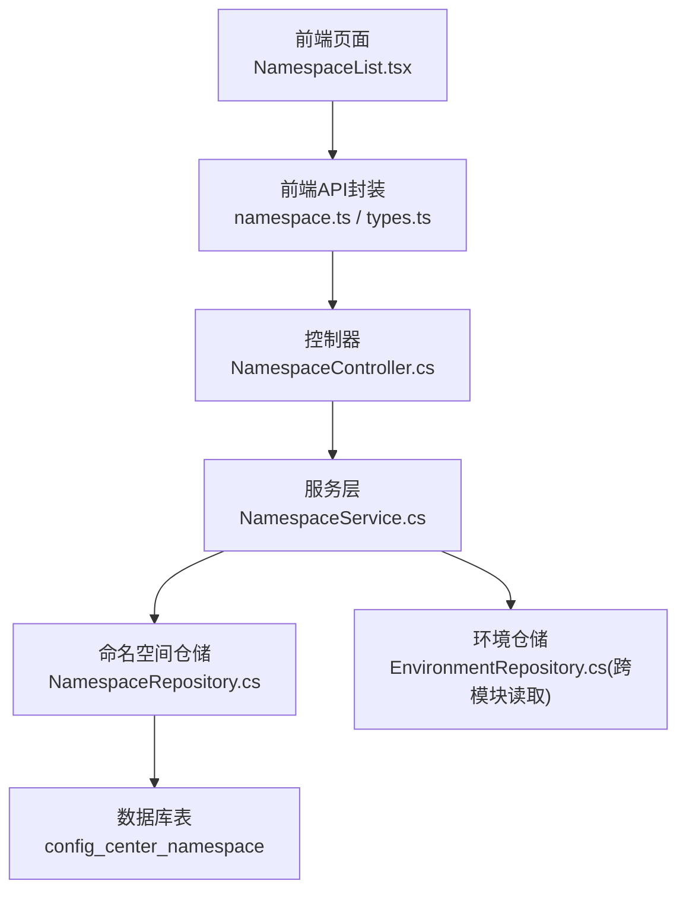
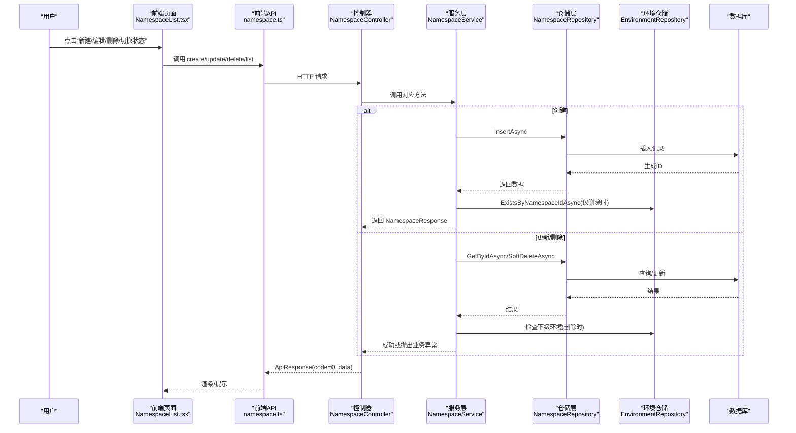
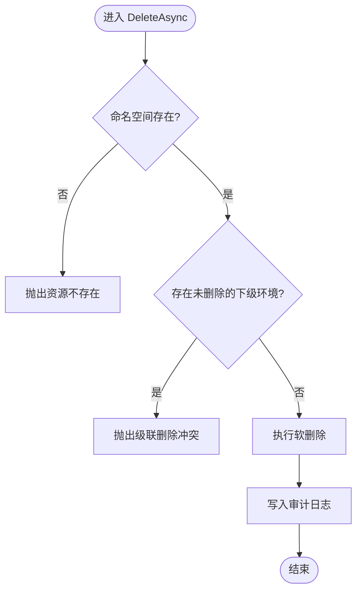
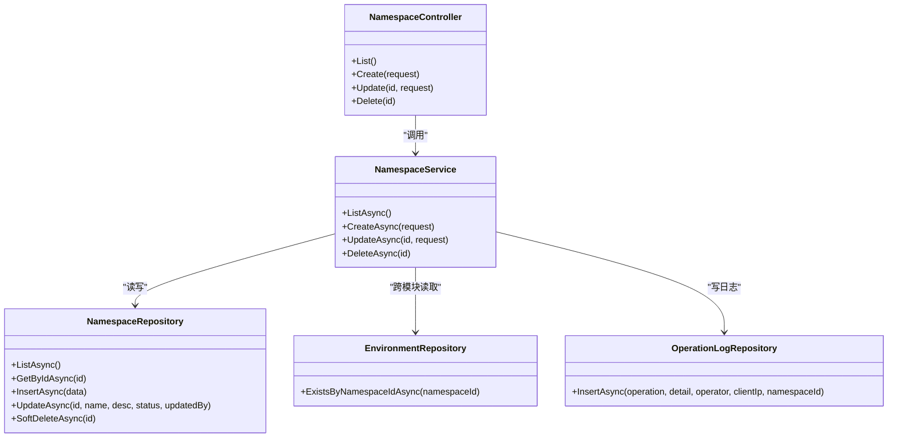

# 命名空间管理API

<cite>
**本文引用的文件**
- [NamespaceController.cs](file://k_config_center/src/Controllers/NamespaceController.cs)
- [NamespaceService.cs](file://k_config_center/src/Services/NamespaceService.cs)
- [NamespaceRepository.cs](file://k_config_center/src/Repositories/NamespaceRepository.cs)
- [ConfigCenterNamespace.cs](file://k_config_center/src/Entities/ConfigCenterNamespace.cs)
- [NamespaceRequests.cs](file://k_config_center/src/Models/Requests/NamespaceRequests.cs)
- [BasicDimensionResponses.cs](file://k_config_center/src/Models/Responses/BasicDimensionResponses.cs)
- [ApiResponse.cs](file://k_config_center/src/Infrastructure/ApiResponse.cs)
- [namespace.ts](file://web/src/api/namespace.ts)
- [types.ts](file://web/src/api/types.ts)
- [NamespaceList.tsx](file://web/src/pages/namespace/NamespaceList.tsx)
- [后端方案.md](file://docs/技术方案/后端方案.md)
</cite>

## 目录
1. [简介](#简介)
2. [项目结构](#项目结构)
3. [核心组件](#核心组件)
4. [架构总览](#架构总览)
5. [详细组件分析](#详细组件分析)
6. [依赖关系分析](#依赖关系分析)
7. [性能与排序特性](#性能与排序特性)
8. [故障排查指南](#故障排查指南)
9. [结论](#结论)
10. [附录：接口定义与使用示例](#附录接口定义与使用示例)

## 简介
本模块提供“命名空间”的增删改查能力。命名空间是配置中心的最高级别配置隔离单元，用于在多租户或多项目场景下实现配置的完全隔离。每个命名空间拥有全局唯一的业务标识（key），并支持启用/禁用状态、软删除、审计日志等特性。列表默认按创建时间排序，且仅返回未软删除的记录。

## 项目结构
命名空间管理采用分层架构：控制器负责路由与参数接收；服务层封装业务规则与跨模块校验；仓储层负责数据访问；实体与请求/响应模型在各层之间传递。前端通过统一的 HTTP 客户端调用后端 API，并在页面中完成列表展示、新建/编辑、状态切换与删除操作。

图表来源
- [NamespaceController.cs:8-49](file://k_config_center/src/Controllers/NamespaceController.cs#L8-L49)
- [NamespaceService.cs:13-64](file://k_config_center/src/Services/NamespaceService.cs#L13-L64)
- [NamespaceRepository.cs:9-47](file://k_config_center/src/Repositories/NamespaceRepository.cs#L9-L47)
- [ConfigCenterNamespace.cs:5-38](file://k_config_center/src/Entities/ConfigCenterNamespace.cs#L5-L38)
- [namespace.ts:4-18](file://web/src/api/namespace.ts#L4-L18)
- [types.ts:31-55](file://web/src/api/types.ts#L31-L55)

章节来源
- [NamespaceController.cs:8-49](file://k_config_center/src/Controllers/NamespaceController.cs#L8-L49)
- [NamespaceService.cs:13-64](file://k_config_center/src/Services/NamespaceService.cs#L13-L64)
- [NamespaceRepository.cs:9-47](file://k_config_center/src/Repositories/NamespaceRepository.cs#L9-L47)
- [ConfigCenterNamespace.cs:5-38](file://k_config_center/src/Entities/ConfigCenterNamespace.cs#L5-L38)
- [namespace.ts:4-18](file://web/src/api/namespace.ts#L4-L18)
- [types.ts:31-55](file://web/src/api/types.ts#L31-L55)

## 核心组件
- 控制器 NamespaceController：暴露 REST 端点，统一返回 ApiResponse 包裹。
- 服务 NamespaceService：实现命名空间的创建、更新、删除与列表查询；处理唯一性冲突、软删除约束与审计日志。
- 仓储 NamespaceRepository：封装对 config_center_namespace 表的读写；读查询走全局软删过滤；更新不触发全局过滤，需先查询确认存在。
- 实体 ConfigCenterNamespace：映射数据库表结构，包含 key、名称、描述、状态、软删除标记、审计字段与时间戳。
- 请求/响应模型：NamespaceCreateRequest、NamespaceUpdateRequest、NamespaceResponse。
- 统一响应 ApiResponse：HTTP 始终 200，业务结果通过 code/message/data 表达。

章节来源
- [NamespaceController.cs:8-49](file://k_config_center/src/Controllers/NamespaceController.cs#L8-L49)
- [NamespaceService.cs:13-64](file://k_config_center/src/Services/NamespaceService.cs#L13-L64)
- [NamespaceRepository.cs:9-47](file://k_config_center/src/Repositories/NamespaceRepository.cs#L9-L47)
- [ConfigCenterNamespace.cs:5-38](file://k_config_center/src/Entities/ConfigCenterNamespace.cs#L5-L38)
- [NamespaceRequests.cs:1-14](file://k_config_center/src/Models/Requests/NamespaceRequests.cs#L1-L14)
- [BasicDimensionResponses.cs:5-21](file://k_config_center/src/Models/Responses/BasicDimensionResponses.cs#L5-L21)
- [ApiResponse.cs:1-10](file://k_config_center/src/Infrastructure/ApiResponse.cs#L1-L10)

## 架构总览
命名空间管理的请求从前端发起，经 API 封装后到达控制器，再由服务层执行业务规则，最终通过仓储层访问数据库。删除时服务层会跨模块检查是否存在未删除的环境，确保自底向上清理。所有写操作均记录审计日志。

图表来源
- [NamespaceController.cs:13-49](file://k_config_center/src/Controllers/NamespaceController.cs#L13-L49)
- [NamespaceService.cs:22-64](file://k_config_center/src/Services/NamespaceService.cs#L22-L64)
- [NamespaceRepository.cs:15-47](file://k_config_center/src/Repositories/NamespaceRepository.cs#L15-L47)
- [ConfigCenterNamespace.cs:5-38](file://k_config_center/src/Entities/ConfigCenterNamespace.cs#L5-L38)

## 详细组件分析

### 控制器 NamespaceController
- 路由前缀：/api/namespaces
- 列表 GET：返回全量未软删除命名空间，data 为 NamespaceResponse 数组
- 创建 POST：body 为 NamespaceCreateRequest，重复 key 返回业务错误码
- 更新 PUT/{id}：仅可改名称、描述、状态；不存在返回资源不存在
- 删除 DELETE/{id}：软删除；若存在未删除的下级环境拒绝删除

章节来源
- [NamespaceController.cs:13-49](file://k_config_center/src/Controllers/NamespaceController.cs#L13-L49)
- [后端方案.md:502-509](file://docs/技术方案/后端方案.md#L502-L509)

### 服务层 NamespaceService
- ListAsync：列表按创建时间排序，软删过滤由仓储保证
- CreateAsync：构造业务数据并插入；捕获唯一索引冲突转业务错误码；写入审计日志
- UpdateAsync：先查询确认存在；更新名称/描述/状态；写入审计日志
- DeleteAsync：先查询确认存在；检查是否存在未删除的下级环境；软删除；写入审计日志

图表来源
- [NamespaceService.cs:49-64](file://k_config_center/src/Services/NamespaceService.cs#L49-L64)

章节来源
- [NamespaceService.cs:22-64](file://k_config_center/src/Services/NamespaceService.cs#L22-L64)

### 仓储层 NamespaceRepository
- ListAsync：按 CreatedAt 升序返回业务数据
- GetByIdAsync：已软删除返回 null
- InsertAsync：由数据库生成 ID 并回填；唯一冲突原样抛出
- UpdateAsync：仅更新名称/描述/状态/更新人；updated_at 由数据库触发器维护
- SoftDeleteAsync：设置 deleted_at

章节来源
- [NamespaceRepository.cs:15-47](file://k_config_center/src/Repositories/NamespaceRepository.cs#L15-L47)
- [ConfigCenterNamespace.cs:5-38](file://k_config_center/src/Entities/ConfigCenterNamespace.cs#L5-L38)

### 实体与模型
- 实体 ConfigCenterNamespace：映射 config_center_namespace 表，包含 id、namespace_key、namespace_name、description、status、deleted_at、created_by、updated_by、created_at、updated_at
- 请求模型：
  - NamespaceCreateRequest：namespaceKey、namespaceName、description
  - NamespaceUpdateRequest：namespaceName、description、status
- 响应模型：NamespaceResponse：id、namespaceKey、namespaceName、description、status、createdBy、updatedBy、createdAt、updatedAt

章节来源
- [ConfigCenterNamespace.cs:5-38](file://k_config_center/src/Entities/ConfigCenterNamespace.cs#L5-L38)
- [NamespaceRequests.cs:1-14](file://k_config_center/src/Models/Requests/NamespaceRequests.cs#L1-L14)
- [BasicDimensionResponses.cs:5-21](file://k_config_center/src/Models/Responses/BasicDimensionResponses.cs#L5-L21)

### 前端集成
- API 封装：listNamespaces、createNamespace、updateNamespace、deleteNamespace
- 类型定义：NamespaceResponse、NamespaceCreateRequest、NamespaceUpdateRequest
- 页面功能：列表展示（本地搜索）、新建/编辑抽屉、启用/禁用切换、删除二次确认

章节来源
- [namespace.ts:4-18](file://web/src/api/namespace.ts#L4-L18)
- [types.ts:31-55](file://web/src/api/types.ts#L31-L55)
- [NamespaceList.tsx:24-238](file://web/src/pages/namespace/NamespaceList.tsx#L24-L238)

## 依赖关系分析
- 控制器依赖服务层，服务层依赖命名空间仓储与环境仓储（跨模块读取）以及审计日志仓储
- 仓储层依赖 SqlSugar 客户端与数据库表
- 前端依赖统一 http 客户端与类型定义

图表来源
- [NamespaceController.cs:8-49](file://k_config_center/src/Controllers/NamespaceController.cs#L8-L49)
- [NamespaceService.cs:13-64](file://k_config_center/src/Services/NamespaceService.cs#L13-L64)
- [NamespaceRepository.cs:9-47](file://k_config_center/src/Repositories/NamespaceRepository.cs#L9-L47)

章节来源
- [NamespaceController.cs:8-49](file://k_config_center/src/Controllers/NamespaceController.cs#L8-L49)
- [NamespaceService.cs:13-64](file://k_config_center/src/Services/NamespaceService.cs#L13-L64)
- [NamespaceRepository.cs:9-47](file://k_config_center/src/Repositories/NamespaceRepository.cs#L9-L47)

## 性能与排序特性
- 列表排序：按创建时间 CreatedAt 升序返回，便于新创建的命名空间优先显示
- 软删除过滤：读查询默认过滤 deleted_at IS NULL，避免返回已删除记录
- 唯一性约束：namespace_key 在数据库层面部分唯一，创建冲突由服务层捕获并转换为业务错误码
- 审计日志：每次创建、更新、删除均记录操作人、客户端 IP 与操作详情

章节来源
- [NamespaceRepository.cs:15-18](file://k_config_center/src/Repositories/NamespaceRepository.cs#L15-L18)
- [NamespaceService.cs:22-37](file://k_config_center/src/Services/NamespaceService.cs#L22-L37)
- [后端方案.md:502-509](file://docs/技术方案/后端方案.md#L502-L509)

## 故障排查指南
- 资源不存在：更新或删除时若目标命名空间不存在，将返回资源不存在错误码
- Key 冲突：创建时若 namespace_key 已存在，返回命名空间 key 已存在错误码
- 级联删除冲突：删除时若存在未删除的下级环境，拒绝删除并返回级联删除冲突错误码
- 统一响应格式：HTTP 始终 200，业务失败通过 code/message 表达；前端统一拦截提示

章节来源
- [NamespaceService.cs:41-58](file://k_config_center/src/Services/NamespaceService.cs#L41-L58)
- [ApiResponse.cs:1-10](file://k_config_center/src/Infrastructure/ApiResponse.cs#L1-L10)
- [后端方案.md:482-496](file://docs/技术方案/后端方案.md#L482-L496)

## 结论
命名空间作为配置中心的顶层隔离单元，提供了清晰的边界管理能力。通过全局唯一 key、启用/禁用状态、软删除与审计日志，系统能够在多租户或多项目场景下安全地隔离配置。接口设计简洁，前后端协作清晰，具备可扩展性与良好的可维护性。

## 附录：接口定义与使用示例

### 接口定义
- 基础约定
  - 路由前缀：/api/namespaces
  - 统一响应：{ code, message, data }，HTTP 始终 200
  - 删除策略：软删除（写入 deleted_at）
  - 列表策略：默认过滤已软删除记录，按创建时间排序

- 列表
  - 方法：GET
  - 路径：/api/namespaces
  - 请求体：无
  - 响应 data：NamespaceResponse[]
  - 说明：当前为全量列表

- 创建
  - 方法：POST
  - 路径：/api/namespaces
  - 请求体：NamespaceCreateRequest
    - namespaceKey：string，全局唯一（软删除后可重建同名）
    - namespaceName：string，显示名称
    - description：string?，可选描述
  - 响应 data：NamespaceResponse
  - 错误码：
    - 20001：命名空间 key 已存在

- 更新
  - 方法：PUT
  - 路径：/api/namespaces/{id}
  - 请求体：NamespaceUpdateRequest
    - namespaceName：string
    - description：string?
    - status：short，1=启用，0=禁用
  - 响应 data：null
  - 错误码：
    - 10002：资源不存在

- 删除
  - 方法：DELETE
  - 路径：/api/namespaces/{id}
  - 请求体：无
  - 响应 data：null
  - 错误码：
    - 10002：资源不存在
    - 20004：存在未删除的下级环境，拒绝删除

章节来源
- [NamespaceController.cs:13-49](file://k_config_center/src/Controllers/NamespaceController.cs#L13-L49)
- [NamespaceRequests.cs:1-14](file://k_config_center/src/Models/Requests/NamespaceRequests.cs#L1-L14)
- [BasicDimensionResponses.cs:5-21](file://k_config_center/src/Models/Responses/BasicDimensionResponses.cs#L5-L21)
- [后端方案.md:502-509](file://docs/技术方案/后端方案.md#L502-L509)

### 典型使用场景与示例
- 创建新的命名空间
  - 前端调用：createNamespace({ namespaceKey, namespaceName, description })
  - 成功后刷新列表
  - 参考路径：[namespace.ts:9-11](file://web/src/api/namespace.ts#L9-L11)、[NamespaceList.tsx:68-85](file://web/src/pages/namespace/NamespaceList.tsx#L68-L85)

- 管理命名空间列表
  - 前端调用：listNamespaces()
  - 支持本地关键字搜索名称/Key
  - 参考路径：[namespace.ts:6-7](file://web/src/api/namespace.ts#L6-L7)、[NamespaceList.tsx:26-41](file://web/src/pages/namespace/NamespaceList.tsx#L26-L41)

- 启用/禁用命名空间
  - 前端调用：updateNamespace(id, { namespaceName, description, status })
  - 通过翻转 status 实现
  - 参考路径：[NamespaceList.tsx:93-107](file://web/src/pages/namespace/NamespaceList.tsx#L93-L107)

- 删除命名空间
  - 前端调用：deleteNamespace(id)
  - 二次确认后执行
  - 参考路径：[NamespaceList.tsx:109-117](file://web/src/pages/namespace/NamespaceList.tsx#L109-L117)