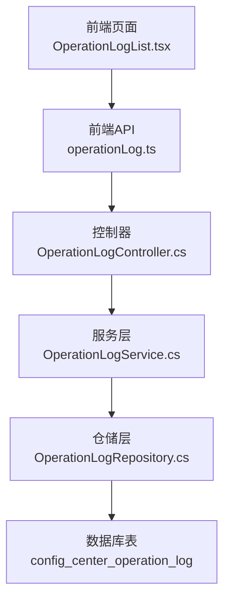
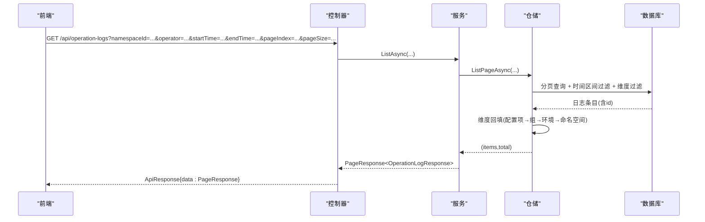
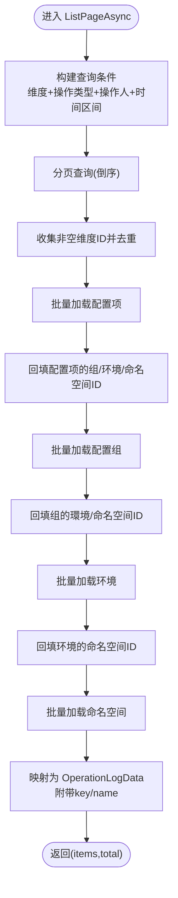
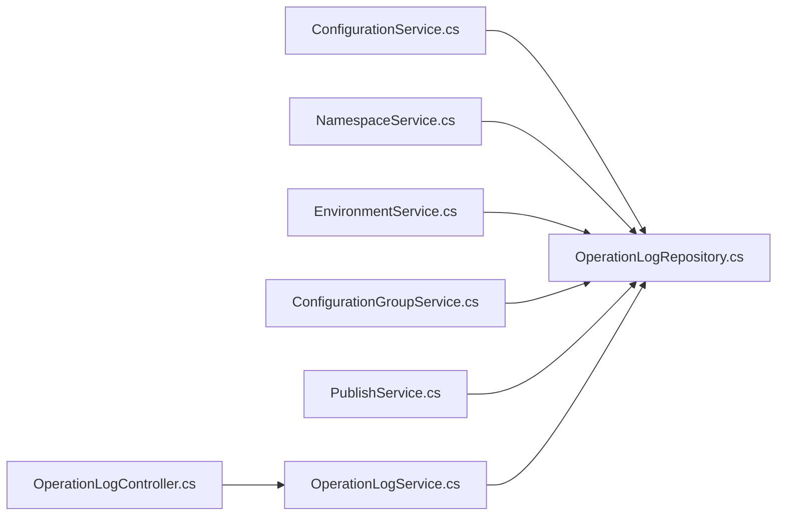

# 操作日志API

<cite>
**本文引用的文件**
- [OperationLogController.cs](file://k_config_center/src/Controllers/OperationLogController.cs)
- [OperationLogService.cs](file://k_config_center/src/Services/OperationLogService.cs)
- [OperationLogRepository.cs](file://k_config_center/src/Repositories/OperationLogRepository.cs)
- [ConfigCenterOperationLog.cs](file://k_config_center/src/Entities/ConfigCenterOperationLog.cs)
- [CommonData.cs](file://k_config_center/src/Models/Domain/CommonData.cs)
- [ApiResponse.cs](file://k_config_center/src/Infrastructure/ApiResponse.cs)
- [operationLog.ts](file://web/src/api/operationLog.ts)
- [types.ts](file://web/src/api/types.ts)
- [OperationLogList.tsx](file://web/src/pages/audit/OperationLogList.tsx)
- [ConfigurationService.cs](file://k_config_center/src/Services/ConfigurationService.cs)
</cite>

## 目录
1. [简介](#简介)
2. [项目结构](#项目结构)
3. [核心组件](#核心组件)
4. [架构总览](#架构总览)
5. [详细组件分析](#详细组件分析)
6. [依赖关系分析](#依赖关系分析)
7. [性能考量](#性能考量)
8. [故障排查指南](#故障排查指南)
9. [结论](#结论)
10. [附录：接口规范与使用示例](#附录接口规范与使用示例)

## 简介
本模块提供配置中心的“操作日志”审计能力，支持对命名空间、环境、配置组、配置项等维度的变更与发布操作进行记录与查询。通过多维度筛选与分页检索，帮助运维与研发人员快速定位问题、追溯变更历史，并支撑合规审计。

## 项目结构
后端采用分层架构：控制器负责路由与参数绑定，服务层封装业务逻辑，仓储层负责数据访问；实体与领域模型用于承载数据形态。前端提供操作审计页面，调用统一 API 获取日志列表并展示。

图表来源
- [OperationLogController.cs:1-31](file://k_config_center/src/Controllers/OperationLogController.cs#L1-L31)
- [OperationLogService.cs:1-20](file://k_config_center/src/Services/OperationLogService.cs#L1-L20)
- [OperationLogRepository.cs:1-103](file://k_config_center/src/Repositories/OperationLogRepository.cs#L1-L103)
- [operationLog.ts:1-9](file://web/src/api/operationLog.ts#L1-L9)
- [OperationLogList.tsx:1-199](file://web/src/pages/audit/OperationLogList.tsx#L1-L199)

章节来源
- [OperationLogController.cs:1-31](file://k_config_center/src/Controllers/OperationLogController.cs#L1-L31)
- [OperationLogService.cs:1-20](file://k_config_center/src/Services/OperationLogService.cs#L1-L20)
- [OperationLogRepository.cs:1-103](file://k_config_center/src/Repositories/OperationLogRepository.cs#L1-L103)
- [operationLog.ts:1-9](file://web/src/api/operationLog.ts#L1-L9)
- [OperationLogList.tsx:1-199](file://web/src/pages/audit/OperationLogList.tsx#L1-L199)

## 核心组件
- 控制器：暴露 GET /api/operation-logs，支持多维度过滤与分页。
- 服务：组合过滤条件，执行分页查询并转换响应模型。
- 仓储：实现日志写入（InsertAsync）与分页检索（ListPageAsync），包含维度回填与批量关联查询。
- 实体：映射数据库表 config_center_operation_log。
- 领域模型：OperationLogData 作为仓储对外数据形态，避免实体泄漏。
- 统一响应：ApiResponse 包裹 {code, message, data}。

章节来源
- [OperationLogController.cs:1-31](file://k_config_center/src/Controllers/OperationLogController.cs#L1-L31)
- [OperationLogService.cs:1-20](file://k_config_center/src/Services/OperationLogService.cs#L1-L20)
- [OperationLogRepository.cs:1-103](file://k_config_center/src/Repositories/OperationLogRepository.cs#L1-L103)
- [ConfigCenterOperationLog.cs:1-41](file://k_config_center/src/Entities/ConfigCenterOperationLog.cs#L1-L41)
- [CommonData.cs:1-13](file://k_config_center/src/Models/Domain/CommonData.cs#L1-L13)
- [ApiResponse.cs:1-10](file://k_config_center/src/Infrastructure/ApiResponse.cs#L1-L10)

## 架构总览
操作日志的读取流程从前端发起请求，经控制器到服务再到仓储，最终由数据库返回结果并进行维度回填与关联信息补充，再逐层返回给前端展示。

图表来源
- [OperationLogController.cs:12-29](file://k_config_center/src/Controllers/OperationLogController.cs#L12-L29)
- [OperationLogService.cs:10-18](file://k_config_center/src/Services/OperationLogService.cs#L10-L18)
- [OperationLogRepository.cs:27-84](file://k_config_center/src/Repositories/OperationLogRepository.cs#L27-L84)

## 详细组件分析

### 控制器：OperationLogController
- 路由：GET /api/operation-logs
- 功能：接收多维过滤参数（命名空间、环境、配置组、配置项、操作类型、操作人、时间区间）与分页参数，调用服务层并返回统一响应。
- 排序：按创建时间倒序。
- 时间区间：闭开区间 [startTime, endTime)。

章节来源
- [OperationLogController.cs:12-29](file://k_config_center/src/Controllers/OperationLogController.cs#L12-L29)

### 服务：OperationLogService
- 职责：组装查询参数，调用仓储分页检索，将仓储返回的 OperationLogData 转换为响应模型。
- 约束：日志只读，不提供修改/删除能力；写入由各业务 Service 调用仓储完成。

章节来源
- [OperationLogService.cs:6-18](file://k_config_center/src/Services/OperationLogService.cs#L6-L18)

### 仓储：OperationLogRepository
- 写入：InsertAsync 将 detail 序列化为 JSONB 插入，支持事务内随事务同生共死。
- 查询：ListPageAsync 支持多维度可选过滤、时间区间过滤、按创建时间倒序分页；并对历史日志进行维度回填（自下而上补齐上级 id），批量带出各维度 key/名称供展示。
- 软删处理：使用 ClearFilter 绕过全局软删过滤器，确保审计可回溯已删除资源。

图表来源
- [OperationLogRepository.cs:27-84](file://k_config_center/src/Repositories/OperationLogRepository.cs#L27-L84)
- [OperationLogRepository.cs:86-96](file://k_config_center/src/Repositories/OperationLogRepository.cs#L86-L96)

章节来源
- [OperationLogRepository.cs:12-25](file://k_config_center/src/Repositories/OperationLogRepository.cs#L12-L25)
- [OperationLogRepository.cs:27-84](file://k_config_center/src/Repositories/OperationLogRepository.cs#L27-L84)
- [OperationLogRepository.cs:86-101](file://k_config_center/src/Repositories/OperationLogRepository.cs#L86-L101)

### 实体：ConfigCenterOperationLog
- 字段：id、namespace_id、environment_id、group_id、configuration_id、operation、detail(jsonb)、operator、client_ip_address、created_at(timestamptz)。
- 说明：detail 存储变更详情摘要；operation 枚举值包括 CREATE/UPDATE/PUBLISH/ROLLBACK/OFFLINE/DELETE。

章节来源
- [ConfigCenterOperationLog.cs:5-41](file://k_config_center/src/Entities/ConfigCenterOperationLog.cs#L5-L41)

### 领域模型：OperationLogData
- 作用：仓储对外数据形态，包含基础字段与联表带出的维度 key/name（含已软删记录）。
- 优势：避免实体泄漏至上层，便于扩展展示字段。

章节来源
- [CommonData.cs:7-12](file://k_config_center/src/Models/Domain/CommonData.cs#L7-L12)

### 统一响应：ApiResponse
- 结构：{ code, message, data }，HTTP 一律 200，业务失败通过 code 表达。

章节来源
- [ApiResponse.cs:1-10](file://k_config_center/src/Infrastructure/ApiResponse.cs#L1-L10)

### 前端集成
- API 调用：operationLog.ts 提供 listOperationLogs，对应后端路由 /operation-logs。
- 类型定义：types.ts 定义 OperationLogResponse、OperationLogQuery、PageResponse 等。
- 页面展示：OperationLogList.tsx 提供操作人模糊匹配、时间范围选择、分页、列设置、展开查看 detail(JSON) 等功能。

章节来源
- [operationLog.ts:1-9](file://web/src/api/operationLog.ts#L1-L9)
- [types.ts:207-237](file://web/src/api/types.ts#L207-L237)
- [OperationLogList.tsx:14-199](file://web/src/pages/audit/OperationLogList.tsx#L14-L199)

## 依赖关系分析
- 控制器依赖服务层，服务层依赖仓储层，仓储层依赖数据库。
- 写入路径：业务 Service（如 ConfigurationService）在关键操作后调用仓储 InsertAsync 写入日志。
- 查询路径：控制器 → 服务 → 仓储 → 数据库，并在仓储内进行维度回填与批量关联查询。

图表来源
- [ConfigurationService.cs:104-108](file://k_config_center/src/Services/ConfigurationService.cs#L104-L108)
- [OperationLogController.cs:12-29](file://k_config_center/src/Controllers/OperationLogController.cs#L12-L29)
- [OperationLogService.cs:10-18](file://k_config_center/src/Services/OperationLogService.cs#L10-L18)
- [OperationLogRepository.cs:12-25](file://k_config_center/src/Repositories/OperationLogRepository.cs#L12-L25)

章节来源
- [ConfigurationService.cs:104-108](file://k_config_center/src/Services/ConfigurationService.cs#L104-L108)
- [OperationLogController.cs:12-29](file://k_config_center/src/Controllers/OperationLogController.cs#L12-L29)
- [OperationLogService.cs:10-18](file://k_config_center/src/Services/OperationLogService.cs#L10-L18)
- [OperationLogRepository.cs:12-25](file://k_config_center/src/Repositories/OperationLogRepository.cs#L12-L25)

## 性能考量
- 分页查询：默认 pageSize=20，可按需调整以减少单次传输量。
- 维度回填：采用批量 In 查询并按 ID 建立字典映射，避免 N+1 问题。
- 软删绕过：审计查询使用 ClearFilter 以包含已删除资源，确保完整性。
- JSONB 存储：detail 使用 jsonb 提升存储与查询效率。
- 时间区间：闭开区间 [startTime, endTime) 减少边界重复。

[本节为通用指导，不直接分析具体文件]

## 故障排查指南
- 无数据或数据不全：检查是否传入了正确的维度 ID；确认时间区间是否为有效范围；确认是否存在软删导致的数据不可见（审计查询会绕过软删）。
- 维度显示为空：若仅记录了下级维度 ID（如 configuration_id），仓储会回填上级维度；若仍为空，可能关联不到对应资源。
- 操作人/IP 为空：确认业务 Service 是否正确提取当前请求的操作人与客户端 IP 并传入仓储。
- 响应码异常：统一响应中 code 非 0 表示业务失败，message 描述错误原因。

章节来源
- [OperationLogRepository.cs:27-84](file://k_config_center/src/Repositories/OperationLogRepository.cs#L27-L84)
- [ConfigurationService.cs:104-108](file://k_config_center/src/Services/ConfigurationService.cs#L104-L108)
- [ApiResponse.cs:1-10](file://k_config_center/src/Infrastructure/ApiResponse.cs#L1-L10)

## 结论
操作日志模块提供了完整的审计能力，支持多维度筛选与分页查询，并通过维度回填与批量关联查询保证展示信息的完整性与准确性。结合前端的交互设计，用户可高效定位问题、追溯变更历史，满足运维与合规需求。

[本节为总结性内容，不直接分析具体文件]

## 附录：接口规范与使用示例

### 接口定义
- 方法：GET
- 路径：/api/operation-logs
- 查询参数（均可选）：
  - namespaceId: long? 按命名空间过滤
  - environmentId: long? 按环境过滤
  - groupId: long? 按配置组过滤
  - configurationId: long? 按配置项过滤
  - operation: string? 按操作类型过滤（CREATE/UPDATE/PUBLISH/ROLLBACK/OFFLINE/DELETE）
  - operator: string? 按操作人过滤（模糊匹配）
  - startTime: DateTimeOffset? 起始时间（含）
  - endTime: DateTimeOffset? 结束时间（不含）
  - pageIndex: int 页码（从 1 开始）
  - pageSize: int 每页条数
- 排序：按 created_at 倒序
- 时间区间：[startTime, endTime)

章节来源
- [OperationLogController.cs:12-29](file://k_config_center/src/Controllers/OperationLogController.cs#L12-L29)

### 响应数据结构
- 统一响应：ApiResponse{ code, message, data }
- data：PageResponse<OperationLogResponse>{ items[], total }
- OperationLogResponse 字段：
  - id: number
  - namespaceId/environmentId/groupId/configurationId: number | null
  - namespaceKey/namespaceName/environmentKey/environmentName/groupKey/groupName/configurationKey: string | null
  - operation: string
  - detail: string | null（JSONB 摘要）
  - operator: string | null
  - clientIpAddress: string | null
  - createdAt: string（ISO 8601）

章节来源
- [ApiResponse.cs:1-10](file://k_config_center/src/Infrastructure/ApiResponse.cs#L1-L10)
- [types.ts:207-237](file://web/src/api/types.ts#L207-L237)

### 典型使用场景与示例
- 查询特定用户的操作记录：
  - 参数：operator="用户名"，其他条件按需组合
  - 前端示例：在 OperationLogList.tsx 中通过表单提交 operator 与时间范围，调用 listOperationLogs
- 导出日志数据：
  - 建议：在前端根据查询条件拉取多页数据后进行本地导出（CSV/Excel），或使用后端新增导出接口（当前仓库未提供）
- 查看变更详情：
  - 前端表格支持展开行，格式化展示 detail（JSON 缩进）

章节来源
- [OperationLogList.tsx:50-199](file://web/src/pages/audit/OperationLogList.tsx#L50-L199)
- [operationLog.ts:1-9](file://web/src/api/operationLog.ts#L1-L9)
- [types.ts:207-237](file://web/src/api/types.ts#L207-L237)