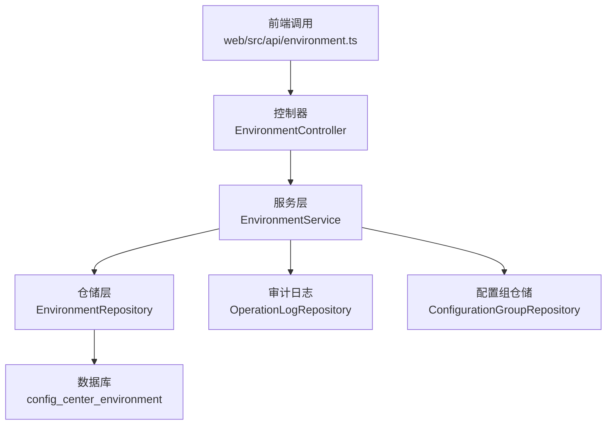
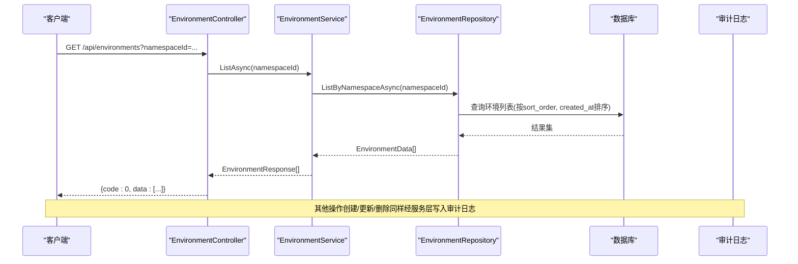
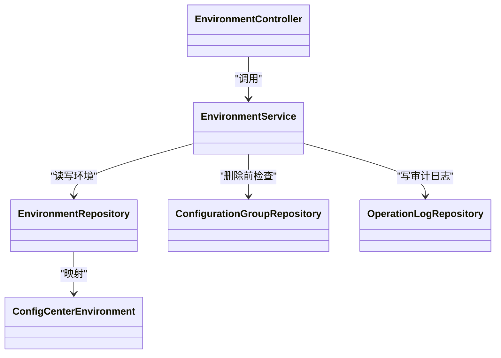

# 环境管理API

<cite>
**本文引用的文件**
- [EnvironmentController.cs](file://k_config_center/src/Controllers/EnvironmentController.cs)
- [EnvironmentService.cs](file://k_config_center/src/Services/EnvironmentService.cs)
- [EnvironmentRepository.cs](file://k_config_center/src/Repositories/EnvironmentRepository.cs)
- [ConfigCenterEnvironment.cs](file://k_config_center/src/Entities/ConfigCenterEnvironment.cs)
- [EnvironmentRequests.cs](file://k_config_center/src/Models/Requests/EnvironmentRequests.cs)
- [BasicDimensionResponses.cs](file://k_config_center/src/Models/Responses/BasicDimensionResponses.cs)
- [ApiResponse.cs](file://k_config_center/src/Infrastructure/ApiResponse.cs)
- [BusinessException.cs](file://k_config_center/src/Infrastructure/BusinessException.cs)
- [environment.ts](file://web/src/api/environment.ts)
- [types.ts](file://web/src/api/types.ts)
- [配置中心建表脚本.sql](file://docs/数据库脚本/配置中心建表脚本.sql)
- [后端方案.md](file://docs/技术方案/后端方案.md)
</cite>

## 目录
1. [简介](#简介)
2. [项目结构](#项目结构)
3. [核心组件](#核心组件)
4. [架构总览](#架构总览)
5. [详细组件分析](#详细组件分析)
6. [依赖关系分析](#依赖关系分析)
7. [性能与排序特性](#性能与排序特性)
8. [故障排查指南](#故障排查指南)
9. [结论](#结论)
10. [附录：接口定义与使用示例](#附录接口定义与使用示例)

## 简介
本模块提供配置中心“环境”维度的管理能力，用于在多环境（如 dev/test/staging/prod）之间隔离配置。通过统一的 REST API 完成环境的增删改查、排序与状态管理，并在删除时进行级联检查，确保数据一致性。所有操作均记录审计日志，便于追溯。

## 项目结构
环境管理由控制器、服务、仓储、实体与请求/响应模型组成，前后端通过 HTTP 交互。

图表来源
- [EnvironmentController.cs:8-51](file://k_config_center/src/Controllers/EnvironmentController.cs#L8-L51)
- [EnvironmentService.cs:9-66](file://k_config_center/src/Services/EnvironmentService.cs#L9-L66)
- [EnvironmentRepository.cs:7-70](file://k_config_center/src/Repositories/EnvironmentRepository.cs#L7-L70)
- [ConfigCenterEnvironment.cs:5-39](file://k_config_center/src/Entities/ConfigCenterEnvironment.cs#L5-L39)
- [environment.ts:4-19](file://web/src/api/environment.ts#L4-L19)

章节来源
- [EnvironmentController.cs:8-51](file://k_config_center/src/Controllers/EnvironmentController.cs#L8-L51)
- [EnvironmentService.cs:9-66](file://k_config_center/src/Services/EnvironmentService.cs#L9-L66)
- [EnvironmentRepository.cs:7-70](file://k_config_center/src/Repositories/EnvironmentRepository.cs#L7-L70)
- [ConfigCenterEnvironment.cs:5-39](file://k_config_center/src/Entities/ConfigCenterEnvironment.cs#L5-L39)
- [environment.ts:4-19](file://web/src/api/environment.ts#L4-L19)

## 核心组件
- 控制器：接收请求并调用服务，统一返回 ApiResponse。
- 服务：实现业务规则（唯一性校验、软删除级联检查、审计日志）。
- 仓储：封装 SQL 查询与更新，按命名空间过滤、排序、软删除等。
- 实体：映射数据库表 config_center_environment。
- 请求/响应：定义创建/更新参数与环境响应结构。

章节来源
- [EnvironmentController.cs:8-51](file://k_config_center/src/Controllers/EnvironmentController.cs#L8-L51)
- [EnvironmentService.cs:9-66](file://k_config_center/src/Services/EnvironmentService.cs#L9-L66)
- [EnvironmentRepository.cs:7-70](file://k_config_center/src/Repositories/EnvironmentRepository.cs#L7-L70)
- [ConfigCenterEnvironment.cs:5-39](file://k_config_center/src/Entities/ConfigCenterEnvironment.cs#L5-L39)
- [EnvironmentRequests.cs:1-17](file://k_config_center/src/Models/Requests/EnvironmentRequests.cs#L1-L17)
- [BasicDimensionResponses.cs:23-42](file://k_config_center/src/Models/Responses/BasicDimensionResponses.cs#L23-L42)

## 架构总览
环境管理的典型调用链：前端发起 HTTP 请求 → 控制器路由到对应方法 → 服务层执行业务逻辑 → 仓储层访问数据库 → 写审计日志 → 统一响应。

图表来源
- [EnvironmentController.cs:13-49](file://k_config_center/src/Controllers/EnvironmentController.cs#L13-L49)
- [EnvironmentService.cs:20-65](file://k_config_center/src/Services/EnvironmentService.cs#L20-L65)
- [EnvironmentRepository.cs:10-18](file://k_config_center/src/Repositories/EnvironmentRepository.cs#L10-L18)

## 详细组件分析

### 控制器：EnvironmentController
- 路由前缀：/api/environments
- 能力：
  - 获取环境列表（可选按 namespaceId 过滤），按 sort_order 升序，已软删除不返回
  - 创建环境（同命名空间内 environment_key 唯一）
  - 更新环境（名称/描述/排序/状态；key 与所属命名空间不可改）
  - 删除环境（软删除；存在未删除的下级配置组拒绝）

章节来源
- [EnvironmentController.cs:8-51](file://k_config_center/src/Controllers/EnvironmentController.cs#L8-L51)

### 服务：EnvironmentService
- 列表：按命名空间过滤后转换为响应对象
- 创建：构造领域数据，插入后写审计日志；唯一冲突转业务错误码
- 更新：先校验存在性，再更新名称/描述/排序/状态，写审计日志
- 删除：先校验存在性，再检查是否存在未删除的配置组，最后软删除并写审计日志

章节来源
- [EnvironmentService.cs:20-65](file://k_config_center/src/Services/EnvironmentService.cs#L20-L65)

### 仓储：EnvironmentRepository
- 列表：左连接命名空间表，显式处理 deleted_at，按 sort_order 与 created_at 排序
- 单条查询：按 id 查询，已软删返回 null
- 插入：id 由数据库生成回填
- 更新：仅更新名称/描述/排序/状态
- 软删除：置 deleted_at

章节来源
- [EnvironmentRepository.cs:10-50](file://k_config_center/src/Repositories/EnvironmentRepository.cs#L10-L50)

### 实体：ConfigCenterEnvironment
- 字段包括：id、namespace_id、environment_key、environment_name、description、sort_order、status、deleted_at、created_at、updated_at
- 约束：命名空间外键；命名空间+environment_key 的唯一索引（仅对未软删记录生效）

章节来源
- [ConfigCenterEnvironment.cs:5-39](file://k_config_center/src/Entities/ConfigCenterEnvironment.cs#L5-L39)
- [配置中心建表脚本.sql:58-77](file://docs/数据库脚本/配置中心建表脚本.sql#L58-L77)

### 请求与响应模型
- 创建请求：包含命名空间 id、环境 key、名称、描述、排序
- 更新请求：包含名称、描述、排序、状态（1=启用，0=禁用）
- 环境响应：包含基础字段及命名空间冗余信息（key/name）

章节来源
- [EnvironmentRequests.cs:1-17](file://k_config_center/src/Models/Requests/EnvironmentRequests.cs#L1-L17)
- [BasicDimensionResponses.cs:23-42](file://k_config_center/src/Models/Responses/BasicDimensionResponses.cs#L23-L42)
- [types.ts:57-87](file://web/src/api/types.ts#L57-L87)

## 依赖关系分析
- 控制器依赖服务；服务依赖仓储、配置组仓储与审计日志仓储；仓储依赖 SqlSugar 客户端与数据库实体。
- 删除流程中，服务通过配置组仓储检查是否存在未删除的配置组，避免破坏引用完整性。

图表来源
- [EnvironmentController.cs:8-51](file://k_config_center/src/Controllers/EnvironmentController.cs#L8-L51)
- [EnvironmentService.cs:9-66](file://k_config_center/src/Services/EnvironmentService.cs#L9-L66)
- [EnvironmentRepository.cs:7-70](file://k_config_center/src/Repositories/EnvironmentRepository.cs#L7-L70)
- [ConfigCenterEnvironment.cs:5-39](file://k_config_center/src/Entities/ConfigCenterEnvironment.cs#L5-L39)

章节来源
- [EnvironmentService.cs:9-66](file://k_config_center/src/Services/EnvironmentService.cs#L9-L66)
- [EnvironmentRepository.cs:7-70](file://k_config_center/src/Repositories/EnvironmentRepository.cs#L7-L70)

## 性能与排序特性
- 列表排序：按 sort_order 升序，其次按 created_at 排序，保证稳定顺序。
- 软删除：查询默认过滤 deleted_at IS NULL，避免脏数据影响展示。
- 唯一性：命名空间内 environment_key 唯一（仅对未软删记录），支持软删除后复用 key。
- 联表优化：列表查询显式带 deleted_at 条件，避免依赖全局过滤器在联表中的行为差异。

章节来源
- [EnvironmentRepository.cs:10-18](file://k_config_center/src/Repositories/EnvironmentRepository.cs#L10-L18)
- [配置中心建表脚本.sql:58-77](file://docs/数据库脚本/配置中心建表脚本.sql#L58-L77)

## 故障排查指南
- 资源不存在：更新或删除时报错，确认环境 id 有效且未被软删除。
- 唯一冲突：创建环境时报错，检查同一命名空间下是否已存在相同 environment_key。
- 级联删除冲突：删除环境时报错，说明该环境下仍存在未删除的配置组，需先清理下级资源。
- 统一响应：HTTP 始终 200，业务失败通过 code 表达；成功时 code=0。

章节来源
- [EnvironmentService.cs:24-65](file://k_config_center/src/Services/EnvironmentService.cs#L24-L65)
- [ApiResponse.cs:1-10](file://k_config_center/src/Infrastructure/ApiResponse.cs#L1-L10)
- [BusinessException.cs:1-11](file://k_config_center/src/Infrastructure/BusinessException.cs#L1-L11)
- [后端方案.md:482-496](file://docs/技术方案/后端方案.md#L482-L496)

## 结论
环境管理模块提供了清晰的多环境隔离能力，通过严格的唯一性与级联检查保障数据一致性，并以软删除与审计日志提升可维护性与可追溯性。排序与状态字段满足常见运维场景需求。

## 附录：接口定义与使用示例

### 接口总览
- 基础路径：/api/environments
- 统一响应格式：{ code, message, data }，HTTP 始终 200，业务失败通过 code 区分

章节来源
- [EnvironmentController.cs:8-51](file://k_config_center/src/Controllers/EnvironmentController.cs#L8-L51)
- [ApiResponse.cs:1-10](file://k_config_center/src/Infrastructure/ApiResponse.cs#L1-L10)

### 获取环境列表
- 方法：GET
- 路径：/api/environments
- 查询参数：
  - namespaceId：可选，过滤指定命名空间下的环境；不传则返回全部
- 响应 data：EnvironmentResponse[]，按 sort_order 升序排列，已软删除不返回

章节来源
- [EnvironmentController.cs:13-19](file://k_config_center/src/Controllers/EnvironmentController.cs#L13-L19)
- [EnvironmentRepository.cs:10-18](file://k_config_center/src/Repositories/EnvironmentRepository.cs#L10-L18)
- [BasicDimensionResponses.cs:23-42](file://k_config_center/src/Models/Responses/BasicDimensionResponses.cs#L23-L42)
- [environment.ts:6-8](file://web/src/api/environment.ts#L6-L8)
- [types.ts:57-72](file://web/src/api/types.ts#L57-L72)

### 创建环境
- 方法：POST
- 路径：/api/environments
- 请求体：
  - namespaceId：所属命名空间 id
  - environmentKey：环境标识，同命名空间内唯一，创建后不可改
  - environmentName：显示名称
  - description：描述，可空
  - sortOrder：排序值，列表按此升序展示
- 响应 data：新建的 EnvironmentResponse（含数据库生成的 id）
- 错误码：
  - 20002：环境 key 在命名空间内已存在

章节来源
- [EnvironmentController.cs:21-27](file://k_config_center/src/Controllers/EnvironmentController.cs#L21-L27)
- [EnvironmentService.cs:24-36](file://k_config_center/src/Services/EnvironmentService.cs#L24-L36)
- [EnvironmentRequests.cs:1-9](file://k_config_center/src/Models/Requests/EnvironmentRequests.cs#L1-L9)
- [后端方案.md:482-489](file://docs/技术方案/后端方案.md#L482-L489)
- [environment.ts:10-12](file://web/src/api/environment.ts#L10-L12)
- [types.ts:74-80](file://web/src/api/types.ts#L74-L80)

### 更新环境
- 方法：PUT
- 路径：/api/environments/{id}
- 路径参数：
  - id：环境 id
- 请求体：
  - environmentName：显示名称
  - description：描述，可空
  - sortOrder：排序值
  - status：状态，1=启用，0=禁用
- 限制：environmentKey 与所属命名空间不可修改
- 错误码：
  - 10002：资源不存在

章节来源
- [EnvironmentController.cs:29-39](file://k_config_center/src/Controllers/EnvironmentController.cs#L29-L39)
- [EnvironmentService.cs:38-48](file://k_config_center/src/Services/EnvironmentService.cs#L38-L48)
- [EnvironmentRequests.cs:11-16](file://k_config_center/src/Models/Requests/EnvironmentRequests.cs#L11-L16)
- [后端方案.md:482-489](file://docs/技术方案/后端方案.md#L482-L489)
- [environment.ts:14-16](file://web/src/api/environment.ts#L14-L16)
- [types.ts:82-87](file://web/src/api/types.ts#L82-L87)

### 删除环境
- 方法：DELETE
- 路径：/api/environments/{id}
- 路径参数：
  - id：环境 id
- 行为：软删除（置 deleted_at），不做物理删除
- 限制：若存在未删除的下级配置组，拒绝删除
- 错误码：
  - 20004：存在未删除的下级资源，拒绝删除

章节来源
- [EnvironmentController.cs:41-50](file://k_config_center/src/Controllers/EnvironmentController.cs#L41-L50)
- [EnvironmentService.cs:50-60](file://k_config_center/src/Services/EnvironmentService.cs#L50-L60)
- [后端方案.md:482-489](file://docs/技术方案/后端方案.md#L482-L489)
- [environment.ts:18-19](file://web/src/api/environment.ts#L18-L19)

### 典型使用场景与调用示例
- 创建新环境：在前端调用 createEnvironment，传入 namespaceId、environmentKey、environmentName、description、sortOrder。
- 修改环境顺序：调用 updateEnvironment，传入目标 id 与新的 sortOrder。
- 禁用/启用环境：调用 updateEnvironment，设置 status 为 0 或 1。
- 删除环境：调用 deleteEnvironment，注意需先清理该环境下的配置组。

章节来源
- [environment.ts:6-19](file://web/src/api/environment.ts#L6-L19)
- [types.ts:57-87](file://web/src/api/types.ts#L57-L87)

### 错误码说明（节选）
- 0：成功
- 10002：资源不存在
- 20002：环境 key 在命名空间内已存在
- 20004：存在未删除的下级资源，拒绝删除

章节来源
- [后端方案.md:482-489](file://docs/技术方案/后端方案.md#L482-L489)