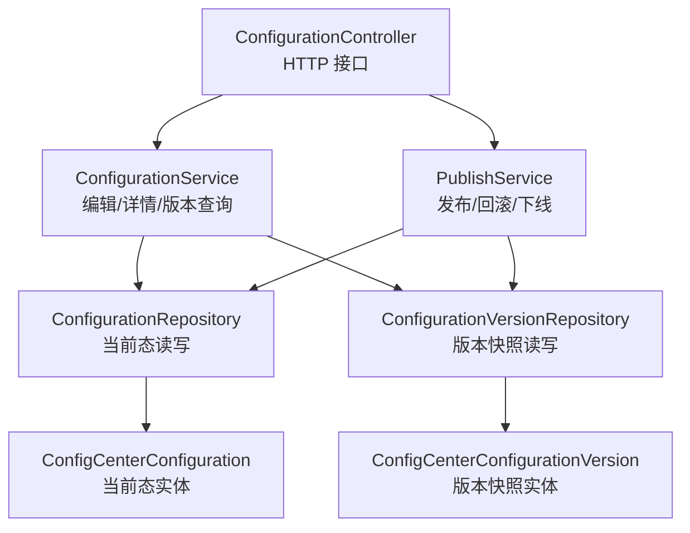
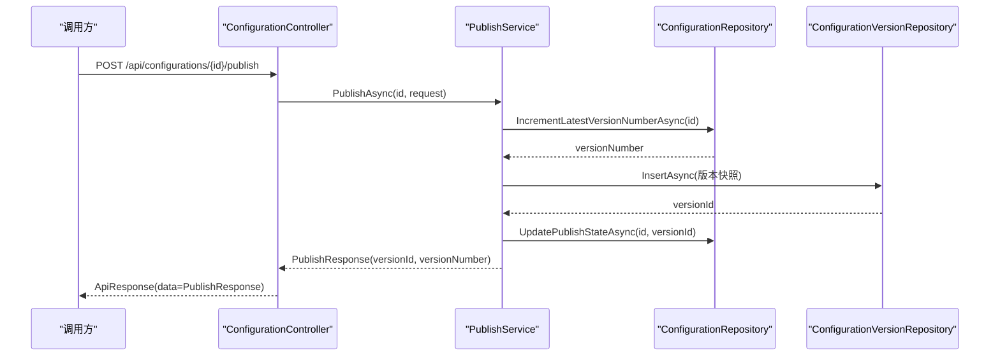
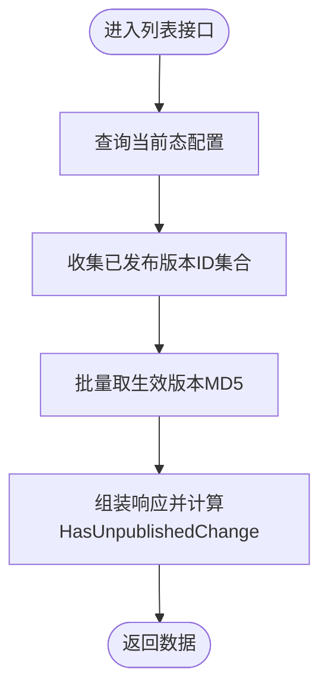
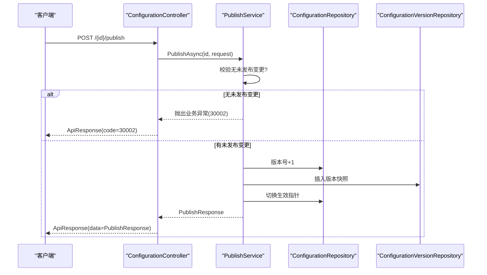
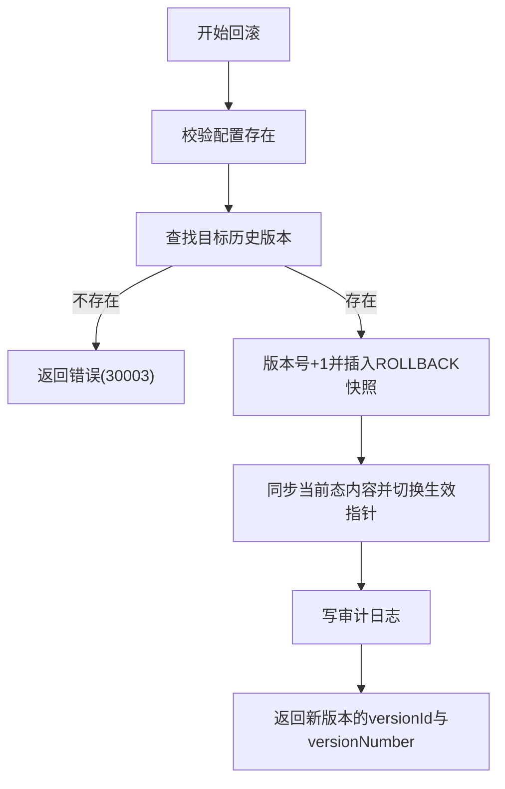
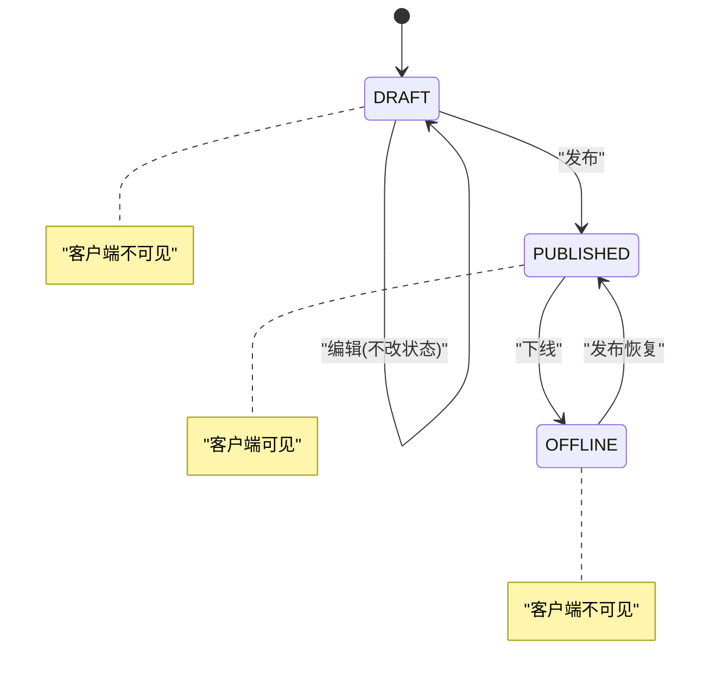
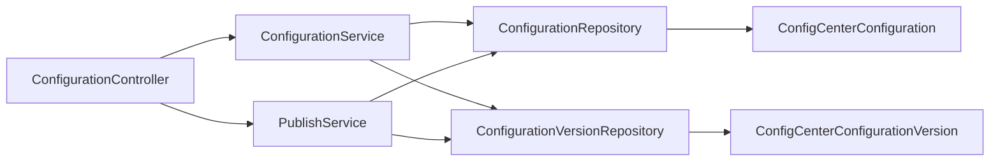

# 配置管理API

<cite>
**本文引用的文件**
- [ConfigurationController.cs](file://k_config_center/src/Controllers/ConfigurationController.cs)
- [ConfigurationService.cs](file://k_config_center/src/Services/ConfigurationService.cs)
- [PublishService.cs](file://k_config_center/src/Services/PublishService.cs)
- [ConfigurationRequests.cs](file://k_config_center/src/Models/Requests/ConfigurationRequests.cs)
- [ConfigurationResponses.cs](file://k_config_center/src/Models/Responses/ConfigurationResponses.cs)
- [ConfigCenterConfiguration.cs](file://k_config_center/src/Entities/ConfigCenterConfiguration.cs)
- [ConfigCenterConfigurationVersion.cs](file://k_config_center/src/Entities/ConfigCenterConfigurationVersion.cs)
- [ConfigurationRepository.cs](file://k_config_center/src/Repositories/ConfigurationRepository.cs)
- [ConfigurationVersionRepository.cs](file://k_config_center/src/Repositories/ConfigurationVersionRepository.cs)
- [ApiResponse.cs](file://k_config_center/src/Infrastructure/ApiResponse.cs)
- [BusinessException.cs](file://k_config_center/src/Infrastructure/BusinessException.cs)
- [配置中心设计文档.md](file://docs/设计文档/配置中心设计文档.md)
</cite>

## 目录
1. [简介](#简介)
2. [项目结构](#项目结构)
3. [核心组件](#核心组件)
4. [架构总览](#架构总览)
5. [详细组件分析](#详细组件分析)
6. [依赖关系分析](#依赖关系分析)
7. [性能考虑](#性能考虑)
8. [故障排查指南](#故障排查指南)
9. [结论](#结论)
10. [附录：API 契约与使用示例](#附录api-契约与使用示例)

## 简介
本模块提供配置项的完整生命周期管理能力，包括创建、编辑（草稿）、发布、回滚、下线、删除以及版本历史查询。系统通过“当前态 + 版本快照”的双表模型实现可追溯的版本管理，并通过状态机控制配置的可见性与生效范围。所有操作均返回统一响应格式，错误通过业务码表达，便于前端统一处理。

## 项目结构
配置管理模块采用分层架构：控制器负责参数接收与响应包装；服务层封装业务逻辑；仓储层对接数据库实体；领域模型与请求/响应对象在 Models 中定义；基础设施提供统一响应与异常封装。

图表来源
- [ConfigurationController.cs:1-115](file://k_config_center/src/Controllers/ConfigurationController.cs#L1-L115)
- [ConfigurationService.cs:1-110](file://k_config_center/src/Services/ConfigurationService.cs#L1-L110)
- [PublishService.cs:1-116](file://k_config_center/src/Services/PublishService.cs#L1-L116)
- [ConfigurationRepository.cs:1-155](file://k_config_center/src/Repositories/ConfigurationRepository.cs#L1-L155)
- [ConfigurationVersionRepository.cs:1-65](file://k_config_center/src/Repositories/ConfigurationVersionRepository.cs#L1-L65)
- [ConfigCenterConfiguration.cs:1-66](file://k_config_center/src/Entities/ConfigCenterConfiguration.cs#L1-L66)
- [ConfigCenterConfigurationVersion.cs:1-39](file://k_config_center/src/Entities/ConfigCenterConfigurationVersion.cs#L1-L39)

章节来源
- [ConfigurationController.cs:1-115](file://k_config_center/src/Controllers/ConfigurationController.cs#L1-L115)
- [配置中心设计文档.md:10-65](file://docs/设计文档/配置中心设计文档.md#L10-L65)

## 核心组件
- 控制器：暴露 RESTful 接口，统一返回 ApiResponse 包裹的数据。
- 服务：
  - ConfigurationService：负责列表、详情、创建、更新（草稿）、删除、版本历史与单版本快照查询。
  - PublishService：负责发布、回滚、下线等事务型操作，保证版本号、快照、生效指针与日志的一致性。
- 仓储：对数据库实体的增删改查与原子操作（如版本号递增）。
- 模型：请求/响应对象明确字段语义与约束；实体映射数据库表结构。
- 基础设施：统一响应与业务异常封装，全局异常中间件将业务异常转为 {code, message, data}。

章节来源
- [ConfigurationController.cs:1-115](file://k_config_center/src/Controllers/ConfigurationController.cs#L1-L115)
- [ConfigurationService.cs:1-110](file://k_config_center/src/Services/ConfigurationService.cs#L1-L110)
- [PublishService.cs:1-116](file://k_config_center/src/Services/PublishService.cs#L1-L116)
- [ApiResponse.cs:1-10](file://k_config_center/src/Infrastructure/ApiResponse.cs#L1-L10)
- [BusinessException.cs:1-11](file://k_config_center/src/Infrastructure/BusinessException.cs#L1-L11)

## 架构总览
配置项由“当前态”与“版本快照”两张表组成：
- 当前态：保存最新编辑内容、格式、MD5、状态、生效版本指针等。
- 版本快照：记录每次发布/回滚时的不可变内容，支持对比与审计。

发布流程在事务内完成：版本号递增 → 写入快照 → 切换生效指针 → 写审计日志。回滚以目标历史版本内容生成新版本并同步当前态。下线仅改变状态，保留版本与指针，便于恢复上线。

图表来源
- [ConfigurationController.cs:65-73](file://k_config_center/src/Controllers/ConfigurationController.cs#L65-L73)
- [PublishService.cs:24-54](file://k_config_center/src/Services/PublishService.cs#L24-L54)
- [ConfigurationRepository.cs:75-90](file://k_config_center/src/Repositories/ConfigurationRepository.cs#L75-L90)
- [ConfigurationVersionRepository.cs:41-44](file://k_config_center/src/Repositories/ConfigurationVersionRepository.cs#L41-L44)

章节来源
- [配置中心设计文档.md:181-214](file://docs/设计文档/配置中心设计文档.md#L181-L214)

## 详细组件分析

### 配置项 CRUD 与版本历史
- 列表查询：支持按组、命名空间、环境、状态、关键字过滤；附带“有未发布变更”标记，避免前端重复计算 MD5。
- 详情获取：返回当前编辑态与生效版本快照（若从未发布则为空）。
- 新建配置：初始状态 DRAFT，版本号从 0 起；组内 key 唯一冲突返回特定错误码。
- 保存编辑（草稿）：只更新当前态字段，不产生版本、不改变状态。
- 删除配置：软删除，保留版本与日志以便审计。
- 版本历史：分页返回版本快照列表；支持按版本号获取单个快照用于差异对比。

图表来源
- [ConfigurationService.cs:23-32](file://k_config_center/src/Services/ConfigurationService.cs#L23-L32)
- [ConfigurationVersionRepository.cs:36-39](file://k_config_center/src/Repositories/ConfigurationVersionRepository.cs#L36-L39)

章节来源
- [ConfigurationController.cs:14-63](file://k_config_center/src/Controllers/ConfigurationController.cs#L14-L63)
- [ConfigurationService.cs:23-102](file://k_config_center/src/Services/ConfigurationService.cs#L23-L102)
- [ConfigurationResponses.cs:5-74](file://k_config_center/src/Models/Responses/ConfigurationResponses.cs#L5-L74)

### 发布流程（publish）
- 前置校验：若已是 PUBLISHED 且内容与生效版本一致，拒绝重复发布。
- 事务执行：
  1) 版本号原子递增；
  2) 写入版本快照（change_type 为 CREATE 或 UPDATE）；
  3) 切换生效指针并更新时间；
  4) 写审计日志。
- 并发保护：唯一约束冲突转换为并发冲突错误码，提示重试。

图表来源
- [PublishService.cs:24-54](file://k_config_center/src/Services/PublishService.cs#L24-L54)
- [ConfigurationRepository.cs:75-90](file://k_config_center/src/Repositories/ConfigurationRepository.cs#L75-L90)
- [ConfigurationVersionRepository.cs:41-44](file://k_config_center/src/Repositories/ConfigurationVersionRepository.cs#L41-L44)

章节来源
- [PublishService.cs:24-54](file://k_config_center/src/Services/PublishService.cs#L24-L54)
- [ConfigurationController.cs:65-73](file://k_config_center/src/Controllers/ConfigurationController.cs#L65-L73)

### 回滚机制（rollback）
- 行为：以目标历史版本内容生成新版本重新发布，change_type 为 ROLLBACK；不回退版本号，保持线性递增与可追溯。
- 当前态：同步为目标历史版本的内容、格式与 MD5，并切换生效指针。
- 错误：目标版本不存在返回特定错误码。

图表来源
- [PublishService.cs:56-80](file://k_config_center/src/Services/PublishService.cs#L56-L80)
- [ConfigurationRepository.cs:92-97](file://k_config_center/src/Repositories/ConfigurationRepository.cs#L92-L97)

章节来源
- [PublishService.cs:56-80](file://k_config_center/src/Services/PublishService.cs#L56-L80)
- [ConfigurationController.cs:75-83](file://k_config_center/src/Controllers/ConfigurationController.cs#L75-L83)

### 下线操作（offline）
- 行为：将状态置为 OFFLINE，客户端不再能读到该配置；不产生版本记录，保留 published_version_id 以便后续发布恢复上线。
- 限制：仅 PUBLISHED 状态可下线，否则返回业务状态非法错误。

章节来源
- [PublishService.cs:82-92](file://k_config_center/src/Services/PublishService.cs#L82-L92)
- [ConfigurationController.cs:85-94](file://k_config_center/src/Controllers/ConfigurationController.cs#L85-L94)

### 状态管理机制（DRAFT、PUBLISHED、OFFLINE）
- DRAFT：新建后未发布，客户端不可见；编辑不改变状态。
- PUBLISHED：已发布生效；再次编辑仍保持 PUBLISHED，但会产生“未发布变更”。
- OFFLINE：主动下线，客户端不可见；可通过发布恢复上线。
- 软删除：全资源统一策略，置 deleted_at，不影响版本与审计记录。

图表来源
- [配置中心设计文档.md:216-232](file://docs/设计文档/配置中心设计文档.md#L216-L232)
- [ConfigCenterConfiguration.cs:39-40](file://k_config_center/src/Entities/ConfigCenterConfiguration.cs#L39-L40)

章节来源
- [配置中心设计文档.md:216-232](file://docs/设计文档/配置中心设计文档.md#L216-L232)

### 版本快照与对比
- 版本快照：不可变，记录 content/format/md5/change_type/change_remark/crreated_by/created_at。
- 对比能力：通过获取两个版本的快照内容，前端可进行差异展示；服务端提供单版本快照查询接口。

章节来源
- [ConfigurationVersionRepository.cs:17-34](file://k_config_center/src/Repositories/ConfigurationVersionRepository.cs#L17-L34)
- [ConfigurationResponses.cs:52-69](file://k_config_center/src/Models/Responses/ConfigurationResponses.cs#L52-L69)
- [ConfigurationController.cs:96-113](file://k_config_center/src/Controllers/ConfigurationController.cs#L96-L113)

## 依赖关系分析
- 控制器依赖服务：ConfigurationController 依赖 ConfigurationService 与 PublishService。
- 服务依赖仓储：ConfigurationService 与 PublishService 分别依赖 ConfigurationRepository 与 ConfigurationVersionRepository。
- 仓储依赖实体：仓储层直接操作 ConfigCenterConfiguration 与 ConfigCenterConfigurationVersion 实体。
- 基础设施：统一响应 ApiResponse 与业务异常 BusinessException 贯穿各层。

图表来源
- [ConfigurationController.cs:1-115](file://k_config_center/src/Controllers/ConfigurationController.cs#L1-L115)
- [ConfigurationService.cs:1-110](file://k_config_center/src/Services/ConfigurationService.cs#L1-L110)
- [PublishService.cs:1-116](file://k_config_center/src/Services/PublishService.cs#L1-L116)
- [ConfigurationRepository.cs:1-155](file://k_config_center/src/Repositories/ConfigurationRepository.cs#L1-L155)
- [ConfigurationVersionRepository.cs:1-65](file://k_config_center/src/Repositories/ConfigurationVersionRepository.cs#L1-L65)
- [ConfigCenterConfiguration.cs:1-66](file://k_config_center/src/Entities/ConfigCenterConfiguration.cs#L1-L66)
- [ConfigCenterConfigurationVersion.cs:1-39](file://k_config_center/src/Entities/ConfigCenterConfigurationVersion.cs#L1-L39)

章节来源
- [ConfigurationController.cs:1-115](file://k_config_center/src/Controllers/ConfigurationController.cs#L1-L115)
- [ConfigurationService.cs:1-110](file://k_config_center/src/Services/ConfigurationService.cs#L1-L110)
- [PublishService.cs:1-116](file://k_config_center/src/Services/PublishService.cs#L1-L116)

## 性能考虑
- 列表接口一次性取出全部生效版本的 MD5 进行内存比对，避免逐条回查数据库，降低 I/O 开销。
- 版本历史分页查询，减少大数据量传输。
- 发布/回滚使用数据库行锁与唯一约束保障并发安全，避免重复版本与竞态条件。
- 冗余 namespace/environment/group 字段，减少高频读取时的 JOIN 成本。

章节来源
- [ConfigurationService.cs:23-32](file://k_config_center/src/Services/ConfigurationService.cs#L23-L32)
- [ConfigurationVersionRepository.cs:36-39](file://k_config_center/src/Repositories/ConfigurationVersionRepository.cs#L36-L39)
- [ConfigurationRepository.cs:105-124](file://k_config_center/src/Repositories/ConfigurationRepository.cs#L105-L124)

## 故障排查指南
- 资源不存在：常见于 ID 错误或已软删除；检查传入 ID 与软删除状态。
- 业务状态非法：例如非 PUBLISHED 状态尝试下线；先确认当前状态。
- 无未发布变更：重复发布时触发；确认当前内容与生效版本是否一致。
- 目标回滚版本不存在：检查版本号是否存在于该配置的历史版本中。
- 发布并发冲突：唯一约束冲突导致；建议客户端重试。
- 配置 key 冲突：同组内 key 重复；更换 key 或清理冲突记录。

章节来源
- [BusinessException.cs:1-11](file://k_config_center/src/Infrastructure/BusinessException.cs#L1-L11)
- [PublishService.cs:24-54](file://k_config_center/src/Services/PublishService.cs#L24-L54)
- [PublishService.cs:56-80](file://k_config_center/src/Services/PublishService.cs#L56-L80)
- [ConfigurationService.cs:46-64](file://k_config_center/src/Services/ConfigurationService.cs#L46-L64)

## 结论
配置管理模块通过清晰的分层设计与严格的事务边界，实现了可靠的配置生命周期管理。状态机与版本快照确保变更可追溯、可回滚、可下线恢复。统一的响应与错误码体系便于前端集成与问题定位。建议在高频场景下利用列表接口的未发布变更标记优化用户体验，并在发布失败时根据错误码采取重试或提示策略。

## 附录：API 契约与使用示例

### 基础接口
- 列表查询
  - 方法：GET
  - 路径：/api/configurations
  - 参数：groupId、namespaceId、environmentId、status、keyword（均可选）
  - 响应：data 为 ConfigurationResponse 数组；包含 HasUnpublishedChange 标记
- 详情获取
  - 方法：GET
  - 路径：/api/configurations/{id}
  - 响应：data 为 ConfigurationDetailResponse（configuration + publishedVersion）
- 新建配置
  - 方法：POST
  - 路径：/api/configurations
  - 请求体：GroupId、ConfigurationKey、Content、Format、Description、Tags
  - 响应：data 为新建的 ConfigurationResponse
- 保存编辑（草稿）
  - 方法：PUT
  - 路径：/api/configurations/{id}
  - 请求体：Content、Format、Description、Tags
  - 响应：data 为 null，code=0 表示成功
- 删除配置
  - 方法：DELETE
  - 路径：/api/configurations/{id}
  - 响应：data 为 null，code=0 表示成功
- 版本历史列表
  - 方法：GET
  - 路径：/api/configurations/{id}/versions
  - 参数：pageIndex、pageSize
  - 响应：data 为分页结构 { items: ConfigurationVersionResponse[], total }
- 单个版本快照
  - 方法：GET
  - 路径：/api/configurations/{id}/versions/{versionNumber}
  - 响应：data 为 ConfigurationVersionResponse

章节来源
- [ConfigurationController.cs:14-113](file://k_config_center/src/Controllers/ConfigurationController.cs#L14-L113)
- [ConfigurationRequests.cs:1-27](file://k_config_center/src/Models/Requests/ConfigurationRequests.cs#L1-L27)
- [ConfigurationResponses.cs:5-74](file://k_config_center/src/Models/Responses/ConfigurationResponses.cs#L5-L74)

### 发布/回滚/下线
- 发布配置
  - 方法：POST
  - 路径：/api/configurations/{id}/publish
  - 请求体：ChangeRemark（可选）
  - 响应：data 为 PublishResponse（VersionId、VersionNumber）
- 回滚配置
  - 方法：POST
  - 路径：/api/configurations/{id}/rollback
  - 请求体：VersionNumber、ChangeRemark（可选）
  - 响应：data 为 PublishResponse（VersionId、VersionNumber）
- 下线配置
  - 方法：POST
  - 路径：/api/configurations/{id}/offline
  - 响应：data 为 null，code=0 表示成功

章节来源
- [ConfigurationController.cs:65-94](file://k_config_center/src/Controllers/ConfigurationController.cs#L65-L94)
- [PublishService.cs:24-92](file://k_config_center/src/Services/PublishService.cs#L24-L92)

### 典型使用场景
- 新建配置
  - 步骤：调用新建接口，返回新配置项；状态为 DRAFT，未发布。
  - 参考：[ConfigurationController.cs:34-40](file://k_config_center/src/Controllers/ConfigurationController.cs#L34-L40)
- 编辑草稿
  - 步骤：调用更新接口修改内容；不产生版本，需发布后才生效。
  - 参考：[ConfigurationController.cs:42-52](file://k_config_center/src/Controllers/ConfigurationController.cs#L42-L52)
- 发布新版本
  - 步骤：调用发布接口；事务内生成新版本并切换生效指针。
  - 参考：[ConfigurationController.cs:65-73](file://k_config_center/src/Controllers/ConfigurationController.cs#L65-L73)
- 查看版本差异
  - 步骤：获取两个版本的快照，前端进行差异对比。
  - 参考：[ConfigurationController.cs:96-113](file://k_config_center/src/Controllers/ConfigurationController.cs#L96-L113)

章节来源
- [ConfigurationController.cs:34-113](file://k_config_center/src/Controllers/ConfigurationController.cs#L34-L113)

### 错误处理示例
- 资源不存在：返回 code=10002
- 业务状态非法：返回 code=10001
- 无未发布变更：返回 code=30002
- 目标回滚版本不存在：返回 code=30003
- 发布并发冲突：返回 code=30004
- 配置 key 冲突：返回 code=30001

章节来源
- [BusinessException.cs:1-11](file://k_config_center/src/Infrastructure/BusinessException.cs#L1-L11)
- [PublishService.cs:24-54](file://k_config_center/src/Services/PublishService.cs#L24-L54)
- [PublishService.cs:56-80](file://k_config_center/src/Services/PublishService.cs#L56-L80)
- [ConfigurationService.cs:46-64](file://k_config_center/src/Services/ConfigurationService.cs#L46-L64)

### 最佳实践
- 使用列表接口的 HasUnpublishedChange 标记优化前端展示，避免重复计算 MD5。
- 发布失败时根据错误码采取重试或提示策略，尤其是并发冲突。
- 回滚时务必填写变更备注，便于审计与回溯。
- 下线后再发布可快速恢复上线，无需重建配置。
- 软删除后同 key 可立即重建，注意区分历史与当前记录。

章节来源
- [ConfigurationService.cs:23-32](file://k_config_center/src/Services/ConfigurationService.cs#L23-L32)
- [配置中心设计文档.md:216-232](file://docs/设计文档/配置中心设计文档.md#L216-L232)