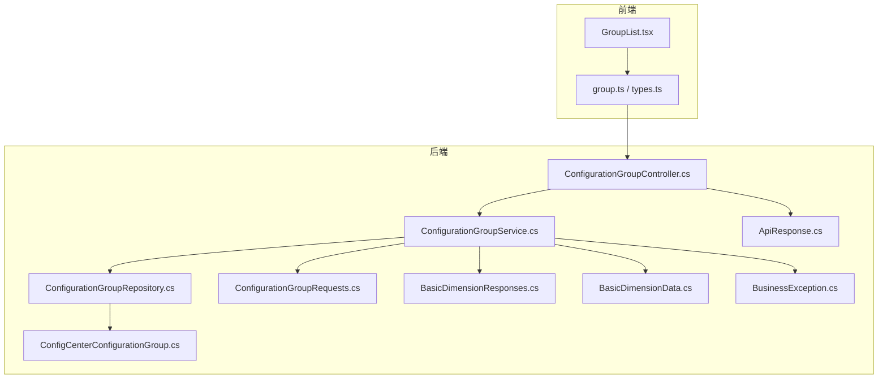
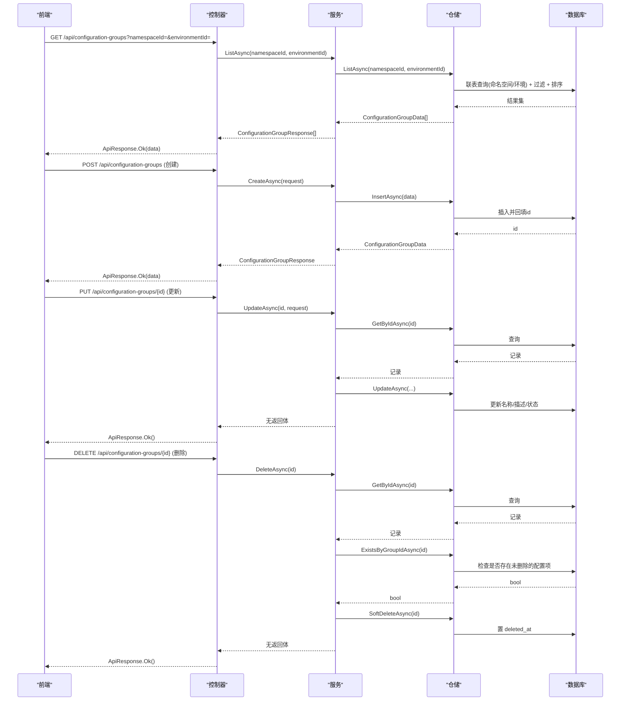
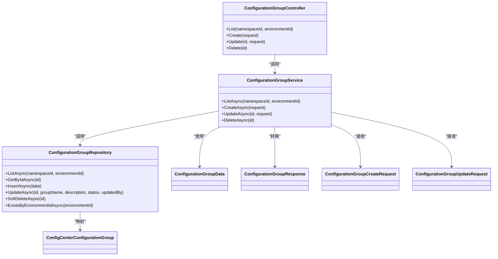

# 配置组管理API

<cite>
**本文引用的文件**
- [ConfigurationGroupController.cs](file://k_config_center/src/Controllers/ConfigurationGroupController.cs)
- [ConfigurationGroupService.cs](file://k_config_center/src/Services/ConfigurationGroupService.cs)
- [ConfigurationGroupRepository.cs](file://k_config_center/src/Repositories/ConfigurationGroupRepository.cs)
- [ConfigCenterConfigurationGroup.cs](file://k_config_center/src/Entities/ConfigCenterConfigurationGroup.cs)
- [ConfigurationGroupRequests.cs](file://k_config_center/src/Models/Requests/ConfigurationGroupRequests.cs)
- [BasicDimensionData.cs](file://k_config_center/src/Models/Domain/BasicDimensionData.cs)
- [BasicDimensionResponses.cs](file://k_config_center/src/Models/Responses/BasicDimensionResponses.cs)
- [ApiResponse.cs](file://k_config_center/src/Infrastructure/ApiResponse.cs)
- [BusinessException.cs](file://k_config_center/src/Infrastructure/BusinessException.cs)
- [group.ts](file://web/src/api/group.ts)
- [types.ts](file://web/src/api/types.ts)
- [GroupList.tsx](file://web/src/pages/group/GroupList.tsx)
</cite>

## 目录
1. [简介](#简介)
2. [项目结构](#项目结构)
3. [核心组件](#核心组件)
4. [架构总览](#架构总览)
5. [详细组件分析](#详细组件分析)
6. [依赖关系分析](#依赖关系分析)
7. [性能与排序说明](#性能与排序说明)
8. [故障排查指南](#故障排查指南)
9. [结论](#结论)
10. [附录：接口规范与示例](#附录接口规范与示例)

## 简介
本模块提供“配置组”的增删改查能力，用于在命名空间与环境维度下对配置项进行逻辑分组与管理。配置组具备启用/禁用状态、软删除机制，以及审计日志记录；列表查询支持按命名空间与环境过滤，并按创建时间排序。前端提供完整的列表、筛选、新建/编辑、启用/禁用切换与删除交互。

## 项目结构
后端采用 Controller → Service → Repository 的分层设计，数据模型通过 Domain 与 Requests/Responses 解耦实体与对外契约；统一响应封装 ApiResponse，业务异常通过 BusinessException 抛出并由全局处理转为统一格式。前端通过 TypeScript 类型定义与 API 调用封装，页面以表格+抽屉表单实现完整操作流。

图表来源
- [ConfigurationGroupController.cs:1-53](file://k_config_center/src/Controllers/ConfigurationGroupController.cs#L1-L53)
- [ConfigurationGroupService.cs:1-69](file://k_config_center/src/Services/ConfigurationGroupService.cs#L1-L69)
- [ConfigurationGroupRepository.cs:1-78](file://k_config_center/src/Repositories/ConfigurationGroupRepository.cs#L1-L78)
- [ConfigCenterConfigurationGroup.cs:1-45](file://k_config_center/src/Entities/ConfigCenterConfigurationGroup.cs#L1-L45)
- [ConfigurationGroupRequests.cs:1-16](file://k_config_center/src/Models/Requests/ConfigurationGroupRequests.cs#L1-L16)
- [BasicDimensionResponses.cs:44-68](file://k_config_center/src/Models/Responses/BasicDimensionResponses.cs#L44-L68)
- [BasicDimensionData.cs:14-17](file://k_config_center/src/Models/Domain/BasicDimensionData.cs#L14-L17)
- [ApiResponse.cs:1-10](file://k_config_center/src/Infrastructure/ApiResponse.cs#L1-L10)
- [BusinessException.cs:1-11](file://k_config_center/src/Infrastructure/BusinessException.cs#L1-L11)

章节来源
- [ConfigurationGroupController.cs:1-53](file://k_config_center/src/Controllers/ConfigurationGroupController.cs#L1-L53)
- [ConfigurationGroupService.cs:1-69](file://k_config_center/src/Services/ConfigurationGroupService.cs#L1-L69)
- [ConfigurationGroupRepository.cs:1-78](file://k_config_center/src/Repositories/ConfigurationGroupRepository.cs#L1-L78)

## 核心组件
- 控制器：接收请求、参数校验（由框架完成）、调用服务并包装为统一响应。
- 服务：编排业务规则（唯一性检查、级联删除限制、审计日志写入）。
- 仓储：数据库访问（CRUD、联表查询、软删除），仅暴露领域数据对象。
- 实体：数据库表映射，包含软删除字段与审计字段。
- 请求/响应：对外契约，屏蔽内部实体细节。
- 基础设施：统一响应封装与业务异常定义。

章节来源
- [ConfigurationGroupController.cs:8-51](file://k_config_center/src/Controllers/ConfigurationGroupController.cs#L8-L51)
- [ConfigurationGroupService.cs:9-67](file://k_config_center/src/Services/ConfigurationGroupService.cs#L9-L67)
- [ConfigurationGroupRepository.cs:7-77](file://k_config_center/src/Repositories/ConfigurationGroupRepository.cs#L7-L77)
- [ConfigCenterConfigurationGroup.cs:5-44](file://k_config_center/src/Entities/ConfigCenterConfigurationGroup.cs#L5-L44)
- [ConfigurationGroupRequests.cs:3-15](file://k_config_center/src/Models/Requests/ConfigurationGroupRequests.cs#L3-L15)
- [BasicDimensionResponses.cs:44-68](file://k_config_center/src/Models/Responses/BasicDimensionResponses.cs#L44-L68)
- [ApiResponse.cs:3-9](file://k_config_center/src/Infrastructure/ApiResponse.cs#L3-L9)
- [BusinessException.cs:3-10](file://k_config_center/src/Infrastructure/BusinessException.cs#L3-L10)

## 架构总览
配置组管理的请求从前端发起，经 HTTP 路由到控制器，控制器委托服务执行具体业务，服务通过仓储访问数据库，并在必要时读取其他模块（如配置项）进行级联校验。所有成功响应统一封装为 { code, message, data }，错误通过业务异常抛出并被全局处理转换为相同结构。

图表来源
- [ConfigurationGroupController.cs:13-51](file://k_config_center/src/Controllers/ConfigurationGroupController.cs#L13-L51)
- [ConfigurationGroupService.cs:20-67](file://k_config_center/src/Services/ConfigurationGroupService.cs#L20-L67)
- [ConfigurationGroupRepository.cs:12-56](file://k_config_center/src/Repositories/ConfigurationGroupRepository.cs#L12-L56)

## 详细组件分析

### 控制器：ConfigurationGroupController
- 路由前缀：/api/configuration-groups
- 端点：
  - GET 列表：支持 namespaceId、environmentId 可选过滤，已软删除不返回
  - POST 创建：同环境内 groupKey 唯一冲突将返回业务错误码
  - PUT 更新：仅允许更新名称、描述、状态；key 与所属环境不可改
  - DELETE 删除：软删除；若存在未删除的配置项则拒绝
- 响应：统一 ApiResponse 包裹

章节来源
- [ConfigurationGroupController.cs:8-51](file://k_config_center/src/Controllers/ConfigurationGroupController.cs#L8-L51)

### 服务：ConfigurationGroupService
- 列表：调用仓储获取并按响应模型转换
- 创建：构造领域数据，插入时捕获唯一冲突并转换为业务错误码；写入审计日志
- 更新：先校验存在性，再更新名称/描述/状态；写入审计日志
- 删除：先校验存在性，再检查是否有关联未删除的配置项，通过后软删除；写入审计日志
- 审计日志：从当前请求提取操作人与客户端 IP，写入操作日志仓储

章节来源
- [ConfigurationGroupService.cs:9-67](file://k_config_center/src/Services/ConfigurationGroupService.cs#L9-L67)

### 仓储：ConfigurationGroupRepository
- 列表：左连接命名空间与环境表，显式带 deleted_at 条件，按 CreatedAt 排序
- 单条查询：按 id 查询，已软删除返回 null
- 插入：返回数据库生成的 id
- 更新：仅更新名称、描述、状态与更新人
- 软删除：设置 deleted_at
- 存在性检查：供环境删除前的级联检查（环境维度）

章节来源
- [ConfigurationGroupRepository.cs:10-56](file://k_config_center/src/Repositories/ConfigurationGroupRepository.cs#L10-L56)

### 实体：ConfigCenterConfigurationGroup
- 主键自增 id
- 关联维度：namespace_id、environment_id
- 业务键：group_key（长度限制）
- 展示信息：group_name、description
- 状态：status（默认启用）
- 软删除：deleted_at
- 审计：created_by、updated_by、created_at、updated_at

章节来源
- [ConfigCenterConfigurationGroup.cs:5-44](file://k_config_center/src/Entities/ConfigCenterConfigurationGroup.cs#L5-L44)

### 请求与响应模型
- 创建请求：包含命名空间 id、环境 id、groupKey、groupName、description
- 更新请求：仅允许 groupName、description、status
- 响应：包含基础信息与联表冗余的命名空间/环境 key 与名称

章节来源
- [ConfigurationGroupRequests.cs:3-15](file://k_config_center/src/Models/Requests/ConfigurationGroupRequests.cs#L3-L15)
- [BasicDimensionResponses.cs:44-68](file://k_config_center/src/Models/Responses/BasicDimensionResponses.cs#L44-L68)
- [BasicDimensionData.cs:14-17](file://k_config_center/src/Models/Domain/BasicDimensionData.cs#L14-L17)

### 前端交互：GroupList.tsx 与 group.ts
- 列表页：支持命名空间/环境筛选、关键字本地过滤、分页、列设置
- 新建/编辑：抽屉表单，命名空间与环境级联选择，编辑时 key 与维度只读
- 状态切换：行内启用/禁用，调用更新接口
- 删除：确认后调用删除接口
- API 封装：统一路径与类型定义

章节来源
- [GroupList.tsx:40-388](file://web/src/pages/group/GroupList.tsx#L40-L388)
- [group.ts:8-23](file://web/src/api/group.ts#L8-L23)
- [types.ts:89-122](file://web/src/api/types.ts#L89-L122)

## 依赖关系分析
- 控制器依赖服务，服务依赖仓储与其他仓储（配置项仓储用于级联检查），仓储依赖 SqlSugar 客户端与实体
- 请求/响应与实体解耦，领域数据作为仓储对外契约
- 统一响应与业务异常贯穿全链路

图表来源
- [ConfigurationGroupController.cs:8-51](file://k_config_center/src/Controllers/ConfigurationGroupController.cs#L8-L51)
- [ConfigurationGroupService.cs:9-67](file://k_config_center/src/Services/ConfigurationGroupService.cs#L9-L67)
- [ConfigurationGroupRepository.cs:7-77](file://k_config_center/src/Repositories/ConfigurationGroupRepository.cs#L7-L77)
- [ConfigCenterConfigurationGroup.cs:5-44](file://k_config_center/src/Entities/ConfigCenterConfigurationGroup.cs#L5-L44)
- [BasicDimensionData.cs:14-17](file://k_config_center/src/Models/Domain/BasicDimensionData.cs#L14-L17)
- [BasicDimensionResponses.cs:44-68](file://k_config_center/src/Models/Responses/BasicDimensionResponses.cs#L44-L68)
- [ConfigurationGroupRequests.cs:3-15](file://k_config_center/src/Models/Requests/ConfigurationGroupRequests.cs#L3-L15)

## 性能与排序说明
- 列表查询使用左连接并显式过滤已软删除记录，避免依赖全局过滤器在联表中的行为差异
- 排序策略：按创建时间升序排列，便于新创建的组优先显示
- 批量操作：当前未提供批量更新或批量删除接口；可通过多次调用单个接口实现
- 前端分页：列表页默认分页大小可调整，适合大数据量场景

章节来源
- [ConfigurationGroupRepository.cs:12-24](file://k_config_center/src/Repositories/ConfigurationGroupRepository.cs#L12-L24)
- [GroupList.tsx:310-320](file://web/src/pages/group/GroupList.tsx#L310-L320)

## 故障排查指南
- 唯一键冲突：创建时若 groupKey 在环境内已存在，将返回业务错误码（对应 20003）
- 资源不存在：更新或删除时若目标组不存在或已软删除，将返回业务错误码（对应 10002）
- 级联冲突：删除时若存在未删除的配置项，将返回业务错误码（对应 20004）
- 统一响应：HTTP 始终 200，业务失败通过 code 表达；前端拦截器负责提示

章节来源
- [ConfigurationGroupService.cs:25-61](file://k_config_center/src/Services/ConfigurationGroupService.cs#L25-L61)
- [ApiResponse.cs:3-9](file://k_config_center/src/Infrastructure/ApiResponse.cs#L3-L9)
- [BusinessException.cs:3-10](file://k_config_center/src/Infrastructure/BusinessException.cs#L3-L10)

## 结论
配置组管理模块提供了清晰的增删改查能力，结合命名空间与环境维度实现配置的逻辑分组。通过软删除、状态管理与审计日志，满足生产环境的治理需求。前后端协作良好，接口规范明确，便于扩展与维护。

## 附录：接口规范与示例

### 通用约定
- 统一响应结构：{ code, message, data }，HTTP 状态码始终 200
- 时间字段：ISO 8601 字符串（UTC）
- 状态值：status 为 short，1=启用，0=禁用

章节来源
- [ApiResponse.cs:3-9](file://k_config_center/src/Infrastructure/ApiResponse.cs#L3-L9)
- [types.ts:1-11](file://web/src/api/types.ts#L1-L11)

### 接口清单

#### 获取配置组列表
- 方法：GET
- 路径：/api/configuration-groups
- 查询参数：
  - namespaceId：可选，按命名空间过滤
  - environmentId：可选，按环境过滤
- 响应 data：ConfigurationGroupResponse[]
- 说明：已软删除的记录不返回；按创建时间排序

章节来源
- [ConfigurationGroupController.cs:13-20](file://k_config_center/src/Controllers/ConfigurationGroupController.cs#L13-L20)
- [BasicDimensionResponses.cs:44-68](file://k_config_center/src/Models/Responses/BasicDimensionResponses.cs#L44-L68)

#### 创建配置组
- 方法：POST
- 路径：/api/configuration-groups
- 请求体：ConfigurationGroupCreateRequest
  - namespaceId：所属命名空间 id
  - environmentId：所属环境 id
  - groupKey：配置组标识，同环境内唯一
  - groupName：显示名称
  - description：描述，可空
- 响应 data：ConfigurationGroupResponse（含数据库生成的 id）
- 错误：
  - 唯一键冲突：返回业务错误码（对应 20003）

章节来源
- [ConfigurationGroupController.cs:22-28](file://k_config_center/src/Controllers/ConfigurationGroupController.cs#L22-L28)
- [ConfigurationGroupRequests.cs:3-9](file://k_config_center/src/Models/Requests/ConfigurationGroupRequests.cs#L3-L9)
- [ConfigurationGroupService.cs:25-37](file://k_config_center/src/Services/ConfigurationGroupService.cs#L25-L37)

#### 更新配置组
- 方法：PUT
- 路径：/api/configuration-groups/{id}
- 路径参数：id：配置组 id
- 请求体：ConfigurationGroupUpdateRequest
  - groupName：显示名称
  - description：描述，可空
  - status：状态（1=启用，0=禁用）
- 响应 data：null
- 错误：
  - 资源不存在：返回业务错误码（对应 10002）

章节来源
- [ConfigurationGroupController.cs:30-40](file://k_config_center/src/Controllers/ConfigurationGroupController.cs#L30-L40)
- [ConfigurationGroupRequests.cs:11-15](file://k_config_center/src/Models/Requests/ConfigurationGroupRequests.cs#L11-L15)
- [ConfigurationGroupService.cs:40-49](file://k_config_center/src/Services/ConfigurationGroupService.cs#L40-L49)

#### 删除配置组
- 方法：DELETE
- 路径：/api/configuration-groups/{id}
- 路径参数：id：配置组 id
- 响应 data：null
- 行为：软删除（置 deleted_at）
- 错误：
  - 资源不存在：返回业务错误码（对应 10002）
  - 级联冲突：存在未删除的配置项时拒绝（对应 20004）

章节来源
- [ConfigurationGroupController.cs:42-51](file://k_config_center/src/Controllers/ConfigurationGroupController.cs#L42-L51)
- [ConfigurationGroupService.cs:52-61](file://k_config_center/src/Services/ConfigurationGroupService.cs#L52-L61)

### 前端使用示例（概念流程）
- 创建配置组：打开新建抽屉，填写命名空间、环境、key、名称、描述，提交后刷新列表
- 调整状态：在列表中点击启用/禁用按钮，调用更新接口翻转 status
- 删除配置组：点击删除按钮，确认后调用删除接口
- 批量操作：当前无批量接口，需逐个调用

章节来源
- [GroupList.tsx:106-186](file://web/src/pages/group/GroupList.tsx#L106-L186)
- [group.ts:10-23](file://web/src/api/group.ts#L10-L23)
- [types.ts:89-122](file://web/src/api/types.ts#L89-L122)