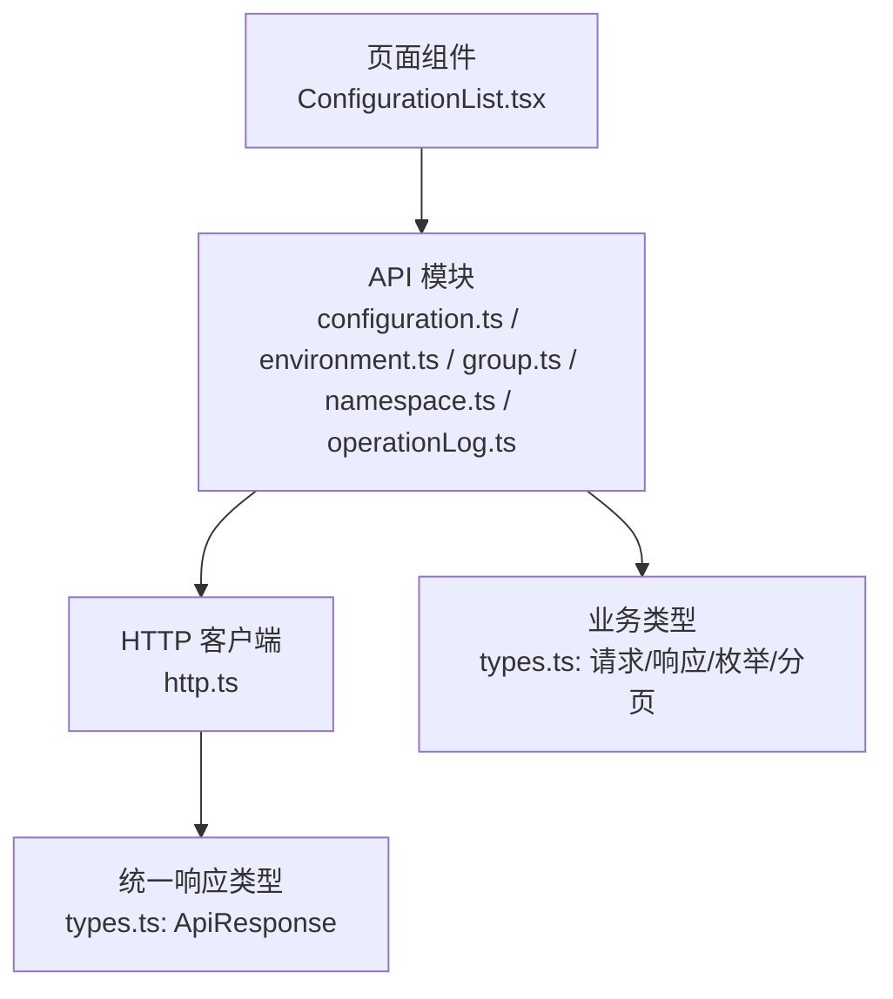
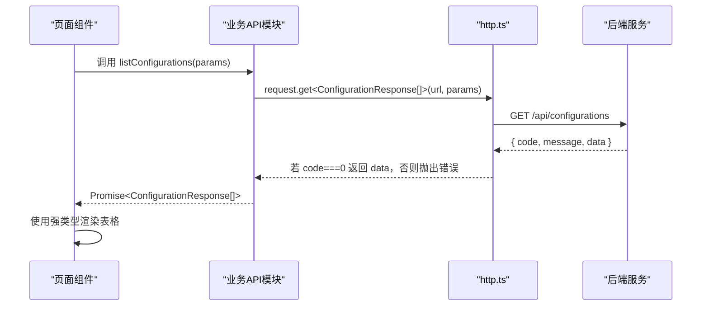
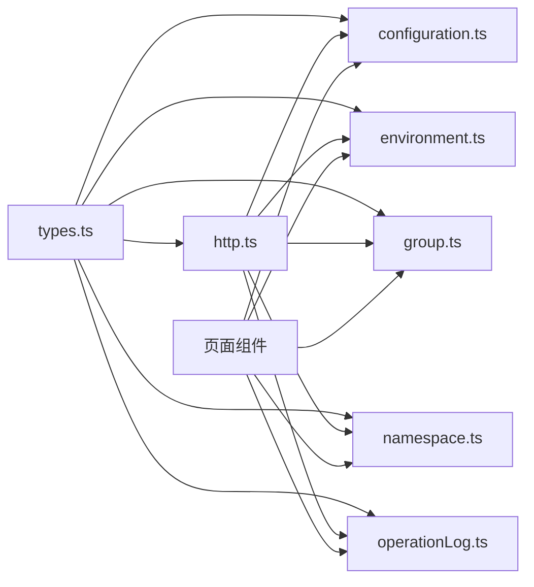

# 类型定义规范

<cite>
**本文引用的文件**
- [web/src/api/types.ts](file://web/src/api/types.ts)
- [web/src/api/http.ts](file://web/src/api/http.ts)
- [web/src/api/configuration.ts](file://web/src/api/configuration.ts)
- [web/src/api/environment.ts](file://web/src/api/environment.ts)
- [web/src/api/group.ts](file://web/src/api/group.ts)
- [web/src/api/namespace.ts](file://web/src/api/namespace.ts)
- [web/src/api/operationLog.ts](file://web/src/api/operationLog.ts)
- [web/src/pages/configuration/ConfigurationList.tsx](file://web/src/pages/configuration/ConfigurationList.tsx)
- [web/src/components/FormDrawer.tsx](file://web/src/components/FormDrawer.tsx)
- [web/src/hooks/useTableRequest.ts](file://web/src/hooks/useTableRequest.ts)
</cite>

## 目录
1. [简介](#简介)
2. [项目结构](#项目结构)
3. [核心组件](#核心组件)
4. [架构总览](#架构总览)
5. [详细组件分析](#详细组件分析)
6. [依赖关系分析](#依赖关系分析)
7. [性能与可维护性](#性能与可维护性)
8. [故障排查指南](#故障排查指南)
9. [结论](#结论)
10. [附录：最佳实践清单](#附录：最佳实践清单)

## 简介
本规范聚焦于前端 TypeScript 类型定义体系，围绕统一响应封装、业务模块的请求/响应类型、枚举类型、泛型推导与类型复用展开。目标是让调用方在编写页面逻辑时获得完整的类型提示、编译期校验与更少的运行时错误，同时保持代码的可读性与可维护性。

## 项目结构
前端 API 层采用“类型集中 + 接口薄封装”的组织方式：
- types.ts：集中定义所有请求参数、响应数据、分页结构与枚举类型，与后端 Models 对齐（字段命名遵循 camelCase）。
- http.ts：基于 axios 的 HTTP 客户端，统一拦截器解包 ApiResponse，并通过 request.get/post/put/delete 暴露带泛型的请求方法。
- 各业务模块 API（configuration.ts、environment.ts、group.ts、namespace.ts、operationLog.ts）：仅负责组装 URL、参数与返回类型，不处理业务错误展示。
- 页面与组件：消费 API 返回的类型，结合 Ant Design 等 UI 库进行渲染与交互。

图表来源
- [web/src/api/types.ts:7-17](file://web/src/api/types.ts#L7-L17)
- [web/src/api/http.ts:1-55](file://web/src/api/http.ts#L1-L55)
- [web/src/api/configuration.ts:1-59](file://web/src/api/configuration.ts#L1-L59)
- [web/src/api/environment.ts:1-20](file://web/src/api/environment.ts#L1-L20)
- [web/src/api/group.ts:1-24](file://web/src/api/group.ts#L1-L24)
- [web/src/api/namespace.ts:1-19](file://web/src/api/namespace.ts#L1-L19)
- [web/src/api/operationLog.ts:1-9](file://web/src/api/operationLog.ts#L1-L9)

章节来源
- [web/src/api/types.ts:1-247](file://web/src/api/types.ts#L1-L247)
- [web/src/api/http.ts:1-55](file://web/src/api/http.ts#L1-L55)

## 核心组件
- 统一响应类型 ApiResponse<T>：code=0 表示成功；非 0 为业务失败；data 为具体业务数据类型。
- 分页类型 PageResponse<T>：用于列表分页场景，包含 items 与 total。
- 枚举类型：ConfigFormat、ConfigStatus、ChangeType、OperationType，约束配置格式、状态机、变更类型与操作日志类型。
- 业务实体与请求类型：命名空间、环境、配置组、配置项、版本、发布/回滚、操作日志查询等。

章节来源
- [web/src/api/types.ts:7-30](file://web/src/api/types.ts#L7-L30)
- [web/src/api/types.ts:31-247](file://web/src/api/types.ts#L31-L247)

## 架构总览
下图展示了从页面到后端的类型流转：页面通过 API 模块发起请求，http.ts 将后端 ApiResponse 解包为 data，并借助泛型 T 将业务类型安全地传递到调用处。

图表来源
- [web/src/api/configuration.ts:18-20](file://web/src/api/configuration.ts#L18-L20)
- [web/src/api/http.ts:24-52](file://web/src/api/http.ts#L24-L52)
- [web/src/api/types.ts:7-11](file://web/src/api/types.ts#L7-L11)

## 详细组件分析

### 统一响应类型 ApiResponse<T>
- 字段说明
  - code: number，0 表示成功，非 0 表示业务失败。
  - message: string，错误信息或提示信息。
  - data: T，业务数据体，由调用方通过泛型指定。
- 使用约定
  - http.ts 响应拦截器在 code===0 时直接返回 data，并在失败时弹出错误提示并 reject。
  - 调用方无需再判断 code，直接使用返回的业务类型。

章节来源
- [web/src/api/types.ts:7-11](file://web/src/api/types.ts#L7-L11)
- [web/src/api/http.ts:24-40](file://web/src/api/http.ts#L24-L40)

### 分页类型 PageResponse<T>
- 字段说明
  - items: T[]，当前页数据。
  - total: number，总条数。
- 适用场景
  - 操作日志、版本历史等分页接口。

章节来源
- [web/src/api/types.ts:13-17](file://web/src/api/types.ts#L13-L17)
- [web/src/api/operationLog.ts:6-8](file://web/src/api/operationLog.ts#L6-L8)

### 枚举类型与状态机
- ConfigFormat：text | json | yaml | properties | xml | toml，限定配置内容格式。
- ConfigStatus：DRAFT | PUBLISHED | OFFLINE，配置项生命周期状态。
- ChangeType：CREATE | UPDATE | ROLLBACK，版本变更类型。
- OperationType：CREATE | UPDATE | DELETE | PUBLISH | ROLLBACK | OFFLINE，操作日志类型。
- 使用建议
  - 表单下拉选项与状态标签应严格使用这些字面量联合类型，避免硬编码字符串导致不一致。

章节来源
- [web/src/api/types.ts:19-29](file://web/src/api/types.ts#L19-L29)
- [web/src/pages/configuration/ConfigurationList.tsx:61-66](file://web/src/pages/configuration/ConfigurationList.tsx#L61-L66)

### 业务模块类型定义规范

#### 命名空间（Namespace）
- 响应：NamespaceResponse，包含 id、key、name、描述、状态、创建/更新时间等。
- 请求：
  - NamespaceCreateRequest：创建必填 key、name，可选描述。
  - NamespaceUpdateRequest：更新 name、描述、status，key 不可改。
- 接口封装：namespace.ts 提供 list/create/update/delete。

章节来源
- [web/src/api/types.ts:31-55](file://web/src/api/types.ts#L31-L55)
- [web/src/api/namespace.ts:1-19](file://web/src/api/namespace.ts#L1-L19)

#### 环境（Environment）
- 响应：EnvironmentResponse，含所属命名空间业务键与名称（联查补充）、排序、状态等。
- 请求：
  - EnvironmentCreateRequest：必填 namespaceId、environmentKey、environmentName、sortOrder，可选描述。
  - EnvironmentUpdateRequest：更新 name、描述、sortOrder、status。
- 接口封装：environment.ts 提供 list/create/update/delete。

章节来源
- [web/src/api/types.ts:57-87](file://web/src/api/types.ts#L57-L87)
- [web/src/api/environment.ts:1-20](file://web/src/api/environment.ts#L1-L20)

#### 配置组（ConfigurationGroup）
- 响应：ConfigurationGroupResponse，含所属命名空间/环境的业务键与名称（联查补充）。
- 请求：
  - ConfigurationGroupCreateRequest：必填 groupId、environmentId、groupKey、groupName，可选描述。
  - ConfigurationGroupUpdateRequest：更新 name、描述、status。
- 接口封装：group.ts 提供 list/create/update/delete。

章节来源
- [web/src/api/types.ts:89-122](file://web/src/api/types.ts#L89-L122)
- [web/src/api/group.ts:1-24](file://web/src/api/group.ts#L1-L24)

#### 配置项（Configuration）
- 响应：
  - ConfigurationResponse：包含 id、groupId、namespaceId、environmentId、配置 key、content、format、md5、描述、tags、状态、最新版本号、发布时间、创建/修改人、时间戳、hasUnpublishedChange 标记。
  - ConfigurationDetailResponse：当前编辑态 configuration 与生效版本快照 publishedVersion。
  - ConfigurationVersionResponse：版本快照详情，含 changeType、changeRemark 等。
- 请求：
  - ConfigurationCreateRequest：创建必填 groupId、configurationKey，可选 content、format、description、tags。
  - ConfigurationUpdateRequest：更新 content、format、description、tags。
  - PublishRequest：发布备注。
  - RollbackRequest：回滚目标版本号与备注。
- 接口封装：configuration.ts 提供 list/get/create/update/delete/publish/rollback/offline/versions/getVersion。

章节来源
- [web/src/api/types.ts:124-205](file://web/src/api/types.ts#L124-L205)
- [web/src/api/configuration.ts:1-59](file://web/src/api/configuration.ts#L1-L59)

#### 操作日志（OperationLog）
- 响应：OperationLogResponse，包含关联维度业务键与名称（联查补充）、操作类型、详情、操作人、IP、时间等。
- 查询参数：OperationLogQuery，支持 operator、时间区间、分页等。
- 接口封装：operationLog.ts 提供分页查询。

章节来源
- [web/src/api/types.ts:207-237](file://web/src/api/types.ts#L207-L237)
- [web/src/api/operationLog.ts:1-9](file://web/src/api/operationLog.ts#L1-L9)

### 类型安全的最佳实践

- 使用泛型确保类型推导正确
  - http.ts 的 request.get/post/put/delete 均带有泛型 T，调用方传入期望的业务类型，即可在后续链式调用中获得完整类型提示。
  - 示例路径：listConfigurations 返回类型为 ConfigurationResponse[]，publishConfiguration 返回 PublishResponse。

- 统一错误处理
  - 业务失败由 http.ts 拦截器统一弹出错误提示并 reject，页面只需关注成功分支，减少重复的错误处理代码。

- 枚举与字面量联合类型
  - 使用 ConfigStatus、ConfigFormat 等联合类型替代魔法字符串，提升可读性与安全性。

- 可选字段与空值处理
  - 对可选字段使用 ? 与 | null 明确表达语义，例如 description?: string | null，避免误用 undefined。

- 组合与复用
  - 通过 PageResponse<T> 复用分页结构；ApiResponse<T> 作为统一响应包装；业务模块类型集中在 types.ts，便于维护与演进。

章节来源
- [web/src/api/http.ts:42-52](file://web/src/api/http.ts#L42-L52)
- [web/src/api/configuration.ts:18-59](file://web/src/api/configuration.ts#L18-L59)
- [web/src/api/types.ts:7-17](file://web/src/api/types.ts#L7-L17)

### 类型定义的实际使用示例

- 列表加载与渲染
  - 页面通过 useTableRequest 获取数据，并使用 Table<ConfigurationResponse> 渲染列，字段访问具备完整类型提示。
  - 示例路径：ConfigurationList.tsx 中 columns 定义与 Table 使用。

- 表单提交
  - 新建配置使用 CreateFormValues 与 ConfigurationCreateRequest 对齐，提交时构造符合类型的请求体。
  - 示例路径：ConfigurationList.tsx 中新建流程与 createConfiguration 调用。

- 发布与回滚
  - 发布弹窗使用 PublishRequest 类型，提交后得到 PublishResponse，显示新版本号。
  - 示例路径：ConfigurationList.tsx 中 publishConfiguration 调用。

- 分页查询
  - 操作日志使用 OperationLogQuery 构建查询参数，返回 PageResponse<OperationLogResponse>，分页展示。
  - 示例路径：operationLog.ts 与 types.ts 中的相关类型。

章节来源
- [web/src/pages/configuration/ConfigurationList.tsx:176-228](file://web/src/pages/configuration/ConfigurationList.tsx#L176-L228)
- [web/src/pages/configuration/ConfigurationList.tsx:252-279](file://web/src/pages/configuration/ConfigurationList.tsx#L252-L279)
- [web/src/api/operationLog.ts:6-8](file://web/src/api/operationLog.ts#L6-L8)

### 组件级类型与复用

- FormDrawer 通用表单抽屉
  - 通过 FormInstance 泛型约束表单实例，确保字段访问与校验的类型安全。
  - 防误触关闭逻辑与 loading 状态管理，提升用户体验。

- useTableRequest Hook
  - 封装 loading/data/reload 三件套，使用泛型 T 保证返回数据的类型一致性，避免竞态条件覆盖。

章节来源
- [web/src/components/FormDrawer.tsx:1-71](file://web/src/components/FormDrawer.tsx#L1-L71)
- [web/src/hooks/useTableRequest.ts:1-38](file://web/src/hooks/useTableRequest.ts#L1-L38)

## 依赖关系分析
- types.ts 被所有 API 模块引用，作为类型契约中心。
- http.ts 依赖 types.ts 的 ApiResponse，并对所有 API 模块提供统一的请求能力。
- 各业务 API 模块依赖 types.ts 的具体类型，并导出函数供页面使用。
- 页面组件依赖业务 API 模块与通用 Hook/组件，形成清晰的单向依赖。

图表来源
- [web/src/api/types.ts:1-247](file://web/src/api/types.ts#L1-L247)
- [web/src/api/http.ts:1-55](file://web/src/api/http.ts#L1-L55)
- [web/src/api/configuration.ts:1-59](file://web/src/api/configuration.ts#L1-L59)
- [web/src/api/environment.ts:1-20](file://web/src/api/environment.ts#L1-L20)
- [web/src/api/group.ts:1-24](file://web/src/api/group.ts#L1-L24)
- [web/src/api/namespace.ts:1-19](file://web/src/api/namespace.ts#L1-L19)
- [web/src/api/operationLog.ts:1-9](file://web/src/api/operationLog.ts#L1-L9)

章节来源
- [web/src/api/types.ts:1-247](file://web/src/api/types.ts#L1-L247)
- [web/src/api/http.ts:1-55](file://web/src/api/http.ts#L1-L55)

## 性能与可维护性
- 类型集中管理：所有类型定义集中在 types.ts，新增或调整字段时只需修改一处，降低耦合度。
- 泛型驱动：通过泛型减少类型断言与 any 的使用，提高编译期检查覆盖率。
- 统一错误处理：http.ts 拦截器集中处理错误提示，页面逻辑更简洁，易于维护。
- 分页与列表：PageResponse<T> 与 useTableRequest 配合，提供一致的数据加载体验。
- 枚举与状态机：使用字面量联合类型约束状态，避免非法状态出现。

[本节为通用指导，不直接分析具体文件]

## 故障排查指南
- 业务错误未提示
  - 检查后端是否返回 code !== 0，http.ts 会在该情况下弹出错误提示并 reject。
- 类型不匹配
  - 确认 API 模块返回的泛型类型与实际后端响应结构一致，必要时更新 types.ts。
- 列表数据错乱
  - 检查 useTableRequest 的 requestIdRef 是否正确使用，避免旧请求覆盖新数据。
- 表单字段类型错误
  - 使用 FormInstance 泛型与类型化的表单值接口，确保字段访问安全。

章节来源
- [web/src/api/http.ts:24-40](file://web/src/api/http.ts#L24-L40)
- [web/src/hooks/useTableRequest.ts:10-29](file://web/src/hooks/useTableRequest.ts#L10-L29)
- [web/src/components/FormDrawer.tsx:5-15](file://web/src/components/FormDrawer.tsx#L5-L15)

## 结论
本项目的前端类型体系以 types.ts 为核心，结合 http.ts 的统一响应解包与各业务 API 的泛型封装，实现了端到端的类型安全。通过枚举与状态机约束、分页与列表 Hook 的复用、以及页面组件对类型的正确使用，显著提升了代码的可维护性与可读性。建议在后续开发中继续遵循本规范，保持类型定义的集中与稳定，持续优化类型推导与错误处理体验。

[本节为总结，不直接分析具体文件]

## 附录：最佳实践清单
- 始终使用 ApiResponse<T> 与 PageResponse<T> 作为统一响应与分页结构。
- 使用枚举与字面量联合类型（如 ConfigStatus、ConfigFormat）替代魔法字符串。
- 在 API 模块中使用泛型声明返回类型，确保调用方获得完整类型提示。
- 将可选字段与空值用 ? 与 | null 明确表达，避免 undefined 滥用。
- 利用 useTableRequest 与 FormDrawer 等通用组件/Hook 提升一致性与可维护性。
- 在页面中严格使用类型化数据渲染，避免 any 与类型断言。

[本节为通用指导，不直接分析具体文件]