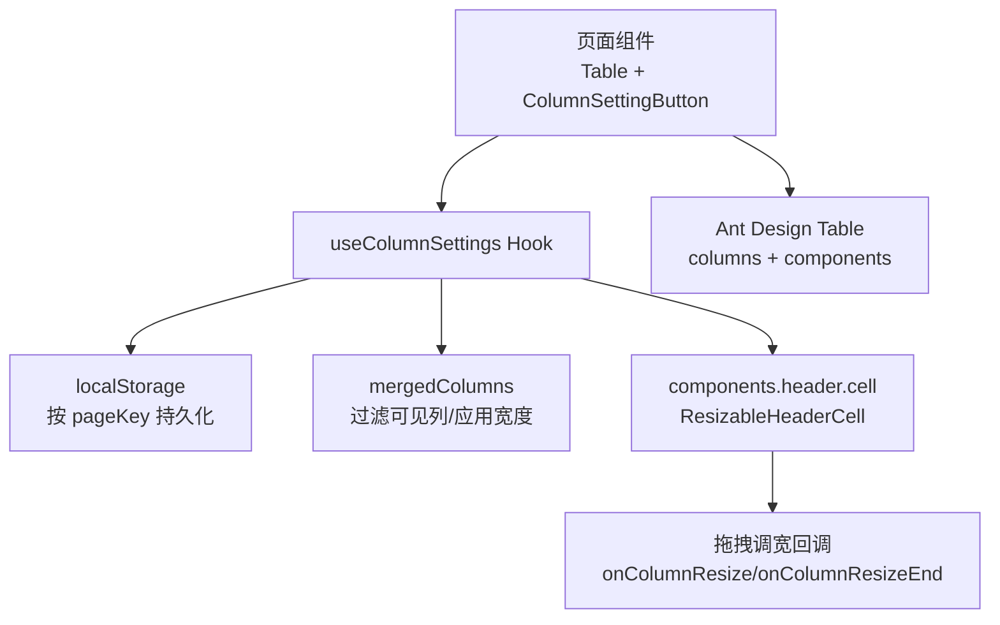
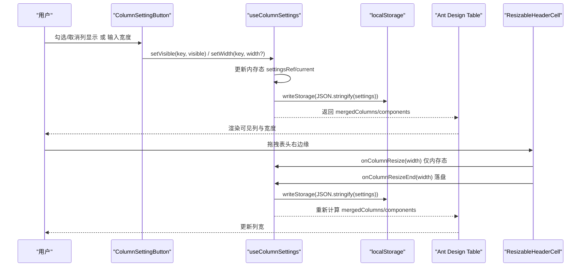
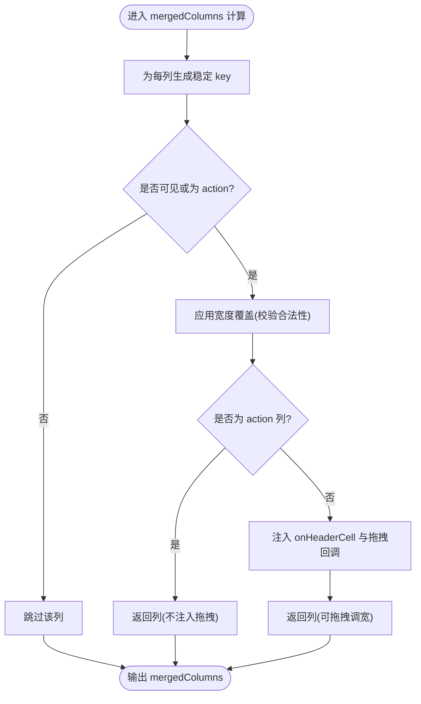
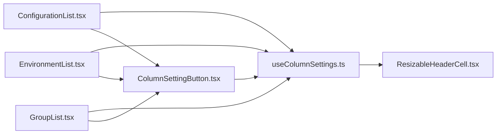

# useColumnSettings列设置Hook

<cite>
**本文引用的文件**
- [useColumnSettings.ts](file://web/src/hooks/useColumnSettings.ts)
- [ColumnSettingButton.tsx](file://web/src/components/ColumnSettingButton.tsx)
- [ResizableHeaderCell.tsx](file://web/src/components/ResizableHeaderCell.tsx)
- [ConfigurationList.tsx](file://web/src/pages/configuration/ConfigurationList.tsx)
- [EnvironmentList.tsx](file://web/src/pages/environment/EnvironmentList.tsx)
- [GroupList.tsx](file://web/src/pages/group/GroupList.tsx)
</cite>

## 目录
1. [简介](#简介)
2. [项目结构](#项目结构)
3. [核心组件](#核心组件)
4. [架构总览](#架构总览)
5. [详细组件分析](#详细组件分析)
6. [依赖关系分析](#依赖关系分析)
7. [性能考量](#性能考量)
8. [故障排查指南](#故障排查指南)
9. [结论](#结论)
10. [附录：集成示例与最佳实践](#附录：集成示例与最佳实践)

## 简介
本文档围绕 useColumnSettings 列设置 Hook，系统性说明其如何实现表格列的动态管理：包括列的显示/隐藏、顺序（由传入 columns 决定）、宽度覆盖与拖拽调整、以及通过 localStorage 持久化用户偏好。同时给出与 Ant Design Table 的完整集成方式，解释列配置的存储格式、默认值策略、用户交互流程，并补充响应式设计与用户体验优化要点。

## 项目结构
该功能位于前端 web 工程中，核心由三部分构成：
- Hook：web/src/hooks/useColumnSettings.ts
- 设置面板按钮：web/src/components/ColumnSettingButton.tsx
- 可拖拽表头单元格：web/src/components/ResizableHeaderCell.tsx
- 页面集成示例：多个列表页使用上述能力，如配置管理、环境管理、配置组管理等

图表来源
- [useColumnSettings.ts:50-163](file://web/src/hooks/useColumnSettings.ts#L50-L163)
- [ColumnSettingButton.tsx:16-49](file://web/src/components/ColumnSettingButton.tsx#L16-L49)
- [ResizableHeaderCell.tsx:31-122](file://web/src/components/ResizableHeaderCell.tsx#L31-L122)
- [ConfigurationList.tsx:472-579](file://web/src/pages/configuration/ConfigurationList.tsx#L472-L579)

章节来源
- [useColumnSettings.ts:1-165](file://web/src/hooks/useColumnSettings.ts#L1-L165)
- [ColumnSettingButton.tsx:1-50](file://web/src/components/ColumnSettingButton.tsx#L1-L50)
- [ResizableHeaderCell.tsx:1-123](file://web/src/components/ResizableHeaderCell.tsx#L1-L123)
- [ConfigurationList.tsx:470-579](file://web/src/pages/configuration/ConfigurationList.tsx#L470-L579)

## 核心组件
- useColumnSettings：提供 mergedColumns、components、columnMetas 及 setVisible/setWidth/reset 等能力，负责状态管理与持久化。
- ColumnSettingButton：渲染 Popover 面板，支持勾选显示/隐藏与输入宽度，并提供“恢复默认”操作。
- ResizableHeaderCell：实现表头右侧拖拽手柄，支持实时预览与落盘最终宽度。

章节来源
- [useColumnSettings.ts:50-163](file://web/src/hooks/useColumnSettings.ts#L50-L163)
- [ColumnSettingButton.tsx:16-49](file://web/src/components/ColumnSettingButton.tsx#L16-L49)
- [ResizableHeaderCell.tsx:31-122](file://web/src/components/ResizableHeaderCell.tsx#L31-L122)

## 架构总览
下图展示从用户交互到数据持久化的完整链路：用户在设置面板或表头拖拽中修改列配置，Hook 更新内存态并写入 localStorage；Table 基于 mergedColumns 渲染可见列与宽度；设置面板与拖拽事件共同驱动 setWidth/setVisible 回调。

图表来源
- [useColumnSettings.ts:57-103](file://web/src/hooks/useColumnSettings.ts#L57-L103)
- [useColumnSettings.ts:117-143](file://web/src/hooks/useColumnSettings.ts#L117-L143)
- [ColumnSettingButton.tsx:17-42](file://web/src/components/ColumnSettingButton.tsx#L17-L42)
- [ResizableHeaderCell.tsx:53-87](file://web/src/components/ResizableHeaderCell.tsx#L53-L87)

## 详细组件分析

### useColumnSettings 状态管理与数据流
- 稳定列键解析：优先 column.key，其次 dataIndex（支持嵌套路径），最后以索引兜底，确保跨渲染稳定的唯一标识。
- 初始化与持久化：从 localStorage 读取对应 pageKey 的配置，失败时回退为空对象；写操作在 try/catch 中静默降级，避免阻塞主流程。
- 状态镜像：使用 useRef 保存最新 settings，避免高频回调读到旧闭包值。
- 可见性与宽度：
  - setVisible：切换列显隐。
  - setWidth：设置列宽度覆盖，仅在合法数值且不低于最小宽度时生效。
  - setWidthTransient：拖拽过程中的临时宽度更新，不写 localStorage，减少 IO 开销。
- 合并列逻辑：
  - 过滤不可见列，但 key='action' 的操作列强制显示。
  - 对非操作列注入 onHeaderCell，将当前宽度与拖拽回调传递给 ResizableHeaderCell。
  - 宽度优先级：用户覆盖 > 列定义固定宽度 > 未设置则不强制宽度。
- 导出能力：
  - mergedColumns：可直接传给 Table 的 columns。
  - components：header.cell 替换为 ResizableHeaderCell。
  - columnMetas：供设置面板渲染的列元信息（key/title/visible/width）。
  - setVisible/setWidth/reset：暴露给外部控制。

图表来源
- [useColumnSettings.ts:117-143](file://web/src/hooks/useColumnSettings.ts#L117-L143)

章节来源
- [useColumnSettings.ts:23-33](file://web/src/hooks/useColumnSettings.ts#L23-L33)
- [useColumnSettings.ts:35-43](file://web/src/hooks/useColumnSettings.ts#L35-L43)
- [useColumnSettings.ts:50-113](file://web/src/hooks/useColumnSettings.ts#L50-L113)
- [useColumnSettings.ts:117-163](file://web/src/hooks/useColumnSettings.ts#L117-L163)

### ColumnSettingButton 设置面板
- 渲染 Popover 面板，列出所有非操作列。
- 每个列项包含：
  - Checkbox：控制 visible。
  - InputNumber：设置宽度覆盖，支持清空以恢复自动宽度。
- 提供“恢复默认”按钮，调用 reset 清除本地存储与内存态。

章节来源
- [ColumnSettingButton.tsx:16-49](file://web/src/components/ColumnSettingButton.tsx#L16-L49)

### ResizableHeaderCell 拖拽调宽
- 表头右侧 8px 拖拽手柄，hover 或拖拽中高亮。
- 指针事件处理：
  - onPointerDown：记录起始位置与初始宽度，捕获指针。
  - onPointerMove：实时计算新宽度（不低于最小宽度），触发 onColumnResize。
  - onPointerUp/onPointerCancel：释放指针，触发 onColumnResizeEnd 落盘。
- 未提供 onColumnResize 时退化为普通 th，用于操作列等不可调宽场景。

章节来源
- [ResizableHeaderCell.tsx:31-122](file://web/src/components/ResizableHeaderCell.tsx#L31-L122)

## 依赖关系分析
- useColumnSettings 依赖：
  - antd/es/table 类型定义，保证 ColumnsType 兼容。
  - ResizableHeaderCell 及其 ColumnResizeProps，用于表头拖拽。
- ColumnSettingButton 依赖：
  - Ant Design 的 Button/Checkbox/InputNumber/Popover/Space。
  - useColumnSettings 导出的 ColumnMeta 类型。
- 页面组件依赖：
  - 将 mergedColumns 与 components 直接传入 Ant Design Table。
  - 将 columnMetas 与回调函数传入 ColumnSettingButton。

图表来源
- [useColumnSettings.ts:1-5](file://web/src/hooks/useColumnSettings.ts#L1-L5)
- [ColumnSettingButton.tsx:1-4](file://web/src/components/ColumnSettingButton.tsx#L1-L4)
- [ConfigurationList.tsx:472-579](file://web/src/pages/configuration/ConfigurationList.tsx#L472-L579)
- [EnvironmentList.tsx:227-280](file://web/src/pages/environment/EnvironmentList.tsx#L227-L280)
- [GroupList.tsx:255-320](file://web/src/pages/group/GroupList.tsx#L255-L320)

章节来源
- [useColumnSettings.ts:1-5](file://web/src/hooks/useColumnSettings.ts#L1-L5)
- [ColumnSettingButton.tsx:1-4](file://web/src/components/ColumnSettingButton.tsx#L1-L4)
- [ConfigurationList.tsx:472-579](file://web/src/pages/configuration/ConfigurationList.tsx#L472-L579)
- [EnvironmentList.tsx:227-280](file://web/src/pages/environment/EnvironmentList.tsx#L227-L280)
- [GroupList.tsx:255-320](file://web/src/pages/group/GroupList.tsx#L255-L320)

## 性能考量
- 拖拽过程只更新内存态：setWidthTransient 不写 localStorage，避免频繁 IO 导致卡顿。
- 防抖重渲染：ResizableHeaderCell 内部比较 latestWidth，宽度未变化时不触发回调，减少不必要的状态更新。
- 最小宽度限制：MIN_COLUMN_WIDTH 防止过窄导致内容溢出或不可读。
- 写失败降级：localStorage 写入异常被捕获，不影响内存态与 UI 表现。
- 列合并 memoization：mergedColumns/columnMetas 使用 useMemo 缓存，避免重复计算。

[本节为通用性能建议，不直接分析具体文件]

## 故障排查指南
- 列无法显示：检查列是否被设置为不可见；确认列的稳定 key 是否正确解析（优先 key，其次 dataIndex）。
- 宽度无效：确认设置的宽度为有限数值且不小于最小宽度；若 localStorage 被篡改，Hook 会忽略非法宽度。
- 拖拽无响应：确认列不是操作列（action）；确认 Table 已传入 components={{ header: { cell: ResizableHeaderCell } }}。
- 设置未持久化：检查浏览器是否禁用 localStorage；Hook 会在不可用时降级为仅内存态。
- 重置无效：确认 reset 已被调用，并检查 localStorage 是否被其他代码修改。

章节来源
- [useColumnSettings.ts:57-66](file://web/src/hooks/useColumnSettings.ts#L57-L66)
- [useColumnSettings.ts:105-113](file://web/src/hooks/useColumnSettings.ts#L105-L113)
- [ResizableHeaderCell.tsx:5-15](file://web/src/components/ResizableHeaderCell.tsx#L5-L15)

## 结论
useColumnSettings 以简洁的 API 提供了完整的表格列动态管理能力：显隐控制、宽度覆盖与拖拽调整、按页面隔离的持久化存储，以及与 Ant Design Table 的无缝集成。配合 ColumnSettingButton 与 ResizableHeaderCell，实现了良好的用户体验与健壮性保障。

[本节为总结性内容，不直接分析具体文件]

## 附录：集成示例与最佳实践

### 在页面中使用 useColumnSettings
- 调用 Hook 获取 mergedColumns、components、columnMetas 及 setVisible/setWidth/reset。
- 将 mergedColumns 与 components 传入 Table。
- 将 columnMetas 与回调传入 ColumnSettingButton。
- 为 Table 启用横向滚动以适应窄窗口。

章节来源
- [ConfigurationList.tsx:472-579](file://web/src/pages/configuration/ConfigurationList.tsx#L472-L579)
- [EnvironmentList.tsx:227-280](file://web/src/pages/environment/EnvironmentList.tsx#L227-L280)
- [GroupList.tsx:255-320](file://web/src/pages/group/GroupList.tsx#L255-L320)

### 列配置存储格式与默认值
- 存储键：column-settings:{pageKey}
- 数据结构：Record<string, { visible: boolean; width?: number }>
- 默认值：
  - 未设置时视为可见。
  - 未设置宽度时采用列定义或自动宽度。
  - 操作列（key='action'）始终可见且不可调宽。
- 合法性校验：宽度必须为有限数值且不低于最小宽度。

章节来源
- [useColumnSettings.ts:35-43](file://web/src/hooks/useColumnSettings.ts#L35-L43)
- [useColumnSettings.ts:117-143](file://web/src/hooks/useColumnSettings.ts#L117-L143)
- [ResizableHeaderCell.tsx:4-5](file://web/src/components/ResizableHeaderCell.tsx#L4-L5)

### 用户交互流程
- 设置面板：勾选/取消列显示；输入宽度后即时生效；点击“恢复默认”清除本地配置。
- 表头拖拽：按住表头右侧手柄拖动，实时预览宽度；松手后落盘持久化。
- 响应式：Table 开启横向滚动，避免窄屏下内容溢出。

章节来源
- [ColumnSettingButton.tsx:17-42](file://web/src/components/ColumnSettingButton.tsx#L17-L42)
- [ResizableHeaderCell.tsx:53-87](file://web/src/components/ResizableHeaderCell.tsx#L53-L87)
- [ConfigurationList.tsx:569-579](file://web/src/pages/configuration/ConfigurationList.tsx#L569-L579)

### 响应式设计与用户体验优化
- 拖拽体验：指针捕获避免事件丢失；最小宽度保护可读性；高亮手柄提升可发现性。
- 性能优化：拖拽过程仅内存更新；宽度未变化不触发回调；memoization 减少重渲染。
- 容错设计：localStorage 读写异常静默降级；非法宽度被忽略。
- 可访问性：设置面板使用标准表单控件，语义清晰。

[本节为通用设计建议，不直接分析具体文件]