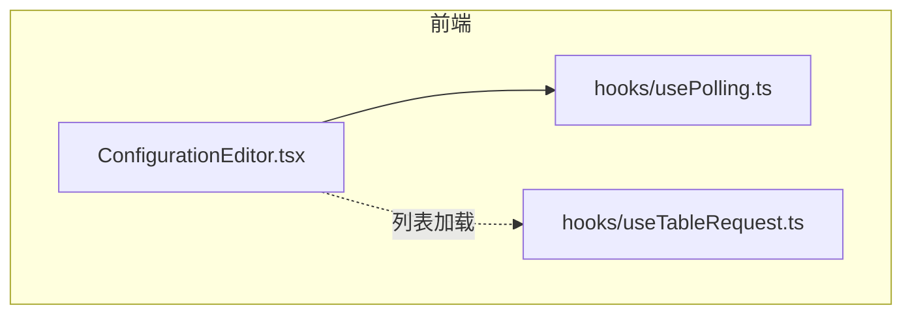
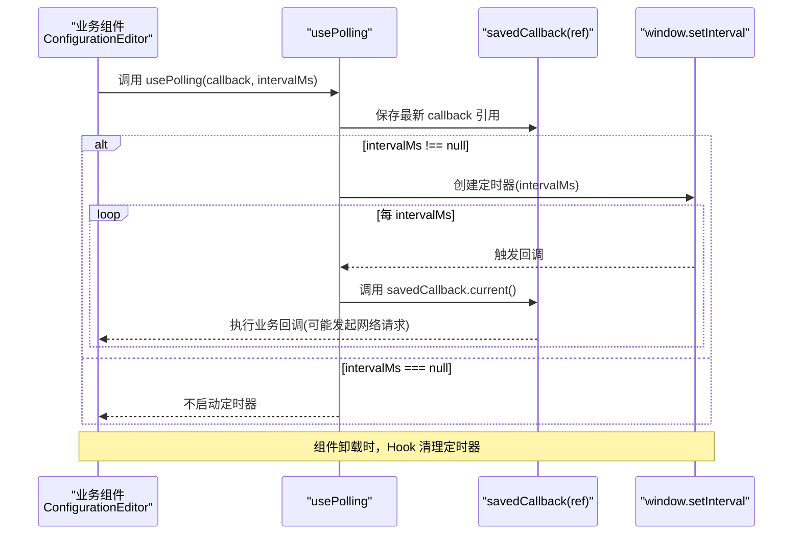
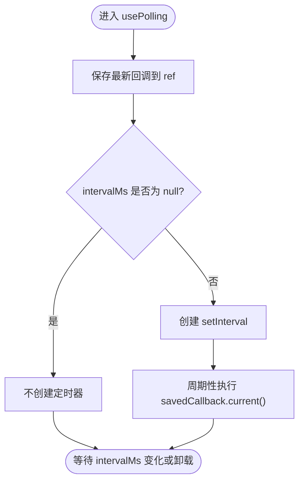
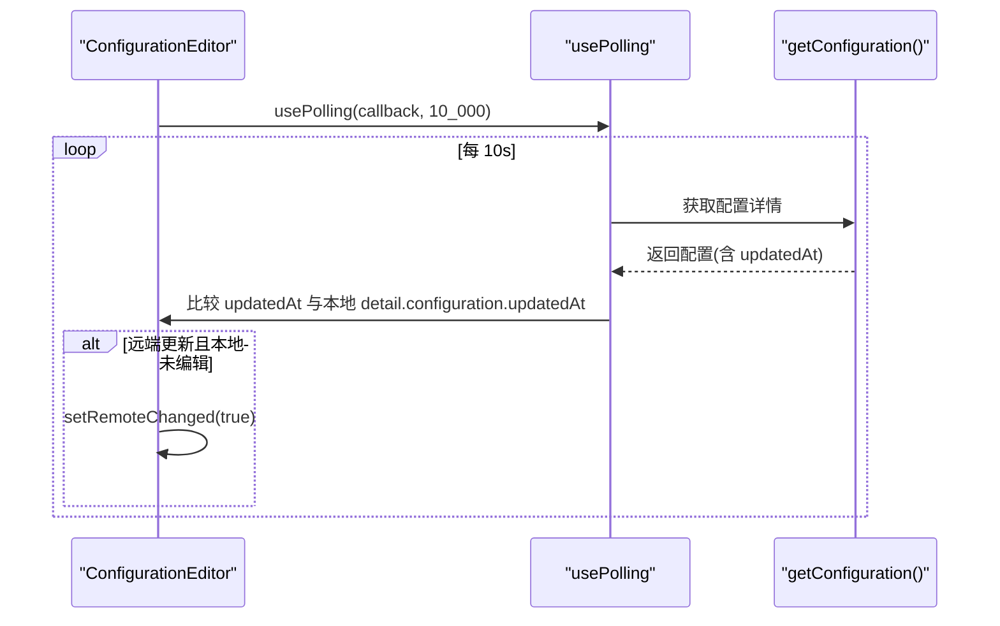
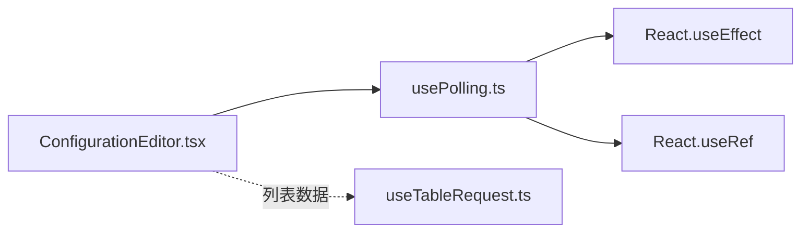

# usePolling轮询Hook

<cite>
**本文引用的文件**
- [usePolling.ts](file://web/src/hooks/usePolling.ts)
- [ConfigurationEditor.tsx](file://web/src/pages/configuration/ConfigurationEditor.tsx)
- [useTableRequest.ts](file://web/src/hooks/useTableRequest.ts)
</cite>

## 目录
1. [简介](#简介)
2. [项目结构](#项目结构)
3. [核心组件](#核心组件)
4. [架构总览](#架构总览)
5. [详细组件分析](#详细组件分析)
6. [依赖关系分析](#依赖关系分析)
7. [性能考量](#性能考量)
8. [故障排查指南](#故障排查指南)
9. [结论](#结论)
10. [附录：使用示例与最佳实践](#附录使用示例与最佳实践)

## 简介
本文件围绕前端仓库中的 usePolling 轮询 Hook，系统性说明其设计模式、实现原理、配置选项、与 React 生命周期的集成方式、内存泄漏防护策略，以及在实际业务场景（如配置编辑页探测他人变更）中的使用方法。同时给出性能优化建议，包括条件轮询、防抖节流等最佳实践。

## 项目结构
本项目采用前后端分离的架构，前端位于 web 目录，使用 React + TypeScript。与轮询相关的代码集中在 hooks 目录中，其中 usePolling.ts 提供通用轮询能力；在 pages/configuration/ConfigurationEditor.tsx 中作为实际业务用例进行调用。

图表来源
- [ConfigurationEditor.tsx:100-120](file://web/src/pages/configuration/ConfigurationEditor.tsx#L100-L120)
- [usePolling.ts:1-24](file://web/src/hooks/usePolling.ts#L1-L24)
- [useTableRequest.ts:1-38](file://web/src/hooks/useTableRequest.ts#L1-L38)

章节来源
- [usePolling.ts:1-24](file://web/src/hooks/usePolling.ts#L1-L24)
- [ConfigurationEditor.tsx:100-120](file://web/src/pages/configuration/ConfigurationEditor.tsx#L100-L120)
- [useTableRequest.ts:1-38](file://web/src/hooks/useTableRequest.ts#L1-L38)

## 核心组件
- usePolling：通用定时轮询 Hook，支持传入回调函数和间隔时间（可为 null 暂停），在组件卸载时自动清理定时器，避免内存泄漏。
- ConfigurationEditor：业务页面，演示了低频轮询检测远程配置变更并提示用户刷新。
- useTableRequest：通用列表请求 Hook，用于对比说明“按需拉取”与“定时轮询”的差异。

章节来源
- [usePolling.ts:1-24](file://web/src/hooks/usePolling.ts#L1-L24)
- [ConfigurationEditor.tsx:100-120](file://web/src/pages/configuration/ConfigurationEditor.tsx#L100-L120)
- [useTableRequest.ts:1-38](file://web/src/hooks/useTableRequest.ts#L1-L38)

## 架构总览
usePolling 通过 React Hooks 将“回调执行 + 定时器生命周期管理”封装为可复用逻辑，业务组件只需关注“何时轮询、轮询什么”。

图表来源
- [usePolling.ts:1-24](file://web/src/hooks/usePolling.ts#L1-L24)
- [ConfigurationEditor.tsx:100-120](file://web/src/pages/configuration/ConfigurationEditor.tsx#L100-L120)

## 详细组件分析

### usePolling 设计与实现
- 设计目标
  - 以最小侵入的方式提供“定时轮询”能力。
  - 避免回调变化导致定时器重建。
  - 支持暂停轮询（intervalMs 为 null）。
  - 组件卸载时自动清理，防止内存泄漏。
- 关键实现要点
  - 使用 useRef 保存最新回调，避免闭包陷阱与重复创建定时器。
  - 使用 useEffect 监听 intervalMs 变化来创建/销毁定时器。
  - 当 intervalMs 为 null 时直接返回，不启动定时器。
- 复杂度
  - 时间复杂度：每次轮询 O(1) 调度开销，业务回调复杂度由调用方决定。
  - 空间复杂度：O(1)，仅维护一个 ref 和一个定时器句柄。
- 错误处理
  - 未对业务回调内部异常做捕获，建议在业务层做好 try/catch 或全局拦截。
- 与 React 生命周期集成
  - 依赖 intervalMs 变化驱动定时器启停。
  - 组件卸载时，effect 清理函数会清除定时器，避免内存泄漏。

图表来源
- [usePolling.ts:1-24](file://web/src/hooks/usePolling.ts#L1-L24)

章节来源
- [usePolling.ts:1-24](file://web/src/hooks/usePolling.ts#L1-L24)

### 业务使用：ConfigurationEditor 中的轮询
- 使用场景
  - 配置编辑页需要探测其他用户是否修改了同一配置，若检测到服务端更新时间变化且本地未编辑，则提示用户刷新。
- 轮询策略
  - 低频轮询（例如 10 秒），降低接口压力。
  - 仅在非编辑态（dirty 为 false）时提示刷新，避免覆盖用户正在编辑的内容。
- 数据一致性
  - 通过比较 updatedAt 字段判断是否有远端变更。
  - 设置 remoteChanged 状态，UI 展示警告并提供手动刷新入口。

图表来源
- [ConfigurationEditor.tsx:100-120](file://web/src/pages/configuration/ConfigurationEditor.tsx#L100-L120)
- [usePolling.ts:1-24](file://web/src/hooks/usePolling.ts#L1-L24)

章节来源
- [ConfigurationEditor.tsx:100-120](file://web/src/pages/configuration/ConfigurationEditor.tsx#L100-L120)
- [usePolling.ts:1-24](file://web/src/hooks/usePolling.ts#L1-L24)

### 与 useTableRequest 的对比
- useTableRequest 适用于“按条件触发”的数据加载（如筛选、分页、手动刷新），通过 requestIdRef 保证最新请求结果生效，避免竞态。
- usePolling 适用于“定时触发”的场景（如后台变更探测、健康检查），强调稳定周期与自动清理。
- 两者可组合使用：列表页用 useTableRequest 拉取数据，编辑页用 usePolling 探测远端变更。

章节来源
- [useTableRequest.ts:1-38](file://web/src/hooks/useTableRequest.ts#L1-L38)
- [usePolling.ts:1-24](file://web/src/hooks/usePolling.ts#L1-L24)

## 依赖关系分析
- usePolling 依赖 React 的 useEffect 与 useRef，无外部库依赖。
- 业务组件通过传入回调与间隔参数控制行为，耦合度低、内聚度高。
- 与网络层解耦：回调内部可自由调用任意 API，便于测试与替换。

图表来源
- [ConfigurationEditor.tsx:100-120](file://web/src/pages/configuration/ConfigurationEditor.tsx#L100-L120)
- [usePolling.ts:1-24](file://web/src/hooks/usePolling.ts#L1-L24)
- [useTableRequest.ts:1-38](file://web/src/hooks/useTableRequest.ts#L1-L38)

章节来源
- [usePolling.ts:1-24](file://web/src/hooks/usePolling.ts#L1-L24)
- [ConfigurationEditor.tsx:100-120](file://web/src/pages/configuration/ConfigurationEditor.tsx#L100-L120)
- [useTableRequest.ts:1-38](file://web/src/hooks/useTableRequest.ts#L1-L38)

## 性能考量
- 合理设置轮询间隔
  - 低频轮询（如 10 秒）适合“变更探测”，高频轮询会增加服务器压力与浏览器资源消耗。
- 条件轮询
  - 结合业务状态（如 dirty、invalidId）在回调内短路，减少无效请求。
- 防抖/节流
  - 对于用户频繁触发的操作（如搜索、输入），可在回调外层加防抖/节流，避免短时间内多次请求。
- 取消机制
  - 当前实现基于 setInterval，不支持中途取消。如需更精细控制，可考虑扩展为支持 abort 的版本或使用 fetch AbortController。
- 内存泄漏防护
  - 已确保在组件卸载时清理定时器，避免悬挂定时器导致的内存泄漏。
- 回调稳定性
  - 使用 ref 保存最新回调，避免依赖变化导致定时器重建，提升性能。

[本节为通用性能建议，不直接分析具体文件]

## 故障排查指南
- 轮询未生效
  - 检查 intervalMs 是否为 null；确认传入的回调是否正确。
  - 确认组件是否被卸载或隐藏（如路由切换后 effect 清理）。
- 重复请求或竞态
  - 若回调内发起多个并发请求，注意在业务层做去重或合并；列表场景建议使用 useTableRequest 的请求序列号机制。
- 内存泄漏
  - 确认组件卸载路径正常执行清理；不要在回调中创建新的定时器而忘记清理。
- 性能问题
  - 降低轮询频率；在回调中加入条件判断，避免不必要的网络请求。
- 错误处理
  - 在回调中对网络请求进行 try/catch 或统一拦截，避免未捕获异常影响后续轮询。

章节来源
- [usePolling.ts:1-24](file://web/src/hooks/usePolling.ts#L1-L24)
- [ConfigurationEditor.tsx:100-120](file://web/src/pages/configuration/ConfigurationEditor.tsx#L100-L120)
- [useTableRequest.ts:1-38](file://web/src/hooks/useTableRequest.ts#L1-L38)

## 结论
usePolling 是一个简洁、可靠的定时轮询 Hook，通过 useRef 与 useEffect 的组合实现了回调引用稳定、定时器生命周期可控、组件卸载自动清理等关键特性。配合业务层的条件判断与合理的轮询间隔，可以在保证用户体验的同时有效控制资源消耗。对于需要“按条件触发”的场景，可与 useTableRequest 搭配使用，形成完整的“定时探测 + 按需拉取”的数据同步方案。

[本节为总结性内容，不直接分析具体文件]

## 附录：使用示例与最佳实践

- 基本用法
  - 在组件中调用 usePolling，传入回调与间隔毫秒数；当间隔为 null 时暂停轮询。
  - 参考路径：[usePolling.ts:1-24](file://web/src/hooks/usePolling.ts#L1-L24)
- 业务示例：配置编辑页探测远端变更
  - 低频轮询（如 10 秒）检查远端 updatedAt，若发生变化且本地未编辑，则提示刷新。
  - 参考路径：[ConfigurationEditor.tsx:100-120](file://web/src/pages/configuration/ConfigurationEditor.tsx#L100-L120)
- 条件轮询
  - 在回调开头根据状态（如 invalidId、dirty）短路，避免无效请求。
  - 参考路径：[ConfigurationEditor.tsx:100-120](file://web/src/pages/configuration/ConfigurationEditor.tsx#L100-L120)
- 手动控制
  - 通过改变 intervalMs 的值（null 表示暂停，数字表示恢复）来控制轮询启停。
  - 参考路径：[usePolling.ts:1-24](file://web/src/hooks/usePolling.ts#L1-L24)
- 与列表请求 Hook 搭配
  - 列表数据使用 useTableRequest 按需加载，编辑页使用 usePolling 探测变更。
  - 参考路径：[useTableRequest.ts:1-38](file://web/src/hooks/useTableRequest.ts#L1-L38)
- 防抖/节流建议
  - 对高频用户操作（如搜索、输入）在回调外层加防抖/节流，减少请求次数。
  - 参考路径：[formatters.ts:1-184](file://web/src/utils/formatters.ts#L1-L184)（作为工具函数组织方式的参考）

章节来源
- [usePolling.ts:1-24](file://web/src/hooks/usePolling.ts#L1-L24)
- [ConfigurationEditor.tsx:100-120](file://web/src/pages/configuration/ConfigurationEditor.tsx#L100-L120)
- [useTableRequest.ts:1-38](file://web/src/hooks/useTableRequest.ts#L1-L38)
- [formatters.ts:1-184](file://web/src/utils/formatters.ts#L1-L184)