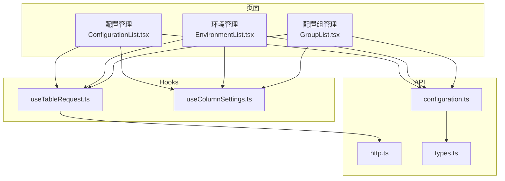
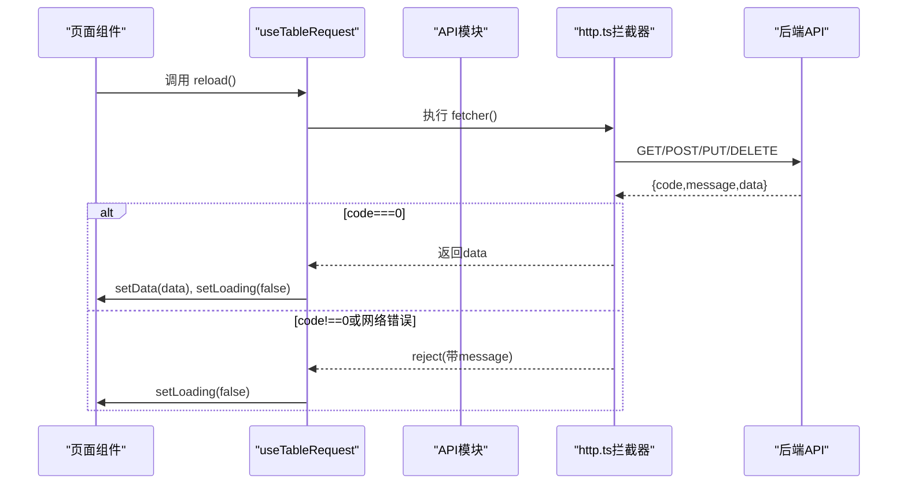
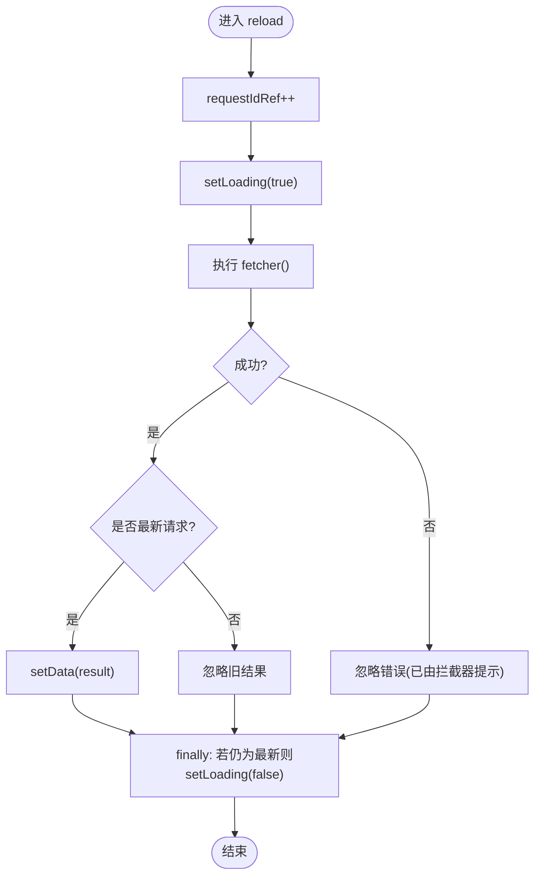
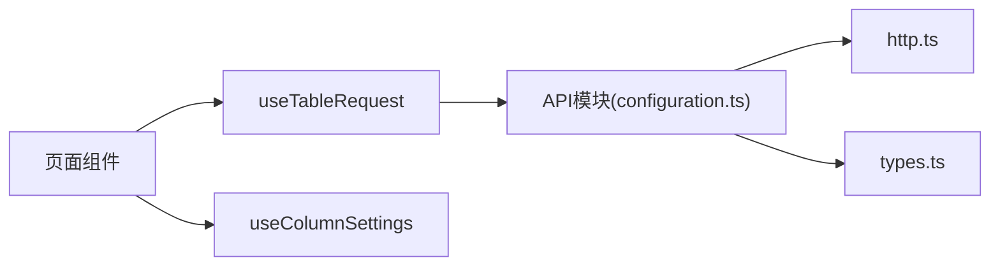

# useTableRequest表格请求Hook

<cite>
**本文引用的文件**
- [useTableRequest.ts](file://web/src/hooks/useTableRequest.ts)
- [http.ts](file://web/src/api/http.ts)
- [configuration.ts](file://web/src/api/configuration.ts)
- [types.ts](file://web/src/api/types.ts)
- [ConfigurationList.tsx](file://web/src/pages/configuration/ConfigurationList.tsx)
- [EnvironmentList.tsx](file://web/src/pages/environment/EnvironmentList.tsx)
- [GroupList.tsx](file://web/src/pages/group/GroupList.tsx)
- [useColumnSettings.ts](file://web/src/hooks/useColumnSettings.ts)
</cite>

## 目录
1. [简介](#简介)
2. [项目结构](#项目结构)
3. [核心组件](#核心组件)
4. [架构总览](#架构总览)
5. [详细组件分析](#详细组件分析)
6. [依赖关系分析](#依赖关系分析)
7. [性能考量](#性能考量)
8. [故障排除指南](#故障排除指南)
9. [结论](#结论)
10. [附录：使用示例与最佳实践](#附录使用示例与最佳实践)

## 简介
本文档围绕前端 Hook useTableRequest 展开，系统性说明其实现原理、返回值结构、错误处理机制、与后端 API 的交互模式，以及在表格场景中的集成方式。该 Hook 封装了“loading / data / reload”三件套，通过稳定的 fetcher 引用驱动数据加载，并内置防竞态机制，避免旧请求覆盖新数据。结合 http.ts 的拦截器，统一解包响应体、展示错误提示，使页面代码聚焦业务逻辑。

## 项目结构
- 前端 Hooks：位于 web/src/hooks，包含 useTableRequest（通用列表加载）与 useColumnSettings（列显隐与宽度持久化）。
- API 层：位于 web/src/api，封装 axios 实例、拦截器与类型安全的请求方法；各模块按领域拆分（如 configuration.ts）。
- 页面：位于 web/src/pages，以功能维度组织（如 configuration、environment、group），均基于 Ant Design Table 构建列表页。

图表来源
- [ConfigurationList.tsx:177-188](file://web/src/pages/configuration/ConfigurationList.tsx#L177-L188)
- [EnvironmentList.tsx:43-53](file://web/src/pages/environment/EnvironmentList.tsx#L43-L53)
- [GroupList.tsx:43-62](file://web/src/pages/group/GroupList.tsx#L43-L62)
- [useTableRequest.ts:1-38](file://web/src/hooks/useTableRequest.ts#L1-L38)
- [http.ts:1-55](file://web/src/api/http.ts#L1-L55)
- [configuration.ts:1-59](file://web/src/api/configuration.ts#L1-L59)
- [types.ts:1-247](file://web/src/api/types.ts#L1-L247)

章节来源
- [useTableRequest.ts:1-38](file://web/src/hooks/useTableRequest.ts#L1-L38)
- [http.ts:1-55](file://web/src/api/http.ts#L1-L55)
- [configuration.ts:1-59](file://web/src/api/configuration.ts#L1-L59)
- [types.ts:1-247](file://web/src/api/types.ts#L1-L247)
- [ConfigurationList.tsx:177-188](file://web/src/pages/configuration/ConfigurationList.tsx#L177-L188)
- [EnvironmentList.tsx:43-53](file://web/src/pages/environment/EnvironmentList.tsx#L43-L53)
- [GroupList.tsx:43-62](file://web/src/pages/group/GroupList.tsx#L43-L62)
- [useColumnSettings.ts:50-163](file://web/src/hooks/useColumnSettings.ts#L50-L163)

## 核心组件
- useTableRequest：通用列表加载 Hook，返回 data、loading、reload。内部维护 requestIdRef 防止竞态，fetcher 变化时自动重新加载。
- http.ts：Axios 实例与拦截器，统一注入操作者头、解包 ApiResponse、统一错误提示。
- API 模块：按领域封装请求方法，如 listConfigurations，参数与类型由 types.ts 定义。
- 页面组件：组合 useTableRequest 与 Ant Design Table，完成筛选、分页、列设置等。

章节来源
- [useTableRequest.ts:1-38](file://web/src/hooks/useTableRequest.ts#L1-L38)
- [http.ts:1-55](file://web/src/api/http.ts#L1-L55)
- [configuration.ts:1-59](file://web/src/api/configuration.ts#L1-L59)
- [types.ts:1-247](file://web/src/api/types.ts#L1-L247)

## 架构总览
useTableRequest 作为数据获取抽象层，屏蔽 loading 状态管理与竞态问题；http.ts 提供统一的网络层能力；API 模块将业务接口与类型对齐；页面组件负责 UI 与交互。

图表来源
- [useTableRequest.ts:13-29](file://web/src/hooks/useTableRequest.ts#L13-L29)
- [http.ts:25-40](file://web/src/api/http.ts#L25-L40)
- [configuration.ts:18-20](file://web/src/api/configuration.ts#L18-L20)

## 详细组件分析

### useTableRequest 实现原理
- 输入：fetcher，类型为 () => Promise<T>，由调用方用 useCallback 稳定引用，避免不必要的重复请求。
- 状态：
  - data：T | null，初始为 null，请求成功后更新。
  - loading：boolean，请求开始时置 true，结束时置 false。
  - requestIdRef：ref<number>，用于标记当前请求序列号，确保只有最新一次请求的结果能更新 state，避免竞态。
- 行为：
  - reload：递增 requestIdRef，发起 fetcher，成功时仅在 requestIdRef 未变的情况下 setData，finally 中重置 loading。
  - useEffect：当 reload 引用变化（即 fetcher 依赖变化）时自动触发 reload，实现“条件变化即刷新”。
- 错误处理：catch 分支仅忽略错误，错误提示由 http.ts 拦截器统一弹出，避免重复处理。

图表来源
- [useTableRequest.ts:13-29](file://web/src/hooks/useTableRequest.ts#L13-L29)

章节来源
- [useTableRequest.ts:1-38](file://web/src/hooks/useTableRequest.ts#L1-L38)

### 与 http.ts 的协作
- 请求拦截器：非 GET 写操作注入 X-Operator 头，便于后端记录操作者。
- 响应拦截器：
  - 成功：body.code === 0 时直接返回 body.data，页面只感知业务数据。
  - 失败：统一 message.error 提示，并 reject，供上层 catch 处理。
- 请求方法薄封装：get/post/put/delete 泛型收窄，返回 T，简化调用方类型推导。

章节来源
- [http.ts:16-22](file://web/src/api/http.ts#L16-L22)
- [http.ts:25-40](file://web/src/api/http.ts#L25-L40)
- [http.ts:46-52](file://web/src/api/http.ts#L46-L52)

### API 层与类型
- configuration.ts 暴露 listConfigurations 等方法，参数与返回类型由 types.ts 定义。
- types.ts 定义统一响应 ApiResponse、分页 PageResponse、配置项相关实体与查询参数 ConfigurationListQuery 等。

章节来源
- [configuration.ts:18-20](file://web/src/api/configuration.ts#L18-L20)
- [types.ts:6-17](file://web/src/api/types.ts#L6-L17)
- [types.ts:126-155](file://web/src/api/types.ts#L126-L155)
- [types.ts:239-246](file://web/src/api/types.ts#L239-L246)

### 在表格中的集成与用法
- 配置管理页：
  - 使用 useTableRequest(fetcher)，fetcher 依赖 applied 对象，点击“查询”时更新 applied，从而触发 reload。
  - 表格 dataSource 绑定 data ?? []，loading 绑定 loading，分页由 AntD Table 控制。
  - 其他操作（发布、下线、删除、新建）成功后调用 reload 刷新列表。
- 环境管理页：
  - 同时使用 useTableRequest 拉取命名空间下拉选项与列表数据，体现复用性。
  - 关键字筛选采用前端本地过滤，服务端筛选通过 applied.namespaceId 传递。
- 配置组管理页：
  - 级联选择（命名空间→环境）后，通过 applied 组合条件触发列表刷新。
  - 表单内环境选项通过独立的 useTableRequest 拉取，保证下拉数据实时性。

章节来源
- [ConfigurationList.tsx:177-188](file://web/src/pages/configuration/ConfigurationList.tsx#L177-L188)
- [ConfigurationList.tsx:191-203](file://web/src/pages/configuration/ConfigurationList.tsx#L191-L203)
- [ConfigurationList.tsx:569-579](file://web/src/pages/configuration/ConfigurationList.tsx#L569-L579)
- [EnvironmentList.tsx:43-53](file://web/src/pages/environment/EnvironmentList.tsx#L43-L53)
- [EnvironmentList.tsx:71-83](file://web/src/pages/environment/EnvironmentList.tsx#L71-L83)
- [EnvironmentList.tsx:270-280](file://web/src/pages/environment/EnvironmentList.tsx#L270-L280)
- [GroupList.tsx:43-62](file://web/src/pages/group/GroupList.tsx#L43-L62)
- [GroupList.tsx:84-97](file://web/src/pages/group/GroupList.tsx#L84-L97)
- [GroupList.tsx:310-320](file://web/src/pages/group/GroupList.tsx#L310-L320)

### 分页、排序与筛选
- 分页：Ant Design Table 的 pagination 属性控制客户端分页（pageSize、showSizeChanger、showTotal）。当前列表接口返回全量数组，前端进行分页渲染。
- 排序：当前页面未启用服务端排序，如需支持可在 fetcher 中根据排序条件构造查询参数并交由后端处理。
- 筛选：
  - 服务端筛选：通过 applied 对象组合 namespaceId、environmentId、groupId、status、keyword 等传入后端。
  - 前端筛选：部分页面（如环境管理）对关键字进行本地 includes 匹配，适合小数据集或快速反馈。

章节来源
- [ConfigurationList.tsx:177-188](file://web/src/pages/configuration/ConfigurationList.tsx#L177-L188)
- [EnvironmentList.tsx:63-69](file://web/src/pages/environment/EnvironmentList.tsx#L63-L69)
- [GroupList.tsx:78-82](file://web/src/pages/group/GroupList.tsx#L78-L82)

### 返回值结构与使用约定
- data：T | null，首次为 null，请求成功后为业务数据。
- loading：boolean，请求期间为 true，结束后为 false。
- reload：() => void，手动刷新数据的方法，通常在增删改成功后调用。
- 约定：
  - fetcher 必须用 useCallback 包裹，依赖变化时自动触发 reload。
  - 错误提示由 http.ts 拦截器统一处理，页面无需重复捕获。

章节来源
- [useTableRequest.ts:8-36](file://web/src/hooks/useTableRequest.ts#L8-L36)
- [http.ts:25-40](file://web/src/api/http.ts#L25-L40)

## 依赖关系分析
- 页面 → useTableRequest：封装数据加载与刷新。
- useTableRequest → http.ts：通过 API 模块间接调用 axios 实例，获得统一拦截能力。
- API 模块 → types.ts：强类型约束请求与响应结构。
- 页面 → useColumnSettings：列显隐与宽度持久化，提升用户体验。

图表来源
- [ConfigurationList.tsx:177-188](file://web/src/pages/configuration/ConfigurationList.tsx#L177-L188)
- [useTableRequest.ts:13-29](file://web/src/hooks/useTableRequest.ts#L13-L29)
- [configuration.ts:18-20](file://web/src/api/configuration.ts#L18-L20)
- [http.ts:25-40](file://web/src/api/http.ts#L25-L40)
- [types.ts:6-17](file://web/src/api/types.ts#L6-L17)
- [useColumnSettings.ts:50-163](file://web/src/hooks/useColumnSettings.ts#L50-L163)

章节来源
- [useTableRequest.ts:13-29](file://web/src/hooks/useTableRequest.ts#L13-L29)
- [configuration.ts:18-20](file://web/src/api/configuration.ts#L18-L20)
- [http.ts:25-40](file://web/src/api/http.ts#L25-L40)
- [types.ts:6-17](file://web/src/api/types.ts#L6-L17)
- [useColumnSettings.ts:50-163](file://web/src/hooks/useColumnSettings.ts#L50-L163)

## 性能考量
- 防竞态：useTableRequest 使用 requestIdRef 避免旧请求覆盖新数据，减少不必要的数据抖动。
- 稳定引用：fetcher 使用 useCallback 包裹，依赖变化才重建，避免频繁重复请求。
- 前端分页：当前列表接口返回全量数据，前端分页适用于中小规模数据；大数据集建议改为服务端分页。
- 本地筛选：关键字本地过滤适合小规模数据；大规模数据应迁移至服务端筛选以减少传输与计算开销。
- 列设置持久化：useColumnSettings 将列显隐与宽度落盘 localStorage，降低用户重复配置成本。

[本节为通用指导，不直接分析具体文件]

## 故障排除指南
- 现象：多次点击查询后数据错乱
  - 原因：并发请求导致旧响应覆盖新数据
  - 解决：useTableRequest 已内置 requestIdRef 防竞态，确保仅最新请求生效
- 现象：错误提示重复或丢失
  - 原因：页面重复捕获错误或未使用拦截器
  - 解决：依赖 http.ts 拦截器统一提示，页面只需关注成功分支
- 现象：筛选后列表不刷新
  - 原因：applied 未变化或 fetcher 未正确依赖
  - 解决：确保点击“查询”时更新 applied，并使用 useCallback 包裹 fetcher
- 现象：下拉选项陈旧
  - 原因：未在下拉展开时主动刷新
  - 解决：在 onDropdownVisibleChange 中调用对应 reload（如命名空间、环境、配置组）

章节来源
- [useTableRequest.ts:13-29](file://web/src/hooks/useTableRequest.ts#L13-L29)
- [http.ts:25-40](file://web/src/api/http.ts#L25-L40)
- [ConfigurationList.tsx:177-188](file://web/src/pages/configuration/ConfigurationList.tsx#L177-L188)
- [EnvironmentList.tsx:43-53](file://web/src/pages/environment/EnvironmentList.tsx#L43-L53)
- [GroupList.tsx:43-62](file://web/src/pages/group/GroupList.tsx#L43-L62)

## 结论
useTableRequest 提供了简洁、健壮的数据加载抽象，配合 http.ts 的统一拦截与类型化的 API 模块，显著降低了表格页面的样板代码与错误处理复杂度。通过合理的筛选策略（服务端为主、前端为辅）、分页方案（当前为前端分页）与列设置持久化，能够在多数业务场景中提供良好体验。对于大数据集与复杂排序需求，可进一步扩展为服务端分页与排序。

[本节为总结，不直接分析具体文件]

## 附录：使用示例与最佳实践
- 基本用法
  - 定义 fetcher：使用 useCallback 包裹，依赖筛选条件对象（如 applied）
  - 调用 Hook：const { data, loading, reload } = useTableRequest(fetcher)
  - 绑定表格：dataSource={data ?? []}, loading={loading}
  - 刷新时机：增删改成功后调用 reload
- 筛选与分页
  - 服务端筛选：将 namespaceId、environmentId、groupId、status、keyword 等放入 applied，点击“查询”时更新
  - 前端筛选：对关键字进行本地 includes 匹配，适合小数据集
  - 分页：使用 AntD Table 的 pagination 属性，当前为客户端分页
- 事件处理
  - 发布、下线、删除等操作成功后调用 reload 刷新列表
  - 下拉选项展开时调用对应 reload 保证数据新鲜
- 性能优化技巧
  - 使用 useCallback 稳定 fetcher 引用
  - 大数据集迁移到服务端分页与筛选
  - 合理拆分请求，避免一次性拉取过多数据
- 常见场景
  - 多级级联筛选：命名空间→环境→配置组，分别维护草稿与已生效条件
  - 多数据源共用：下拉选项与列表数据均可复用 useTableRequest
  - 列设置持久化：使用 useColumnSettings 保存列显隐与宽度

章节来源
- [ConfigurationList.tsx:177-188](file://web/src/pages/configuration/ConfigurationList.tsx#L177-L188)
- [EnvironmentList.tsx:43-53](file://web/src/pages/environment/EnvironmentList.tsx#L43-L53)
- [GroupList.tsx:43-62](file://web/src/pages/group/GroupList.tsx#L43-L62)
- [useColumnSettings.ts:50-163](file://web/src/hooks/useColumnSettings.ts#L50-L163)