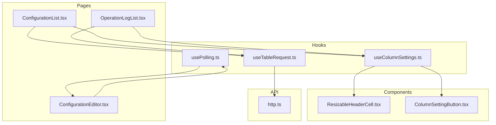
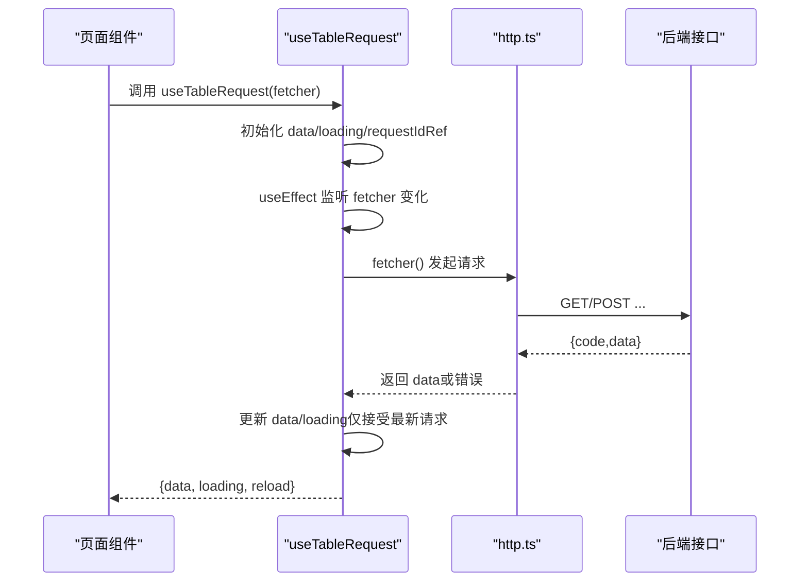
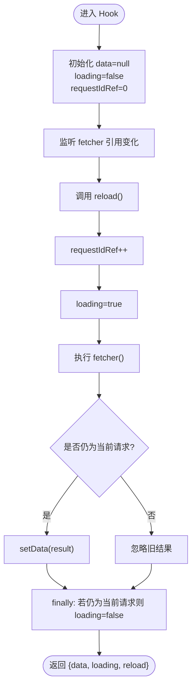
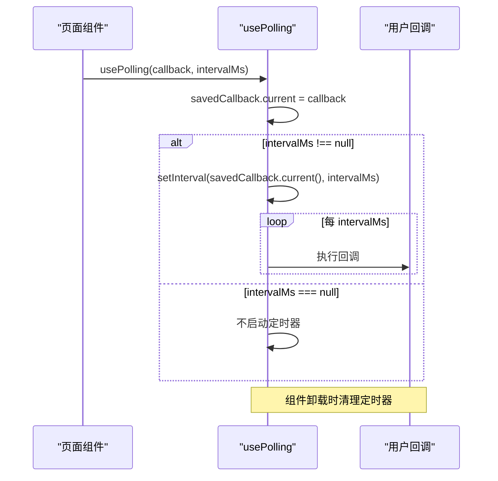
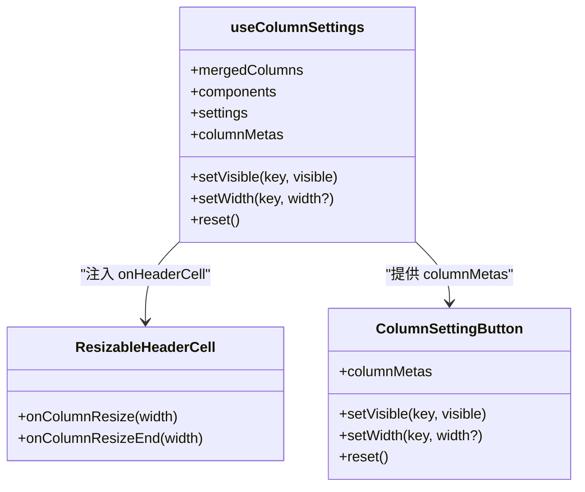
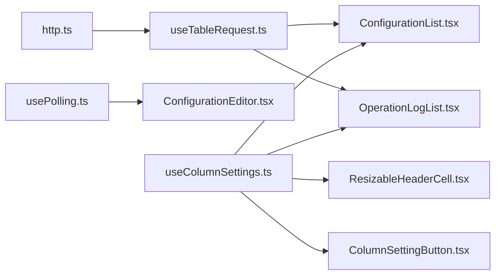

# 自定义Hooks

<cite>
**本文引用的文件**
- [useTableRequest.ts](file://web/src/hooks/useTableRequest.ts)
- [usePolling.ts](file://web/src/hooks/usePolling.ts)
- [useColumnSettings.ts](file://web/src/hooks/useColumnSettings.ts)
- [ResizableHeaderCell.tsx](file://web/src/components/ResizableHeaderCell.tsx)
- [ColumnSettingButton.tsx](file://web/src/components/ColumnSettingButton.tsx)
- [ConfigurationList.tsx](file://web/src/pages/configuration/ConfigurationList.tsx)
- [ConfigurationEditor.tsx](file://web/src/pages/configuration/ConfigurationEditor.tsx)
- [OperationLogList.tsx](file://web/src/pages/audit/OperationLogList.tsx)
- [http.ts](file://web/src/api/http.ts)
</cite>

## 目录
1. [简介](#简介)
2. [项目结构](#项目结构)
3. [核心组件](#核心组件)
4. [架构总览](#架构总览)
5. [详细组件分析](#详细组件分析)
6. [依赖关系分析](#依赖关系分析)
7. [性能考量](#性能考量)
8. [故障排查指南](#故障排查指南)
9. [结论](#结论)
10. [附录：使用示例与集成方式](#附录使用示例与集成方式)

## 简介
本仓库前端通过一组自定义 React Hooks 抽象了表格数据请求、定时轮询刷新、列设置持久化等通用能力，帮助页面以声明式的方式组合出稳定、可维护的交互。本文聚焦以下三个 Hook：
- useTableRequest：封装 loading/data/reload 三件套，统一处理竞态与自动重载。
- usePolling：基于 setInterval 的低频轮询，支持暂停与清理。
- useColumnSettings：管理列显隐、宽度覆盖与拖拽调宽，并持久化到 localStorage。

这些 Hook 在配置中心的前端页面中被广泛复用，例如配置列表、版本历史、操作日志等。

## 项目结构
与自定义 Hooks 相关的代码主要位于 web/src/hooks 目录，配套 UI 组件位于 web/src/components，典型使用场景位于 web/src/pages。

图表来源
- [useTableRequest.ts:1-38](file://web/src/hooks/useTableRequest.ts#L1-L38)
- [usePolling.ts:1-24](file://web/src/hooks/usePolling.ts#L1-L24)
- [useColumnSettings.ts:1-165](file://web/src/hooks/useColumnSettings.ts#L1-L165)
- [ResizableHeaderCell.tsx:1-123](file://web/src/components/ResizableHeaderCell.tsx#L1-L123)
- [ColumnSettingButton.tsx:1-50](file://web/src/components/ColumnSettingButton.tsx#L1-L50)
- [ConfigurationList.tsx:180-379](file://web/src/pages/configuration/ConfigurationList.tsx#L180-L379)
- [ConfigurationEditor.tsx:100-299](file://web/src/pages/configuration/ConfigurationEditor.tsx#L100-L299)
- [OperationLogList.tsx:8-137](file://web/src/pages/audit/OperationLogList.tsx#L8-L137)
- [http.ts:1-55](file://web/src/api/http.ts#L1-L55)

章节来源
- [useTableRequest.ts:1-38](file://web/src/hooks/useTableRequest.ts#L1-L38)
- [usePolling.ts:1-24](file://web/src/hooks/usePolling.ts#L1-L24)
- [useColumnSettings.ts:1-165](file://web/src/hooks/useColumnSettings.ts#L1-L165)
- [ConfigurationList.tsx:180-379](file://web/src/pages/configuration/ConfigurationList.tsx#L180-L379)
- [ConfigurationEditor.tsx:100-299](file://web/src/pages/configuration/ConfigurationEditor.tsx#L100-L299)
- [OperationLogList.tsx:8-137](file://web/src/pages/audit/OperationLogList.tsx#L8-L137)
- [http.ts:1-55](file://web/src/api/http.ts#L1-L55)

## 核心组件
- useTableRequest：提供 data、loading、reload；内部用 requestIdRef 避免旧请求覆盖新数据；fetcher 引用变化时自动触发 reload。
- usePolling：按 intervalMs 周期执行回调；传 null 可暂停；卸载时清理定时器；用 ref 保存最新回调避免重建定时器。
- useColumnSettings：将列可见性、宽度覆盖持久化到 localStorage；合并 columns 并注入 onHeaderCell 实现拖拽调宽；提供 columnMetas 给设置面板渲染。

章节来源
- [useTableRequest.ts:1-38](file://web/src/hooks/useTableRequest.ts#L1-L38)
- [usePolling.ts:1-24](file://web/src/hooks/usePolling.ts#L1-L24)
- [useColumnSettings.ts:1-165](file://web/src/hooks/useColumnSettings.ts#L1-L165)

## 架构总览
下图展示了三个 Hook 与页面、组件、网络层的协作关系。

图表来源
- [useTableRequest.ts:1-38](file://web/src/hooks/useTableRequest.ts#L1-L38)
- [http.ts:1-55](file://web/src/api/http.ts#L1-L55)

## 详细组件分析

### useTableRequest：表格数据请求 Hook
- 设计要点
  - 状态：data、loading、requestIdRef（防竞态）。
  - 行为：reload 递增序列号，确保只有最新请求能写入 state；fetcher 变化时自动重新加载。
  - 错误：由 http.ts 拦截器统一提示，Hook 只负责收尾 loading。
- 适用场景
  - 列表页的数据加载、筛选条件变化后自动重载、手动 reload（如发布/删除后刷新）。
- 复杂度
  - 时间：每次请求 O(1) 状态更新；内存中仅保留一个 requestId。
  - 空间：O(1)。
- 优化点
  - 使用 useCallback 包裹 fetcher，减少不必要的重新加载。
  - 结合分页参数变化作为依赖，保证筛选/排序变化时正确重载。

图表来源
- [useTableRequest.ts:1-38](file://web/src/hooks/useTableRequest.ts#L1-L38)

章节来源
- [useTableRequest.ts:1-38](file://web/src/hooks/useTableRequest.ts#L1-L38)
- [http.ts:1-55](file://web/src/api/http.ts#L1-L55)

### usePolling：轮询 Hook
- 设计要点
  - 使用 useRef 保存最新 callback，避免回调变化导致定时器频繁重建。
  - 根据 intervalMs 创建/清理 setInterval；传 null 时暂停。
- 适用场景
  - 低频探测远端变更（如编辑页检测他人修改），无需长连接。
- 复杂度
  - 时间：每 intervalMs 执行一次回调；清理 O(1)。
  - 空间：O(1)。
- 注意事项
  - 回调中应避免重渲染风暴；必要时结合业务状态判断是否真的需要刷新。

图表来源
- [usePolling.ts:1-24](file://web/src/hooks/usePolling.ts#L1-L24)

章节来源
- [usePolling.ts:1-24](file://web/src/hooks/usePolling.ts#L1-L24)
- [ConfigurationEditor.tsx:100-299](file://web/src/pages/configuration/ConfigurationEditor.tsx#L100-L299)

### useColumnSettings：列设置 Hook
- 功能概览
  - 列可见性控制：默认显示，可通过设置面板切换。
  - 宽度覆盖：支持输入固定宽度与表头拖拽调宽。
  - 持久化：按 pageKey 将设置写入 localStorage。
  - 合并列：过滤不可见列、应用宽度、注入 onHeaderCell 用于拖拽。
  - 元信息：生成 columnMetas 供 ColumnSettingButton 渲染。
- 关键实现
  - resolveColumnKey：优先列 key，其次 dataIndex，最后索引兜底。
  - applySettings：同步 settingsRef 与 state，可选是否落盘。
  - setWidthTransient：拖拽过程中只更新内存态，松手再落盘，降低 I/O 频率。
  - 最小列宽：MIN_COLUMN_WIDTH 保证可读性与布局稳定。
- 复杂度
  - 时间：合并列 useMemo，O(n)；localStorage 写 O(1)。
  - 空间：O(n) 存储列设置映射。
- 扩展点
  - 可接入服务端同步列偏好（当前为本地持久化）。

图表来源
- [useColumnSettings.ts:1-165](file://web/src/hooks/useColumnSettings.ts#L1-L165)
- [ResizableHeaderCell.tsx:1-123](file://web/src/components/ResizableHeaderCell.tsx#L1-L123)
- [ColumnSettingButton.tsx:1-50](file://web/src/components/ColumnSettingButton.tsx#L1-L50)

章节来源
- [useColumnSettings.ts:1-165](file://web/src/hooks/useColumnSettings.ts#L1-L165)
- [ResizableHeaderCell.tsx:1-123](file://web/src/components/ResizableHeaderCell.tsx#L1-L123)
- [ColumnSettingButton.tsx:1-50](file://web/src/components/ColumnSettingButton.tsx#L1-L50)

## 依赖关系分析
- useTableRequest 依赖 http.ts 的统一响应解包与错误提示。
- useColumnSettings 依赖 ResizableHeaderCell 实现拖拽调宽，依赖 ColumnSettingButton 提供设置面板。
- 页面层通过组合多个 Hook 完成复杂交互：
  - ConfigurationList：useTableRequest + useColumnSettings。
  - ConfigurationEditor：usePolling 探测远端变更。
  - OperationLogList：useTableRequest + useColumnSettings。

图表来源
- [http.ts:1-55](file://web/src/api/http.ts#L1-L55)
- [useTableRequest.ts:1-38](file://web/src/hooks/useTableRequest.ts#L1-L38)
- [usePolling.ts:1-24](file://web/src/hooks/usePolling.ts#L1-L24)
- [useColumnSettings.ts:1-165](file://web/src/hooks/useColumnSettings.ts#L1-L165)
- [ConfigurationList.tsx:180-379](file://web/src/pages/configuration/ConfigurationList.tsx#L180-L379)
- [ConfigurationEditor.tsx:100-299](file://web/src/pages/configuration/ConfigurationEditor.tsx#L100-L299)
- [OperationLogList.tsx:8-137](file://web/src/pages/audit/OperationLogList.tsx#L8-L137)
- [ResizableHeaderCell.tsx:1-123](file://web/src/components/ResizableHeaderCell.tsx#L1-L123)
- [ColumnSettingButton.tsx:1-50](file://web/src/components/ColumnSettingButton.tsx#L1-L50)

章节来源
- [ConfigurationList.tsx:180-379](file://web/src/pages/configuration/ConfigurationList.tsx#L180-L379)
- [ConfigurationEditor.tsx:100-299](file://web/src/pages/configuration/ConfigurationEditor.tsx#L100-L299)
- [OperationLogList.tsx:8-137](file://web/src/pages/audit/OperationLogList.tsx#L8-L137)

## 性能考量
- useTableRequest
  - 使用 requestIdRef 避免竞态导致的多余 setState。
  - 建议对 fetcher 使用 useCallback 稳定引用，减少不必要重载。
  - 错误由拦截器统一处理，Hook 内不做额外分支，降低渲染开销。
- usePolling
  - 使用 ref 保存最新回调，避免回调变化导致定时器重建。
  - 建议合理设置 intervalMs，避免高频轮询造成性能问题。
- useColumnSettings
  - 拖拽过程使用 setWidthTransient 仅更新内存态，松手再落盘，减少 localStorage 写入。
  - 合并列使用 useMemo，避免重复计算。
  - 最小列宽限制防止异常宽度破坏布局。

[本节为通用性能讨论，不直接分析具体文件]

## 故障排查指南
- 列表不刷新
  - 检查 fetcher 是否被 useCallback 包裹且依赖项正确。
  - 确认筛选条件变化会改变 fetcher 引用，从而触发 useTableRequest 的重载。
- 轮询无效
  - 确认 intervalMs 不为 null。
  - 检查回调中是否有提前 return 导致未执行刷新逻辑。
- 列设置未持久化
  - 浏览器可能禁用 localStorage，Hook 已做降级处理（仅内存态）。
  - 检查 storageKey 是否唯一（pageKey 不同即不同键）。
- 拖拽调宽异常
  - 确认 Table 传入 components={{ header: { cell: ResizableHeaderCell } }}。
  - 检查列是否具备 onHeaderCell（非 action 列会自动注入）。

章节来源
- [useTableRequest.ts:1-38](file://web/src/hooks/useTableRequest.ts#L1-L38)
- [usePolling.ts:1-24](file://web/src/hooks/usePolling.ts#L1-L24)
- [useColumnSettings.ts:1-165](file://web/src/hooks/useColumnSettings.ts#L1-L165)
- [ResizableHeaderCell.tsx:1-123](file://web/src/components/ResizableHeaderCell.tsx#L1-L123)
- [http.ts:1-55](file://web/src/api/http.ts#L1-L55)

## 结论
这三个自定义 Hook 分别解决了“数据请求”“定时刷新”“列设置”三类通用需求，配合统一的网络层与 UI 组件，显著降低了页面样板代码，提升了可维护性与一致性。建议在新增列表或编辑页时优先复用这些 Hook，并通过合理的依赖管理与性能优化策略获得更稳定的用户体验。

[本节为总结性内容，不直接分析具体文件]

## 附录：使用示例与集成方式

### 使用 useTableRequest
- 基本用法
  - 定义 fetcher（建议使用 useCallback），传入 useTableRequest。
  - 从返回值获取 data、loading、reload。
  - 在筛选条件变化或操作成功后调用 reload 刷新。
- 典型集成
  - 配置列表页：通过 useTableRequest 加载列表数据，并在发布/删除后 reload。
  - 操作日志页：同样使用 useTableRequest 加载日志列表。

章节来源
- [ConfigurationList.tsx:180-379](file://web/src/pages/configuration/ConfigurationList.tsx#L180-L379)
- [OperationLogList.tsx:8-137](file://web/src/pages/audit/OperationLogList.tsx#L8-L137)

### 使用 usePolling
- 基本用法
  - 传入回调与间隔毫秒数；传 null 可暂停。
  - 组件卸载时自动清理定时器。
- 典型集成
  - 配置编辑页：每 10 秒轮询一次详情，检测 updatedAt 变化，提示用户刷新以避免覆盖他人修改。

章节来源
- [ConfigurationEditor.tsx:100-299](file://web/src/pages/configuration/ConfigurationEditor.tsx#L100-L299)

### 使用 useColumnSettings
- 基本用法
  - 传入 pageKey 与 columns，得到 mergedColumns、components、columnMetas、setVisible、setWidth、reset。
  - 将 mergedColumns 与 components 传给 Table。
  - 将 columnMetas 与回调传给 ColumnSettingButton。
- 典型集成
  - 配置列表页、操作日志页均使用该 Hook 实现列显隐与宽度持久化。

章节来源
- [ConfigurationList.tsx:180-379](file://web/src/pages/configuration/ConfigurationList.tsx#L180-L379)
- [OperationLogList.tsx:8-137](file://web/src/pages/audit/OperationLogList.tsx#L8-L137)
- [useColumnSettings.ts:1-165](file://web/src/hooks/useColumnSettings.ts#L1-L165)
- [ColumnSettingButton.tsx:1-50](file://web/src/components/ColumnSettingButton.tsx#L1-L50)
- [ResizableHeaderCell.tsx:1-123](file://web/src/components/ResizableHeaderCell.tsx#L1-L123)

### 自定义 Hooks 的设计原则
- 状态管理
  - 尽量使用局部状态与 ref 管理瞬时值（如 requestIdRef、savedCallback）。
  - 对外暴露最小必要接口（data/loading/reload、setVisible/setWidth/reset）。
- 副作用处理
  - 使用 useEffect 管理副作用生命周期，确保清理（如 clearInterval）。
  - 将副作用与渲染解耦，避免在渲染阶段产生副作用。
- 性能优化
  - 使用 useCallback 稳定函数引用，减少不必要的重渲染。
  - 使用 useMemo 缓存计算结果（如 mergedColumns、columnMetas）。
  - 降低 I/O 频率（如拖拽过程中的临时宽度不落盘）。
- 健壮性
  - 处理边界情况（如 localStorage 不可用、非法宽度值）。
  - 统一错误处理（由 http.ts 拦截器集中提示）。

[本节为通用设计原则讨论，不直接分析具体文件]