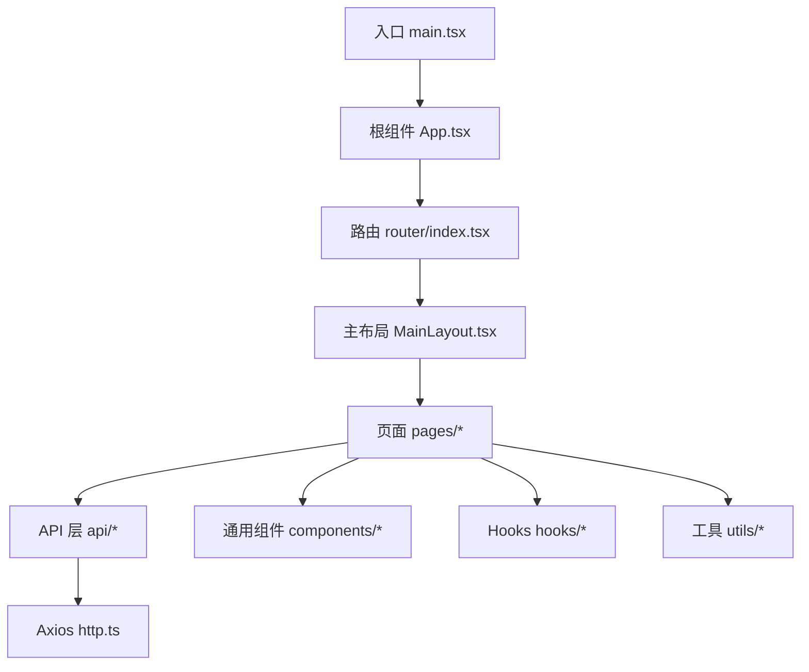
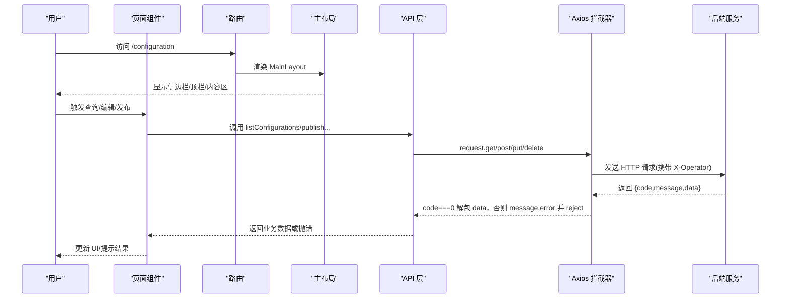
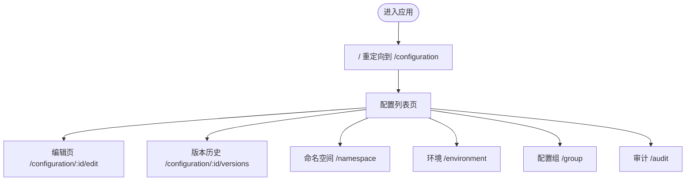
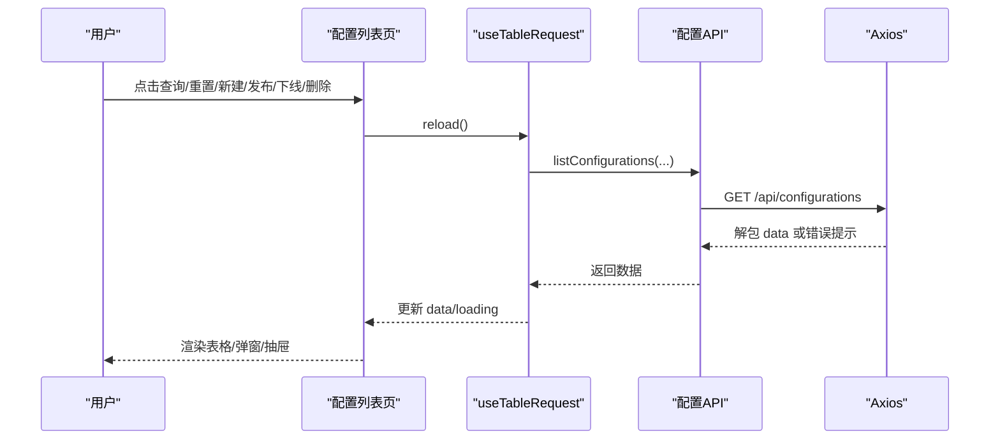
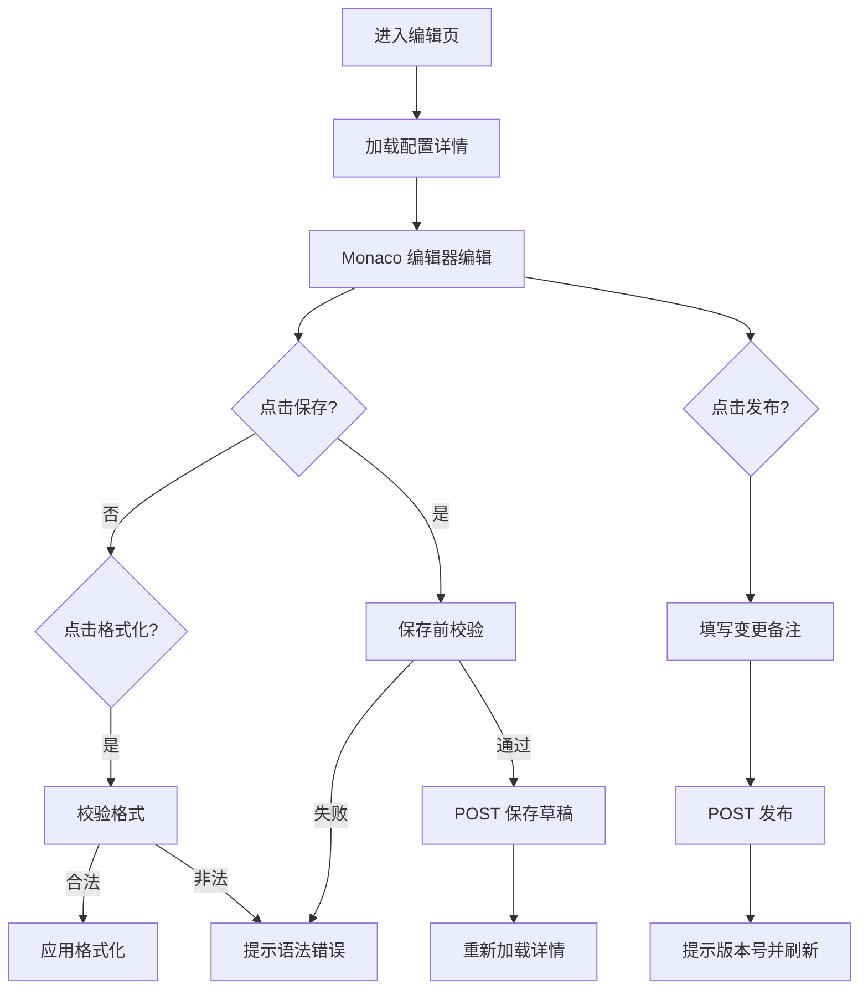
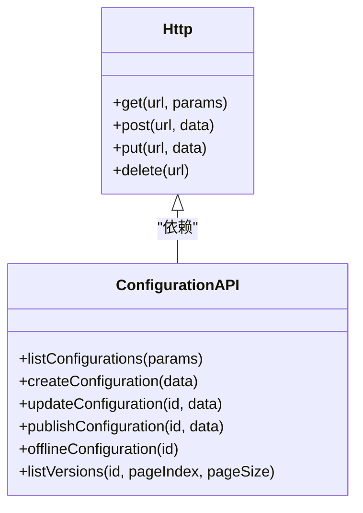
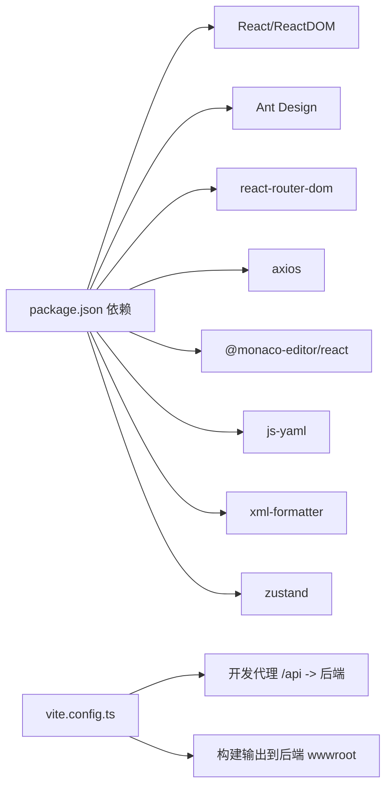

# 前端开发指南

<cite>
**本文引用的文件**
- [web/src/main.tsx](file://web/src/main.tsx)
- [web/src/App.tsx](file://web/src/App.tsx)
- [web/src/router/index.tsx](file://web/src/router/index.tsx)
- [web/src/layouts/MainLayout.tsx](file://web/src/layouts/MainLayout.tsx)
- [web/src/api/http.ts](file://web/src/api/http.ts)
- [web/src/api/configuration.ts](file://web/src/api/configuration.ts)
- [web/src/pages/configuration/ConfigurationList.tsx](file://web/src/pages/configuration/ConfigurationList.tsx)
- [web/src/pages/configuration/ConfigurationEditor.tsx](file://web/src/pages/configuration/ConfigurationEditor.tsx)
- [web/src/components/PageContainer.tsx](file://web/src/components/PageContainer.tsx)
- [web/src/components/FormDrawer.tsx](file://web/src/components/FormDrawer.tsx)
- [web/src/hooks/useTableRequest.ts](file://web/src/hooks/useTableRequest.ts)
- [web/src/hooks/useColumnSettings.ts](file://web/src/hooks/useColumnSettings.ts)
- [web/src/utils/formatters.ts](file://web/src/utils/formatters.ts)
- [web/package.json](file://web/package.json)
- [web/vite.config.ts](file://web/vite.config.ts)
</cite>

## 目录
1. [简介](#简介)
2. [项目结构](#项目结构)
3. [核心组件](#核心组件)
4. [架构总览](#架构总览)
5. [详细组件分析](#详细组件分析)
6. [依赖关系分析](#依赖关系分析)
7. [性能考虑](#性能考虑)
8. [故障排查指南](#故障排查指南)
9. [结论](#结论)
10. [附录](#附录)

## 简介
本指南面向配置中心的前端开发，覆盖项目结构、组件组织、路由与导航、API 集成、状态管理、事件处理、样式规范与响应式设计实践。目标是帮助开发者快速理解并高效扩展该 React + TypeScript 前端工程。

## 项目结构
前端采用 Vite + React + Ant Design 技术栈，按“页面-组件-Hooks-工具”分层组织：
- 入口与全局主题：main.tsx 提供全局主题与国际化；App.tsx 仅承载 RouterProvider。
- 路由：router/index.tsx 集中定义路由表，MainLayout 作为父布局嵌套各页面。
- 页面：pages 下按业务域划分（如 configuration、environment、group、namespace、audit）。
- 通用组件：components 提供可复用 UI（PageContainer、FormDrawer、StatusTag、FormatTag 等）。
- Hooks：hooks 封装列表加载、列设置、轮询等通用逻辑。
- API：api 层统一封装 axios、类型定义与各模块接口。
- 工具：utils 提供格式化器、表单格式化等能力。
- 构建与代理：vite.config.ts 配置别名、开发服务器代理与构建输出到后端静态目录。

图表来源
- [web/src/main.tsx:1-35](file://web/src/main.tsx#L1-L35)
- [web/src/App.tsx:1-8](file://web/src/App.tsx#L1-L8)
- [web/src/router/index.tsx:1-28](file://web/src/router/index.tsx#L1-L28)
- [web/src/layouts/MainLayout.tsx:1-104](file://web/src/layouts/MainLayout.tsx#L1-L104)
- [web/src/api/http.ts:1-55](file://web/src/api/http.ts#L1-L55)

章节来源
- [web/src/main.tsx:1-35](file://web/src/main.tsx#L1-L35)
- [web/src/App.tsx:1-8](file://web/src/App.tsx#L1-L8)
- [web/src/router/index.tsx:1-28](file://web/src/router/index.tsx#L1-L28)
- [web/src/layouts/MainLayout.tsx:1-104](file://web/src/layouts/MainLayout.tsx#L1-L104)
- [web/vite.config.ts:1-27](file://web/vite.config.ts#L1-L27)

## 核心组件
- 页面容器 PageContainer：统一的标题区与卡片内容区，支持可选图标与强调色渐变背景，用于页面级信息展示与操作入口。
- 表单抽屉 FormDrawer：右侧滑出式表单容器，内置未保存修改二次确认、销毁重建表单实例、固定底部按钮区。
- 表格请求 Hook useTableRequest：封装 loading/data/reload 三件套，使用请求序列号避免竞态覆盖。
- 列设置 Hook useColumnSettings：基于 localStorage 持久化列显隐与宽度，支持表头拖拽调宽与重置。
- 内容格式化器 formatters：为 JSON/YAML/XML/Properties/TOML/Text 提供校验与美化能力，供编辑器与新建表单使用。

章节来源
- [web/src/components/PageContainer.tsx:1-96](file://web/src/components/PageContainer.tsx#L1-L96)
- [web/src/components/FormDrawer.tsx:1-71](file://web/src/components/FormDrawer.tsx#L1-L71)
- [web/src/hooks/useTableRequest.ts:1-38](file://web/src/hooks/useTableRequest.ts#L1-L38)
- [web/src/hooks/useColumnSettings.ts:1-165](file://web/src/hooks/useColumnSettings.ts#L1-L165)
- [web/src/utils/formatters.ts:1-184](file://web/src/utils/formatters.ts#L1-L184)

## 架构总览
前端通过 Axios 拦截器统一注入操作人标识、解包后端响应体并统一错误提示；页面通过 API 层调用具体接口；路由以 MainLayout 为壳，子路由渲染在 Content 区域；主题与语言在入口集中配置。

图表来源
- [web/src/api/http.ts:1-55](file://web/src/api/http.ts#L1-L55)
- [web/src/router/index.tsx:1-28](file://web/src/router/index.tsx#L1-L28)
- [web/src/layouts/MainLayout.tsx:1-104](file://web/src/layouts/MainLayout.tsx#L1-L104)
- [web/src/api/configuration.ts:1-59](file://web/src/api/configuration.ts#L1-L59)

## 详细组件分析

### 路由与页面导航
- 路由表集中定义，首页重定向至配置管理；所有页面嵌套于 MainLayout。
- 动态路由用于编辑与版本历史页，便于传递配置 ID。
- 侧边栏菜单 key 与路由路径一致，高亮通过 pathname 前缀匹配实现。

图表来源
- [web/src/router/index.tsx:1-28](file://web/src/router/index.tsx#L1-L28)
- [web/src/layouts/MainLayout.tsx:16-40](file://web/src/layouts/MainLayout.tsx#L16-L40)

章节来源
- [web/src/router/index.tsx:1-28](file://web/src/router/index.tsx#L1-L28)
- [web/src/layouts/MainLayout.tsx:16-40](file://web/src/layouts/MainLayout.tsx#L16-L40)

### 配置列表页（ConfigurationList）
- 三级级联筛选：命名空间 → 环境 → 配置组，配合状态与关键字组合查询。
- 使用 useTableRequest 管理列表数据与加载态，避免旧请求覆盖新数据。
- 行操作：详情、编辑、发布、下线、删除、版本历史；危险操作二次确认。
- 列设置：支持列显隐与宽度持久化，操作列强制显示且不可调宽。
- 新建配置：抽屉表单，格式选择联动“校验并格式化”，提交后刷新列表。

图表来源
- [web/src/pages/configuration/ConfigurationList.tsx:86-188](file://web/src/pages/configuration/ConfigurationList.tsx#L86-L188)
- [web/src/hooks/useTableRequest.ts:1-38](file://web/src/hooks/useTableRequest.ts#L1-L38)
- [web/src/api/configuration.ts:18-20](file://web/src/api/configuration.ts#L18-L20)
- [web/src/api/http.ts:16-40](file://web/src/api/http.ts#L16-L40)

章节来源
- [web/src/pages/configuration/ConfigurationList.tsx:86-188](file://web/src/pages/configuration/ConfigurationList.tsx#L86-L188)
- [web/src/pages/configuration/ConfigurationList.tsx:298-475](file://web/src/pages/configuration/ConfigurationList.tsx#L298-L475)
- [web/src/hooks/useTableRequest.ts:1-38](file://web/src/hooks/useTableRequest.ts#L1-L38)

### 配置编辑器（ConfigurationEditor）
- Monaco 编辑器按 format 映射语言进行高亮；保存草稿与发布严格分离。
- 保存前执行格式校验（JSON/YAML/XML/Properties/TOML），失败则阻止保存。
- 低频轮询检测他人变更，本地未编辑时提示刷新，避免覆盖用户输入。
- 侧栏展示维度、Key、状态、版本、MD5、时间等信息。

图表来源
- [web/src/pages/configuration/ConfigurationEditor.tsx:33-58](file://web/src/pages/configuration/ConfigurationEditor.tsx#L33-L58)
- [web/src/pages/configuration/ConfigurationEditor.tsx:121-178](file://web/src/pages/configuration/ConfigurationEditor.tsx#L121-L178)
- [web/src/utils/formatters.ts:17-83](file://web/src/utils/formatters.ts#L17-L83)

章节来源
- [web/src/pages/configuration/ConfigurationEditor.tsx:64-183](file://web/src/pages/configuration/ConfigurationEditor.tsx#L64-L183)
- [web/src/pages/configuration/ConfigurationEditor.tsx:189-373](file://web/src/pages/configuration/ConfigurationEditor.tsx#L189-L373)
- [web/src/utils/formatters.ts:17-83](file://web/src/utils/formatters.ts#L17-L83)

### API 封装与错误处理
- Axios 实例统一 baseURL、超时与拦截器：非 GET 写入 X-Operator 头；响应体解包 data，业务失败弹出错误并 reject。
- 各模块 API 文件按资源划分，方法名清晰表达意图（list/create/update/delete/publish/rollback/offline/versions）。
- 类型定义集中在 types.ts，保证前后端字段一致性。

图表来源
- [web/src/api/http.ts:11-52](file://web/src/api/http.ts#L11-L52)
- [web/src/api/configuration.ts:18-59](file://web/src/api/configuration.ts#L18-L59)

章节来源
- [web/src/api/http.ts:1-55](file://web/src/api/http.ts#L1-L55)
- [web/src/api/configuration.ts:1-59](file://web/src/api/configuration.ts#L1-L59)

### 通用组件与工具
- PageContainer：统一页面头部与卡片容器，支持强调色渐变与额外操作区。
- FormDrawer：防误关、destroyOnClose、固定底部按钮，适合新增/编辑场景。
- useColumnSettings：列显隐与宽度持久化，支持表头拖拽调宽与重置。
- formatters：多格式校验与美化，支持 JSON/YAML/XML/Properties/TOML/Text。

章节来源
- [web/src/components/PageContainer.tsx:1-96](file://web/src/components/PageContainer.tsx#L1-L96)
- [web/src/components/FormDrawer.tsx:1-71](file://web/src/components/FormDrawer.tsx#L1-L71)
- [web/src/hooks/useColumnSettings.ts:1-165](file://web/src/hooks/useColumnSettings.ts#L1-L165)
- [web/src/utils/formatters.ts:1-184](file://web/src/utils/formatters.ts#L1-L184)

## 依赖关系分析
- 运行时依赖：React、Ant Design、axios、react-router-dom、zustand、monaco-editor、js-yaml、xml-formatter、diff-viewer。
- 构建与开发：Vite、TypeScript、@vitejs/plugin-react。
- 构建产物输出到后端 wwwroot，开发期通过代理转发 /api 到后端端口。

图表来源
- [web/package.json:11-30](file://web/package.json#L11-L30)
- [web/vite.config.ts:12-25](file://web/vite.config.ts#L12-L25)

章节来源
- [web/package.json:1-33](file://web/package.json#L1-L33)
- [web/vite.config.ts:1-27](file://web/vite.config.ts#L1-L27)

## 性能考虑
- 列表加载去抖与竞态保护：useTableRequest 使用请求序列号避免旧响应覆盖新数据。
- 下拉选项按需刷新：仅在展开时刷新命名空间/环境/配置组，减少无效请求。
- 列设置持久化：localStorage 存储列显隐与宽度，避免重复配置；拖拽过程只写内存，松手再落盘。
- 编辑器优化：关闭 minimap、限制滚动行为，降低大文档渲染开销。
- 轮询频率控制：编辑器低频轮询（10s）探测他人变更，避免频繁请求。

[本节为通用指导，不直接分析具体文件]

## 故障排查指南
- 网络错误：HTTP 非 2xx 由拦截器统一提示，检查代理配置与后端地址。
- 业务错误：后端返回 code !== 0 时拦截器弹出 message 并 reject，查看对应 API 调用链。
- 操作人标识缺失：非 GET 请求需确保 localStorage 中存在 operator，否则默认 portal。
- 列设置异常：localStorage 解析失败会降级为内存态，可通过重置恢复默认。
- 编辑器格式化失败：校验失败会提示具体错误行，修正后再格式化。

章节来源
- [web/src/api/http.ts:16-40](file://web/src/api/http.ts#L16-L40)
- [web/src/layouts/MainLayout.tsx:32-45](file://web/src/layouts/MainLayout.tsx#L32-L45)
- [web/src/hooks/useColumnSettings.ts:35-43](file://web/src/hooks/useColumnSettings.ts#L35-L43)
- [web/src/utils/formatters.ts:17-83](file://web/src/utils/formatters.ts#L17-L83)

## 结论
本项目采用清晰的层次化结构与统一的 API 封装，结合可复用的组件与 Hooks，实现了配置管理的完整流程。通过主题与布局的统一、列设置的持久化、编辑器的多格式支持与轮询机制，提供了良好的用户体验与维护性。建议后续在复杂交互中继续遵循现有模式，保持代码一致性与可测试性。

[本节为总结，不直接分析具体文件]

## 附录
- 开发命令：dev/build/preview 见 package.json scripts。
- 主题与语言：入口集中配置品牌主色、圆角、布局底色与中文文案。
- 路由约定：页面路由以功能域划分，动态路由用于编辑与版本历史。
- 样式规范：优先使用 Ant Design 主题 token，局部样式尽量内联或模块化，避免全局污染。
- 响应式实践：表格启用横向滚动，小屏下避免内容溢出；布局使用 Flex 自适应。

章节来源
- [web/package.json:6-10](file://web/package.json#L6-L10)
- [web/src/main.tsx:7-31](file://web/src/main.tsx#L7-L31)
- [web/src/router/index.tsx:11-27](file://web/src/router/index.tsx#L11-L27)
- [web/src/pages/configuration/ConfigurationList.tsx:569-579](file://web/src/pages/configuration/ConfigurationList.tsx#L569-L579)