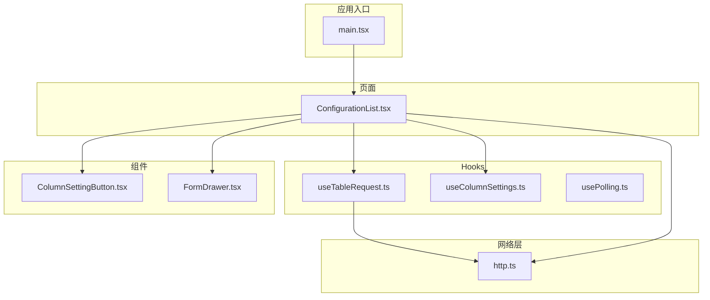
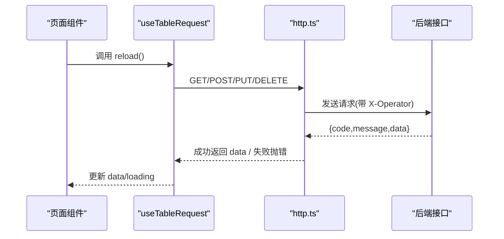
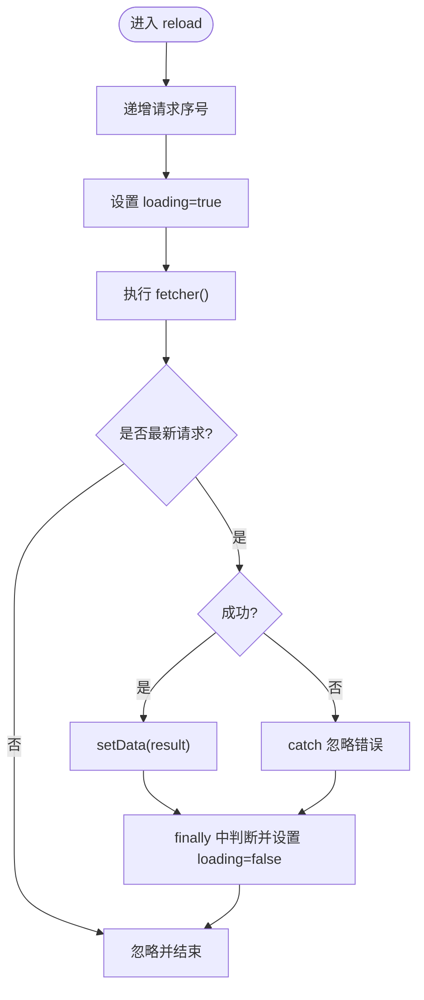
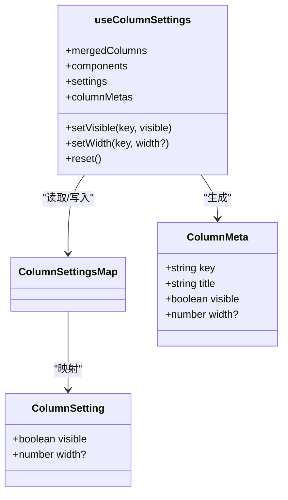
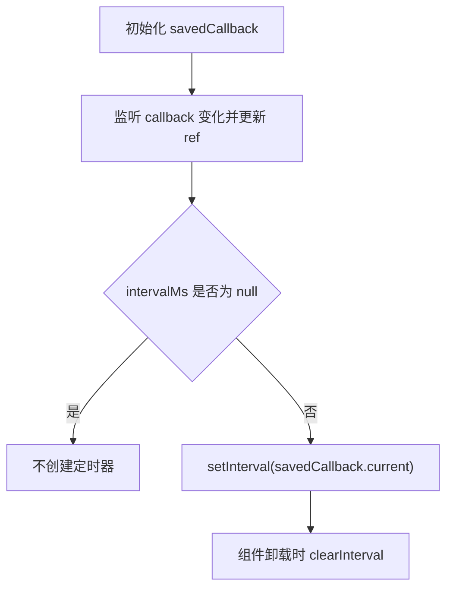
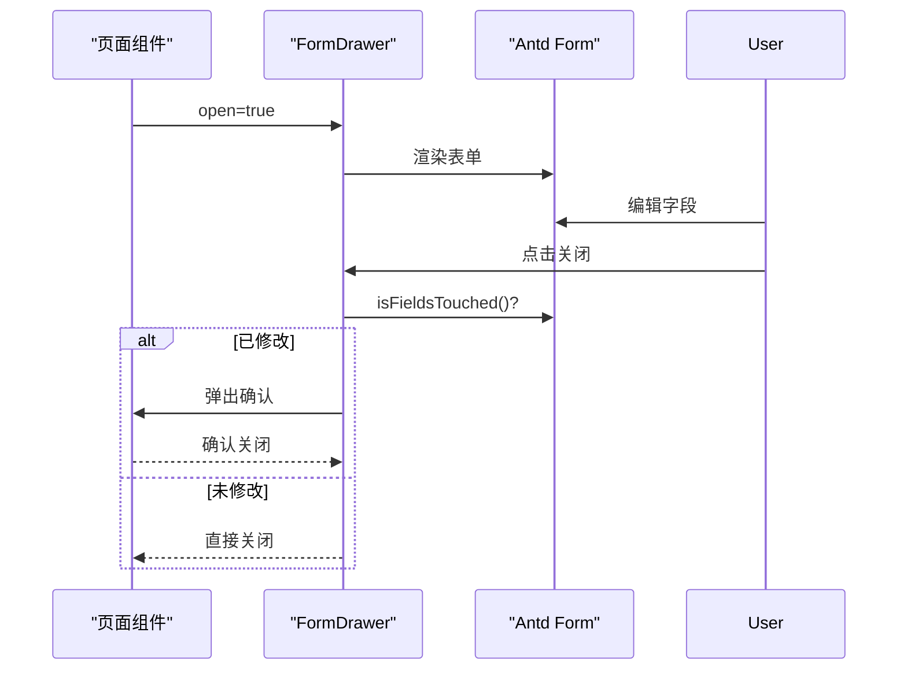
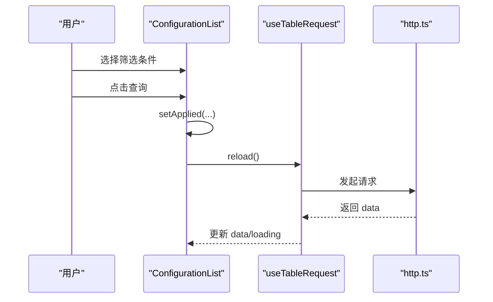
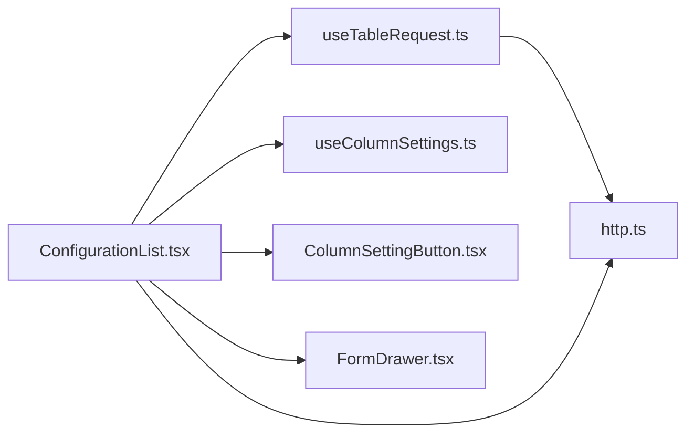

# 状态管理

<cite>
**本文引用的文件**
- [usePolling.ts](file://web/src/hooks/usePolling.ts)
- [useColumnSettings.ts](file://web/src/hooks/useColumnSettings.ts)
- [useTableRequest.ts](file://web/src/hooks/useTableRequest.ts)
- [http.ts](file://web/src/api/http.ts)
- [ConfigurationList.tsx](file://web/src/pages/configuration/ConfigurationList.tsx)
- [ColumnSettingButton.tsx](file://web/src/components/ColumnSettingButton.tsx)
- [FormDrawer.tsx](file://web/src/components/FormDrawer.tsx)
- [main.tsx](file://web/src/main.tsx)
</cite>

## 目录
1. [简介](#简介)
2. [项目结构](#项目结构)
3. [核心组件](#核心组件)
4. [架构总览](#架构总览)
5. [详细组件分析](#详细组件分析)
6. [依赖关系分析](#依赖关系分析)
7. [性能考虑](#性能考虑)
8. [故障排查指南](#故障排查指南)
9. [结论](#结论)
10. [附录](#附录)

## 简介
本文件聚焦前端状态管理的整体设计与实现，覆盖全局与本地状态策略、自定义 Hook 的状态管理模式（轮询、列设置、列表请求）、表单状态管理与优化、状态持久化与同步、以及性能优化与调试技巧。本项目未引入第三方全局状态库（如 Zustand），而是采用 React 内置能力（useState/useEffect/useRef）与可复用 Hook 组合，配合统一的网络层拦截器，形成轻量、可控、易维护的状态体系。

## 项目结构
前端状态管理主要分布在以下位置：
- hooks：通用状态逻辑封装（轮询、表格数据加载、列设置持久化）
- components：UI 组件内局部状态（抽屉、按钮面板等）
- api：统一网络请求与错误处理（Axios 拦截器）
- pages：页面级状态编排（筛选条件、下拉数据源、操作流）
- main：应用级上下文（主题、国际化）

图表来源
- [ConfigurationList.tsx:86-188](file://web/src/pages/configuration/ConfigurationList.tsx#L86-L188)
- [useTableRequest.ts:7-37](file://web/src/hooks/useTableRequest.ts#L7-L37)
- [useColumnSettings.ts:50-164](file://web/src/hooks/useColumnSettings.ts#L50-L164)
- [ColumnSettingButton.tsx:16-49](file://web/src/components/ColumnSettingButton.tsx#L16-L49)
- [FormDrawer.tsx:23-69](file://web/src/components/FormDrawer.tsx#L23-L69)
- [http.ts:11-52](file://web/src/api/http.ts#L11-L52)
- [main.tsx:28-34](file://web/src/main.tsx#L28-L34)

章节来源
- [main.tsx:28-34](file://web/src/main.tsx#L28-L34)

## 核心组件
- useTableRequest：封装 loading/data/reload 三件套，提供请求序列号避免竞态覆盖。
- useColumnSettings：基于 localStorage 的列显隐与宽度覆盖，支持拖拽过程中的瞬时更新与最终落盘。
- usePolling：间隔轮询 Hook，支持暂停与自动清理。
- ColumnSettingButton：列配置面板，驱动 setVisible/setWidth/reset。
- FormDrawer：通用表单抽屉，含未保存确认与销毁重建机制。
- http.ts：Axios 实例与拦截器，统一注入操作人、解包响应、统一错误提示。

章节来源
- [useTableRequest.ts:7-37](file://web/src/hooks/useTableRequest.ts#L7-L37)
- [useColumnSettings.ts:50-164](file://web/src/hooks/useColumnSettings.ts#L50-L164)
- [usePolling.ts:8-23](file://web/src/hooks/usePolling.ts#L8-L23)
- [ColumnSettingButton.tsx:16-49](file://web/src/components/ColumnSettingButton.tsx#L16-L49)
- [FormDrawer.tsx:23-69](file://web/src/components/FormDrawer.tsx#L23-L69)
- [http.ts:11-52](file://web/src/api/http.ts#L11-L52)

## 架构总览
前端采用“页面级状态 + 可复用 Hook”的组合模式：
- 页面级状态：用于筛选条件、弹窗开关、当前选中项等短期或页面内共享状态。
- 可复用 Hook：将复杂状态逻辑下沉到 Hook，便于跨页面复用与测试。
- 网络层：统一拦截器负责错误展示与响应解包，业务代码只关注 data。
- 持久化：通过 localStorage 存储用户偏好（如列设置）。

图表来源
- [useTableRequest.ts:13-29](file://web/src/hooks/useTableRequest.ts#L13-L29)
- [http.ts:17-39](file://web/src/api/http.ts#L17-L39)

## 详细组件分析

### 列表数据加载 Hook：useTableRequest
- 职责：封装 loading、data、reload；保证多次快速触发时仅最新结果生效。
- 设计要点：
  - 使用 requestIdRef 标记请求序号，只有最新请求能写入 state，避免旧响应覆盖新数据。
  - 错误由 http.ts 统一提示，此处只做收尾 loading。
  - fetcher 变化时自动重新加载，适合筛选条件变化场景。

图表来源
- [useTableRequest.ts:13-29](file://web/src/hooks/useTableRequest.ts#L13-L29)

章节来源
- [useTableRequest.ts:7-37](file://web/src/hooks/useTableRequest.ts#L7-L37)

### 列设置 Hook：useColumnSettings
- 职责：按 pageKey 持久化列的可见性与宽度覆盖；合并 columns 并注入表头拖拽能力。
- 设计要点：
  - 稳定 key 解析：优先 column.key，其次 dataIndex，最后索引兜底。
  - 持久化：localStorage 读写，写失败降级为内存态。
  - 高频更新优化：拖拽过程中仅更新内存态（shouldPersist=false），松手再落盘。
  - 安全校验：宽度需为有限数值且不低于最小值，防止损坏数据。
  - 操作列强制显示，不参与设置面板。

图表来源
- [useColumnSettings.ts:6-21](file://web/src/hooks/useColumnSettings.ts#L6-L21)
- [useColumnSettings.ts:50-164](file://web/src/hooks/useColumnSettings.ts#L50-L164)

章节来源
- [useColumnSettings.ts:50-164](file://web/src/hooks/useColumnSettings.ts#L50-L164)
- [ColumnSettingButton.tsx:16-49](file://web/src/components/ColumnSettingButton.tsx#L16-L49)

### 轮询 Hook：usePolling
- 职责：定时执行回调，支持传入 null 暂停；组件卸载自动清理定时器。
- 设计要点：
  - 使用 ref 保存最新回调，避免回调变化导致定时器频繁重建。
  - 根据 intervalMs 控制启停，null 表示暂停。

图表来源
- [usePolling.ts:8-23](file://web/src/hooks/usePolling.ts#L8-L23)

章节来源
- [usePolling.ts:8-23](file://web/src/hooks/usePolling.ts#L8-L23)

### 表单状态管理：FormDrawer 与页面表单
- 职责：提供右侧抽屉式表单，包含未保存二次确认、销毁重建、loading 控制。
- 设计要点：
  - 关闭前检测 isFieldsTouched，有修改则弹出确认框。
  - destroyOnClose 确保每次打开都是全新表单实例，避免状态残留。
  - 页面侧使用 Ant Design Form 管理字段值与校验，提交后刷新列表。

图表来源
- [FormDrawer.tsx:23-69](file://web/src/components/FormDrawer.tsx#L23-L69)
- [ConfigurationList.tsx:252-279](file://web/src/pages/configuration/ConfigurationList.tsx#L252-L279)

章节来源
- [FormDrawer.tsx:23-69](file://web/src/components/FormDrawer.tsx#L23-L69)
- [ConfigurationList.tsx:252-279](file://web/src/pages/configuration/ConfigurationList.tsx#L252-L279)

### 页面级状态编排：ConfigurationList
- 职责：组织筛选条件、下拉数据源、列表加载、发布/下线/删除等操作。
- 设计要点：
  - 筛选区使用草稿状态（未点查询不生效），点查询后生成 applied 快照触发重载。
  - 级联下拉：命名空间→环境→配置组，展开时按需刷新，避免陈旧数据。
  - 列表数据：通过 useTableRequest 统一管理 loading/data/reload。
  - 列设置：通过 useColumnSettings 持久化列配置，结合 ColumnSettingButton 交互。

图表来源
- [ConfigurationList.tsx:176-188](file://web/src/pages/configuration/ConfigurationList.tsx#L176-L188)
- [useTableRequest.ts:13-29](file://web/src/hooks/useTableRequest.ts#L13-L29)
- [http.ts:17-39](file://web/src/api/http.ts#L17-L39)

章节来源
- [ConfigurationList.tsx:86-188](file://web/src/pages/configuration/ConfigurationList.tsx#L86-L188)

## 依赖关系分析
- 页面组件依赖多个 Hook 与组件，形成清晰的单向数据流。
- 网络层被多处复用，统一错误与响应格式，降低耦合。
- 列设置与表格渲染解耦，通过 props 传递元信息与回调。

图表来源
- [ConfigurationList.tsx:86-188](file://web/src/pages/configuration/ConfigurationList.tsx#L86-L188)
- [useTableRequest.ts:7-37](file://web/src/hooks/useTableRequest.ts#L7-L37)
- [useColumnSettings.ts:50-164](file://web/src/hooks/useColumnSettings.ts#L50-L164)
- [ColumnSettingButton.tsx:16-49](file://web/src/components/ColumnSettingButton.tsx#L16-L49)
- [FormDrawer.tsx:23-69](file://web/src/components/FormDrawer.tsx#L23-L69)
- [http.ts:11-52](file://web/src/api/http.ts#L11-L52)

章节来源
- [ConfigurationList.tsx:86-188](file://web/src/pages/configuration/ConfigurationList.tsx#L86-L188)

## 性能考虑
- 请求竞态保护：useTableRequest 使用请求序号避免旧响应覆盖。
- 高频更新优化：列宽拖拽过程仅更新内存态，松手再落盘，减少 localStorage 写入。
- 回调稳定性：usePolling 使用 ref 保存最新回调，避免定时器重复创建。
- 懒加载与按需刷新：下拉选项在展开时刷新，减少初始负载。
- 组件销毁清理：轮询 Hook 在卸载时清理定时器，避免内存泄漏。

[本节为通用性能建议，无需特定文件引用]

## 故障排查指南
- 网络错误：检查 http.ts 拦截器是否正确解包与提示；确认后端返回结构与 code 约定。
- 列表数据不更新：确认 fetcher 引用是否稳定；检查 useTableRequest 的 reload 是否被调用。
- 列设置丢失：检查 localStorage 是否可用；确认 storageKey 是否与 pageKey 一致。
- 轮询未生效：确认 intervalMs 不为 null；检查回调是否被正确保存至 ref。
- 表单误关丢失：确认 FormDrawer 的 isFieldsTouched 逻辑与 destroyOnClose 行为是否符合预期。

章节来源
- [http.ts:24-39](file://web/src/api/http.ts#L24-L39)
- [useTableRequest.ts:13-29](file://web/src/hooks/useTableRequest.ts#L13-L29)
- [useColumnSettings.ts:57-78](file://web/src/hooks/useColumnSettings.ts#L57-L78)
- [usePolling.ts:12-22](file://web/src/hooks/usePolling.ts#L12-L22)
- [FormDrawer.tsx:34-47](file://web/src/components/FormDrawer.tsx#L34-L47)

## 结论
本项目采用以 Hook 为核心的状态管理方案，将复杂状态逻辑下沉到可复用的 Hook 中，页面仅负责编排与展示。通过统一的网络层拦截器与 localStorage 持久化，实现了简洁、可控、易维护的前端状态体系。该方案避免了引入重型全局状态库的复杂度，同时满足列表加载、列设置、轮询、表单等常见场景的需求。

[本节为总结性内容，无需特定文件引用]

## 附录
- 全局上下文：应用入口通过 ConfigProvider 提供主题与国际化，属于应用级上下文而非业务状态。
- 扩展建议：如需跨页面共享复杂状态，可考虑引入轻量状态库（如 Zustand），但当前 Hook 方案已足够支撑现有需求。

章节来源
- [main.tsx:28-34](file://web/src/main.tsx#L28-L34)