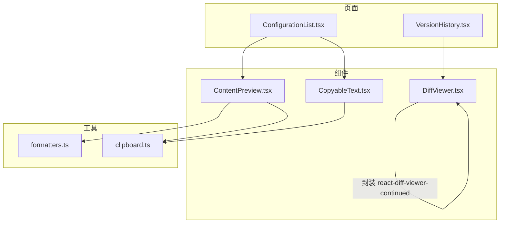
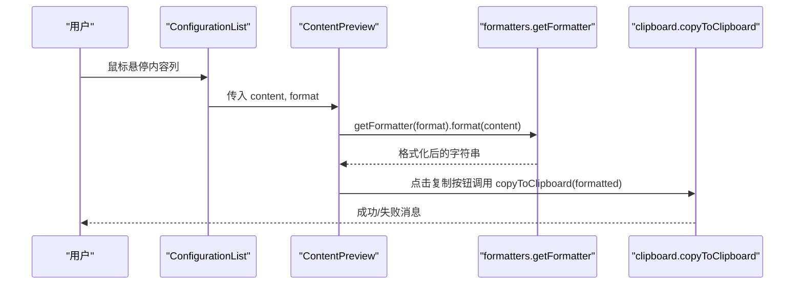
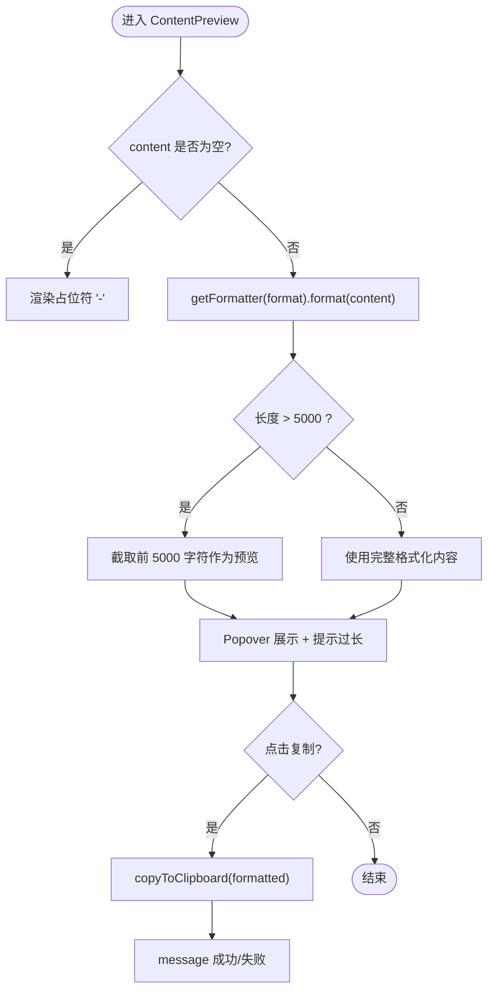
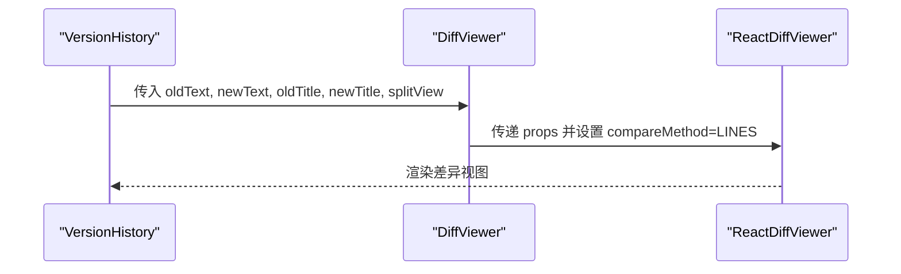
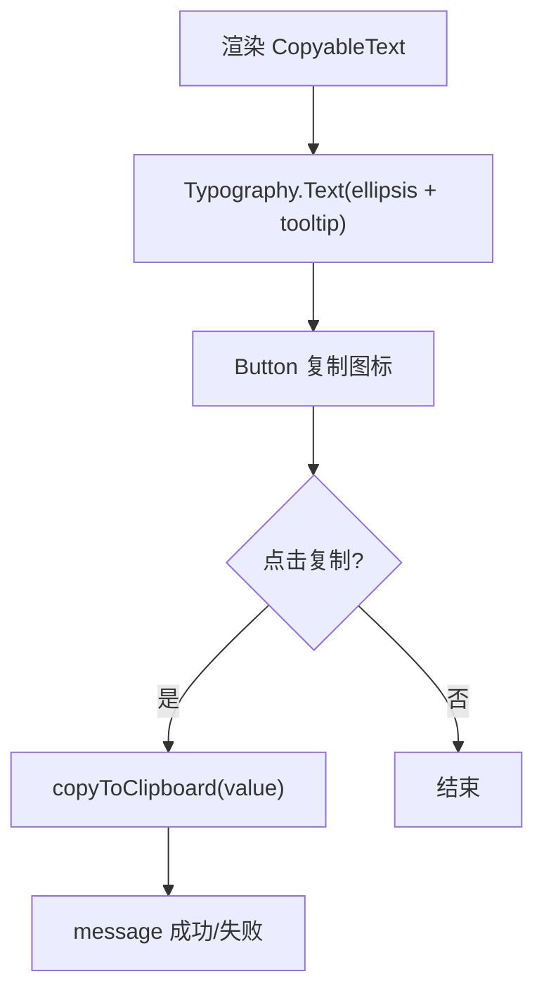
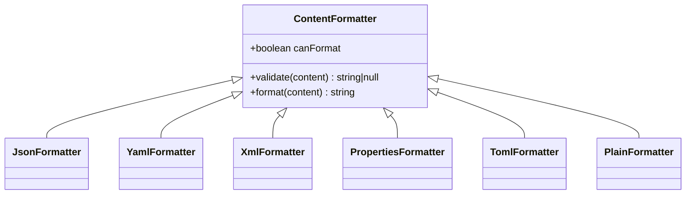
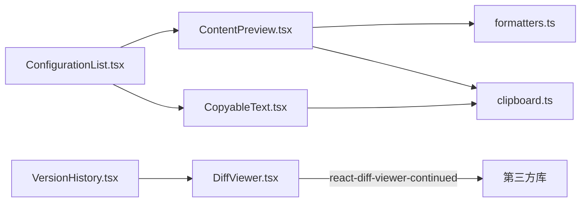

# 内容展示组件

<cite>
**本文引用的文件**
- [ContentPreview.tsx](file://web/src/components/ContentPreview.tsx)
- [DiffViewer.tsx](file://web/src/components/DiffViewer.tsx)
- [CopyableText.tsx](file://web/src/components/CopyableText.tsx)
- [formatters.ts](file://web/src/utils/formatters.ts)
- [clipboard.ts](file://web/src/utils/clipboard.ts)
- [FormatSelect.tsx](file://web/src/components/FormatSelect.tsx)
- [FormatTag.tsx](file://web/src/components/FormatTag.tsx)
- [ConfigurationList.tsx](file://web/src/pages/configuration/ConfigurationList.tsx)
- [VersionHistory.tsx](file://web/src/pages/configuration/VersionHistory.tsx)
</cite>

## 目录
1. [简介](#简介)
2. [项目结构](#项目结构)
3. [核心组件](#核心组件)
4. [架构总览](#架构总览)
5. [详细组件分析](#详细组件分析)
6. [依赖关系分析](#依赖关系分析)
7. [性能考虑](#性能考虑)
8. [故障排查指南](#故障排查指南)
9. [结论](#结论)
10. [附录](#附录)

## 简介
本开发文档聚焦于内容展示类组件，覆盖以下能力：
- ContentPreview 内容预览：多格式内容渲染、格式化与超长内容截断、一键复制。
- DiffViewer 差异对比：基于行级对比的可视化差异展示，支持文本、JSON、YAML、XML、Properties、Toml 等格式的差异查看。
- CopyableText 可复制文本：省略显示 + Tooltip 全文 + 一键复制。
- 性能优化策略：虚拟滚动、懒加载、长内容截断、按需渲染等。
- 响应式设计与无障碍访问：表格横向滚动、键盘可达性、语义化标签与提示。

## 项目结构
内容展示相关代码位于 web 前端工程，核心由三个组件与两个工具模块组成，并在配置列表与版本历史页面中集成使用。

图表来源
- [ContentPreview.tsx:1-64](file://web/src/components/ContentPreview.tsx#L1-L64)
- [DiffViewer.tsx:1-29](file://web/src/components/DiffViewer.tsx#L1-L29)
- [CopyableText.tsx:1-40](file://web/src/components/CopyableText.tsx#L1-L40)
- [formatters.ts:1-184](file://web/src/utils/formatters.ts#L1-L184)
- [clipboard.ts:1-33](file://web/src/utils/clipboard.ts#L1-L33)
- [ConfigurationList.tsx:298-347](file://web/src/pages/configuration/ConfigurationList.tsx#L298-L347)
- [VersionHistory.tsx:303-322](file://web/src/pages/configuration/VersionHistory.tsx#L303-L322)

章节来源
- [ConfigurationList.tsx:298-347](file://web/src/pages/configuration/ConfigurationList.tsx#L298-L347)
- [VersionHistory.tsx:303-322](file://web/src/pages/configuration/VersionHistory.tsx#L303-L322)

## 核心组件
- ContentPreview：在列表单元格内短文本展示，hover 弹出 Popover 展示格式化后的完整内容；超长内容自动截断并提示；提供“复制全部”按钮。
- DiffViewer：对旧/新文本进行按行差异对比，支持双栏/单栏模式切换，用于版本历史与编辑态对比。
- CopyableText：文本省略显示，Tooltip 显示全文，右侧附带复制按钮，复制结果通过消息反馈。
- formatters：统一的内容校验与格式化器注册表，支持 text/json/yaml/xml/properties/toml。
- clipboard：剪贴板写入封装，优先使用安全上下文 API，失败时降级到 execCommand。

章节来源
- [ContentPreview.tsx:1-64](file://web/src/components/ContentPreview.tsx#L1-L64)
- [DiffViewer.tsx:1-29](file://web/src/components/DiffViewer.tsx#L1-L29)
- [CopyableText.tsx:1-40](file://web/src/components/CopyableText.tsx#L1-L40)
- [formatters.ts:1-184](file://web/src/utils/formatters.ts#L1-L184)
- [clipboard.ts:1-33](file://web/src/utils/clipboard.ts#L1-L33)

## 架构总览
内容展示组件围绕“格式解析与渲染”和“交互体验”两条主线构建：
- 格式解析与渲染：通过 formatters 提供的 validate/format 接口，实现 JSON/YAML/XML/Properties/TOML 的校验与美化；未知格式回退为纯文本。
- 交互体验：ContentPreview 提供 Popover 预览与复制；CopyableText 提供便捷复制；DiffViewer 提供差异可视化。

图表来源
- [ConfigurationList.tsx:341-347](file://web/src/pages/configuration/ConfigurationList.tsx#L341-L347)
- [ContentPreview.tsx:13-63](file://web/src/components/ContentPreview.tsx#L13-L63)
- [formatters.ts:170-184](file://web/src/utils/formatters.ts#L170-L184)
- [clipboard.ts:22-32](file://web/src/utils/clipboard.ts#L22-L32)

## 详细组件分析

### ContentPreview 内容预览组件
- 功能要点
  - 空内容占位符“-”。
  - 根据 format 获取对应格式化器，先格式化再截断（默认最多 5000 字符），避免 Popover 渲染卡顿。
  - Popover 内以预格式化文本展示，并提供“复制全部”按钮。
  - 复制失败时提示手动复制。
- 数据流
  - 接收 content 与 format → 调用 getFormatter(format).format(content) → 计算是否超长 → 渲染预览或提示。
- 错误处理
  - 格式化失败时回退原文，保证 UI 可用。
- 使用场景
  - 配置列表的内容列，hover 预览、点击复制。

图表来源
- [ContentPreview.tsx:13-63](file://web/src/components/ContentPreview.tsx#L13-L63)
- [formatters.ts:170-184](file://web/src/utils/formatters.ts#L170-L184)
- [clipboard.ts:22-32](file://web/src/utils/clipboard.ts#L22-L32)

章节来源
- [ContentPreview.tsx:1-64](file://web/src/components/ContentPreview.tsx#L1-L64)
- [ConfigurationList.tsx:341-347](file://web/src/pages/configuration/ConfigurationList.tsx#L341-L347)

### DiffViewer 差异对比组件
- 功能要点
  - 基于 react-diff-viewer-continued 的 ReactDiffViewer 封装。
  - 按行比较（DiffMethod.LINES），支持 splitView 切换双栏/单栏。
  - 支持设置左右标题（如版本号）。
- 使用场景
  - 版本历史页：选择两个版本进行对比；当前编辑态 vs 生效版本的预设对比。
- 数据流
  - 父组件准备 oldText/newText 与标题 → 传递给 DiffViewer → 渲染差异视图。

图表来源
- [VersionHistory.tsx:303-322](file://web/src/pages/configuration/VersionHistory.tsx#L303-L322)
- [DiffViewer.tsx:1-29](file://web/src/components/DiffViewer.tsx#L1-L29)

章节来源
- [DiffViewer.tsx:1-29](file://web/src/components/DiffViewer.tsx#L1-L29)
- [VersionHistory.tsx:100-121](file://web/src/pages/configuration/VersionHistory.tsx#L100-L121)
- [VersionHistory.tsx:303-322](file://web/src/pages/configuration/VersionHistory.tsx#L303-L322)

### CopyableText 可复制文本组件
- 功能要点
  - 文本省略显示，Tooltip 显示全文。
  - 右侧附带复制按钮，复制结果通过 message 反馈。
  - 支持 code 样式与 maxWidth 限制宽度。
- 使用场景
  - 配置 Key 列等需要快速复制的场景。

图表来源
- [CopyableText.tsx:16-39](file://web/src/components/CopyableText.tsx#L16-L39)
- [clipboard.ts:22-32](file://web/src/utils/clipboard.ts#L22-L32)

章节来源
- [CopyableText.tsx:1-40](file://web/src/components/CopyableText.tsx#L1-L40)
- [ConfigurationList.tsx:335-340](file://web/src/pages/configuration/ConfigurationList.tsx#L335-L340)

### 格式化器与剪贴板工具
- 格式化器（formatters）
  - 统一接口：validate(content) 返回 null 表示合法，否则返回错误描述；format(content) 失败回退原文。
  - 支持格式：text、json、yaml、xml、properties、toml。
  - 注册表：getFormatter(format) 按格式取对应处理器，未注册格式回退为 plain。
- 剪贴板（clipboard）
  - 优先 navigator.clipboard.writeText，失败降级到临时 textarea + execCommand('copy')。
  - 不直接弹提示，交由调用方根据返回值反馈。

图表来源
- [formatters.ts:8-15](file://web/src/utils/formatters.ts#L8-L15)
- [formatters.ts:17-168](file://web/src/utils/formatters.ts#L17-L168)

章节来源
- [formatters.ts:1-184](file://web/src/utils/formatters.ts#L1-L184)
- [clipboard.ts:1-33](file://web/src/utils/clipboard.ts#L1-L33)

## 依赖关系分析
- 组件间耦合
  - ContentPreview 依赖 formatters 与 clipboard，低耦合、职责清晰。
  - DiffViewer 仅负责将 props 透传给第三方库，便于替换或扩展。
  - CopyableText 依赖 clipboard，复用统一的复制逻辑。
- 页面集成
  - ConfigurationList 在内容列使用 ContentPreview，在 Key 列使用 CopyableText。
  - VersionHistory 在版本对比弹窗中使用 DiffViewer。
- 外部依赖
  - react-diff-viewer-continued：提供差异对比 UI。
  - js-yaml、xml-formatter：用于 YAML/XML 的解析与格式化。
  - Ant Design：UI 基础组件。

图表来源
- [ConfigurationList.tsx:335-347](file://web/src/pages/configuration/ConfigurationList.tsx#L335-L347)
- [VersionHistory.tsx:303-322](file://web/src/pages/configuration/VersionHistory.tsx#L303-L322)
- [ContentPreview.tsx:1-64](file://web/src/components/ContentPreview.tsx#L1-L64)
- [DiffViewer.tsx:1-29](file://web/src/components/DiffViewer.tsx#L1-L29)

章节来源
- [ConfigurationList.tsx:298-347](file://web/src/pages/configuration/ConfigurationList.tsx#L298-L347)
- [VersionHistory.tsx:303-322](file://web/src/pages/configuration/VersionHistory.tsx#L303-L322)

## 性能考虑
- 长内容预览截断
  - ContentPreview 对超过阈值的格式化内容进行截断，减少 Popover 渲染压力。
- 按需渲染与懒加载
  - Popover 仅在 hover 时渲染，避免首屏开销。
  - 列表分页加载，配合 useTableRequest 控制请求频率。
- 虚拟滚动建议
  - 当配置项数量较大时，可在 Table 层引入虚拟滚动方案（例如 antd-virtual-scroll 或 rc-table 虚拟滚动），以减少 DOM 节点数量。
- 格式化成本
  - 大体积 JSON/YAML/XML 格式化可能耗时，建议在编辑器侧做增量校验与格式化，预览侧仅做轻量格式化或缓存结果。
- 剪贴板操作
  - 使用异步 API，避免阻塞主线程；失败时降级确保可用性。

[本节为通用性能建议，不直接分析具体文件]

## 故障排查指南
- 复制失败
  - 现象：点击复制后提示失败。
  - 原因：非安全上下文或浏览器限制导致 navigator.clipboard 不可用。
  - 处理：已内置降级到 execCommand；若仍失败，提示用户手动复制。
  - 参考路径：[clipboard.ts:22-32](file://web/src/utils/clipboard.ts#L22-L32)
- 格式化异常
  - 现象：格式化后内容与预期不符或报错。
  - 原因：输入不符合目标格式语法。
  - 处理：validate 返回错误信息；format 失败回退原文，保证 UI 稳定。
  - 参考路径：[formatters.ts:17-168](file://web/src/utils/formatters.ts#L17-L168)
- 差异对比无变化
  - 现象：DiffViewer 未显示差异。
  - 原因：oldText/newText 相同或为空串。
  - 处理：确认传入的数据源是否正确；必要时在父组件打印 diff 状态。
  - 参考路径：[DiffViewer.tsx:17-27](file://web/src/components/DiffViewer.tsx#L17-L27)
- 预览内容被截断
  - 现象：Popover 中显示“内容过长”提示。
  - 原因：超过最大预览长度阈值。
  - 处理：引导用户进入编辑器查看完整内容；必要时调整阈值。
  - 参考路径：[ContentPreview.tsx:20-35](file://web/src/components/ContentPreview.tsx#L20-L35)

章节来源
- [clipboard.ts:22-32](file://web/src/utils/clipboard.ts#L22-L32)
- [formatters.ts:17-168](file://web/src/utils/formatters.ts#L17-L168)
- [DiffViewer.tsx:17-27](file://web/src/components/DiffViewer.tsx#L17-L27)
- [ContentPreview.tsx:20-35](file://web/src/components/ContentPreview.tsx#L20-L35)

## 结论
本套内容展示组件以“格式解析 + 交互体验”为核心，提供了稳定的多格式预览、差异对比与复制能力。通过合理的截断策略、按需渲染与降级机制，兼顾了性能与可用性。后续可结合虚拟滚动与缓存策略进一步优化大数据量场景下的表现。

[本节为总结性内容，不直接分析具体文件]

## 附录
- 支持的格式选项与颜色映射
  - 格式选项：text、json、yaml、properties、xml、toml。
  - 颜色映射：不同格式在 Tag 上以不同颜色标识，便于识别。
  - 参考路径：[FormatSelect.tsx:6-13](file://web/src/components/FormatSelect.tsx#L6-L13)、[FormatTag.tsx:4-11](file://web/src/components/FormatTag.tsx#L4-L11)

章节来源
- [FormatSelect.tsx:1-21](file://web/src/components/FormatSelect.tsx#L1-L21)
- [FormatTag.tsx:1-21](file://web/src/components/FormatTag.tsx#L1-L21)