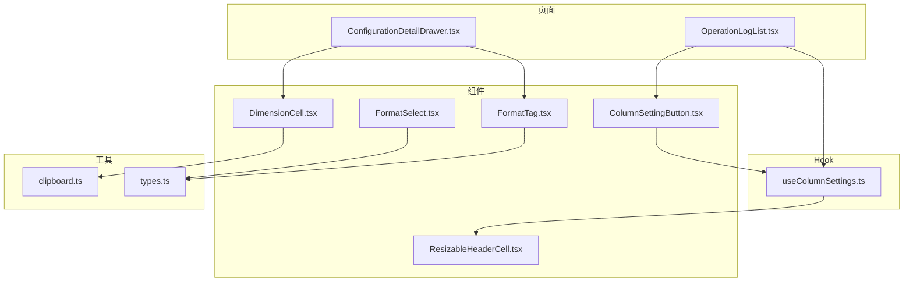
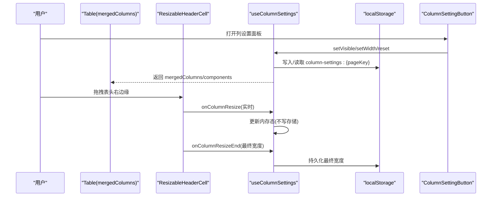
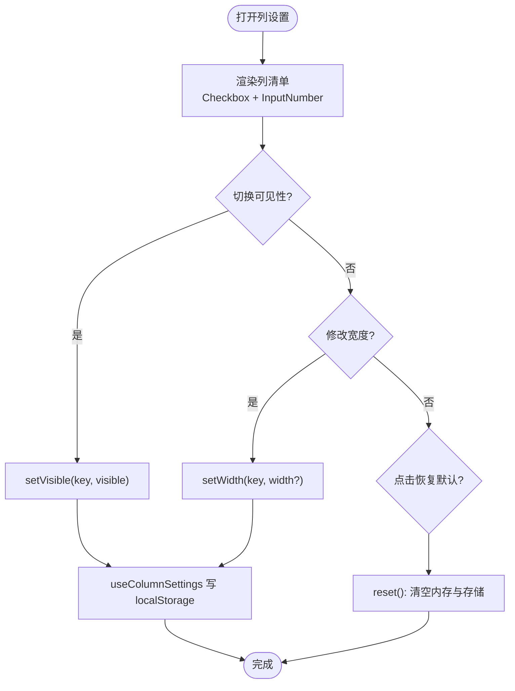
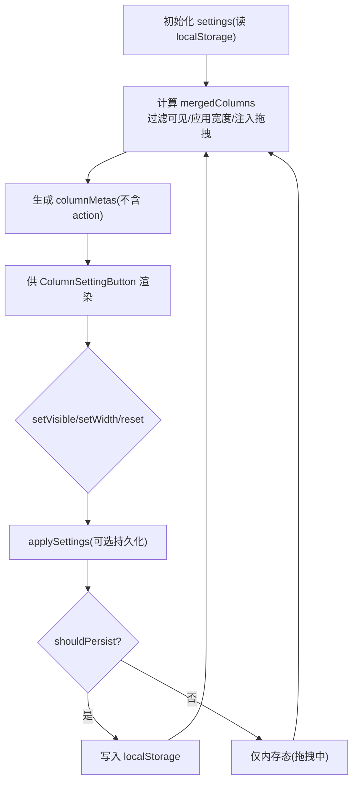
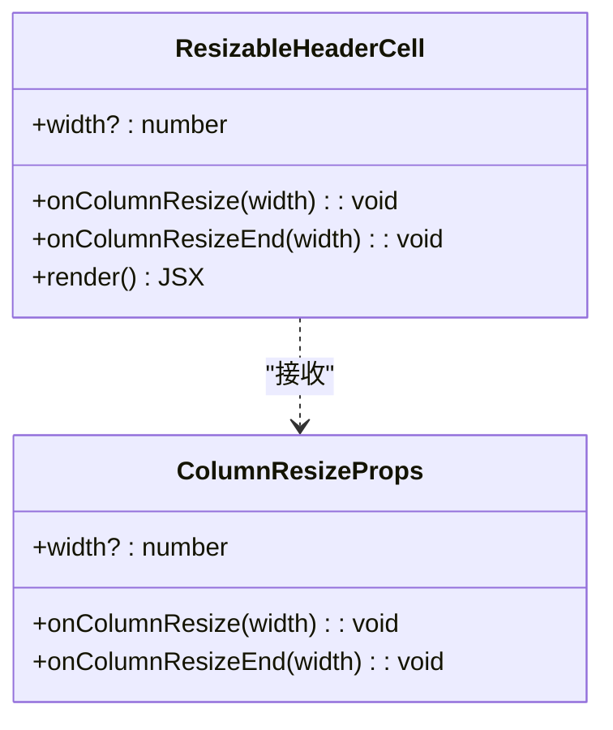
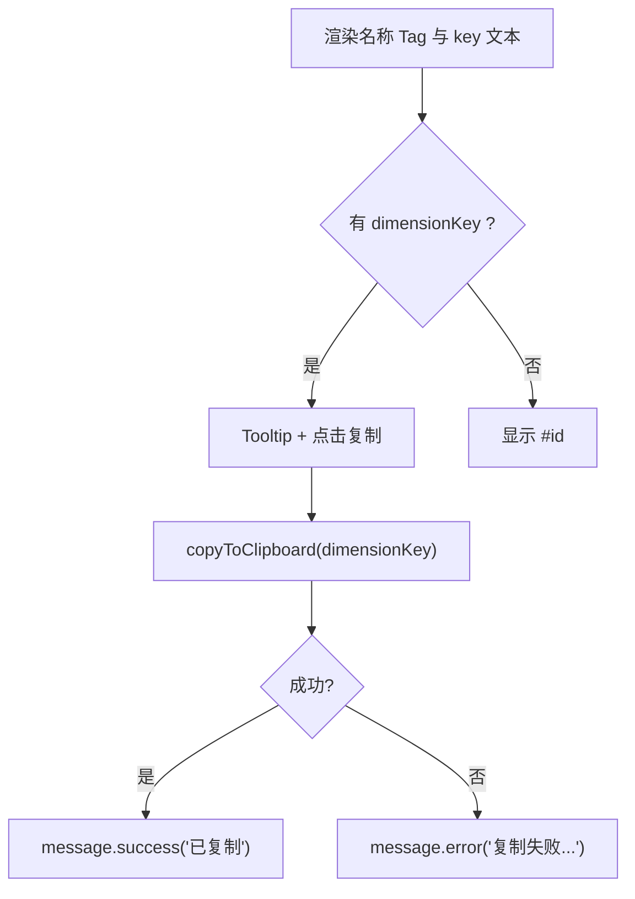
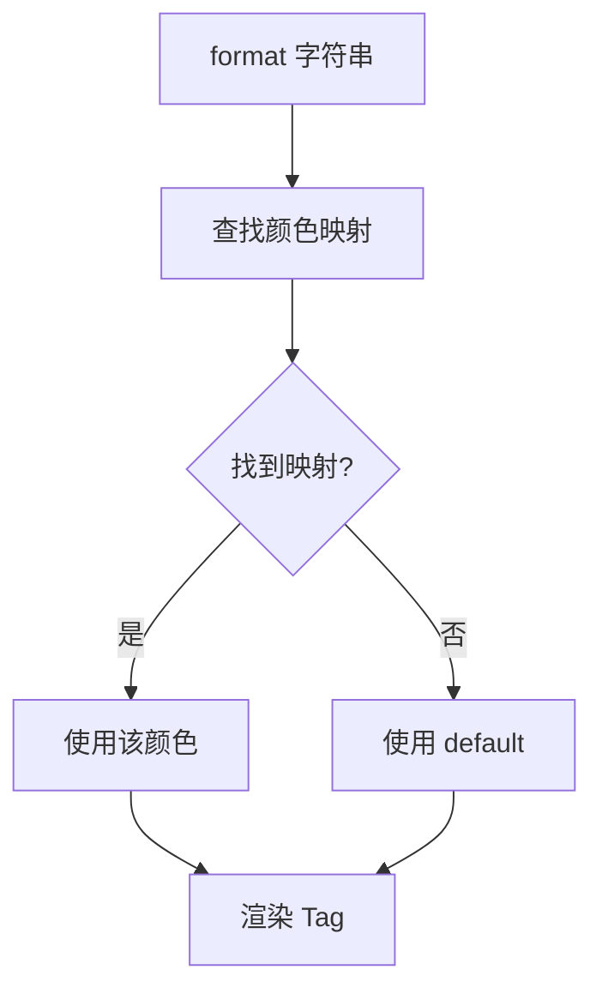
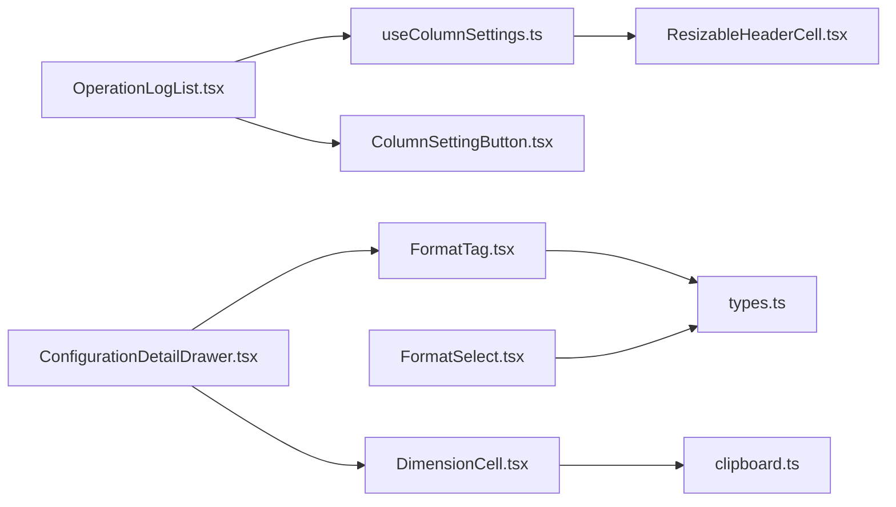

# 工具组件

<cite>
**本文引用的文件**
- [ColumnSettingButton.tsx](file://web/src/components/ColumnSettingButton.tsx)
- [useColumnSettings.ts](file://web/src/hooks/useColumnSettings.ts)
- [ResizableHeaderCell.tsx](file://web/src/components/ResizableHeaderCell.tsx)
- [DimensionCell.tsx](file://web/src/components/DimensionCell.tsx)
- [FormatTag.tsx](file://web/src/components/FormatTag.tsx)
- [FormatSelect.tsx](file://web/src/components/FormatSelect.tsx)
- [clipboard.ts](file://web/src/utils/clipboard.ts)
- [types.ts](file://web/src/api/types.ts)
- [OperationLogList.tsx](file://web/src/pages/audit/OperationLogList.tsx)
- [ConfigurationDetailDrawer.tsx](file://web/src/pages/configuration/ConfigurationDetailDrawer.tsx)
</cite>

## 目录
1. [简介](#简介)
2. [项目结构](#项目结构)
3. [核心组件](#核心组件)
4. [架构总览](#架构总览)
5. [详细组件分析](#详细组件分析)
6. [依赖关系分析](#依赖关系分析)
7. [性能与可访问性](#性能与可访问性)
8. [故障排查指南](#故障排查指南)
9. [结论](#结论)
10. [附录：API 文档与使用示例](#附录api-文档与使用示例)

## 简介
本开发文档聚焦于配置中心前端中的三类工具组件：
- ColumnSettingButton 列设置按钮：提供表格列的显示/隐藏、宽度覆盖与恢复默认能力，配合 useColumnSettings Hook 实现按页面持久化的列配置。
- DimensionCell 维度单元格：用于在列表或详情中统一展示“名称 + 业务 key”的复杂数据，支持点击复制 key。
- FormatTag 格式标签：以不同颜色标识配置内容格式（text/json/yaml/properties/xml/toml），与 FormatSelect 保持一致的选项集合。

文档同时给出 API 说明、集成方式、可访问性与国际化适配建议，以及常见问题的排查方法。

## 项目结构
这些工具组件位于 web/src 下，围绕 Ant Design 构建，并与页面级表格和详情视图组合使用。

图表来源
- [ColumnSettingButton.tsx:1-50](file://web/src/components/ColumnSettingButton.tsx#L1-L50)
- [useColumnSettings.ts:1-165](file://web/src/hooks/useColumnSettings.ts#L1-L165)
- [ResizableHeaderCell.tsx:1-123](file://web/src/components/ResizableHeaderCell.tsx#L1-L123)
- [DimensionCell.tsx:1-57](file://web/src/components/DimensionCell.tsx#L1-L57)
- [FormatTag.tsx:1-21](file://web/src/components/FormatTag.tsx#L1-L21)
- [FormatSelect.tsx:1-21](file://web/src/components/FormatSelect.tsx#L1-L21)
- [clipboard.ts:1-33](file://web/src/utils/clipboard.ts#L1-L33)
- [types.ts:19-20](file://web/src/api/types.ts#L19-L20)
- [OperationLogList.tsx:130-199](file://web/src/pages/audit/OperationLogList.tsx#L130-L199)
- [ConfigurationDetailDrawer.tsx:90-154](file://web/src/pages/configuration/ConfigurationDetailDrawer.tsx#L90-L154)

章节来源
- [ColumnSettingButton.tsx:1-50](file://web/src/components/ColumnSettingButton.tsx#L1-L50)
- [useColumnSettings.ts:1-165](file://web/src/hooks/useColumnSettings.ts#L1-L165)
- [ResizableHeaderCell.tsx:1-123](file://web/src/components/ResizableHeaderCell.tsx#L1-L123)
- [DimensionCell.tsx:1-57](file://web/src/components/DimensionCell.tsx#L1-L57)
- [FormatTag.tsx:1-21](file://web/src/components/FormatTag.tsx#L1-L21)
- [FormatSelect.tsx:1-21](file://web/src/components/FormatSelect.tsx#L1-L21)
- [clipboard.ts:1-33](file://web/src/utils/clipboard.ts#L1-L33)
- [types.ts:19-20](file://web/src/api/types.ts#L19-L20)
- [OperationLogList.tsx:130-199](file://web/src/pages/audit/OperationLogList.tsx#L130-L199)
- [ConfigurationDetailDrawer.tsx:90-154](file://web/src/pages/configuration/ConfigurationDetailDrawer.tsx#L90-L154)

## 核心组件
- ColumnSettingButton：通过 Popover 面板列出所有可配置列，支持勾选显隐、输入框覆盖宽度，并提供“恢复默认”操作。
- useColumnSettings：管理列配置的内存态与 localStorage 持久化，过滤可见列、应用宽度覆盖、注入表头拖拽调宽能力，并生成供设置面板渲染的列元信息。
- ResizableHeaderCell：为表头单元格提供右侧拖拽手柄，实时计算新宽度并在松手时落盘。
- DimensionCell：首行显示名称 Tag，次行显示带“key: ”前缀的业务 key，支持点击复制；当 key 缺失时回退显示 #id。
- FormatTag：根据 format 值映射到不同 Tag 颜色，未知格式兜底 default。
- FormatSelect：固定选项的配置格式选择器，与后端类型一致。
- clipboard：封装剪贴板复制，优先 navigator.clipboard，失败降级 execCommand。

章节来源
- [ColumnSettingButton.tsx:1-50](file://web/src/components/ColumnSettingButton.tsx#L1-L50)
- [useColumnSettings.ts:1-165](file://web/src/hooks/useColumnSettings.ts#L1-L165)
- [ResizableHeaderCell.tsx:1-123](file://web/src/components/ResizableHeaderCell.tsx#L1-L123)
- [DimensionCell.tsx:1-57](file://web/src/components/DimensionCell.tsx#L1-L57)
- [FormatTag.tsx:1-21](file://web/src/components/FormatTag.tsx#L1-L21)
- [FormatSelect.tsx:1-21](file://web/src/components/FormatSelect.tsx#L1-L21)
- [clipboard.ts:1-33](file://web/src/utils/clipboard.ts#L1-L33)

## 架构总览
下图展示了列设置从用户交互到持久化的完整流程，以及维度单元格与格式标签在页面中的使用位置。

图表来源
- [useColumnSettings.ts:50-165](file://web/src/hooks/useColumnSettings.ts#L50-L165)
- [ResizableHeaderCell.tsx:31-123](file://web/src/components/ResizableHeaderCell.tsx#L31-L123)
- [ColumnSettingButton.tsx:16-49](file://web/src/components/ColumnSettingButton.tsx#L16-L49)

## 详细组件分析

### ColumnSettingButton 列设置按钮
- 功能要点
  - 通过 Popover 展示列清单，每项包含 Checkbox 控制可见性、InputNumber 控制宽度覆盖。
  - 提供“恢复默认”按钮，清空当前页面的列配置。
  - 与 useColumnSettings 紧密耦合，直接消费其返回值。
- 关键交互
  - 切换 Checkbox 调用 setVisible(key, visible)。
  - 修改 InputNumber 调用 setWidth(key, width?)。
  - 点击“恢复默认”调用 reset()。
- 可访问性与体验
  - 使用原生控件语义（Checkbox/InputNumber/Button）。
  - 建议在外部容器增加 aria-label 描述该面板用途（由页面侧补充）。

图表来源
- [ColumnSettingButton.tsx:16-49](file://web/src/components/ColumnSettingButton.tsx#L16-L49)
- [useColumnSettings.ts:80-113](file://web/src/hooks/useColumnSettings.ts#L80-L113)

章节来源
- [ColumnSettingButton.tsx:1-50](file://web/src/components/ColumnSettingButton.tsx#L1-L50)
- [useColumnSettings.ts:80-113](file://web/src/hooks/useColumnSettings.ts#L80-L113)

### useColumnSettings 列配置 Hook
- 职责
  - 维护每列的 visible/width 设置，按 pageKey 持久化到 localStorage。
  - 过滤不可见列，应用合法宽度覆盖，强制显示 action 列。
  - 为普通列注入 onHeaderCell，启用 ResizableHeaderCell 拖拽调宽。
  - 生成 columnMetas 供设置面板渲染。
- 关键逻辑
  - 稳定列 key：优先 column.key，其次 dataIndex，最后索引兜底。
  - 宽度校验：仅接受有限数值且不小于最小宽度。
  - 拖拽优化：移动过程只更新内存态，松手再落盘，减少频繁 I/O。
- 复杂度
  - 合并列数组：O(n)，n 为列数。
  - 设置变更：每次 O(1) 更新单列设置，整体对象拷贝开销与列数线性相关。

图表来源
- [useColumnSettings.ts:23-165](file://web/src/hooks/useColumnSettings.ts#L23-L165)

章节来源
- [useColumnSettings.ts:1-165](file://web/src/hooks/useColumnSettings.ts#L1-L165)

### ResizableHeaderCell 可拖拽表头
- 功能要点
  - 在表头右侧渲染 8px 拖拽手柄，支持指针事件实时计算新宽度。
  - 未传入 onColumnResize 时退化为普通 th，便于对操作列禁用调宽。
  - 拖拽起点宽度优先级：用户覆盖 > 列定义固定宽度 > 实际渲染宽度。
- 约束
  - 最小宽度常量 MIN_COLUMN_WIDTH 与设置面板 InputNumber 的 min 保持一致。
- 可访问性与体验
  - 使用 pointer 事件保证触屏连续移动。
  - 阻止冒泡避免触发排序等表头行为。

图表来源
- [ResizableHeaderCell.tsx:7-18](file://web/src/components/ResizableHeaderCell.tsx#L7-L18)
- [ResizableHeaderCell.tsx:31-123](file://web/src/components/ResizableHeaderCell.tsx#L31-L123)

章节来源
- [ResizableHeaderCell.tsx:1-123](file://web/src/components/ResizableHeaderCell.tsx#L1-L123)

### DimensionCell 维度单元格
- 设计模式
  - 双行布局：首行名称 Tag，次行代码块样式展示“key: 业务键”，点击复制键值本身。
  - 兜底策略：无 key 时显示 “#id”。
- 交互
  - 点击复制调用 copyToClipboard，成功/失败通过 message 提示。
- 可访问性
  - Tooltip 提示“点击复制”，提升可发现性。
  - 建议在外部容器添加 aria-live 区域反馈复制结果（由页面侧补充）。

图表来源
- [DimensionCell.tsx:19-56](file://web/src/components/DimensionCell.tsx#L19-L56)
- [clipboard.ts:22-32](file://web/src/utils/clipboard.ts#L22-L32)

章节来源
- [DimensionCell.tsx:1-57](file://web/src/components/DimensionCell.tsx#L1-L57)
- [clipboard.ts:1-33](file://web/src/utils/clipboard.ts#L1-L33)

### FormatTag 格式标签
- 功能要点
  - 将 format 映射为 Tag 颜色，未知格式使用 default。
  - 与 FormatSelect 的选项保持一致，确保前后端一致性。
- 扩展点
  - 新增格式只需在映射表中添加条目即可。

图表来源
- [FormatTag.tsx:4-18](file://web/src/components/FormatTag.tsx#L4-L18)
- [FormatSelect.tsx:6-13](file://web/src/components/FormatSelect.tsx#L6-L13)
- [types.ts:19-20](file://web/src/api/types.ts#L19-L20)

章节来源
- [FormatTag.tsx:1-21](file://web/src/components/FormatTag.tsx#L1-L21)
- [FormatSelect.tsx:1-21](file://web/src/components/FormatSelect.tsx#L1-L21)
- [types.ts:19-20](file://web/src/api/types.ts#L19-L20)

## 依赖关系分析
- ColumnSettingButton 依赖 useColumnSettings 提供的状态与方法。
- useColumnSettings 依赖 ResizableHeaderCell 的拖拽能力与 MIN_COLUMN_WIDTH。
- DimensionCell 依赖 clipboard 工具进行复制。
- FormatTag/FormatSelect 依赖 types 中的 ConfigFormat 类型，保持前后端一致。
- 页面层 OperationLogList 使用 useColumnSettings 与 ColumnSettingButton 组合实现表格增强。
- ConfigurationDetailDrawer 使用 FormatTag 与 DimensionCell 展示配置详情。

图表来源
- [OperationLogList.tsx:130-199](file://web/src/pages/audit/OperationLogList.tsx#L130-L199)
- [ConfigurationDetailDrawer.tsx:90-154](file://web/src/pages/configuration/ConfigurationDetailDrawer.tsx#L90-L154)
- [useColumnSettings.ts:1-165](file://web/src/hooks/useColumnSettings.ts#L1-L165)
- [ColumnSettingButton.tsx:1-50](file://web/src/components/ColumnSettingButton.tsx#L1-L50)
- [ResizableHeaderCell.tsx:1-123](file://web/src/components/ResizableHeaderCell.tsx#L1-L123)
- [DimensionCell.tsx:1-57](file://web/src/components/DimensionCell.tsx#L1-L57)
- [FormatTag.tsx:1-21](file://web/src/components/FormatTag.tsx#L1-L21)
- [FormatSelect.tsx:1-21](file://web/src/components/FormatSelect.tsx#L1-L21)
- [clipboard.ts:1-33](file://web/src/utils/clipboard.ts#L1-L33)
- [types.ts:19-20](file://web/src/api/types.ts#L19-L20)

章节来源
- [OperationLogList.tsx:130-199](file://web/src/pages/audit/OperationLogList.tsx#L130-L199)
- [ConfigurationDetailDrawer.tsx:90-154](file://web/src/pages/configuration/ConfigurationDetailDrawer.tsx#L90-L154)
- [useColumnSettings.ts:1-165](file://web/src/hooks/useColumnSettings.ts#L1-L165)
- [ColumnSettingButton.tsx:1-50](file://web/src/components/ColumnSettingButton.tsx#L1-L50)
- [ResizableHeaderCell.tsx:1-123](file://web/src/components/ResizableHeaderCell.tsx#L1-L123)
- [DimensionCell.tsx:1-57](file://web/src/components/DimensionCell.tsx#L1-L57)
- [FormatTag.tsx:1-21](file://web/src/components/FormatTag.tsx#L1-L21)
- [FormatSelect.tsx:1-21](file://web/src/components/FormatSelect.tsx#L1-L21)
- [clipboard.ts:1-33](file://web/src/utils/clipboard.ts#L1-L33)
- [types.ts:19-20](file://web/src/api/types.ts#L19-L20)

## 性能与可访问性
- 性能
  - 拖拽过程中仅更新内存态，松手才落盘，降低 localStorage 写入频率。
  - 宽度校验防止非法值导致重排或异常渲染。
  - 列合并与元信息生成使用 useMemo，避免重复计算。
- 可访问性
  - 使用语义化控件（Checkbox、InputNumber、Button）与 Tooltip。
  - 建议在外部容器为列设置面板添加 aria-label，为复制操作添加 aria-live 区域反馈。
  - 键盘可达性：Ant Design 控件默认支持 Tab 导航，无需额外处理。
- 国际化适配
  - 文案目前为中文硬编码（如“列配置”“恢复默认”“已复制”等）。
  - 建议抽取 i18n 键值，替换硬编码文案，以便多语言切换。
  - 对于数字单位、日期时间等，可使用现有格式化函数或 i18n 库进行本地化。

[本节为通用指导，不直接分析具体文件]

## 故障排查指南
- 列设置不生效
  - 检查是否传入了正确的 pageKey，确保每个页面独立存储。
  - 确认列定义包含稳定的 key 或 dataIndex，否则无法匹配设置。
  - 若 action 列被隐藏，请确认未误将其纳入可配置清单（action 列强制显示）。
- 拖拽无效
  - 确认 Table 使用了 components={{ header: { cell: ResizableHeaderCell } }}。
  - 确认列未设置固定 width 导致无法调整，或宽度小于最小宽度。
- 复制失败
  - 在非安全上下文（非 HTTPS）可能受限，工具已自动降级到 execCommand。
  - 浏览器权限限制或剪贴板接口不可用时，会返回失败，需提示用户手动复制。
- 格式标签颜色不对
  - 确认 format 值属于支持的枚举，未知格式将显示 default 色。
  - 如需新增格式，请在 FormatTag 与 FormatSelect 中同步添加。

章节来源
- [useColumnSettings.ts:115-143](file://web/src/hooks/useColumnSettings.ts#L115-L143)
- [ResizableHeaderCell.tsx:4-18](file://web/src/components/ResizableHeaderCell.tsx#L4-L18)
- [clipboard.ts:22-32](file://web/src/utils/clipboard.ts#L22-L32)
- [FormatTag.tsx:4-18](file://web/src/components/FormatTag.tsx#L4-L18)
- [FormatSelect.tsx:6-13](file://web/src/components/FormatSelect.tsx#L6-L13)

## 结论
本套工具组件围绕表格增强、复杂数据展示与格式标识三大场景，提供了开箱即用的能力：
- 列设置按钮与 Hook 组合，实现了列显隐、宽度覆盖与持久化，结合可拖拽表头提升表格易用性。
- 维度单元格统一了“名称 + 业务 key”的展示与复制交互，简化页面实现。
- 格式标签与选择器保证了前后端格式的一致性，便于扩展与维护。
建议在后续迭代中完善国际化与可访问性细节，进一步提升用户体验。

[本节为总结，不直接分析具体文件]

## 附录：API 文档与使用示例

### ColumnSettingButton
- 作用：提供列设置 Popover，控制列显隐与宽度覆盖，支持恢复默认。
- Props
  - columnMetas: 列元信息数组（key/title/visible/width?）
  - setVisible: (key: string, visible: boolean) => void
  - setWidth: (key: string, width?: number) => void
  - reset: () => void
- 使用示例（片段路径）
  - [OperationLogList.tsx:137-167](file://web/src/pages/audit/OperationLogList.tsx#L137-L167)

章节来源
- [ColumnSettingButton.tsx:5-10](file://web/src/components/ColumnSettingButton.tsx#L5-L10)
- [OperationLogList.tsx:137-167](file://web/src/pages/audit/OperationLogList.tsx#L137-L167)

### useColumnSettings
- 作用：管理列配置（可见性/宽度），持久化到 localStorage，合并列与注入拖拽。
- 参数
  - pageKey: string（用于区分不同页面的存储键）
  - columns: ColumnsType<T>（原始列定义）
- 返回值
  - mergedColumns: 过滤与增强后的列
  - components: 包含 ResizableHeaderCell 的组件映射
  - settings: 当前设置快照
  - columnMetas: 供设置面板渲染的列元信息
  - setVisible/setWidth/reset: 操作方法
- 使用示例（片段路径）
  - [OperationLogList.tsx:137-140](file://web/src/pages/audit/OperationLogList.tsx#L137-L140)

章节来源
- [useColumnSettings.ts:50-165](file://web/src/hooks/useColumnSettings.ts#L50-L165)
- [OperationLogList.tsx:137-140](file://web/src/pages/audit/OperationLogList.tsx#L137-L140)

### ResizableHeaderCell
- 作用：为表头单元格提供拖拽调宽能力。
- 属性
  - width?: number（拖拽起点宽度）
  - onColumnResize(width: number): void（拖拽中回调）
  - onColumnResizeEnd(width: number): void（松手回调）
- 使用示例（片段路径）
  - [useColumnSettings.ts:136-142](file://web/src/hooks/useColumnSettings.ts#L136-L142)

章节来源
- [ResizableHeaderCell.tsx:7-18](file://web/src/components/ResizableHeaderCell.tsx#L7-L18)
- [useColumnSettings.ts:136-142](file://web/src/hooks/useColumnSettings.ts#L136-L142)

### DimensionCell
- 作用：展示维度名称与业务 key，支持复制 key。
- Props
  - name: string | null | undefined
  - dimensionKey: string | null | undefined
  - id: number
  - color: string
- 使用示例（片段路径）
  - [ConfigurationDetailDrawer.tsx:25-27](file://web/src/pages/configuration/ConfigurationDetailDrawer.tsx#L25-L27)

章节来源
- [DimensionCell.tsx:4-13](file://web/src/components/DimensionCell.tsx#L4-L13)
- [ConfigurationDetailDrawer.tsx:25-27](file://web/src/pages/configuration/ConfigurationDetailDrawer.tsx#L25-L27)

### FormatTag / FormatSelect
- 作用：以颜色标识配置格式；提供固定选项的选择器。
- Props
  - FormatTag: format: string
  - FormatSelect: 透传 SelectProps，options 固定为支持的格式
- 使用示例（片段路径）
  - [ConfigurationDetailDrawer.tsx:96-96](file://web/src/pages/configuration/ConfigurationDetailDrawer.tsx#L96-L96)
  - [FormatSelect.tsx:18-19](file://web/src/components/FormatSelect.tsx#L18-L19)

章节来源
- [FormatTag.tsx:14-18](file://web/src/components/FormatTag.tsx#L14-L18)
- [FormatSelect.tsx:15-19](file://web/src/components/FormatSelect.tsx#L15-L19)
- [ConfigurationDetailDrawer.tsx:96-96](file://web/src/pages/configuration/ConfigurationDetailDrawer.tsx#L96-L96)