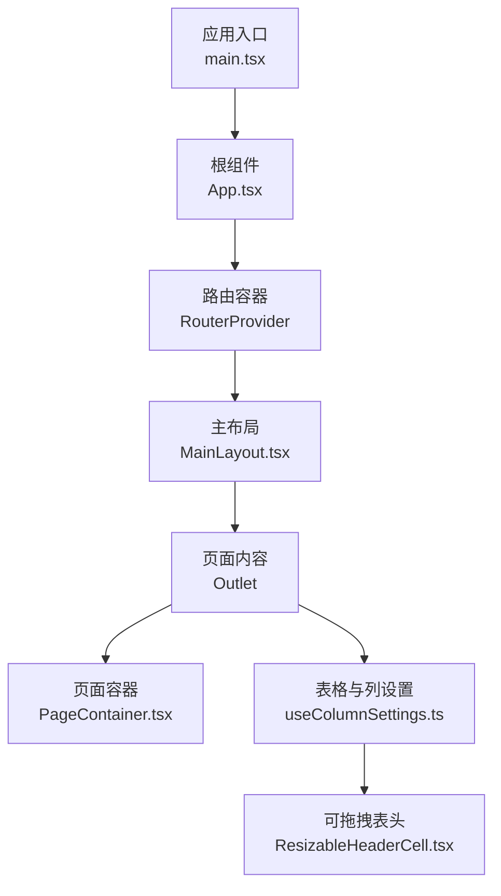
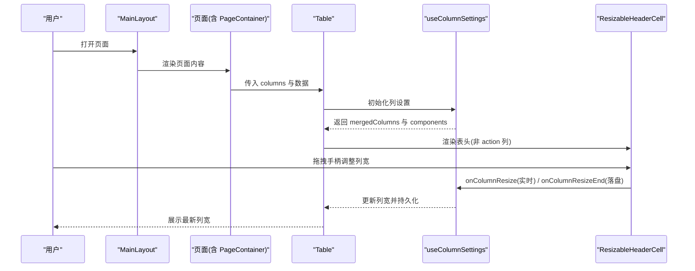
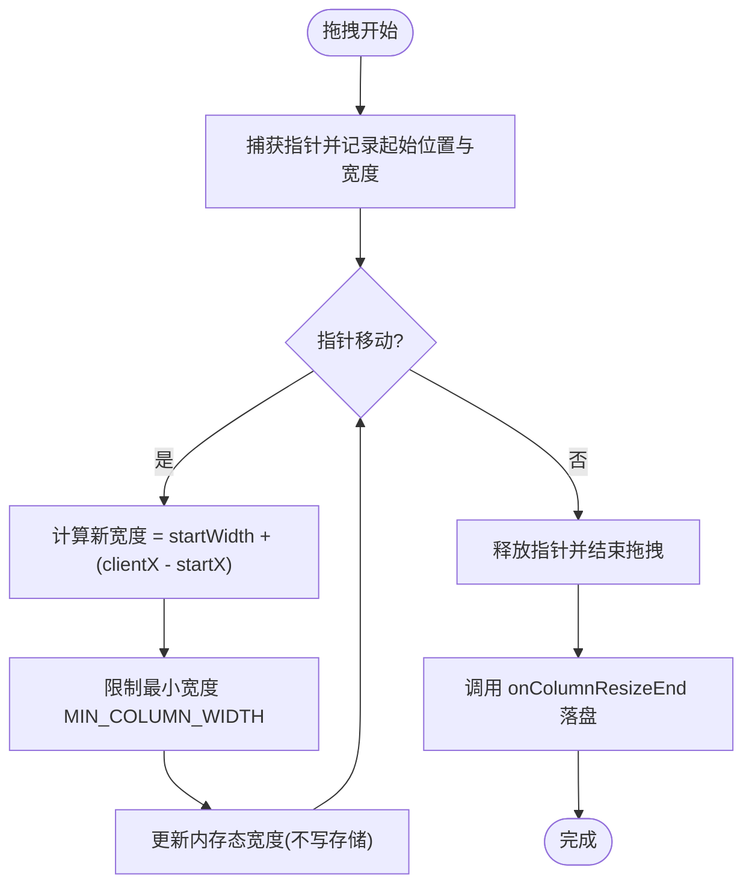
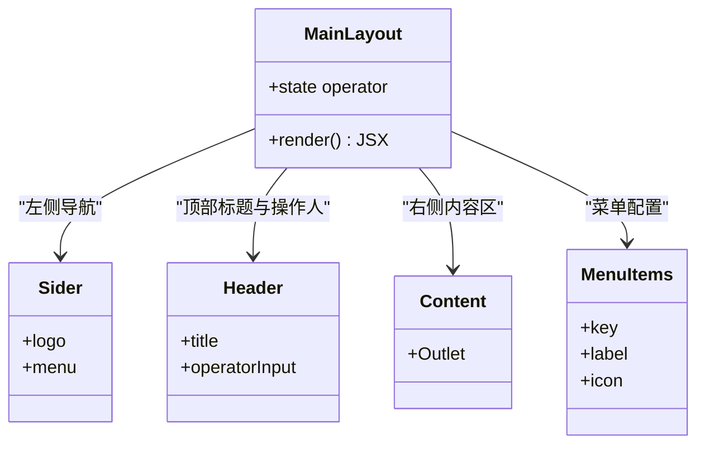
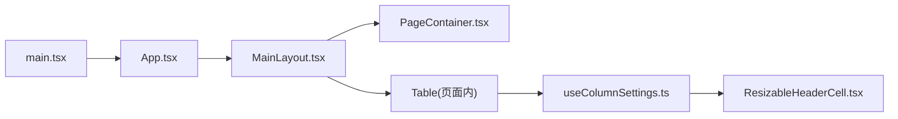

# 布局组件

<cite>
**本文引用的文件**
- [PageContainer.tsx](file://web/src/components/PageContainer.tsx)
- [ResizableHeaderCell.tsx](file://web/src/components/ResizableHeaderCell.tsx)
- [MainLayout.tsx](file://web/src/layouts/MainLayout.tsx)
- [useColumnSettings.ts](file://web/src/hooks/useColumnSettings.ts)
- [main.tsx](file://web/src/main.tsx)
- [App.tsx](file://web/src/App.tsx)
</cite>

## 目录
1. [简介](#简介)
2. [项目结构](#项目结构)
3. [核心组件](#核心组件)
4. [架构总览](#架构总览)
5. [详细组件分析](#详细组件分析)
6. [依赖关系分析](#依赖关系分析)
7. [性能与优化](#性能与优化)
8. [移动端适配与屏幕尺寸变化](#移动端适配与屏幕尺寸变化)
9. [扩展方法与主题定制](#扩展方法与主题定制)
10. [故障排查](#故障排查)
11. [结论](#结论)

## 简介
本指南聚焦于配置中心前端中的布局相关组件，系统性说明：
- PageContainer 页面容器组件的设计模式：统一的标题区、内容卡片、可选 banner 形态。
- ResizableHeaderCell 可调整表头单元格组件的实现原理：拖拽交互、尺寸计算、性能优化。
- MainLayout 主布局的整体架构：侧边栏、导航栏、内容区域的布局策略。
- 如何扩展这些组件并定制主题，以及移动端适配与屏幕尺寸变化的处理策略。

## 项目结构
本项目采用 React + Ant Design 的前端工程，布局与通用能力集中在以下位置：
- layouts：应用级布局（MainLayout）
- components：通用 UI 组件（PageContainer、ResizableHeaderCell 等）
- hooks：复用逻辑（useColumnSettings 用于表格列设置与拖拽调宽）
- 入口与主题：main.tsx 中通过 ConfigProvider 注入全局主题与国际化

图表来源
- [main.tsx:1-35](file://web/src/main.tsx#L1-L35)
- [App.tsx:1-8](file://web/src/App.tsx#L1-L8)
- [MainLayout.tsx:1-104](file://web/src/layouts/MainLayout.tsx#L1-L104)
- [PageContainer.tsx:1-96](file://web/src/components/PageContainer.tsx#L1-L96)
- [useColumnSettings.ts:1-165](file://web/src/hooks/useColumnSettings.ts#L1-L165)
- [ResizableHeaderCell.tsx:1-123](file://web/src/components/ResizableHeaderCell.tsx#L1-L123)

章节来源
- [main.tsx:1-35](file://web/src/main.tsx#L1-L35)
- [App.tsx:1-8](file://web/src/App.tsx#L1-L8)
- [MainLayout.tsx:1-104](file://web/src/layouts/MainLayout.tsx#L1-L104)

## 核心组件
- PageContainer：统一页面标题区与白底卡片内容区，支持可选 banner 形态（圆形图标+渐变背景），零业务逻辑，专注布局。
- ResizableHeaderCell：为表格列提供可拖拽调整宽度的表头单元格，包含拖拽手柄、指针事件、最小宽度限制与性能优化。
- MainLayout：应用主布局，包含左侧导航 Sider、顶部 Header（页面标题与操作人输入框）、右侧 Content 区域。
- useColumnSettings：表格列的显隐与宽度持久化 Hook，串联 ResizableHeaderCell 的拖拽回调与落盘逻辑。

章节来源
- [PageContainer.tsx:1-96](file://web/src/components/PageContainer.tsx#L1-L96)
- [ResizableHeaderCell.tsx:1-123](file://web/src/components/ResizableHeaderCell.tsx#L1-L123)
- [MainLayout.tsx:1-104](file://web/src/layouts/MainLayout.tsx#L1-L104)
- [useColumnSettings.ts:1-165](file://web/src/hooks/useColumnSettings.ts#L1-L165)

## 架构总览
整体布局由 MainLayout 作为骨架，页面内部使用 PageContainer 组织标题与内容；表格场景通过 useColumnSettings 将列配置与 ResizableHeaderCell 结合，实现可拖拽调宽与持久化。

图表来源
- [MainLayout.tsx:1-104](file://web/src/layouts/MainLayout.tsx#L1-L104)
- [PageContainer.tsx:1-96](file://web/src/components/PageContainer.tsx#L1-L96)
- [useColumnSettings.ts:1-165](file://web/src/hooks/useColumnSettings.ts#L1-L165)
- [ResizableHeaderCell.tsx:1-123](file://web/src/components/ResizableHeaderCell.tsx#L1-L123)

## 详细组件分析

### PageContainer 页面容器
- 设计目标：统一页面标题区与内容卡片，减少重复布局代码，保证视觉一致性。
- 两种形态：
  - 普通形态：标题 + 可选描述 + 右侧 extra 操作区 + 无边框 Card 内容区。
  - Banner 形态：当传入 icon 时，标题区升级为带圆形图标与渐变背景的 banner，适合强调页面主题色。
- 主题与样式：
  - 默认主色 #2f54eb，可通过 accentColor 覆盖。
  - 渐变起点根据 accentColor 生成半透明浅色，保持柔和过渡。
  - 内容区使用 Card 承载白底，配合全局画布底色形成层次。
- 响应式建议：
  - 标题区使用 flex 布局，自动换行与对齐，在小屏下仍可良好显示。
  - 若需更严格的断点控制，可在外层包裹响应式容器或媒体查询。

章节来源
- [PageContainer.tsx:1-96](file://web/src/components/PageContainer.tsx#L1-L96)

### ResizableHeaderCell 可调整表头单元格
- 交互模型：
  - 在表头右侧渲染 8px 拖拽手柄，hover 或拖拽中高亮。
  - 使用 Pointer Events 捕获指针，避免文本选中与事件丢失。
  - 拖拽过程中实时计算新宽度，不低于 MIN_COLUMN_WIDTH（60）。
- 尺寸计算：
  - 起始宽度优先使用传入 width，否则回退到 th 实际渲染宽度，再兜底至 MIN_COLUMN_WIDTH。
  - 移动距离基于 clientX 差值计算，取整后与下限比较得到最终宽度。
- 性能优化：
  - 拖拽过程中仅更新内存态（onColumnResize），松手后再持久化（onColumnResizeEnd），减少 localStorage 写入与重渲染。
  - 宽度未变化时跳过状态更新，降低无效渲染。
  - 使用 setPointerCapture/releasePointerCapture 确保事件稳定。
- 与表格集成：
  - 通过 Table 的 components={{ header: { cell: ResizableHeaderCell } }} 替换表头单元格。
  - 由 useColumnSettings 注入 onHeaderCell，传递当前宽度与回调。

图表来源
- [ResizableHeaderCell.tsx:1-123](file://web/src/components/ResizableHeaderCell.tsx#L1-L123)
- [useColumnSettings.ts:1-165](file://web/src/hooks/useColumnSettings.ts#L1-L165)

章节来源
- [ResizableHeaderCell.tsx:1-123](file://web/src/components/ResizableHeaderCell.tsx#L1-L123)
- [useColumnSettings.ts:1-165](file://web/src/hooks/useColumnSettings.ts#L1-L165)

### MainLayout 主布局
- 布局结构：
  - 左侧 Sider：品牌 Logo 区 + 菜单导航，固定宽度 200，亮色主题，右侧分隔线。
  - 顶部 Header：左侧显示当前页面标题（按路由匹配菜单项），右侧操作人输入框（用于审计日志身份标识）。
  - 右侧 Content：灰底画布（colorBgLayout），内边距 24，承载页面内容。
- 导航高亮：
  - 通过 location.pathname 前缀匹配一级菜单 key，深层路由归并到高亮项。
- 可扩展性：
  - 菜单项集中定义，便于新增页面与权限控制。
  - 顶栏操作人输入框可接入更多全局筛选或用户信息。

图表来源
- [MainLayout.tsx:1-104](file://web/src/layouts/MainLayout.tsx#L1-L104)

章节来源
- [MainLayout.tsx:1-104](file://web/src/layouts/MainLayout.tsx#L1-L104)

### useColumnSettings 列设置 Hook
- 功能：
  - 管理列的可见性与宽度覆盖，按 pageKey 持久化到 localStorage。
  - 过滤不可见列，合并宽度覆盖，并为非 action 列注入 onHeaderCell。
  - 提供重置能力与列元信息集合，供设置面板渲染。
- 持久化策略：
  - 拖拽过程只更新内存态，松手后整体落盘，避免高频写入。
  - 读取失败或存储不可用时降级为内存态。
- 与 ResizableHeaderCell 协作：
  - 通过 onHeaderCell 注入 width、onColumnResize、onColumnResizeEnd。
  - 保证拖拽起点宽度正确，且结果受 MIN_COLUMN_WIDTH 约束。

章节来源
- [useColumnSettings.ts:1-165](file://web/src/hooks/useColumnSettings.ts#L1-L165)

## 依赖关系分析
- 入口层：main.tsx 通过 ConfigProvider 注入全局主题与中文本地化，App.tsx 仅承载路由容器。
- 布局层：MainLayout 组合 Sider/Header/Content，并通过 react-router-dom 的 Outlet 渲染页面。
- 组件层：PageContainer 提供统一页面容器；ResizableHeaderCell 提供可拖拽表头。
- 逻辑层：useColumnSettings 连接表格列配置与 ResizableHeaderCell，负责持久化与状态管理。

图表来源
- [main.tsx:1-35](file://web/src/main.tsx#L1-L35)
- [App.tsx:1-8](file://web/src/App.tsx#L1-L8)
- [MainLayout.tsx:1-104](file://web/src/layouts/MainLayout.tsx#L1-L104)
- [PageContainer.tsx:1-96](file://web/src/components/PageContainer.tsx#L1-L96)
- [useColumnSettings.ts:1-165](file://web/src/hooks/useColumnSettings.ts#L1-L165)
- [ResizableHeaderCell.tsx:1-123](file://web/src/components/ResizableHeaderCell.tsx#L1-L123)

章节来源
- [main.tsx:1-35](file://web/src/main.tsx#L1-L35)
- [App.tsx:1-8](file://web/src/App.tsx#L1-L8)
- [MainLayout.tsx:1-104](file://web/src/layouts/MainLayout.tsx#L1-L104)
- [PageContainer.tsx:1-96](file://web/src/components/PageContainer.tsx#L1-L96)
- [useColumnSettings.ts:1-165](file://web/src/hooks/useColumnSettings.ts#L1-L165)
- [ResizableHeaderCell.tsx:1-123](file://web/src/components/ResizableHeaderCell.tsx#L1-L123)

## 性能与优化
- 拖拽性能：
  - 使用 Pointer Events 与 setPointerCapture 提升交互稳定性。
  - 拖拽过程中仅更新内存态，减少 DOM 重排与 localStorage 写入。
  - 宽度未变化时跳过状态更新，降低渲染开销。
- 列表与表格：
  - 通过 useColumnSettings 的 useMemo 缓存列合并结果，避免重复计算。
  - 对非法宽度进行校验，防止异常数据导致布局错乱。
- 主题与渲染：
  - 全局主题在入口集中配置，减少重复样式与不一致风险。
  - 使用 Card 承载页面内容，配合画布底色形成清晰层次，减少复杂嵌套。

[本节为通用性能建议，无需特定文件引用]

## 移动端适配与屏幕尺寸变化
- 当前实现现状：
  - MainLayout 使用固定宽度 Sider（200px），未内置响应式折叠逻辑。
  - PageContainer 使用 flex 布局，在小屏下具备基本自适应能力。
  - ResizableHeaderCell 针对触屏禁用滚动手势（touchAction: none），保证拖拽连续。
- 推荐适配策略：
  - 在 MainLayout 中引入媒体查询或窗口尺寸监听，小屏时隐藏或折叠 Sider，并提供抽屉式导航。
  - 在 PageContainer 外层增加响应式容器，控制标题区与 extra 区域的排列方式（如纵向堆叠）。
  - 表格在窄屏时可启用横向滚动或列折叠，结合 useColumnSettings 允许用户自定义可见列。
- 屏幕尺寸变化处理：
  - 使用 window.matchMedia 或第三方 Hook 监听断点变化，动态切换布局模式。
  - 在断点切换时清理拖拽状态，避免跨断点残留交互。

[本节为概念性指导，不直接分析具体文件]

## 扩展方法与主题定制
- 扩展 PageContainer：
  - 新增 props 以支持更多 banner 变体（如多图标、进度条、标签）。
  - 通过 CSS-in-JS 或主题 token 控制间距、圆角与阴影。
- 扩展 ResizableHeaderCell：
  - 支持双向拖拽（左/右边缘），或与其他列联动调整。
  - 增加拖拽动画与视觉反馈（如虚线边框、遮罩）。
  - 暴露配置项以关闭最小宽度限制或调整手柄尺寸。
- 扩展 MainLayout：
  - 增加面包屑、搜索框、通知中心、用户头像下拉等常见头部元素。
  - 支持主题切换（亮/暗）与布局模式切换（侧边栏展开/收起）。
- 主题定制：
  - 在 main.tsx 的 ConfigProvider theme 中调整 colorPrimary、borderRadius、colorBgLayout 等 token。
  - 通过 components 子配置覆盖 Layout、Table 等组件的局部样式（如 siderBg、headerBg、headerBg）。
  - 遵循“不设置 colorBgContainer”的约定，避免污染输入框与卡片底色。

章节来源
- [main.tsx:1-35](file://web/src/main.tsx#L1-L35)
- [MainLayout.tsx:1-104](file://web/src/layouts/MainLayout.tsx#L1-L104)
- [PageContainer.tsx:1-96](file://web/src/components/PageContainer.tsx#L1-L96)
- [ResizableHeaderCell.tsx:1-123](file://web/src/components/ResizableHeaderCell.tsx#L1-L123)

## 故障排查
- 拖拽失效或事件丢失：
  - 检查是否正确使用 setPointerCapture/releasePointerCapture。
  - 确认 onPointerDown/onPointerMove/onPointerUp 均绑定到手柄元素。
- 列宽异常或无法持久化：
  - 检查 localStorage 是否可用，必要时降级为内存态。
  - 验证宽度合法性（有限数值且 >= MIN_COLUMN_WIDTH）。
- 布局错位或溢出：
  - 确认 Content 的 overflow 与 padding 设置合理。
  - 检查 Sider 宽度与内容区是否冲突，必要时在小屏下折叠。
- 主题不一致：
  - 确认入口 ConfigProvider 已正确注入 theme。
  - 避免在组件内覆盖全局 token，优先使用主题系统。

章节来源
- [ResizableHeaderCell.tsx:1-123](file://web/src/components/ResizableHeaderCell.tsx#L1-L123)
- [useColumnSettings.ts:1-165](file://web/src/hooks/useColumnSettings.ts#L1-L165)
- [MainLayout.tsx:1-104](file://web/src/layouts/MainLayout.tsx#L1-L104)
- [main.tsx:1-35](file://web/src/main.tsx#L1-L35)

## 结论
- PageContainer 提供了统一的页面容器模式，简化了标题与内容的组织，支持 banner 形态与主题色定制。
- ResizableHeaderCell 实现了高性能的可拖拽表头，结合 useColumnSettings 完成列配置的持久化与状态管理。
- MainLayout 构建了清晰的三栏布局，便于扩展导航与头部功能。
- 建议在后续迭代中增强移动端适配与断点响应，进一步提升多设备体验。
- 主题定制应集中在入口层，遵循现有约定以保持视觉一致性与可维护性。

[本节为总结性内容，无需特定文件引用]