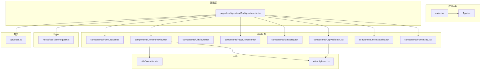
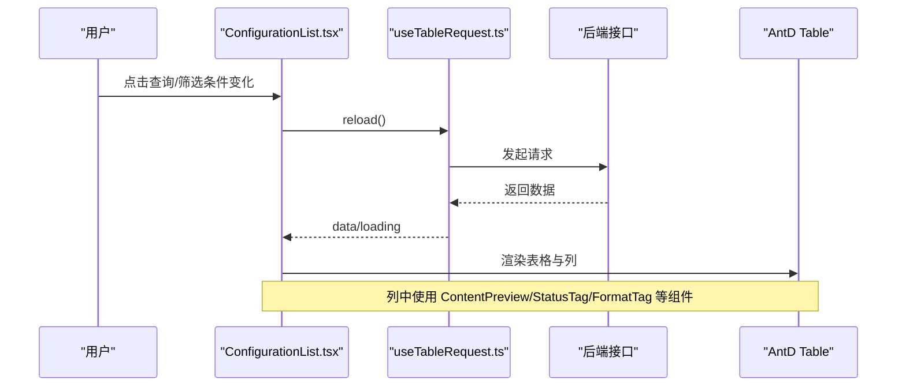
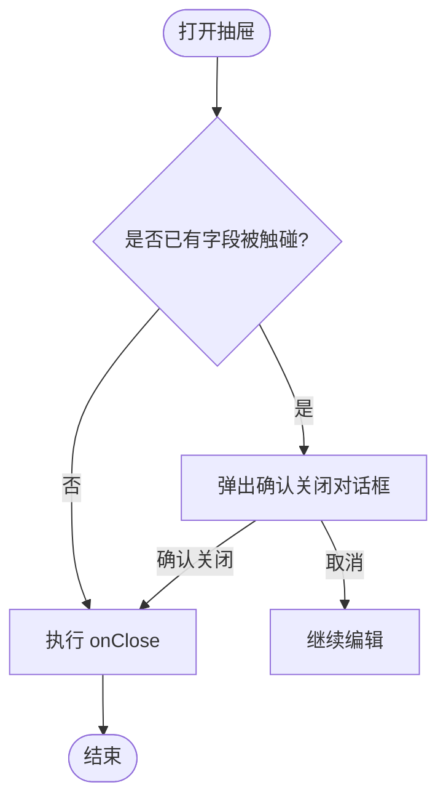
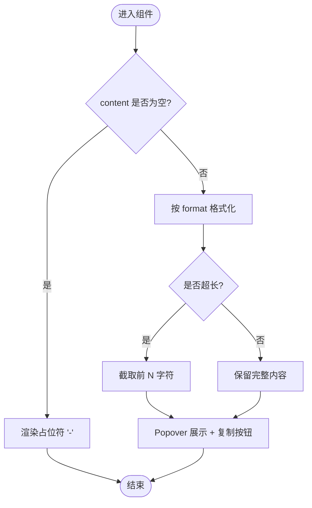
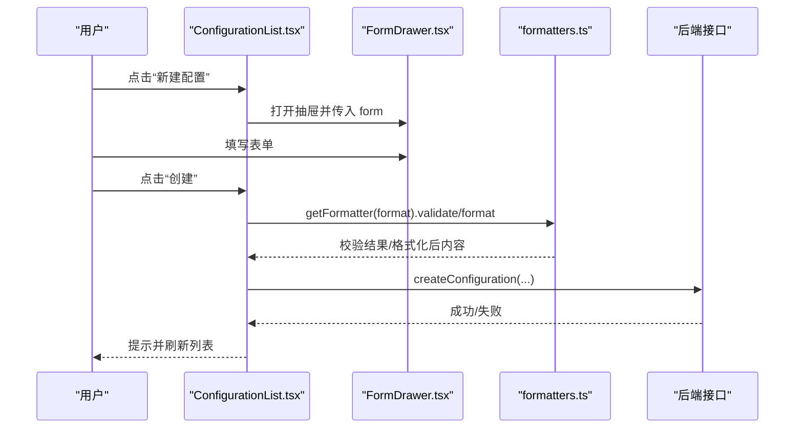
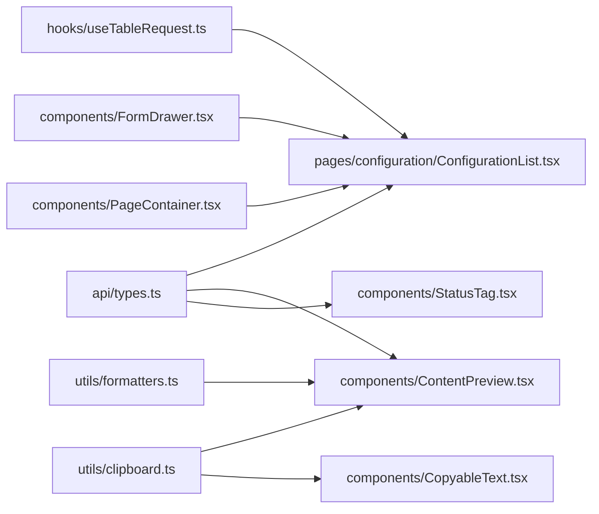

# 组件开发

<cite>
**本文引用的文件**
- [FormDrawer.tsx](file://web/src/components/FormDrawer.tsx)
- [ContentPreview.tsx](file://web/src/components/ContentPreview.tsx)
- [DiffViewer.tsx](file://web/src/components/DiffViewer.tsx)
- [PageContainer.tsx](file://web/src/components/PageContainer.tsx)
- [StatusTag.tsx](file://web/src/components/StatusTag.tsx)
- [CopyableText.tsx](file://web/src/components/CopyableText.tsx)
- [FormatSelect.tsx](file://web/src/components/FormatSelect.tsx)
- [FormatTag.tsx](file://web/src/components/FormatTag.tsx)
- [ConfigurationList.tsx](file://web/src/pages/configuration/ConfigurationList.tsx)
- [useTableRequest.ts](file://web/src/hooks/useTableRequest.ts)
- [formatters.ts](file://web/src/utils/formatters.ts)
- [clipboard.ts](file://web/src/utils/clipboard.ts)
- [types.ts](file://web/src/api/types.ts)
- [App.tsx](file://web/src/App.tsx)
- [main.tsx](file://web/src/main.tsx)
</cite>

## 目录
1. [简介](#简介)
2. [项目结构](#项目结构)
3. [核心组件](#核心组件)
4. [架构总览](#架构总览)
5. [详细组件分析](#详细组件分析)
6. [依赖关系分析](#依赖关系分析)
7. [性能考虑](#性能考虑)
8. [故障排查指南](#故障排查指南)
9. [结论](#结论)
10. [附录](#附录)

## 简介
本指南面向配置中心前端 React 项目的组件开发，聚焦函数式组件、Hooks 使用与 Props 定义规范；系统讲解通用组件（表单抽屉、内容预览、差异对比等）的实现原理与使用方法；阐述页面组件的架构设计（数据获取、状态管理、事件处理）；提供组件复用策略与组合模式示例；并给出测试与性能优化建议。

## 项目结构
前端采用功能分层组织：
- components：通用 UI 组件（无业务逻辑或弱业务逻辑）
- hooks：可复用的状态与副作用封装
- pages：页面级组件，编排数据流与交互
- utils：工具函数（格式化、剪贴板等）
- api：类型定义与接口调用（类型集中在 types.ts）
- layouts/router：布局与路由（入口在 main.tsx 与 App.tsx）

图表来源
- [main.tsx:1-35](file://web/src/main.tsx#L1-L35)
- [App.tsx:1-8](file://web/src/App.tsx#L1-L8)
- [ConfigurationList.tsx:1-666](file://web/src/pages/configuration/ConfigurationList.tsx#L1-L666)
- [FormDrawer.tsx:1-71](file://web/src/components/FormDrawer.tsx#L1-L71)
- [ContentPreview.tsx:1-64](file://web/src/components/ContentPreview.tsx#L1-L64)
- [DiffViewer.tsx:1-29](file://web/src/components/DiffViewer.tsx#L1-L29)
- [PageContainer.tsx:1-96](file://web/src/components/PageContainer.tsx#L1-L96)
- [StatusTag.tsx:1-39](file://web/src/components/StatusTag.tsx#L1-L39)
- [CopyableText.tsx:1-40](file://web/src/components/CopyableText.tsx#L1-L40)
- [FormatSelect.tsx:1-21](file://web/src/components/FormatSelect.tsx#L1-L21)
- [FormatTag.tsx:1-21](file://web/src/components/FormatTag.tsx#L1-L21)
- [useTableRequest.ts:1-38](file://web/src/hooks/useTableRequest.ts#L1-L38)
- [formatters.ts:1-184](file://web/src/utils/formatters.ts#L1-L184)
- [clipboard.ts:1-33](file://web/src/utils/clipboard.ts#L1-L33)
- [types.ts:1-247](file://web/src/api/types.ts#L1-L247)

章节来源
- [main.tsx:1-35](file://web/src/main.tsx#L1-L35)
- [App.tsx:1-8](file://web/src/App.tsx#L1-L8)

## 核心组件
- FormDrawer 表单抽屉：右侧滑出容器，统一 footer（取消 + 主按钮），内置“未保存修改二次确认关闭”和 destroyOnClose 保证每次打开为全新表单实例。适用于新建/编辑场景。
- ContentPreview 内容预览：列表单元格内单行省略展示，hover 弹出 Popover 显示按格式美化后的完整内容；超长截断避免渲染卡顿；支持一键复制。
- DiffViewer 差异对比：基于 react-diff-viewer-continued 的行级差异视图，用于版本历史与“编辑态 vs 已发布”对比。
- PageContainer 页面容器：统一标题区（可选 banner 风格）+ 白底卡片内容区，承载页面骨架。
- StatusTag / FormatTag：状态与格式的可视化标签，颜色映射集中管理。
- CopyableText：可复制文本，省略 + Tooltip 全文 + 尾随复制按钮。
- FormatSelect：固定选项的配置格式选择器。

章节来源
- [FormDrawer.tsx:1-71](file://web/src/components/FormDrawer.tsx#L1-L71)
- [ContentPreview.tsx:1-64](file://web/src/components/ContentPreview.tsx#L1-L64)
- [DiffViewer.tsx:1-29](file://web/src/components/DiffViewer.tsx#L1-L29)
- [PageContainer.tsx:1-96](file://web/src/components/PageContainer.tsx#L1-L96)
- [StatusTag.tsx:1-39](file://web/src/components/StatusTag.tsx#L1-L39)
- [CopyableText.tsx:1-40](file://web/src/components/CopyableText.tsx#L1-L40)
- [FormatSelect.tsx:1-21](file://web/src/components/FormatSelect.tsx#L1-L21)
- [FormatTag.tsx:1-21](file://web/src/components/FormatTag.tsx#L1-L21)

## 架构总览
页面组件通过 Hook 拉取数据，结合通用组件拼装界面；工具模块提供格式化与剪贴板能力；类型定义确保前后端契约一致。

图表来源
- [ConfigurationList.tsx:177-188](file://web/src/pages/configuration/ConfigurationList.tsx#L177-L188)
- [useTableRequest.ts:7-37](file://web/src/hooks/useTableRequest.ts#L7-L37)

章节来源
- [ConfigurationList.tsx:177-188](file://web/src/pages/configuration/ConfigurationList.tsx#L177-L188)
- [useTableRequest.ts:7-37](file://web/src/hooks/useTableRequest.ts#L7-L37)

## 详细组件分析

### FormDrawer 表单抽屉
- 职责：封装 Drawer + Footer，统一关闭行为与提交流程。
- 关键特性：
  - 防误触：当表单有字段被触碰过，关闭时弹出确认；否则直接关闭。
  - destroyOnClose：每次打开重建表单实例，避免状态污染。
  - 宽度、文案可配置，loading 透传至主按钮。
- 使用要点：
  - 父组件维护 open/close 状态与 loading。
  - 传入 AntD FormInstance，由父组件负责校验与提交。

图表来源
- [FormDrawer.tsx:23-47](file://web/src/components/FormDrawer.tsx#L23-L47)

章节来源
- [FormDrawer.tsx:1-71](file://web/src/components/FormDrawer.tsx#L1-L71)

### ContentPreview 内容预览
- 职责：列表单元格内短文本展示，hover 弹出 Popover 展示格式化后的完整内容，支持复制。
- 关键点：
  - 通过 formatters 注册表按 format 进行格式化与校验。
  - 超长内容截断，避免 Popover 渲染卡顿。
  - 空内容展示占位符。
- 使用要点：
  - 传入 content 与 format；format 来自类型定义，确保与后端一致。

图表来源
- [ContentPreview.tsx:13-63](file://web/src/components/ContentPreview.tsx#L13-L63)
- [formatters.ts:170-183](file://web/src/utils/formatters.ts#L170-L183)

章节来源
- [ContentPreview.tsx:1-64](file://web/src/components/ContentPreview.tsx#L1-L64)
- [formatters.ts:1-184](file://web/src/utils/formatters.ts#L1-L184)

### DiffViewer 差异对比
- 职责：行级差异对比，用于版本历史与编辑态对比。
- 关键点：
  - 双栏/单栏模式切换。
  - 左右标题可自定义（如版本号）。
- 使用要点：
  - oldText/newText 为空串表示空值；splitView 默认双栏。

章节来源
- [DiffViewer.tsx:1-29](file://web/src/components/DiffViewer.tsx#L1-L29)

### PageContainer 页面容器
- 职责：统一页面头部（标题、描述、操作区）与内容卡片。
- 关键点：
  - 可选 banner 风格（带圆形图标与渐变背景）。
  - 纯布局组件，零业务逻辑。
- 使用要点：
  - 通过 icon/accentColor 控制样式；extra 放置操作按钮。

章节来源
- [PageContainer.tsx:1-96](file://web/src/components/PageContainer.tsx#L1-L96)

### StatusTag / FormatTag
- StatusTag：将后端状态映射为带圆点的 Tag，未知状态兜底原样展示。
- FormatTag：将格式映射为不同颜色的 Tag，未知格式兜底 default。

章节来源
- [StatusTag.tsx:1-39](file://web/src/components/StatusTag.tsx#L1-L39)
- [FormatTag.tsx:1-21](file://web/src/components/FormatTag.tsx#L1-L21)

### CopyableText
- 职责：可复制文本，省略 + Tooltip 全文 + 尾随复制按钮。
- 关键点：
  - 使用 clipboard 工具复制，失败提示由调用方决定。
- 使用要点：
  - code 开关以等宽字体展示；maxWidth 限制宽度。

章节来源
- [CopyableText.tsx:1-40](file://web/src/components/CopyableText.tsx#L1-L40)
- [clipboard.ts:1-33](file://web/src/utils/clipboard.ts#L1-L33)

### FormatSelect
- 职责：固定选项的配置格式选择器，与后端取值一致。
- 使用要点：透传 Select 其余属性（value/onChange 等）。

章节来源
- [FormatSelect.tsx:1-21](file://web/src/components/FormatSelect.tsx#L1-L21)

### 页面组件：ConfigurationList
- 职责：配置项列表页，包含三级级联筛选（命名空间→环境→配置组）、状态与关键字筛选、新建/发布/下线/删除等操作。
- 数据获取：
  - 使用 useTableRequest 封装 loading/data/reload，避免竞态覆盖。
  - 下拉数据源使用 requestIdRef 序列号，防止旧响应覆盖新响应。
- 状态管理：
  - 草稿筛选条件与已生效条件分离，点“查询”才触发刷新。
  - 发布弹窗与新建抽屉分别管理各自 FormInstance 与 loading。
- 事件处理：
  - 发布/下线/删除均含二次确认与错误拦截（错误由 http 拦截器统一提示）。
  - 新建表单支持“校验并格式化”，基于 formatters 注册表。

图表来源
- [ConfigurationList.tsx:252-296](file://web/src/pages/configuration/ConfigurationList.tsx#L252-L296)
- [FormDrawer.tsx:23-69](file://web/src/components/FormDrawer.tsx#L23-L69)
- [formatters.ts:170-183](file://web/src/utils/formatters.ts#L170-L183)

章节来源
- [ConfigurationList.tsx:82-666](file://web/src/pages/configuration/ConfigurationList.tsx#L82-L666)

## 依赖关系分析
- 页面依赖 Hook 与通用组件，通用组件依赖工具与类型。
- 类型集中在 types.ts，确保前后端字段一致（如 ConfigFormat、ConfigStatus）。
- 工具模块解耦：formatters 提供多格式校验/格式化；clipboard 提供跨浏览器复制。

图表来源
- [types.ts:1-247](file://web/src/api/types.ts#L1-L247)
- [ConfigurationList.tsx:1-666](file://web/src/pages/configuration/ConfigurationList.tsx#L1-L666)
- [ContentPreview.tsx:1-64](file://web/src/components/ContentPreview.tsx#L1-L64)
- [StatusTag.tsx:1-39](file://web/src/components/StatusTag.tsx#L1-L39)
- [formatters.ts:1-184](file://web/src/utils/formatters.ts#L1-L184)
- [clipboard.ts:1-33](file://web/src/utils/clipboard.ts#L1-L33)
- [useTableRequest.ts:1-38](file://web/src/hooks/useTableRequest.ts#L1-L38)
- [FormDrawer.tsx:1-71](file://web/src/components/FormDrawer.tsx#L1-L71)
- [PageContainer.tsx:1-96](file://web/src/components/PageContainer.tsx#L1-L96)

章节来源
- [types.ts:1-247](file://web/src/api/types.ts#L1-L247)
- [ConfigurationList.tsx:1-666](file://web/src/pages/configuration/ConfigurationList.tsx#L1-L666)

## 性能考虑
- 列表渲染：
  - 使用虚拟滚动或分页（当前已启用分页）减少首屏压力。
  - 列渲染尽量轻量，复杂渲染下沉到子组件（如 ContentPreview）。
- 长文本预览：
  - 超长内容截断，避免 Popover 渲染卡顿。
- 网络请求：
  - useTableRequest 使用 requestIdRef 避免旧请求覆盖新数据。
  - 下拉数据源使用 requestIdRef 防止展开刷新与自动加载竞态。
- 格式化：
  - 格式化失败回退原文，避免阻塞 UI。
- 主题与样式：
  - 全局主题在 main.tsx 中集中配置，减少重复样式计算。

[本节为通用指导，不直接分析具体文件]

## 故障排查指南
- 复制失败：
  - 检查是否在安全上下文（HTTPS/localhost）；非安全上下文会降级到 execCommand。
  - 若仍失败，提示用户手动复制。
- 格式化失败：
  - 查看对应格式的 validate 返回的错误信息；JSON/YAML/XML 会返回解析错误详情。
- 列表数据错乱：
  - 检查 useTableRequest 的 fetcher 引用是否稳定；确认 requestIdRef 是否正确递增。
- 抽屉关闭丢失数据：
  - 确认 Form.isFieldsTouched 判断是否生效；必要时增加 isDirty 检测。

章节来源
- [clipboard.ts:1-33](file://web/src/utils/clipboard.ts#L1-L33)
- [formatters.ts:17-183](file://web/src/utils/formatters.ts#L17-L183)
- [useTableRequest.ts:7-37](file://web/src/hooks/useTableRequest.ts#L7-L37)
- [FormDrawer.tsx:34-47](file://web/src/components/FormDrawer.tsx#L34-L47)

## 结论
本项目采用函数式组件 + Hooks 的清晰分层：页面组件编排数据与交互，通用组件专注展示与基础交互，工具模块提供跨领域能力（格式化、剪贴板）。通过类型约束与统一的 Hook/组件抽象，实现了高内聚、低耦合的可维护架构。建议在后续迭代中继续遵循：
- 组件职责单一、Props 最小化且类型明确
- 列表与复杂交互使用 Hook 抽象
- 工具方法独立、可测试
- 保持错误提示与用户体验一致性

[本节为总结性内容，不直接分析具体文件]

## 附录
- 最佳实践清单
  - 函数组件优先，使用 TypeScript 定义 Props 与返回值
  - 使用 useMemo/useCallback 稳定引用，避免不必要重渲染
  - 表单统一使用 AntD FormInstance，校验与提交流程清晰
  - 列表数据通过 Hook 统一管理，避免分散的 useEffect
  - 错误提示统一由拦截器或 message 处理，组件内不重复实现
- 测试建议
  - 单元测试：formatters 的各格式 validate/format 用例
  - 组件测试：FormDrawer 的关闭确认、ContentPreview 的截断与复制、StatusTag/FormatTag 的颜色映射
  - 集成测试：ConfigurationList 的查询、新建、发布流程

[本节为通用指导，不直接分析具体文件]