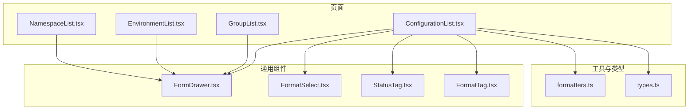
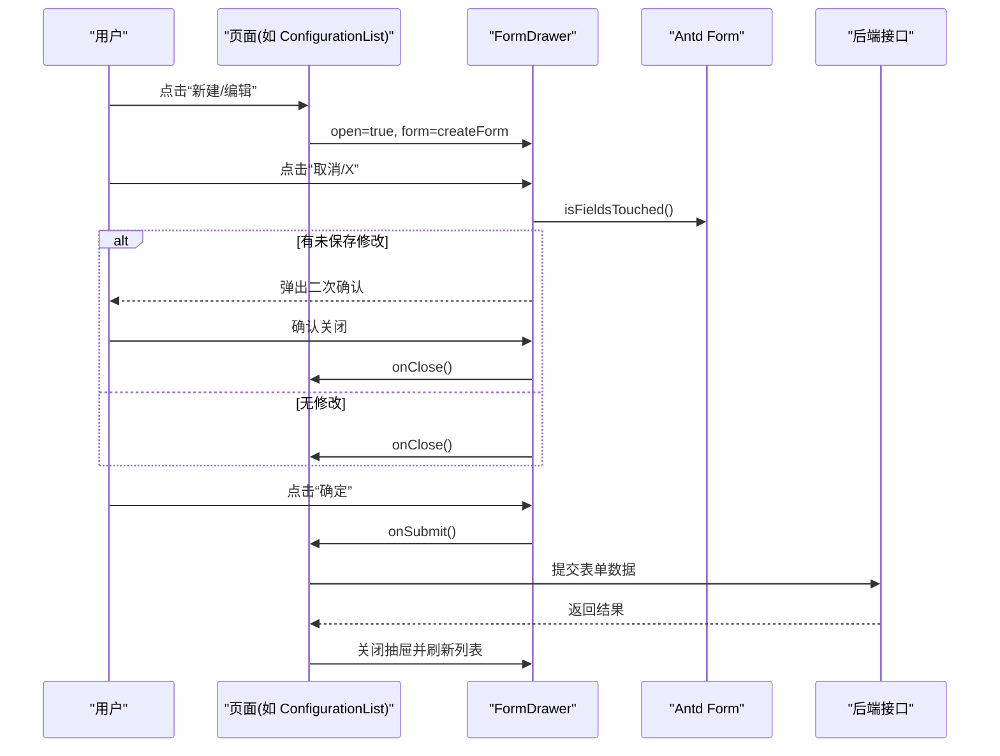
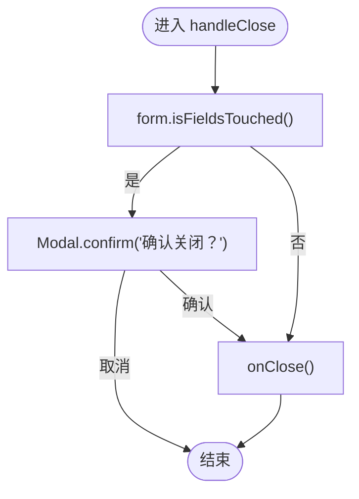
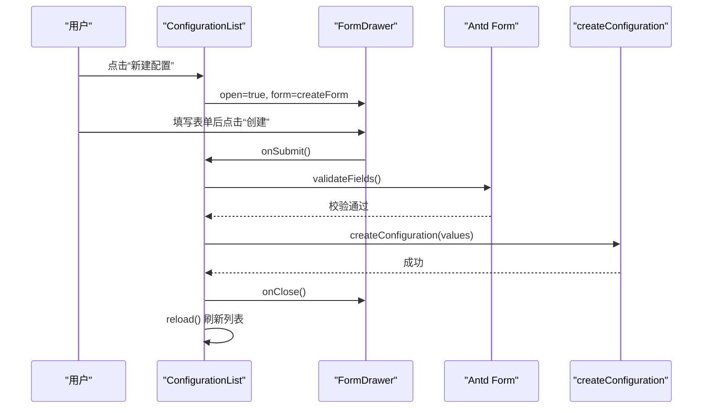
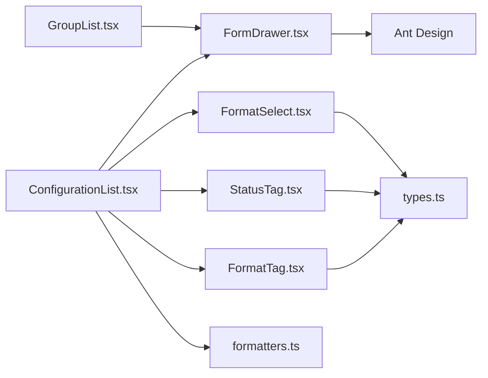

# 表单组件

<cite>
**本文引用的文件**
- [FormDrawer.tsx](file://web/src/components/FormDrawer.tsx)
- [FormatSelect.tsx](file://web/src/components/FormatSelect.tsx)
- [StatusTag.tsx](file://web/src/components/StatusTag.tsx)
- [FormatTag.tsx](file://web/src/components/FormatTag.tsx)
- [ConfigurationList.tsx](file://web/src/pages/configuration/ConfigurationList.tsx)
- [GroupList.tsx](file://web/src/pages/group/GroupList.tsx)
- [EnvironmentList.tsx](file://web/src/pages/environment/EnvironmentList.tsx)
- [NamespaceList.tsx](file://web/src/pages/namespace/NamespaceList.tsx)
- [formatters.ts](file://web/src/utils/formatters.ts)
- [types.ts](file://web/src/api/types.ts)
</cite>

## 目录
1. [简介](#简介)
2. [项目结构](#项目结构)
3. [核心组件](#核心组件)
4. [架构总览](#架构总览)
5. [详细组件分析](#详细组件分析)
6. [依赖关系分析](#依赖关系分析)
7. [性能与体验优化](#性能与体验优化)
8. [故障排查指南](#故障排查指南)
9. [结论](#结论)
10. [附录](#附录)

## 简介
本指南聚焦于配置中心前端中的“表单相关组件”，重点说明通用表单抽屉 FormDrawer 的设计模式与实现原理，包括 Props 接口、事件处理机制、防误触关闭逻辑；并总结表单状态管理、数据验证、提交处理的最佳实践。同时解释与 FormatSelect 格式选择器、StatusTag 状态标签等组件的协作方式，提供复用策略与扩展方法，以及性能优化与用户体验改进建议。

## 项目结构
本项目采用按功能域组织的前端结构：
- components：通用 UI 组件（如 FormDrawer、FormatSelect、StatusTag、FormatTag）
- pages：页面级业务组件（如 ConfigurationList、GroupList、EnvironmentList、NamespaceList），广泛使用 FormDrawer 承载新建/编辑表单
- utils：工具函数（如 formatters 提供多格式校验与格式化能力）
- api：类型定义与 API 调用封装

图表来源
- [ConfigurationList.tsx:44-56](file://web/src/pages/configuration/ConfigurationList.tsx#L44-L56)
- [GroupList.tsx:22-26](file://web/src/pages/group/GroupList.tsx#L22-L26)
- [FormDrawer.tsx:1-2](file://web/src/components/FormDrawer.tsx#L1-L2)
- [FormatSelect.tsx:1-4](file://web/src/components/FormatSelect.tsx#L1-L4)
- [StatusTag.tsx:1-3](file://web/src/components/StatusTag.tsx#L1-L3)
- [FormatTag.tsx:1-3](file://web/src/components/FormatTag.tsx#L1-L3)
- [formatters.ts:1-15](file://web/src/utils/formatters.ts#L1-L15)
- [types.ts:19-23](file://web/src/api/types.ts#L19-L23)

章节来源
- [ConfigurationList.tsx:44-56](file://web/src/pages/configuration/ConfigurationList.tsx#L44-L56)
- [GroupList.tsx:22-26](file://web/src/pages/group/GroupList.tsx#L22-L26)

## 核心组件
- FormDrawer：右侧滑出式通用表单容器，内置“取消/确定”固定底部栏、防误触关闭、destroyOnClose 重置表单实例。
- FormatSelect：固定选项的配置格式选择器，与后端 format 字段取值一致。
- StatusTag：将后端状态映射为带圆点的彩色标签，未知状态兜底展示。
- FormatTag：将格式映射为不同颜色的 Tag，用于列表或详情中展示。

章节来源
- [FormDrawer.tsx:5-15](file://web/src/components/FormDrawer.tsx#L5-L15)
- [FormatSelect.tsx:5-19](file://web/src/components/FormatSelect.tsx#L5-L19)
- [StatusTag.tsx:4-38](file://web/src/components/StatusTag.tsx#L4-L38)
- [FormatTag.tsx:3-19](file://web/src/components/FormatTag.tsx#L3-L19)

## 架构总览
FormDrawer 作为“容器型”组件，不关心具体表单内容，仅负责：
- 控制 Drawer 打开/关闭
- 统一 footer 按钮行为（取消、确定）
- 基于 Ant Design Form 的 isFieldsTouched 进行脏检测，触发二次确认防止误关
- 通过 destroyOnClose 保证每次打开都是全新表单实例，避免状态污染

页面侧（如 ConfigurationList、GroupList）负责：
- 维护表单状态与校验规则
- 调用 API 完成创建/更新
- 在成功时关闭抽屉并刷新列表

图表来源
- [FormDrawer.tsx:23-69](file://web/src/components/FormDrawer.tsx#L23-L69)
- [ConfigurationList.tsx:600-651](file://web/src/pages/configuration/ConfigurationList.tsx#L600-L651)
- [GroupList.tsx:321-384](file://web/src/pages/group/GroupList.tsx#L321-L384)

## 详细组件分析

### FormDrawer 通用表单抽屉
- 设计目标
  - 统一的右侧抽屉表单外壳，减少重复代码
  - 内置防误触关闭：当表单存在已触碰字段时，关闭前弹出确认框
  - 固定 footer：取消 + 主按钮（支持 loading 态）
  - destroyOnClose：确保每次打开都重建表单实例，避免历史状态残留
- Props 接口要点
  - title/open/onClose/onSubmit/loading/form/width/okText/children
  - 通过 form 注入 Ant Design Form 实例，利用其 isFieldsTouched 做脏检测
- 事件处理机制
  - 关闭路径：X/取消 → 判断是否已触碰字段 → 是则 Modal.confirm → 否直接 onClose
  - 提交路径：onSubmit 由页面传入，可返回 Promise，loading 由页面控制
- 错误处理
  - 关闭确认失败（取消确认）则保持抽屉打开
  - 提交异常由页面层统一捕获并提示（http 拦截器负责全局错误提示）

图表来源
- [FormDrawer.tsx:34-47](file://web/src/components/FormDrawer.tsx#L34-L47)

章节来源
- [FormDrawer.tsx:5-15](file://web/src/components/FormDrawer.tsx#L5-L15)
- [FormDrawer.tsx:23-69](file://web/src/components/FormDrawer.tsx#L23-L69)

### 与其他表单组件的协作
- FormatSelect
  - 固定 options 与后端 ConfigFormat 一致，便于在表单中切换内容格式
  - 与 formatters 配合，可在提交前或编辑器中进行格式校验与美化
- StatusTag / FormatTag
  - 用于列表/详情中展示状态与格式，增强可读性
  - 与 types.ts 中的枚举保持一致，保证前后端一致性

章节来源
- [FormatSelect.tsx:5-19](file://web/src/components/FormatSelect.tsx#L5-L19)
- [StatusTag.tsx:4-38](file://web/src/components/StatusTag.tsx#L4-L38)
- [FormatTag.tsx:3-19](file://web/src/components/FormatTag.tsx#L3-L19)
- [types.ts:19-23](file://web/src/api/types.ts#L19-L23)

### 表单状态管理与数据验证最佳实践
- 状态管理
  - 使用 Ant Design Form.useForm 管理表单实例，结合 useWatch 监听字段变化（如格式）
  - 通过 destroyOnClose 保证抽屉每次打开为全新实例，避免跨次打开的状态污染
- 数据验证
  - 基础必填校验由 Form.Item rules 完成
  - 复杂格式校验委托给 formatters（json/yaml/xml/properties/toml），统一入口 getFormatter(format)
  - 提交前再次校验，避免脏数据进入后端
- 提交处理
  - 页面层负责 try/catch，成功时关闭抽屉并刷新列表
  - 错误提示由 http 拦截器统一处理，避免分散的错误提示逻辑

章节来源
- [ConfigurationList.tsx:114-120](file://web/src/pages/configuration/ConfigurationList.tsx#L114-L120)
- [ConfigurationList.tsx:252-296](file://web/src/pages/configuration/ConfigurationList.tsx#L252-L296)
- [formatters.ts:8-15](file://web/src/utils/formatters.ts#L8-L15)
- [formatters.ts:170-183](file://web/src/utils/formatters.ts#L170-L183)

### 提交流程时序（以新建配置为例）

图表来源
- [ConfigurationList.tsx:600-651](file://web/src/pages/configuration/ConfigurationList.tsx#L600-L651)
- [ConfigurationList.tsx:252-279](file://web/src/pages/configuration/ConfigurationList.tsx#L252-L279)

## 依赖关系分析
- FormDrawer 依赖 Ant Design 的 Drawer/Modal/Button/SafeSpace 与 FormInstance
- 页面组件依赖 FormDrawer 与各自业务 API
- 格式相关组件依赖 types.ts 中的枚举，确保前后端一致
- 校验与格式化依赖 formatters.ts 提供的注册表

图表来源
- [FormDrawer.tsx:1-3](file://web/src/components/FormDrawer.tsx#L1-L3)
- [ConfigurationList.tsx:44-56](file://web/src/pages/configuration/ConfigurationList.tsx#L44-L56)
- [FormatSelect.tsx:1-4](file://web/src/components/FormatSelect.tsx#L1-L4)
- [StatusTag.tsx:1-3](file://web/src/components/StatusTag.tsx#L1-L3)
- [FormatTag.tsx:1-3](file://web/src/components/FormatTag.tsx#L1-L3)
- [formatters.ts:1-15](file://web/src/utils/formatters.ts#L1-L15)
- [types.ts:19-23](file://web/src/api/types.ts#L19-L23)

章节来源
- [ConfigurationList.tsx:44-56](file://web/src/pages/configuration/ConfigurationList.tsx#L44-L56)
- [GroupList.tsx:22-26](file://web/src/pages/group/GroupList.tsx#L22-L26)

## 性能与体验优化
- 表单实例隔离
  - 使用 destroyOnClose 确保每次打开重建表单，避免状态污染与不必要的重渲染
- 防误触关闭
  - 基于 isFieldsTouched 的二次确认，降低误操作风险，提升用户体验
- 格式校验与格式化
  - 通过 formatters 注册表集中管理各格式的校验与美化，避免重复逻辑
  - 仅在 canFormat 的格式下暴露“格式化”入口，减少无效操作
- 列表与下拉数据源
  - 使用 requestIdRef 或类似机制避免竞态导致的旧响应覆盖新响应（见列表页下拉展开刷新）
- 交互反馈
  - 提交 loading 态、成功/失败消息提示、发布弹窗二次确认等，提升可感知性

[本节为通用指导，不直接分析具体文件]

## 故障排查指南
- 抽屉无法关闭
  - 检查是否存在未保存修改导致二次确认被触发；确认 Modal.confirm 回调是否正确执行 onClose
- 提交后未刷新
  - 确认页面层在成功后调用了 reload 或重新获取数据的方法
- 格式校验失败
  - 检查当前选择的 format 是否在 formatters 注册表中；必要时扩展 getFormatter 支持新格式
- 状态/格式显示异常
  - 核对 types.ts 中的枚举是否与后端一致；检查 StatusTag/FormatTag 的映射表

章节来源
- [FormDrawer.tsx:34-47](file://web/src/components/FormDrawer.tsx#L34-L47)
- [formatters.ts:170-183](file://web/src/utils/formatters.ts#L170-L183)
- [StatusTag.tsx:4-38](file://web/src/components/StatusTag.tsx#L4-L38)
- [FormatTag.tsx:3-19](file://web/src/components/FormatTag.tsx#L3-L19)

## 结论
FormDrawer 通过统一的容器化设计与内置防误触关闭，显著降低了表单抽屉的重复开发成本，提升了交互一致性与安全性。配合 FormatSelect、StatusTag、FormatTag 与 formatters 工具，形成了从输入到展示的完整闭环。建议在新增表单场景优先复用 FormDrawer，并通过页面层专注业务逻辑与数据流，以获得更好的可维护性与扩展性。

## 附录
- 复用策略
  - 新建/编辑共用一个 FormDrawer，通过 editing 状态区分标题与按钮文案
  - 表单字段与校验规则集中在页面层，FormDrawer 只负责容器与交互
- 自定义扩展
  - 扩展 formatters 以支持新格式（增加 validate/format 实现与注册表项）
  - 扩展 StatusTag/FormatTag 的映射表以适配新的状态或格式
- 参考用法
  - 配置项列表：新建配置抽屉
  - 配置组列表：新建/编辑配置组抽屉
  - 环境/命名空间列表：同样使用 FormDrawer 承载表单

章节来源
- [ConfigurationList.tsx:600-651](file://web/src/pages/configuration/ConfigurationList.tsx#L600-L651)
- [GroupList.tsx:321-384](file://web/src/pages/group/GroupList.tsx#L321-L384)
- [EnvironmentList.tsx:281-330](file://web/src/pages/environment/EnvironmentList.tsx#L281-L330)
- [NamespaceList.tsx:209-237](file://web/src/pages/namespace/NamespaceList.tsx#L209-L237)