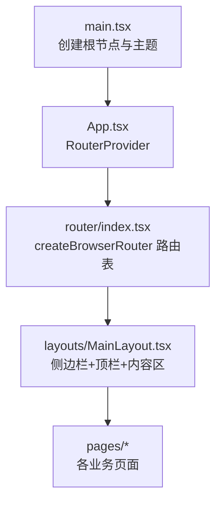
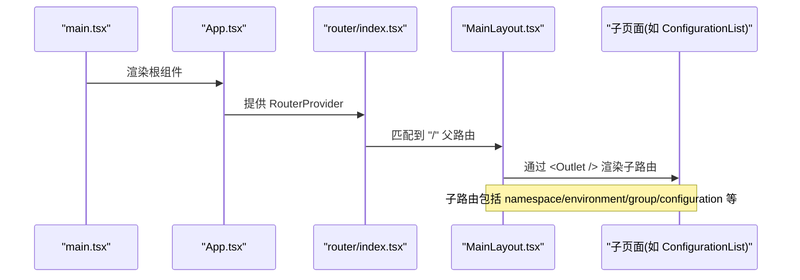
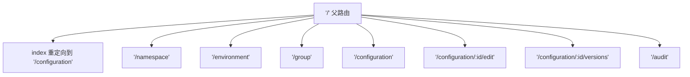
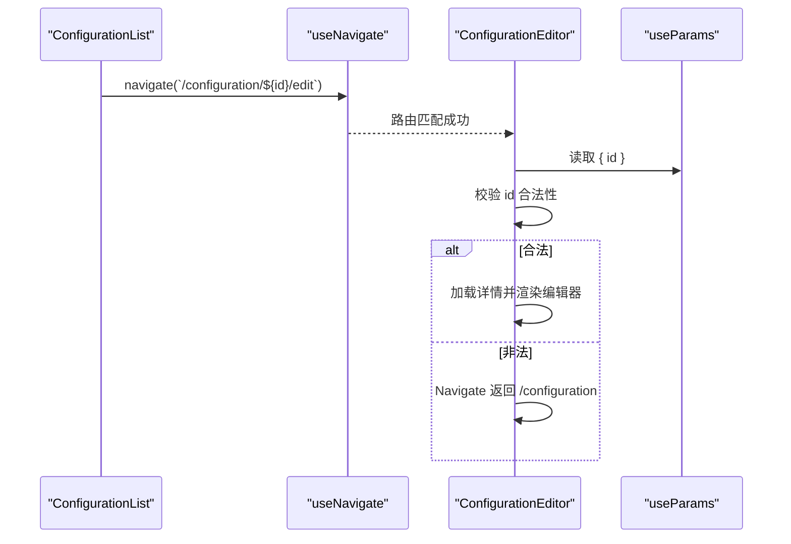
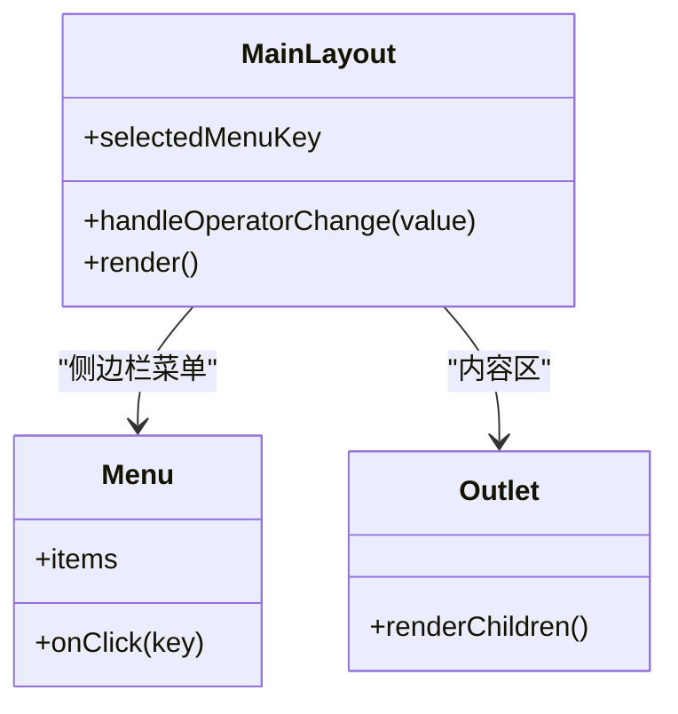
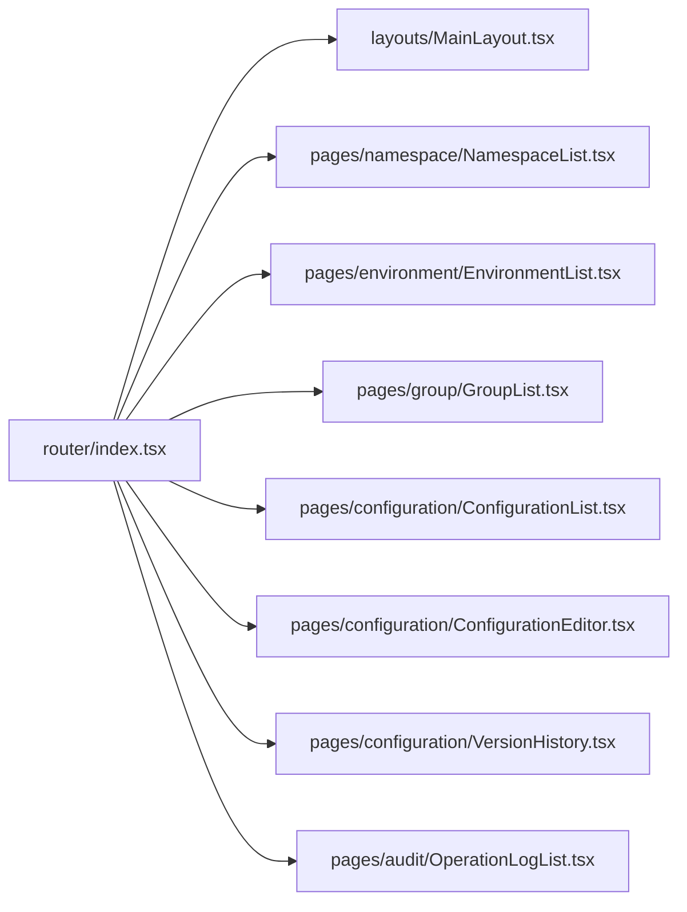

# 路由导航

<cite>
**本文引用的文件**
- [web/src/router/index.tsx](file://web/src/router/index.tsx)
- [web/src/layouts/MainLayout.tsx](file://web/src/layouts/MainLayout.tsx)
- [web/src/App.tsx](file://web/src/App.tsx)
- [web/src/main.tsx](file://web/src/main.tsx)
- [web/src/pages/configuration/ConfigurationList.tsx](file://web/src/pages/configuration/ConfigurationList.tsx)
- [web/src/pages/configuration/ConfigurationEditor.tsx](file://web/src/pages/configuration/ConfigurationEditor.tsx)
- [web/src/pages/configuration/VersionHistory.tsx](file://web/src/pages/configuration/VersionHistory.tsx)
- [web/src/components/PageContainer.tsx](file://web/src/components/PageContainer.tsx)
</cite>

## 目录
1. [简介](#简介)
2. [项目结构](#项目结构)
3. [核心组件](#核心组件)
4. [架构总览](#架构总览)
5. [详细组件分析](#详细组件分析)
6. [依赖关系分析](#依赖关系分析)
7. [性能考虑](#性能考虑)
8. [故障排查指南](#故障排查指南)
9. [结论](#结论)
10. [附录](#附录)

## 简介
本文件围绕前端 React Router 的路由与导航体系进行系统化说明，覆盖路由定义、嵌套路由、动态路由、主布局 MainLayout 的结构与作用（侧边栏菜单、页面标题）、页面间导航与参数传递、以及当前代码中未实现的“路由守卫/权限控制”的可行方案。同时给出路由懒加载与代码分割的性能优化策略，并总结最佳实践与常见问题解决方案。

## 项目结构
本项目采用基于 React Router v6 的 createBrowserRouter 配置方式，集中式路由表位于 router/index.tsx；应用根入口通过 App.tsx 注入 RouterProvider；全局主题与国际化在 main.tsx 完成。页面级组件按功能模块组织在 pages 目录下，通用布局容器 PageContainer 统一页面头部样式。

图表来源
- [web/src/main.tsx:27-34](file://web/src/main.tsx#L27-L34)
- [web/src/App.tsx:1-7](file://web/src/App.tsx#L1-L7)
- [web/src/router/index.tsx:11-27](file://web/src/router/index.tsx#L11-L27)
- [web/src/layouts/MainLayout.tsx:28-103](file://web/src/layouts/MainLayout.tsx#L28-L103)

章节来源
- [web/src/main.tsx:27-34](file://web/src/main.tsx#L27-L34)
- [web/src/App.tsx:1-7](file://web/src/App.tsx#L1-L7)
- [web/src/router/index.tsx:11-27](file://web/src/router/index.tsx#L11-L27)

## 核心组件
- 路由表：使用 createBrowserRouter 集中声明路由，以 MainLayout 为父路由，子路由包含命名空间、环境、配置组、配置管理、操作审计等页面。默认路径重定向到配置管理页。
- 主布局 MainLayout：提供侧边栏菜单、顶部标题和操作人输入框，并通过 Outlet 渲染子页面。菜单高亮逻辑根据当前路径前缀匹配一级菜单。
- 页面容器 PageContainer：统一页面标题、描述与右侧操作区，承载页面内容卡片。

章节来源
- [web/src/router/index.tsx:11-27](file://web/src/router/index.tsx#L11-L27)
- [web/src/layouts/MainLayout.tsx:16-103](file://web/src/layouts/MainLayout.tsx#L16-L103)
- [web/src/components/PageContainer.tsx:4-96](file://web/src/components/PageContainer.tsx#L4-L96)

## 架构总览
下图展示了从应用启动到页面渲染的路由流程，以及主布局与子页面的嵌套关系。

图表来源
- [web/src/main.tsx:27-34](file://web/src/main.tsx#L27-L34)
- [web/src/App.tsx:1-7](file://web/src/App.tsx#L1-L7)
- [web/src/router/index.tsx:11-27](file://web/src/router/index.tsx#L11-L27)
- [web/src/layouts/MainLayout.tsx:97-99](file://web/src/layouts/MainLayout.tsx#L97-L99)

## 详细组件分析

### 路由定义与嵌套路由
- 父路由 path="/" 挂载 MainLayout，作为所有业务页面的外壳。
- 子路由通过 children 数组声明，包含 index 重定向到 /configuration，以及多个业务路由。
- 动态路由：/configuration/:id/edit 与 /configuration/:id/versions 用于编辑与版本历史。

图表来源
- [web/src/router/index.tsx:11-27](file://web/src/router/index.tsx#L11-L27)

章节来源
- [web/src/router/index.tsx:11-27](file://web/src/router/index.tsx#L11-L27)

### 动态路由与参数传递
- 编辑页与版本历史页通过 useParams 获取 id 参数，并进行合法性校验；非法时提示并跳转回列表。
- 列表页通过 useNavigate 进行编程式导航，跳转到编辑或版本历史页，并携带 id 参数。

图表来源
- [web/src/pages/configuration/ConfigurationList.tsx:410-430](file://web/src/pages/configuration/ConfigurationList.tsx#L410-L430)
- [web/src/pages/configuration/ConfigurationEditor.tsx:65-91](file://web/src/pages/configuration/ConfigurationEditor.tsx#L65-L91)
- [web/src/pages/configuration/ConfigurationEditor.tsx:180-183](file://web/src/pages/configuration/ConfigurationEditor.tsx#L180-L183)

章节来源
- [web/src/pages/configuration/ConfigurationList.tsx:410-430](file://web/src/pages/configuration/ConfigurationList.tsx#L410-L430)
- [web/src/pages/configuration/ConfigurationEditor.tsx:65-91](file://web/src/pages/configuration/ConfigurationEditor.tsx#L65-L91)
- [web/src/pages/configuration/ConfigurationEditor.tsx:180-183](file://web/src/pages/configuration/ConfigurationEditor.tsx#L180-L183)

### 主布局 MainLayout 结构与作用
- 侧边栏菜单：menuItems 的 key 对应路由路径，点击调用 useNavigate 进行跳转。
- 高亮逻辑：根据 location.pathname 的前缀匹配当前一级菜单项，确保深层路由（如 /configuration/:id/edit）仍高亮其父级菜单。
- 顶栏：显示当前菜单项的 label 作为页面标题，并提供操作人输入框，写入 localStorage 供请求拦截器注入 X-Operator 头。
- 内容区：通过 <Outlet /> 渲染子路由页面。

图表来源
- [web/src/layouts/MainLayout.tsx:16-103](file://web/src/layouts/MainLayout.tsx#L16-L103)

章节来源
- [web/src/layouts/MainLayout.tsx:16-103](file://web/src/layouts/MainLayout.tsx#L16-L103)

### 页面间导航与参数传递机制
- 编程式导航：在各页面中使用 useNavigate 进行跳转，例如从配置列表跳转到编辑页或版本历史页。
- 查询参数：当前路由表未使用 search params，如需筛选条件持久化可结合 URL query 扩展。
- 状态共享：跨页面数据可通过全局状态或 URL 参数传递，避免局部 state 丢失。

章节来源
- [web/src/pages/configuration/ConfigurationList.tsx:410-430](file://web/src/pages/configuration/ConfigurationList.tsx#L410-L430)
- [web/src/pages/configuration/VersionHistory.tsx:236-252](file://web/src/pages/configuration/VersionHistory.tsx#L236-L252)

### 路由守卫与权限控制的实现方案
当前代码未实现路由守卫与权限控制。建议方案：
- 在 router/index.tsx 中为需要鉴权的路由添加 element 包装组件，该组件检查登录态与角色后决定是否渲染或重定向到登录页。
- 或使用路由前置钩子（如 react-router-dom 的 loader 或自定义守卫函数），在路由切换前执行鉴权逻辑。
- 将用户信息、权限集合置于全局状态或上下文，供守卫组件读取。

[本节为概念性方案说明，不直接分析具体文件]

### 路由懒加载与代码分割
当前路由表采用同步 import，适合中小型项目。对于大型项目，建议：
- 使用 React.lazy + Suspense 对页面组件进行懒加载，减少首屏体积。
- 结合 Vite 的代码分割能力，按路由维度拆分 chunk，提升加载性能。
- 对第三方重型库按需引入，避免全量打包。

[本节为概念性优化建议，不直接分析具体文件]

## 依赖关系分析
路由表与布局、页面之间的依赖关系如下：

图表来源
- [web/src/router/index.tsx:11-27](file://web/src/router/index.tsx#L11-L27)

章节来源
- [web/src/router/index.tsx:11-27](file://web/src/router/index.tsx#L11-L27)

## 性能考虑
- 首屏优化：将非关键页面懒加载，减少初始包体大小。
- 路由切换：避免在路由切换时执行昂贵计算，必要时使用缓存或预取。
- 内存管理：在页面卸载时清理定时器、事件监听器等资源。
- 网络请求：合理使用去抖与节流，避免重复请求。

[本节为通用性能指导，不直接分析具体文件]

## 故障排查指南
- 动态路由参数非法：编辑页与版本历史页会检测 id 合法性，非法时提示并跳转回列表。若出现异常跳转，请检查 URL 参数格式与类型转换。
- 菜单高亮异常：确认当前路径是否以预期的一级菜单 key 开头，必要时调整匹配逻辑。
- 页面标题不正确：检查 MainLayout 中 currentMenuItem.label 的计算是否正确。

章节来源
- [web/src/pages/configuration/ConfigurationEditor.tsx:65-91](file://web/src/pages/configuration/ConfigurationEditor.tsx#L65-L91)
- [web/src/pages/configuration/VersionHistory.tsx:48-77](file://web/src/pages/configuration/VersionHistory.tsx#L48-L77)
- [web/src/layouts/MainLayout.tsx:35-40](file://web/src/layouts/MainLayout.tsx#L35-L40)

## 结论
本项目使用 React Router v6 的 createBrowserRouter 实现了集中式路由配置，通过 MainLayout 提供统一的侧边栏与顶栏布局，并使用 Outlet 渲染子页面。动态路由与编程式导航满足常见业务需求。当前未实现路由守卫与权限控制，可按建议方案扩展。针对性能优化，推荐懒加载与代码分割策略，以提升首屏加载速度与用户体验。

## 附录
- 页面容器 PageContainer 提供统一的标题与描述展示，便于各页面保持一致的视觉风格。
- 建议在新增路由时遵循现有约定：在 router/index.tsx 中集中声明，并在 MainLayout 的 menuItems 中添加对应菜单项以保持导航一致性。

章节来源
- [web/src/components/PageContainer.tsx:4-96](file://web/src/components/PageContainer.tsx#L4-L96)