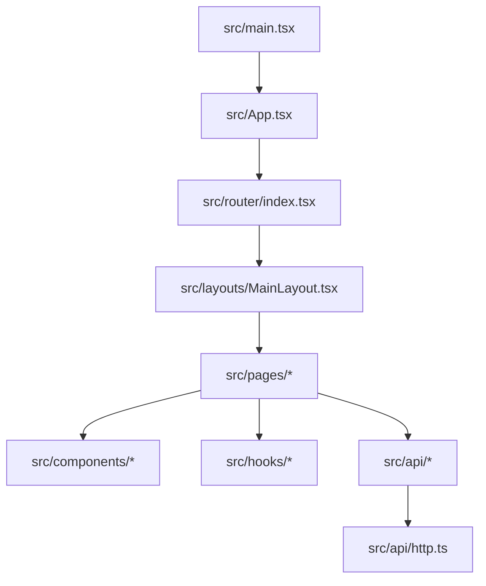
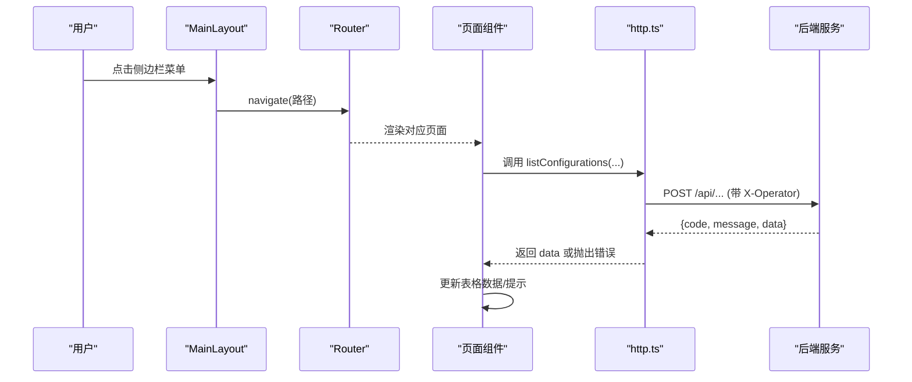
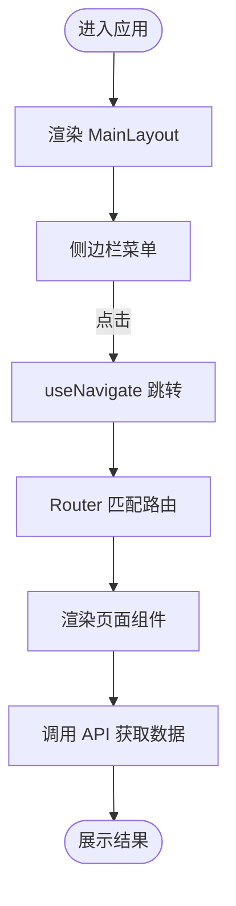
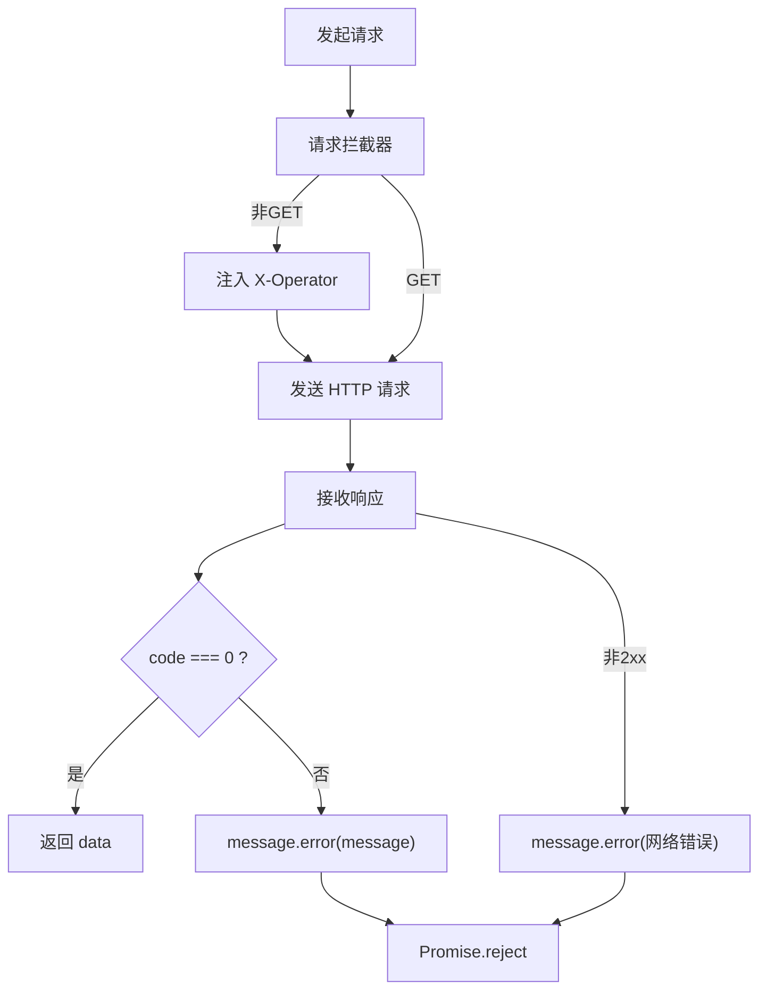
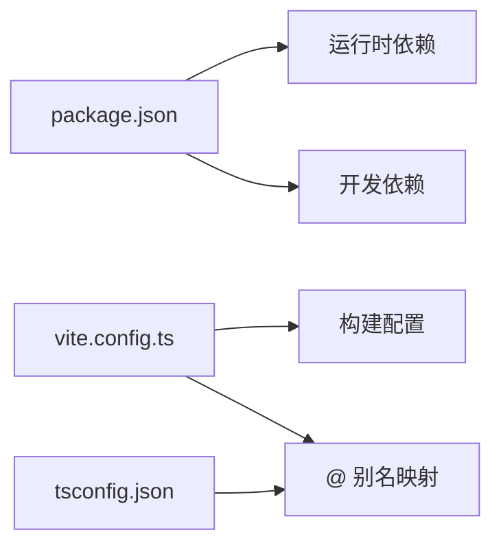

# 项目结构

<cite>
**本文引用的文件**
- [web/package.json](file://web/package.json)
- [web/src/App.tsx](file://web/src/App.tsx)
- [web/src/main.tsx](file://web/src/main.tsx)
- [web/src/router/index.tsx](file://web/src/router/index.tsx)
- [web/src/layouts/MainLayout.tsx](file://web/src/layouts/MainLayout.tsx)
- [web/src/api/http.ts](file://web/src/api/http.ts)
- [web/src/hooks/useTableRequest.ts](file://web/src/hooks/useTableRequest.ts)
- [web/src/pages/configuration/ConfigurationList.tsx](file://web/src/pages/configuration/ConfigurationList.tsx)
- [web/tsconfig.json](file://web/tsconfig.json)
- [web/tsconfig.node.json](file://web/tsconfig.node.json)
- [web/vite.config.ts](file://web/vite.config.ts)
</cite>

## 目录
1. [简介](#简介)
2. [项目结构](#项目结构)
3. [核心组件](#核心组件)
4. [架构总览](#架构总览)
5. [详细组件分析](#详细组件分析)
6. [依赖关系分析](#依赖关系分析)
7. [性能与构建优化](#性能与构建优化)
8. [故障排查指南](#故障排查指南)
9. [结论](#结论)
10. [附录：新模块开发规范](#附录新模块开发规范)

## 简介
本项目是一个基于 React + TypeScript + Vite 的前端应用，用于配置中心的管理界面。前端采用模块化目录组织，职责清晰：页面（pages）承载业务视图，通用组件（components）提供可复用 UI，API 层（api）封装网络请求与类型定义，Hook（hooks）封装通用逻辑，布局（layouts）统一页面骨架，路由（router）集中管理导航。App 作为根组件仅承载路由容器，全局主题与国际化在入口 main.tsx 中完成。

## 项目结构
前端代码位于 web/src 下，按功能域划分目录：
- pages：按业务域划分子目录（如 configuration、environment、group、namespace、audit），每个子目录包含该业务的列表、详情、编辑等页面或抽屉组件。
- components：跨页面复用的 UI 组件，如表格列设置按钮、内容预览、状态标签、表单抽屉等。
- api：HTTP 客户端封装、各业务 API 方法以及共享的类型定义。
- hooks：通用 Hook，如表格数据加载、轮询、列设置持久化等。
- layouts：全局布局组件，如主布局 MainLayout。
- router：集中式路由表，使用 createBrowserRouter 声明式配置。
- utils：工具函数，如格式化器、剪贴板操作等。
- store：状态管理预留目录（当前未使用）。

图表来源
- [web/src/main.tsx:1-35](file://web/src/main.tsx#L1-L35)
- [web/src/App.tsx:1-8](file://web/src/App.tsx#L1-L8)
- [web/src/router/index.tsx:1-28](file://web/src/router/index.tsx#L1-L28)
- [web/src/layouts/MainLayout.tsx:1-104](file://web/src/layouts/MainLayout.tsx#L1-L104)

章节来源
- [web/src/main.tsx:1-35](file://web/src/main.tsx#L1-L35)
- [web/src/App.tsx:1-8](file://web/src/App.tsx#L1-L8)
- [web/src/router/index.tsx:1-28](file://web/src/router/index.tsx#L1-L28)
- [web/src/layouts/MainLayout.tsx:1-104](file://web/src/layouts/MainLayout.tsx#L1-L104)

## 核心组件
- App 根组件：仅负责挂载 RouterProvider，将路由实例注入到应用中，保持根组件极简。
- MainLayout 主布局：提供侧边栏导航、顶部标题与操作人输入框、内容区 Outlet；通过 useLocation/useNavigate 实现菜单高亮与跳转；操作人信息写入 localStorage，供 HTTP 拦截器读取并注入请求头。
- 路由表：集中式 createBrowserRouter 配置，以 MainLayout 为父路由，嵌套各业务页面；首页重定向至配置管理页。
- HTTP 客户端：基于 axios 的 http 实例，统一 baseURL、超时、请求/响应拦截；非 GET 请求自动注入 X-Operator 头；响应体解包为 data，业务失败弹出错误提示并 reject。
- 通用 Hook：useTableRequest 封装 loading/data/reload 三件套，避免竞态覆盖；useColumnSettings 用于表格列显隐与宽度持久化（由页面调用）。

章节来源
- [web/src/App.tsx:1-8](file://web/src/App.tsx#L1-L8)
- [web/src/layouts/MainLayout.tsx:1-104](file://web/src/layouts/MainLayout.tsx#L1-L104)
- [web/src/router/index.tsx:1-28](file://web/src/router/index.tsx#L1-L28)
- [web/src/api/http.ts:1-55](file://web/src/api/http.ts#L1-L55)
- [web/src/hooks/useTableRequest.ts:1-38](file://web/src/hooks/useTableRequest.ts#L1-L38)

## 架构总览
前端采用“布局 + 页面 + 组件 + Hook + API”的分层架构：
- 入口层：main.tsx 初始化 AntD 主题与中文语言包，渲染 App。
- 路由层：App 注入 RouterProvider，router/index.tsx 声明路由树。
- 布局层：MainLayout 提供统一外壳，页面通过 Outlet 渲染。
- 页面层：pages 下的业务页面组合组件与 Hook，调用 api 获取数据。
- 数据层：api/http.ts 统一网络请求与错误处理，各业务 api/*.ts 暴露领域方法。
- 组件层：components 提供通用 UI 能力，提升复用性。
- 工具层：utils/formatters 等提供格式化工具。

图表来源
- [web/src/layouts/MainLayout.tsx:1-104](file://web/src/layouts/MainLayout.tsx#L1-L104)
- [web/src/router/index.tsx:1-28](file://web/src/router/index.tsx#L1-L28)
- [web/src/api/http.ts:1-55](file://web/src/api/http.ts#L1-L55)
- [web/src/pages/configuration/ConfigurationList.tsx:1-666](file://web/src/pages/configuration/ConfigurationList.tsx#L1-L666)

## 详细组件分析

### 路由与布局
- 路由组织：createBrowserRouter 集中声明所有路由，MainLayout 作为父路由，index 重定向到 /configuration；子路由包括命名空间、环境、配置组、配置管理、版本历史、审计日志等。
- 布局交互：侧边栏菜单 key 即路由路径；根据当前 pathname 匹配一级菜单进行高亮；顶部标题显示当前菜单名；操作人输入框值持久化到 localStorage，并在非 GET 请求时注入 X-Operator 头。

图表来源
- [web/src/router/index.tsx:1-28](file://web/src/router/index.tsx#L1-L28)
- [web/src/layouts/MainLayout.tsx:1-104](file://web/src/layouts/MainLayout.tsx#L1-L104)

章节来源
- [web/src/router/index.tsx:1-28](file://web/src/router/index.tsx#L1-L28)
- [web/src/layouts/MainLayout.tsx:1-104](file://web/src/layouts/MainLayout.tsx#L1-L104)

### HTTP 客户端与错误处理
- 基础配置：baseURL 指向 /api，超时 30s。
- 请求拦截：非 GET 请求自动注入 X-Operator 头，值为 localStorage.operator 或默认 portal。
- 响应拦截：后端统一返回 {code, message, data}；当 code === 0 直接返回 data；否则弹出错误提示并 reject；HTTP 非 2xx 优先取后端 message，否则网络错误提示。
- 薄封装：request.get/post/put/delete 收窄类型为业务数据类型 T，简化调用方使用。

图表来源
- [web/src/api/http.ts:1-55](file://web/src/api/http.ts#L1-L55)

章节来源
- [web/src/api/http.ts:1-55](file://web/src/api/http.ts#L1-L55)

### 表格数据加载 Hook
- useTableRequest：封装 loading/data/reload；使用 requestIdRef 保证只接受最新一次 reload 的结果，避免旧请求覆盖新数据；fetcher 变化时自动重新加载；错误已由 http.ts 拦截器处理，此处只做收尾 loading。
- 典型用法：在页面中使用 useCallback 稳定 fetcher 引用，传入 useTableRequest，获得 data/loading/reload，配合 Table 展示。

章节来源
- [web/src/hooks/useTableRequest.ts:1-38](file://web/src/hooks/useTableRequest.ts#L1-L38)
- [web/src/pages/configuration/ConfigurationList.tsx:1-666](file://web/src/pages/configuration/ConfigurationList.tsx#L1-L666)

### 配置管理页面
- 筛选区：命名空间 → 环境 → 配置组三级级联，支持状态与关键字筛选；点查询才生效，重置清空条件。
- 列表：展示 ID、维度名称与 Key、内容预览、格式、状态、最新版本、未发布变更标记、更新时间与修改人；操作列包含详情、编辑、发布、版本历史、下线、删除等。
- 新建配置：抽屉表单，支持选择配置组、Key、格式、内容与说明；可按格式校验并格式化。
- 发布流程：弹窗填写变更备注后调用发布接口，成功后提示版本号并刷新列表。
- 列设置：支持列显隐与宽度持久化，操作列强制显示。

章节来源
- [web/src/pages/configuration/ConfigurationList.tsx:1-666](file://web/src/pages/configuration/ConfigurationList.tsx#L1-L666)

## 依赖关系分析
- 运行时依赖：React、Ant Design、Axios、React Router DOM、Zustand（预留）、Monaco Editor（编辑器）、YAML/XML 解析与格式化库、Diff 查看器等。
- 开发依赖：TypeScript、Vite、@vitejs/plugin-react、类型定义等。
- 构建输出：产物输出到后端 wwwroot 目录，便于单一应用部署。

图表来源
- [web/package.json:1-33](file://web/package.json#L1-L33)
- [web/vite.config.ts:1-27](file://web/vite.config.ts#L1-L27)
- [web/tsconfig.json:1-29](file://web/tsconfig.json#L1-L29)

章节来源
- [web/package.json:1-33](file://web/package.json#L1-L33)
- [web/vite.config.ts:1-27](file://web/vite.config.ts#L1-L27)

## 性能与构建优化
- 构建优化：
  - 使用 Vite 快速开发与构建，生产构建输出到后端静态目录，减少部署复杂度。
  - 启用 isolatedModules、noEmit，结合 tsc --noEmit 做类型检查，提升编译速度与类型安全。
- 运行期优化：
  - 表格数据加载使用 useTableRequest 避免竞态与重复渲染。
  - 列设置持久化减少用户重复配置成本。
  - 内容预览与格式化按需加载，降低首屏压力。
- 建议：
  - 对大型页面考虑懒加载路由或组件。
  - 对长列表使用虚拟滚动（如 antd Table 已内置分页与虚拟化策略）。
  - 对图片等资源使用 CDN 与压缩。

[本节为通用指导，不直接分析具体文件]

## 故障排查指南
- 请求失败：
  - 检查浏览器控制台是否弹出错误提示；http.ts 会在业务码非 0 或网络异常时提示。
  - 确认后端地址与代理配置是否正确（vite.config.ts 中 /api 代理到后端端口）。
  - 确认 X-Operator 头是否注入（非 GET 请求会携带）。
- 路由问题：
  - 检查 router/index.tsx 的路径是否与页面组件导入一致。
  - 确认 MainLayout 的 children 路由是否完整。
- 构建问题：
  - 执行 npm run build 前确保类型检查通过（tsc --noEmit）。
  - 检查 tsconfig.json 的 baseUrl 与 paths 是否与实际路径一致。
- 常见问题定位：
  - 若页面空白，检查 main.tsx 是否成功挂载根节点。
  - 若表格无数据，检查 useTableRequest 的 fetcher 是否正确引用与参数传递。

章节来源
- [web/src/api/http.ts:1-55](file://web/src/api/http.ts#L1-L55)
- [web/src/router/index.tsx:1-28](file://web/src/router/index.tsx#L1-L28)
- [web/vite.config.ts:1-27](file://web/vite.config.ts#L1-L27)
- [web/tsconfig.json:1-29](file://web/tsconfig.json#L1-L29)

## 结论
本项目采用清晰的模块化结构与分层设计，App 作为根组件仅承载路由，MainLayout 提供统一布局与全局上下文，路由集中管理，API 层统一封装网络与错误处理，Hook 提升复用性与稳定性。整体架构易于扩展与维护，适合持续迭代配置中心功能。

[本节为总结，不直接分析具体文件]

## 附录：新模块开发规范
- 目录规范：
  - 新增业务模块在 src/pages 下创建独立子目录，包含列表、详情、编辑等页面或抽屉组件。
  - 通用 UI 组件放入 src/components，保持单一职责与可复用。
  - 新增 API 方法在 src/api 下按业务域拆分文件，并在 types.ts 中维护类型。
  - 通用逻辑抽取为 Hook 放入 src/hooks，避免页面内重复实现。
  - 如需新增布局，放在 src/layouts，并通过路由表引入。
- 路由规范：
  - 在 router/index.tsx 中集中注册路由，遵循父子层级关系；复杂页面可使用嵌套路由。
- 样式与主题：
  - 使用 AntD 主题变量与 ConfigProvider 统一管理；避免内联样式滥用。
- 类型与校验：
  - 所有 API 返回类型在 types.ts 中定义；表单字段使用 AntD Form 规则校验。
- 构建与脚本：
  - 开发使用 npm run dev；构建使用 npm run build；预览使用 npm run preview。
  - 构建产物输出到后端 wwwroot，确保部署路径正确。
- 最佳实践：
  - 使用 useTableRequest 管理列表数据加载。
  - 使用 ColumnSettingButton 提供列设置能力。
  - 使用 ContentPreview、FormatTag、StatusTag 等组件统一展示。
  - 错误提示统一由 http.ts 拦截器处理，页面无需重复提示。

章节来源
- [web/src/router/index.tsx:1-28](file://web/src/router/index.tsx#L1-L28)
- [web/src/api/http.ts:1-55](file://web/src/api/http.ts#L1-L55)
- [web/src/hooks/useTableRequest.ts:1-38](file://web/src/hooks/useTableRequest.ts#L1-L38)
- [web/package.json:1-33](file://web/package.json#L1-L33)
- [web/vite.config.ts:1-27](file://web/vite.config.ts#L1-L27)
- [web/tsconfig.json:1-29](file://web/tsconfig.json#L1-L29)