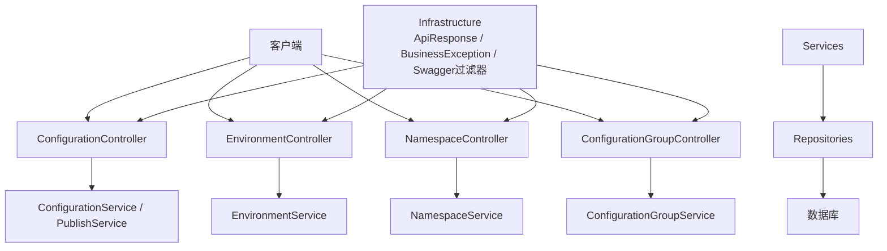
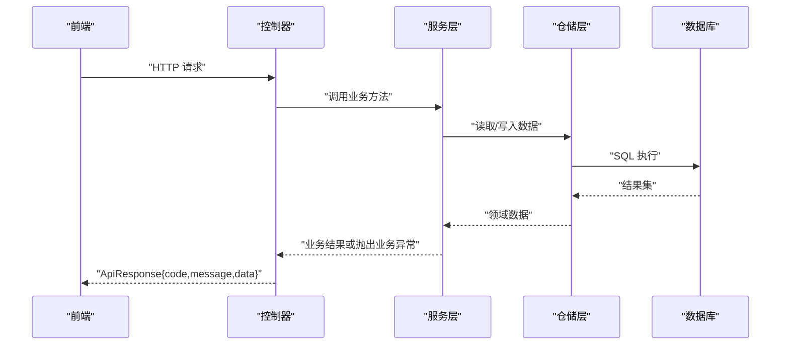
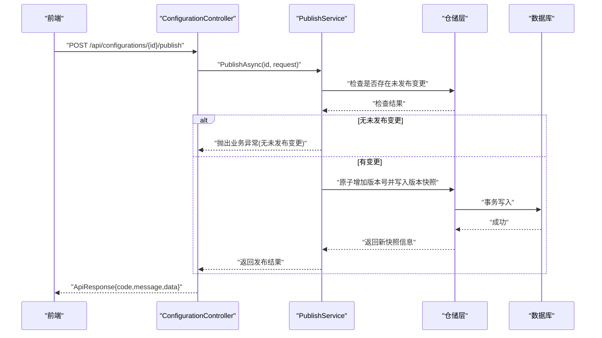
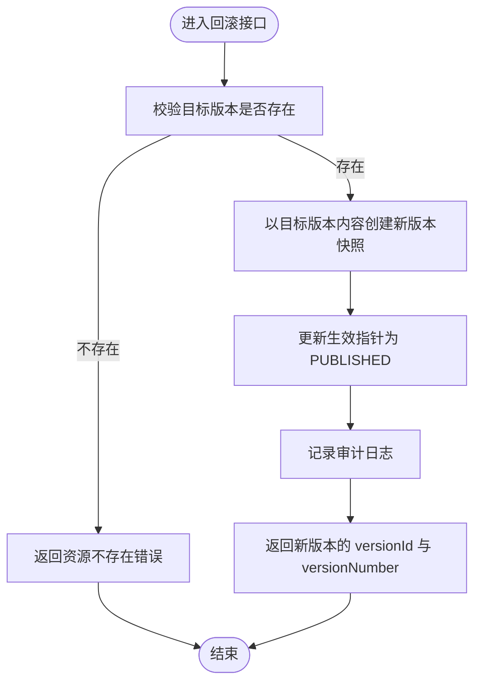
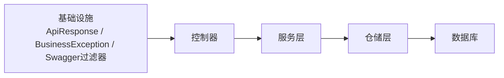

# API设计规范

<cite>
**本文引用的文件**
- [Program.cs](file://k_config_center/Program.cs)
- [ApiResponse.cs](file://k_config_center/src/Infrastructure/ApiResponse.cs)
- [BusinessException.cs](file://k_config_center/src/Infrastructure/BusinessException.cs)
- [SwaggerOperatorHeaderFilter.cs](file://k_config_center/src/Infrastructure/SwaggerOperatorHeaderFilter.cs)
- [ConfigurationController.cs](file://k_config_center/src/Controllers/ConfigurationController.cs)
- [EnvironmentController.cs](file://k_config_center/src/Controllers/EnvironmentController.cs)
- [NamespaceController.cs](file://k_config_center/src/Controllers/NamespaceController.cs)
- [ConfigurationGroupController.cs](file://k_config_center/src/Controllers/ConfigurationGroupController.cs)
- [ConfigurationRequests.cs](file://k_config_center/src/Models/Requests/ConfigurationRequests.cs)
- [EnvironmentRequests.cs](file://k_config_center/src/Models/Requests/EnvironmentRequests.cs)
- [NamespaceRequests.cs](file://k_config_center/src/Models/Requests/NamespaceRequests.cs)
- [ConfigurationGroupRequests.cs](file://k_config_center/src/Models/Requests/ConfigurationGroupRequests.cs)
- [CommonResponses.cs](file://k_config_center/src/Models/Responses/CommonResponses.cs)
- [BasicDimensionResponses.cs](file://k_config_center/src/Models/Responses/BasicDimensionResponses.cs)
</cite>

## 目录
1. [简介](#简介)
2. [项目结构](#项目结构)
3. [核心组件](#核心组件)
4. [架构总览](#架构总览)
5. [详细组件分析](#详细组件分析)
6. [依赖关系分析](#依赖关系分析)
7. [性能考虑](#性能考虑)
8. [故障排查指南](#故障排查指南)
9. [结论](#结论)
10. [附录](#附录)

## 简介
本规范面向配置中心后端API，统一约定RESTful设计原则、URL命名、统一响应格式、错误处理机制、请求参数与数据模型约定、版本控制策略以及Swagger文档使用方式。目标是让前后端在一致契约下高效协作，降低集成成本与维护风险。

## 项目结构
后端采用分层架构：
- Controllers：仅负责接收请求、调用服务层、包装统一响应。
- Services：业务逻辑实现，抛出业务异常或返回领域对象。
- Models：请求与响应模型，严格定义字段与约束。
- Infrastructure：基础设施能力（统一响应、业务异常、Swagger过滤器等）。
- Program：应用启动与全局异常处理。

图表来源
- [ConfigurationController.cs:1-115](file://k_config_center/src/Controllers/ConfigurationController.cs#L1-L115)
- [EnvironmentController.cs:1-52](file://k_config_center/src/Controllers/EnvironmentController.cs#L1-L52)
- [NamespaceController.cs:1-50](file://k_config_center/src/Controllers/NamespaceController.cs#L1-L50)
- [ConfigurationGroupController.cs:1-53](file://k_config_center/src/Controllers/ConfigurationGroupController.cs#L1-L53)
- [ApiResponse.cs:1-10](file://k_config_center/src/Infrastructure/ApiResponse.cs#L1-L10)
- [BusinessException.cs:1-11](file://k_config_center/src/Infrastructure/BusinessException.cs#L1-L11)
- [SwaggerOperatorHeaderFilter.cs:1-27](file://k_config_center/src/Infrastructure/SwaggerOperatorHeaderFilter.cs#L1-L27)

章节来源
- [ConfigurationController.cs:1-115](file://k_config_center/src/Controllers/ConfigurationController.cs#L1-L115)
- [EnvironmentController.cs:1-52](file://k_config_center/src/Controllers/EnvironmentController.cs#L1-L52)
- [NamespaceController.cs:1-50](file://k_config_center/src/Controllers/NamespaceController.cs#L1-L50)
- [ConfigurationGroupController.cs:1-53](file://k_config_center/src/Controllers/ConfigurationGroupController.cs#L1-L53)

## 核心组件
- 统一响应 ApiResponse：所有接口HTTP状态码均为200，业务成功/失败通过code/message/data表达。
- 业务异常 BusinessException：在服务层抛错，由全局异常处理统一转为 ApiResponse.Fail。
- Swagger操作头过滤器：为写操作自动补充X-Operator请求头说明，便于审计追踪。

章节来源
- [ApiResponse.cs:1-10](file://k_config_center/src/Infrastructure/ApiResponse.cs#L1-L10)
- [BusinessException.cs:1-11](file://k_config_center/src/Infrastructure/BusinessException.cs#L1-L11)
- [SwaggerOperatorHeaderFilter.cs:1-27](file://k_config_center/src/Infrastructure/SwaggerOperatorHeaderFilter.cs#L1-L27)
- [Program.cs:90-90](file://k_config_center/Program.cs#L90-L90)

## 架构总览
控制器只承担路由与响应封装职责，业务规则集中在服务层；数据访问通过仓储层完成。统一响应与异常贯穿全链路，保证前端对错误处理的稳定性。

图表来源
- [ConfigurationController.cs:1-115](file://k_config_center/src/Controllers/ConfigurationController.cs#L1-L115)
- [ApiResponse.cs:1-10](file://k_config_center/src/Infrastructure/ApiResponse.cs#L1-L10)
- [BusinessException.cs:1-11](file://k_config_center/src/Infrastructure/BusinessException.cs#L1-L11)
- [Program.cs:90-90](file://k_config_center/Program.cs#L90-L90)

## 详细组件分析

### RESTful API 设计与 URL 命名规范
- 资源名词使用复数形式，如 configurations、environments、namespaces、configuration-groups。
- 层级体现从属关系，如 /api/configurations/{id}/versions/{versionNumber}。
- 动词尽量用HTTP方法表达：GET列表/详情、POST创建、PUT更新、DELETE删除；复杂动作以子资源路径表达，如 publish、rollback、offline。
- 查询参数用于过滤与分页，如 status、keyword、pageIndex、pageSize。
- 版本号控制：当前未暴露显式URL版本前缀，建议后续演进时通过URL前缀或Accept Header进行版本管理。

章节来源
- [ConfigurationController.cs:1-115](file://k_config_center/src/Controllers/ConfigurationController.cs#L1-L115)
- [EnvironmentController.cs:1-52](file://k_config_center/src/Controllers/EnvironmentController.cs#L1-L52)
- [NamespaceController.cs:1-50](file://k_config_center/src/Controllers/NamespaceController.cs#L1-L50)
- [ConfigurationGroupController.cs:1-53](file://k_config_center/src/Controllers/ConfigurationGroupController.cs#L1-L53)

### 统一响应格式 ApiResponse
- HTTP状态码始终为200，业务语义通过code表达。
- 成功：code=0，message="success"，data为具体数据或null。
- 失败：code为非0业务错误码，message为可读提示，data=null。
- 分页：遵循 data.items + data.total 的结构。

章节来源
- [ApiResponse.cs:1-10](file://k_config_center/src/Infrastructure/ApiResponse.cs#L1-L10)
- [CommonResponses.cs:1-52](file://k_config_center/src/Models/Responses/CommonResponses.cs#L1-L52)

### 错误处理机制与错误码规范
- 服务层遇到业务异常时抛出 BusinessException，携带错误码与消息。
- 全局异常处理将异常转换为 ApiResponse.Fail(code, message)，保持HTTP 200。
- 常见错误码示例（按模块划分）：
  - 通用：成功、内部错误、资源不存在。
  - 命名空间：键冲突、级联删除冲突。
  - 环境：键冲突、级联删除冲突。
  - 配置组：键冲突、级联删除冲突。
  - 配置项：键冲突、无未发布变更、重复发布冲突、版本不存在。
- 客户端应依据code判断成功与否，message用于展示或日志记录。

章节来源
- [BusinessException.cs:1-11](file://k_config_center/src/Infrastructure/BusinessException.cs#L1-L11)
- [Program.cs:90-90](file://k_config_center/Program.cs#L90-L90)
- [ConfigurationController.cs:1-115](file://k_config_center/src/Controllers/ConfigurationController.cs#L1-L115)
- [EnvironmentController.cs:1-52](file://k_config_center/src/Controllers/EnvironmentController.cs#L1-L52)
- [NamespaceController.cs:1-50](file://k_config_center/src/Controllers/NamespaceController.cs#L1-L50)
- [ConfigurationGroupController.cs:1-53](file://k_config_center/src/Controllers/ConfigurationGroupController.cs#L1-L53)

### 请求参数验证与数据模型
- 请求模型使用强类型record，明确必填与可选字段，避免松散JSON带来的歧义。
- 关键字段约束：
  - 唯一性：namespaceKey、environmentKey、groupKey、configurationKey 在各自作用域内唯一。
  - 不可变：key 创建后不可修改。
  - 内容格式：text/json/yaml/properties，缺省为 text。
  - 标签：逗号分隔字符串。
- 服务端计算md5，不信任前端传入的md5值。
- 分页参数：pageIndex从1开始，pageSize默认20。

章节来源
- [ConfigurationRequests.cs:1-27](file://k_config_center/src/Models/Requests/ConfigurationRequests.cs#L1-L27)
- [EnvironmentRequests.cs:1-17](file://k_config_center/src/Models/Requests/EnvironmentRequests.cs#L1-L17)
- [NamespaceRequests.cs:1-14](file://k_config_center/src/Models/Requests/NamespaceRequests.cs#L1-L14)
- [ConfigurationGroupRequests.cs:1-16](file://k_config_center/src/Models/Requests/ConfigurationGroupRequests.cs#L1-L16)

### 数据模型设计
- 响应模型与领域数据解耦，Repository输出领域数据，Response负责对外序列化。
- 常用响应：
  - 分页 PageResponse<T>：items、total。
  - 客户端配置 ClientConfigurationResponse：包含已发布快照内容与md5。
  - 长轮询通知 ClientNotificationResponse：changed标志与组级整体指纹。
  - 基础维度响应：NamespaceResponse、EnvironmentResponse、ConfigurationGroupResponse。
  - 操作日志响应 OperationLogResponse：含关联维度冗余字段便于展示。

章节来源
- [CommonResponses.cs:1-52](file://k_config_center/src/Models/Responses/CommonResponses.cs#L1-L52)
- [BasicDimensionResponses.cs:1-69](file://k_config_center/src/Models/Responses/BasicDimensionResponses.cs#L1-L69)

### 版本控制策略
- 配置项版本：每次发布生成新版本快照，版本号线性递增；回滚会生成新的ROLLBACK版本，不回退版本号。
- 版本历史：支持分页查询与单个版本快照获取，供Diff与审计使用。
- 客户端缓存：基于组级整体md5进行增量探测，减少无效拉取。

章节来源
- [ConfigurationController.cs:1-115](file://k_config_center/src/Controllers/ConfigurationController.cs#L1-L115)
- [CommonResponses.cs:1-52](file://k_config_center/src/Models/Responses/CommonResponses.cs#L1-L52)

### Swagger 文档配置与使用
- 写操作自动注入 X-Operator 请求头，用于审计日志记录操作人，缺省记为 system。
- 该过滤器对所有非GET操作生效，无需逐接口标注，减少样板代码。
- 建议在网关或调用方强制传递X-Operator，以便可追溯。

章节来源
- [SwaggerOperatorHeaderFilter.cs:1-27](file://k_config_center/src/Infrastructure/SwaggerOperatorHeaderFilter.cs#L1-L27)

### 关键流程时序图

#### 发布配置流程

图表来源
- [ConfigurationController.cs:65-83](file://k_config_center/src/Controllers/ConfigurationController.cs#L65-L83)
- [BusinessException.cs:1-11](file://k_config_center/src/Infrastructure/BusinessException.cs#L1-L11)
- [Program.cs:90-90](file://k_config_center/Program.cs#L90-L90)

#### 回滚配置流程

图表来源
- [ConfigurationController.cs:75-83](file://k_config_center/src/Controllers/ConfigurationController.cs#L75-L83)

## 依赖关系分析
- 控制器依赖服务层，服务层依赖仓储层，仓储层依赖数据库。
- 统一响应与异常作为横切关注点被各层复用。
- Swagger过滤器与控制器解耦，通过OpenAPI扩展点注入。

图表来源
- [ConfigurationController.cs:1-115](file://k_config_center/src/Controllers/ConfigurationController.cs#L1-L115)
- [ApiResponse.cs:1-10](file://k_config_center/src/Infrastructure/ApiResponse.cs#L1-L10)
- [BusinessException.cs:1-11](file://k_config_center/src/Infrastructure/BusinessException.cs#L1-L11)
- [SwaggerOperatorHeaderFilter.cs:1-27](file://k_config_center/src/Infrastructure/SwaggerOperatorHeaderFilter.cs#L1-L27)

## 性能考虑
- 列表接口支持多维过滤与分页，避免全量拉取。
- 客户端通过组级md5进行增量探测，减少带宽与CPU消耗。
- 发布与回滚在事务中执行，确保一致性同时减少锁竞争。
- 软删除避免物理删除带来的索引重建与数据丢失风险。

## 故障排查指南
- 统一错误码：优先根据code定位问题类别，再结合message快速定位原因。
- 常见场景：
  - 资源不存在：检查ID是否正确、是否已被软删除。
  - 键冲突：确认命名空间/环境/配置组/配置项的唯一性约束。
  - 无未发布变更：确认是否存在草稿态变更。
  - 并发冲突：重试发布或回滚操作。
- 审计日志：通过OperationLogResponse查看操作轨迹，辅助定位问题。

章节来源
- [CommonResponses.cs:1-52](file://k_config_center/src/Models/Responses/CommonResponses.cs#L1-L52)
- [ConfigurationController.cs:1-115](file://k_config_center/src/Controllers/ConfigurationController.cs#L1-L115)

## 结论
本规范通过统一的响应格式、严格的错误码体系、清晰的URL命名与强类型数据模型，构建了稳定易用的配置中心API。配合Swagger的X-Operator审计头与版本化快照机制，既保障了可观测性，也提升了客户端集成的效率与鲁棒性。

## 附录

### API 清单与最佳实践
- 命名空间
  - GET /api/namespaces：列出命名空间
  - POST /api/namespaces：创建命名空间
  - PUT /api/namespaces/{id}：更新命名空间
  - DELETE /api/namespaces/{id}：删除命名空间
- 环境
  - GET /api/environments：列出环境
  - POST /api/environments：创建环境
  - PUT /api/environments/{id}：更新环境
  - DELETE /api/environments/{id}：删除环境
- 配置组
  - GET /api/configuration-groups：列出配置组
  - POST /api/configuration-groups：创建配置组
  - PUT /api/configuration-groups/{id}：更新配置组
  - DELETE /api/configuration-groups/{id}：删除配置组
- 配置项
  - GET /api/configurations：列出配置项（支持过滤）
  - GET /api/configurations/{id}：获取配置详情
  - POST /api/configurations：创建配置
  - PUT /api/configurations/{id}：保存编辑（草稿）
  - DELETE /api/configurations/{id}：删除配置（软删除）
  - POST /api/configurations/{id}/publish：发布配置
  - POST /api/configurations/{id}/rollback：回滚配置
  - POST /api/configurations/{id}/offline：下线配置
  - GET /api/configurations/{id}/versions：版本历史（分页）
  - GET /api/configurations/{id}/versions/{versionNumber}：指定版本快照

最佳实践
- 始终使用统一响应 ApiResponse，不要直接返回实体。
- 写操作务必传递 X-Operator 请求头，便于审计。
- 分页参数从1开始，合理设置pageSize避免过大负载。
- 敏感或大体积内容建议使用分片或下载链接，避免阻塞主流程。
- 幂等性：创建与更新需做好唯一性校验；发布/回滚具备重试友好性。

章节来源
- [ConfigurationController.cs:1-115](file://k_config_center/src/Controllers/ConfigurationController.cs#L1-L115)
- [EnvironmentController.cs:1-52](file://k_config_center/src/Controllers/EnvironmentController.cs#L1-L52)
- [NamespaceController.cs:1-50](file://k_config_center/src/Controllers/NamespaceController.cs#L1-L50)
- [ConfigurationGroupController.cs:1-53](file://k_config_center/src/Controllers/ConfigurationGroupController.cs#L1-L53)
- [SwaggerOperatorHeaderFilter.cs:1-27](file://k_config_center/src/Infrastructure/SwaggerOperatorHeaderFilter.cs#L1-L27)