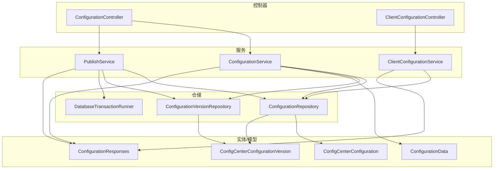
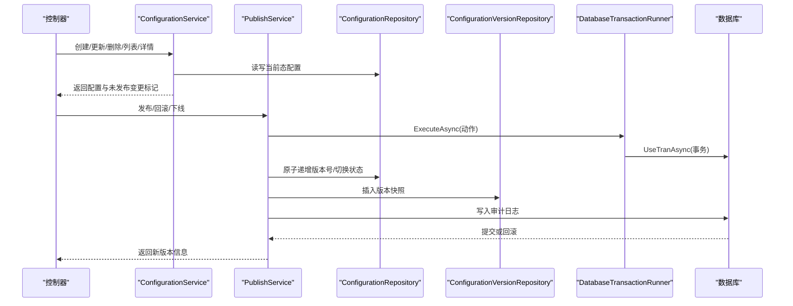
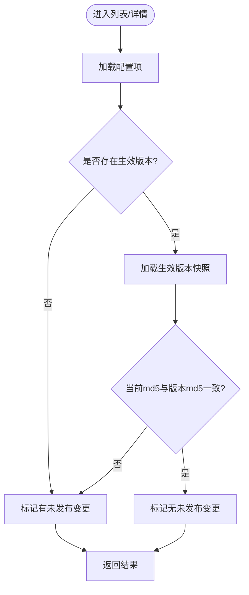
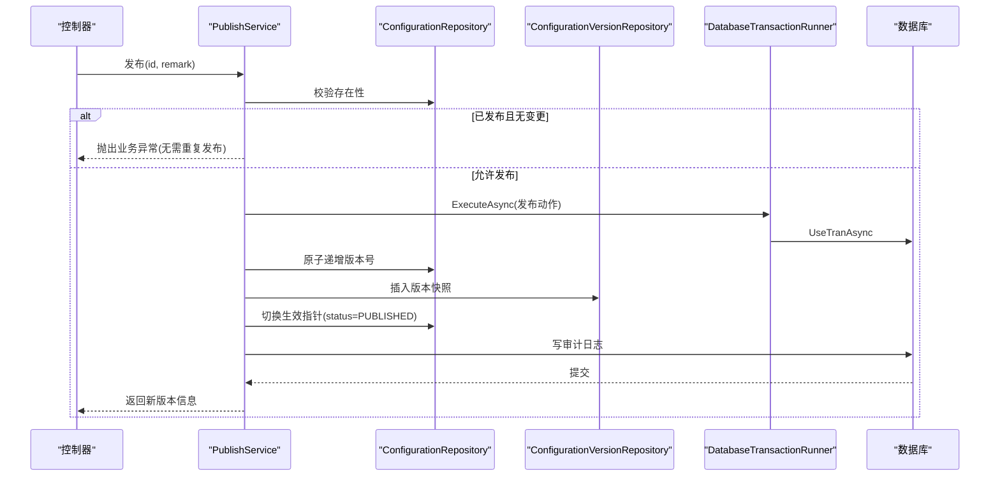
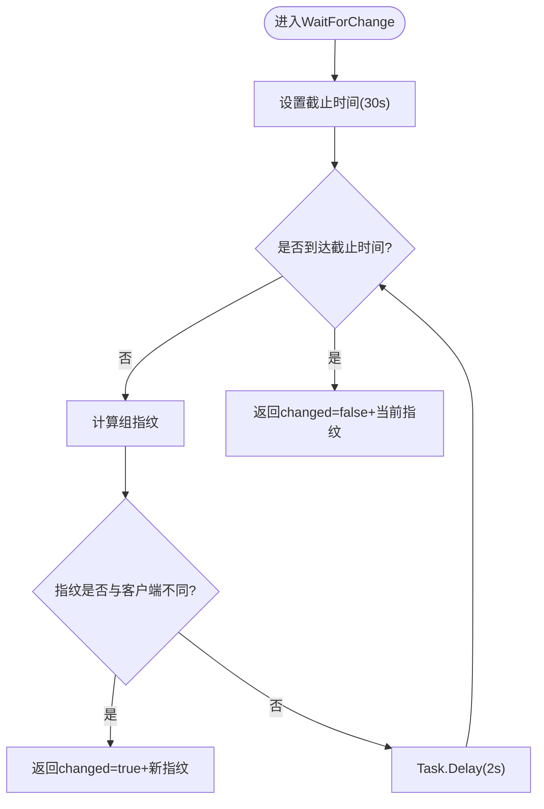
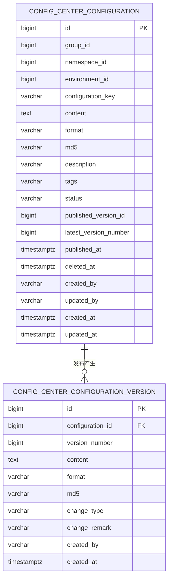
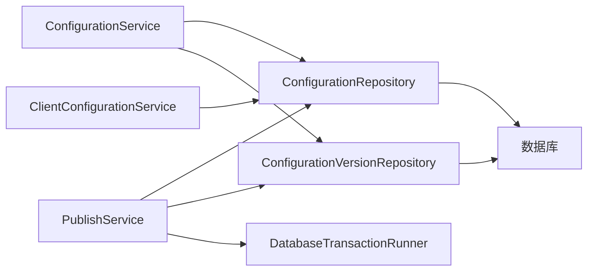

# 业务逻辑实现

<cite>
**本文引用的文件**
- [ConfigurationService.cs](file://k_config_center/src/Services/ConfigurationService.cs)
- [PublishService.cs](file://k_config_center/src/Services/PublishService.cs)
- [ClientConfigurationService.cs](file://k_config_center/src/Services/ClientConfigurationService.cs)
- [DatabaseTransactionRunner.cs](file://k_config_center/src/Repositories/DatabaseTransactionRunner.cs)
- [ConfigurationRepository.cs](file://k_config_center/src/Repositories/ConfigurationRepository.cs)
- [ConfigCenterConfiguration.cs](file://k_config_center/src/Entities/ConfigCenterConfiguration.cs)
- [ConfigCenterConfigurationVersion.cs](file://k_config_center/src/Entities/ConfigCenterConfigurationVersion.cs)
- [ConfigurationData.cs](file://k_config_center/src/Models/Domain/ConfigurationData.cs)
- [ConfigurationResponses.cs](file://k_config_center/src/Models/Responses/ConfigurationResponses.cs)
- [BusinessException.cs](file://k_config_center/src/Infrastructure/BusinessException.cs)
- [OperationHelper.cs](file://k_config_center/src/Infrastructure/OperationHelper.cs)
</cite>

## 目录
1. [简介](#简介)
2. [项目结构](#项目结构)
3. [核心组件](#核心组件)
4. [架构总览](#架构总览)
5. [详细组件分析](#详细组件分析)
6. [依赖关系分析](#依赖关系分析)
7. [性能考量](#性能考量)
8. [故障排查指南](#故障排查指南)
9. [结论](#结论)
10. [附录](#附录)

## 简介
本指南聚焦配置中心的业务逻辑实现，围绕三大关键服务展开：
- ConfigurationService：负责配置的编辑与保存（草稿）、详情查询、版本历史与快照读取。
- PublishService：负责发布、回滚、下线等事务型操作，保证版本号、快照、生效指针与审计日志的一致性。
- ClientConfigurationService：面向客户端的只读接口，提供批量拉取、单条获取与长轮询变更探测。

文档将说明配置管理的业务流程（CRUD、版本控制、发布回滚）、事务管理与并发控制策略、业务规则与验证逻辑，并给出扩展新功能的指导原则与示例路径。

## 项目结构
后端采用分层架构：
- Controllers 层：HTTP 入口，参数校验后调用 Services。
- Services 层：业务编排与规则实现，组合多个 Repository 完成跨表操作。
- Repositories 层：数据访问封装，包含数据库事务执行器与具体 SQL 操作。
- Entities/Models：实体模型与领域数据对象、请求/响应模型。
- Infrastructure：公共工具与异常处理。

图表来源
- [ConfigurationService.cs:1-110](file://k_config_center/src/Services/ConfigurationService.cs#L1-L110)
- [PublishService.cs:1-116](file://k_config_center/src/Services/PublishService.cs#L1-L116)
- [ClientConfigurationService.cs:1-56](file://k_config_center/src/Services/ClientConfigurationService.cs#L1-L56)
- [ConfigurationRepository.cs:1-155](file://k_config_center/src/Repositories/ConfigurationRepository.cs#L1-L155)
- [DatabaseTransactionRunner.cs:1-19](file://k_config_center/src/Repositories/DatabaseTransactionRunner.cs#L1-L19)
- [ConfigCenterConfiguration.cs:1-66](file://k_config_center/src/Entities/ConfigCenterConfiguration.cs#L1-L66)
- [ConfigCenterConfigurationVersion.cs:1-39](file://k_config_center/src/Entities/ConfigCenterConfigurationVersion.cs#L1-L39)
- [ConfigurationData.cs:1-15](file://k_config_center/src/Models/Domain/ConfigurationData.cs#L1-L15)
- [ConfigurationResponses.cs:1-75](file://k_config_center/src/Models/Responses/ConfigurationResponses.cs#L1-L75)

章节来源
- [ConfigurationService.cs:1-110](file://k_config_center/src/Services/ConfigurationService.cs#L1-L110)
- [PublishService.cs:1-116](file://k_config_center/src/Services/PublishService.cs#L1-L116)
- [ClientConfigurationService.cs:1-56](file://k_config_center/src/Services/ClientConfigurationService.cs#L1-L56)
- [ConfigurationRepository.cs:1-155](file://k_config_center/src/Repositories/ConfigurationRepository.cs#L1-L155)

## 核心组件
- ConfigurationService
  - 职责：配置的创建、更新（草稿）、删除（软删）、列表与详情查询、版本历史与快照读取；计算“是否有未发布变更”标记。
  - 关键点：MD5 由服务端统一计算；不产生版本；仅更新当前态字段。
- PublishService
  - 职责：发布、回滚、下线；在事务内顺序执行“版本号递增 → 写不可变快照 → 切换生效指针 → 写日志”。
  - 关键点：并发安全通过数据库行锁与唯一约束兜底；错误码规范化。
- ClientConfigurationService
  - 职责：按业务 key 批量/单个拉取已发布配置；长轮询变更探测（组指纹 MD5）。
  - 关键点：只读；五表联查收口于 Repository；指纹变化即触发通知。

章节来源
- [ConfigurationService.cs:1-110](file://k_config_center/src/Services/ConfigurationService.cs#L1-L110)
- [PublishService.cs:1-116](file://k_config_center/src/Services/PublishService.cs#L1-L116)
- [ClientConfigurationService.cs:1-56](file://k_config_center/src/Services/ClientConfigurationService.cs#L1-L56)

## 架构总览
服务层通过仓储层访问数据库，使用 SqlSugarScope 的事务能力，结合 DatabaseTransactionRunner 进行事务编排。实体模型承载持久化结构，领域数据对象与响应模型用于服务与外部契约隔离。

图表来源
- [ConfigurationService.cs:1-110](file://k_config_center/src/Services/ConfigurationService.cs#L1-L110)
- [PublishService.cs:1-116](file://k_config_center/src/Services/PublishService.cs#L1-L116)
- [ConfigurationRepository.cs:1-155](file://k_config_center/src/Repositories/ConfigurationRepository.cs#L1-L155)
- [DatabaseTransactionRunner.cs:1-19](file://k_config_center/src/Repositories/DatabaseTransactionRunner.cs#L1-L19)

## 详细组件分析

### ConfigurationService：配置编辑与版本查询
- 列表与详情
  - 列表一次性取出所有生效版本的 md5，内存比对判断“有未发布变更”，避免逐条回查。
  - 详情返回当前编辑态与生效版本快照（从未发布则为 null），供 Diff 对比。
- 创建/更新/删除
  - 创建：初始状态为 DRAFT，版本号从 0 起；组内 key 冲突转业务错误码。
  - 更新：仅更新 content/format/md5/description/tags，不改 status 与版本号；updated_at 由触发器刷新。
  - 删除：软删除，保留版本与日志可审计。
- 版本历史
  - 版本表无软删除，支持分页倒序查看；单个版本快照供 Diff 使用。

图表来源
- [ConfigurationService.cs:23-44](file://k_config_center/src/Services/ConfigurationService.cs#L23-L44)
- [ConfigurationRepository.cs:11-48](file://k_config_center/src/Repositories/ConfigurationRepository.cs#L11-L48)

章节来源
- [ConfigurationService.cs:23-102](file://k_config_center/src/Services/ConfigurationService.cs#L23-L102)
- [ConfigurationRepository.cs:11-48](file://k_config_center/src/Repositories/ConfigurationRepository.cs#L11-L48)

### PublishService：发布、回滚、下线（事务与并发）
- 发布流程
  - 前置校验：若已是 PUBLISHED 且内容与生效版本一致，拒绝重复发布。
  - 事务内顺序：版本号原子递增 → 插入版本快照 → 切换生效指针 → 写审计日志。
- 回滚流程
  - 以目标历史版本内容生成新版本（change_type=ROLLBACK），保持版本线性递增。
  - 同步当前态内容为历史版本值，并切换生效指针。
- 下线流程
  - 仅置 OFFLINE，客户端立即不可见；保留 published_version_id，后续可发布恢复上线。
- 并发控制
  - 版本号递增使用数据库侧 UPDATE ... RETURNING，行锁串行化并发发布。
  - 唯一约束 (configuration_id, version_number) 作为兜底，冲突时转业务错误码。

图表来源
- [PublishService.cs:24-54](file://k_config_center/src/Services/PublishService.cs#L24-L54)
- [ConfigurationRepository.cs:75-103](file://k_config_center/src/Repositories/ConfigurationRepository.cs#L75-L103)
- [DatabaseTransactionRunner.cs:11-17](file://k_config_center/src/Repositories/DatabaseTransactionRunner.cs#L11-L17)

章节来源
- [PublishService.cs:24-108](file://k_config_center/src/Services/PublishService.cs#L24-L108)
- [ConfigurationRepository.cs:75-103](file://k_config_center/src/Repositories/ConfigurationRepository.cs#L75-L103)

### ClientConfigurationService：客户端只读与变更探测
- 批量/单条拉取
  - 仅返回 status='PUBLISHED' 且未软删的配置，内容取自 published_version_id 指向的版本快照。
- 长轮询变更探测
  - 客户端携带上次组指纹 md5，服务端周期性重算比对；不一致立即返回 changed=true，否则挂起最长 30 秒后返回 false。
  - 组指纹 = 组内全部已发布配置按 key 排序后 "key=md5" 拼接串的 MD5；空组也有确定指纹。

图表来源
- [ClientConfigurationService.cs:27-54](file://k_config_center/src/Services/ClientConfigurationService.cs#L27-L54)
- [ConfigurationRepository.cs:105-124](file://k_config_center/src/Repositories/ConfigurationRepository.cs#L105-L124)

章节来源
- [ClientConfigurationService.cs:11-54](file://k_config_center/src/Services/ClientConfigurationService.cs#L11-L54)
- [ConfigurationRepository.cs:105-124](file://k_config_center/src/Repositories/ConfigurationRepository.cs#L105-L124)

### 数据模型与实体关系
- 配置项实体（当前态）
  - 关键字段：status（DRAFT/PUBLISHED/OFFLINE）、published_version_id、latest_version_number、deleted_at。
- 版本快照实体（不可变）
  - 关键字段：version_number（单调递增）、change_type（CREATE/UPDATE/ROLLBACK）、content/format/md5。
- 领域数据对象
  - ConfigurationData：当前编辑态的业务数据形态，含冗余维度名称与 key。
  - ConfigurationVersionData：版本快照的业务数据形态。

图表来源
- [ConfigCenterConfiguration.cs:1-66](file://k_config_center/src/Entities/ConfigCenterConfiguration.cs#L1-L66)
- [ConfigCenterConfigurationVersion.cs:1-39](file://k_config_center/src/Entities/ConfigCenterConfigurationVersion.cs#L1-L39)

章节来源
- [ConfigCenterConfiguration.cs:1-66](file://k_config_center/src/Entities/ConfigCenterConfiguration.cs#L1-L66)
- [ConfigCenterConfigurationVersion.cs:1-39](file://k_config_center/src/Entities/ConfigCenterConfigurationVersion.cs#L1-L39)
- [ConfigurationData.cs:1-15](file://k_config_center/src/Models/Domain/ConfigurationData.cs#L1-L15)

## 依赖关系分析
- Service 与 Repository
  - ConfigurationService 依赖 ConfigurationRepository 与 ConfigurationVersionRepository，用于 CRUD 与版本查询。
  - PublishService 依赖 ConfigurationRepository、ConfigurationVersionRepository 与 DatabaseTransactionRunner，确保事务一致性。
  - ClientConfigurationService 依赖 ConfigurationRepository 的五表联查能力。
- 事务边界
  - 发布/回滚在 DatabaseTransactionRunner.ExecuteAsync 中执行，SqlSugarScope 自动参与环境事务。
- 并发与一致性
  - 版本号递增使用数据库侧原子操作，配合唯一约束兜底，避免并发冲突导致的数据不一致。

图表来源
- [ConfigurationService.cs:1-110](file://k_config_center/src/Services/ConfigurationService.cs#L1-L110)
- [PublishService.cs:1-116](file://k_config_center/src/Services/PublishService.cs#L1-L116)
- [ClientConfigurationService.cs:1-56](file://k_config_center/src/Services/ClientConfigurationService.cs#L1-L56)
- [ConfigurationRepository.cs:1-155](file://k_config_center/src/Repositories/ConfigurationRepository.cs#L1-L155)
- [DatabaseTransactionRunner.cs:1-19](file://k_config_center/src/Repositories/DatabaseTransactionRunner.cs#L1-L19)

章节来源
- [ConfigurationService.cs:1-110](file://k_config_center/src/Services/ConfigurationService.cs#L1-L110)
- [PublishService.cs:1-116](file://k_config_center/src/Services/PublishService.cs#L1-L116)
- [ClientConfigurationService.cs:1-56](file://k_config_center/src/Services/ClientConfigurationService.cs#L1-L56)
- [ConfigurationRepository.cs:1-155](file://k_config_center/src/Repositories/ConfigurationRepository.cs#L1-L155)
- [DatabaseTransactionRunner.cs:1-19](file://k_config_center/src/Repositories/DatabaseTransactionRunner.cs#L1-L19)

## 性能考量
- 列表优化
  - 一次性加载所有生效版本 md5，内存比对“是否有未发布变更”，减少多次回查。
- 客户端读取
  - 五表联查收口于 Repository，仅返回必要字段；长轮询使用 Task.Delay + CancellationToken，避免阻塞线程池。
- 事务与并发
  - 数据库侧原子递增版本号，行锁串行化并发发布；唯一约束兜底，降低应用层复杂度。
- 缓存建议（可选演进）
  - 对热点组的指纹计算与已发布配置可引入缓存（如 Redis），降低频繁查询压力。

[本节为通用性能讨论，不直接分析具体文件]

## 故障排查指南
- 业务异常
  - BusinessException：携带业务错误码，由全局异常处理中间件统一转为 JSON 响应（HTTP 仍为 200，code 表达错误）。
- 常见错误场景
  - 资源不存在：配置/版本不存在时抛出 ResourceNotFound。
  - 业务状态非法：非已发布配置不可下线，抛出 InvalidBusinessState。
  - 唯一冲突：创建配置 key 冲突或发布并发冲突，分别抛出 ConfigurationKeyConflict 与 PublishConcurrencyConflict。
- 调试要点
  - 检查 X-Operator 头是否正确传递操作人。
  - 确认 MD5 计算在服务端进行，不信任前端传值。
  - 关注数据库唯一约束冲突（SQLSTATE 23505），由 OperationHelper.IsUniqueViolation 识别。

章节来源
- [BusinessException.cs:1-11](file://k_config_center/src/Infrastructure/BusinessException.cs#L1-L11)
- [OperationHelper.cs:1-30](file://k_config_center/src/Infrastructure/OperationHelper.cs#L1-L30)
- [ConfigurationService.cs:49-87](file://k_config_center/src/Services/ConfigurationService.cs#L49-L87)
- [PublishService.cs:27-108](file://k_config_center/src/Services/PublishService.cs#L27-L108)

## 结论
本项目通过清晰的分层与服务职责划分，实现了配置中心的核心业务：
- ConfigurationService 专注编辑与版本查询，确保草稿与发布分离。
- PublishService 以事务保障发布/回滚/下线的原子性与一致性，并通过数据库行锁与唯一约束实现高并发安全。
- ClientConfigurationService 提供高效只读接口与轻量级变更探测机制。
整体设计兼顾可读性、可维护性与可扩展性，便于后续功能演进与性能优化。

[本节为总结性内容，不直接分析具体文件]

## 附录
- 扩展新业务功能的指导原则
  - 新增服务：遵循现有分层，Service 编排业务规则，Repository 封装数据访问。
  - 事务边界：涉及多表写操作时使用 DatabaseTransactionRunner 包裹，确保一致性。
  - 并发控制：优先使用数据库原子操作与唯一约束，必要时在应用层加校验。
  - 错误处理：统一使用 BusinessException 与 ErrorCode 枚举，保持对外契约稳定。
  - 审计日志：在 Service 层记录操作人与客户端 IP，确保可追溯。
- 代码示例路径
  - 发布事务编排：参考 [PublishService.PublishAsync:27-54](file://k_config_center/src/Services/PublishService.cs#L27-L54) 与 [DatabaseTransactionRunner.ExecuteAsync:13-17](file://k_config_center/src/Repositories/DatabaseTransactionRunner.cs#L13-L17)。
  - 版本历史查询：参考 [ConfigurationService.ListVersionsAsync:89-94](file://k_config_center/src/Services/ConfigurationService.cs#L89-L94)。
  - 客户端长轮询：参考 [ClientConfigurationService.WaitForChangeAsync:31-44](file://k_config_center/src/Services/ClientConfigurationService.cs#L31-L44)。

[本节为补充说明，不直接分析具体文件]