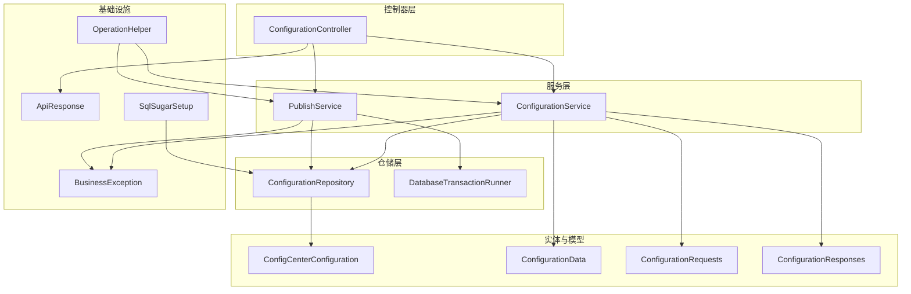
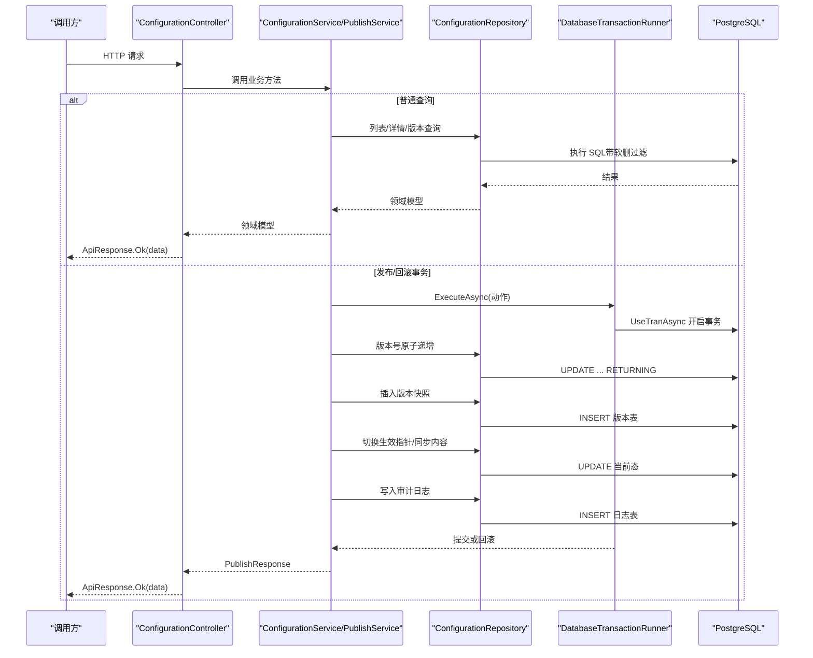
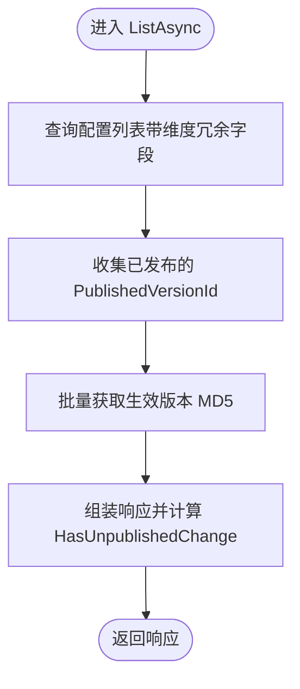
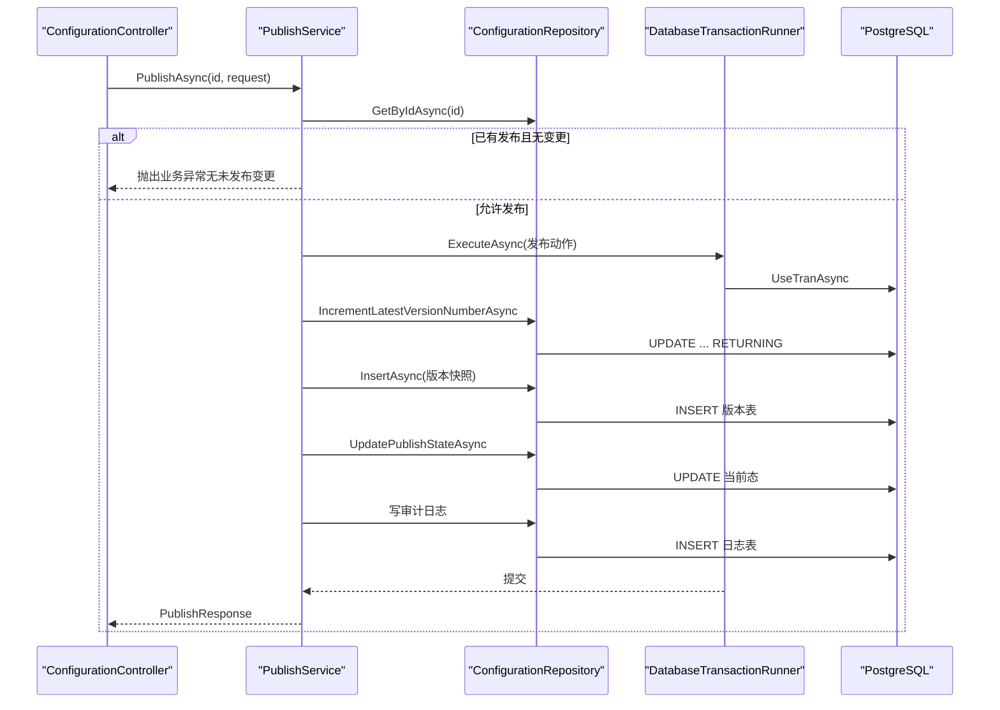
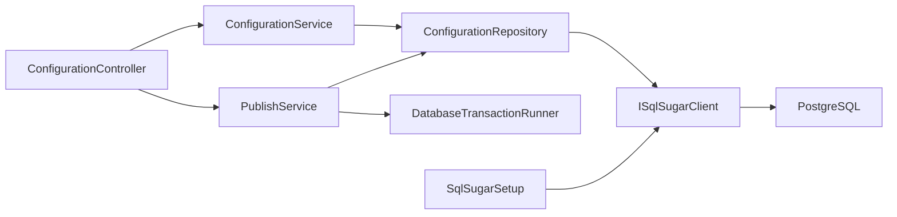

# 后端开发指南

<cite>
**本文引用的文件**
- [Program.cs](file://k_config_center/Program.cs)
- [appsettings.json](file://k_config_center/appsettings.json)
- [ApiResponse.cs](file://k_config_center/src/Infrastructure/ApiResponse.cs)
- [BusinessException.cs](file://k_config_center/src/Infrastructure/BusinessException.cs)
- [SqlSugarSetup.cs](file://k_config_center/src/Infrastructure/SqlSugarSetup.cs)
- [OperationHelper.cs](file://k_config_center/src/Infrastructure/OperationHelper.cs)
- [ConfigurationController.cs](file://k_config_center/src/Controllers/ConfigurationController.cs)
- [ConfigurationService.cs](file://k_config_center/src/Services/ConfigurationService.cs)
- [PublishService.cs](file://k_config_center/src/Services/PublishService.cs)
- [ConfigurationRepository.cs](file://k_config_center/src/Repositories/ConfigurationRepository.cs)
- [DatabaseTransactionRunner.cs](file://k_config_center/src/Repositories/DatabaseTransactionRunner.cs)
- [ConfigCenterConfiguration.cs](file://k_config_center/src/Entities/ConfigCenterConfiguration.cs)
- [ConfigurationData.cs](file://k_config_center/src/Models/Domain/ConfigurationData.cs)
- [ConfigurationRequests.cs](file://k_config_center/src/Models/Requests/ConfigurationRequests.cs)
- [ConfigurationResponses.cs](file://k_config_center/src/Models/Responses/ConfigurationResponses.cs)
</cite>

## 目录
1. [简介](#简介)
2. [项目结构](#项目结构)
3. [核心组件](#核心组件)
4. [架构总览](#架构总览)
5. [详细组件分析](#详细组件分析)
6. [依赖关系分析](#依赖关系分析)
7. [性能考虑](#性能考虑)
8. [故障排查指南](#故障排查指南)
9. [结论](#结论)
10. [附录](#附录)

## 简介
本指南面向后端开发者，系统说明配置中心后端的分层架构与模块组织方式（Controllers、Services、Repositories、Entities），统一 API 接口设计规范（RESTful、统一响应格式、错误处理机制），业务逻辑实现模式（配置编辑、发布、回滚、下线等核心流程），以及数据访问层设计（仓储模式、事务管理、软删除）。文档提供代码级流程图与时序图，帮助快速理解并扩展功能。

## 项目结构
后端采用典型的三层+基础设施划分：
- Controllers：仅负责参数接收与响应包装，不承载业务逻辑
- Services：封装业务规则与跨表编排（发布/回滚等事务型操作）
- Repositories：数据访问抽象，按实体/聚合拆分，屏蔽 SqlSugar 细节
- Entities：数据库表映射（DbFirst，禁用 CodeFirst）
- Models：请求/响应/领域模型，隔离 DTO 与持久化实体
- Infrastructure：统一响应、异常、工具类、数据库初始化与全局过滤器

图表来源
- [Program.cs:10-35](file://k_config_center/Program.cs#L10-L35)
- [ConfigurationController.cs:8-13](file://k_config_center/src/Controllers/ConfigurationController.cs#L8-L13)
- [ConfigurationService.cs:13-18](file://k_config_center/src/Services/ConfigurationService.cs#L13-L18)
- [PublishService.cs:14-19](file://k_config_center/src/Services/PublishService.cs#L14-L19)
- [ConfigurationRepository.cs:9-9](file://k_config_center/src/Repositories/ConfigurationRepository.cs#L9-L9)
- [DatabaseTransactionRunner.cs:9-9](file://k_config_center/src/Repositories/DatabaseTransactionRunner.cs#L9-L9)
- [ConfigCenterConfiguration.cs:6-6](file://k_config_center/src/Entities/ConfigCenterConfiguration.cs#L6-L6)
- [ConfigurationData.cs:5-14](file://k_config_center/src/Models/Domain/ConfigurationData.cs#L5-L14)
- [ConfigurationRequests.cs:3-26](file://k_config_center/src/Models/Requests/ConfigurationRequests.cs#L3-L26)
- [ConfigurationResponses.cs:5-74](file://k_config_center/src/Models/Responses/ConfigurationResponses.cs#L5-L74)
- [ApiResponse.cs:3-9](file://k_config_center/src/Infrastructure/ApiResponse.cs#L3-L9)
- [BusinessException.cs:3-10](file://k_config_center/src/Infrastructure/BusinessException.cs#L3-L10)
- [SqlSugarSetup.cs:6-40](file://k_config_center/src/Infrastructure/SqlSugarSetup.cs#L6-L40)
- [OperationHelper.cs:6-28](file://k_config_center/src/Infrastructure/OperationHelper.cs#L6-L28)

章节来源
- [Program.cs:10-35](file://k_config_center/Program.cs#L10-L35)
- [appsettings.json:9-11](file://k_config_center/appsettings.json#L9-L11)

## 核心组件
- 统一响应与错误
  - 统一响应体 ApiResponse：HTTP 一律 200，业务失败通过 code/message/data 表达
  - 业务异常 BusinessException：携带分段错误码，由全局中间件转换为统一响应
  - 全局异常处理：在 Program 中注册，捕获业务异常返回 200 + 业务码；非业务异常记录日志并返回 10000 服务器内部错误
- 数据库与事务
  - SqlSugarSetup：注册 ISqlSugarClient 单例，启用全局软删除过滤器（含 DeletedAt 的实体默认过滤 deleted_at IS NULL）
  - DatabaseTransactionRunner：以 UseTranAsync 包裹跨 Repository 的事务，Service 不直接持有数据库客户端
- 控制器与服务
  - ConfigurationController：路由 /api/configurations，仅做参数接收与 ApiResponse 包装
  - ConfigurationService：配置编辑（草稿）、详情、版本查询；MD5 服务端计算；未发布变更判定
  - PublishService：发布/回滚/下线，事务内完成「版本号原子递增 → 写快照 → 切换生效指针 → 写审计日志」
- 仓储与实体
  - ConfigurationRepository：当前态 CRUD、发布相关原子更新、客户端五表联查；对外暴露领域模型
  - ConfigCenterConfiguration：配置项实体（当前态），包含状态机字段与软删除标记

章节来源
- [ApiResponse.cs:3-9](file://k_config_center/src/Infrastructure/ApiResponse.cs#L3-L9)
- [BusinessException.cs:3-10](file://k_config_center/src/Infrastructure/BusinessException.cs#L3-L10)
- [Program.cs:71-92](file://k_config_center/Program.cs#L71-L92)
- [SqlSugarSetup.cs:12-40](file://k_config_center/src/Infrastructure/SqlSugarSetup.cs#L12-L40)
- [DatabaseTransactionRunner.cs:9-17](file://k_config_center/src/Repositories/DatabaseTransactionRunner.cs#L9-L17)
- [ConfigurationController.cs:8-13](file://k_config_center/src/Controllers/ConfigurationController.cs#L8-L13)
- [ConfigurationService.cs:9-18](file://k_config_center/src/Services/ConfigurationService.cs#L9-L18)
- [PublishService.cs:9-19](file://k_config_center/src/Services/PublishService.cs#L9-L19)
- [ConfigurationRepository.cs:7-9](file://k_config_center/src/Repositories/ConfigurationRepository.cs#L7-L9)
- [ConfigCenterConfiguration.cs:5-6](file://k_config_center/src/Entities/ConfigCenterConfiguration.cs#L5-L6)

## 架构总览
整体采用“控制器薄、服务厚、仓储专”的分层架构，结合 SqlSugarScope 的环境事务与全局软删除过滤器，保证数据一致性与可审计性。

图表来源
- [ConfigurationController.cs:22-113](file://k_config_center/src/Controllers/ConfigurationController.cs#L22-L113)
- [ConfigurationService.cs:25-108](file://k_config_center/src/Services/ConfigurationService.cs#L25-L108)
- [PublishService.cs:27-114](file://k_config_center/src/Services/PublishService.cs#L27-L114)
- [ConfigurationRepository.cs:75-124](file://k_config_center/src/Repositories/ConfigurationRepository.cs#L75-L124)
- [DatabaseTransactionRunner.cs:11-17](file://k_config_center/src/Repositories/DatabaseTransactionRunner.cs#L11-L17)
- [SqlSugarSetup.cs:16-38](file://k_config_center/src/Infrastructure/SqlSugarSetup.cs#L16-L38)

## 详细组件分析

### 控制器层：ConfigurationController
- 职责：定义 RESTful 路由，接收请求参数，委托 Service 处理，统一使用 ApiResponse 包装响应
- 关键端点
  - GET /api/configurations：列表（支持组/命名空间/环境/状态/关键字过滤）
  - GET /api/configurations/{id}：详情（当前态 + 生效版本快照）
  - POST /api/configurations：新建（初始 DRAFT，md5 服务端计算）
  - PUT /api/configurations/{id}：保存编辑（草稿，不产生版本）
  - DELETE /api/configurations/{id}：软删除
  - POST /api/configurations/{id}/publish：发布（事务）
  - POST /api/configurations/{id}/rollback：回滚（事务）
  - POST /api/configurations/{id}/offline：下线
  - GET /api/configurations/{id}/versions：版本历史分页
  - GET /api/configurations/{id}/versions/{versionNumber}：单个版本快照

章节来源
- [ConfigurationController.cs:8-114](file://k_config_center/src/Controllers/ConfigurationController.cs#L8-L114)

### 服务层：ConfigurationService
- 职责：配置编辑与查询的业务编排，计算 MD5，判断未发布变更，写审计日志
- 关键点
  - 列表时批量获取生效版本 MD5 进行内存比对，避免逐条回查
  - 创建/更新均不信任前端传入 MD5，统一在服务端计算
  - 软删除为叶子资源，无级联检查；版本与日志保留可审计

图表来源
- [ConfigurationService.cs:25-32](file://k_config_center/src/Services/ConfigurationService.cs#L25-L32)

章节来源
- [ConfigurationService.cs:9-108](file://k_config_center/src/Services/ConfigurationService.cs#L9-L108)

### 服务层：PublishService
- 职责：发布/回滚/下线的业务编排，确保版本号、快照、生效指针、日志四者一致性
- 关键点
  - 发布前校验：若已是 PUBLISHED 且内容与生效版本一致，拒绝重复发布（无未发布变更）
  - 回滚策略：不回退版本号，生成新快照（change_type=ROLLBACK），保持线性递增可追溯
  - 并发安全：版本号原子递增（UPDATE ... RETURNING），唯一约束兜底并发冲突

图表来源
- [PublishService.cs:27-114](file://k_config_center/src/Services/PublishService.cs#L27-L114)
- [ConfigurationRepository.cs:75-97](file://k_config_center/src/Repositories/ConfigurationRepository.cs#L75-L97)
- [DatabaseTransactionRunner.cs:11-17](file://k_config_center/src/Repositories/DatabaseTransactionRunner.cs#L11-L17)

章节来源
- [PublishService.cs:9-114](file://k_config_center/src/Services/PublishService.cs#L9-L114)

### 仓储层：ConfigurationRepository
- 职责：当前态表的读写、发布相关原子更新、客户端读取的五表联查；对外只暴露领域模型
- 关键点
  - 列表/详情：LeftJoin 命名空间/环境/配置组，显式带 deleted_at 条件，不依赖全局过滤器在联表中的行为
  - 版本号原子递增：数据库侧自增并返回，避免先读后写的竞态
  - 客户端读取：按业务 key 定位组，只取 status='PUBLISHED' 且未软删的配置，内容取自 published_version_id 指向的版本快照

章节来源
- [ConfigurationRepository.cs:7-124](file://k_config_center/src/Repositories/ConfigurationRepository.cs#L7-L124)

### 实体与模型
- 实体：ConfigCenterConfiguration（当前态），包含状态机字段（DRAFT/PUBLISHED/OFFLINE）、软删除标记、审计字段
- 领域模型：ConfigurationData（当前态）、ConfigurationVersionData（版本快照）
- 请求/响应：ConfigurationRequests、ConfigurationResponses，明确字段语义与约束

章节来源
- [ConfigCenterConfiguration.cs:5-65](file://k_config_center/src/Entities/ConfigCenterConfiguration.cs#L5-L65)
- [ConfigurationData.cs:5-14](file://k_config_center/src/Models/Domain/ConfigurationData.cs#L5-L14)
- [ConfigurationRequests.cs:3-26](file://k_config_center/src/Models/Requests/ConfigurationRequests.cs#L3-L26)
- [ConfigurationResponses.cs:5-74](file://k_config_center/src/Models/Responses/ConfigurationResponses.cs#L5-L74)

## 依赖关系分析
- 控制器依赖服务：ConfigurationController 依赖 ConfigurationService 与 PublishService
- 服务依赖仓储与基础设施：
  - ConfigurationService 依赖 ConfigurationRepository、ConfigurationVersionRepository、ConfigurationGroupRepository、OperationLogRepository、IHttpContextAccessor
  - PublishService 依赖 ConfigurationRepository、ConfigurationVersionRepository、OperationLogRepository、DatabaseTransactionRunner、IHttpContextAccessor
- 仓储依赖数据库：ConfigurationRepository 依赖 ISqlSugarClient（由 SqlSugarSetup 注册）
- 全局软删除：SqlSugarSetup 对含 DeletedAt 的实体添加全局查询过滤器
- 事务边界：DatabaseTransactionRunner 通过 UseTranAsync 将同一异步上下文内的 Repository 操作纳入同一事务

图表来源
- [Program.cs:14-35](file://k_config_center/Program.cs#L14-L35)
- [SqlSugarSetup.cs:12-40](file://k_config_center/src/Infrastructure/SqlSugarSetup.cs#L12-L40)
- [ConfigurationController.cs:8-13](file://k_config_center/src/Controllers/ConfigurationController.cs#L8-L13)
- [ConfigurationService.cs:13-18](file://k_config_center/src/Services/ConfigurationService.cs#L13-L18)
- [PublishService.cs:14-19](file://k_config_center/src/Services/PublishService.cs#L14-L19)
- [ConfigurationRepository.cs:9-9](file://k_config_center/src/Repositories/ConfigurationRepository.cs#L9-L9)
- [DatabaseTransactionRunner.cs:9-9](file://k_config_center/src/Repositories/DatabaseTransactionRunner.cs#L9-L9)

章节来源
- [Program.cs:14-35](file://k_config_center/Program.cs#L14-L35)
- [SqlSugarSetup.cs:12-40](file://k_config_center/src/Infrastructure/SqlSugarSetup.cs#L12-L40)

## 性能考虑
- 列表优化：批量获取生效版本 MD5 进行内存比对，避免逐条回查
- 联表优化：列表/详情 LeftJoin 维度表并显式带 deleted_at 条件，减少后续过滤开销
- 并发控制：版本号原子递增与唯一约束兜底，避免并发发布导致的数据不一致
- 软删除：全局过滤器减少重复 where 条件，提升查询可读性与一致性
- 连接池：SqlSugarScope 单例复用连接，减少连接创建开销

[本节为通用指导，不直接分析具体文件]

## 故障排查指南
- 统一错误码与响应
  - 业务异常：BusinessException 携带分段错误码，全局中间件将其转为 {code, message, data:null}，HTTP 仍为 200
  - 非业务异常：记录结构化日志（含堆栈），返回 10000 服务器内部错误，避免泄露内部细节
- 常见错误场景
  - 唯一冲突：如配置 key 冲突、发布并发冲突，通过 OperationHelper.IsUniqueViolation 识别并转业务错误码
  - 资源不存在：查询不到或已软删除，抛 ResourceNotFound
  - 无效状态：如非已发布配置不可下线，抛 InvalidBusinessState
- 调试建议
  - 查看全局异常中间件日志输出，确认 Method/Path 与异常信息
  - 检查数据库唯一约束是否命中（SQLSTATE 23505）
  - 核对请求头 X-Operator 是否正确传递，以便审计追踪

章节来源
- [Program.cs:71-92](file://k_config_center/Program.cs#L71-L92)
- [OperationHelper.cs:22-28](file://k_config_center/src/Infrastructure/OperationHelper.cs#L22-L28)
- [BusinessException.cs:3-10](file://k_config_center/src/Infrastructure/BusinessException.cs#L3-L10)
- [ApiResponse.cs:3-9](file://k_config_center/src/Infrastructure/ApiResponse.cs#L3-L9)

## 结论
本项目采用清晰的分层架构与严格的模块边界，配合统一响应、全局异常处理、全局软删除与事务编排，实现了高内聚、低耦合的可维护后端系统。发布/回滚等关键路径通过原子递增与唯一约束保障并发安全，审计日志贯穿全链路便于问题回溯。遵循本文规范与最佳实践，可高效扩展新功能并保持系统稳定性。

[本节为总结性内容，不直接分析具体文件]

## 附录
- 配置与启动
  - 连接字符串：在 appsettings.json 的 ConnectionStrings:PostgreSQL 中配置
  - 服务注册：Program 中集中注册 Repository、Service、Swagger 等
- 接口契约
  - 统一响应：{code, message, data}，HTTP 一律 200，业务失败由 code 表达
  - 错误码分段：0 成功；10000+ 通用；20000+ 基础维度；30000+ 配置与发布
- 最佳实践
  - 控制器只做参数接收与响应包装
  - 服务层承载业务规则与事务编排
  - 仓储层屏蔽数据库细节，对外暴露领域模型
  - 所有 MD5 由服务端计算，不信任前端传值
  - 软删除用于所有可删除资源，查询默认过滤 deleted_at

章节来源
- [appsettings.json:9-11](file://k_config_center/appsettings.json#L9-L11)
- [Program.cs:14-35](file://k_config_center/Program.cs#L14-L35)
- [ConfigurationRequests.cs:3-26](file://k_config_center/src/Models/Requests/ConfigurationRequests.cs#L3-L26)
- [ConfigurationResponses.cs:5-74](file://k_config_center/src/Models/Responses/ConfigurationResponses.cs#L5-L74)