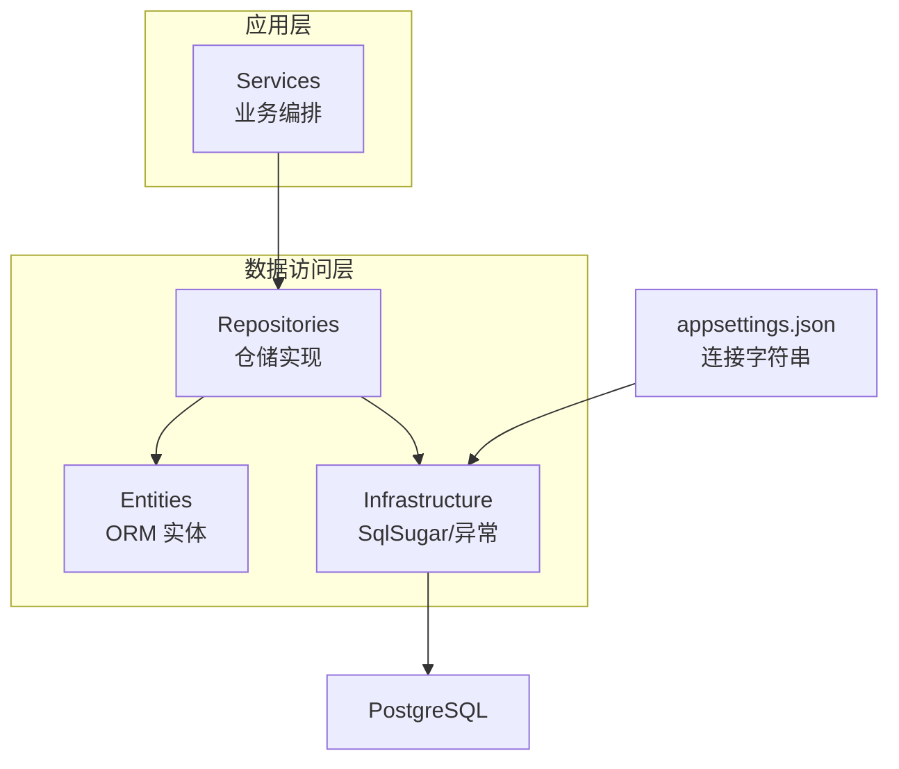
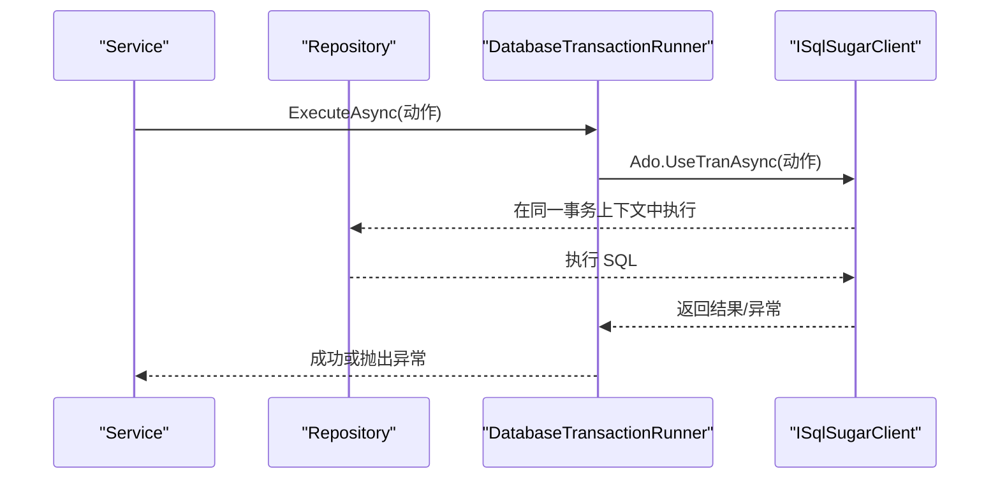
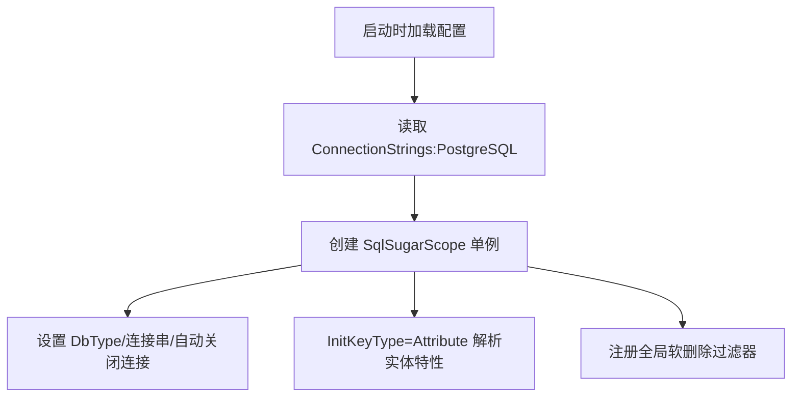
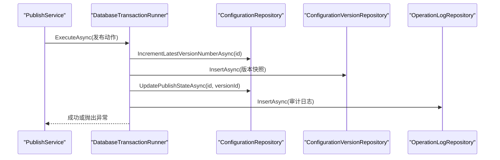
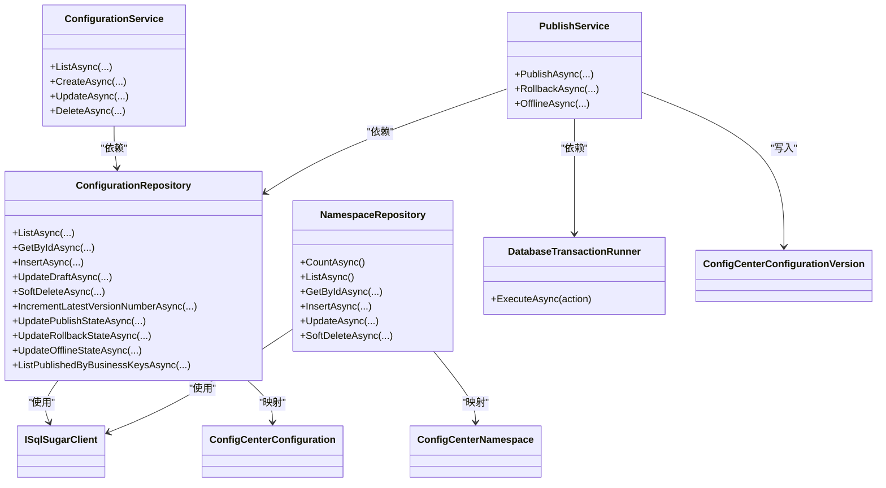

# 数据访问层

<cite>
**本文引用的文件**
- [SqlSugarSetup.cs](file://k_config_center/src/Infrastructure/SqlSugarSetup.cs)
- [DatabaseTransactionRunner.cs](file://k_config_center/src/Repositories/DatabaseTransactionRunner.cs)
- [ConfigurationRepository.cs](file://k_config_center/src/Repositories/ConfigurationRepository.cs)
- [ConfigurationGroupRepository.cs](file://k_config_center/src/Repositories/ConfigurationGroupRepository.cs)
- [NamespaceRepository.cs](file://k_config_center/src/Repositories/NamespaceRepository.cs)
- [ConfigCenterConfiguration.cs](file://k_config_center/src/Entities/ConfigCenterConfiguration.cs)
- [ConfigCenterNamespace.cs](file://k_config_center/src/Entities/ConfigCenterNamespace.cs)
- [ConfigCenterConfigurationVersion.cs](file://k_config_center/src/Entities/ConfigCenterConfigurationVersion.cs)
- [ConfigurationData.cs](file://k_config_center/src/Models/Domain/ConfigurationData.cs)
- [ConfigurationService.cs](file://k_config_center/src/Services/ConfigurationService.cs)
- [PublishService.cs](file://k_config_center/src/Services/PublishService.cs)
- [BusinessException.cs](file://k_config_center/src/Infrastructure/BusinessException.cs)
- [appsettings.json](file://k_config_center/appsettings.json)
- [配置中心建表脚本.sql](file://docs/数据库脚本/配置中心建表脚本.sql)
</cite>

## 目录
1. [简介](#简介)
2. [项目结构](#项目结构)
3. [核心组件](#核心组件)
4. [架构总览](#架构总览)
5. [详细组件分析](#详细组件分析)
6. [依赖关系分析](#依赖关系分析)
7. [性能与优化](#性能与优化)
8. [故障排查指南](#故障排查指南)
9. [结论](#结论)
10. [附录](#附录)

## 简介
本章节面向数据访问层，系统性说明仓储模式实现、Repository 接口设计、SqlSugar ORM 配置与使用、数据库事务管理机制（含 DatabaseTransactionRunner 的使用场景与最佳实践）、软删除原理与业务价值、实体映射与数据验证规则、复杂查询与性能优化策略，以及数据库连接管理与错误处理策略。目标是帮助开发者快速理解并正确扩展数据访问能力。

## 项目结构
数据访问层位于 k_config_center/src 下，按职责分层组织：
- Entities：实体模型，通过 SqlSugar 特性映射到 PostgreSQL 表
- Models/Domain：仓储对外暴露的业务数据记录（DTO），隔离实体细节
- Repositories：仓储实现，封装具体 SQL 操作，统一通过 ISqlSugarClient 访问数据库
- Infrastructure：基础设施，包含 SqlSugar 初始化、全局过滤器、异常类型等
- Services：业务服务，编排多个 Repository 完成跨表事务与业务流程

图表来源
- [SqlSugarSetup.cs:12-38](file://k_config_center/src/Infrastructure/SqlSugarSetup.cs#L12-L38)
- [appsettings.json:9-11](file://k_config_center/appsettings.json#L9-L11)

章节来源
- [SqlSugarSetup.cs:12-38](file://k_config_center/src/Infrastructure/SqlSugarSetup.cs#L12-L38)
- [appsettings.json:9-11](file://k_config_center/appsettings.json#L9-L11)

## 核心组件
- SqlSugar 客户端注册与全局软删除过滤器：集中管理连接、实体解析、全局过滤
- 仓储实现：每个领域对象一个 Repository，提供增删改查与复杂查询
- 事务运行器：DatabaseTransactionRunner 作为 Repository 层事务入口，Service 不直接持有 ISqlSugarClient
- 实体与 DTO：实体用于 ORM 映射，DTO 用于仓储对外契约
- 业务异常：BusinessException 承载业务错误码，配合全局异常处理

章节来源
- [SqlSugarSetup.cs:12-38](file://k_config_center/src/Infrastructure/SqlSugarSetup.cs#L12-L38)
- [DatabaseTransactionRunner.cs:9-17](file://k_config_center/src/Repositories/DatabaseTransactionRunner.cs#L9-L17)
- [ConfigurationRepository.cs:7-154](file://k_config_center/src/Repositories/ConfigurationRepository.cs#L7-L154)
- [ConfigurationData.cs:3-14](file://k_config_center/src/Models/Domain/ConfigurationData.cs#L3-L14)
- [BusinessException.cs:3-10](file://k_config_center/src/Infrastructure/BusinessException.cs#L3-L10)

## 架构总览
数据访问层采用仓储模式，Service 仅依赖 Repository 抽象方法；Repository 通过 DI 注入的 ISqlSugarClient 单例执行 SQL。发布/回滚等跨表事务由 Service 委托给 DatabaseTransactionRunner 在 UseTranAsync 中执行，同一异步上下文内的所有 Repository 自动参与该环境事务。

图表来源
- [DatabaseTransactionRunner.cs:13-17](file://k_config_center/src/Repositories/DatabaseTransactionRunner.cs#L13-L17)
- [SqlSugarSetup.cs:16-38](file://k_config_center/src/Infrastructure/SqlSugarSetup.cs#L16-L38)

章节来源
- [PublishService.cs:14-18](file://k_config_center/src/Services/PublishService.cs#L14-L18)
- [DatabaseTransactionRunner.cs:9-17](file://k_config_center/src/Repositories/DatabaseTransactionRunner.cs#L9-L17)

## 详细组件分析

### SqlSugar ORM 配置与使用
- 连接配置：从 appsettings.json 读取 ConnectionStrings:PostgreSQL，创建 SqlSugarScope 单例，DbType 为 PostgreSQL，IsAutoCloseConnection=true，InitKeyType=Attribute（基于实体特性解析表/列/主键/自增）
- 全局软删除过滤器：对命名空间、环境、配置组、配置项四个实体添加默认过滤条件 DeletedAt == null，需要读取已删除记录时可通过 ClearFilter 临时绕过
- 建表策略：禁用 CodeFirst 建表，DDL 由外部脚本维护，避免 ORM 与数据库结构漂移

图表来源
- [SqlSugarSetup.cs:12-38](file://k_config_center/src/Infrastructure/SqlSugarSetup.cs#L12-L38)
- [appsettings.json:9-11](file://k_config_center/appsettings.json#L9-L11)

章节来源
- [SqlSugarSetup.cs:12-38](file://k_config_center/src/Infrastructure/SqlSugarSetup.cs#L12-L38)
- [appsettings.json:9-11](file://k_config_center/appsettings.json#L9-L11)

### 仓储模式与 Repository 设计
- 单一职责：每个 Repository 对应一个领域实体，封装其全部数据库读写逻辑
- 对外契约：只暴露业务数据（Models/Domain），不泄露实体细节
- 查询风格：使用 Queryable 链式 API，支持 WhereIF 可选条件、OrderBy、Select 投影、LeftJoin/InnerJoin 联表
- 写入风格：Updateable/SetColumns 精确更新字段，Insertable 插入后回填自增 ID
- 软删除：SoftDelete 仅置 deleted_at，读查询受全局过滤器影响，写操作不受过滤器影响（需显式 Where 条件）

示例路径（不展示代码内容）
- 列表查询与联表带出冗余名称/业务 key：[ConfigurationRepository.cs:13-30](file://k_config_center/src/Repositories/ConfigurationRepository.cs#L13-L30)
- 按 id 获取详情：[ConfigurationRepository.cs:33-48](file://k_config_center/src/Repositories/ConfigurationRepository.cs#L33-L48)
- 插入并回填 ID：[ConfigurationRepository.cs:55-60](file://k_config_center/src/Repositories/ConfigurationRepository.cs#L55-L60)
- 软删除：[ConfigurationRepository.cs:70-73](file://k_config_center/src/Repositories/ConfigurationRepository.cs#L70-L73)

章节来源
- [ConfigurationRepository.cs:7-154](file://k_config_center/src/Repositories/ConfigurationRepository.cs#L7-L154)
- [ConfigurationGroupRepository.cs:7-78](file://k_config_center/src/Repositories/ConfigurationGroupRepository.cs#L7-L78)
- [NamespaceRepository.cs:7-67](file://k_config_center/src/Repositories/NamespaceRepository.cs#L7-L67)

### 数据库事务管理机制与 DatabaseTransactionRunner
- 使用场景：发布、回滚等跨多表操作需要原子性，必须在一个事务内完成版本号递增、快照写入、生效指针切换、日志写入
- 实现方式：Service 调用 DatabaseTransactionRunner.ExecuteAsync，内部通过 ISqlSugarClient.Adv.UseTranAsync 开启事务；任一异常整体回滚，并将原始异常抛出
- 最佳实践：
  - Service 不直接持有 ISqlSugarClient，避免事务边界混乱
  - 将“易失败”的操作（如唯一约束冲突）在事务内捕获并转换为业务异常
  - 审计日志写入纳入事务，保证业务变更与日志一致
  - 并发冲突通过唯一约束兜底，捕获后转业务错误码

图表来源
- [PublishService.cs:27-53](file://k_config_center/src/Services/PublishService.cs#L27-L53)
- [DatabaseTransactionRunner.cs:13-17](file://k_config_center/src/Repositories/DatabaseTransactionRunner.cs#L13-L17)
- [ConfigurationRepository.cs:75-90](file://k_config_center/src/Repositories/ConfigurationRepository.cs#L75-L90)

章节来源
- [PublishService.cs:27-108](file://k_config_center/src/Services/PublishService.cs#L27-L108)
- [DatabaseTransactionRunner.cs:9-17](file://k_config_center/src/Repositories/DatabaseTransactionRunner.cs#L9-L17)

### 软删除的实现原理与业务价值
- 原理：实体包含 DeletedAt 字段；SqlSugar 全局过滤器在查询时自动附加 DeletedAt == null 条件；写操作不受过滤器影响，需显式 Where 条件
- 业务价值：
  - 保留历史数据，便于审计回溯与恢复
  - 避免级联删除带来的数据丢失风险
  - 结合部分唯一索引，允许软删除后复用业务 key
- 注意事项：
  - 联表查询显式带上 DeletedAt 条件，避免依赖全局过滤器在联表中的行为差异
  - 存在性校验应在带过滤器的查询后进行，再执行写操作

章节来源
- [SqlSugarSetup.cs:28-36](file://k_config_center/src/Infrastructure/SqlSugarSetup.cs#L28-L36)
- [ConfigurationRepository.cs:13-25](file://k_config_center/src/Repositories/ConfigurationRepository.cs#L13-L25)
- [配置中心建表脚本.sql:43-44](file://docs/数据库脚本/配置中心建表脚本.sql#L43-L44)

### 实体映射配置与数据验证规则
- 实体映射：通过 SugarTable/SugarColumn 特性指定表名、列名、主键、自增、数据类型、长度、是否可空等
- 数据验证：
  - 格式限制：format 字段通过数据库 CHECK 约束限定取值
  - 状态限制：status 字段通过数据库 CHECK 约束限定取值
  - 唯一性：通过部分唯一索引（WHERE deleted_at IS NULL）实现软删除范围内的唯一约束
- 审计字段：created_by/updated_by/created_at/updated_at 由应用或触发器维护

章节来源
- [ConfigCenterConfiguration.cs:6-65](file://k_config_center/src/Entities/ConfigCenterConfiguration.cs#L6-L65)
- [ConfigCenterNamespace.cs:6-38](file://k_config_center/src/Entities/ConfigCenterNamespace.cs#L6-L38)
- [配置中心建表脚本.sql:157-159](file://docs/数据库脚本/配置中心建表脚本.sql#L157-L159)
- [配置中心建表脚本.sql:43-44](file://docs/数据库脚本/配置中心建表脚本.sql#L43-L44)

### 复杂查询与性能优化指导
- 五表联查：客户端读取路径通过 Inner Join 关联 namespace/environment/group/configuration/version，并按业务 key 定位，仅取 PUBLISHED 且未软删除的记录
- 冗余字段：configuration 表冗余 namespace_id/environment_id，减少高频读时的 JOIN 开销
- 选择性过滤：WhereIF 动态拼接条件，避免无效扫描
- 排序与分页：按 created_at 排序，必要时结合分页
- 索引建议：利用脚本中定义的部分唯一索引与复合索引提升查询效率

章节来源
- [ConfigurationRepository.cs:105-124](file://k_config_center/src/Repositories/ConfigurationRepository.cs#L105-L124)
- [配置中心建表脚本.sql:161-165](file://docs/数据库脚本/配置中心建表脚本.sql#L161-L165)

### 数据库连接管理与错误处理策略
- 连接管理：
  - 通过 SqlSugarScope 管理连接池与生命周期，IsAutoCloseConnection=true 自动释放连接
  - 连接字符串来自配置，缺失时抛出异常，便于早期发现配置问题
- 错误处理：
  - 业务异常 BusinessException 携带错误码，由全局异常中间件统一转为响应体
  - 唯一约束冲突（如重复发布、key 冲突）捕获后转换为业务异常
  - 事务异常原样抛出，交由上层统一处理

章节来源
- [SqlSugarSetup.cs:16-20](file://k_config_center/src/Infrastructure/SqlSugarSetup.cs#L16-L20)
- [BusinessException.cs:3-10](file://k_config_center/src/Infrastructure/BusinessException.cs#L3-L10)
- [PublishService.cs:100-108](file://k_config_center/src/Services/PublishService.cs#L100-L108)

## 依赖关系分析
- Service 依赖 Repository：ConfigurationService、PublishService 分别依赖对应的仓储以完成业务编排
- Repository 依赖 ISqlSugarClient：通过 DI 注入 SqlSugarScope 单例，确保事务上下文一致性
- 实体与 DTO：Repository 内部进行实体与 DTO 的转换，对外仅暴露 DTO
- 基础设施：SqlSugarSetup 提供 ORM 配置，BusinessException 提供业务异常类型

图表来源
- [ConfigurationService.cs:13-18](file://k_config_center/src/Services/ConfigurationService.cs#L13-L18)
- [PublishService.cs:14-19](file://k_config_center/src/Services/PublishService.cs#L14-L19)
- [ConfigurationRepository.cs:9-154](file://k_config_center/src/Repositories/ConfigurationRepository.cs#L9-L154)
- [NamespaceRepository.cs:9-67](file://k_config_center/src/Repositories/NamespaceRepository.cs#L9-L67)
- [DatabaseTransactionRunner.cs:9-17](file://k_config_center/src/Repositories/DatabaseTransactionRunner.cs#L9-L17)

章节来源
- [ConfigurationService.cs:13-109](file://k_config_center/src/Services/ConfigurationService.cs#L13-L109)
- [PublishService.cs:14-115](file://k_config_center/src/Services/PublishService.cs#L14-L115)

## 性能与优化
- 使用冗余字段减少 JOIN：configuration 表冗余 namespace_id/environment_id，降低高频读成本
- 选择性 WHERE 条件：WhereIF 动态拼接，避免全表扫描
- 原子递增版本号：通过数据库侧 UPDATE ... RETURNING 在行锁上串行化并发发布，避免先读后写的竞态
- 索引利用：部分唯一索引与复合索引提升查询与唯一性检查性能
- 批量投影：Select 仅选择必要字段，减少网络传输与内存占用

章节来源
- [ConfigurationRepository.cs:105-124](file://k_config_center/src/Repositories/ConfigurationRepository.cs#L105-L124)
- [ConfigurationRepository.cs:75-83](file://k_config_center/src/Repositories/ConfigurationRepository.cs#L75-L83)
- [配置中心建表脚本.sql:161-165](file://docs/数据库脚本/配置中心建表脚本.sql#L161-L165)

## 故障排查指南
- 连接字符串缺失：启动时报错提示缺少 ConnectionStrings:PostgreSQL，检查 appsettings.json
- 唯一约束冲突：
  - 配置 key 冲突：捕获唯一约束异常，转换为业务错误码
  - 发布并发冲突：捕获唯一约束异常，转换为并发冲突业务错误码
- 软删除查询异常：联表查询显式带上 DeletedAt 条件，避免依赖全局过滤器行为不一致
- 事务异常：DatabaseTransactionRunner 会抛出原始异常，检查上游 Repository 操作与业务异常转换

章节来源
- [SqlSugarSetup.cs:16-20](file://k_config_center/src/Infrastructure/SqlSugarSetup.cs#L16-L20)
- [ConfigurationService.cs:58-60](file://k_config_center/src/Services/ConfigurationService.cs#L58-L60)
- [PublishService.cs:100-108](file://k_config_center/src/Services/PublishService.cs#L100-L108)
- [DatabaseTransactionRunner.cs:13-17](file://k_config_center/src/Repositories/DatabaseTransactionRunner.cs#L13-L17)

## 结论
数据访问层通过仓储模式清晰分离了业务与数据访问，借助 SqlSugar ORM 实现了高效的实体映射与查询；DatabaseTransactionRunner 提供了简洁的事务编排机制，确保发布/回滚等关键操作的原子性与一致性；软删除与部分唯一索引在保证数据安全的同时提升了灵活性；通过冗余字段、选择性过滤与数据库约束等手段，兼顾了性能与正确性。遵循本文档的最佳实践，可有效扩展与维护数据访问能力。

## 附录
- 建表脚本位置：docs/数据库脚本/配置中心建表脚本.sql
- 连接字符串配置位置：appsettings.json 的 ConnectionStrings:PostgreSQL
- 实体映射参考：各 Entity 文件中的 SugarTable/SugarColumn 特性
- 仓储方法参考：各 Repository 文件中的公共方法