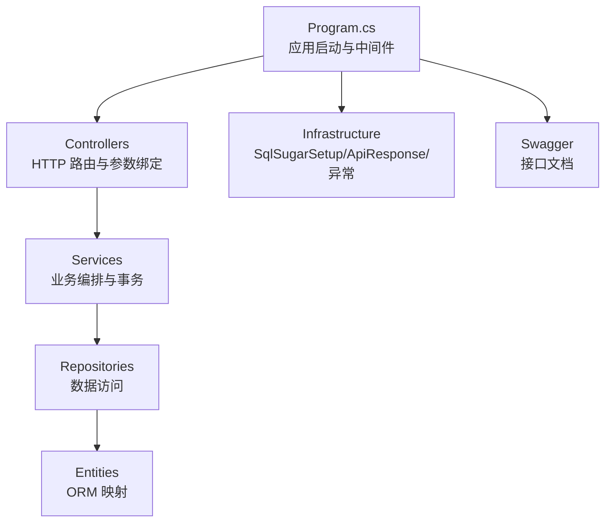
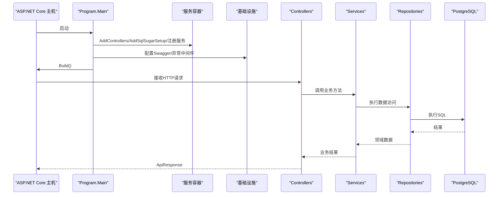
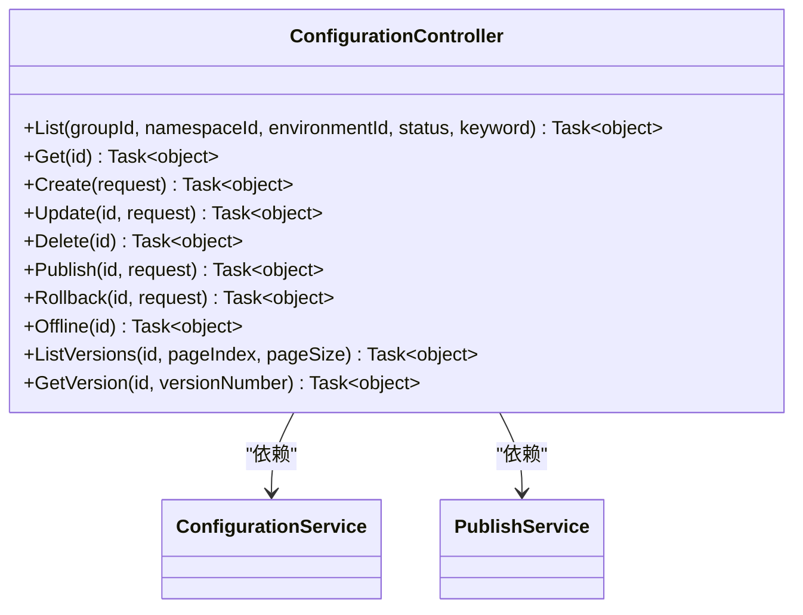
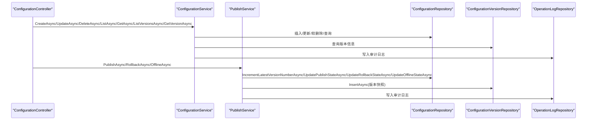
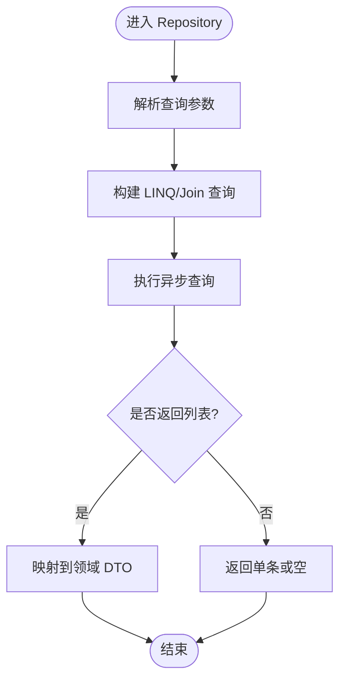
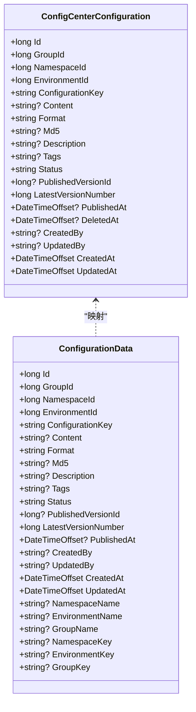
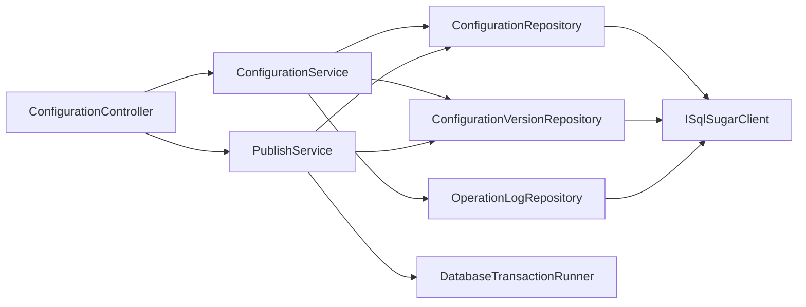

# 项目结构

<cite>
**本文引用的文件**
- [Program.cs](file://k_config_center/Program.cs)
- [k_config_center.csproj](file://k_config_center/k_config_center.csproj)
- [appsettings.json](file://k_config_center/appsettings.json)
- [SqlSugarSetup.cs](file://k_config_center/src/Infrastructure/SqlSugarSetup.cs)
- [ApiResponse.cs](file://k_config_center/src/Infrastructure/ApiResponse.cs)
- [ConfigurationController.cs](file://k_config_center/src/Controllers/ConfigurationController.cs)
- [ConfigurationService.cs](file://k_config_center/src/Services/ConfigurationService.cs)
- [PublishService.cs](file://k_config_center/src/Services/PublishService.cs)
- [ConfigurationRepository.cs](file://k_config_center/src/Repositories/ConfigurationRepository.cs)
- [ConfigCenterConfiguration.cs](file://k_config_center/src/Entities/ConfigCenterConfiguration.cs)
- [ConfigurationData.cs](file://k_config_center/src/Models/Domain/ConfigurationData.cs)
</cite>

## 目录
1. [简介](#简介)
2. [项目结构](#项目结构)
3. [核心组件](#核心组件)
4. [架构总览](#架构总览)
5. [详细组件分析](#详细组件分析)
6. [依赖关系分析](#依赖关系分析)
7. [性能考量](#性能考量)
8. [故障排查指南](#故障排查指南)
9. [结论](#结论)
10. [附录：新增业务模块示例](#附录新增业务模块示例)

## 简介
本项目是一个基于 ASP.NET Core 的配置中心后端，采用分层架构（Controllers / Services / Repositories / Entities），通过依赖注入组织服务生命周期，使用 SqlSugar 作为 ORM，PostgreSQL 作为数据库。系统提供配置项的编辑、发布、回滚、下线与客户端读取能力，并附带统一响应格式、全局异常处理、Swagger 文档与审计日志等基础设施。

## 项目结构
后端代码位于 k_config_center/src 下，按职责清晰划分：
- Controllers：HTTP 接口层，仅负责参数接收、调用 Service、包装 ApiResponse。
- Services：业务编排层，封装业务流程、事务边界、跨 Repository 协作。
- Repositories：数据访问层，封装 SQL 查询与写操作，对外暴露领域数据对象。
- Entities：数据库表映射实体，仅做映射，不参与业务逻辑。
- Models：请求/响应/领域数据传输对象，隔离 API 契约与内部实现。
- Infrastructure：横切关注点（统一响应、异常、SQL 初始化、Swagger 过滤器）。

图表来源
- [Program.cs:10-107](file://k_config_center/Program.cs#L10-L107)
- [SqlSugarSetup.cs:12-40](file://k_config_center/src/Infrastructure/SqlSugarSetup.cs#L12-L40)
- [ApiResponse.cs:3-9](file://k_config_center/src/Infrastructure/ApiResponse.cs#L3-L9)

章节来源
- [Program.cs:10-107](file://k_config_center/Program.cs#L10-L107)
- [k_config_center.csproj:1-21](file://k_config_center/k_config_center.csproj#L1-L21)
- [appsettings.json:1-13](file://k_config_center/appsettings.json#L1-L13)

## 核心组件
- 控制器层：以 ConfigurationController 为例，定义 RESTful 路由，委托给 ConfigurationService 与 PublishService，统一返回 ApiResponse。
- 服务层：ConfigurationService 管理配置的草稿编辑、详情与版本查询；PublishService 管理发布、回滚、下线等事务型操作。
- 仓储层：ConfigurationRepository 封装当前态与版本相关的数据访问，包含并发安全的版本号递增、生效指针切换、五表联查客户端读取等。
- 实体层：ConfigCenterConfiguration 映射配置表，字段与列名通过特性显式映射。
- 模型层：ConfigurationData 为仓储对外暴露的业务数据记录，屏蔽实体细节。
- 基础设施：SqlSugarSetup 注册 ISqlSugarClient 单例并启用全局软删除过滤；ApiResponse 统一响应结构；全局异常中间件将 BusinessException 转为 200 + code。

章节来源
- [ConfigurationController.cs:8-114](file://k_config_center/src/Controllers/ConfigurationController.cs#L8-L114)
- [ConfigurationService.cs:9-109](file://k_config_center/src/Services/ConfigurationService.cs#L9-L109)
- [PublishService.cs:9-115](file://k_config_center/src/Services/PublishService.cs#L9-L115)
- [ConfigurationRepository.cs:7-155](file://k_config_center/src/Repositories/ConfigurationRepository.cs#L7-L155)
- [ConfigCenterConfiguration.cs:5-66](file://k_config_center/src/Entities/ConfigCenterConfiguration.cs#L5-L66)
- [ConfigurationData.cs:3-15](file://k_config_center/src/Models/Domain/ConfigurationData.cs#L3-L15)
- [SqlSugarSetup.cs:6-40](file://k_config_center/src/Infrastructure/SqlSugarSetup.cs#L6-L40)
- [ApiResponse.cs:3-9](file://k_config_center/src/Infrastructure/ApiResponse.cs#L3-L9)

## 架构总览
系统采用典型的 Web 分层架构，配合依赖注入容器进行服务装配。启动流程包括：
- 构建 WebApplication 并注册 MVC 控制器、SqlSugar 客户端、HttpContextAccessor。
- 按模块注册各 Repository 与 Service 为 Scoped 生命周期。
- 配置 Swagger（开发环境启用 UI）与 XML 注释。
- 注册全局异常处理中间件，将业务异常转换为统一响应。
- 启用 HTTPS 重定向、静态文件托管、控制器路由与 SPA 兜底。

图表来源
- [Program.cs:12-107](file://k_config_center/Program.cs#L12-L107)
- [SqlSugarSetup.cs:12-40](file://k_config_center/src/Infrastructure/SqlSugarSetup.cs#L12-L40)

章节来源
- [Program.cs:12-107](file://k_config_center/Program.cs#L12-L107)

## 详细组件分析

### 控制器层（以配置管理为例）
- 路由与职责：/api/configurations 下的列表、详情、创建、更新、删除、发布、回滚、下线、版本历史等端点。
- 参数校验与响应：由框架与业务异常共同保证，控制器不承载复杂校验，直接返回 ApiResponse。
- 依赖注入：构造函数注入 ConfigurationService 与 PublishService。

图表来源
- [ConfigurationController.cs:8-114](file://k_config_center/src/Controllers/ConfigurationController.cs#L8-L114)

章节来源
- [ConfigurationController.cs:8-114](file://k_config_center/src/Controllers/ConfigurationController.cs#L8-L114)

### 服务层（配置与发布）
- ConfigurationService：负责配置的草稿编辑、详情与版本查询，计算未发布变更标记，写入审计日志。
- PublishService：封装发布、回滚、下线的事务流程，确保版本号、快照、生效指针、日志的一致性。

图表来源
- [ConfigurationService.cs:23-109](file://k_config_center/src/Services/ConfigurationService.cs#L23-L109)
- [PublishService.cs:27-115](file://k_config_center/src/Services/PublishService.cs#L27-L115)
- [ConfigurationRepository.cs:54-124](file://k_config_center/src/Repositories/ConfigurationRepository.cs#L54-L124)

章节来源
- [ConfigurationService.cs:23-109](file://k_config_center/src/Services/ConfigurationService.cs#L23-L109)
- [PublishService.cs:27-115](file://k_config_center/src/Services/PublishService.cs#L27-L115)

### 仓储层（数据访问）
- 列表与详情：多表左连接带出冗余名称与业务 key，避免在 Service 层拼接复杂查询。
- 并发安全：版本号递增使用数据库侧 UPDATE ... RETURNING，行锁串行化并发发布。
- 客户端读取：五表内连接按业务 key 定位已发布的配置内容，取版本快照。

图表来源
- [ConfigurationRepository.cs:11-48](file://k_config_center/src/Repositories/ConfigurationRepository.cs#L11-L48)
- [ConfigurationRepository.cs:105-124](file://k_config_center/src/Repositories/ConfigurationRepository.cs#L105-L124)

章节来源
- [ConfigurationRepository.cs:11-155](file://k_config_center/src/Repositories/ConfigurationRepository.cs#L11-L155)

### 实体层与模型层
- 实体：ConfigCenterConfiguration 通过 SqlSugar 特性映射表结构与列名，包含状态、版本、时间戳与软删除字段。
- 模型：ConfigurationData 为仓储对外暴露的记录类型，屏蔽实体细节，便于 Service 与 Controller 解耦。

图表来源
- [ConfigCenterConfiguration.cs:5-66](file://k_config_center/src/Entities/ConfigCenterConfiguration.cs#L5-L66)
- [ConfigurationData.cs:3-15](file://k_config_center/src/Models/Domain/ConfigurationData.cs#L3-L15)

章节来源
- [ConfigCenterConfiguration.cs:5-66](file://k_config_center/src/Entities/ConfigCenterConfiguration.cs#L5-L66)
- [ConfigurationData.cs:3-15](file://k_config_center/src/Models/Domain/ConfigurationData.cs#L3-L15)

## 依赖关系分析
- 控制器依赖服务：ConfigurationController 依赖 ConfigurationService 与 PublishService。
- 服务依赖仓储：ConfigurationService 依赖多个 Repository；PublishService 依赖 ConfigurationRepository、ConfigurationVersionRepository、OperationLogRepository 与 DatabaseTransactionRunner。
- 仓储依赖 ORM：所有 Repository 通过 ISqlSugarClient 访问数据库。
- 基础设施：SqlSugarSetup 提供 ISqlSugarClient 单例；ApiResponse 与全局异常中间件统一响应与错误处理。

图表来源
- [ConfigurationController.cs:8-114](file://k_config_center/src/Controllers/ConfigurationController.cs#L8-L114)
- [ConfigurationService.cs:13-18](file://k_config_center/src/Services/ConfigurationService.cs#L13-L18)
- [PublishService.cs:14-19](file://k_config_center/src/Services/PublishService.cs#L14-L19)
- [SqlSugarSetup.cs:12-40](file://k_config_center/src/Infrastructure/SqlSugarSetup.cs#L12-L40)

章节来源
- [ConfigurationController.cs:8-114](file://k_config_center/src/Controllers/ConfigurationController.cs#L8-L114)
- [ConfigurationService.cs:13-18](file://k_config_center/src/Services/ConfigurationService.cs#L13-L18)
- [PublishService.cs:14-19](file://k_config_center/src/Services/PublishService.cs#L14-L19)
- [SqlSugarSetup.cs:12-40](file://k_config_center/src/Infrastructure/SqlSugarSetup.cs#L12-L40)

## 性能考量
- 列表查询优化：一次性取出全部生效版本的 md5 做内存比对，避免逐条回查数据库。
- 并发控制：版本号递增使用数据库原子操作，避免“先读后写”竞态；唯一约束兜底冲突。
- 查询效率：多表左连接显式带上软删除条件，减少不必要 JOIN 开销；客户端读取使用内连接精准定位已发布配置。
- 连接管理：ISqlSugarClient 以 Scope 方式管理连接，IsAutoCloseConnection=true 自动释放。

[本节为通用性能建议，不直接分析具体文件]

## 故障排查指南
- 全局异常处理：BusinessException 统一转 200 + code；客户端断开静默忽略；其他异常记录结构化日志并返回 500。
- 常见错误码：资源不存在、参数校验失败、服务器内部错误、配置 key 冲突、无未发布变更、回滚版本不存在、发布并发冲突等。
- 调试建议：检查连接字符串配置、确认 Swagger 文档生成路径、查看审计日志与异常日志。

章节来源
- [Program.cs:71-92](file://k_config_center/Program.cs#L71-L92)
- [ApiResponse.cs:3-9](file://k_config_center/src/Infrastructure/ApiResponse.cs#L3-L9)

## 结论
本项目采用清晰的分层架构与依赖注入模式，控制器薄、服务厚、仓储专注数据访问，实体仅做映射。通过统一的响应与异常处理、Swagger 文档与审计日志，提供了可维护、可扩展的配置中心后端基础。发布与回滚等关键流程通过事务与数据库原子操作保障一致性，适合在生产环境中稳定运行。

[本节为总结性内容，不直接分析具体文件]

## 附录：新增业务模块示例
以下以“新增一个资源模块”为例，展示如何遵循现有规范组织代码与服务注册：

- 目录与命名
  - Controllers：新建 XxxController.cs，路由前缀 /api/xxx，方法返回 ApiResponse。
  - Services：新建 XxxService.cs，封装业务逻辑与事务边界。
  - Repositories：新建 XxxRepository.cs，封装 CRUD 与复杂查询，对外暴露领域 DTO。
  - Entities：新建 ConfigCenterXxx.cs，使用 SqlSugar 特性映射表结构。
  - Models：新建 Requests/XxxRequests.cs、Responses/XxxResponses.cs、Domain/XxxData.cs。
  - Infrastructure：如需新过滤器或工具，放入 Infrastructure 目录。

- 服务注册
  - 在 Program.cs 中按模块注册 Repository 与 Service 为 Scoped。
  - 若涉及数据库初始化或全局过滤器，扩展 SqlSugarSetup。

- 控制器示例要点
  - 构造函数注入对应 Service。
  - 方法签名简洁，参数由模型承载，返回 ApiResponse.Ok/Fail。
  - 路由与 HTTP 动词明确，XML 注释供 Swagger 生成。

- 服务示例要点
  - 单一职责：一个 Service 管一种资源。
  - 事务：通过 DatabaseTransactionRunner 编排多 Repository 操作。
  - 审计日志：统一通过 OperationLogRepository 记录操作人与 IP。

- 仓储示例要点
  - 对外只暴露领域 DTO，不泄露实体。
  - 复杂查询使用 Join 与 WhereIF 动态拼装。
  - 并发敏感操作使用数据库原子语句。

章节来源
- [Program.cs:14-34](file://k_config_center/Program.cs#L14-L34)
- [ConfigurationController.cs:8-114](file://k_config_center/src/Controllers/ConfigurationController.cs#L8-L114)
- [ConfigurationService.cs:9-109](file://k_config_center/src/Services/ConfigurationService.cs#L9-L109)
- [PublishService.cs:9-115](file://k_config_center/src/Services/PublishService.cs#L9-L115)
- [ConfigurationRepository.cs:7-155](file://k_config_center/src/Repositories/ConfigurationRepository.cs#L7-L155)
- [SqlSugarSetup.cs:6-40](file://k_config_center/src/Infrastructure/SqlSugarSetup.cs#L6-L40)