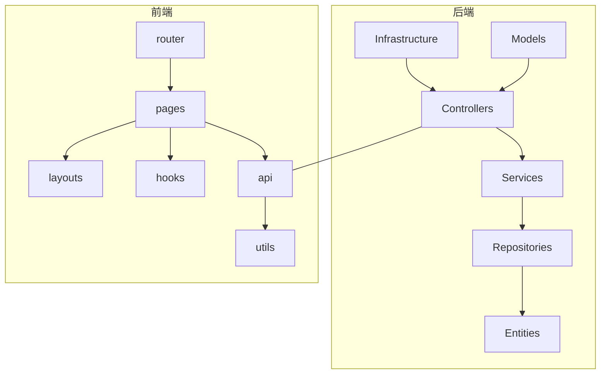
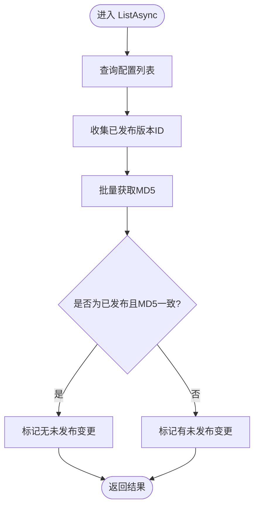
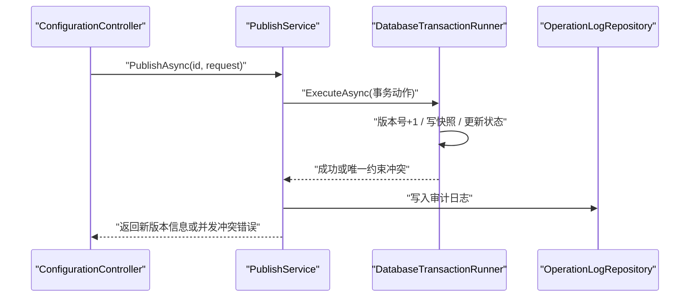
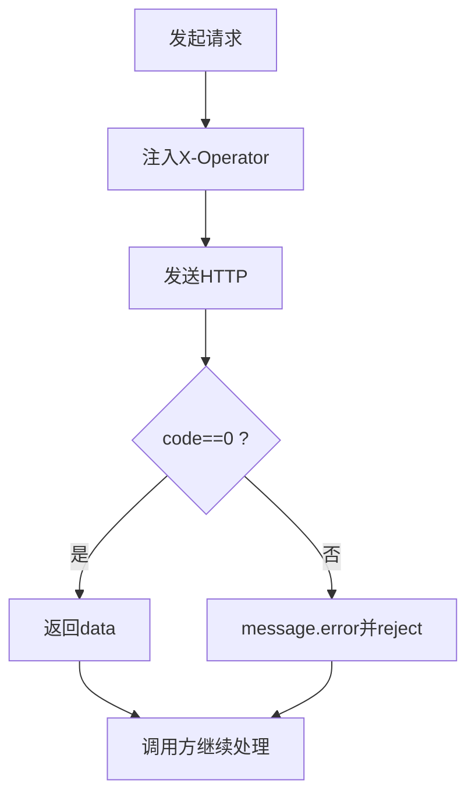
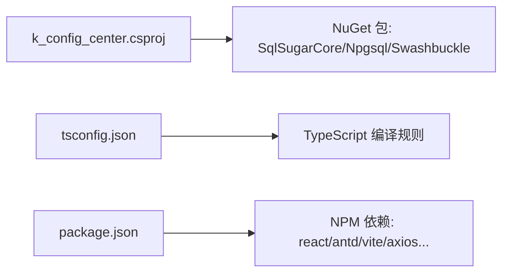

# 开发规范

<cite>
**本文引用的文件**
- [Program.cs](file://k_config_center/Program.cs)
- [appsettings.json](file://k_config_center/appsettings.json)
- [k_config_center.csproj](file://k_config_center/k_config_center.csproj)
- [ApiResponse.cs](file://k_config_center/src/Infrastructure/ApiResponse.cs)
- [BusinessException.cs](file://k_config_center/src/Infrastructure/BusinessException.cs)
- [OperationHelper.cs](file://k_config_center/src/Infrastructure/OperationHelper.cs)
- [ConfigurationController.cs](file://k_config_center/src/Controllers/ConfigurationController.cs)
- [ConfigurationService.cs](file://k_config_center/src/Services/ConfigurationService.cs)
- [ConfigCenterConfiguration.cs](file://k_config_center/src/Entities/ConfigCenterConfiguration.cs)
- [http.ts](file://web/src/api/http.ts)
- [main.tsx](file://web/src/main.tsx)
- [App.tsx](file://web/src/App.tsx)
- [index.tsx](file://web/src/router/index.tsx)
- [package.json](file://web/package.json)
- [tsconfig.json](file://web/tsconfig.json)
</cite>

## 目录
1. [引言](#引言)
2. [项目结构](#项目结构)
3. [核心组件](#核心组件)
4. [架构总览](#架构总览)
5. [详细组件分析](#详细组件分析)
6. [依赖关系分析](#依赖关系分析)
7. [性能与可维护性](#性能与可维护性)
8. [故障排查指南](#故障排查指南)
9. [结论](#结论)
10. [附录：编码规范、Git 工作流、测试与质量保证](#附录编码规范git-工作流测试与质量保证)

## 引言
本规范面向配置中心项目的 C# 后端与 TypeScript 前端，统一代码组织、命名约定、注释规范、错误处理、API 契约、构建与发布流程，以及 Git 分支策略、测试与代码审查要求。目标是提升一致性、可维护性与交付质量。

## 项目结构
- 后端采用 ASP.NET Core Web API，分层清晰：
  - Controllers：仅负责参数接收与响应包装
  - Services：业务逻辑（编辑、查询、发布等）
  - Repositories：数据访问（按模块划分，唯一允许接触 Entities 的层）
  - Entities：数据库映射模型
  - Infrastructure：基础设施（统一响应、异常、工具类、Swagger 过滤器）
  - Models：请求/响应/领域模型
- 前端基于 React + Ant Design + Vite + TypeScript：
  - pages：页面级路由组件
  - components：通用 UI 组件
  - hooks：复用逻辑
  - api：Axios 封装与各模块接口
  - router：集中式路由表
  - utils：工具函数
- 配置与构建：
  - 后端通过 appsettings.json 管理连接串与日志级别；csproj 启用 XML 文档生成与 Nullable
  - 前端通过 package.json 管理脚本与依赖；tsconfig.json 开启严格模式与路径别名



**图表来源**
- [Program.cs:10-107](file://k_config_center/Program.cs#L10-L107)
- [ConfigurationController.cs:8-114](file://k_config_center/src/Controllers/ConfigurationController.cs#L8-L114)
- [ConfigurationService.cs:9-109](file://k_config_center/src/Services/ConfigurationService.cs#L9-L109)
- [index.tsx:11-27](file://web/src/router/index.tsx#L11-L27)

**章节来源**
- [Program.cs:10-107](file://k_config_center/Program.cs#L10-L107)
- [k_config_center.csproj:1-21](file://k_config_center/k_config_center.csproj#L1-L21)
- [appsettings.json:1-13](file://k_config_center/appsettings.json#L1-L13)
- [package.json:1-33](file://web/package.json#L1-L33)
- [tsconfig.json:1-29](file://web/tsconfig.json#L1-L29)

## 核心组件
- 统一响应与异常
  - 统一响应体 { code, message, data }，HTTP 状态码一律 200，业务失败由 code 表达
  - 全局异常中间件捕获 BusinessException 并转为统一响应；非业务异常记录结构化日志后返回 500
- 操作审计与工具
  - 从请求头 X-Operator 提取操作人，缺省为 system；记录客户端 IP
  - MD5 计算在服务端进行，不信任前端传入值
- 控制器与服务边界
  - 控制器只做入参校验与响应包装；复杂事务型操作（发布/回滚/下线）交由 PublishService 处理
  - ConfigurationService 专注配置的编辑保存、详情与版本查询

**章节来源**
- [ApiResponse.cs:1-10](file://k_config_center/src/Infrastructure/ApiResponse.cs#L1-L10)
- [BusinessException.cs:1-11](file://k_config_center/src/Infrastructure/BusinessException.cs#L1-L11)
- [Program.cs:71-92](file://k_config_center/Program.cs#L71-L92)
- [OperationHelper.cs:6-29](file://k_config_center/src/Infrastructure/OperationHelper.cs#L6-L29)
- [ConfigurationController.cs:8-114](file://k_config_center/src/Controllers/ConfigurationController.cs#L8-L114)
- [ConfigurationService.cs:9-109](file://k_config_center/src/Services/ConfigurationService.cs#L9-L109)

## 架构总览
后端采用“控制器-服务-仓储-实体”的分层架构，配合统一异常与响应封装；前端通过 Axios 拦截器统一解包后端响应，页面只感知业务数据。

```mermaid
sequenceDiagram
participant FE as "前端页面"
participant AX as "Axios(http.ts)"
participant API as "后端控制器"
participant SVC as "服务层"
participant DB as "数据库"
FE->>AX : "发起请求(POST/PUT/DELETE)"
AX->>AX : "注入X-Operator头"
AX->>API : "HTTP 请求"
API->>SVC : "调用业务方法"
SVC->>DB : "读写数据"
DB-->>SVC : "结果"
SVC-->>API : "业务对象/异常"
API-->>AX : "{code,message,data}"
AX->>AX : "code===0则返回data;否则提示错误并reject"
AX-->>FE : "业务数据或错误"
```

**图表来源**
- [http.ts:16-52](file://web/src/api/http.ts#L16-L52)
- [ConfigurationController.cs:14-113](file://k_config_center/src/Controllers/ConfigurationController.cs#L14-L113)
- [Program.cs:71-92](file://k_config_center/Program.cs#L71-L92)

## 详细组件分析

### 配置项管理（后端）
- 职责边界
  - 控制器：定义 RESTful 路由，接收请求参数，返回 ApiResponse
  - 服务：实现创建/更新/删除/查询/版本历史等业务；MD5 服务端计算；未发布变更标记由服务端计算
  - 仓储：按模块拆分，唯一允许接触 Entities 的层
- 关键流程
  - 列表：一次性拉取生效版本 MD5 做内存比对，避免逐条回查
  - 详情：返回当前态与生效版本快照
  - 创建：组内 key 唯一冲突转业务错误码
  - 更新：仅更新草稿字段，不产生版本
  - 删除：软删除，保留版本与日志
  - 版本历史：分页倒序



**图表来源**
- [ConfigurationService.cs:23-32](file://k_config_center/src/Services/ConfigurationService.cs#L23-L32)

**章节来源**
- [ConfigurationController.cs:14-113](file://k_config_center/src/Controllers/ConfigurationController.cs#L14-L113)
- [ConfigurationService.cs:23-109](file://k_config_center/src/Services/ConfigurationService.cs#L23-L109)
- [ConfigCenterConfiguration.cs:5-65](file://k_config_center/src/Entities/ConfigCenterConfiguration.cs#L5-L65)

### 发布/回滚/下线（事务型操作）
- 发布：原子递增版本号 → 写版本快照 → 更新生效指针 → 写审计日志
- 回滚：以目标历史版本内容重新发布，不回退版本号，保持线性递增
- 下线：仅 PUBLISHED 可下线
- 并发控制：唯一约束兜底，冲突时返回特定错误码



**图表来源**
- [ConfigurationController.cs:65-93](file://k_config_center/src/Controllers/ConfigurationController.cs#L65-L93)
- [Program.cs:71-92](file://k_config_center/Program.cs#L71-L92)

**章节来源**
- [ConfigurationController.cs:65-93](file://k_config_center/src/Controllers/ConfigurationController.cs#L65-L93)

### 前端 HTTP 拦截与类型收窄
- 请求拦截：非 GET 写入 X-Operator 头，便于审计
- 响应拦截：code=0 直接返回 data；否则弹出错误并 reject
- 方法封装：get/post/put/delete 泛型收窄，调用方直接获得业务类型



**图表来源**
- [http.ts:16-52](file://web/src/api/http.ts#L16-L52)

**章节来源**
- [http.ts:1-55](file://web/src/api/http.ts#L1-L55)

### 前端路由与主题
- 路由：集中式 createBrowserRouter，MainLayout 作为父路由，各页面嵌套
- 主题：AntD ConfigProvider 设置品牌主色、圆角、布局底色与字体

**章节来源**
- [index.tsx:11-27](file://web/src/router/index.tsx#L11-L27)
- [main.tsx:7-34](file://web/src/main.tsx#L7-L34)
- [App.tsx:1-8](file://web/src/App.tsx#L1-L8)

## 依赖关系分析
- 后端依赖
  - SqlSugarCore 用于 ORM 访问 PostgreSQL
  - Swashbuckle.AspNetCore 生成 OpenAPI/Swagger（仅开发环境启用）
  - Npgsql 驱动
- 前端依赖
  - React、Ant Design、Vite、TypeScript、axios、zustand 等
- 构建与编译
  - 后端启用 Nullable、ImplicitUsings、XML 文档生成
  - 前端 tsconfig 开启 strict、noUnusedLocals、noUnusedParameters、noFallthroughCasesInSwitch



**图表来源**
- [k_config_center.csproj:1-21](file://k_config_center/k_config_center.csproj#L1-L21)
- [tsconfig.json:1-29](file://web/tsconfig.json#L1-L29)
- [package.json:1-33](file://web/package.json#L1-L33)

**章节来源**
- [k_config_center.csproj:1-21](file://k_config_center/k_config_center.csproj#L1-L21)
- [tsconfig.json:1-29](file://web/tsconfig.json#L1-L29)
- [package.json:1-33](file://web/package.json#L1-L33)

## 性能与可维护性
- 列表查询优化：批量获取已发布版本 MD5 做内存比对，减少数据库往返
- 软删除与审计：保留版本与日志，支持回溯与合规审计
- 统一异常与日志：非业务异常记录结构化日志，避免堆栈泄露
- 前端网络层：统一超时、错误提示与类型收窄，降低重复错误处理成本
- 构建安全：后端 csproj 显式声明依赖版本，避免传递漏洞风险

[本节为通用指导，无需具体文件引用]

## 故障排查指南
- 业务错误
  - 查看统一响应中的 code 与 message；常见分段：通用、基础维度、配置与发布
- 服务器内部错误
  - 检查全局异常中间件记录的日志（包含 Method、Path 与异常栈）
- 唯一约束冲突
  - 发布并发冲突或 key 冲突会返回特定错误码；重试或调整并发度
- 前端网络错误
  - Axios 拦截器已统一提示；检查 baseURL、超时与跨域配置

**章节来源**
- [Program.cs:71-92](file://k_config_center/Program.cs#L71-L92)
- [http.ts:24-52](file://web/src/api/http.ts#L24-L52)
- [OperationHelper.cs:22-29](file://k_config_center/src/Infrastructure/OperationHelper.cs#L22-L29)

## 结论
本项目在后端采用清晰的分层与统一的响应/异常机制，在前端通过 Axios 拦截器与集中路由提升一致性与可维护性。结合严格的 TypeScript 编译选项与后端 XML 文档生成，有利于自动化文档与静态检查。建议在本规范基础上持续完善测试与代码审查流程，保障交付质量。

[本节为总结性内容，无需具体文件引用]

## 附录：编码规范、Git 工作流、测试与质量保证

### 一、C# 编码规范
- 命名约定
  - 类/接口：PascalCase（如 ConfigurationService）
  - 方法/属性：PascalCase（如 CreateAsync、ListAsync）
  - 私有字段：_camelCase 或 camelCase（遵循团队约定）
  - 常量/枚举：PascalCase
- 异步与返回值
  - 异步方法以 Async 结尾，返回 Task/Task<T>
  - 控制器方法返回 object 并通过 ApiResponse.Ok/Fail 包装
- 异常与错误码
  - 业务异常使用 BusinessException，携带分段错误码
  - 非业务异常由全局中间件统一处理并记录日志
- 注释与文档
  - 公共 API 使用 XML 注释（GenerateDocumentationFile=true），供 Swagger 展示
  - 关键业务逻辑与方法需添加 <summary>/<remarks>/<param> 说明
- 数据访问
  - 仅 Repository 层可接触 Entities；Service 层通过仓储抽象
  - 敏感字段（如 MD5）在服务端计算，不信任前端传值
- 配置与环境
  - 连接串与日志级别通过 appsettings.json 管理
  - 生产环境关闭 Swagger UI

**章节来源**
- [k_config_center.csproj:3-10](file://k_config_center/k_config_center.csproj#L3-L10)
- [appsettings.json:1-13](file://k_config_center/appsettings.json#L1-L13)
- [ConfigurationController.cs:14-113](file://k_config_center/src/Controllers/ConfigurationController.cs#L14-L113)
- [ConfigurationService.cs:46-87](file://k_config_center/src/Services/ConfigurationService.cs#L46-L87)
- [Program.cs:36-69](file://k_config_center/Program.cs#L36-L69)

### 二、TypeScript 编码规范
- 命名约定
  - 组件/类：PascalCase（如 ConfigurationList）
  - 函数/变量：camelCase
  - 常量：UPPER_SNAKE_CASE
  - 类型/接口：PascalCase（如 ConfigurationResponse）
- 模块与导入
  - 使用路径别名 @/* 指向 src/*
  - 按功能分包：api、components、hooks、pages、utils
- 类型与编译
  - 开启 strict、noUnusedLocals、noUnusedParameters、noFallthroughCasesInSwitch
  - 使用泛型收窄 API 返回类型，避免 any
- 组件与样式
  - 使用 Ant Design 组件与统一主题
  - 复杂表单使用 Form 与校验规则
- 网络与错误
  - 统一通过 http.ts 发起请求，拦截器处理错误提示与解包
  - 页面层不重复处理错误展示

**章节来源**
- [tsconfig.json:1-29](file://web/tsconfig.json#L1-L29)
- [http.ts:1-55](file://web/src/api/http.ts#L1-L55)
- [index.tsx:11-27](file://web/src/router/index.tsx#L11-L27)
- [main.tsx:7-34](file://web/src/main.tsx#L7-L34)

### 三、代码组织结构
- 后端
  - Controllers：REST 路由与参数接收
  - Services：业务编排与规则
  - Repositories：数据访问与事务执行
  - Entities：数据库映射
  - Models：请求/响应/领域模型
  - Infrastructure：统一响应、异常、工具、Swagger 过滤器
- 前端
  - pages：页面组件
  - components：可复用 UI
  - hooks：状态与副作用封装
  - api：Axios 封装与接口定义
  - router：集中路由
  - utils：工具函数

**章节来源**
- [Program.cs:14-34](file://k_config_center/Program.cs#L14-L34)
- [index.tsx:11-27](file://web/src/router/index.tsx#L11-L27)

### 四、注释规范
- C#
  - 公共 API 使用 XML 注释；控制器方法需描述参数、返回与备注
  - 关键业务逻辑添加行内注释解释意图与边界条件
- TypeScript
  - 对外暴露的函数/组件添加 JSDoc 或类型注解
  - 复杂逻辑添加行内注释说明决策依据

**章节来源**
- [ConfigurationController.cs:14-113](file://k_config_center/src/Controllers/ConfigurationController.cs#L14-L113)
- [k_config_center.csproj:7-9](file://k_config_center/k_config_center.csproj#L7-L9)

### 五、Git 工作流与分支管理
- 分支策略
  - main：稳定发布分支
  - develop：集成开发分支
  - feature/*：功能分支
  - hotfix/*：紧急修复分支
  - release/*：预发布分支
- 提交规范
  - 使用语义化提交（feat/fix/docs/refactor/test/chore）
  - 提交信息简洁明确，必要时附问题编号
- 合并流程
  - Pull Request 需至少一名 Reviewer 批准
  - CI 通过后合并至目标分支
- 标签与版本
  - 使用语义化版本（vMAJOR.MINOR.PATCH）
  - 发布前打 tag 并生成变更日志

[本节为通用流程建议，无需具体文件引用]

### 六、单元测试与集成测试
- 后端
  - 单元测试：针对 Service 层纯逻辑进行断言（可使用 xUnit/NUnit）
  - 集成测试：使用 InMemory 或 TestContainer 验证 Repository 与数据库交互
  - 覆盖关键路径：创建/更新/删除、发布/回滚、并发冲突、唯一约束冲突
- 前端
  - 单元测试：对 hooks、utils、组件渲染与交互进行断言（建议使用 Vitest + Testing Library）
  - 集成测试：模拟 Axios 响应，验证页面流程与错误提示
- 覆盖率与门禁
  - 设定最低覆盖率阈值
  - PR 必须通过测试门禁

[本节为通用测试建议，无需具体文件引用]

### 七、代码审查清单
- 正确性
  - 是否满足需求与边界条件
  - 是否存在空引用/未处理异常
- 安全性
  - 输入校验与输出编码
  - 敏感信息不泄露（日志、错误消息）
- 可维护性
  - 命名清晰、职责单一
  - 避免重复代码，抽取公共逻辑
- 性能
  - 是否存在 N+1 查询、大对象传输
  - 前端是否过度重渲染
- 可测试性
  - 是否易于编写单测/集测
  - 是否具备足够的断言点
- 文档
  - API 是否有 XML 注释
  - 复杂逻辑是否有必要说明

[本节为通用审查建议，无需具体文件引用]

### 八、质量保证流程
- 静态检查
  - 后端：启用 Nullable、XML 文档生成，确保 0 警告构建
  - 前端：tsconfig strict 模式，lint 规则统一
- 构建与发布
  - 后端：dotnet build/publish，产物包含 XML 文档
  - 前端：npm run build，产物托管到 wwwroot
- 环境与配置
  - 使用 appsettings.* 区分环境配置
  - 敏感配置通过环境变量或密钥管理

**章节来源**
- [k_config_center.csproj:3-10](file://k_config_center/k_config_center.csproj#L3-L10)
- [appsettings.json:1-13](file://k_config_center/appsettings.json#L1-L13)
- [package.json:6-10](file://web/package.json#L6-L10)

### 九、依赖管理与版本控制策略
- 后端
  - 使用 NuGet 管理依赖，固定主要包版本
  - 关注传递依赖漏洞，必要时显式替换
- 前端
  - 使用 npm/yarn 锁定依赖版本（package-lock.json）
  - 定期升级依赖并回归测试
- 版本策略
  - 前后端独立版本化，通过 API 版本兼容演进
  - 重大变更通过迁移脚本与灰度发布

**章节来源**
- [k_config_center.csproj:12-18](file://k_config_center/k_config_center.csproj#L12-L18)
- [package.json:11-31](file://web/package.json#L11-L31)