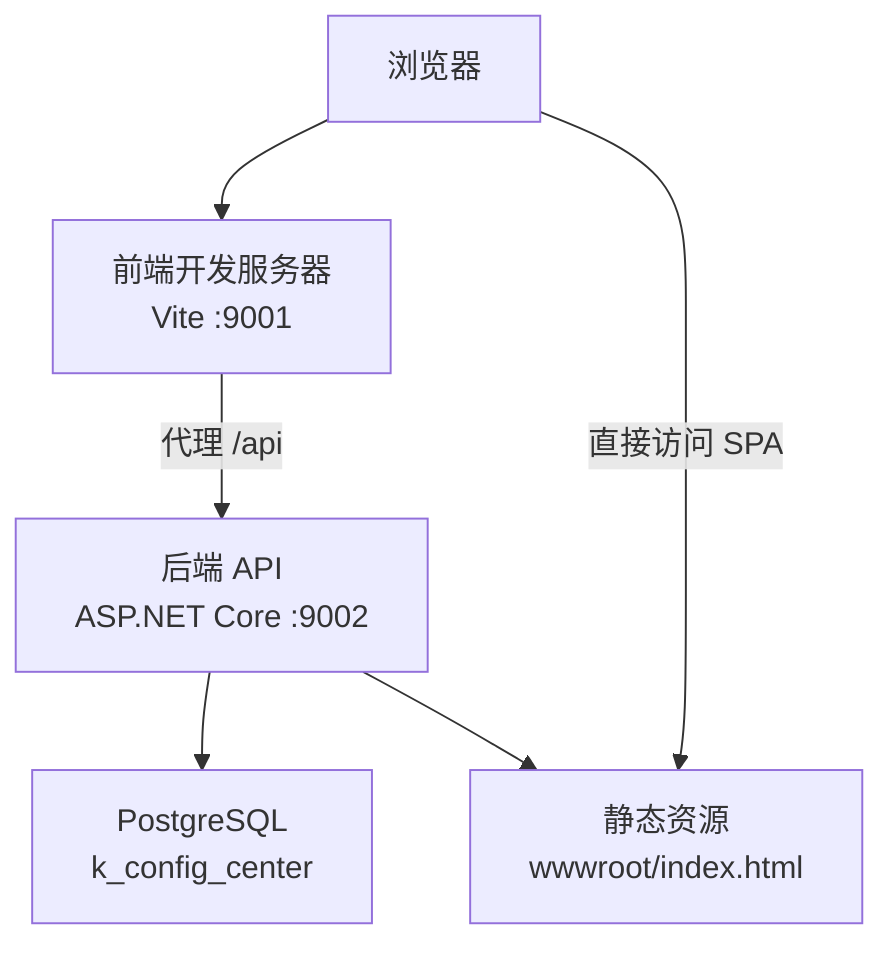

# 快速开始

<cite>
**本文引用的文件**
- [Program.cs](file://k_config_center/Program.cs)
- [appsettings.json](file://k_config_center/appsettings.json)
- [launchSettings.json](file://k_config_center/Properties/launchSettings.json)
- [SqlSugarSetup.cs](file://k_config_center/src/Infrastructure/SqlSugarSetup.cs)
- [配置中心建表脚本.sql](file://docs/数据库脚本/配置中心建表脚本.sql)
- [vite.config.ts](file://web/vite.config.ts)
- [package.json](file://web/package.json)
- [http.ts](file://web/src/api/http.ts)
- [后端方案.md](file://docs/技术方案/后端方案.md)
</cite>

## 目录
1. [简介](#简介)
2. [环境要求](#环境要求)
3. [项目克隆与依赖安装](#项目克隆与依赖安装)
4. [数据库初始化](#数据库初始化)
5. [启动后端服务](#启动后端服务)
6. [启动前端开发服务器](#启动前端开发服务器)
7. [首次运行验证](#首次运行验证)
8. [基本配置管理操作流程示例](#基本配置管理操作流程示例)
9. [常见问题与排错](#常见问题与排错)
10. [架构概览](#架构概览)
11. [结论](#结论)

## 简介
本指南面向首次接触配置中心的开发者与运维人员，帮助你在本地快速搭建并体验核心功能：创建命名空间与环境、管理配置组与配置项、发布与回滚版本、查看操作日志。后端基于 .NET 8+（目标框架 net10.0）与 PostgreSQL，前端使用 React + Vite，提供可视化配置管理与审计能力。

## 环境要求
- .NET SDK：建议安装 .NET 8 或更高版本（项目目标框架为 net10.0，需对应 SDK）。
- Node.js：建议使用 v18+（Vite 5 推荐），用于前端开发与构建。
- PostgreSQL：版本 14+，用于存储配置数据与审计日志。
- 可选工具：PostgreSQL 客户端 psql，便于执行建表脚本；浏览器访问 Swagger UI（仅开发环境）。

说明：
- 后端通过 appsettings.json 的 ConnectionStrings:PostgreSQL 读取连接字符串，因此请确保已准备可连接的 PostgreSQL 实例与数据库名 k_config_center。
- 前端开发服务器默认监听 9001 端口，并通过代理将 /api 请求转发到后端 9002 端口。

章节来源
- [appsettings.json:9-11](file://k_config_center/appsettings.json#L9-L11)
- [vite.config.ts:12-20](file://web/vite.config.ts#L12-L20)
- [launchSettings.json:4-11](file://k_config_center/Properties/launchSettings.json#L4-L11)
- [配置中心建表脚本.sql:1-14](file://docs/数据库脚本/配置中心建表脚本.sql#L1-L14)

## 项目克隆与依赖安装
- 克隆仓库后，分别进入后端与前端目录安装依赖：
  - 后端：在 k_config_center 目录下执行 dotnet restore（或 dotnet build）以恢复 NuGet 包。
  - 前端：在 web 目录下执行 npm install（或 yarn install）以安装前端依赖。

注意：
- 若网络受限，可使用国内镜像源加速依赖下载。
- 确保 Node.js 与 .NET SDK 版本满足要求，避免构建失败。

章节来源
- [package.json:6-9](file://web/package.json#L6-L9)
- [k_config_center.csproj:1-21](file://k_config_center/k_config_center.csproj#L1-L21)

## 数据库初始化
- 使用提供的 SQL 脚本初始化数据库结构与默认数据：
  - 打开 docs/数据库脚本/配置中心建表脚本.sql。
  - 使用 psql 命令连接到你的 PostgreSQL 实例并执行该脚本，例如：psql -U <user> -d k_config_center -f 配置中心建表脚本.sql。
- 脚本会创建以下核心对象：
  - 命名空间、环境、配置组、配置项、配置版本快照、操作日志等表。
  - 部分唯一索引、外键约束、CHECK 约束、自动更新 updated_at 触发器。
  - 内置默认命名空间 public。
- 注意事项：
  - 如需重复执行，请谨慎取消脚本中的 DROP TABLE 注释块（会级联删除数据）。
  - 生产环境建议将 DDL 纳入版本管理，按变更顺序执行。

章节来源
- [配置中心建表脚本.sql:16-303](file://docs/数据库脚本/配置中心建表脚本.sql#L16-L303)

## 启动后端服务
- 修改数据库连接字符串：
  - 编辑 k_config_center/appsettings.json 中的 ConnectionStrings:PostgreSQL，替换 Host、Username、Password 为你的实际值。
- 启动后端：
  - 在项目根目录或 k_config_center 目录执行 dotnet run。
  - 默认监听 http://localhost:9002（Development 环境）。
- 访问接口文档：
  - 开发环境下会自动启用 Swagger UI，访问 http://localhost:9002/swagger。
- 关键行为：
  - 全局异常处理会将业务异常统一返回 { code, message, data }，HTTP 仍为 200；非业务异常记录结构化日志并返回 500。
  - 静态资源托管 wwwroot，SPA 路由兜底 index.html。

章节来源
- [appsettings.json:9-11](file://k_config_center/appsettings.json#L9-L11)
- [launchSettings.json:4-11](file://k_config_center/Properties/launchSettings.json#L4-L11)
- [Program.cs:10-107](file://k_config_center/Program.cs#L10-L107)
- [后端方案.md:157-191](file://docs/技术方案/后端方案.md#L157-L191)

## 启动前端开发服务器
- 进入 web 目录，执行 npm run dev。
- 前端开发服务器默认监听 9001 端口，并将 /api 请求代理到后端 http://localhost:9002。
- 浏览器访问 http://localhost:9001 即可看到配置中心界面。
- 构建产物输出至 ../k_config_center/wwwroot，便于单一应用部署。

章节来源
- [vite.config.ts:12-25](file://web/vite.config.ts#L12-L25)
- [package.json:6-9](file://web/package.json#L6-L9)
- [http.ts:11-14](file://web/src/api/http.ts#L11-L14)

## 首次运行验证
- 确认后端启动成功：
  - 访问 http://localhost:9002/swagger，能加载接口文档即表示后端正常。
- 确认前端启动成功：
  - 访问 http://localhost:9001，应能看到配置中心主界面。
- 验证前后端连通性：
  - 在前端页面中尝试列出命名空间或环境，若能获取数据且无跨域错误，则前后端通信正常。
- 验证数据库连通性：
  - 检查 appsettings.json 的连接字符串是否正确，确保 PostgreSQL 可连接且已执行建表脚本。

章节来源
- [Program.cs:36-69](file://k_config_center/Program.cs#L36-L69)
- [vite.config.ts:12-20](file://web/vite.config.ts#L12-L20)
- [http.ts:11-14](file://web/src/api/http.ts#L11-L14)

## 基本配置管理操作流程示例
以下为典型的使用流程，帮助你快速体验核心功能：
- 创建命名空间与环境
  - 在“命名空间”页创建新的命名空间（如 myproject）。
  - 在“环境”页为该命名空间创建 dev/test/staging/prod 等环境。
- 创建配置组
  - 选择目标环境，创建配置组（如 application、database、mq）。
- 编辑配置项
  - 在“配置”页新增配置项，选择格式（text/json/yaml/properties/xml/toml），填写内容并保存为草稿。
- 发布与回滚
  - 对配置项进行发布，生成新版本快照；如需回退，可在版本历史中选择目标版本进行回滚。
- 下线与删除
  - 可将配置项状态置为 OFFLINE；支持软删除，保留审计轨迹。
- 查看操作日志
  - 在“审计”页查看操作记录，包括操作人、时间、变更详情等。

提示：
- 前端通过 axios 拦截器统一处理响应，业务失败时 HTTP 仍为 200，由 code 表达错误。
- 写操作会注入 X-Operator 头，便于审计追踪。

章节来源
- [http.ts:16-22](file://web/src/api/http.ts#L16-L22)
- [后端方案.md:511-544](file://docs/技术方案/后端方案.md#L511-L544)

## 常见问题与排错
- 无法连接数据库
  - 检查 appsettings.json 的 ConnectionStrings:PostgreSQL 是否已替换为真实地址、用户名与密码。
  - 确认 PostgreSQL 服务已启动且允许本机连接。
  - 确认已执行建表脚本，数据库中存在所需表结构。
- 前端无法调用后端接口
  - 确认前端 dev server 监听 9001，后端监听 9002。
  - 检查 vite.config.ts 的代理配置，确保 /api 被正确转发到 http://localhost:9002。
  - 检查浏览器控制台是否有跨域错误或网络错误。
- 后端启动时报缺少连接字符串
  - 确保 appsettings.json 包含有效的 ConnectionStrings:PostgreSQL。
  - 若使用环境变量覆盖，请确保 ASPNETCORE_ENVIRONMENT=Development 下配置生效。
- 构建失败
  - 前端：确认 Node.js 版本满足要求，重新执行 npm install。
  - 后端：确认 .NET SDK 版本满足目标框架 net10.0，执行 dotnet restore 后再构建。
- 权限与审计
  - 写操作会携带 X-Operator 头，若未设置，后端可能使用默认值；可通过前端 localStorage 设置 operator 字段。

章节来源
- [appsettings.json:9-11](file://k_config_center/appsettings.json#L9-L11)
- [vite.config.ts:12-20](file://web/vite.config.ts#L12-L20)
- [http.ts:16-22](file://web/src/api/http.ts#L16-L22)
- [Program.cs:71-92](file://k_config_center/Program.cs#L71-L92)

## 架构概览
下图展示了前后端与数据库之间的交互关系，以及开发时的代理与静态资源托管方式。

图表来源
- [vite.config.ts:12-25](file://web/vite.config.ts#L12-L25)
- [launchSettings.json:4-11](file://k_config_center/Properties/launchSettings.json#L4-L11)
- [Program.cs:94-105](file://k_config_center/Program.cs#L94-L105)

## 结论
按照本指南完成环境准备、依赖安装、数据库初始化与前后端启动后，你即可在本地体验配置中心的核心能力：命名空间与环境管理、配置组与配置项编辑、发布与回滚、操作审计。后续可根据实际需求扩展更多维度与集成方式。