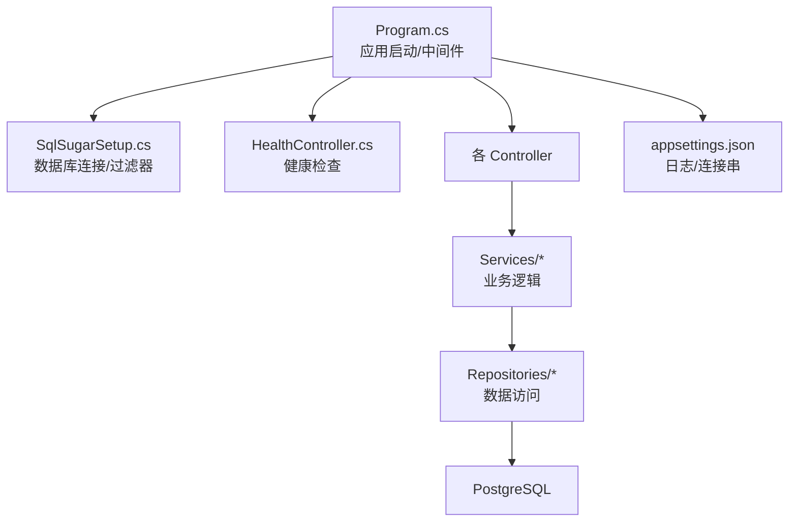
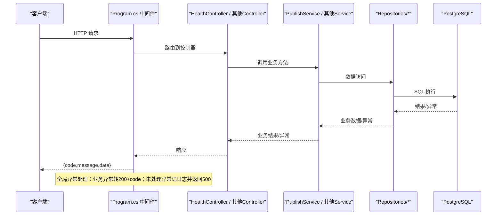
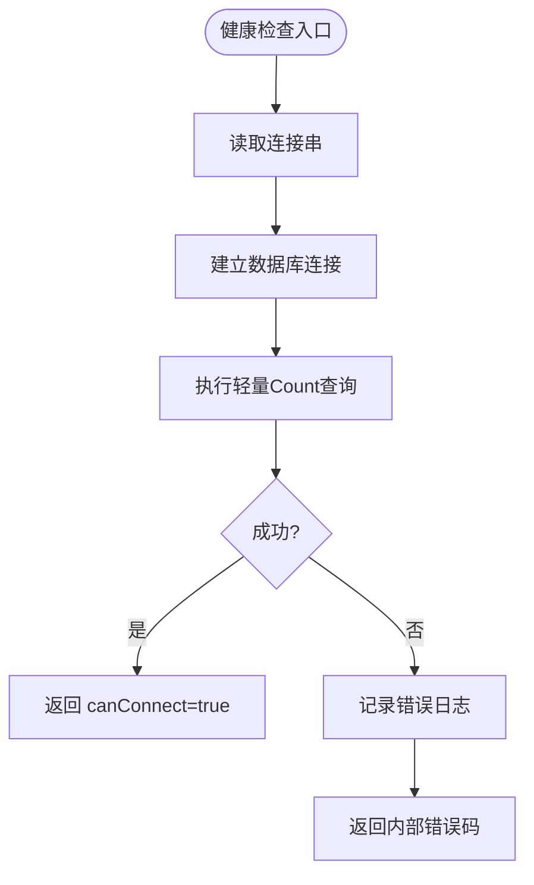
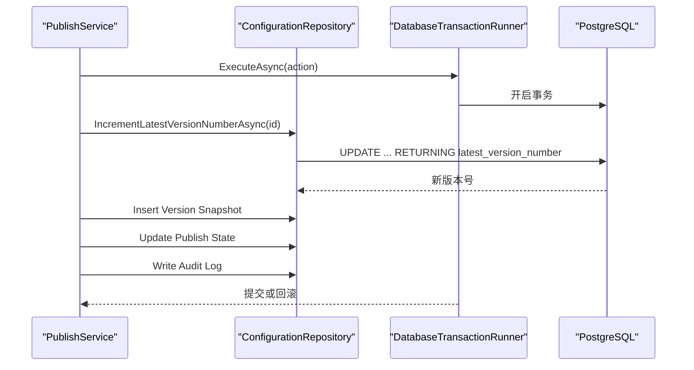
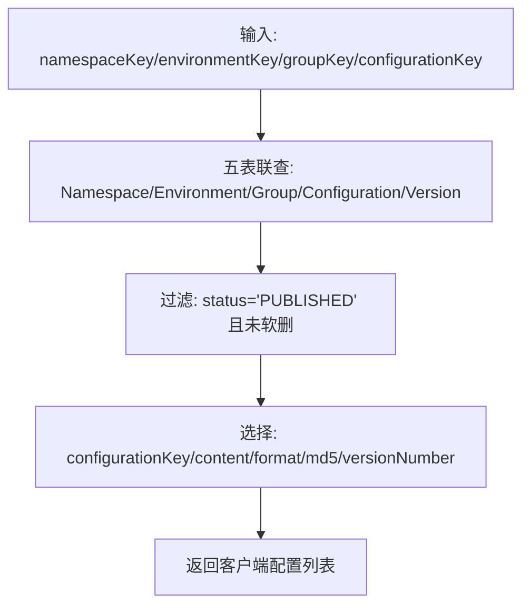
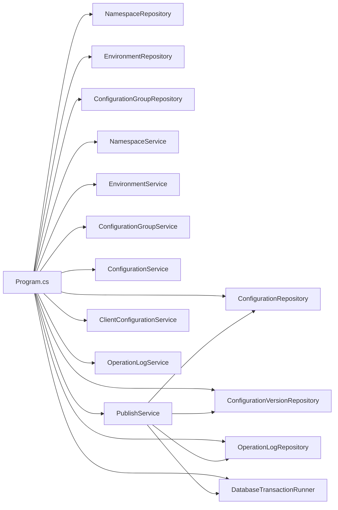

# 故障排查

<cite>
**本文引用的文件**
- [Program.cs](file://k_config_center/Program.cs)
- [appsettings.json](file://k_config_center/appsettings.json)
- [SqlSugarSetup.cs](file://k_config_center/src/Infrastructure/SqlSugarSetup.cs)
- [HealthController.cs](file://k_config_center/src/Controllers/HealthController.cs)
- [BusinessException.cs](file://k_config_center/src/Infrastructure/BusinessException.cs)
- [ApiResponse.cs](file://k_config_center/src/Infrastructure/ApiResponse.cs)
- [DatabaseTransactionRunner.cs](file://k_config_center/src/Repositories/DatabaseTransactionRunner.cs)
- [PublishService.cs](file://k_config_center/src/Services/PublishService.cs)
- [ConfigurationRepository.cs](file://k_config_center/src/Repositories/ConfigurationRepository.cs)
- [OperationHelper.cs](file://k_config_center/src/Infrastructure/OperationHelper.cs)
- [k_config_center.csproj](file://k_config_center/k_config_center.csproj)
</cite>

## 目录
1. [简介](#简介)
2. [项目结构](#项目结构)
3. [核心组件](#核心组件)
4. [架构总览](#架构总览)
5. [详细组件分析](#详细组件分析)
6. [依赖关系分析](#依赖关系分析)
7. [性能注意事项](#性能注意事项)
8. [故障排查指南](#故障排查指南)
9. [结论](#结论)
10. [附录](#附录)

## 简介
本指南面向配置中心系统的运维与开发人员，聚焦常见问题的诊断与解决，包括数据库连接、权限与操作人识别、发布并发冲突、性能瓶颈定位等。文档同时提供日志分析方法、关键日志位置、调试工具与技巧、系统健康检查与监控告警的配置建议，帮助快速恢复服务并降低风险。

## 项目结构
后端采用 ASP.NET Core Web API，分层清晰：
- 入口与中间件：Program.cs 负责服务注册、全局异常处理、Swagger（开发环境）、静态资源托管与路由。
- 数据访问层：通过 SqlSugar 封装 PostgreSQL 连接、软删除过滤器、事务执行器 DatabaseTransactionRunner。
- 业务层：按模块拆分 Service，如 PublishService 负责发布/回滚/下线等跨表事务编排。
- 控制器层：对外暴露 REST 接口，包含健康检查 HealthController。
- 配置与日志：appsettings.json 管理日志级别与数据库连接字符串；统一响应 ApiResponse 与业务异常 BusinessException。

**图表来源**
- [Program.cs:10-107](file://k_config_center/Program.cs#L10-L107)
- [SqlSugarSetup.cs:12-39](file://k_config_center/src/Infrastructure/SqlSugarSetup.cs#L12-L39)
- [HealthController.cs:11-29](file://k_config_center/src/Controllers/HealthController.cs#L11-L29)
- [appsettings.json:1-12](file://k_config_center/appsettings.json#L1-L12)

**章节来源**
- [Program.cs:10-107](file://k_config_center/Program.cs#L10-L107)
- [appsettings.json:1-12](file://k_config_center/appsettings.json#L1-L12)

## 核心组件
- 全局异常处理：捕获业务异常与未处理异常，统一返回 {code, message, data}，避免堆栈泄露。
- 数据库连接与过滤：SqlSugarScope 单例，启用软删除全局过滤器，确保查询默认排除已删除记录。
- 事务执行器：DatabaseTransactionRunner 提供统一事务边界，发布/回滚等跨表操作在此内执行。
- 发布服务：PublishService 编排版本号递增、快照写入、生效指针切换与审计日志写入，保证一致性。
- 健康检查：HealthController.CheckDatabase 对数据库做轻量 Count 查询，用于外部探针与健康页。
- 辅助工具：OperationHelper 提供 MD5、操作人提取、客户端 IP 提取、唯一约束冲突识别。

**章节来源**
- [Program.cs:71-92](file://k_config_center/Program.cs#L71-L92)
- [SqlSugarSetup.cs:12-39](file://k_config_center/src/Infrastructure/SqlSugarSetup.cs#L12-L39)
- [DatabaseTransactionRunner.cs:9-17](file://k_config_center/src/Repositories/DatabaseTransactionRunner.cs#L9-L17)
- [PublishService.cs:27-108](file://k_config_center/src/Services/PublishService.cs#L27-L108)
- [HealthController.cs:11-29](file://k_config_center/src/Controllers/HealthController.cs#L11-L29)
- [OperationHelper.cs:10-28](file://k_config_center/src/Infrastructure/OperationHelper.cs#L10-L28)

## 架构总览
下图展示请求从进入应用到数据库的完整链路，以及关键错误处理点。

**图表来源**
- [Program.cs:71-92](file://k_config_center/Program.cs#L71-L92)
- [HealthController.cs:17-29](file://k_config_center/src/Controllers/HealthController.cs#L17-L29)
- [PublishService.cs:27-108](file://k_config_center/src/Services/PublishService.cs#L27-L108)
- [ConfigurationRepository.cs:107-124](file://k_config_center/src/Repositories/ConfigurationRepository.cs#L107-L124)

## 详细组件分析

### 数据库连接与连通性
- 连接配置位于 appsettings.json 的 ConnectionStrings:PostgreSQL。
- SqlSugarSetup 读取该连接串并创建 SqlSugarScope 单例，设置 PostgreSQl 类型、自动关闭连接、实体特性解析与全局软删除过滤器。
- HealthController.CheckDatabase 通过 NamespaceRepository.CountAsync 进行轻量连通性检测，失败时记录错误日志并返回业务失败码。

**图表来源**
- [appsettings.json:9-11](file://k_config_center/appsettings.json#L9-L11)
- [SqlSugarSetup.cs:12-39](file://k_config_center/src/Infrastructure/SqlSugarSetup.cs#L12-L39)
- [HealthController.cs:17-29](file://k_config_center/src/Controllers/HealthController.cs#L17-L29)

**章节来源**
- [appsettings.json:9-11](file://k_config_center/appsettings.json#L9-L11)
- [SqlSugarSetup.cs:12-39](file://k_config_center/src/Infrastructure/SqlSugarSetup.cs#L12-L39)
- [HealthController.cs:17-29](file://k_config_center/src/Controllers/HealthController.cs#L17-L29)

### 发布与回滚的事务一致性
- PublishService.PublishAsync/RollbackAsync 在事务中顺序执行：版本号原子递增 → 写不可变版本快照 → 切换生效指针 → 写审计日志。
- 版本号递增由 ConfigurationRepository.IncrementLatestVersionNumberAsync 使用数据库侧 UPDATE ... RETURNING 实现行级串行化，避免并发竞态。
- 唯一约束兜底：UNIQUE(configuration_id, version_number) 冲突被 OperationHelper.IsUniqueViolation 识别并转为“发布并发冲突”业务错误码。
- 事务边界由 DatabaseTransactionRunner.ExecuteAsync 统一管理，任一失败整体回滚。

**图表来源**
- [PublishService.cs:27-108](file://k_config_center/src/Services/PublishService.cs#L27-L108)
- [ConfigurationRepository.cs:75-90](file://k_config_center/src/Repositories/ConfigurationRepository.cs#L75-L90)
- [DatabaseTransactionRunner.cs:9-17](file://k_config_center/src/Repositories/DatabaseTransactionRunner.cs#L9-L17)
- [OperationHelper.cs:22-28](file://k_config_center/src/Infrastructure/OperationHelper.cs#L22-L28)

**章节来源**
- [PublishService.cs:27-108](file://k_config_center/src/Services/PublishService.cs#L27-L108)
- [ConfigurationRepository.cs:75-90](file://k_config_center/src/Repositories/ConfigurationRepository.cs#L75-L90)
- [DatabaseTransactionRunner.cs:9-17](file://k_config_center/src/Repositories/DatabaseTransactionRunner.cs#L9-L17)
- [OperationHelper.cs:22-28](file://k_config_center/src/Infrastructure/OperationHelper.cs#L22-L28)

### 客户端读取与五表联查
- ConfigurationRepository.ListPublishedByBusinessKeysAsync 根据 namespaceKey/environmentKey/groupKey/configurationKey 获取已发布的配置项，内容取自 published_version_id 指向的版本快照。
- 联表显式带 deleted_at 条件，不依赖全局过滤器在联表中的行为，确保只返回有效数据。

**图表来源**
- [ConfigurationRepository.cs:107-124](file://k_config_center/src/Repositories/ConfigurationRepository.cs#L107-L124)

**章节来源**
- [ConfigurationRepository.cs:107-124](file://k_config_center/src/Repositories/ConfigurationRepository.cs#L107-L124)

### 权限与操作人识别
- 操作人从请求头 X-Operator 提取，缺省为 system；客户端 IP 也一并记录到审计日志。
- 若出现权限相关错误（例如未授权访问），应在网关/认证层拦截；当前系统无内置鉴权，需结合部署环境控制访问。

**章节来源**
- [OperationHelper.cs:14-20](file://k_config_center/src/Infrastructure/OperationHelper.cs#L14-L20)

## 依赖关系分析
- Program.cs 注册所有 Repository 与 Service，注入 ISqlSugarClient 单例。
- Services 依赖 Repositories；Repositories 依赖 ISqlSugarClient；PublishService 依赖 DatabaseTransactionRunner 进行事务编排。
- 健康检查依赖 NamespaceRepository；日志与响应依赖 Infrastructure 中的通用组件。

**图表来源**
- [Program.cs:14-34](file://k_config_center/Program.cs#L14-L34)
- [PublishService.cs:14-19](file://k_config_center/src/Services/PublishService.cs#L14-L19)

**章节来源**
- [Program.cs:14-34](file://k_config_center/Program.cs#L14-L34)
- [PublishService.cs:14-19](file://k_config_center/src/Services/PublishService.cs#L14-L19)

## 性能注意事项
- 连接池与自动关闭：SqlSugarScope 设置 IsAutoCloseConnection=true，减少连接占用。
- 查询优化：客户端读取使用五表联查并按业务 key 精确过滤，避免全表扫描；列表查询支持可选过滤条件。
- 事务最小化：仅在发布/回滚等跨表场景开启事务，缩短锁持有时间。
- 并发安全：版本号递增在数据库侧原子更新，避免应用层先读后写的竞态；唯一约束作为最终兜底。
- 构建与依赖：项目目标框架 net10.0，依赖 Npgsql、SqlSugarCore、Swashbuckle.AspNetCore。

**章节来源**
- [SqlSugarSetup.cs:21-27](file://k_config_center/src/Infrastructure/SqlSugarSetup.cs#L21-L27)
- [ConfigurationRepository.cs:107-124](file://k_config_center/src/Repositories/ConfigurationRepository.cs#L107-L124)
- [PublishService.cs:94-108](file://k_config_center/src/Services/PublishService.cs#L94-L108)
- [k_config_center.csproj:1-21](file://k_config_center/k_config_center.csproj#L1-L21)

## 故障排查指南

### 常见问题与解决方案

#### 数据库连接问题
- 现象：健康检查失败、接口频繁报内部错误。
- 诊断步骤：
  - 检查 appsettings.json 中 ConnectionStrings:PostgreSQL 是否配置正确（Host、Port、Database、Username、Password）。
  - 确认网络可达性与防火墙策略。
  - 查看服务端日志中“健康检查：数据库连接失败”的错误信息。
- 解决方案：
  - 修正连接串参数，必要时添加 SSL Mode=Prefer。
  - 重启服务以重新初始化 SqlSugarScope。
  - 若连接池耗尽，检查是否存在长事务或未释放连接。

**章节来源**
- [appsettings.json:9-11](file://k_config_center/appsettings.json#L9-L11)
- [HealthController.cs:17-29](file://k_config_center/src/Controllers/HealthController.cs#L17-L29)
- [SqlSugarSetup.cs:12-39](file://k_config_center/src/Infrastructure/SqlSugarSetup.cs#L12-L39)

#### 权限与操作人识别问题
- 现象：审计日志操作人为 system，无法追溯真实操作者。
- 诊断步骤：
  - 检查请求是否携带 X-Operator 请求头。
  - 确认网关或代理是否正确透传该头部。
- 解决方案：
  - 在网关层强制注入 X-Operator，或在客户端 SDK 中设置该头部。
  - 如需鉴权，建议在网关或中间件层实现统一认证与授权。

**章节来源**
- [OperationHelper.cs:14-20](file://k_config_center/src/Infrastructure/OperationHelper.cs#L14-L20)

#### 发布并发冲突
- 现象：多次并发发布导致“发布并发冲突”。
- 诊断步骤：
  - 查看日志中是否出现唯一约束冲突（SQLSTATE 23505）。
  - 检查是否存在重复发布相同内容的情况。
- 解决方案：
  - 客户端重试机制应加退避策略。
  - 确保幂等性：同一配置在同一时间点仅允许一个发布事务。
  - 利用唯一约束兜底，避免脏数据。

**章节来源**
- [PublishService.cs:100-108](file://k_config_center/src/Services/PublishService.cs#L100-L108)
- [OperationHelper.cs:22-28](file://k_config_center/src/Infrastructure/OperationHelper.cs#L22-L28)

#### 性能问题与瓶颈定位
- 现象：接口响应慢、CPU/内存升高、数据库负载高。
- 诊断步骤：
  - 使用 Swagger（开发环境）验证接口路径与参数。
  - 查看服务端日志，关注长时间运行的请求与异常堆栈。
  - 检查数据库慢查询与锁等待（PostgreSQL pg_stat_statements、pg_locks）。
- 解决方案：
  - 优化查询：确保按 namespaceKey/environmentKey/groupKey 精确过滤。
  - 减少事务范围：仅在必要场景开启事务。
  - 增加索引：针对常用查询列添加合适索引。
  - 水平扩展：多实例部署配合负载均衡。

**章节来源**
- [Program.cs:36-69](file://k_config_center/Program.cs#L36-L69)
- [ConfigurationRepository.cs:107-124](file://k_config_center/src/Repositories/ConfigurationRepository.cs#L107-L124)

### 日志分析方法与关键日志位置
- 日志级别：appsettings.json 中 Default 为 Information，Microsoft.AspNetCore 为 Warning。
- 关键日志：
  - 健康检查失败：HealthController 记录“健康检查：数据库连接失败”。
  - 未处理异常：Program.cs 全局异常中间件记录“未处理异常：{Method} {Path}”。
  - 发布/回滚：PublishService 事务内操作可结合审计日志与数据库变更追踪。
- 日志位置：
  - 控制台输出（默认）。
  - 生产环境建议接入集中式日志系统（如 ELK、Serilog + 文件/数据库）。

**章节来源**
- [appsettings.json:2-6](file://k_config_center/appsettings.json#L2-L6)
- [HealthController.cs:24-28](file://k_config_center/src/Controllers/HealthController.cs#L24-L28)
- [Program.cs:85-91](file://k_config_center/Program.cs#L85-L91)

### 调试工具与技巧
- Swagger UI：仅在 Development 环境启用，路径 /swagger，便于接口测试。
- 本地调试：使用 Visual Studio / VS Code 附加进程，设置断点在 Controller/Service/Repository。
- 远程调试：生产环境谨慎启用，需确保安全通道与访问控制。
- 数据库调试：使用 psql 或图形化工具直接执行 SQL，验证查询与索引效果。

**章节来源**
- [Program.cs:36-69](file://k_config_center/Program.cs#L36-L69)

### 系统健康检查与监控告警
- 健康检查端点：GET /api/health/database，返回 {canConnect, namespaceCount}。
- 监控建议：
  - 定期调用健康检查端点，失败时触发告警。
  - 监控数据库连接数、慢查询、锁等待。
  - 监控发布成功率与并发冲突次数。
- 告警阈值：
  - 健康检查连续失败 N 次。
  - 接口错误率超过阈值。
  - 数据库 CPU/IO/连接数异常。

**章节来源**
- [HealthController.cs:17-29](file://k_config_center/src/Controllers/HealthController.cs#L17-L29)

## 结论
本指南基于代码实现提供了系统化的故障排查方法，涵盖数据库连接、权限识别、发布并发冲突、性能瓶颈定位、日志分析与监控告警。通过健康检查端点、全局异常处理、事务一致性与唯一约束兜底，系统具备较强的健壮性与可观测性。建议在生产环境完善日志采集与监控体系，并结合数据库优化与限流重试策略，进一步提升稳定性与性能。

## 附录
- 统一响应结构：{code, message, data}，HTTP 一律 200，业务失败由 code 表达。
- 错误码分段：详见 Program.cs 中 Swagger 描述（通用、基础维度、配置与发布等）。
- 构建与依赖：net10.0，Npgsql、SqlSugarCore、Swashbuckle.AspNetCore。

**章节来源**
- [ApiResponse.cs:4-9](file://k_config_center/src/Infrastructure/ApiResponse.cs#L4-L9)
- [Program.cs:36-59](file://k_config_center/Program.cs#L36-L59)
- [k_config_center.csproj:12-18](file://k_config_center/k_config_center.csproj#L12-L18)