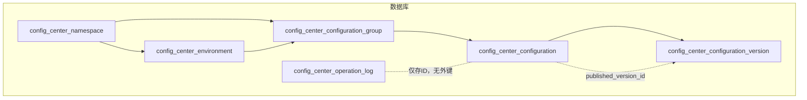
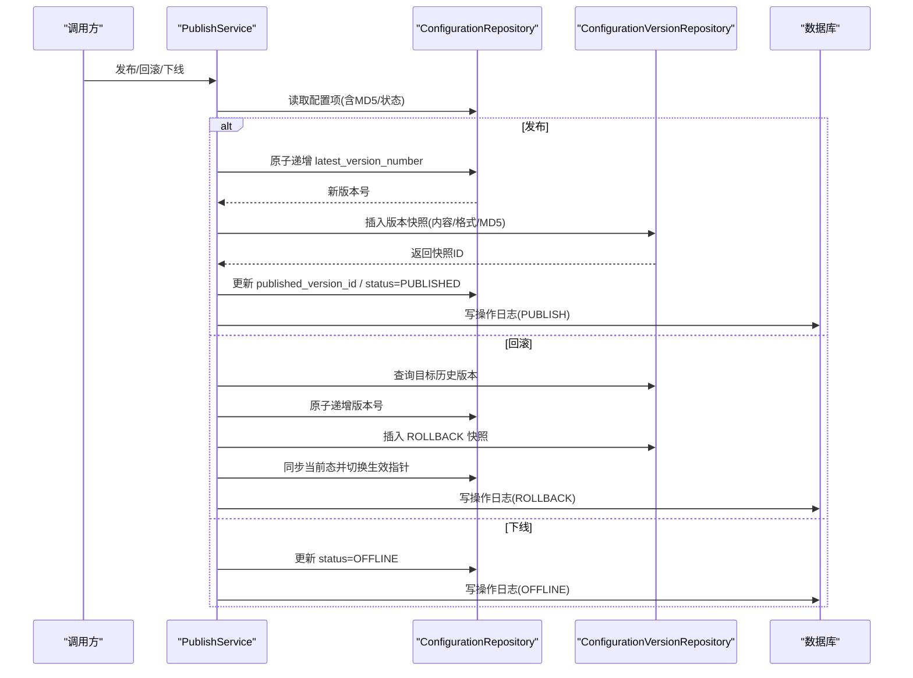
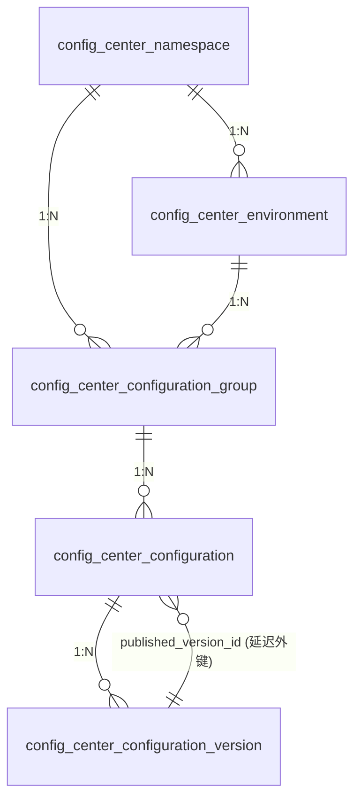
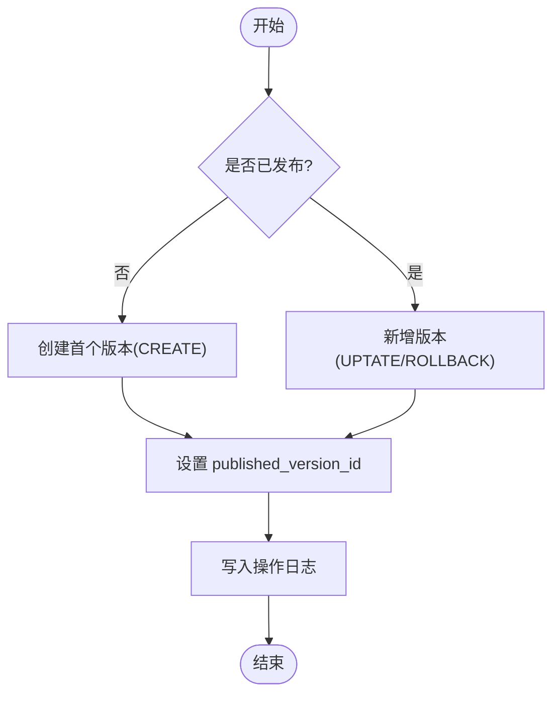
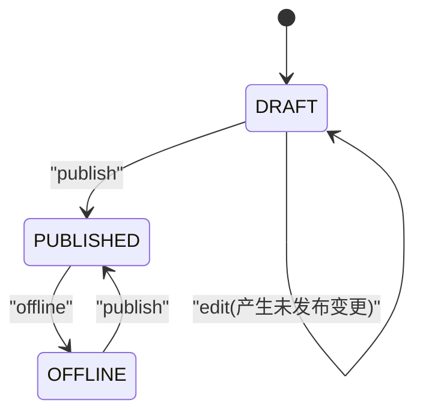
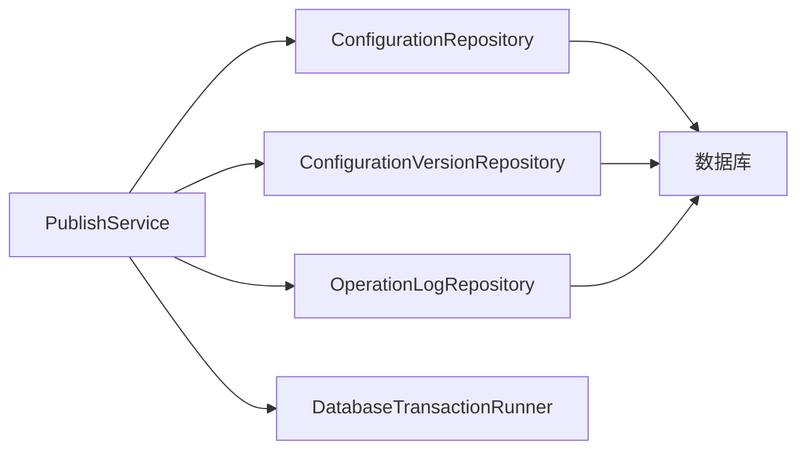

# 实体关系设计

<cite>
**本文引用的文件**
- [配置中心建表脚本.sql](file://docs/数据库脚本/配置中心建表脚本.sql)
- [ConfigCenterNamespace.cs](file://k_config_center/src/Entities/ConfigCenterNamespace.cs)
- [ConfigCenterEnvironment.cs](file://k_config_center/src/Entities/ConfigCenterEnvironment.cs)
- [ConfigCenterConfigurationGroup.cs](file://k_config_center/src/Entities/ConfigCenterConfigurationGroup.cs)
- [ConfigCenterConfiguration.cs](file://k_config_center/src/Entities/ConfigCenterConfiguration.cs)
- [ConfigCenterConfigurationVersion.cs](file://k_config_center/src/Entities/ConfigCenterConfigurationVersion.cs)
- [PublishService.cs](file://k_config_center/src/Services/PublishService.cs)
- [ConfigurationRepository.cs](file://k_config_center/src/Repositories/ConfigurationRepository.cs)
- [ConfigurationVersionRepository.cs](file://k_config_center/src/Repositories/ConfigurationVersionRepository.cs)
- [配置中心设计文档.md](file://docs/设计文档/配置中心设计文档.md)
</cite>

## 目录
1. [简介](#简介)
2. [项目结构](#项目结构)
3. [核心组件](#核心组件)
4. [架构总览](#架构总览)
5. [详细组件分析](#详细组件分析)
6. [依赖关系分析](#依赖关系分析)
7. [性能考量](#性能考量)
8. [故障排查指南](#故障排查指南)
9. [结论](#结论)
10. [附录](#附录)

## 简介
本文件聚焦配置中心的实体关系设计，围绕 namespace → environment → group → configuration 的层级模型，说明主外键约束、唯一性约束与检查约束的设计原理；解释配置项与版本记录的一对多关系及发布状态管理；阐述软删除在关系设计中的考虑；并提供 ER 图与冗余字段（namespace_id、environment_id）的设计考量。

## 项目结构
- 数据库 DDL：PostgreSQL 建表脚本定义了六张核心表与触发器、索引与默认数据。
- 领域实体：C# 实体类映射到各表，体现字段类型、可空性与默认值。
- 服务与仓储：发布流程通过 Service 编排事务，仓储层封装原子操作与查询。
- 设计文档：对层级模型、ER 关系、状态机、时间戳自动维护等做统一说明。



图表来源
- [配置中心建表脚本.sql:30-225](file://docs/数据库脚本/配置中心建表脚本.sql#L30-L225)
- [配置中心设计文档.md:37-57](file://docs/设计文档/配置中心设计文档.md#L37-L57)

章节来源
- [配置中心建表脚本.sql:30-225](file://docs/数据库脚本/配置中心建表脚本.sql#L30-L225)
- [配置中心设计文档.md:37-57](file://docs/设计文档/配置中心设计文档.md#L37-L57)

## 核心组件
- 命名空间（namespace）：顶层隔离单元，支持全局唯一 key（未软删除范围）。
- 环境（environment）：隶属于命名空间，支持命名空间内唯一 key（未软删除范围）。
- 配置组（configuration_group）：隶属于环境与命名空间，支持环境内唯一 key（未软删除范围）。
- 配置项（configuration）：当前态，含内容、格式、MD5、状态、生效版本指针、最新版本号。
- 版本快照（configuration_version）：不可变历史快照，按配置项线性递增版本号。
- 操作日志（operation_log）：审计流水，仅存 ID，不建立外键以减轻写入压力。

章节来源
- [配置中心设计文档.md:10-20](file://docs/设计文档/配置中心设计文档.md#L10-L20)
- [配置中心设计文档.md:66-179](file://docs/设计文档/配置中心设计文档.md#L66-L179)

## 架构总览
下图展示从“编辑—发布—回滚—下线”的状态流转与数据落盘路径，强调版本快照与生效指针的关系。



图表来源
- [PublishService.cs:27-115](file://k_config_center/src/Services/PublishService.cs#L27-L115)
- [ConfigurationRepository.cs:75-103](file://k_config_center/src/Repositories/ConfigurationRepository.cs#L75-L103)
- [ConfigurationVersionRepository.cs:41-44](file://k_config_center/src/Repositories/ConfigurationVersionRepository.cs#L41-L44)

章节来源
- [PublishService.cs:27-115](file://k_config_center/src/Services/PublishService.cs#L27-L115)
- [ConfigurationRepository.cs:75-103](file://k_config_center/src/Repositories/ConfigurationRepository.cs#L75-L103)
- [ConfigurationVersionRepository.cs:41-44](file://k_config_center/src/Repositories/ConfigurationVersionRepository.cs#L41-L44)

## 详细组件分析

### 实体关系与约束总览
- 主键：所有表 id 均为 BIGINT GENERATED ALWAYS AS IDENTITY。
- 外键：
  - environment.namespace_id → namespace.id
  - configuration_group.environment_id → environment.id
  - configuration_group.namespace_id → namespace.id
  - configuration.group_id → configuration_group.id
  - configuration.published_version_id → configuration_version.id（延迟添加）
  - version.configuration_id → configuration.id
- 唯一性约束（部分唯一索引，仅约束未软删除记录）：
  - namespace(namespace_key) WHERE deleted_at IS NULL
  - environment(namespace_id, environment_key) WHERE deleted_at IS NULL
  - configuration_group(environment_id, group_key) WHERE deleted_at IS NULL
  - configuration(group_id, configuration_key) WHERE deleted_at IS NULL
  - version(configuration_id, version_number)
- 检查约束：
  - configuration.format IN ('text','json','yaml','properties','xml','toml')
  - configuration.status IN ('DRAFT','PUBLISHED','OFFLINE')
  - version.change_type IN ('CREATE','UPDATE','DELETE','ROLLBACK','IMPORT')



图表来源
- [配置中心建表脚本.sql:30-225](file://docs/数据库脚本/配置中心建表脚本.sql#L30-L225)
- [配置中心设计文档.md:37-57](file://docs/设计文档/配置中心设计文档.md#L37-L57)

章节来源
- [配置中心建表脚本.sql:30-225](file://docs/数据库脚本/配置中心建表脚本.sql#L30-L225)
- [配置中心设计文档.md:37-57](file://docs/设计文档/配置中心设计文档.md#L37-L57)

### 层级关系：namespace → environment → group → configuration
- 命名空间是顶层隔离单元，环境隶属于命名空间，配置组隶属于环境与命名空间，配置项隶属于配置组。
- 通过部分唯一索引保证业务标识在各层级内的唯一性，且允许软删除后重建同名资源。
- 客户端高频读取时，利用配置项表的冗余字段（namespace_id、environment_id）避免多级 JOIN。

章节来源
- [配置中心设计文档.md:10-20](file://docs/设计文档/配置中心设计文档.md#L10-L20)
- [配置中心设计文档.md:238-247](file://docs/设计文档/配置中心设计文档.md#L238-L247)

### 配置项与版本记录的一对多关系
- 每个配置项对应多条版本快照，版本号在同一配置项内线性递增。
- 发布或回滚均会新增一条不可变快照，并通过 published_version_id 指向当前生效版本。
- 版本表不设软删除，永久保留用于审计与回溯。



图表来源
- [PublishService.cs:27-54](file://k_config_center/src/Services/PublishService.cs#L27-L54)
- [ConfigurationRepository.cs:85-97](file://k_config_center/src/Repositories/ConfigurationRepository.cs#L85-L97)

章节来源
- [PublishService.cs:27-54](file://k_config_center/src/Services/PublishService.cs#L27-L54)
- [ConfigurationRepository.cs:85-97](file://k_config_center/src/Repositories/ConfigurationRepository.cs#L85-L97)

### 发布状态管理与状态机
- 状态：DRAFT（草稿）、PUBLISHED（已发布）、OFFLINE（已下线）。
- 发布：原子递增版本号 → 写入快照 → 切换生效指针 → 写日志。
- 回滚：基于历史版本生成新快照（change_type=ROLLBACK），同步当前态并切换生效指针。
- 下线：仅置 OFFLINE，保留版本与生效指针，可重新发布恢复上线。
- 并发控制：通过 UNIQUE(configuration_id, version_number) 与行级锁串行化版本号递增，冲突时提示重试。



图表来源
- [配置中心设计文档.md:216-232](file://docs/设计文档/配置中心设计文档.md#L216-L232)
- [PublishService.cs:82-92](file://k_config_center/src/Services/PublishService.cs#L82-L92)

章节来源
- [配置中心设计文档.md:216-232](file://docs/设计文档/配置中心设计文档.md#L216-L232)
- [PublishService.cs:82-92](file://k_config_center/src/Services/PublishService.cs#L82-L92)

### 软删除在关系设计中的考虑
- 四张主资源表（namespace、environment、configuration_group、configuration）均包含 deleted_at 列，采用统一软删除策略。
- 使用部分唯一索引（WHERE deleted_at IS NULL）确保业务标识在未删除范围内唯一，删除后可立即重建同名资源。
- 查询与列表接口显式过滤 deleted_at，避免返回已删除资源。
- 版本与审计记录不提供删除能力，永久保留以满足审计需求。

章节来源
- [配置中心设计文档.md:232-247](file://docs/设计文档/配置中心设计文档.md#L232-L247)
- [配置中心建表脚本.sql:43-77](file://docs/数据库脚本/配置中心建表脚本.sql#L43-L77)
- [ConfigurationRepository.cs:10-48](file://k_config_center/src/Repositories/ConfigurationRepository.cs#L10-L48)

### 主外键、唯一性与检查约束的设计原理
- 主键：自增 BIGINT，简化关联与定位。
- 外键：保障层级归属与引用完整性；published_version_id 延迟建立以避免循环依赖。
- 唯一性：通过部分唯一索引实现“逻辑唯一”，配合软删除提升资源复用能力。
- 检查约束：将枚举型字段（format、status、change_type）约束落在数据库层，增强数据一致性。

章节来源
- [配置中心建表脚本.sql:156-205](file://docs/数据库脚本/配置中心建表脚本.sql#L156-L205)
- [配置中心设计文档.md:238-247](file://docs/设计文档/配置中心设计文档.md#L238-L247)

### 冗余字段设计：namespace_id、environment_id
- 目的：客户端拉取配置为最高频路径，冗余两列可单表命中 index_configuration_namespace_environment，避免三表 JOIN。
- 代价：配置组不允许跨环境迁移（或迁移时需同步冗余列），该操作极低频，可接受。
- 影响：列表与详情查询可直接按 namespace_id/environment_id/status 过滤，提高吞吐与降低延迟。

章节来源
- [配置中心设计文档.md:238-247](file://docs/设计文档/配置中心设计文档.md#L238-L247)
- [ConfigurationRepository.cs:10-30](file://k_config_center/src/Repositories/ConfigurationRepository.cs#L10-L30)

### 实体映射与字段要点
- 实体类与表一一对应，字段类型与可空性遵循 DDL。
- 时间戳：updated_at 由数据库触发器自动刷新，created_at 默认 now()。
- 版本与状态：实体包含 LatestVersionNumber、PublishedVersionId、Status 等关键字段，支撑发布与客户端读取。

章节来源
- [ConfigCenterConfiguration.cs:1-66](file://k_config_center/src/Entities/ConfigCenterConfiguration.cs#L1-L66)
- [ConfigCenterConfigurationVersion.cs:1-39](file://k_config_center/src/Entities/ConfigCenterConfigurationVersion.cs#L1-L39)
- [配置中心建表脚本.sql:260-296](file://docs/数据库脚本/配置中心建表脚本.sql#L260-L296)

## 依赖关系分析
- 服务层 PublishService 依赖 ConfigurationRepository、ConfigurationVersionRepository、OperationLogRepository 与 DatabaseTransactionRunner，编排事务边界。
- 仓储层封装原子操作（版本号递增、状态切换）与复杂查询（五表联查客户端配置）。
- 数据库层通过外键、唯一性约束与检查约束保障数据一致性与完整性。



图表来源
- [PublishService.cs:14-19](file://k_config_center/src/Services/PublishService.cs#L14-L19)
- [ConfigurationRepository.cs:7-10](file://k_config_center/src/Repositories/ConfigurationRepository.cs#L7-L10)
- [ConfigurationVersionRepository.cs:7-9](file://k_config_center/src/Repositories/ConfigurationVersionRepository.cs#L7-L9)

章节来源
- [PublishService.cs:14-19](file://k_config_center/src/Services/PublishService.cs#L14-L19)
- [ConfigurationRepository.cs:7-10](file://k_config_center/src/Repositories/ConfigurationRepository.cs#L7-L10)
- [ConfigurationVersionRepository.cs:7-9](file://k_config_center/src/Repositories/ConfigurationVersionRepository.cs#L7-L9)

## 性能考量
- 冗余字段优化：通过 namespace_id、environment_id 减少 JOIN，提升批量拉取与长轮询性能。
- 索引策略：
  - unique_* 部分唯一索引保障唯一性且不阻塞重建。
  - index_configuration_namespace_environment 加速按维度过滤。
  - index_version_configuration 加速版本历史分页。
- 时间戳自动维护：触发器统一处理 updated_at，避免应用层负担。
- 并发控制：版本号递增在数据库侧原子执行，结合唯一约束兜底并发冲突。

章节来源
- [配置中心设计文档.md:238-247](file://docs/设计文档/配置中心设计文档.md#L238-L247)
- [配置中心建表脚本.sql:161-208](file://docs/数据库脚本/配置中心建表脚本.sql#L161-L208)
- [ConfigurationRepository.cs:75-83](file://k_config_center/src/Repositories/ConfigurationRepository.cs#L75-L83)

## 故障排查指南
- 重复发布冲突：当已发布且内容与生效版本 MD5 一致时拒绝重复发布；并发冲突由唯一约束兜底，提示重试。
- 回滚失败：目标版本不存在或配置不存在时抛出业务异常；需确认配置与版本存在性。
- 下线限制：仅 PUBLISHED 状态可下线；非发布态无法下线。
- 软删除影响：已删除资源不会出现在列表与详情中；部分唯一索引允许同 key 重建。

章节来源
- [PublishService.cs:27-54](file://k_config_center/src/Services/PublishService.cs#L27-L54)
- [PublishService.cs:56-92](file://k_config_center/src/Services/PublishService.cs#L56-L92)
- [ConfigurationRepository.cs:32-48](file://k_config_center/src/Repositories/ConfigurationRepository.cs#L32-L48)

## 结论
本设计通过清晰的层级模型、严格的约束与冗余优化，实现了高可用、可追溯的配置管理能力。软删除与部分唯一索引保障了资源灵活复用；版本快照与状态机确保了发布安全与可回滚；冗余字段提升了高频读取性能。整体方案兼顾一致性与性能，适合生产环境落地。

## 附录

### ER 图（代码级映射）
```mermaid
classDiagram
class ConfigCenterNamespace {
+long Id
+string NamespaceKey
+string NamespaceName
+short Status
+DateTimeOffset? DeletedAt
+DateTimeOffset CreatedAt
+DateTimeOffset UpdatedAt
}
class ConfigCenterEnvironment {
+long Id
+long NamespaceId
+string EnvironmentKey
+string EnvironmentName
+int SortOrder
+short Status
+DateTimeOffset? DeletedAt
+DateTimeOffset CreatedAt
+DateTimeOffset UpdatedAt
}
class ConfigCenterConfigurationGroup {
+long Id
+long NamespaceId
+long EnvironmentId
+string GroupKey
+string GroupName
+short Status
+DateTimeOffset? DeletedAt
+DateTimeOffset CreatedAt
+DateTimeOffset UpdatedAt
}
class ConfigCenterConfiguration {
+long Id
+long GroupId
+long NamespaceId
+long EnvironmentId
+string ConfigurationKey
+string Content
+string Format
+string Md5
+string Status
+long? PublishedVersionId
+long LatestVersionNumber
+DateTimeOffset? PublishedAt
+DateTimeOffset? DeletedAt
+DateTimeOffset CreatedAt
+DateTimeOffset UpdatedAt
}
class ConfigCenterConfigurationVersion {
+long Id
+long ConfigurationId
+long VersionNumber
+string Content
+string Format
+string Md5
+string ChangeType
+string ChangeRemark
+DateTimeOffset CreatedAt
}
ConfigCenterNamespace <|-- ConfigCenterEnvironment : "1 : N"
ConfigCenterNamespace <|-- ConfigCenterConfigurationGroup : "1 : N"
ConfigCenterEnvironment <|-- ConfigCenterConfigurationGroup : "1 : N"
ConfigCenterConfigurationGroup <|-- ConfigCenterConfiguration : "1 : N"
ConfigCenterConfiguration <|-- ConfigCenterConfigurationVersion : "1 : N"
ConfigCenterConfiguration ..> ConfigCenterConfigurationVersion : "published_version_id"
```

图表来源
- [ConfigCenterNamespace.cs:1-39](file://k_config_center/src/Entities/ConfigCenterNamespace.cs#L1-L39)
- [ConfigCenterEnvironment.cs:1-39](file://k_config_center/src/Entities/ConfigCenterEnvironment.cs#L1-L39)
- [ConfigCenterConfigurationGroup.cs:1-45](file://k_config_center/src/Entities/ConfigCenterConfigurationGroup.cs#L1-L45)
- [ConfigCenterConfiguration.cs:1-66](file://k_config_center/src/Entities/ConfigCenterConfiguration.cs#L1-L66)
- [ConfigCenterConfigurationVersion.cs:1-39](file://k_config_center/src/Entities/ConfigCenterConfigurationVersion.cs#L1-L39)