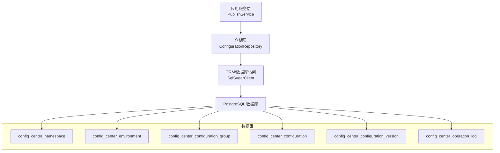
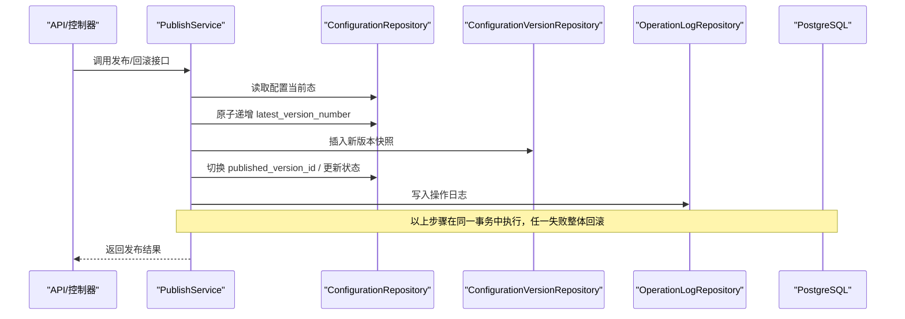
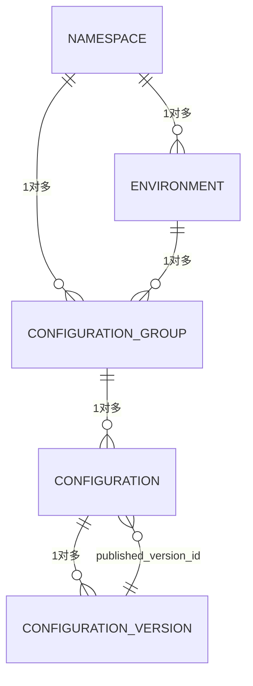
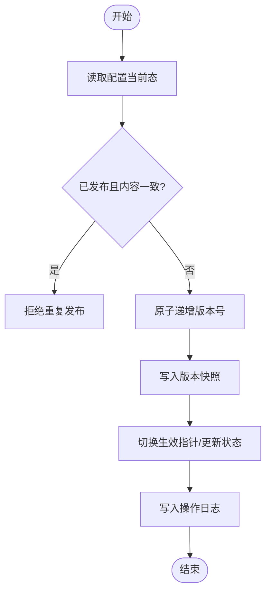
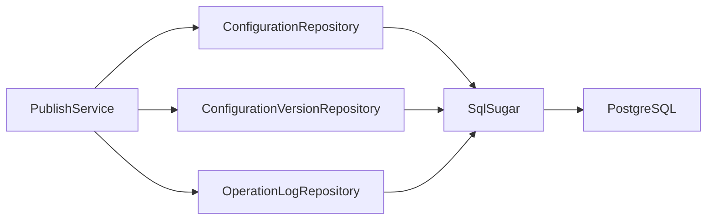

# 数据库设计

<cite>
**本文引用的文件**
- [配置中心建表脚本.sql](file://docs/数据库脚本/配置中心建表脚本.sql)
- [ConfigCenterNamespace.cs](file://k_config_center/src/Entities/ConfigCenterNamespace.cs)
- [ConfigCenterEnvironment.cs](file://k_config_center/src/Entities/ConfigCenterEnvironment.cs)
- [ConfigCenterConfigurationGroup.cs](file://k_config_center/src/Entities/ConfigCenterConfigurationGroup.cs)
- [ConfigCenterConfiguration.cs](file://k_config_center/src/Entities/ConfigCenterConfiguration.cs)
- [ConfigCenterConfigurationVersion.cs](file://k_config_center/src/Entities/ConfigCenterConfigurationVersion.cs)
- [ConfigCenterOperationLog.cs](file://k_config_center/src/Entities/ConfigCenterOperationLog.cs)
- [ConfigurationRepository.cs](file://k_config_center/src/Repositories/ConfigurationRepository.cs)
- [PublishService.cs](file://k_config_center/src/Services/PublishService.cs)
- [配置中心设计文档.md](file://docs/设计文档/配置中心设计文档.md)
</cite>

## 目录
1. [引言](#引言)
2. [项目结构](#项目结构)
3. [核心组件](#核心组件)
4. [架构总览](#架构总览)
5. [详细组件分析](#详细组件分析)
6. [依赖关系分析](#依赖关系分析)
7. [性能与查询优化](#性能与查询优化)
8. [数据迁移与版本管理](#数据迁移与版本管理)
9. [备份与恢复方案](#备份与恢复方案)
10. [故障排查指南](#故障排查指南)
11. [结论](#结论)

## 引言
本文件面向配置中心的数据库设计与实现，系统性说明所有表的结构、字段类型、约束条件、索引策略、表间关系与业务含义；并给出发布/回滚流程的数据流、查询优化建议、数据迁移与版本管理策略、备份恢复方案以及常见问题的排查方法。目标读者包括后端开发、DBA、测试与运维人员。

## 项目结构
本项目采用“实体模型 + 仓储 + 服务”的分层组织：
- 实体模型（Entities）：映射数据库表结构，定义字段、类型与约束。
- 仓储（Repositories）：封装对表的读写操作，包含复杂查询、事务边界内的原子更新。
- 服务（Services）：编排业务流程（如发布、回滚、下线），协调多个仓储完成一致性操作。
- 数据库脚本：提供 PostgreSQL 的建表 DDL、触发器与初始化数据。

图表来源
- [配置中心建表脚本.sql:16-303](file://docs/数据库脚本/配置中心建表脚本.sql#L16-L303)
- [ConfigurationRepository.cs:1-155](file://k_config_center/src/Repositories/ConfigurationRepository.cs#L1-L155)
- [PublishService.cs:1-116](file://k_config_center/src/Services/PublishService.cs#L1-L116)

章节来源
- [配置中心设计文档.md:10-65](file://docs/设计文档/配置中心设计文档.md#L10-L65)
- [配置中心建表脚本.sql:16-303](file://docs/数据库脚本/配置中心建表脚本.sql#L16-L303)

## 核心组件
- 命名空间（namespace）：顶层隔离单元，默认内置 public。
- 环境（environment）：隶属于命名空间，用于 dev/test/staging/prod 等环境维度。
- 配置组（configuration_group）：隶属于环境，将相关配置项分组。
- 配置项（configuration）：当前态记录，保存最新编辑内容与状态、MD5、版本号指针等。
- 配置版本（configuration_version）：历史快照，不可变，线性递增，支持回滚。
- 操作日志（operation_log）：审计流水，仅存 ID 与详情，无外键约束，避免影响主表写入/删除。

章节来源
- [配置中心设计文档.md:10-65](file://docs/设计文档/配置中心设计文档.md#L10-L65)
- [配置中心建表脚本.sql:26-258](file://docs/数据库脚本/配置中心建表脚本.sql#L26-L258)

## 架构总览
下图展示从服务到仓储再到数据库的调用链，以及发布/回滚在事务中的关键步骤。

图表来源
- [PublishService.cs:24-108](file://k_config_center/src/Services/PublishService.cs#L24-L108)
- [ConfigurationRepository.cs:75-124](file://k_config_center/src/Repositories/ConfigurationRepository.cs#L75-L124)

## 详细组件分析

### 表结构与字段定义
- config_center_namespace
  - 主键：id（BIGINT IDENTITY）
  - 唯一性：namespace_key（部分唯一，WHERE deleted_at IS NULL）
  - 软删除：deleted_at
  - 审计字段：created_by/updated_by, created_at/updated_at
- config_center_environment
  - 主键：id
  - 外键：namespace_id → namespace.id
  - 唯一性：(namespace_id, environment_key) 部分唯一
  - 排序：sort_order
  - 软删除：deleted_at
- config_center_configuration_group
  - 主键：id
  - 外键：namespace_id → namespace.id；environment_id → environment.id
  - 唯一性：(environment_id, group_key) 部分唯一
  - 查询索引：(namespace_id, environment_id)
  - 软删除：deleted_at
- config_center_configuration
  - 主键：id
  - 外键：group_id → configuration_group.id；published_version_id → configuration_version.id（延迟建立）
  - 冗余字段：namespace_id, environment_id（高频读避免 JOIN）
  - 唯一性：(group_id, configuration_key) 部分唯一
  - 校验：format IN ('text','json','yaml','properties','xml','toml')；status IN ('DRAFT','PUBLISHED','OFFLINE')
  - 查询索引：(namespace_id, environment_id, status)
  - 软删除：deleted_at
- config_center_configuration_version
  - 主键：id
  - 外键：configuration_id → configuration.id
  - 唯一性：(configuration_id, version_number)
  - 校验：change_type IN ('CREATE','UPDATE','DELETE','ROLLBACK','IMPORT')
  - 查询索引：(configuration_id, version_number DESC)
  - 不可变：不提供删除能力
- config_center_operation_log
  - 主键：id
  - 无外键：仅记录各级 ID，避免影响主表写入/删除
  - JSONB：detail 存储操作详情
  - 查询索引：(configuration_id, created_at DESC)

章节来源
- [配置中心建表脚本.sql:26-258](file://docs/数据库脚本/配置中心建表脚本.sql#L26-L258)
- [ConfigCenterNamespace.cs:1-39](file://k_config_center/src/Entities/ConfigCenterNamespace.cs#L1-L39)
- [ConfigCenterEnvironment.cs:1-39](file://k_config_center/src/Entities/ConfigCenterEnvironment.cs#L1-L39)
- [ConfigCenterConfigurationGroup.cs:1-45](file://k_config_center/src/Entities/ConfigCenterConfigurationGroup.cs#L1-L45)
- [ConfigCenterConfiguration.cs:1-66](file://k_config_center/src/Entities/ConfigCenterConfiguration.cs#L1-L66)
- [ConfigCenterConfigurationVersion.cs:1-39](file://k_config_center/src/Entities/ConfigCenterConfigurationVersion.cs#L1-L39)
- [ConfigCenterOperationLog.cs:1-41](file://k_config_center/src/Entities/ConfigCenterOperationLog.cs#L1-L41)

### 表关系与关联规则
- 层级关系：namespace 1→* environment；namespace 1→* configuration_group；environment 1→* configuration_group；configuration_group 1→* configuration；configuration 1→* configuration_version；configuration *→1 configuration_version（published_version_id）。
- 部分唯一索引：确保未软删除范围内 key 的唯一性，允许软删除后重建同 key 资源。
- 冗余字段：configuration 冗余 namespace_id/environment_id，提升客户端批量拉取性能。
- 审计表：operation_log 不建立外键，避免级联删除与写入性能影响。

图表来源
- [配置中心设计文档.md:37-57](file://docs/设计文档/配置中心设计文档.md#L37-L57)
- [配置中心建表脚本.sql:62-225](file://docs/数据库脚本/配置中心建表脚本.sql#L62-L225)

### 数据模型的业务含义与设计原则
- 分层隔离：通过 namespace 与 environment 实现业务线与环境的强隔离。
- 版本化与可追溯：每次发布/回滚生成不可变快照，版本号线性递增，支持回滚与审计。
- 软删除统一策略：四张主资源表均使用 deleted_at 标记软删除，配合部分唯一索引允许重建。
- 高性能读取：冗余字段减少 JOIN，结合复合索引满足客户端高频按 namespace+environment 拉取场景。
- 格式灵活：content 使用 TEXT 原样存储，format 限制合法值，兼顾可读性与扩展性。

章节来源
- [配置中心设计文档.md:10-65](file://docs/设计文档/配置中心设计文档.md#L10-L65)
- [配置中心设计文档.md:238-251](file://docs/设计文档/配置中心设计文档.md#L238-L251)

### 发布/回滚流程的数据流

图表来源
- [PublishService.cs:24-108](file://k_config_center/src/Services/PublishService.cs#L24-L108)
- [ConfigurationRepository.cs:75-103](file://k_config_center/src/Repositories/ConfigurationRepository.cs#L75-L103)

章节来源
- [PublishService.cs:24-108](file://k_config_center/src/Services/PublishService.cs#L24-L108)
- [ConfigurationRepository.cs:75-124](file://k_config_center/src/Repositories/ConfigurationRepository.cs#L75-L124)

### 时间戳自动维护
- 通过通用触发器函数在 BEFORE UPDATE 时刷新 updated_at。
- created_at 由列默认值 now() 在插入时生成。
- 应用层无需手动赋值，保证一致性。

章节来源
- [配置中心建表脚本.sql:265-296](file://docs/数据库脚本/配置中心建表脚本.sql#L265-L296)

## 依赖关系分析
- 服务层依赖仓储层进行数据访问，仓储层通过 SqlSugar 访问 PostgreSQL。
- 发布/回滚事务内顺序执行：版本号递增 → 写快照 → 切换指针 → 写日志，任一失败整体回滚。
- 并发控制：通过数据库行锁与唯一约束（version_number 唯一）防止并发冲突。

图表来源
- [PublishService.cs:14-19](file://k_config_center/src/Services/PublishService.cs#L14-L19)
- [ConfigurationRepository.cs:1-155](file://k_config_center/src/Repositories/ConfigurationRepository.cs#L1-L155)

章节来源
- [PublishService.cs:94-108](file://k_config_center/src/Services/PublishService.cs#L94-L108)
- [ConfigurationRepository.cs:105-124](file://k_config_center/src/Repositories/ConfigurationRepository.cs#L105-L124)

## 性能与查询优化
- 索引设计
  - 部分唯一索引：unique_namespace_key、unique_environment_namespace_key、unique_group_environment_key、unique_configuration_key（WHERE deleted_at IS NULL）。
  - 查询索引：index_configuration_namespace_environment(namespace_id, environment_id, status)；index_version_configuration(configuration_id, version_number DESC)；index_operation_log_configuration(configuration_id, created_at DESC)。
- 冗余字段
  - configuration 冗余 namespace_id/environment_id，避免频繁 JOIN，提高客户端批量拉取性能。
- 查询路径
  - 客户端读取：按 namespace+environment+group(+key) 过滤，命中 PUBLISHED 且未软删除的记录，内容取自 published_version_id 指向的版本快照。
  - 变更探测：基于 md5 对比，低成本长轮询。
- 建议
  - 保持 format/status 等枚举字段使用 CHECK 约束，避免脏数据。
  - 对高频查询条件建立复合索引，避免全表扫描。
  - 审计日志按 configuration_id 与时间倒序查询，已有合适索引。

章节来源
- [配置中心建表脚本.sql:43-245](file://docs/数据库脚本/配置中心建表脚本.sql#L43-L245)
- [ConfigurationRepository.cs:105-124](file://k_config_center/src/Repositories/ConfigurationRepository.cs#L105-L124)
- [配置中心设计文档.md:207-214](file://docs/设计文档/配置中心设计文档.md#L207-L214)

## 数据迁移与版本管理
- 迁移策略
  - 以 SQL 脚本为单一事实源，DDL 幂等化（建议使用 CREATE TABLE IF NOT EXISTS 或带条件 DROP 的重建脚本，谨慎在生产使用）。
  - 新增字段/索引/约束时，先评估对现有查询的影响，必要时分阶段上线（先加字段/索引，再改代码）。
- 版本管理
  - 版本号线性递增，禁止回退版本号；回滚通过生成新快照实现，保证历史可追溯。
  - 发布/回滚事务内保证版本号、快照、指针、日志的一致性。
- 约束与兼容性
  - 使用 VARCHAR + CHECK 替代 ENUM，便于跨库迁移与扩展。
  - 延迟建立外键以避免循环依赖。

章节来源
- [配置中心建表脚本.sql:222-225](file://docs/数据库脚本/配置中心建表脚本.sql#L222-L225)
- [PublishService.cs:94-108](file://k_config_center/src/Services/PublishService.cs#L94-L108)
- [配置中心设计文档.md:243-247](file://docs/设计文档/配置中心设计文档.md#L243-L247)

## 备份与恢复方案
- 备份
  - 定期逻辑备份（pg_dump）与物理备份（WAL 归档）结合，确保 RPO/RTO 目标达成。
  - 对大表（如 content 文本）关注备份体积与压缩策略。
- 恢复
  - 演练恢复流程，验证数据一致性与完整性。
  - 针对误删场景，利用软删除与版本快照快速恢复（恢复至最近有效版本）。
- 监控
  - 监控备份任务成功率与耗时，异常告警。
  - 监控数据库磁盘空间与 WAL 增长。

[本节为通用指导，不直接引用具体文件]

## 故障排查指南
- 常见问题
  - 重复发布：当已发布且内容与生效版本 MD5 一致时，拒绝重复发布。
  - 并发冲突：唯一约束（configuration_id, version_number）冲突提示重试。
  - 资源不存在：配置不存在或已被软删除时，返回相应错误。
- 定位方法
  - 查看操作日志（operation_log）确认操作轨迹与详情。
  - 检查版本快照（configuration_version）确认发布/回滚是否成功。
  - 核对当前态（configuration）的状态与生效指针（published_version_id）。
- 处理建议
  - 遇到唯一约束冲突，稍后重试或检查并发入口。
  - 若状态异常，可通过回滚到历史版本恢复。

章节来源
- [PublishService.cs:24-108](file://k_config_center/src/Services/PublishService.cs#L24-L108)
- [ConfigurationRepository.cs:75-103](file://k_config_center/src/Repositories/ConfigurationRepository.cs#L75-L103)

## 结论
该数据库设计通过分层隔离、版本化与软删除机制，实现了高可靠、可追溯的配置管理能力。合理的索引与冗余字段保障了客户端高频读取性能；发布/回滚事务保证了数据一致性。建议在生产环境中严格执行迁移与备份策略，并结合监控与告警保障系统稳定性。