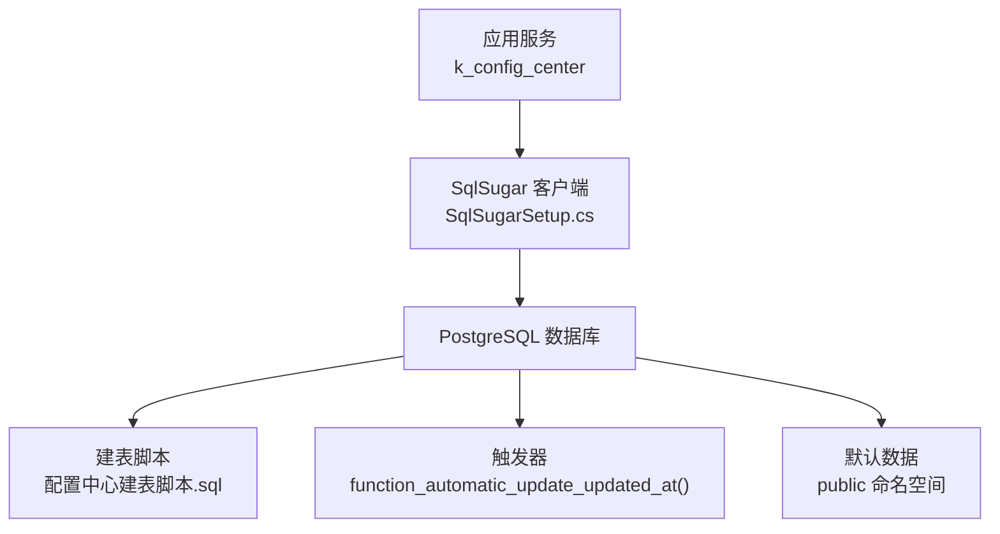
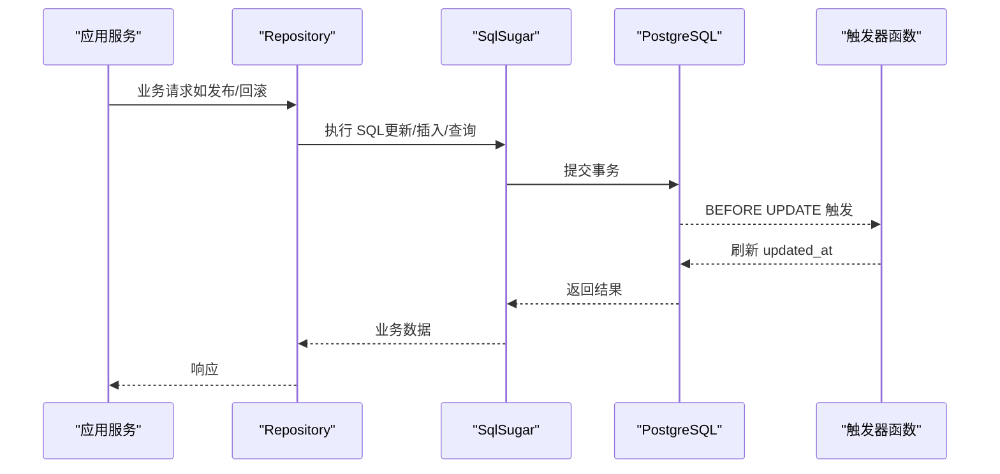
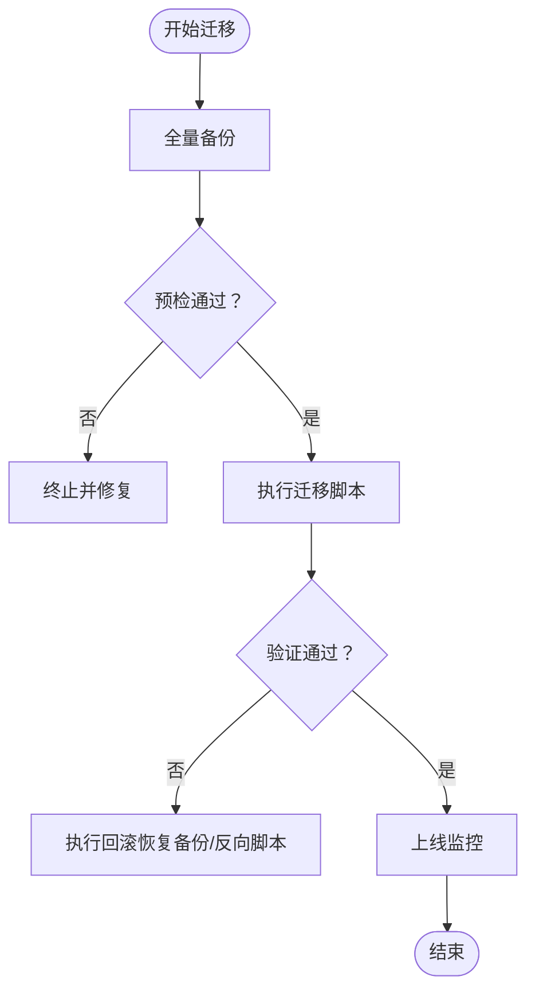
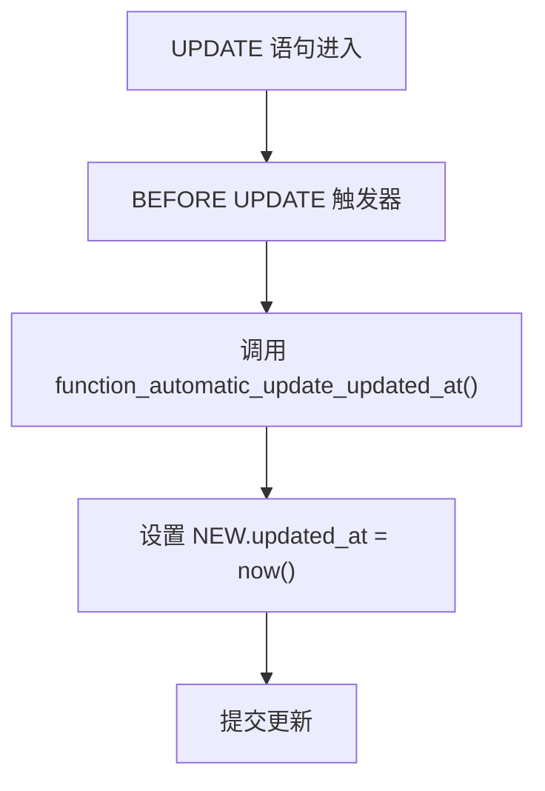
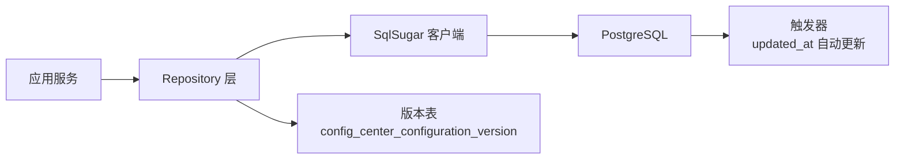

# 数据迁移管理

<cite>
**本文引用的文件**
- [配置中心建表脚本.sql](file://docs/数据库脚本/配置中心建表脚本.sql)
- [SqlSugarSetup.cs](file://k_config_center/src/Infrastructure/SqlSugarSetup.cs)
- [ConfigCenterNamespace.cs](file://k_config_center/src/Entities/ConfigCenterNamespace.cs)
- [ConfigCenterConfiguration.cs](file://k_config_center/src/Entities/ConfigCenterConfiguration.cs)
- [appsettings.json](file://k_config_center/appsettings.json)
- [PublishService.cs](file://k_config_center/src/Services/PublishService.cs)
- [ConfigurationRepository.cs](file://k_config_center/src/Repositories/ConfigurationRepository.cs)
- [NamespaceRepository.cs](file://k_config_center/src/Repositories/NamespaceRepository.cs)
- [后端方案.md](file://docs/技术方案/后端方案.md)
- [配置中心设计文档.md](file://docs/设计文档/配置中心设计文档.md)
</cite>

## 目录
1. [简介](#简介)
2. [项目结构](#项目结构)
3. [核心组件](#核心组件)
4. [架构总览](#架构总览)
5. [详细组件分析](#详细组件分析)
6. [依赖关系分析](#依赖关系分析)
7. [性能考量](#性能考量)
8. [故障排查指南](#故障排查指南)
9. [结论](#结论)
10. [附录](#附录)

## 简介
本文件面向生产与运维团队，系统化说明配置中心的数据库初始化、幂等性设计、重复执行注意事项、生产环境迁移流程与回滚策略、自动更新时间戳触发器机制，以及备份恢复与默认数据（public 命名空间）管理方式。目标是让读者在不深入代码细节的前提下，也能安全、规范地完成数据迁移与日常维护。

## 项目结构
- 数据库 DDL 与初始数据位于 docs/数据库脚本/配置中心建表脚本.sql，包含所有表结构、索引、约束、触发器及默认 public 命名空间数据。
- 应用层通过 SqlSugar 进行 ORM 映射，但明确禁用 CodeFirst 建表，DDL 由脚本手工执行，避免应用启动时隐式变更数据库结构。
- 连接字符串在 appsettings.json 中配置，部署前需替换占位符。

图表来源
- [SqlSugarSetup.cs:12-38](file://k_config_center/src/Infrastructure/SqlSugarSetup.cs#L12-L38)
- [配置中心建表脚本.sql:26-303](file://docs/数据库脚本/配置中心建表脚本.sql#L26-L303)

章节来源
- [SqlSugarSetup.cs:12-38](file://k_config_center/src/Infrastructure/SqlSugarSetup.cs#L12-L38)
- [配置中心建表脚本.sql:26-303](file://docs/数据库脚本/配置中心建表脚本.sql#L26-L303)
- [appsettings.json:9-11](file://k_config_center/appsettings.json#L9-L11)

## 核心组件
- 数据库脚本：定义命名空间、环境、配置组、配置项、版本快照、操作日志等表结构；为含 updated_at 的表创建 BEFORE UPDATE 触发器；插入默认 public 命名空间。
- ORM 配置：SqlSugarSetup 注册单例 ISqlSugarClient，启用全局软删除过滤器，禁止 CodeFirst 建表，确保 DDL 由脚本控制。
- 实体映射：Entity 仅做映射，字段类型与列名通过特性标注，时间字段使用 timestamptz，支持软删除。
- 发布与回滚：PublishService 实现发布与回滚逻辑，版本号原子递增，回滚以新快照形式保持历史可追溯。
- 默认数据：脚本末尾插入 public 命名空间，作为系统内置默认隔离单元。

章节来源
- [配置中心建表脚本.sql:26-303](file://docs/数据库脚本/配置中心建表脚本.sql#L26-L303)
- [SqlSugarSetup.cs:12-38](file://k_config_center/src/Infrastructure/SqlSugarSetup.cs#L12-L38)
- [ConfigCenterNamespace.cs:6-38](file://k_config_center/src/Entities/ConfigCenterNamespace.cs#L6-L38)
- [ConfigCenterConfiguration.cs:6-65](file://k_config_center/src/Entities/ConfigCenterConfiguration.cs#L6-L65)
- [PublishService.cs:56-80](file://k_config_center/src/Services/PublishService.cs#L56-L80)

## 架构总览
下图展示从应用到数据库的关键路径：应用通过 Repository/Service 调用 SqlSugar，SqlSugar 基于连接字符串访问 PostgreSQL；DDL 与触发器由脚本管理；默认数据在脚本中初始化。

图表来源
- [ConfigurationRepository.cs:75-90](file://k_config_center/src/Repositories/ConfigurationRepository.cs#L75-L90)
- [配置中心建表脚本.sql:265-296](file://docs/数据库脚本/配置中心建表脚本.sql#L265-L296)

## 详细组件分析

### 数据库初始化脚本使用方法与执行步骤
- 适用数据库：PostgreSQL 14+。
- 执行方式：使用 psql 工具执行脚本文件，参数包括用户、数据库名与主机端口。
- 执行顺序：首次部署或重建环境时执行完整脚本；后续增量升级应遵循“先备份、再执行、后验证”的流程。
- 幂等说明：脚本注释提示如需重复执行可取消 DROP TABLE 注释块（会级联删除数据，慎用），或自行改造为 IF NOT EXISTS 模式。当前脚本未采用幂等建表语句，重复执行将报错或需显式清理。

建议执行步骤
1. 准备目标库连接信息并校验连通性。
2. 对目标库执行全量备份。
3. 在非生产环境先行演练执行脚本，确认无异常。
4. 在生产窗口内执行脚本，记录执行时间与输出。
5. 执行后验证关键对象存在（表、索引、触发器、默认数据）。
6. 启动应用并进行健康检查与冒烟测试。

章节来源
- [配置中心建表脚本.sql:1-14](file://docs/数据库脚本/配置中心建表脚本.sql#L1-L14)
- [配置中心建表脚本.sql:26-303](file://docs/数据库脚本/配置中心建表脚本.sql#L26-L303)

### 幂等性设计与重复执行的注意事项
- 幂等性现状：当前脚本非幂等，重复执行会因对象已存在而失败；若需幂等，可将 CREATE TABLE 改为 IF NOT EXISTS，并为唯一约束增加部分唯一条件（脚本已对 key 列使用 WHERE deleted_at IS NULL 的部分唯一索引）。
- 重复执行风险：DROP TABLE 会级联删除数据，仅在开发/测试环境重建时使用；生产环境严禁随意 DROP。
- 建议实践：
  - 将脚本拆分为“基础结构”和“增量变更”，增量变更采用幂等写法（IF NOT EXISTS、DO NOTHING、版本化迁移表）。
  - 引入迁移元数据表记录已执行脚本版本，避免重复执行。
  - 在执行前后采集对象清单（表、索引、触发器）用于比对。

章节来源
- [配置中心建表脚本.sql:16-25](file://docs/数据库脚本/配置中心建表脚本.sql#L16-L25)
- [配置中心建表脚本.sql:43-44](file://docs/数据库脚本/配置中心建表脚本.sql#L43-L44)
- [配置中心建表脚本.sql:76-77](file://docs/数据库脚本/配置中心建表脚本.sql#L76-L77)
- [配置中心建表脚本.sql:112-113](file://docs/数据库脚本/配置中心建表脚本.sql#L112-L113)
- [配置中心建表脚本.sql:161-162](file://docs/数据库脚本/配置中心建表脚本.sql#L161-L162)

### 生产环境的数据迁移流程与回滚策略
- 迁移流程
  1. 评估影响范围与停机窗口。
  2. 全量备份数据库。
  3. 在预生产环境验证脚本与回滚脚本。
  4. 生产执行迁移，记录执行结果与耗时。
  5. 执行后验证关键指标与功能。
  6. 观察一段时间，必要时回滚。
- 回滚策略
  - 数据库层面：基于备份恢复至迁移前状态；或执行反向 DDL（谨慎，可能丢失数据）。
  - 应用层面：回滚应用版本，确保与数据库兼容。
  - 业务回滚：对于配置项，可通过 PublishService 的回滚能力恢复到指定历史版本，生成新的 ROLLBACK 快照并保持版本线性递增。

章节来源
- [配置中心建表脚本.sql:16-25](file://docs/数据库脚本/配置中心建表脚本.sql#L16-L25)
- [PublishService.cs:56-80](file://k_config_center/src/Services/PublishService.cs#L56-L80)
- [后端方案.md:626-633](file://docs/技术方案/后端方案.md#L626-L633)

### 触发器 function_automatic_update_updated_at 的作用与自动更新机制
- 作用：PostgreSQL 不支持 ON UPDATE CURRENT_TIMESTAMP，因此通过通用触发器函数在每次行更新前自动将 updated_at 设置为当前时间。
- 覆盖范围：为所有含 updated_at 的表创建 BEFORE UPDATE 触发器；不含 updated_at 的版本表与日志表无需触发器。
- 优势：统一维护更新时间，避免应用层遗漏赋值；保证审计一致性。

图表来源
- [配置中心建表脚本.sql:265-296](file://docs/数据库脚本/配置中心建表脚本.sql#L265-L296)

章节来源
- [配置中心建表脚本.sql:259-296](file://docs/数据库脚本/配置中心建表脚本.sql#L259-L296)
- [配置中心设计文档.md:212-214](file://docs/设计文档/配置中心设计文档.md#L212-L214)

### 数据备份与恢复方案（全量与增量）
- 全量备份
  - 使用 pg_dump 导出整个数据库或指定 schema，适用于首次迁移、灾难恢复与归档。
  - 建议在迁移前执行一次全量备份，并校验备份完整性。
- 增量备份
  - 使用 WAL 归档与时间点恢复（PITR），可实现按分钟级的增量恢复。
  - 结合定期全量备份与连续 WAL 归档，满足 RPO/RTO 要求。
- 恢复策略
  - 误删/损坏：基于最近全量备份 + WAL 回放恢复至指定时间点。
  - 迁移失败：直接恢复到迁移前的全量备份点。
- 注意事项
  - 备份文件加密存储与权限控制。
  - 定期演练恢复流程，验证可用性。
  - 备份保留策略与合规要求对齐。

[本节为通用指导，不直接分析具体文件]

### 默认数据初始化（public 命名空间）的管理方式
- 默认数据：脚本末尾插入 public 命名空间，作为系统内置默认隔离单元，便于快速上手与最小可用环境。
- 管理建议
  - 首次部署后，可在应用中创建更多业务命名空间，并按需禁用或删除默认命名空间。
  - 若需幂等初始化，可在应用启动阶段检测是否存在 public 命名空间，不存在则插入；或通过迁移脚本判断后再插入。
  - 注意：namespace_key 具有部分唯一索引（WHERE deleted_at IS NULL），软删除后可复用 key。

章节来源
- [配置中心建表脚本.sql:298-303](file://docs/数据库脚本/配置中心建表脚本.sql#L298-L303)
- [配置中心建表脚本.sql:43-44](file://docs/数据库脚本/配置中心建表脚本.sql#L43-L44)
- [NamespaceRepository.cs:27-41](file://k_config_center/src/Repositories/NamespaceRepository.cs#L27-L41)

## 依赖关系分析
- 应用与数据库：SqlSugarSetup 提供统一的 ISqlSugarClient 单例，所有 Repository 共享同一连接上下文，确保事务一致性与软删除过滤生效。
- 实体与表：Entity 通过特性映射到物理表，时间字段使用 timestamptz，支持软删除；触发器负责自动维护 updated_at。
- 发布与版本：ConfigurationRepository 原子递增版本号并发布；PublishService 封装发布与回滚事务，保证一致性。

图表来源
- [SqlSugarSetup.cs:12-38](file://k_config_center/src/Infrastructure/SqlSugarSetup.cs#L12-L38)
- [ConfigurationRepository.cs:75-90](file://k_config_center/src/Repositories/ConfigurationRepository.cs#L75-L90)
- [配置中心建表脚本.sql:265-296](file://docs/数据库脚本/配置中心建表脚本.sql#L265-L296)

章节来源
- [SqlSugarSetup.cs:12-38](file://k_config_center/src/Infrastructure/SqlSugarSetup.cs#L12-L38)
- [ConfigurationRepository.cs:75-90](file://k_config_center/src/Repositories/ConfigurationRepository.cs#L75-L90)
- [配置中心建表脚本.sql:265-296](file://docs/数据库脚本/配置中心建表脚本.sql#L265-L296)

## 性能考量
- 索引优化：脚本为高频查询建立复合索引与部分唯一索引，减少 JOIN 与扫描成本。
- 软删除：通过全局过滤器与部分唯一索引提升查询效率并允许 key 复用。
- 触发器开销：BEFORE UPDATE 触发器仅设置时间戳，开销极低；在高并发更新场景下仍保持良好性能。
- 发布原子性：版本号递增与发布状态切换在同一事务中完成，避免竞态条件。

章节来源
- [配置中心建表脚本.sql:43-44](file://docs/数据库脚本/配置中心建表脚本.sql#L43-L44)
- [配置中心建表脚本.sql:76-77](file://docs/数据库脚本/配置中心建表脚本.sql#L76-L77)
- [配置中心建表脚本.sql:112-113](file://docs/数据库脚本/配置中心建表脚本.sql#L112-L113)
- [配置中心建表脚本.sql:161-162](file://docs/数据库脚本/配置中心建表脚本.sql#L161-L162)
- [ConfigurationRepository.cs:75-90](file://k_config_center/src/Repositories/ConfigurationRepository.cs#L75-L90)

## 故障排查指南
- 连接失败：检查 appsettings.json 中的 ConnectionStrings:PostgreSQL 是否已替换为真实值。
- 重复执行脚本报错：确认是否已存在同名对象；如需重建，先在非生产环境演练 DROP 与重建。
- 触发器未生效：核对是否创建了 BEFORE UPDATE 触发器且指向正确的函数；检查表是否包含 updated_at 列。
- 发布失败：查看版本号递增与发布状态更新是否在事务内成功；检查版本快照写入与日志记录。
- 默认数据缺失：确认脚本末尾是否执行了 public 命名空间插入；或在应用启动阶段进行幂等初始化。

章节来源
- [appsettings.json:9-11](file://k_config_center/appsettings.json#L9-L11)
- [配置中心建表脚本.sql:265-296](file://docs/数据库脚本/配置中心建表脚本.sql#L265-L296)
- [ConfigurationRepository.cs:75-90](file://k_config_center/src/Repositories/ConfigurationRepository.cs#L75-L90)
- [PublishService.cs:56-80](file://k_config_center/src/Services/PublishService.cs#L56-L80)

## 结论
本项目的数据迁移以“脚本驱动、应用只读映射”的方式实现，确保数据库结构与触发器由脚本集中管理，应用层专注业务逻辑。通过幂等性改造建议、严格的迁移流程与回滚策略、自动更新时间戳触发器、完善的备份恢复方案以及默认数据管理，能够在生产环境中安全、可控地演进数据库结构并保障业务连续性。

## 附录
- 常用命令参考（示例）
  - 全量备份：pg_dump -U <user> -d <database> -f backup.sql
  - 全量恢复：psql -U <user> -d <database> -f backup.sql
  - 执行脚本：psql -U <user> -d <database> -f 配置中心建表脚本.sql
- 建议的迁移元数据表
  - migration_history：记录脚本名称、版本、执行时间、执行状态，用于幂等控制与审计。

[本节为通用指导，不直接分析具体文件]