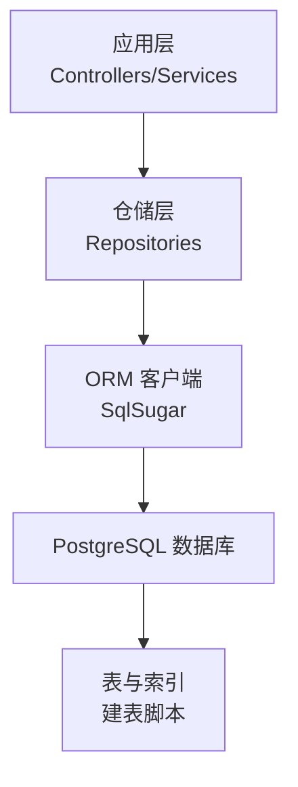
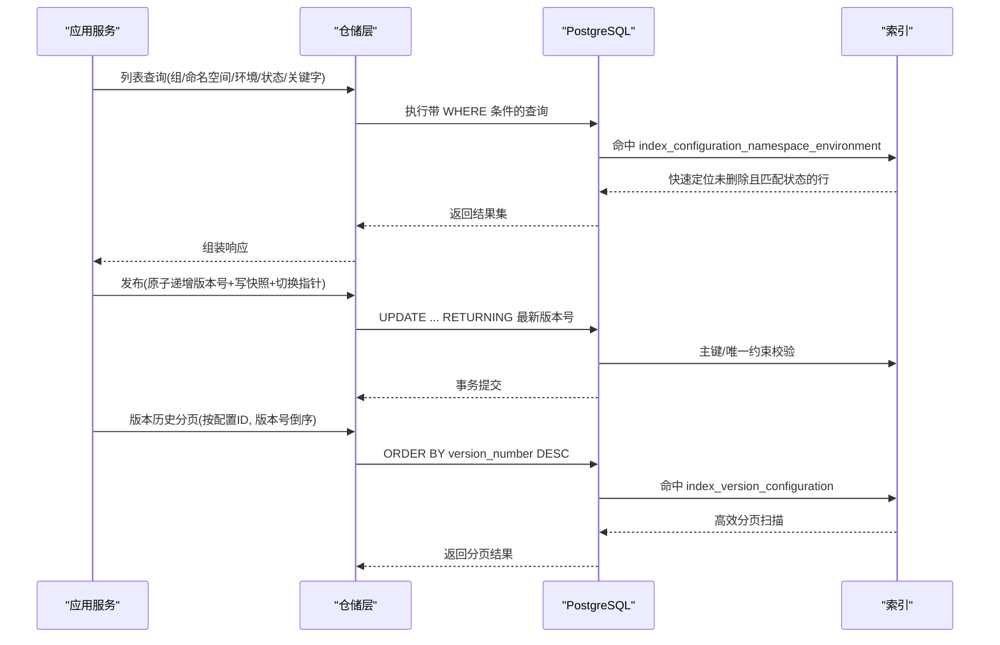
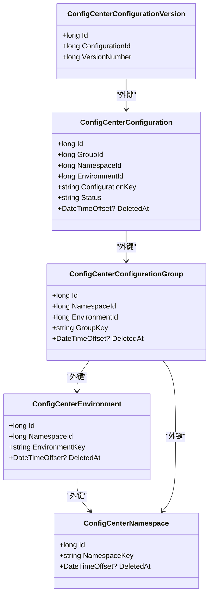

# 索引优化策略

<cite>
**本文引用的文件**
- [配置中心建表脚本.sql](file://docs/数据库脚本/配置中心建表脚本.sql)
- [ConfigCenterConfiguration.cs](file://k_config_center/src/Entities/ConfigCenterConfiguration.cs)
- [ConfigCenterConfigurationVersion.cs](file://k_config_center/src/Entities/ConfigCenterConfigurationVersion.cs)
- [ConfigCenterNamespace.cs](file://k_config_center/src/Entities/ConfigCenterNamespace.cs)
- [ConfigCenterEnvironment.cs](file://k_config_center/src/Entities/ConfigCenterEnvironment.cs)
- [ConfigCenterConfigurationGroup.cs](file://k_config_center/src/Entities/ConfigCenterConfigurationGroup.cs)
- [ConfigurationRepository.cs](file://k_config_center/src/Repositories/ConfigurationRepository.cs)
- [ConfigurationVersionRepository.cs](file://k_config_center/src/Repositories/ConfigurationVersionRepository.cs)
- [NamespaceRepository.cs](file://k_config_center/src/Repositories/NamespaceRepository.cs)
- [EnvironmentRepository.cs](file://k_config_center/src/Repositories/EnvironmentRepository.cs)
- [ConfigurationService.cs](file://k_config_center/src/Services/ConfigurationService.cs)
- [PublishService.cs](file://k_config_center/src/Services/PublishService.cs)
</cite>

## 目录
1. [简介](#简介)
2. [项目结构](#项目结构)
3. [核心组件](#核心组件)
4. [架构总览](#架构总览)
5. [详细组件分析](#详细组件分析)
6. [依赖关系分析](#依赖关系分析)
7. [性能考量](#性能考量)
8. [故障排查指南](#故障排查指南)
9. [结论](#结论)
10. [附录](#附录)

## 简介
本文件面向配置中心的数据库索引设计与优化，系统性说明各类索引的设计目的、使用场景与查询收益，重点覆盖：
- 唯一索引与普通索引在命名空间、环境、配置组、配置项上的应用
- 部分唯一索引（基于 deleted_at）在软删除场景下的优势
- 复合索引对高频查询的加速效果
- 版本历史查询索引对历史数据检索的优化
- 索引选择器分析与性能监控方法
- 索引维护建议与最佳实践

## 项目结构
本项目采用分层架构：实体层定义表结构映射；仓储层封装 SQL 查询；服务层编排业务逻辑。数据库脚本集中定义了所有表与索引，是索引设计的权威来源。

图表来源
- [配置中心建表脚本.sql:1-303](file://docs/数据库脚本/配置中心建表脚本.sql#L1-L303)

章节来源
- [配置中心建表脚本.sql:1-303](file://docs/数据库脚本/配置中心建表脚本.sql#L1-L303)

## 核心组件
- 命名空间、环境、配置组、配置项、版本快照、操作日志六张核心表
- 通过部分唯一索引实现“软删除后可复用 key”的业务语义
- 通过复合索引支撑“按维度过滤 + 状态过滤”的高频列表查询
- 通过版本索引支撑“按配置项分页查看历史版本”的倒序查询

章节来源
- [配置中心建表脚本.sql:26-258](file://docs/数据库脚本/配置中心建表脚本.sql#L26-L258)
- [ConfigCenterConfiguration.cs:1-66](file://k_config_center/src/Entities/ConfigCenterConfiguration.cs#L1-L66)
- [ConfigCenterConfigurationVersion.cs:1-39](file://k_config_center/src/Entities/ConfigCenterConfigurationVersion.cs#L1-L39)
- [ConfigCenterNamespace.cs:1-39](file://k_config_center/src/Entities/ConfigCenterNamespace.cs#L1-L39)
- [ConfigCenterEnvironment.cs:1-39](file://k_config_center/src/Entities/ConfigCenterEnvironment.cs#L1-L39)
- [ConfigCenterConfigurationGroup.cs:1-45](file://k_config_center/src/Entities/ConfigCenterConfigurationGroup.cs#L1-L45)

## 架构总览
下图展示了从应用查询到数据库索引利用的关键路径，体现索引如何参与列表查询、发布流程与版本历史查询。

图表来源
- [ConfigurationRepository.cs:13-30](file://k_config_center/src/Repositories/ConfigurationRepository.cs#L13-L30)
- [ConfigurationRepository.cs:107-124](file://k_config_center/src/Repositories/ConfigurationRepository.cs#L107-L124)
- [ConfigurationVersionRepository.cs:25-33](file://k_config_center/src/Repositories/ConfigurationVersionRepository.cs#L25-L33)
- [配置中心建表脚本.sql:161-208](file://docs/数据库脚本/配置中心建表脚本.sql#L161-L208)

## 详细组件分析

### 命名空间与环境的软删除与部分唯一索引
- unique_namespace_key：仅对未软删除记录生效，确保 namespace_key 全局唯一；软删除后允许复用该 key，便于资源回收与迁移
- unique_environment_namespace_key：在命名空间内保证 environment_key 唯一（未软删除范围），支持同 key 软删后重建

设计优势
- 避免物理删除带来的外键级联与审计断裂问题
- 通过部分唯一索引将“业务唯一性”与“生命周期状态”绑定，减少应用层校验复杂度
- 提升插入/更新时的冲突检测效率，错误可精准定位

适用场景
- 新建/编辑命名空间与环境时，若存在同名但未删除的记录会触发唯一约束异常
- 软删除后，同一 key 可再次创建，满足“资源回收”需求

章节来源
- [配置中心建表脚本.sql:30-77](file://docs/数据库脚本/配置中心建表脚本.sql#L30-L77)
- [NamespaceRepository.cs:27-47](file://k_config_center/src/Repositories/NamespaceRepository.cs#L27-L47)
- [EnvironmentRepository.cs:31-50](file://k_config_center/src/Repositories/EnvironmentRepository.cs#L31-L50)

### 配置组的复合索引与部分唯一索引
- unique_group_environment_key：在环境内保证 group_key 唯一（未软删除范围）
- index_group_namespace_environment：复合索引用于按命名空间与环境筛选配置组

设计优势
- 复合索引覆盖“namespace_id + environment_id”常见过滤条件，避免全表扫描
- 部分唯一索引保障环境维度的分组标识唯一性

适用场景
- 管理端按环境列出配置组
- 删除环境前检查是否存在关联配置组

章节来源
- [配置中心建表脚本.sql:95-116](file://docs/数据库脚本/配置中心建表脚本.sql#L95-L116)

### 配置项的复合索引与部分唯一索引
- unique_configuration_key：在组内保证 configuration_key 唯一（未软删除范围）
- index_configuration_namespace_environment：复合索引用于按命名空间、环境、状态进行列表过滤

设计优势
- 列表查询通常包含 namespace_id、environment_id、status 等过滤条件，复合索引能显著减少回表与扫描行数
- 部分唯一索引使“组内 key 唯一”与“软删除”语义一致

适用场景
- 管理端配置列表：按组/命名空间/环境/状态/关键字过滤
- 客户端读取：按业务 key 定位已发布的配置并拉取版本快照

章节来源
- [配置中心建表脚本.sql:136-165](file://docs/数据库脚本/配置中心建表脚本.sql#L136-L165)
- [ConfigurationRepository.cs:13-30](file://k_config_center/src/Repositories/ConfigurationRepository.cs#L13-L30)
- [ConfigurationRepository.cs:107-124](file://k_config_center/src/Repositories/ConfigurationRepository.cs#L107-L124)

### 版本历史索引对历史数据检索的优化
- unique_version_configuration_number：保证每个配置项的版本号线性递增且不重复
- index_version_configuration：以 configuration_id 为主键列、version_number 降序排列，支撑“按配置项分页查看历史版本”的高效查询

设计优势
- 倒序分页查询直接走索引排序，避免额外排序开销
- 唯一约束防止并发发布产生重复版本号，结合事务与重试机制提升一致性

适用场景
- 版本历史列表：按配置项 ID 分页，按版本号倒序展示
- 单版本快照查询：根据配置项 ID 与版本号精确查找

章节来源
- [配置中心建表脚本.sql:192-208](file://docs/数据库脚本/配置中心建表脚本.sql#L192-L208)
- [ConfigurationVersionRepository.cs:25-33](file://k_config_center/src/Repositories/ConfigurationVersionRepository.cs#L25-L33)

### 客户端五表联查的索引配合
客户端读取接口需要按 namespace_key、environment_key、group_key、configuration_key 定位已发布配置，并拉取其 published_version_id 指向的版本快照。该查询涉及多表 JOIN，但关键过滤条件落在：
- 命名空间/环境/配置组/配置项的 deleted_at 为 NULL
- 配置项 status = 'PUBLISHED'
- 业务 key 精确匹配

这些条件与上述复合索引和部分唯一索引高度契合，能有效减少 JOIN 后的过滤成本。

章节来源
- [ConfigurationRepository.cs:107-124](file://k_config_center/src/Repositories/ConfigurationRepository.cs#L107-L124)
- [配置中心建表脚本.sql:161-165](file://docs/数据库脚本/配置中心建表脚本.sql#L161-L165)

## 依赖关系分析
- 实体与表一一对应，字段映射清晰
- 仓储层封装了主要查询模式，索引需与 WHERE/JOIN/ORDER BY 对齐
- 服务层编排发布/回滚/下线等事务型操作，依赖唯一约束与索引保证一致性与性能

图表来源
- [ConfigCenterNamespace.cs:1-39](file://k_config_center/src/Entities/ConfigCenterNamespace.cs#L1-L39)
- [ConfigCenterEnvironment.cs:1-39](file://k_config_center/src/Entities/ConfigCenterEnvironment.cs#L1-L39)
- [ConfigCenterConfigurationGroup.cs:1-45](file://k_config_center/src/Entities/ConfigCenterConfigurationGroup.cs#L1-L45)
- [ConfigCenterConfiguration.cs:1-66](file://k_config_center/src/Entities/ConfigCenterConfiguration.cs#L1-L66)
- [ConfigCenterConfigurationVersion.cs:1-39](file://k_config_center/src/Entities/ConfigCenterConfigurationVersion.cs#L1-L39)

章节来源
- [配置中心建表脚本.sql:73-225](file://docs/数据库脚本/配置中心建表脚本.sql#L73-L225)

## 性能考量
- 列表查询优化
  - 使用 index_configuration_namespace_environment 过滤 namespace_id、environment_id、status，避免全表扫描
  - 关键字过滤（如 configuration_key 模糊匹配）可能无法完全命中索引，建议在数据量较大时评估是否引入函数索引或全文检索
- 版本历史分页优化
  - index_version_configuration 提供按 configuration_id 分组并按 version_number 倒序的高效分页
- 软删除与部分唯一索引
  - 通过 WHERE deleted_at IS NULL 的条件限定，减少无效记录的扫描与写入开销
- 发布流程一致性
  - 通过 UNIQUE(configuration_id, version_number) 与事务保证并发安全，避免重复版本
- 审计日志
  - index_operation_log_configuration 支持按配置项快速检索操作日志

[本节为通用性能讨论，不直接分析具体文件]

## 故障排查指南
- 唯一约束冲突
  - 命名空间/环境/配置组/配置项的部分唯一索引会在插入/更新时触发冲突，需检查是否存在同名且未软删除的记录
  - 版本唯一约束冲突表示并发发布冲突，应提示重试
- 查询未命中索引
  - 检查 WHERE 条件是否与复合索引列顺序一致
  - 模糊查询可能导致索引失效，必要时考虑改写查询或引入合适索引
- 软删除导致的数据可见性问题
  - 确认查询是否显式包含 deleted_at IS NULL 条件，或在 ORM 中启用全局过滤器
- 发布失败
  - 检查事务边界与唯一约束，确认版本号递增与快照写入顺序正确

章节来源
- [ConfigurationService.cs:23-32](file://k_config_center/src/Services/ConfigurationService.cs#L23-L32)
- [PublishService.cs:27-54](file://k_config_center/src/Services/PublishService.cs#L27-L54)
- [ConfigurationVersionRepository.cs:41-44](file://k_config_center/src/Repositories/ConfigurationVersionRepository.cs#L41-L44)
- [配置中心建表脚本.sql:43-77](file://docs/数据库脚本/配置中心建表脚本.sql#L43-L77)
- [配置中心建表脚本.sql:161-165](file://docs/数据库脚本/配置中心建表脚本.sql#L161-L165)
- [配置中心建表脚本.sql:205-208](file://docs/数据库脚本/配置中心建表脚本.sql#L205-L208)

## 结论
- 部分唯一索引是实现“软删除后可复用 key”的关键，既保证业务唯一性，又降低应用层复杂度
- 复合索引 index_configuration_namespace_environment 显著提升列表查询性能，尤其在高并发读场景
- 版本索引 index_version_configuration 为历史数据检索提供高效分页能力，支撑版本管理与回滚
- 索引设计应与查询模式紧密对齐，并通过 EXPLAIN 与慢查询日志持续验证与优化

[本节为总结性内容，不直接分析具体文件]

## 附录

### 索引清单与用途速览
- unique_namespace_key：命名空间全局唯一（未软删除范围）
- unique_environment_namespace_key：环境 key 在命名空间内唯一（未软删除范围）
- unique_group_environment_key：配置组 key 在环境内唯一（未软删除范围）
- unique_configuration_key：配置 key 在组内唯一（未软删除范围）
- index_configuration_namespace_environment：按命名空间/环境/状态过滤的配置列表查询
- index_version_configuration：按配置项分页查看历史版本（版本号倒序）
- index_operation_log_configuration：按配置项检索操作日志

章节来源
- [配置中心建表脚本.sql:43-208](file://docs/数据库脚本/配置中心建表脚本.sql#L43-L208)

### 索引选择器分析与监控方法
- 使用 EXPLAIN/EXPLAIN ANALYZE 分析关键查询的执行计划，确认是否命中预期索引
- 关注以下指标：
  - Seq Scan vs Index Scan：优先使用索引扫描
  - Rows：估算扫描行数是否合理
  - Sort：是否因缺少索引导致额外排序
- 慢查询日志：定期收集与分析慢查询，针对性优化索引或改写 SQL
- 统计信息更新：确保 PostgreSQL 统计信息及时更新，避免优化器误判

[本节为通用指导，不直接分析具体文件]

### 索引维护建议
- 新增查询前先评估现有索引是否可用，避免重复索引
- 复合索引列顺序应与常用过滤条件顺序一致
- 定期清理无用索引，减少写入与存储开销
- 对大表变更索引需谨慎，建议在低峰期执行并监控锁等待

[本节为通用指导，不直接分析具体文件]