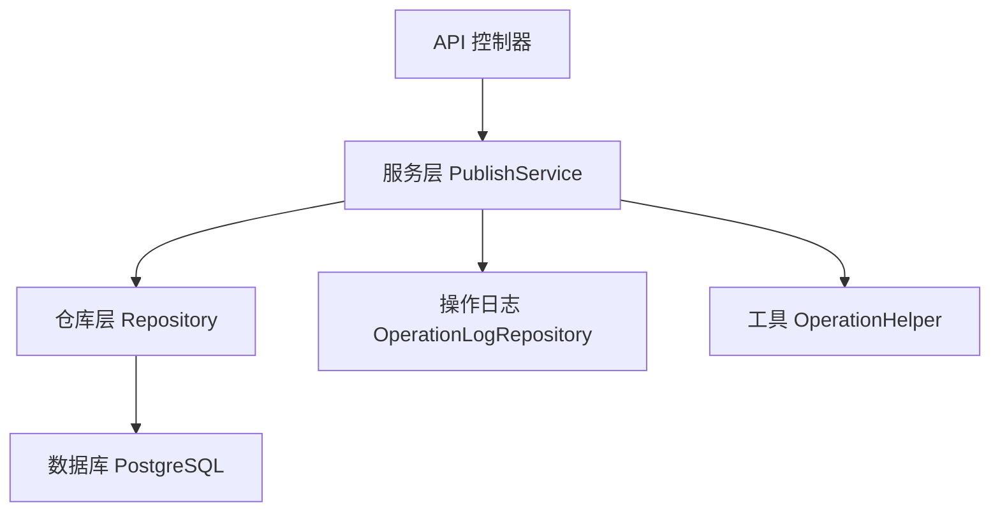
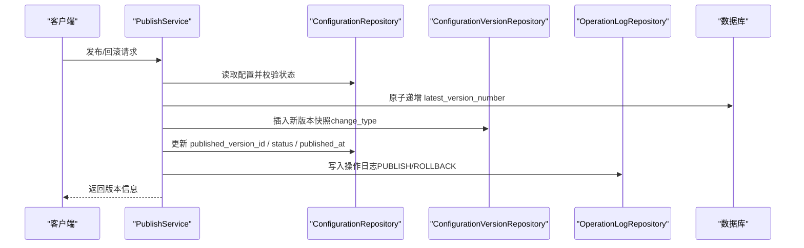

# 表结构设计

<cite>
**本文引用的文件**
- [配置中心建表脚本.sql](file://docs/数据库脚本/配置中心建表脚本.sql)
- [ConfigCenterNamespace.cs](file://k_config_center/src/Entities/ConfigCenterNamespace.cs)
- [ConfigCenterEnvironment.cs](file://k_config_center/src/Entities/ConfigCenterEnvironment.cs)
- [ConfigCenterConfigurationGroup.cs](file://k_config_center/src/Entities/ConfigCenterConfigurationGroup.cs)
- [ConfigCenterConfiguration.cs](file://k_config_center/src/Entities/ConfigCenterConfiguration.cs)
- [ConfigCenterConfigurationVersion.cs](file://k_config_center/src/Entities/ConfigCenterConfigurationVersion.cs)
- [ConfigCenterOperationLog.cs](file://k_config_center/src/Entities/ConfigCenterOperationLog.cs)
- [PublishService.cs](file://k_config_center/src/Services/PublishService.cs)
- [OperationHelper.cs](file://k_config_center/src/Infrastructure/OperationHelper.cs)
- [配置中心设计文档.md](file://docs/设计文档/配置中心设计文档.md)
</cite>

## 目录
1. [引言](#引言)
2. [项目结构](#项目结构)
3. [核心组件](#核心组件)
4. [架构总览](#架构总览)
5. [详细表结构与字段说明](#详细表结构与字段说明)
6. [依赖关系与约束分析](#依赖关系与约束分析)
7. [性能与索引策略](#性能与索引策略)
8. [软删除与审计字段设计](#软删除与审计字段设计)
9. [版本发布与回滚流程](#版本发布与回滚流程)
10. [故障排查指南](#故障排查指南)
11. [结论](#结论)
12. [附录：DDL 与注释清单](#附录dd l-与注释清单)

## 引言
本文件面向配置中心的数据库表结构，系统性说明命名空间、环境、配置组、配置项、版本快照与操作日志六张表的字段定义、数据类型、约束条件与业务含义；解释软删除机制与审计字段设计原则；并提供完整 DDL 与字段注释来源。读者可据此理解数据模型、查询路径与发布/回滚的数据一致性保障。

## 项目结构
本项目采用分层架构：实体映射（Entities）对应 PostgreSQL 表结构；服务层（Services）封装发布/回滚等事务性业务；基础设施（Infrastructure）提供 MD5、操作人/IP 提取与唯一冲突识别；仓库层（Repositories）负责数据访问；控制器（Controllers）暴露 API。数据库脚本位于 docs/数据库脚本，设计文档位于 docs/设计文档。



图表来源
- [PublishService.cs:9-115](file://k_config_center/src/Services/PublishService.cs#L9-L115)
- [OperationHelper.cs:1-29](file://k_config_center/src/Infrastructure/OperationHelper.cs#L1-L29)

章节来源
- [配置中心设计文档.md:10-20](file://docs/设计文档/配置中心设计文档.md#L10-L20)

## 核心组件
- 实体映射：六张核心表在 Entities 中一一对应，使用 SqlSugar 特性标注列名、长度、类型、默认值与可空性。
- 发布服务：PublishService 实现发布、回滚、下线等关键流程，保证版本号、快照、生效指针与日志的一致性。
- 工具类：OperationHelper 提供 MD5 计算、操作人与客户端 IP 提取、PostgreSQL 唯一冲突识别。
- 数据库脚本：统一 DDL、部分唯一索引、CHECK 约束、触发器与初始化数据。

章节来源
- [ConfigCenterConfiguration.cs:5-65](file://k_config_center/src/Entities/ConfigCenterConfiguration.cs#L5-L65)
- [PublishService.cs:24-115](file://k_config_center/src/Services/PublishService.cs#L24-L115)
- [OperationHelper.cs:10-28](file://k_config_center/src/Infrastructure/OperationHelper.cs#L10-L28)
- [配置中心建表脚本.sql:26-303](file://docs/数据库脚本/配置中心建表脚本.sql#L26-L303)

## 架构总览
配置中心数据模型层级为：namespace → environment → configuration_group → configuration → configuration_version；operation_log 作为审计流水独立存在。

```mermaid
erDiagram
NAMESPACE ||--o{ ENVIRONMENT : "1对多"
NAMESPACE ||--o{ CONFIGURATION_GROUP : "1对多"
ENVIRONMENT ||--o{ CONFIGURATION_GROUP : "1对多"
CONFIGURATION_GROUP ||--o{ CONFIGURATION : "1对多"
CONFIGURATION ||--o{ CONFIGURATION_VERSION : "1对多"
CONFIGURATION }o--|| CONFIGURATION_VERSION : "published_version_id(延迟外键)"
OPERATION_LOG -.- NAMESPACE : "仅存ID(无外键)"
OPERATION_LOG -.- ENVIRONMENT : "仅存ID(无外键)"
OPERATION_LOG -.- CONFIGURATION_GROUP : "仅存ID(无外键)"
OPERATION_LOG -.- CONFIGURATION : "仅存ID(无外键)"
```

图表来源
- [配置中心设计文档.md:39-57](file://docs/设计文档/配置中心设计文档.md#L39-L57)
- [配置中心建表脚本.sql:62-257](file://docs/数据库脚本/配置中心建表脚本.sql#L62-L257)

## 详细表结构与字段说明

### 命名空间表 config_center_namespace
- 用途：顶层隔离单元，按业务线/团队划分，默认内置 public。
- 关键字段
  - id：自增主键
  - namespace_key：业务标识，全局唯一（未软删除范围），默认 public
  - namespace_name：显示名称
  - description：描述
  - status：状态（1=启用，0=禁用）
  - deleted_at：软删除标记（NULL 表示未删除）
  - created_by / updated_by：创建人/最后修改人
  - created_at / updated_at：时间戳（含时区）
- 约束与索引
  - 部分唯一索引：unique_namespace_key(namespace_key) WHERE deleted_at IS NULL
- 业务规则
  - 软删除后同 key 可复用
  - 更新时间由触发器自动维护

章节来源
- [配置中心建表脚本.sql:30-56](file://docs/数据库脚本/配置中心建表脚本.sql#L30-L56)
- [ConfigCenterNamespace.cs:5-38](file://k_config_center/src/Entities/ConfigCenterNamespace.cs#L5-L38)

### 环境表 config_center_environment
- 用途：隶属于命名空间的环境维度（dev/test/staging/prod）。
- 关键字段
  - id：自增主键
  - namespace_id：所属命名空间（外键）
  - environment_key：环境业务标识（命名空间内唯一，未软删除范围）
  - environment_name：显示名称
  - description：描述
  - sort_order：排序值（越小越靠前）
  - status：状态（1=启用，0=禁用）
  - deleted_at：软删除标记
  - created_at / updated_at：时间戳
- 约束与索引
  - 外键：environment.namespace_id → namespace.id
  - 部分唯一索引：unique_environment_namespace_key(namespace_id, environment_key) WHERE deleted_at IS NULL

章节来源
- [配置中心建表脚本.sql:62-89](file://docs/数据库脚本/配置中心建表脚本.sql#L62-L89)
- [ConfigCenterEnvironment.cs:5-38](file://k_config_center/src/Entities/ConfigCenterEnvironment.cs#L5-L38)

### 配置组表 config_center_configuration_group
- 用途：环境下的配置分组（类似 Group/Namespace 文件）。
- 关键字段
  - id：自增主键
  - namespace_id：所属命名空间（外键）
  - environment_id：所属环境（外键）
  - group_key：编程标识符（环境内唯一，未软删除范围）
  - group_name：显示名称
  - description：描述
  - status：状态（1=启用，0=禁用）
  - deleted_at：软删除标记
  - created_by / updated_by：操作人
  - created_at / updated_at：时间戳
- 约束与索引
  - 外键：group.namespace_id → namespace.id；group.environment_id → environment.id
  - 部分唯一索引：unique_group_environment_key(environment_id, group_key) WHERE deleted_at IS NULL
  - 查询索引：index_group_namespace_environment(namespace_id, environment_id)

章节来源
- [配置中心建表脚本.sql:95-129](file://docs/数据库脚本/配置中心建表脚本.sql#L95-L129)
- [ConfigCenterConfigurationGroup.cs:5-44](file://k_config_center/src/Entities/ConfigCenterConfigurationGroup.cs#L5-L44)

### 配置表 config_center_configuration（当前态）
- 用途：保存每个配置项的最新内容与发布状态；历史内容由版本表保存。冗余 namespace_id/environment_id 以支撑高频读取避免 JOIN。
- 关键字段
  - id：自增主键
  - group_id：所属配置组（外键）
  - namespace_id / environment_id：冗余字段，用于快速过滤
  - configuration_key：配置键（组内唯一，未软删除范围）
  - content：当前编辑态内容
  - format：内容格式（text/json/yaml/properties/xml/toml）
  - md5：当前内容摘要，用于变更探测与“是否有未发布变更”判断
  - description/tags：描述/标签
  - status：状态（DRAFT/PUBLISHED/OFFLINE）
  - published_version_id：当前生效版本（延迟外键）
  - latest_version_number：最新版本号（发布时自增，0 表示从未发布）
  - published_at：最近发布时间
  - deleted_at：软删除标记
  - created_by / updated_by：操作人
  - created_at / updated_at：时间戳
- 约束与索引
  - CHECK：format IN ('text','json','yaml','properties','xml','toml')
  - CHECK：status IN ('DRAFT','PUBLISHED','OFFLINE')
  - 部分唯一索引：unique_configuration_key(group_id, configuration_key) WHERE deleted_at IS NULL
  - 查询索引：index_configuration_namespace_environment(namespace_id, environment_id, status)

章节来源
- [配置中心建表脚本.sql:136-185](file://docs/数据库脚本/配置中心建表脚本.sql#L136-L185)
- [ConfigCenterConfiguration.cs:5-65](file://k_config_center/src/Entities/ConfigCenterConfiguration.cs#L5-L65)

### 版本表 config_center_configuration_version（历史快照，不可变）
- 用途：每次发布/回滚/导入等操作写入一条不可变快照，版本号线性递增；不提供删除能力，不设 deleted_at。
- 关键字段
  - id：自增主键
  - configuration_id：所属配置项（外键）
  - version_number：版本号（UNIQUE(configuration_id, version_number)）
  - content/format/md5：该版本的内容、格式与摘要
  - change_type：变更类型（CREATE/UPDATE/DELETE/ROLLBACK/IMPORT）
  - change_remark：变更备注
  - created_by：操作人
  - created_at：创建时间
- 约束与索引
  - 外键：version.configuration_id → configuration.id
  - 唯一约束：UNIQUE(configuration_id, version_number)
  - 查询索引：index_version_configuration(configuration_id, version_number DESC)

章节来源
- [配置中心建表脚本.sql:192-225](file://docs/数据库脚本/配置中心建表脚本.sql#L192-L225)
- [ConfigCenterConfigurationVersion.cs:5-38](file://k_config_center/src/Entities/ConfigCenterConfigurationVersion.cs#L5-L38)

### 操作日志表 config_center_operation_log（审计）
- 用途：记录配置中心操作审计流水；仅存 ID 不建外键，避免影响主表写入与删除性能；审计记录不可删除，不设 deleted_at。
- 关键字段
  - id：自增主键
  - namespace_id / environment_id / group_id / configuration_id：各级关联 ID（无外键）
  - operation：操作类型（CREATE/UPDATE/PUBLISH/ROLLBACK/OFFLINE/DELETE）
  - detail：JSONB 详情（如变更前后差异）
  - operator：操作人
  - client_ip_address：来源 IP
  - created_at：操作时间
- 索引
  - index_operation_log(configuration_id, created_at DESC)

章节来源
- [配置中心建表脚本.sql:232-257](file://docs/数据库脚本/配置中心建表脚本.sql#L232-L257)
- [ConfigCenterOperationLog.cs:5-40](file://k_config_center/src/Entities/ConfigCenterOperationLog.cs#L5-L40)

## 依赖关系与约束分析
- 外键关系
  - environment → namespace
  - configuration_group → namespace, environment
  - configuration → configuration_group
  - configuration_version → configuration
  - configuration.published_version_id → configuration_version（延迟建立）
- 部分唯一索引
  - 四张主资源表均通过 WHERE deleted_at IS NULL 的部分唯一索引实现“软删除后可复用 key”的语义
- CHECK 约束
  - configuration.format/status 与 version.change_type 限制取值范围
- 审计表无外键
  - 降低写入与删除成本，便于审计数据长期保留

章节来源
- [配置中心设计文档.md:39-57](file://docs/设计文档/配置中心设计文档.md#L39-L57)
- [配置中心建表脚本.sql:62-257](file://docs/数据库脚本/配置中心建表脚本.sql#L62-L257)

## 性能与索引策略
- 高频读取优化
  - configuration 表冗余 namespace_id/environment_id，配合复合索引 index_configuration_namespace_environment(namespace_id, environment_id, status)，避免多级 JOIN
- 唯一性与去重
  - 部分唯一索引确保同一范围内 key 的唯一性，同时允许软删除后重建
- 版本查询
  - 版本表按 (configuration_id, version_number DESC) 索引，支持高效获取最新/历史版本
- 审计查询
  - 操作日志按 (configuration_id, created_at DESC) 索引，便于按配置项回溯操作历史

章节来源
- [配置中心设计文档.md:207-214](file://docs/设计文档/配置中心设计文档.md#L207-L214)
- [配置中心建表脚本.sql:161-165](file://docs/数据库脚本/配置中心建表脚本.sql#L161-L165)
- [配置中心建表脚本.sql:208-209](file://docs/数据库脚本/配置中心建表脚本.sql#L208-L209)
- [配置中心建表脚本.sql:245-246](file://docs/数据库脚本/配置中心建表脚本.sql#L245-L246)

## 软删除与审计字段设计
- 软删除策略
  - 四张主资源表（namespace/environment/configuration_group/configuration）均包含 deleted_at；查询时过滤 deleted_at IS NULL
  - 通过部分唯一索引（WHERE deleted_at IS NULL）实现“软删除后可复用 key”
- 审计字段
  - created_by/updated_by/operator 记录操作人，默认从请求头 X-Operator 提取，缺省为 system
  - client_ip_address 记录来源 IP
  - operation_log.detail 使用 JSONB 存储结构化详情（如 diff）
- 时间戳自动维护
  - 通过 BEFORE UPDATE 触发器自动刷新 updated_at；created_at 由 now() 默认值生成

章节来源
- [配置中心设计文档.md:216-232](file://docs/设计文档/配置中心设计文档.md#L216-L232)
- [配置中心建表脚本.sql:265-296](file://docs/数据库脚本/配置中心建表脚本.sql#L265-L296)
- [OperationHelper.cs:14-20](file://k_config_center/src/Infrastructure/OperationHelper.cs#L14-L20)

## 版本发布与回滚流程
发布与回滚为事务操作，顺序执行：版本号原子递增 → 写不可变快照 → 切换生效指针 → 写日志；任一失败整体回滚，保证一致性。



图表来源
- [PublishService.cs:24-115](file://k_config_center/src/Services/PublishService.cs#L24-L115)

章节来源
- [PublishService.cs:24-115](file://k_config_center/src/Services/PublishService.cs#L24-L115)
- [配置中心设计文档.md:181-205](file://docs/设计文档/配置中心设计文档.md#L181-L205)

## 故障排查指南
- 重复发布冲突
  - 现象：并发发布导致唯一约束冲突
  - 处理：捕获 PostgreSQL 唯一冲突（SQLSTATE 23505），转换为业务错误码提示重试
- 无未发布变更
  - 现象：已发布且内容与生效版本一致时拒绝重复发布
  - 处理：比较当前 md5 与生效版本 md5，若一致则直接报错
- 回滚目标不存在
  - 现象：指定版本不存在
  - 处理：根据 configuration_id + version_number 查找，不存在则报错
- 审计日志缺失
  - 现象：发布/回滚后无日志
  - 处理：检查日志写入是否在事务内完成；确认 OperationLogRepository 调用是否成功

章节来源
- [OperationHelper.cs:22-28](file://k_config_center/src/Infrastructure/OperationHelper.cs#L22-L28)
- [PublishService.cs:27-53](file://k_config_center/src/Services/PublishService.cs#L27-L53)
- [PublishService.cs:58-80](file://k_config_center/src/Services/PublishService.cs#L58-L80)

## 结论
本表结构通过“当前态+历史快照”的设计，结合部分唯一索引、CHECK 约束与触发器，实现了高可用、可追溯的配置管理能力。软删除策略保证了资源可重建与历史可审计；版本化发布/回滚保障了线上稳定性与问题定位效率。冗余字段与索引策略针对高频读取场景进行了优化，兼顾了性能与可维护性。

## 附录：DDL 与注释清单
以下为各表的核心 DDL 与注释来源，供对照查阅：
- 命名空间表 DDL 与注释：[配置中心建表脚本.sql:30-56](file://docs/数据库脚本/配置中心建表脚本.sql#L30-L56)
- 环境表 DDL 与注释：[配置中心建表脚本.sql:62-89](file://docs/数据库脚本/配置中心建表脚本.sql#L62-L89)
- 配置组表 DDL 与注释：[配置中心建表脚本.sql:95-129](file://docs/数据库脚本/配置中心建表脚本.sql#L95-L129)
- 配置表 DDL 与注释：[配置中心建表脚本.sql:136-185](file://docs/数据库脚本/配置中心建表脚本.sql#L136-L185)
- 版本表 DDL 与注释：[配置中心建表脚本.sql:192-225](file://docs/数据库脚本/配置中心建表脚本.sql#L192-L225)
- 操作日志表 DDL 与注释：[配置中心建表脚本.sql:232-257](file://docs/数据库脚本/配置中心建表脚本.sql#L232-L257)
- 更新时间触发器：[配置中心建表脚本.sql:265-296](file://docs/数据库脚本/配置中心建表脚本.sql#L265-L296)
- 默认命名空间初始化：[配置中心建表脚本.sql:301-303](file://docs/数据库脚本/配置中心建表脚本.sql#L301-L303)