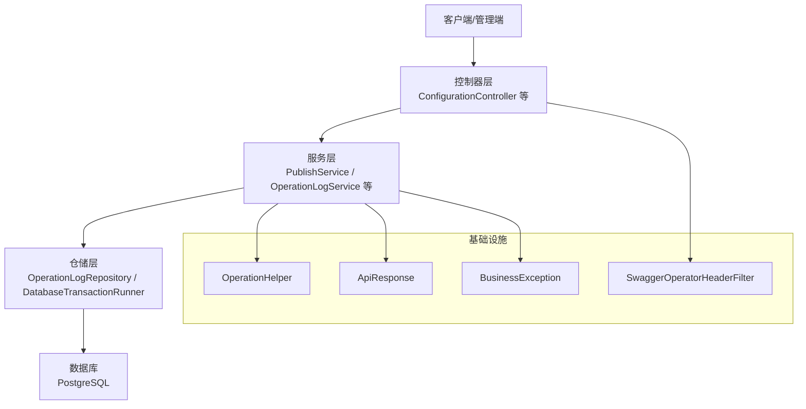
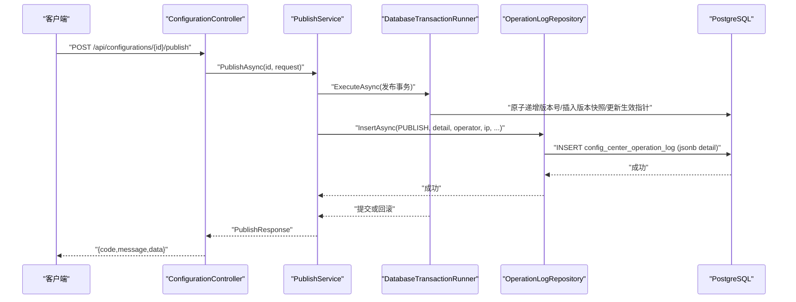
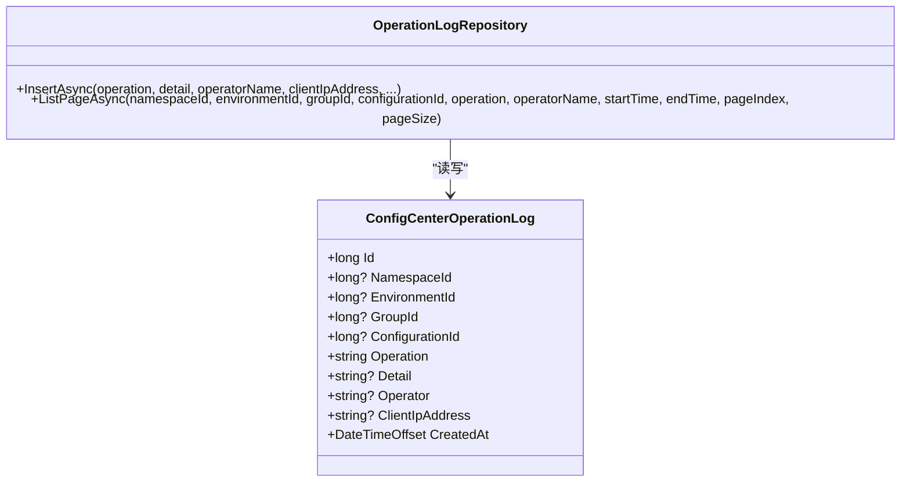
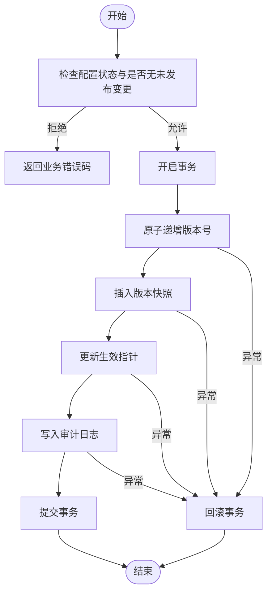
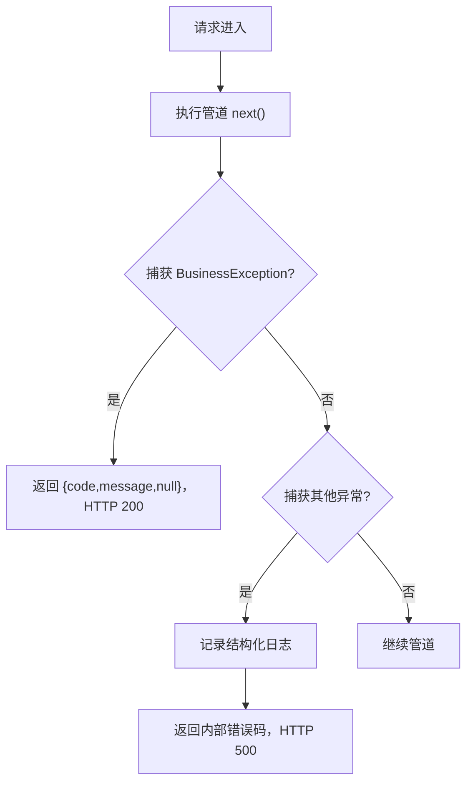
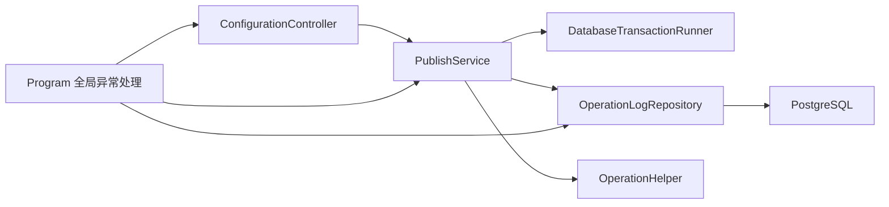
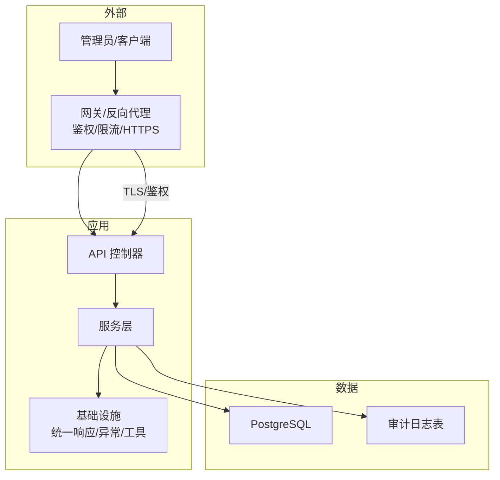

# 安全架构

<cite>
**本文引用的文件**
- [Program.cs](file://k_config_center/Program.cs)
- [SwaggerOperatorHeaderFilter.cs](file://k_config_center/src/Infrastructure/SwaggerOperatorHeaderFilter.cs)
- [OperationHelper.cs](file://k_config_center/src/Infrastructure/OperationHelper.cs)
- [BusinessException.cs](file://k_config_center/src/Infrastructure/BusinessException.cs)
- [ApiResponse.cs](file://k_config_center/src/Infrastructure/ApiResponse.cs)
- [DatabaseTransactionRunner.cs](file://k_config_center/src/Repositories/DatabaseTransactionRunner.cs)
- [ConfigurationController.cs](file://k_config_center/src/Controllers/ConfigurationController.cs)
- [PublishService.cs](file://k_config_center/src/Services/PublishService.cs)
- [OperationLogRepository.cs](file://k_config_center/src/Repositories/OperationLogRepository.cs)
- [ConfigCenterOperationLog.cs](file://k_config_center/src/Entities/ConfigCenterOperationLog.cs)
- [appsettings.json](file://k_config_center/appsettings.json)
</cite>

## 目录
1. [简介](#简介)
2. [项目结构](#项目结构)
3. [核心组件](#核心组件)
4. [架构总览](#架构总览)
5. [详细组件分析](#详细组件分析)
6. [依赖关系分析](#依赖关系分析)
7. [性能与安全考量](#性能与安全考量)
8. [故障排查指南](#故障排查指南)
9. [结论](#结论)
10. [附录](#附录)

## 简介
本安全架构文档围绕配置中心的安全设计原则与防护措施展开，覆盖身份认证、授权控制、数据安全、操作审计、异常处理、敏感信息保护以及 API 安全防护等方面。重点说明如何通过 X-Operator 请求头追踪操作来源，如何在发布/回滚等关键路径中保证数据一致性与可审计性，以及如何通过统一异常处理和错误码避免敏感信息泄露。同时提供安全架构图与威胁模型分析，帮助读者理解系统边界与风险点。

## 项目结构
后端采用分层架构：控制器负责参数接收与响应包装；服务层实现业务逻辑与事务编排；仓储层封装数据库访问；基础设施层提供统一响应、异常类型、工具方法与 Swagger 扩展。审计日志写入集中在仓储层，确保只增不改、不可篡改的审计记录。

图表来源
- [Program.cs:36-109](file://k_config_center/Program.cs#L36-L109)
- [ConfigurationController.cs:8-114](file://k_config_center/src/Controllers/ConfigurationController.cs#L8-L114)
- [PublishService.cs:9-115](file://k_config_center/src/Services/PublishService.cs#L9-L115)
- [OperationLogRepository.cs:8-102](file://k_config_center/src/Repositories/OperationLogRepository.cs#L8-L102)
- [SwaggerOperatorHeaderFilter.cs:6-26](file://k_config_center/src/Infrastructure/SwaggerOperatorHeaderFilter.cs#L6-L26)

章节来源
- [Program.cs:36-109](file://k_config_center/Program.cs#L36-L109)
- [ConfigurationController.cs:8-114](file://k_config_center/src/Controllers/ConfigurationController.cs#L8-L114)

## 核心组件
- 统一响应与错误码：所有接口返回 { code, message, data }，业务失败 HTTP 仍为 200，由 code 表达错误，避免堆栈泄露。
- 全局异常处理：捕获 BusinessException 转为统一失败响应；非业务异常记录结构化日志并返回内部错误码。
- 审计日志：写操作均记录 operator、client_ip_address、operation、detail（JSONB），支持多维度检索与时间区间过滤。
- 操作人提取：从请求头 X-Operator 获取，缺省为 system；客户端 IP 用于溯源。
- 事务与一致性：发布/回滚在事务内完成版本号递增、快照写入、生效指针切换与日志记录，任一失败整体回滚。
- 唯一约束冲突识别：将 PostgreSQL 唯一约束冲突转换为并发冲突业务错误码，便于客户端重试。

章节来源
- [ApiResponse.cs:3-9](file://k_config_center/src/Infrastructure/ApiResponse.cs#L3-L9)
- [Program.cs:71-92](file://k_config_center/Program.cs#L71-L92)
- [OperationHelper.cs:10-28](file://k_config_center/src/Infrastructure/OperationHelper.cs#L10-L28)
- [OperationLogRepository.cs:12-25](file://k_config_center/src/Repositories/OperationLogRepository.cs#L12-L25)
- [PublishService.cs:24-53](file://k_config_center/src/Services/PublishService.cs#L24-L53)
- [DatabaseTransactionRunner.cs:5-17](file://k_config_center/src/Repositories/DatabaseTransactionRunner.cs#L5-L17)

## 架构总览
下图展示从请求到审计日志写入的关键流程，突出 X-Operator 的来源、审计记录的生成位置以及事务边界。

图表来源
- [ConfigurationController.cs:65-73](file://k_config_center/src/Controllers/ConfigurationController.cs#L65-L73)
- [PublishService.cs:24-53](file://k_config_center/src/Services/PublishService.cs#L24-L53)
- [DatabaseTransactionRunner.cs:11-17](file://k_config_center/src/Repositories/DatabaseTransactionRunner.cs#L11-L17)
- [OperationLogRepository.cs:12-25](file://k_config_center/src/Repositories/OperationLogRepository.cs#L12-L25)

## 详细组件分析

### 身份认证与授权控制
- 当前阶段未内置用户体系，身份来源通过请求头 X-Operator 传递，作为“操作人”标识写入审计日志，默认值为 system。
- 建议在生产环境前置网关或反向代理进行基础鉴权（如 Token 校验、IP 白名单、TLS 强制），并将可信操作人注入 X-Operator。
- 对敏感写操作（发布、回滚、下线）应结合 RBAC/ABAC 策略限制调用者权限，避免任意操作人执行高风险动作。

章节来源
- [OperationHelper.cs:14-16](file://k_config_center/src/Infrastructure/OperationHelper.cs#L14-L16)
- [SwaggerOperatorHeaderFilter.cs:11-25](file://k_config_center/src/Infrastructure/SwaggerOperatorHeaderFilter.cs#L11-L25)

### 操作审计机制
- 审计实体包含维度 id（namespace/environment/group/configuration）、操作类型、详情 JSONB、操作人、客户端 IP 与创建时间。
- 审计写入收口于仓储层，使用原生 SQL 并对 jsonb 与可空 bigint 显式 CAST，避免类型推断问题。
- 查询支持多维度可选过滤与时间区间闭开区间，按时间倒序分页；历史日志缺失上级维度时自动回填。

图表来源
- [ConfigCenterOperationLog.cs:5-40](file://k_config_center/src/Entities/ConfigCenterOperationLog.cs#L5-L40)
- [OperationLogRepository.cs:12-25](file://k_config_center/src/Repositories/OperationLogRepository.cs#L12-L25)
- [OperationLogRepository.cs:27-84](file://k_config_center/src/Repositories/OperationLogRepository.cs#L27-L84)

章节来源
- [ConfigCenterOperationLog.cs:5-40](file://k_config_center/src/Entities/ConfigCenterOperationLog.cs#L5-L40)
- [OperationLogRepository.cs:12-25](file://k_config_center/src/Repositories/OperationLogRepository.cs#L12-L25)
- [OperationLogRepository.cs:27-84](file://k_config_center/src/Repositories/OperationLogRepository.cs#L27-L84)

### 数据安全与完整性
- 内容 MD5 由服务端计算，不信任前端传值，用于检测未发布变更与重复发布。
- 发布/回滚在事务内顺序执行：版本号原子递增 → 写版本快照 → 切换生效指针 → 写审计日志；任一失败整体回滚。
- 并发冲突通过唯一约束兜底，转换为业务错误码供客户端重试。

图表来源
- [PublishService.cs:24-53](file://k_config_center/src/Services/PublishService.cs#L24-L53)
- [PublishService.cs:94-108](file://k_config_center/src/Services/PublishService.cs#L94-L108)
- [DatabaseTransactionRunner.cs:11-17](file://k_config_center/src/Repositories/DatabaseTransactionRunner.cs#L11-L17)

章节来源
- [PublishService.cs:24-53](file://k_config_center/src/Services/PublishService.cs#L24-L53)
- [PublishService.cs:94-108](file://k_config_center/src/Services/PublishService.cs#L94-L108)
- [DatabaseTransactionRunner.cs:11-17](file://k_config_center/src/Repositories/DatabaseTransactionRunner.cs#L11-L17)

### 异常处理与安全错误处理
- 全局中间件捕获 BusinessException 并返回 { code, message, data=null }，HTTP 保持 200，避免暴露内部细节。
- 非业务异常记录结构化日志（含异常栈），返回统一内部错误码，防止堆栈泄露。
- 客户端断开（长轮询取消）静默结束，不写响应。

图表来源
- [Program.cs:71-92](file://k_config_center/Program.cs#L71-L92)
- [BusinessException.cs:3-10](file://k_config_center/src/Infrastructure/BusinessException.cs#L3-L10)
- [ApiResponse.cs:3-9](file://k_config_center/src/Infrastructure/ApiResponse.cs#L3-L9)

章节来源
- [Program.cs:71-92](file://k_config_center/Program.cs#L71-L92)
- [BusinessException.cs:3-10](file://k_config_center/src/Infrastructure/BusinessException.cs#L3-L10)
- [ApiResponse.cs:3-9](file://k_config_center/src/Infrastructure/ApiResponse.cs#L3-L9)

### 敏感信息保护与配置安全管理
- 连接字符串等敏感配置位于 appsettings.json，生产环境应通过环境变量或密钥管理服务注入，避免硬编码。
- 审计日志中的 detail 字段为 JSONB，仅记录必要上下文，避免写入敏感明文；如需记录敏感信息，应在入库前脱敏。
- 建议启用 HTTPS 强制跳转，限制 Swagger UI 仅在开发环境暴露。

章节来源
- [appsettings.json:1-12](file://k_config_center/appsettings.json#L1-L12)
- [Program.cs:64-69](file://k_config_center/Program.cs#L64-L69)
- [Program.cs:94-105](file://k_config_center/Program.cs#L94-L105)

### API 接口安全防护
- 输入验证：请求模型以 record 定义，格式字段有默认值；建议在控制器或服务层增加更严格的校验（长度、字符集、格式）。
- SQL 注入防护：仓储层使用参数化 SQL 与 SqlSugar 查询构建器，避免拼接 SQL；审计写入使用原生 SQL 但参数化传入。
- 跨域请求控制：当前未显式配置 CORS，生产需根据部署拓扑启用最小权限的 CORS 策略，限制来源域名与方法。
- 接口暴露面：Swagger UI 仅开发环境启用；/api 未知路径返回 404，避免 SPA 兜底误解析。

章节来源
- [OperationLogRepository.cs:12-25](file://k_config_center/src/Repositories/OperationLogRepository.cs#L12-L25)
- [OperationLogRepository.cs:27-46](file://k_config_center/src/Repositories/OperationLogRepository.cs#L27-L46)
- [Program.cs:64-69](file://k_config_center/Program.cs#L64-L69)
- [Program.cs:101-105](file://k_config_center/Program.cs#L101-L105)

## 依赖关系分析
- 控制器依赖服务层，服务层依赖仓储层与事务入口，仓储层依赖数据库。
- 审计日志写入依赖 OperationHelper 提取操作人与 IP，依赖 OperationLogRepository 持久化。
- 全局异常处理依赖 BusinessException 与 ApiResponse，统一输出格式。

图表来源
- [ConfigurationController.cs:8-114](file://k_config_center/src/Controllers/ConfigurationController.cs#L8-L114)
- [PublishService.cs:9-115](file://k_config_center/src/Services/PublishService.cs#L9-L115)
- [OperationLogRepository.cs:8-102](file://k_config_center/src/Repositories/OperationLogRepository.cs#L8-L102)
- [Program.cs:71-105](file://k_config_center/Program.cs#L71-L105)

章节来源
- [ConfigurationController.cs:8-114](file://k_config_center/src/Controllers/ConfigurationController.cs#L8-L114)
- [PublishService.cs:9-115](file://k_config_center/src/Services/PublishService.cs#L9-L115)
- [OperationLogRepository.cs:8-102](file://k_config_center/src/Repositories/OperationLogRepository.cs#L8-L102)
- [Program.cs:71-105](file://k_config_center/Program.cs#L71-L105)

## 性能与安全考量
- 审计日志写入使用原生 SQL 并显式 CAST，减少类型推断开销；批量回填维度信息降低多次往返。
- 发布/回滚事务内操作串行化，利用行锁避免竞态；唯一约束冲突转换为业务错误码，提升可恢复性。
- 建议对高频查询建立索引（如 namespace_id、environment_id、group_id、configuration_id、created_at），优化审计检索性能。
- 生产环境建议启用连接池、超时与重试策略，避免数据库拥塞影响可用性。

[本节为通用指导，不直接分析具体文件]

## 故障排查指南
- 业务错误：通过统一响应 code 定位问题，常见包括资源不存在、无未发布变更、回滚版本不存在、发布并发冲突等。
- 唯一约束冲突：当并发发布导致唯一键冲突时，会转换为并发冲突错误码，客户端应重试。
- 审计日志缺失：确认写操作是否经过 PublishService 或其他写入审计的路径；检查 OperationHelper 是否正确提取 X-Operator 与 IP。
- 敏感信息泄露：检查全局异常处理是否拦截了非业务异常；确认 detail 字段未写入敏感明文。

章节来源
- [Program.cs:71-92](file://k_config_center/Program.cs#L71-L92)
- [PublishService.cs:94-108](file://k_config_center/src/Services/PublishService.cs#L94-L108)
- [OperationHelper.cs:14-20](file://k_config_center/src/Infrastructure/OperationHelper.cs#L14-L20)

## 结论
本配置中心通过分层架构与基础设施能力，实现了统一的异常处理、审计日志、事务一致性与基本的安全防护。X-Operator 提供了操作溯源的基础，审计日志保证了可追溯性。生产环境需补充前置鉴权、CORS 策略、HTTPS 强制与敏感配置管理，以完善整体安全态势。

[本节为总结性内容，不直接分析具体文件]

## 附录

### 安全架构图

[此图为概念性架构示意，不直接映射具体源码文件]

### 威胁模型分析
- 未授权访问：缺少前置鉴权可能导致任意调用者执行写操作。缓解：网关层实施强鉴权，限制 X-Operator 来源。
- 操作溯源伪造：X-Operator 可由客户端随意设置。缓解：由可信代理注入，服务端校验来源。
- 数据篡改：发布/回滚缺乏事务保护会导致不一致。缓解：已在事务内保证原子性，并辅以唯一约束。
- 敏感信息泄露：异常堆栈或日志中包含敏感数据。缓解：全局异常处理屏蔽内部细节，审计 detail 脱敏。
- SQL 注入：拼接 SQL 带来注入风险。缓解：使用参数化查询与 ORM 构建器。
- 跨站脚本/越权：CORS 未限制可能引入跨站风险。缓解：最小化 CORS 策略，限制来源与方法。

[本节为概念性分析，不直接分析具体文件]