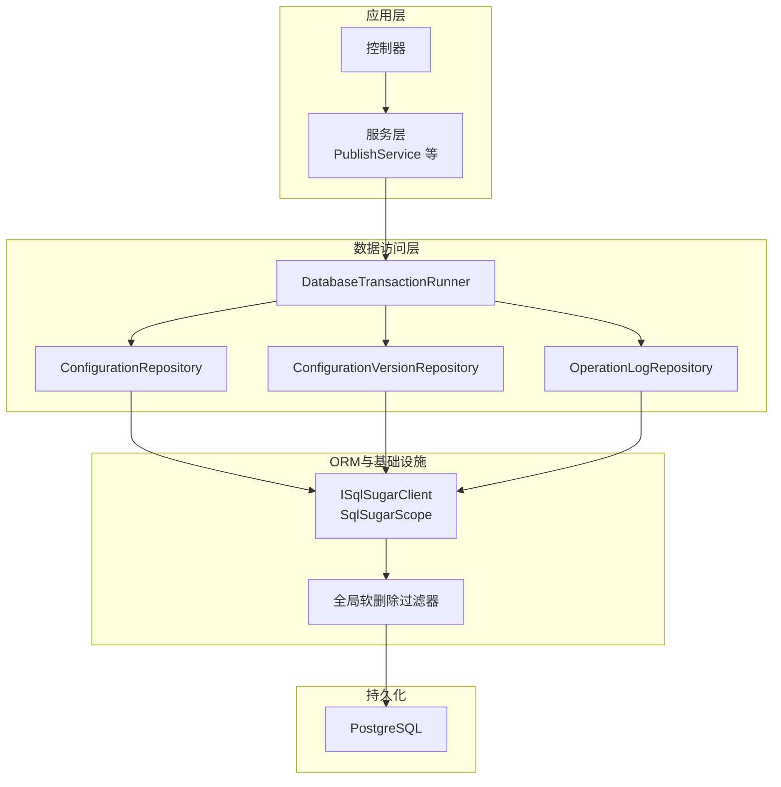
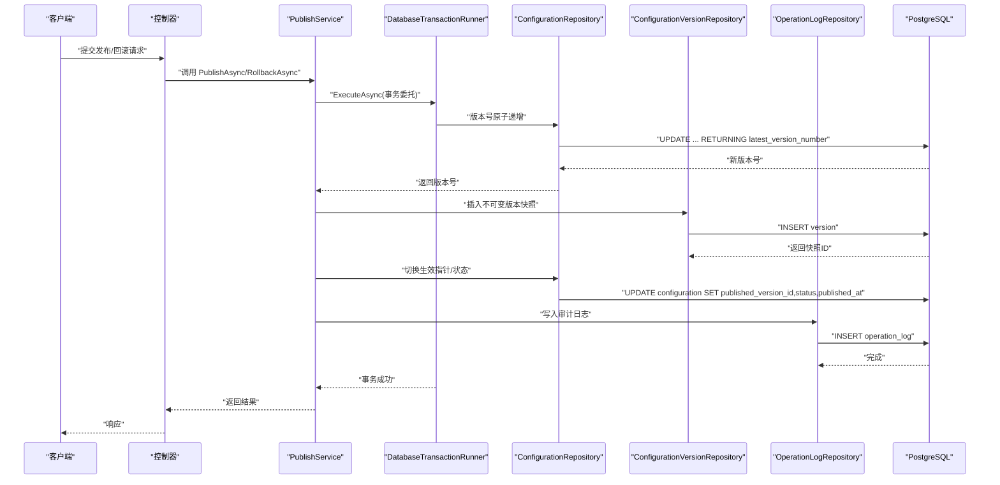
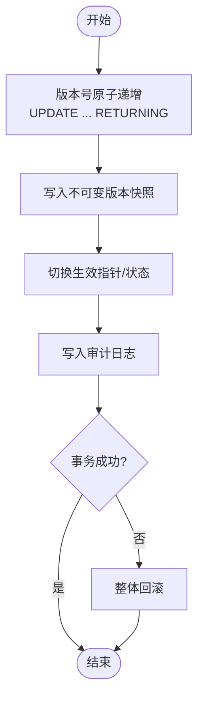
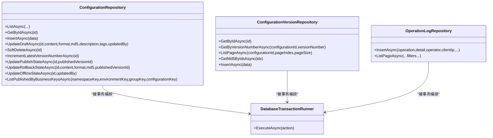
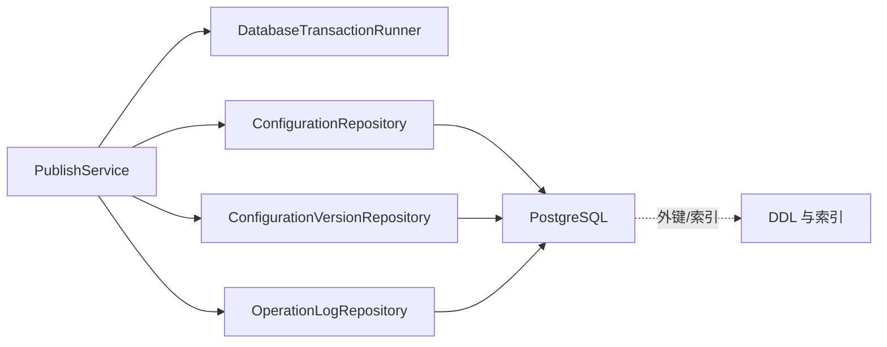

# 数据架构

<cite>
**本文引用的文件**
- [配置中心建表脚本.sql](file://docs/数据库脚本/配置中心建表脚本.sql)
- [SqlSugarSetup.cs](file://k_config_center/src/Infrastructure/SqlSugarSetup.cs)
- [DatabaseTransactionRunner.cs](file://k_config_center/src/Repositories/DatabaseTransactionRunner.cs)
- [ConfigurationRepository.cs](file://k_config_center/src/Repositories/ConfigurationRepository.cs)
- [ConfigurationVersionRepository.cs](file://k_config_center/src/Repositories/ConfigurationVersionRepository.cs)
- [OperationLogRepository.cs](file://k_config_center/src/Repositories/OperationLogRepository.cs)
- [PublishService.cs](file://k_config_center/src/Services/PublishService.cs)
- [ConfigCenterNamespace.cs](file://k_config_center/src/Entities/ConfigCenterNamespace.cs)
- [ConfigCenterEnvironment.cs](file://k_config_center/src/Entities/ConfigCenterEnvironment.cs)
- [ConfigCenterConfigurationGroup.cs](file://k_config_center/src/Entities/ConfigCenterConfigurationGroup.cs)
- [ConfigCenterConfiguration.cs](file://k_config_center/src/Entities/ConfigCenterConfiguration.cs)
- [ConfigCenterConfigurationVersion.cs](file://k_config_center/src/Entities/ConfigCenterConfigurationVersion.cs)
- [ConfigCenterOperationLog.cs](file://k_config_center/src/Entities/ConfigCenterOperationLog.cs)
- [appsettings.json](file://k_config_center/appsettings.json)
- [配置中心设计文档.md](file://docs/设计文档/配置中心设计文档.md)
</cite>

## 目录
1. [引言](#引言)
2. [项目结构](#项目结构)
3. [核心组件](#核心组件)
4. [架构总览](#架构总览)
5. [详细组件分析](#详细组件分析)
6. [依赖关系分析](#依赖关系分析)
7. [性能与优化](#性能与优化)
8. [故障排查指南](#故障排查指南)
9. [结论](#结论)
10. [附录](#附录)

## 引言
本文件面向配置中心的数据架构，聚焦数据存储设计原则、实体关系、一致性保障与事务机制；说明 ORM（SqlSugar）的配置与使用、数据库连接管理与性能优化策略；阐述仓储模式实现、软删除机制与版本控制策略；并给出缓存策略、查询优化与索引设计建议。文末提供数据流图与实体关系图，展示数据的存储、访问与同步机制。

## 项目结构
后端采用分层架构：控制器 → 服务层 → 仓储层 → ORM（SqlSugar）→ PostgreSQL。实体模型位于 Entities，仓储封装在 Repositories，发布等跨表业务逻辑集中在 Services，ORM 初始化与全局过滤器在 Infrastructure。



图表来源
- [SqlSugarSetup.cs:12-38](file://k_config_center/src/Infrastructure/SqlSugarSetup.cs#L12-L38)
- [DatabaseTransactionRunner.cs:9-17](file://k_config_center/src/Repositories/DatabaseTransactionRunner.cs#L9-L17)
- [ConfigurationRepository.cs:13-30](file://k_config_center/src/Repositories/ConfigurationRepository.cs#L13-L30)
- [ConfigurationVersionRepository.cs:25-33](file://k_config_center/src/Repositories/ConfigurationVersionRepository.cs#L25-L33)
- [OperationLogRepository.cs:31-46](file://k_config_center/src/Repositories/OperationLogRepository.cs#L31-L46)

章节来源
- [配置中心设计文档.md:10-20](file://docs/设计文档/配置中心设计文档.md#L10-L20)
- [SqlSugarSetup.cs:12-38](file://k_config_center/src/Infrastructure/SqlSugarSetup.cs#L12-L38)

## 核心组件
- 实体模型：命名空间、环境、配置组、配置项、配置版本、操作日志，均通过 SqlSugar 特性映射到 PostgreSQL 表。
- 仓储层：按领域拆分 Repository，封装 CRUD、分页、联查与原子更新；对外仅暴露业务数据对象。
- 事务编排：通过 DatabaseTransactionRunner 在 Service 层统一开启事务，各 Repository 共享同一 ISqlSugarClient 单例自动参与。
- 发布服务：PublishService 将“版本号递增 → 写快照 → 切换生效指针 → 写日志”作为原子事务执行，保证一致性。
- ORM 配置：SqlSugarSetup 注册 SqlSugarScope，启用属性映射、全局软删除过滤器，禁用 CodeFirst，DDL 由脚本管理。

章节来源
- [ConfigCenterNamespace.cs:1-39](file://k_config_center/src/Entities/ConfigCenterNamespace.cs#L1-L39)
- [ConfigCenterEnvironment.cs:1-39](file://k_config_center/src/Entities/ConfigCenterEnvironment.cs#L1-L39)
- [ConfigCenterConfigurationGroup.cs:1-45](file://k_config_center/src/Entities/ConfigCenterConfigurationGroup.cs#L1-L45)
- [ConfigCenterConfiguration.cs:1-66](file://k_config_center/src/Entities/ConfigCenterConfiguration.cs#L1-L66)
- [ConfigCenterConfigurationVersion.cs:1-39](file://k_config_center/src/Entities/ConfigCenterConfigurationVersion.cs#L1-L39)
- [ConfigCenterOperationLog.cs:1-41](file://k_config_center/src/Entities/ConfigCenterOperationLog.cs#L1-L41)
- [ConfigurationRepository.cs:1-155](file://k_config_center/src/Repositories/ConfigurationRepository.cs#L1-L155)
- [ConfigurationVersionRepository.cs:1-65](file://k_config_center/src/Repositories/ConfigurationVersionRepository.cs#L1-L65)
- [OperationLogRepository.cs:1-103](file://k_config_center/src/Repositories/OperationLogRepository.cs#L1-L103)
- [PublishService.cs:1-116](file://k_config_center/src/Services/PublishService.cs#L1-L116)
- [SqlSugarSetup.cs:1-42](file://k_config_center/src/Infrastructure/SqlSugarSetup.cs#L1-L42)

## 架构总览
下图展示了从请求到持久化的完整数据流，以及发布/回滚的关键调用链。



图表来源
- [PublishService.cs:27-53](file://k_config_center/src/Services/PublishService.cs#L27-L53)
- [PublishService.cs:58-80](file://k_config_center/src/Services/PublishService.cs#L58-L80)
- [DatabaseTransactionRunner.cs:13-17](file://k_config_center/src/Repositories/DatabaseTransactionRunner.cs#L13-L17)
- [ConfigurationRepository.cs:77-90](file://k_config_center/src/Repositories/ConfigurationRepository.cs#L77-L90)
- [ConfigurationVersionRepository.cs:41-44](file://k_config_center/src/Repositories/ConfigurationVersionRepository.cs#L41-L44)
- [OperationLogRepository.cs:14-25](file://k_config_center/src/Repositories/OperationLogRepository.cs#L14-L25)

## 详细组件分析

### 实体关系与ER图
- 命名空间 → 环境（一对多）
- 命名空间 → 配置组（一对多）
- 环境 → 配置组（一对多）
- 配置组 → 配置项（一对多）
- 配置项 → 版本快照（一对多）
- 配置项 → 当前生效版本（一对一，延迟外键）
- 操作日志：仅记录维度 ID，无外键约束

```mermaid
erDiagram
NAMESPACE {
bigint id PK
varchar namespace_key
varchar namespace_name
smallint status
timestamptz deleted_at
}
ENVIRONMENT {
bigint id PK
bigint namespace_id FK
varchar environment_key
varchar environment_name
int sort_order
smallint status
timestamptz deleted_at
}
GROUP {
bigint id PK
bigint namespace_id FK
bigint environment_id FK
varchar group_key
varchar group_name
smallint status
timestamptz deleted_at
}
CONFIGURATION {
bigint id PK
bigint group_id FK
bigint namespace_id
bigint environment_id
varchar configuration_key
text content
varchar format
char md5
varchar status
bigint published_version_id
bigint latest_version_number
timestamptz published_at
timestamptz deleted_at
}
VERSION {
bigint id PK
bigint configuration_id FK
bigint version_number
text content
varchar format
char md5
varchar change_type
varchar change_remark
varchar created_by
timestamptz created_at
}
OPERATION_LOG {
bigint id PK
bigint namespace_id
bigint environment_id
bigint group_id
bigint configuration_id
varchar operation
jsonb detail
varchar operator
varchar client_ip_address
timestamptz created_at
}
NAMESPACE ||--o{ ENVIRONMENT : "1..*"
NAMESPACE ||--o{ GROUP : "1..*"
ENVIRONMENT ||--o{ GROUP : "1..*"
GROUP ||--o{ CONFIGURATION : "1..*"
CONFIGURATION ||--o{ VERSION : "1..*"
CONFIGURATION }o--|| VERSION : "published_version_id"
OPERATION_LOG -|.. NAMESPACE : "维度ID"
OPERATION_LOG -|.. ENVIRONMENT : "维度ID"
OPERATION_LOG -|.. GROUP : "维度ID"
OPERATION_LOG -|.. CONFIGURATION : "维度ID"
```

图表来源
- [配置中心建表脚本.sql:30-225](file://docs/数据库脚本/配置中心建表脚本.sql#L30-L225)
- [配置中心设计文档.md:37-57](file://docs/设计文档/配置中心设计文档.md#L37-L57)

章节来源
- [配置中心设计文档.md:37-57](file://docs/设计文档/配置中心设计文档.md#L37-L57)
- [配置中心建表脚本.sql:30-225](file://docs/数据库脚本/配置中心建表脚本.sql#L30-L225)

### 数据一致性与事务机制
- 发布/回滚为事务操作：版本号原子递增、写不可变快照、切换生效指针、写审计日志四步在同一事务内完成，任一步失败整体回滚。
- 并发安全：版本号递增使用数据库侧 UPDATE ... RETURNING，行级锁串行化并发发布，避免先读后写竞态；唯一约束 (configuration_id, version_number) 兜底冲突。
- 事务边界：Service 不直接持有 ISqlSugarClient，通过 DatabaseTransactionRunner.ExecuteAsync 包裹动作；SqlSugarScope 单例确保同异步上下文内各 Repository 自动参与同一环境事务。



图表来源
- [PublishService.cs:27-53](file://k_config_center/src/Services/PublishService.cs#L27-L53)
- [PublishService.cs:58-80](file://k_config_center/src/Services/PublishService.cs#L58-L80)
- [DatabaseTransactionRunner.cs:13-17](file://k_config_center/src/Repositories/DatabaseTransactionRunner.cs#L13-L17)
- [ConfigurationRepository.cs:77-90](file://k_config_center/src/Repositories/ConfigurationRepository.cs#L77-L90)
- [ConfigurationVersionRepository.cs:41-44](file://k_config_center/src/Repositories/ConfigurationVersionRepository.cs#L41-L44)
- [OperationLogRepository.cs:14-25](file://k_config_center/src/Repositories/OperationLogRepository.cs#L14-L25)

章节来源
- [PublishService.cs:1-116](file://k_config_center/src/Services/PublishService.cs#L1-L116)
- [DatabaseTransactionRunner.cs:1-19](file://k_config_center/src/Repositories/DatabaseTransactionRunner.cs#L1-L19)

### 仓储模式与数据访问
- ConfigurationRepository：封装配置项的列表、详情、草稿保存、软删、发布/回滚状态切换、客户端五表联查；通过冗余字段减少 JOIN。
- ConfigurationVersionRepository：版本快照只增不改，支持分页历史、按配置+版本号查询、批量获取 MD5 用于未发布变更判断。
- OperationLogRepository：审计日志写入与分页检索；维度回填时绕过全局软删过滤器以回溯已删除资源。



图表来源
- [ConfigurationRepository.cs:13-124](file://k_config_center/src/Repositories/ConfigurationRepository.cs#L13-L124)
- [ConfigurationVersionRepository.cs:11-44](file://k_config_center/src/Repositories/ConfigurationVersionRepository.cs#L11-L44)
- [OperationLogRepository.cs:14-83](file://k_config_center/src/Repositories/OperationLogRepository.cs#L14-L83)
- [DatabaseTransactionRunner.cs:13-17](file://k_config_center/src/Repositories/DatabaseTransactionRunner.cs#L13-L17)

章节来源
- [ConfigurationRepository.cs:1-155](file://k_config_center/src/Repositories/ConfigurationRepository.cs#L1-L155)
- [ConfigurationVersionRepository.cs:1-65](file://k_config_center/src/Repositories/ConfigurationVersionRepository.cs#L1-L65)
- [OperationLogRepository.cs:1-103](file://k_config_center/src/Repositories/OperationLogRepository.cs#L1-L103)

### 软删除机制
- 全局过滤：SqlSugarSetup 为命名空间、环境、配置组、配置项添加全局查询过滤器，默认过滤 deleted_at IS NULL。
- 审计回溯：OperationLogRepository 在维度回填时使用 ClearFilter 绕过过滤器，允许读取已删除资源以补全上级维度信息。
- 部分唯一索引：所有主资源表对业务 key 建立 WHERE deleted_at IS NULL 的部分唯一索引，软删除后可复用 key。

章节来源
- [SqlSugarSetup.cs:28-36](file://k_config_center/src/Infrastructure/SqlSugarSetup.cs#L28-L36)
- [OperationLogRepository.cs:90-95](file://k_config_center/src/Repositories/OperationLogRepository.cs#L90-L95)
- [配置中心建表脚本.sql:43-44](file://docs/数据库脚本/配置中心建表脚本.sql#L43-L44)
- [配置中心建表脚本.sql:76-77](file://docs/数据库脚本/配置中心建表脚本.sql#L76-L77)
- [配置中心建表脚本.sql:112-113](file://docs/数据库脚本/配置中心建表脚本.sql#L112-L113)
- [配置中心建表脚本.sql:161-162](file://docs/数据库脚本/配置中心建表脚本.sql#L161-L162)

### 版本控制策略
- 编辑态：修改内容不产生版本记录，仅更新当前态字段与 MD5。
- 发布：版本号自增，写入不可变快照，切换生效指针，记录发布时间。
- 回滚：不回退版本号，基于目标历史版本生成新快照（change_type=ROLLBACK），同步当前态并切换生效指针。
- 客户端读取：仅返回 PUBLISHED 且未软删除的记录，内容取自 published_version_id 指向的版本快照。

章节来源
- [配置中心设计文档.md:181-214](file://docs/设计文档/配置中心设计文档.md#L181-L214)
- [PublishService.cs:27-80](file://k_config_center/src/Services/PublishService.cs#L27-L80)
- [ConfigurationRepository.cs:105-124](file://k_config_center/src/Repositories/ConfigurationRepository.cs#L105-L124)

### ORM框架 SqlSugar 的配置与使用
- 连接配置：通过 appsettings.json 的 ConnectionStrings:PostgreSQL 注入；SqlSugarSetup 创建 SqlSugarScope，设置 DbType.PostgreSQL、InitKeyType.Attribute。
- 实体映射：使用特性标注表名、列名、主键、类型；禁用 CodeFirst，DDL 由脚本管理。
- 全局过滤器：为含 deleted_at 的实体添加软删除过滤器，简化查询。
- 连接生命周期：IsAutoCloseConnection=true，配合 Scope 管理连接释放。

章节来源
- [appsettings.json:9-11](file://k_config_center/appsettings.json#L9-L11)
- [SqlSugarSetup.cs:12-38](file://k_config_center/src/Infrastructure/SqlSugarSetup.cs#L12-L38)

### 数据库连接管理与性能优化策略
- 连接池与关闭：SqlSugarScope 管理连接生命周期，IsAutoCloseConnection 自动释放；避免跨 Repository 自行 new Client 导致事务失效。
- 查询优化：
  - 冗余字段：配置项冗余 namespace_id/environment_id，高频读取避免多表 JOIN。
  - 联表显式条件：LeftJoin 中显式带上 deleted_at 条件，避免依赖全局过滤器在联表中的行为差异。
  - 分页与投影：使用 ToPageListAsync 与 Select 投影减少网络传输。
- 原子更新：版本号递增使用数据库侧 UPDATE ... RETURNING，避免先读后写的竞态。
- 审计日志：JSONB 存储详情，原生 SQL 显式 CAST 规避类型推断问题。

章节来源
- [SqlSugarSetup.cs:14-26](file://k_config_center/src/Infrastructure/SqlSugarSetup.cs#L14-L26)
- [ConfigurationRepository.cs:13-30](file://k_config_center/src/Repositories/ConfigurationRepository.cs#L13-L30)
- [ConfigurationRepository.cs:77-82](file://k_config_center/src/Repositories/ConfigurationRepository.cs#L77-L82)
- [OperationLogRepository.cs:14-25](file://k_config_center/src/Repositories/OperationLogRepository.cs#L14-L25)

### 缓存策略、查询优化与索引设计
- 缓存策略（建议）：
  - 客户端本地缓存：携带 MD5 进行长轮询探测，服务端对比生效版本 MD5，不一致则立即返回，降低无效拉取。
  - 服务端缓存（可选）：热点 namespace+environment+group 的已发布配置可短期缓存，结合失效策略（如发布事件触发失效）。
- 查询优化：
  - 使用冗余字段与复合索引 index_configuration_namespace_environment 快速定位。
  - 分页查询使用 ToPageListAsync，避免全量加载。
  - 批量获取 MD5 用于内存比对未发布变更，避免逐条回查。
- 索引设计：
  - 部分唯一索引：namespace_key、(namespace_id, environment_key)、(environment_id, group_key)、(group_id, configuration_key) 均带 WHERE deleted_at IS NULL。
  - 查询索引：index_configuration_namespace_environment、index_version_configuration、index_operation_log_configuration。
  - 版本唯一约束：UNIQUE(configuration_id, version_number)。

章节来源
- [配置中心设计文档.md:207-214](file://docs/设计文档/配置中心设计文档.md#L207-L214)
- [配置中心设计文档.md:239-250](file://docs/设计文档/配置中心设计文档.md#L239-L250)
- [配置中心建表脚本.sql:43-44](file://docs/数据库脚本/配置中心建表脚本.sql#L43-L44)
- [配置中心建表脚本.sql:76-77](file://docs/数据库脚本/配置中心建表脚本.sql#L76-L77)
- [配置中心建表脚本.sql:112-113](file://docs/数据库脚本/配置中心建表脚本.sql#L112-L113)
- [配置中心建表脚本.sql:161-162](file://docs/数据库脚本/配置中心建表脚本.sql#L161-L162)
- [配置中心建表脚本.sql:164-165](file://docs/数据库脚本/配置中心建表脚本.sql#L164-L165)
- [配置中心建表脚本.sql:205-208](file://docs/数据库脚本/配置中心建表脚本.sql#L205-L208)
- [配置中心建表脚本.sql:245-246](file://docs/数据库脚本/配置中心建表脚本.sql#L245-L246)
- [ConfigurationVersionRepository.cs:36-39](file://k_config_center/src/Repositories/ConfigurationVersionRepository.cs#L36-L39)

## 依赖关系分析
- 服务层依赖仓储层，仓储层依赖 ISqlSugarClient；事务通过 DatabaseTransactionRunner 编排。
- 实体与表通过 SqlSugar 特性映射；全局过滤器影响查询语义。
- 审计日志与主表无外键约束，避免写入/删除性能影响。



图表来源
- [PublishService.cs:14-19](file://k_config_center/src/Services/PublishService.cs#L14-L19)
- [DatabaseTransactionRunner.cs:9-17](file://k_config_center/src/Repositories/DatabaseTransactionRunner.cs#L9-L17)
- [配置中心建表脚本.sql:156-159](file://docs/数据库脚本/配置中心建表脚本.sql#L156-L159)
- [配置中心建表脚本.sql:203-208](file://docs/数据库脚本/配置中心建表脚本.sql#L203-L208)

章节来源
- [PublishService.cs:1-116](file://k_config_center/src/Services/PublishService.cs#L1-L116)
- [配置中心建表脚本.sql:156-208](file://docs/数据库脚本/配置中心建表脚本.sql#L156-L208)

## 性能与优化
- 连接与事务：
  - 使用 SqlSugarScope 单例，禁止跨 Repository 新建 Client，确保事务生效。
  - IsAutoCloseConnection 自动释放连接，减少连接泄漏风险。
- 查询与索引：
  - 利用冗余字段与复合索引加速按 namespace+environment 的批量读取。
  - 分页与投影减少数据传输。
  - 版本历史按 (configuration_id, version_number DESC) 索引高效分页。
- 原子更新与并发：
  - 版本号递增使用数据库侧原子更新，避免并发冲突。
  - 唯一约束兜底并发冲突，提升鲁棒性。
- 审计与日志：
  - JSONB 存储详情，原生 SQL 显式 CAST 规避类型推断问题。
  - 审计表无外键约束，避免影响主表写入/删除性能。

章节来源
- [SqlSugarSetup.cs:14-26](file://k_config_center/src/Infrastructure/SqlSugarSetup.cs#L14-L26)
- [ConfigurationRepository.cs:13-30](file://k_config_center/src/Repositories/ConfigurationRepository.cs#L13-L30)
- [ConfigurationVersionRepository.cs:25-33](file://k_config_center/src/Repositories/ConfigurationVersionRepository.cs#L25-L33)
- [OperationLogRepository.cs:14-25](file://k_config_center/src/Repositories/OperationLogRepository.cs#L14-L25)
- [配置中心建表脚本.sql:164-165](file://docs/数据库脚本/配置中心建表脚本.sql#L164-L165)
- [配置中心建表脚本.sql:205-208](file://docs/数据库脚本/配置中心建表脚本.sql#L205-L208)
- [配置中心建表脚本.sql:245-246](file://docs/数据库脚本/配置中心建表脚本.sql#L245-L246)

## 故障排查指南
- 唯一约束冲突：发布并发冲突会抛出唯一约束异常，服务层捕获并转换为业务错误码（30004），提示重试。
- 资源不存在：版本号递增或查询返回空时，抛出资源不存在错误，需检查配置是否已被软删除。
- 类型推断问题：审计日志写入使用原生 SQL 并对 jsonb 与可空 bigint 参数显式 CAST，避免 Npgsql 类型推断错误。
- 软删除过滤：审计回溯需要绕过全局过滤器，使用 ClearFilter 读取已删除资源以补全维度信息。

章节来源
- [PublishService.cs:100-108](file://k_config_center/src/Services/PublishService.cs#L100-L108)
- [PublishService.cs:94-98](file://k_config_center/src/Services/PublishService.cs#L94-L98)
- [OperationLogRepository.cs:14-25](file://k_config_center/src/Repositories/OperationLogRepository.cs#L14-L25)
- [OperationLogRepository.cs:90-95](file://k_config_center/src/Repositories/OperationLogRepository.cs#L90-L95)

## 结论
本数据架构以“当前态 + 不可变版本快照”为核心，结合软删除与部分唯一索引，实现了高可用、可追溯、易扩展的配置管理能力。通过 SqlSugar 的属性映射与全局过滤器简化了数据访问，DatabaseTransactionRunner 提供了简洁的事务编排。索引设计与冗余字段保障了高频读取性能，原子更新与唯一约束确保了并发安全。建议在客户端引入 MD5 长轮询与本地缓存，进一步提升效率。

## 附录
- 数据流图（概念）：展示客户端拉取、服务端校验、版本快照读取与缓存更新的流程。
- 实体关系图：见前文 ER 图，反映命名空间、环境、配置组、配置项、版本与日志之间的关系。

[本节为概念性总结，无需具体文件引用]