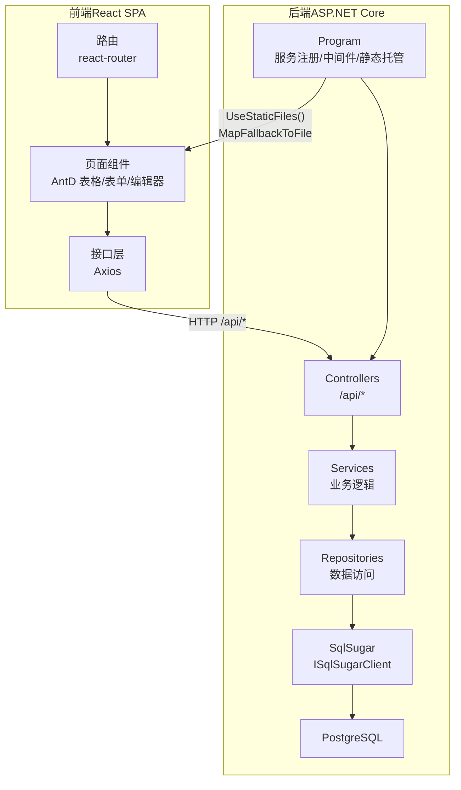
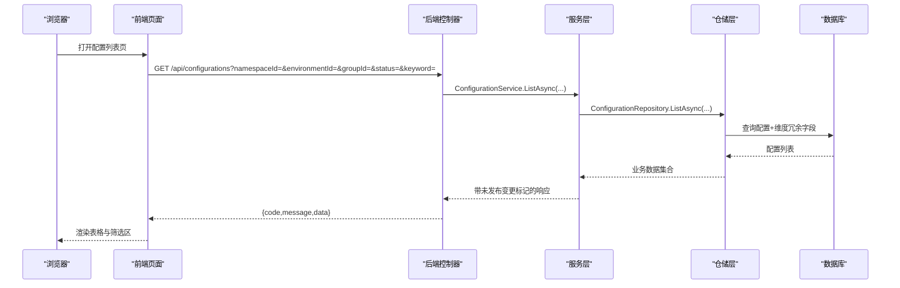
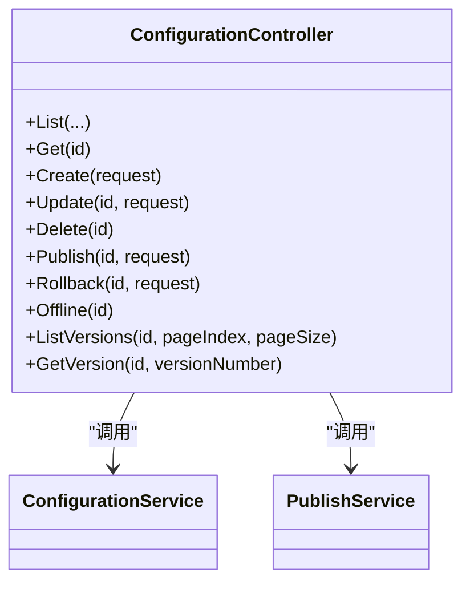
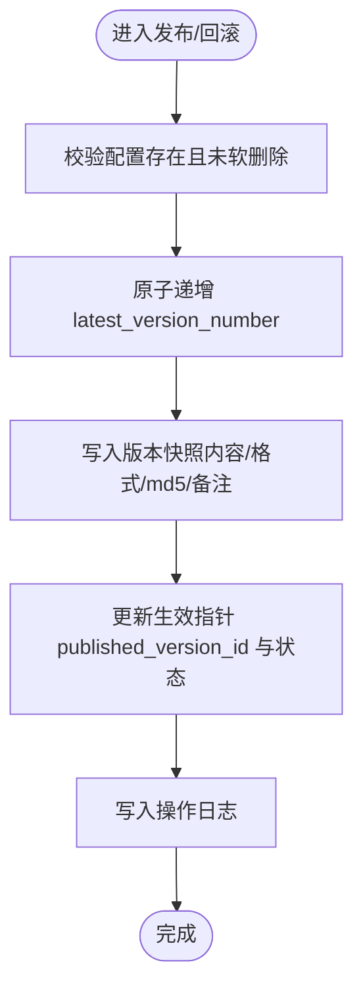
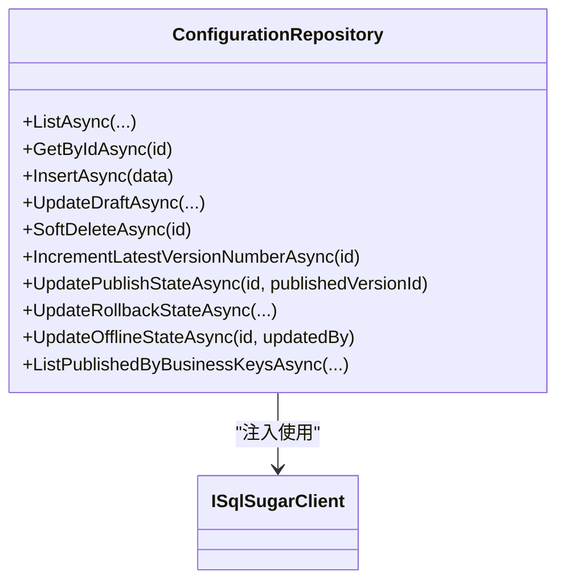
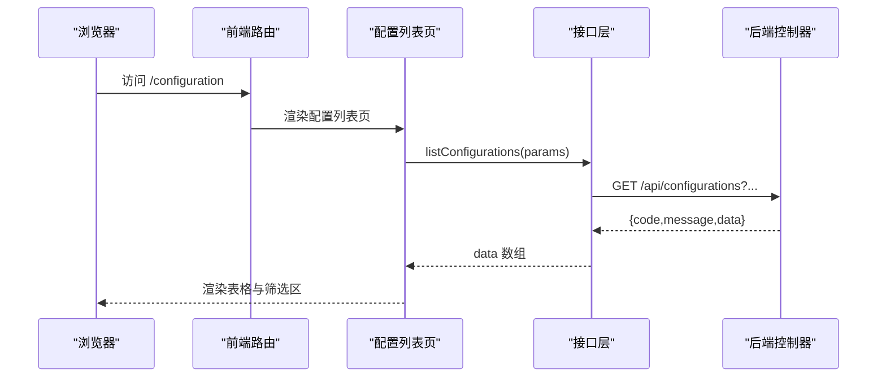
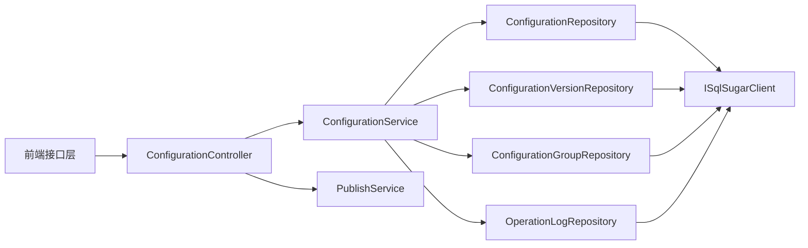

# 整体架构设计

<cite>
**本文引用的文件**
- [Program.cs](file://k_config_center/Program.cs)
- [后端方案.md](file://docs/技术方案/后端方案.md)
- [前端方案.md](file://docs/技术方案/前端方案.md)
- [项目整体架构设计.md](file://docs/技术方案/项目整体架构设计.md)
- [配置中心设计文档.md](file://docs/设计文档/配置中心设计文档.md)
- [ConfigurationController.cs](file://k_config_center/src/Controllers/ConfigurationController.cs)
- [ConfigurationService.cs](file://k_config_center/src/Services/ConfigurationService.cs)
- [ConfigurationRepository.cs](file://k_config_center/src/Repositories/ConfigurationRepository.cs)
- [SqlSugarSetup.cs](file://k_config_center/src/Infrastructure/SqlSugarSetup.cs)
- [configuration.ts](file://web/src/api/configuration.ts)
- [ConfigurationList.tsx](file://web/src/pages/configuration/ConfigurationList.tsx)
- [router/index.tsx](file://web/src/router/index.tsx)
</cite>

## 目录
1. [引言](#引言)
2. [项目结构](#项目结构)
3. [核心组件](#核心组件)
4. [架构总览](#架构总览)
5. [详细组件分析](#详细组件分析)
6. [依赖关系分析](#依赖关系分析)
7. [性能考虑](#性能考虑)
8. [故障排查指南](#故障排查指南)
9. [结论](#结论)
10. [附录](#附录)

## 引言
本设计文档面向“配置中心”系统，阐述前后端分离的整体架构与分层实现。后端采用 ASP.NET Core Web API，遵循 Controller-Service-Repository 三层架构；前端为 React 18 + TypeScript + Ant Design 5 的 SPA，通过 Vite 构建并托管到后端静态目录，形成单一应用部署形态。系统围绕命名空间、环境、配置组、配置项与版本快照组织数据，提供编辑、发布、回滚、审计与客户端读取能力。

## 项目结构
仓库由后端 .NET 工程与前端 Node 工程组成：
- 后端位于 k_config_center，包含 Controllers、Services、Repositories、Entities、Models、Infrastructure 等目录，统一以 /api 前缀暴露接口，并通过 Program 注册服务、中间件与静态资源托管。
- 前端位于 web，按 api、pages、components、hooks、utils 等组织，路由集中管理，页面通过 Axios 调用后端 /api/* 接口。

图表来源
- [Program.cs:10-107](file://k_config_center/Program.cs#L10-L107)
- [后端方案.md:27-84](file://docs/技术方案/后端方案.md#L27-L84)
- [前端方案.md:53-118](file://docs/技术方案/前端方案.md#L53-L118)

章节来源
- [项目整体架构设计.md:60-85](file://docs/技术方案/项目整体架构设计.md#L60-L85)
- [后端方案.md:27-84](file://docs/技术方案/后端方案.md#L27-L84)
- [前端方案.md:53-118](file://docs/技术方案/前端方案.md#L53-L118)

## 核心组件
- 控制器层（Controllers）：薄控制器，仅负责参数绑定、模型校验与响应包装，不写业务规则，不接触数据库。
- 服务层（Services）：承载业务规则与流程编排（如发布/回滚事务），只操作 Models/Domain 数据类，通过 Repository 读写数据库。
- 仓储层（Repositories）：唯一接触 Entities 与 ISqlSugarClient 的层，封装查询/写入/事务入口，对外出入业务数据类。
- 基础设施（Infrastructure）：SqlSugar 连接与全局软删除过滤器、统一响应包装、业务异常、Swagger 操作头过滤等。
- 前端（web）：页面与组件消费 /api/* 接口，统一错误处理与响应解包，提供配置编辑、版本对比、审计检索等能力。

章节来源
- [后端方案.md:86-120](file://docs/技术方案/后端方案.md#L86-L120)
- [Program.cs:14-34](file://k_config_center/Program.cs#L14-L34)
- [SqlSugarSetup.cs:12-39](file://k_config_center/src/Infrastructure/SqlSugarSetup.cs#L12-L39)

## 架构总览
系统采用前后端分离模式：前端 SPA 通过 HTTP 调用后端 /api/* 接口；后端以单进程形式同时提供 API 与静态资源托管，开发期经 Vite 代理联调，部署期将前端产物输出到 wwwroot 并由后端 UseStaticFiles 托管，未知前端路由通过 MapFallbackToFile("index.html") 交由 react-router 接管。

图表来源
- [ConfigurationController.cs:22-24](file://k_config_center/src/Controllers/ConfigurationController.cs#L22-L24)
- [ConfigurationService.cs:25-32](file://k_config_center/src/Services/ConfigurationService.cs#L25-L32)
- [ConfigurationRepository.cs:13-30](file://k_config_center/src/Repositories/ConfigurationRepository.cs#L13-L30)
- [后端方案.md:498-544](file://docs/技术方案/后端方案.md#L498-L544)

章节来源
- [项目整体架构设计.md:20-47](file://docs/技术方案/项目整体架构设计.md#L20-L47)
- [后端方案.md:86-120](file://docs/技术方案/后端方案.md#L86-L120)

## 详细组件分析

### 控制器层（以配置项为例）
- 职责：接收请求参数、调用 Service、返回 ApiResponse 包装结果。
- 关键端点：列表、详情、新建、更新草稿、删除（软删）、发布、回滚、下线、版本历史。
- 设计原则：薄控制器，无业务规则，异常由全局中间件统一处理。

图表来源
- [ConfigurationController.cs:8-114](file://k_config_center/src/Controllers/ConfigurationController.cs#L8-L114)

章节来源
- [ConfigurationController.cs:8-114](file://k_config_center/src/Controllers/ConfigurationController.cs#L8-L114)

### 服务层（配置编辑与发布）
- 职责：业务规则与流程编排（保存草稿、计算 md5、判断未发布变更；发布/回滚事务）。
- 关键点：md5 由服务端计算；发布/回滚通过 DatabaseTransactionRunner 在事务中完成版本号自增、快照写入、指针切换与审计日志写入。

图表来源
- [ConfigurationService.cs:49-64](file://k_config_center/src/Services/ConfigurationService.cs#L49-L64)
- [后端方案.md:614-633](file://docs/技术方案/后端方案.md#L614-L633)

章节来源
- [ConfigurationService.cs:25-108](file://k_config_center/src/Services/ConfigurationService.cs#L25-L108)
- [后端方案.md:608-633](file://docs/技术方案/后端方案.md#L608-L633)

### 仓储层（数据访问与并发安全）
- 职责：封装 SqlSugar 查询/写入，实体 ↔ 业务数据映射，提供事务入口。
- 并发与一致性：使用数据库侧原子自增（UPDATE ... RETURNING）避免并发发布产生相同版本号；唯一约束兜底冲突。

图表来源
- [ConfigurationRepository.cs:7-155](file://k_config_center/src/Repositories/ConfigurationRepository.cs#L7-L155)

章节来源
- [ConfigurationRepository.cs:7-155](file://k_config_center/src/Repositories/ConfigurationRepository.cs#L7-L155)
- [后端方案.md:660-675](file://docs/技术方案/后端方案.md#L660-L675)

### 基础设施（ORM 与全局策略）
- SqlSugar 接入：单例 ISqlSugarClient，启用属性映射 InitKeyType.Attribute，注册全局软删除过滤器（deleted_at IS NULL）。
- 统一响应与异常：ApiResponse 包装 {code,message,data}；BusinessException 被全局中间件捕获并转为统一响应。

章节来源
- [SqlSugarSetup.cs:12-39](file://k_config_center/src/Infrastructure/SqlSugarSetup.cs#L12-L39)
- [Program.cs:71-92](file://k_config_center/Program.cs#L71-L92)
- [后端方案.md:463-497](file://docs/技术方案/后端方案.md#L463-L497)

### 前端交互（配置列表与编辑）
- 路由：集中式路由表，主布局嵌套各页面。
- 接口层：按资源拆分，统一从 http.ts 出口，拦截器统一错误提示与响应解包。
- 页面：配置列表支持多级筛选、列配置持久化、内容预览、发布/下线/删除等操作。

图表来源
- [router/index.tsx:12-27](file://web/src/router/index.tsx#L12-L27)
- [configuration.ts:15-59](file://web/src/api/configuration.ts#L15-L59)
- [ConfigurationList.tsx:176-188](file://web/src/pages/configuration/ConfigurationList.tsx#L176-L188)

章节来源
- [前端方案.md:120-153](file://docs/技术方案/前端方案.md#L120-L153)
- [前端方案.md:256-264](file://docs/技术方案/前端方案.md#L256-L264)

## 依赖关系分析
- 控制器依赖服务：ConfigurationController 依赖 ConfigurationService 与 PublishService。
- 服务依赖仓储：ConfigurationService 依赖多个 Repository（配置、版本、组、审计日志）。
- 仓储依赖 ORM：所有 Repository 注入 ISqlSugarClient，禁止其他层直接引用。
- 前端依赖后端接口：前端 api 模块按资源划分，统一通过 Axios 调用 /api/*。

图表来源
- [Program.cs:14-34](file://k_config_center/Program.cs#L14-L34)
- [ConfigurationController.cs:8-114](file://k_config_center/src/Controllers/ConfigurationController.cs#L8-L114)
- [ConfigurationService.cs:13-18](file://k_config_center/src/Services/ConfigurationService.cs#L13-L18)
- [ConfigurationRepository.cs:7-155](file://k_config_center/src/Repositories/ConfigurationRepository.cs#L7-L155)

章节来源
- [后端方案.md:86-120](file://docs/技术方案/后端方案.md#L86-L120)
- [Program.cs:14-34](file://k_config_center/Program.cs#L14-L34)

## 性能考虑
- 列表查询优化：配置列表一次性取出已发布版本的 md5 做内存比对，避免逐条回查数据库，减少 IO 开销。
- 并发安全：发布时通过数据库原子自增与行锁串行化，避免重复版本号；唯一约束兜底冲突。
- 长轮询与挂起：客户端长轮询基于 CancellationToken + 超时任务，避免阻塞线程池线程。
- 静态资源托管：生产部署 UseStaticFiles 托管前端产物，API 优先于 SPA 兜底，降低静态资源加载延迟。

章节来源
- [ConfigurationService.cs:25-32](file://k_config_center/src/Services/ConfigurationService.cs#L25-L32)
- [后端方案.md:591-595](file://docs/技术方案/后端方案.md#L591-L595)
- [后端方案.md:660-675](file://docs/技术方案/后端方案.md#L660-L675)
- [项目整体架构设计.md:80-85](file://docs/技术方案/项目整体架构设计.md#L80-L85)

## 故障排查指南
- 全局异常处理：BusinessException 统一转 {code,message,data}，非业务异常记录结构化日志并返回 500，避免泄露内部细节。
- 常见错误码：服务器内部错误、参数校验失败、资源不存在、唯一冲突、发布并发冲突等，均通过 ErrorCode 枚举收敛。
- 审计日志：所有写操作落库，便于回溯问题；操作人/客户端 IP 提取后写入日志，辅助定位。

章节来源
- [Program.cs:71-92](file://k_config_center/Program.cs#L71-L92)
- [后端方案.md:463-497](file://docs/技术方案/后端方案.md#L463-L497)
- [后端方案.md:653-658](file://docs/技术方案/后端方案.md#L653-L658)

## 结论
本系统采用前后端分离与 ASP.NET Core 三层架构，清晰划分控制器、服务与仓储职责，结合 SqlSugar 与 PostgreSQL 实现稳定可靠的数据访问。通过统一响应、全局异常处理、软删除与部分唯一索引、事务与并发控制，保障系统的可维护性与扩展性。前端以 React SPA 提供高效的管理界面，配合后端单一应用部署，降低运维成本。未来可按演进路线引入组级发布消息、灰度发布与服务拆分，进一步提升可扩展性与可用性。

## 附录
- 技术选型决策与权衡：
  - 后端框架：ASP.NET Core Web API，成熟生态与高性能。
  - ORM：SqlSugar，DbFirst 方式执行 SQL 脚本建库，保留数据库特性（部分唯一索引、CHECK、触发器等）。
  - 数据库：PostgreSQL，JSONB、TIMESTAMPTZ、触发器与约束满足审计与时间语义需求。
  - 前端：React 18 + TypeScript + Ant Design 5，组件生态完善，适合中后台 CRUD 与富交互场景。
  - 部署：单一应用部署，UseStaticFiles 托管前端产物，MapFallbackToFile 兜底前端路由，简化运维。

章节来源
- [项目整体架构设计.md:49-85](file://docs/技术方案/项目整体架构设计.md#L49-L85)
- [后端方案.md:18-25](file://docs/技术方案/后端方案.md#L18-L25)
- [配置中心设计文档.md:238-251](file://docs/设计文档/配置中心设计文档.md#L238-L251)