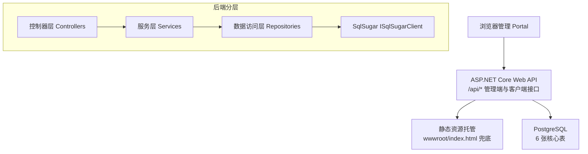
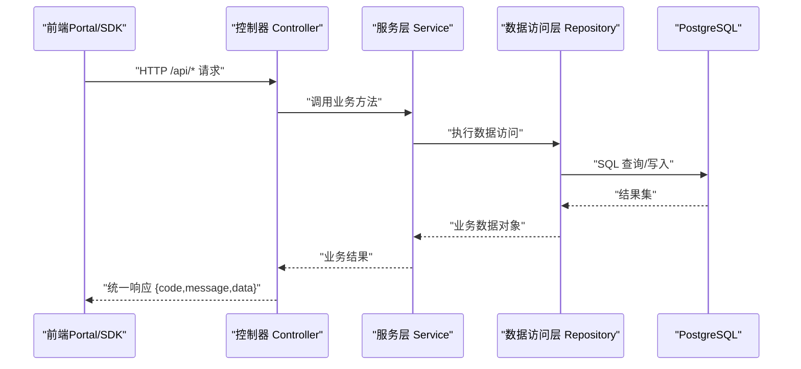
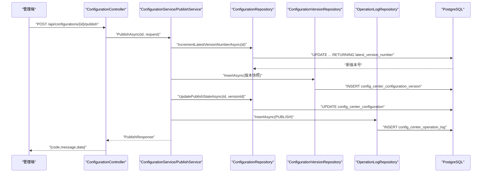
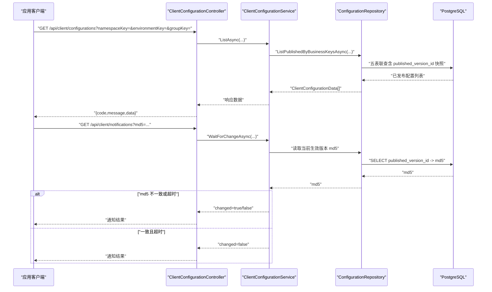
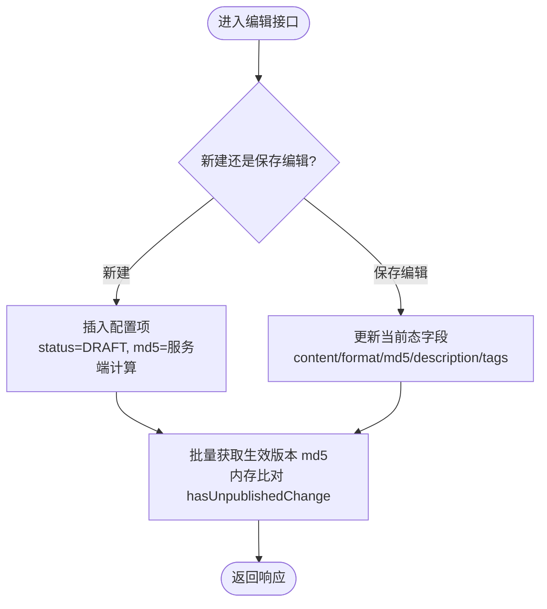
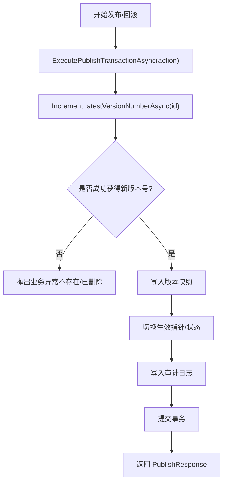
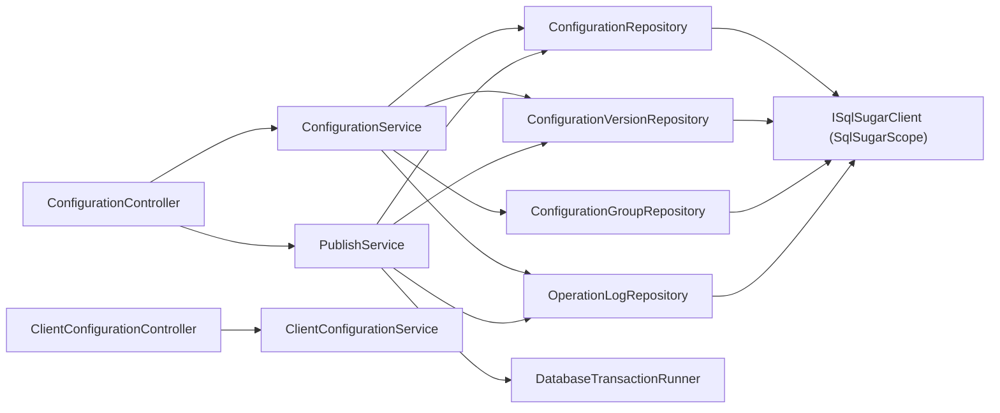
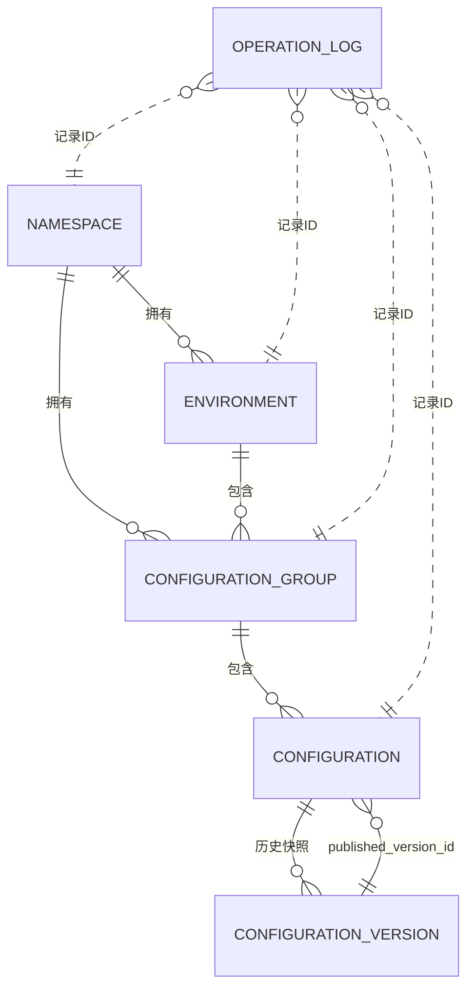

# 架构设计

<cite>
**本文引用的文件**
- [项目整体架构设计.md](file://docs/技术方案/项目整体架构设计.md)
- [后端方案.md](file://docs/技术方案/后端方案.md)
- [配置中心设计文档.md](file://docs/设计文档/配置中心设计文档.md)
- [配置中心建表脚本.sql](file://docs/数据库脚本/配置中心建表脚本.sql)
- [Program.cs](file://k_config_center/Program.cs)
- [appsettings.json](file://k_config_center/appsettings.json)
- [SqlSugarSetup.cs](file://k_config_center/src/Infrastructure/SqlSugarSetup.cs)
- [ConfigurationController.cs](file://k_config_center/src/Controllers/ConfigurationController.cs)
- [ClientConfigurationController.cs](file://k_config_center/src/Controllers/ClientConfigurationController.cs)
- [ConfigurationService.cs](file://k_config_center/src/Services/ConfigurationService.cs)
- [PublishService.cs](file://k_config_center/src/Services/PublishService.cs)
- [ConfigurationRepository.cs](file://k_config_center/src/Repositories/ConfigurationRepository.cs)
- [DatabaseTransactionRunner.cs](file://k_config_center/src/Repositories/DatabaseTransactionRunner.cs)
- [ConfigCenterConfiguration.cs](file://k_config_center/src/Entities/ConfigCenterConfiguration.cs)
</cite>

## 目录
1. [简介](#简介)
2. [项目结构](#项目结构)
3. [核心组件](#核心组件)
4. [架构总览](#架构总览)
5. [详细组件分析](#详细组件分析)
6. [依赖关系分析](#依赖关系分析)
7. [性能与并发](#性能与并发)
8. [故障排查指南](#故障排查指南)
9. [结论](#结论)
10. [附录：数据模型与ER图](#附录数据模型与er图)

## 简介
本架构设计面向“配置中心”系统，覆盖前后端分离、分层架构、核心组件职责划分（Controller/Service/Repository）、数据流向与请求处理流程、数据库设计原则与实体关系、缓存策略、事务管理与并发控制等关键主题。目标是帮助开发者快速理解系统的设计思路与实现原理，并指导后续扩展与优化。

## 项目结构
仓库采用前后端分离组织：
- 后端：ASP.NET Core Web API，单进程部署，同时提供管理端接口与客户端读取接口，托管静态前端资源并兜底 SPA 路由。
- 前端：React + TypeScript + Ant Design，独立 Node 工程，开发期通过 Vite 代理到后端。
- 文档与脚本：设计文档、技术方案、数据库 DDL 脚本集中存放。

图表来源
- [项目整体架构设计.md:20-47](file://docs/技术方案/项目整体架构设计.md#L20-L47)
- [Program.cs:94-107](file://k_config_center/Program.cs#L94-L107)

章节来源
- [项目整体架构设计.md:60-85](file://docs/技术方案/项目整体架构设计.md#L60-L85)
- [Program.cs:10-107](file://k_config_center/Program.cs#L10-L107)

## 核心组件
- 控制器层（Controllers）
  - 管理端：命名空间、环境、配置组、配置项的增删改查、发布、回滚、下线、版本历史、审计查询。
  - 客户端：按业务 key 拉取已发布配置、长轮询变更探测。
  - 职责：参数绑定与校验、调用 Service、返回统一响应；不写业务规则、不接触数据库。
- 服务层（Services）
  - 按模块拆分：Namespace/Environment/ConfigurationGroup/Configuration/Publish/ClientConfiguration/OperationLog。
  - 职责：业务规则（唯一性、状态机、md5 计算、未发布变更判断）、事务编排（通过 Repository 的事务入口）、审计日志写入。
- 数据访问层（Repositories）
  - 唯一接触 Entities 与 ISqlSugarClient 的层；封装 Queryable/Insertable/Updateable/原生 SQL。
  - 对外仅暴露业务数据类（Domain/Models），完成实体与业务数据的映射。
- 基础设施（Infrastructure）
  - SqlSugar 注册与全局软删除过滤器、统一响应包装、错误码枚举、操作人/IP 提取工具、Swagger 头过滤器。

章节来源
- [后端方案.md:27-84](file://docs/技术方案/后端方案.md#L27-L84)
- [后端方案.md:86-120](file://docs/技术方案/后端方案.md#L86-L120)
- [Program.cs:14-34](file://k_config_center/Program.cs#L14-L34)

## 架构总览
系统采用前后端分离 + 分层架构（Controller → Service → Repository → ORM → DB）。管理端与客户端接口在控制器边界隔离，读写职责清晰，便于未来拆分为独立服务。

图表来源
- [后端方案.md:86-120](file://docs/技术方案/后端方案.md#L86-L120)
- [Program.cs:63-99](file://k_config_center/Program.cs#L63-L99)

## 详细组件分析

### 配置编辑与发布流程（管理端）
- 编辑保存：只更新当前态字段（content/format/md5/description/tags），不产生版本记录，status 不变；updated_at 由数据库触发器自动维护。
- 发布：事务内原子递增版本号、写入不可变快照、切换生效指针、写审计日志；无未发布变更时拒绝重复发布。
- 回滚：以目标历史版本内容生成新版本（change_type=ROLLBACK），保持版本线性递增；同步当前态内容与生效指针。

图表来源
- [ConfigurationController.cs:65-83](file://k_config_center/src/Controllers/ConfigurationController.cs#L65-L83)
- [PublishService.cs:24-54](file://k_config_center/src/Services/PublishService.cs#L24-L54)
- [ConfigurationRepository.cs:75-90](file://k_config_center/src/Repositories/ConfigurationRepository.cs#L75-L90)

章节来源
- [ConfigurationController.cs:8-114](file://k_config_center/src/Controllers/ConfigurationController.cs#L8-L114)
- [ConfigurationService.cs:9-109](file://k_config_center/src/Services/ConfigurationService.cs#L9-L109)
- [PublishService.cs:9-116](file://k_config_center/src/Services/PublishService.cs#L9-L116)

### 客户端读取与长轮询（应用 SDK）
- 读取：按 namespaceKey/environmentKey/groupKey 定位，只返回 status='PUBLISHED' 且未软删除的配置，内容取自 published_version_id 指向的版本快照。
- 长轮询：携带本地 md5，服务端对比生效版本 md5，不一致立即返回 changed=true；一致则挂起（最长 30 秒，期间周期性对比）直到变更或超时返回 changed=false。

图表来源
- [ClientConfigurationController.cs:13-45](file://k_config_center/src/Controllers/ClientConfigurationController.cs#L13-L45)
- [ConfigurationRepository.cs:105-124](file://k_config_center/src/Repositories/ConfigurationRepository.cs#L105-L124)

章节来源
- [ClientConfigurationController.cs:1-47](file://k_config_center/src/Controllers/ClientConfigurationController.cs#L1-L47)
- [后端方案.md:581-596](file://docs/技术方案/后端方案.md#L581-L596)

### 配置项编辑流程（草稿）
- 新建：创建 DRAFT 配置，计算 md5，latest_version_number=0。
- 保存编辑：更新 content/format/md5/description/tags，不产生版本，status 不变。
- 列表详情：附带“有未发布变更”标记（当前 md5 与生效版本 md5 不一致或从未发布）。

图表来源
- [ConfigurationService.cs:23-77](file://k_config_center/src/Services/ConfigurationService.cs#L23-L77)
- [ConfigurationRepository.cs:13-30](file://k_config_center/src/Repositories/ConfigurationRepository.cs#L13-L30)

章节来源
- [ConfigurationService.cs:9-109](file://k_config_center/src/Services/ConfigurationService.cs#L9-L109)

### 事务与并发控制机制
- 版本号原子递增：使用数据库侧 UPDATE ... RETURNING 在行锁上串行化并发发布，避免“先读后写”竞态。
- 唯一约束兜底：UNIQUE(configuration_id, version_number) 保证版本号唯一，冲突转为业务错误码 30004。
- 事务边界：通过 DatabaseTransactionRunner.ExecuteAsync 统一编排跨表事务，Service 不直接接触 ISqlSugarClient。

图表来源
- [PublishService.cs:94-108](file://k_config_center/src/Services/PublishService.cs#L94-L108)
- [ConfigurationRepository.cs:75-90](file://k_config_center/src/Repositories/ConfigurationRepository.cs#L75-L90)
- [DatabaseTransactionRunner.cs:11-17](file://k_config_center/src/Repositories/DatabaseTransactionRunner.cs#L11-L17)

章节来源
- [后端方案.md:660-675](file://docs/技术方案/后端方案.md#L660-L675)
- [PublishService.cs:9-116](file://k_config_center/src/Services/PublishService.cs#L9-L116)

## 依赖关系分析
- 控制器依赖服务：ConfigurationController 依赖 ConfigurationService 与 PublishService；ClientConfigurationController 依赖 ClientConfigurationService。
- 服务依赖仓储：ConfigurationService 依赖 ConfigurationRepository、ConfigurationVersionRepository、ConfigurationGroupRepository、OperationLogRepository；PublishService 依赖上述仓储及 DatabaseTransactionRunner。
- 仓储依赖 ORM：所有仓储注入 ISqlSugarClient（SqlSugarScope 单例），确保同一异步上下文内的事务一致性。
- 基础设施：SqlSugarSetup 注册全局软删除过滤器；Program.cs 注册中间件、静态资源与路由。

图表来源
- [Program.cs:14-34](file://k_config_center/Program.cs#L14-L34)
- [SqlSugarSetup.cs:12-38](file://k_config_center/src/Infrastructure/SqlSugarSetup.cs#L12-L38)

章节来源
- [Program.cs:14-34](file://k_config_center/Program.cs#L14-L34)
- [SqlSugarSetup.cs:12-38](file://k_config_center/src/Infrastructure/SqlSugarSetup.cs#L12-L38)

## 性能与并发
- 读取路径优化：配置表冗余 namespace_id/environment_id，配合 index_configuration_namespace_environment 索引，避免多表 JOIN，提升高频批量拉取性能。
- 变更探测：基于 md5 的轻量级对比，适合长轮询场景，降低网络与数据库压力。
- 并发安全：版本号原子递增 + 唯一约束兜底，保证高并发发布下的数据一致性。
- 软删除与部分唯一索引：WHERE deleted_at IS NULL 的部分唯一索引允许软删除后重建同 key 资源，兼顾可审计与可用性。
- 时间戳维护：数据库触发器自动刷新 updated_at，减少应用层负担。

章节来源
- [配置中心设计文档.md:59-64](file://docs/设计文档/配置中心设计文档.md#L59-L64)
- [配置中心设计文档.md:207-214](file://docs/设计文档/配置中心设计文档.md#L207-L214)
- [配置中心设计文档.md:239-250](file://docs/设计文档/配置中心设计文档.md#L239-L250)
- [后端方案.md:660-675](file://docs/技术方案/后端方案.md#L660-L675)

## 故障排查指南
- 全局异常处理：BusinessException 统一转换为 {code,message,data:null}，非业务异常记录结构化日志并返回 500；客户端断开（长轮询取消）静默结束。
- 常见错误码：
  - 10000：服务器内部错误
  - 10001：业务状态非法
  - 10002：资源不存在
  - 20001~20004：基础维度冲突与级联删除冲突
  - 30001~30004：配置与发布相关冲突（key 冲突、无未发布变更、回滚版本不存在、发布并发冲突）
- 调试建议：
  - 检查连接字符串配置（appsettings.json）
  - 确认 Swagger 仅在开发环境启用
  - 查看审计日志 detail 字段，定位变更前后差异与请求参数
  - 关注数据库触发器与部分唯一索引行为，避免误判“key 冲突”

章节来源
- [Program.cs:71-92](file://k_config_center/Program.cs#L71-L92)
- [后端方案.md:463-496](file://docs/技术方案/后端方案.md#L463-L496)
- [appsettings.json:9-11](file://k_config_center/appsettings.json#L9-L11)

## 结论
本架构通过前后端分离与清晰的三层架构，实现了配置中心的编辑、发布、回滚、审计与客户端读取能力。数据库层面采用软删除、部分唯一索引与触发器，保障数据一致性与可审计性；服务层通过事务编排与原子递增，确保高并发下的正确性。后续可按演进路线引入灰度发布、消息推送与服务拆分，进一步提升可扩展性与运维效率。

## 附录：数据模型与ER图
- 层级模型：namespace → environment → configuration_group → configuration → configuration_version
- 实体关系：
  - 环境隶属命名空间，配置组隶属环境，配置项隶属配置组
  - 配置项冗余 namespace_id/environment_id 以提升读取性能
  - 版本表为不可变快照，发布/回滚均写入新快照
  - 操作日志仅记录 ID，无外键约束，便于审计与性能

图表来源
- [配置中心设计文档.md:37-57](file://docs/设计文档/配置中心设计文档.md#L37-L57)
- [配置中心建表脚本.sql:26-257](file://docs/数据库脚本/配置中心建表脚本.sql#L26-L257)

章节来源
- [配置中心设计文档.md:37-57](file://docs/设计文档/配置中心设计文档.md#L37-L57)
- [配置中心建表脚本.sql:26-257](file://docs/数据库脚本/配置中心建表脚本.sql#L26-L257)