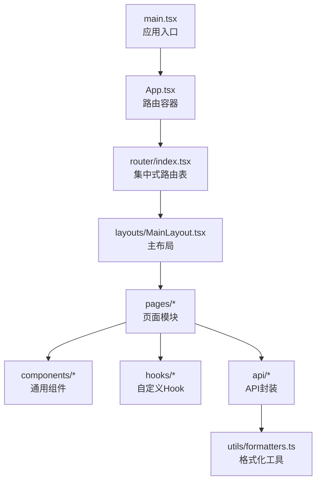
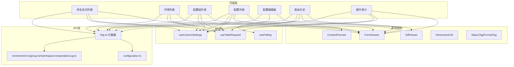
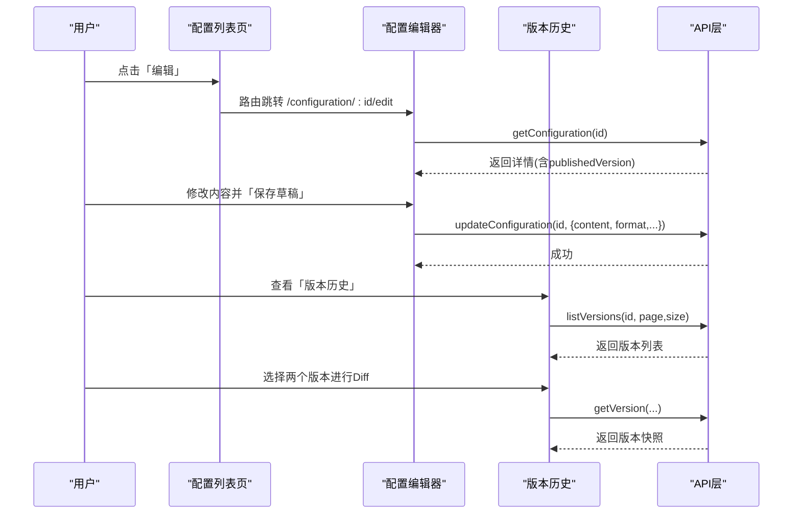
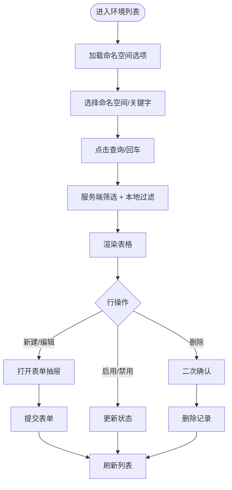
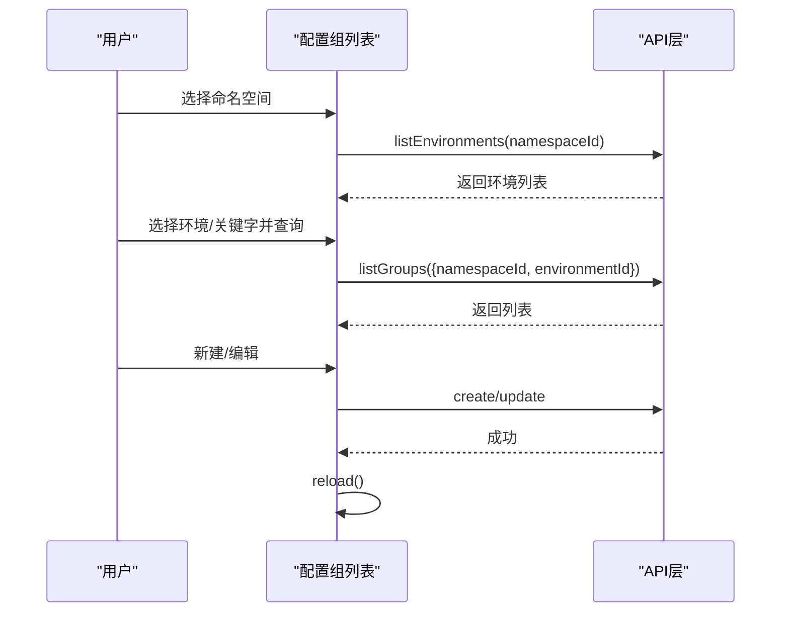
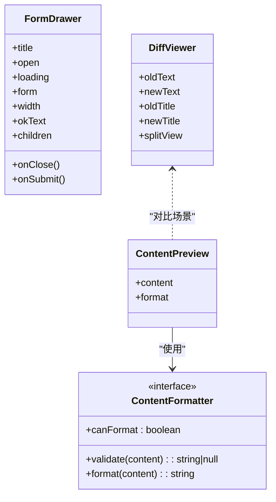
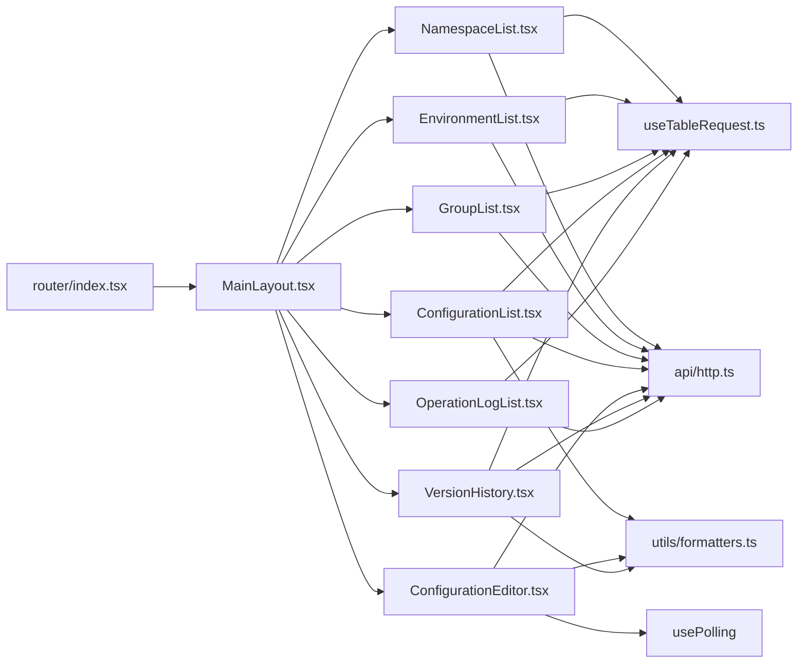

# 前端模块设计

<cite>
**本文引用的文件**
- [web/src/App.tsx](file://web/src/App.tsx)
- [web/src/main.tsx](file://web/src/main.tsx)
- [web/src/router/index.tsx](file://web/src/router/index.tsx)
- [web/src/layouts/MainLayout.tsx](file://web/src/layouts/MainLayout.tsx)
- [web/src/pages/namespace/NamespaceList.tsx](file://web/src/pages/namespace/NamespaceList.tsx)
- [web/src/pages/environment/EnvironmentList.tsx](file://web/src/pages/environment/EnvironmentList.tsx)
- [web/src/pages/group/GroupList.tsx](file://web/src/pages/group/GroupList.tsx)
- [web/src/pages/configuration/ConfigurationList.tsx](file://web/src/pages/configuration/ConfigurationList.tsx)
- [web/src/pages/configuration/ConfigurationEditor.tsx](file://web/src/pages/configuration/ConfigurationEditor.tsx)
- [web/src/pages/configuration/VersionHistory.tsx](file://web/src/pages/configuration/VersionHistory.tsx)
- [web/src/pages/audit/OperationLogList.tsx](file://web/src/pages/audit/OperationLogList.tsx)
- [web/src/components/FormDrawer.tsx](file://web/src/components/FormDrawer.tsx)
- [web/src/components/DiffViewer.tsx](file://web/src/components/DiffViewer.tsx)
- [web/src/components/ContentPreview.tsx](file://web/src/components/ContentPreview.tsx)
- [web/src/api/http.ts](file://web/src/api/http.ts)
- [web/src/api/configuration.ts](file://web/src/api/configuration.ts)
- [web/src/hooks/useTableRequest.ts](file://web/src/hooks/useTableRequest.ts)
- [web/src/utils/formatters.ts](file://web/src/utils/formatters.ts)
</cite>

## 目录
1. [简介](#简介)
2. [项目结构](#项目结构)
3. [核心组件](#核心组件)
4. [架构总览](#架构总览)
5. [详细组件分析](#详细组件分析)
6. [依赖关系分析](#依赖关系分析)
7. [性能考量](#性能考量)
8. [故障排查指南](#故障排查指南)
9. [结论](#结论)
10. [附录：使用示例与最佳实践](#附录使用示例与最佳实践)

## 简介
本文件面向配置中心的前端模块设计，系统化说明页面模块的组织方式、通用组件设计、路由导航、状态管理、API 封装与调用规范，并给出架构图、流程图与常见问题排查建议。目标是帮助开发者快速理解并高效扩展该前端工程。

## 项目结构
前端采用基于功能域的分层组织：
- 入口与全局：应用根组件、主题与国际化、路由容器
- 布局：侧边栏导航、顶栏操作人输入、内容区
- 页面：命名空间、环境、配置组、配置管理（列表/编辑/版本历史）、操作审计
- 通用组件：表单抽屉、差异对比、内容预览、列设置等
- API 层：Axios 实例、拦截器、各业务模块接口封装
- Hooks：表格请求、轮询、列设置等
- 工具：格式化器注册表、剪贴板等

图表来源
- [web/src/main.tsx:1-35](file://web/src/main.tsx#L1-L35)
- [web/src/App.tsx:1-8](file://web/src/App.tsx#L1-L8)
- [web/src/router/index.tsx:1-28](file://web/src/router/index.tsx#L1-L28)
- [web/src/layouts/MainLayout.tsx:1-104](file://web/src/layouts/MainLayout.tsx#L1-L104)

章节来源
- [web/src/main.tsx:1-35](file://web/src/main.tsx#L1-L35)
- [web/src/App.tsx:1-8](file://web/src/App.tsx#L1-L8)
- [web/src/router/index.tsx:1-28](file://web/src/router/index.tsx#L1-L28)
- [web/src/layouts/MainLayout.tsx:1-104](file://web/src/layouts/MainLayout.tsx#L1-L104)

## 核心组件
- 表单抽屉 FormDrawer：右侧滑出表单，统一关闭二次确认、销毁重建、提交 loading 控制
- 差异对比 DiffViewer：基于 react-diff-viewer-continued 的双栏/单栏 diff 展示
- 内容预览 ContentPreview：列表单元格内短文本预览，hover 弹出完整内容，支持复制
- 列设置 ColumnSettingButton + useColumnSettings：列显隐、宽度持久化、拖拽调宽
- 维度展示 DimensionCell：名称 Tag + key 框，点击复制，缺失时回退显示 id
- 状态标签 StatusTag / 格式标签 FormatTag / 格式选择 FormatSelect：统一状态与格式展示与选择

章节来源
- [web/src/components/FormDrawer.tsx:1-71](file://web/src/components/FormDrawer.tsx#L1-L71)
- [web/src/components/DiffViewer.tsx:1-29](file://web/src/components/DiffViewer.tsx#L1-L29)
- [web/src/components/ContentPreview.tsx:1-64](file://web/src/components/ContentPreview.tsx#L1-L64)
- [web/src/utils/formatters.ts:1-184](file://web/src/utils/formatters.ts#L1-L184)

## 架构总览
前端采用“页面-组件-Hook-API”分层，配合集中式路由与统一 HTTP 拦截器，形成清晰的数据流与职责边界。

图表来源
- [web/src/router/index.tsx:1-28](file://web/src/router/index.tsx#L1-L28)
- [web/src/api/http.ts:1-55](file://web/src/api/http.ts#L1-L55)
- [web/src/api/configuration.ts:1-59](file://web/src/api/configuration.ts#L1-L59)
- [web/src/hooks/useTableRequest.ts:1-38](file://web/src/hooks/useTableRequest.ts#L1-L38)
- [web/src/pages/configuration/ConfigurationEditor.tsx:1-373](file://web/src/pages/configuration/ConfigurationEditor.tsx#L1-L373)

## 详细组件分析

### 配置管理页面模块
- 配置列表：三级级联筛选（命名空间→环境→配置组）+ 状态 + Key 关键字；行操作包含详情、编辑、发布、下线、删除、版本历史；新建配置支持校验并格式化
- 配置编辑器：Monaco 编辑器按格式高亮；保存草稿与发布分离；本地未保存标记；他人变更轮询提示；侧栏展示维度信息与生效版本
- 版本历史：分页版本列表；任选两版 Diff；当前编辑态 vs 生效版本预设对比；回滚生成新版本

图表来源
- [web/src/pages/configuration/ConfigurationList.tsx:1-666](file://web/src/pages/configuration/ConfigurationList.tsx#L1-L666)
- [web/src/pages/configuration/ConfigurationEditor.tsx:1-373](file://web/src/pages/configuration/ConfigurationEditor.tsx#L1-L373)
- [web/src/pages/configuration/VersionHistory.tsx:1-350](file://web/src/pages/configuration/VersionHistory.tsx#L1-L350)
- [web/src/api/configuration.ts:1-59](file://web/src/api/configuration.ts#L1-L59)

章节来源
- [web/src/pages/configuration/ConfigurationList.tsx:1-666](file://web/src/pages/configuration/ConfigurationList.tsx#L1-L666)
- [web/src/pages/configuration/ConfigurationEditor.tsx:1-373](file://web/src/pages/configuration/ConfigurationEditor.tsx#L1-L373)
- [web/src/pages/configuration/VersionHistory.tsx:1-350](file://web/src/pages/configuration/VersionHistory.tsx#L1-L350)

### 环境管理页面模块
- 提供环境的可视化管理界面：命名空间筛选、关键字搜索、新建/编辑抽屉、启用/禁用切换、删除二次确认
- 使用 DimensionCell 展示所属命名空间，便于跨页面识别

图表来源
- [web/src/pages/environment/EnvironmentList.tsx:1-334](file://web/src/pages/environment/EnvironmentList.tsx#L1-L334)

章节来源
- [web/src/pages/environment/EnvironmentList.tsx:1-334](file://web/src/pages/environment/EnvironmentList.tsx#L1-L334)

### 配置组管理页面模块
- 实现配置的分组组织：命名空间与环境级联筛选、关键字搜索、新建/编辑抽屉、启用/禁用切换、删除二次确认
- 表单内环境级联：选择命名空间后动态加载环境选项，编辑时只读展示

图表来源
- [web/src/pages/group/GroupList.tsx:1-388](file://web/src/pages/group/GroupList.tsx#L1-L388)

章节来源
- [web/src/pages/group/GroupList.tsx:1-388](file://web/src/pages/group/GroupList.tsx#L1-L388)

### 命名空间管理页面模块
- 顶层隔离单元管理：列表、新建/编辑、启用/禁用、删除二次确认
- 关键字本地过滤，列配置持久化

章节来源
- [web/src/pages/namespace/NamespaceList.tsx:1-241](file://web/src/pages/namespace/NamespaceList.tsx#L1-L241)

### 操作审计页面模块
- 展示完整的操作日志记录：操作人、时间范围检索，多维度关联展示（命名空间/环境/配置组/配置项），详情 JSON 展开
- 操作类型映射为中文标签，便于快速识别

章节来源
- [web/src/pages/audit/OperationLogList.tsx:1-199](file://web/src/pages/audit/OperationLogList.tsx#L1-L199)

### 通用组件模块
- 表单抽屉 FormDrawer：统一关闭二次确认、destroyOnClose、loading 控制
- 差异对比 DiffViewer：双栏/单栏模式，用于版本对比
- 内容预览 ContentPreview：列表内预览、超长截断、复制全部
- 格式化器 formatters：json/yaml/xml/properties/toml/text 的校验与美化，供编辑器与预览复用

图表来源
- [web/src/components/FormDrawer.tsx:1-71](file://web/src/components/FormDrawer.tsx#L1-L71)
- [web/src/components/DiffViewer.tsx:1-29](file://web/src/components/DiffViewer.tsx#L1-L29)
- [web/src/components/ContentPreview.tsx:1-64](file://web/src/components/ContentPreview.tsx#L1-L64)
- [web/src/utils/formatters.ts:1-184](file://web/src/utils/formatters.ts#L1-L184)

章节来源
- [web/src/components/FormDrawer.tsx:1-71](file://web/src/components/FormDrawer.tsx#L1-L71)
- [web/src/components/DiffViewer.tsx:1-29](file://web/src/components/DiffViewer.tsx#L1-L29)
- [web/src/components/ContentPreview.tsx:1-64](file://web/src/components/ContentPreview.tsx#L1-L64)
- [web/src/utils/formatters.ts:1-184](file://web/src/utils/formatters.ts#L1-L184)

## 依赖关系分析
- 路由与布局：集中式路由表定义页面路径，MainLayout 承载侧边栏与内容区
- 页面到组件：列表页普遍组合 PageContainer、Table、FormDrawer、DimensionCell、ColumnSettingButton
- 页面到 Hook：useTableRequest 统一列表加载与防抖竞态；usePolling 在编辑器中探测远程变更
- 页面到 API：通过 api/* 模块调用后端，统一由 http.ts 拦截器处理错误与注入 X-Operator
- 工具复用：formatters 被编辑器、预览、新建表单共用，保证一致性

图表来源
- [web/src/router/index.tsx:1-28](file://web/src/router/index.tsx#L1-L28)
- [web/src/layouts/MainLayout.tsx:1-104](file://web/src/layouts/MainLayout.tsx#L1-L104)
- [web/src/hooks/useTableRequest.ts:1-38](file://web/src/hooks/useTableRequest.ts#L1-L38)
- [web/src/api/http.ts:1-55](file://web/src/api/http.ts#L1-L55)
- [web/src/utils/formatters.ts:1-184](file://web/src/utils/formatters.ts#L1-L184)

章节来源
- [web/src/router/index.tsx:1-28](file://web/src/router/index.tsx#L1-L28)
- [web/src/layouts/MainLayout.tsx:1-104](file://web/src/layouts/MainLayout.tsx#L1-L104)
- [web/src/hooks/useTableRequest.ts:1-38](file://web/src/hooks/useTableRequest.ts#L1-L38)
- [web/src/api/http.ts:1-55](file://web/src/api/http.ts#L1-L55)
- [web/src/utils/formatters.ts:1-184](file://web/src/utils/formatters.ts#L1-L184)

## 性能考量
- 列表数据：useTableRequest 通过 requestIdRef 避免旧响应覆盖新数据，减少闪烁与错乱
- 下拉选项：按需加载（下拉展开时 reload），避免首屏冗余请求
- 内容预览：超长内容截断至固定长度，防止 Popover 渲染卡顿
- 编辑器轮询：低频轮询（如 10s）探测他人变更，仅在本地未编辑时提示刷新，降低网络压力
- 表格横向滚动：scroll.x="max-content" 适配窄窗口，避免溢出

[本节为通用指导，不直接分析具体文件]

## 故障排查指南
- 接口报错：http.ts 拦截器统一弹出 message.error，页面无需重复处理；若出现重复提示，检查是否手动再次抛出或捕获
- 表单误关丢失：FormDrawer 内置 isFieldsTouched 二次确认，若失效请检查 form 实例是否正确传入
- 列表数据错乱：确保 fetcher 引用稳定（useCallback），且 useTableRequest 的 reload 仅由条件变化触发
- 编辑器发布与保存混淆：保存草稿不会创建版本，发布才会生成新版本；发布弹窗会提示本地未保存内容不会被包含
- 版本 Diff 为空：确保所选版本存在 content；空内容需传空串而非 undefined

章节来源
- [web/src/api/http.ts:1-55](file://web/src/api/http.ts#L1-L55)
- [web/src/components/FormDrawer.tsx:1-71](file://web/src/components/FormDrawer.tsx#L1-L71)
- [web/src/hooks/useTableRequest.ts:1-38](file://web/src/hooks/useTableRequest.ts#L1-L38)
- [web/src/pages/configuration/ConfigurationEditor.tsx:1-373](file://web/src/pages/configuration/ConfigurationEditor.tsx#L1-L373)
- [web/src/pages/configuration/VersionHistory.tsx:1-350](file://web/src/pages/configuration/VersionHistory.tsx#L1-L350)

## 结论
该前端工程以清晰的页面-组件-Hook-API 分层、集中式路由与统一 HTTP 拦截器为基础，提供了可复用的通用组件与工具，支撑命名空间、环境、配置组、配置管理与操作审计等核心能力。通过统一的列表加载、列设置、格式化器与差异对比，提升了开发效率与用户体验。

[本节为总结性内容，不直接分析具体文件]

## 附录：使用示例与最佳实践
- 页面路由导航
  - 使用 useNavigate 进行页面跳转，例如从配置列表跳转到编辑页与版本历史页
  - 参考路径：[web/src/pages/configuration/ConfigurationList.tsx:400-430](file://web/src/pages/configuration/ConfigurationList.tsx#L400-L430)
- 列表数据加载
  - 使用 useTableRequest 封装 fetcher，条件变化自动重载；避免重复请求覆盖
  - 参考路径：[web/src/hooks/useTableRequest.ts:1-38](file://web/src/hooks/useTableRequest.ts#L1-L38)
- 表单抽屉使用
  - 将 AntD Form 实例传入 FormDrawer，利用其关闭二次确认与 destroyOnClose
  - 参考路径：[web/src/components/FormDrawer.tsx:1-71](file://web/src/components/FormDrawer.tsx#L1-L71)
- 内容格式化与校验
  - 通过 getFormatter(format) 获取对应格式化器，进行 validate/format
  - 参考路径：[web/src/utils/formatters.ts:1-184](file://web/src/utils/formatters.ts#L1-L184)
- 差异对比
  - 使用 DiffViewer 展示两个版本的差异，支持标题与单/双栏模式
  - 参考路径：[web/src/components/DiffViewer.tsx:1-29](file://web/src/components/DiffViewer.tsx#L1-L29)
- API 调用封装
  - 所有接口通过 api/* 模块调用，统一经 http.ts 拦截器处理错误与注入操作人
  - 参考路径：[web/src/api/http.ts:1-55](file://web/src/api/http.ts#L1-L55)、[web/src/api/configuration.ts:1-59](file://web/src/api/configuration.ts#L1-L59)

章节来源
- [web/src/pages/configuration/ConfigurationList.tsx:400-430](file://web/src/pages/configuration/ConfigurationList.tsx#L400-L430)
- [web/src/hooks/useTableRequest.ts:1-38](file://web/src/hooks/useTableRequest.ts#L1-L38)
- [web/src/components/FormDrawer.tsx:1-71](file://web/src/components/FormDrawer.tsx#L1-L71)
- [web/src/utils/formatters.ts:1-184](file://web/src/utils/formatters.ts#L1-L184)
- [web/src/components/DiffViewer.tsx:1-29](file://web/src/components/DiffViewer.tsx#L1-L29)
- [web/src/api/http.ts:1-55](file://web/src/api/http.ts#L1-L55)
- [web/src/api/configuration.ts:1-59](file://web/src/api/configuration.ts#L1-L59)