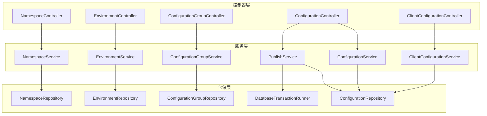
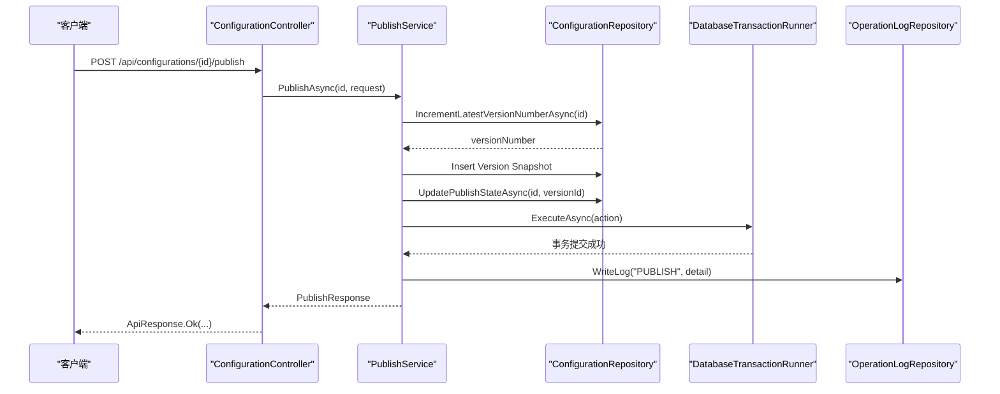
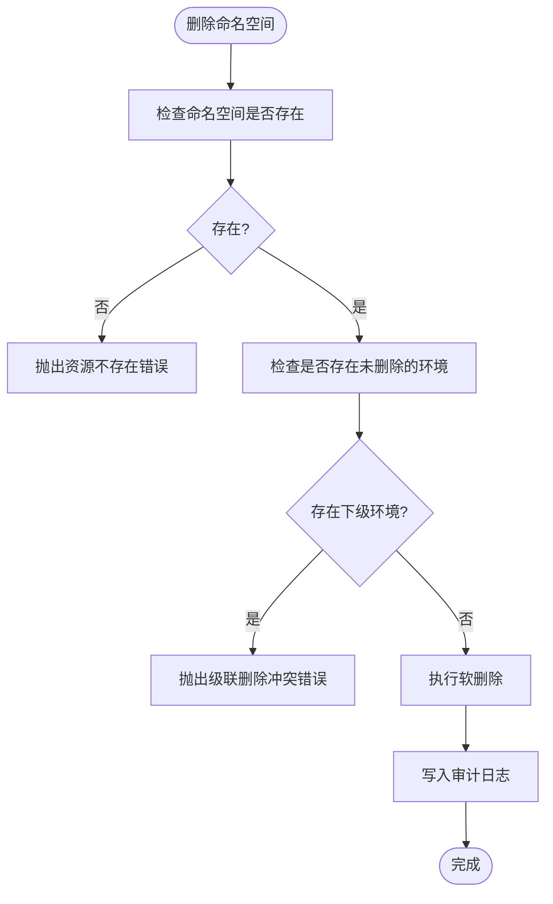
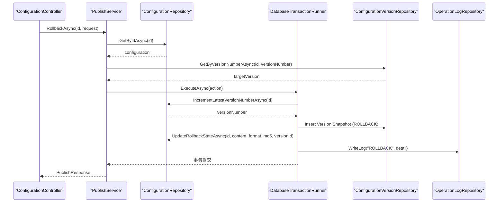
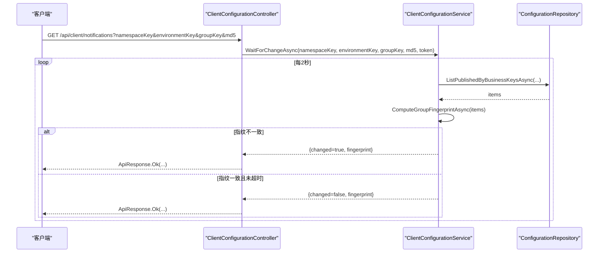
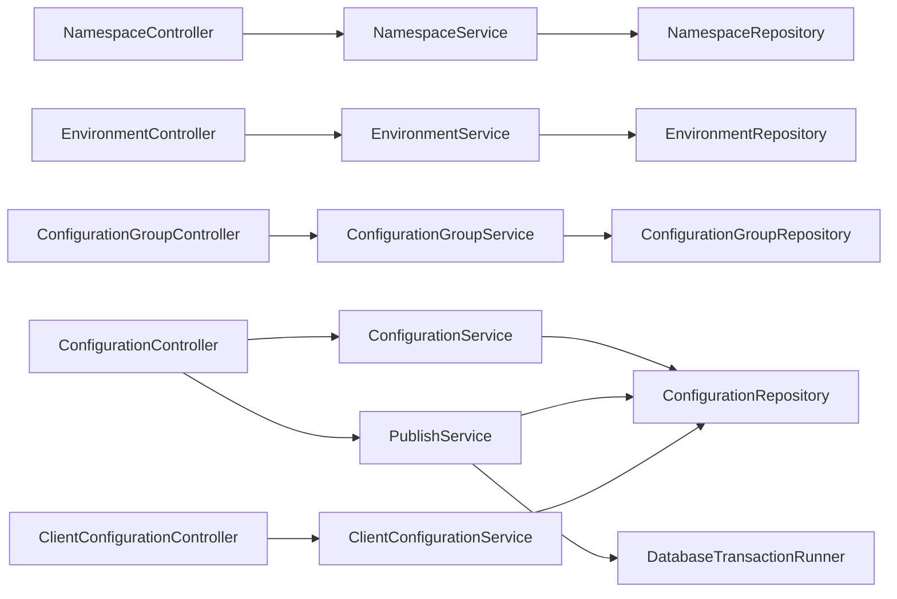

# 后端模块设计

<cite>
**本文引用的文件**
- [NamespaceController.cs](file://k_config_center/src/Controllers/NamespaceController.cs)
- [EnvironmentController.cs](file://k_config_center/src/Controllers/EnvironmentController.cs)
- [ConfigurationGroupController.cs](file://k_config_center/src/Controllers/ConfigurationGroupController.cs)
- [ConfigurationController.cs](file://k_config_center/src/Controllers/ConfigurationController.cs)
- [ClientConfigurationController.cs](file://k_config_center/src/Controllers/ClientConfigurationController.cs)
- [NamespaceService.cs](file://k_config_center/src/Services/NamespaceService.cs)
- [EnvironmentService.cs](file://k_config_center/src/Services/EnvironmentService.cs)
- [ConfigurationGroupService.cs](file://k_config_center/src/Services/ConfigurationGroupService.cs)
- [ConfigurationService.cs](file://k_config_center/src/Services/ConfigurationService.cs)
- [PublishService.cs](file://k_config_center/src/Services/PublishService.cs)
- [ClientConfigurationService.cs](file://k_config_center/src/Services/ClientConfigurationService.cs)
- [NamespaceRepository.cs](file://k_config_center/src/Repositories/NamespaceRepository.cs)
- [EnvironmentRepository.cs](file://k_config_center/src/Repositories/EnvironmentRepository.cs)
- [ConfigurationGroupRepository.cs](file://k_config_center/src/Repositories/ConfigurationGroupRepository.cs)
- [ConfigurationRepository.cs](file://k_config_center/src/Repositories/ConfigurationRepository.cs)
- [DatabaseTransactionRunner.cs](file://k_config_center/src/Repositories/DatabaseTransactionRunner.cs)
- [OperationHelper.cs](file://k_config_center/src/Infrastructure/OperationHelper.cs)
- [ApiResponse.cs](file://k_config_center/src/Infrastructure/ApiResponse.cs)
- [BusinessException.cs](file://k_config_center/src/Infrastructure/BusinessException.cs)
</cite>

## 目录
1. [简介](#简介)
2. [项目结构](#项目结构)
3. [核心组件](#核心组件)
4. [架构总览](#架构总览)
5. [详细组件分析](#详细组件分析)
6. [依赖关系分析](#依赖关系分析)
7. [性能考量](#性能考量)
8. [故障排查指南](#故障排查指南)
9. [结论](#结论)
10. [附录](#附录)

## 简介
本文件面向配置中心后端模块，系统化说明各业务模块的职责边界、实现机制与交互方式。围绕命名空间管理、环境管理、配置组管理、配置项管理、发布服务与客户端读取六大模块，阐述其数据流向、异常处理策略与事务保障，并通过架构图、时序图与流程图展示控制器、服务层、仓储层之间的调用关系与协作模式。

## 项目结构
后端采用典型的三层架构：
- 控制器层（Controllers）：仅负责参数接收、调用服务层并包装统一响应。
- 服务层（Services）：承载业务逻辑、跨模块协调、事务编排与审计日志写入。
- 仓储层（Repositories）：封装数据库访问，提供领域对象到实体映射、软删除过滤、联表查询与原子操作。

图表来源
- [NamespaceController.cs:1-50](file://k_config_center/src/Controllers/NamespaceController.cs#L1-L50)
- [EnvironmentController.cs:1-52](file://k_config_center/src/Controllers/EnvironmentController.cs#L1-L52)
- [ConfigurationGroupController.cs:1-53](file://k_config_center/src/Controllers/ConfigurationGroupController.cs#L1-L53)
- [ConfigurationController.cs:1-115](file://k_config_center/src/Controllers/ConfigurationController.cs#L1-L115)
- [ClientConfigurationController.cs:1-47](file://k_config_center/src/Controllers/ClientConfigurationController.cs#L1-L47)
- [NamespaceService.cs:1-65](file://k_config_center/src/Services/NamespaceService.cs#L1-L65)
- [EnvironmentService.cs:1-67](file://k_config_center/src/Services/EnvironmentService.cs#L1-L67)
- [ConfigurationGroupService.cs:1-69](file://k_config_center/src/Services/ConfigurationGroupService.cs#L1-L69)
- [ConfigurationService.cs:1-110](file://k_config_center/src/Services/ConfigurationService.cs#L1-L110)
- [PublishService.cs:1-116](file://k_config_center/src/Services/PublishService.cs#L1-L116)
- [ClientConfigurationService.cs:1-56](file://k_config_center/src/Services/ClientConfigurationService.cs#L1-L56)
- [NamespaceRepository.cs:1-67](file://k_config_center/src/Repositories/NamespaceRepository.cs#L1-L67)
- [EnvironmentRepository.cs:1-70](file://k_config_center/src/Repositories/EnvironmentRepository.cs#L1-L70)
- [ConfigurationGroupRepository.cs:1-78](file://k_config_center/src/Repositories/ConfigurationGroupRepository.cs#L1-L78)
- [ConfigurationRepository.cs:1-155](file://k_config_center/src/Repositories/ConfigurationRepository.cs#L1-L155)
- [DatabaseTransactionRunner.cs](file://k_config_center/src/Repositories/DatabaseTransactionRunner.cs)

章节来源
- [NamespaceController.cs:1-50](file://k_config_center/src/Controllers/NamespaceController.cs#L1-L50)
- [EnvironmentController.cs:1-52](file://k_config_center/src/Controllers/EnvironmentController.cs#L1-L52)
- [ConfigurationGroupController.cs:1-53](file://k_config_center/src/Controllers/ConfigurationGroupController.cs#L1-L53)
- [ConfigurationController.cs:1-115](file://k_config_center/src/Controllers/ConfigurationController.cs#L1-L115)
- [ClientConfigurationController.cs:1-47](file://k_config_center/src/Controllers/ClientConfigurationController.cs#L1-L47)

## 核心组件
- 命名空间管理模块：负责顶层隔离单元的增删改查，软删除策略，级联检查（存在下级环境时拒绝删除），唯一性约束冲突转业务错误码。
- 环境管理模块：在多环境下进行配置隔离的维度管理，支持按命名空间过滤、排序，软删除与级联检查（存在下级配置组时拒绝删除）。
- 配置组管理模块：在环境内对配置进行逻辑分组，支持按命名空间与环境组合过滤，软删除与级联检查（存在未删除配置项时拒绝删除）。
- 配置项管理模块：提供配置的完整生命周期管理（创建、编辑草稿、详情、版本历史、软删除），计算内容指纹，标记未发布变更。
- 发布服务模块：协调发布、回滚、下线等事务型操作，保证版本号递增、快照写入、生效指针切换与审计日志的一致性。
- 客户端读取模块：为应用提供基于业务 key 的已发布配置获取接口，并提供长轮询变更探测能力。

章节来源
- [NamespaceService.cs:1-65](file://k_config_center/src/Services/NamespaceService.cs#L1-L65)
- [EnvironmentService.cs:1-67](file://k_config_center/src/Services/EnvironmentService.cs#L1-L67)
- [ConfigurationGroupService.cs:1-69](file://k_config_center/src/Services/ConfigurationGroupService.cs#L1-L69)
- [ConfigurationService.cs:1-110](file://k_config_center/src/Services/ConfigurationService.cs#L1-L110)
- [PublishService.cs:1-116](file://k_config_center/src/Services/PublishService.cs#L1-L116)
- [ClientConfigurationService.cs:1-56](file://k_config_center/src/Services/ClientConfigurationService.cs#L1-L56)

## 架构总览
下图展示了从控制器到服务再到仓储的调用链路，以及事务编排与审计日志写入点。

图表来源
- [ConfigurationController.cs:65-73](file://k_config_center/src/Controllers/ConfigurationController.cs#L65-L73)
- [PublishService.cs:24-53](file://k_config_center/src/Services/PublishService.cs#L24-L53)
- [ConfigurationRepository.cs:75-90](file://k_config_center/src/Repositories/ConfigurationRepository.cs#L75-L90)
- [DatabaseTransactionRunner.cs](file://k_config_center/src/Repositories/DatabaseTransactionRunner.cs)

## 详细组件分析

### 命名空间管理模块
- 职责：命名空间的列表、创建、更新、软删除；唯一性校验与级联检查；审计日志记录。
- 关键机制：
  - 创建时通过数据库部分唯一索引兜底，捕获唯一冲突并转换为业务错误码。
  - 删除前检查是否存在未删除的下级环境，避免破坏层级完整性。
  - 审计日志携带操作人、客户端 IP 与资源维度信息。
- 数据流：控制器 → NamespaceService → NamespaceRepository；必要时读取 EnvironmentRepository 做级联检查。

图表来源
- [NamespaceService.cs:49-58](file://k_config_center/src/Services/NamespaceService.cs#L49-L58)
- [EnvironmentRepository.cs:27-29](file://k_config_center/src/Repositories/EnvironmentRepository.cs#L27-L29)
- [NamespaceRepository.cs:43-47](file://k_config_center/src/Repositories/NamespaceRepository.cs#L43-L47)

章节来源
- [NamespaceController.cs:13-48](file://k_config_center/src/Controllers/NamespaceController.cs#L13-L48)
- [NamespaceService.cs:22-63](file://k_config_center/src/Services/NamespaceService.cs#L22-L63)
- [NamespaceRepository.cs:15-47](file://k_config_center/src/Repositories/NamespaceRepository.cs#L15-L47)

### 环境管理模块
- 职责：环境的列表（支持命名空间过滤）、创建、更新、软删除；唯一性校验与级联检查；审计日志记录。
- 关键机制：
  - 列表按 sort_order 与创建时间排序，便于前端展示顺序。
  - 删除前检查是否存在未删除的下级配置组，确保层级一致性。
  - 审计日志携带上级命名空间 id，便于审计页聚合。
- 数据流：控制器 → EnvironmentService → EnvironmentRepository；必要时读取 ConfigurationGroupRepository 做级联检查。

章节来源
- [EnvironmentController.cs:13-50](file://k_config_center/src/Controllers/EnvironmentController.cs#L13-L50)
- [EnvironmentService.cs:20-65](file://k_config_center/src/Services/EnvironmentService.cs#L20-L65)
- [EnvironmentRepository.cs:10-50](file://k_config_center/src/Repositories/EnvironmentRepository.cs#L10-L50)

### 配置组管理模块
- 职责：配置组的列表（支持命名空间与环境过滤）、创建、更新、软删除；唯一性校验与级联检查；审计日志记录。
- 关键机制：
  - 列表支持 namespaceId 与 environmentId 组合过滤。
  - 删除前检查是否存在未删除的配置项，防止误删。
  - 审计日志携带上级命名空间与环境 id，增强可追溯性。
- 数据流：控制器 → ConfigurationGroupService → ConfigurationGroupRepository；必要时读取 ConfigurationRepository 做级联检查。

章节来源
- [ConfigurationGroupController.cs:13-50](file://k_config_center/src/Controllers/ConfigurationGroupController.cs#L13-L50)
- [ConfigurationGroupService.cs:20-67](file://k_config_center/src/Services/ConfigurationGroupService.cs#L20-L67)
- [ConfigurationGroupRepository.cs:10-56](file://k_config_center/src/Repositories/ConfigurationGroupRepository.cs#L10-L56)

### 配置项管理模块
- 职责：配置项的列表（多条件过滤）、详情、创建、编辑草稿、软删除、版本历史与单个版本快照。
- 关键机制：
  - 列表返回“有未发布变更”标记，服务端基于当前 md5 与生效版本 md5 对比得出。
  - 编辑草稿只更新内容字段，不产生版本、不改状态。
  - 版本历史不可变，供 Diff 使用。
- 数据流：控制器 → ConfigurationService → ConfigurationRepository / ConfigurationVersionRepository。

章节来源
- [ConfigurationController.cs:14-113](file://k_config_center/src/Controllers/ConfigurationController.cs#L14-L113)
- [ConfigurationService.cs:23-108](file://k_config_center/src/Services/ConfigurationService.cs#L23-L108)
- [ConfigurationRepository.cs:11-73](file://k_config_center/src/Repositories/ConfigurationRepository.cs#L11-L73)

### 发布服务模块
- 职责：发布、回滚、下线等事务型操作的协调与编排。
- 关键机制：
  - 发布流程：版本号原子递增 → 写版本快照 → 切换生效指针 → 写审计日志，全部在同一事务中。
  - 回滚流程：以目标历史版本内容生成新版本重新发布，保持版本号线性递增。
  - 下线流程：将状态置为 OFFLINE，客户端不再可见。
  - 并发控制：通过数据库行锁与唯一约束兜底，冲突时返回重试提示。
- 数据流：控制器 → PublishService → ConfigurationRepository / DatabaseTransactionRunner / OperationLogRepository。

图表来源
- [ConfigurationController.cs:75-83](file://k_config_center/src/Controllers/ConfigurationController.cs#L75-L83)
- [PublishService.cs:56-80](file://k_config_center/src/Services/PublishService.cs#L56-L80)
- [ConfigurationRepository.cs:75-97](file://k_config_center/src/Repositories/ConfigurationRepository.cs#L75-L97)
- [DatabaseTransactionRunner.cs](file://k_config_center/src/Repositories/DatabaseTransactionRunner.cs)

章节来源
- [ConfigurationController.cs:65-94](file://k_config_center/src/Controllers/ConfigurationController.cs#L65-L94)
- [PublishService.cs:24-114](file://k_config_center/src/Services/PublishService.cs#L24-L114)
- [ConfigurationRepository.cs:75-103](file://k_config_center/src/Repositories/ConfigurationRepository.cs#L75-L103)

### 客户端读取模块
- 职责：按业务 key 批量或单个拉取已发布配置；提供长轮询变更探测。
- 关键机制：
  - 只读 PUBLISHED 且未软删除的配置，内容取自生效版本快照。
  - 组指纹计算：将组内所有已发布配置的 key=md5 拼接后求 MD5，空组也有确定指纹。
  - 长轮询：周期性重算指纹并与客户端传入指纹比较，不一致立即返回 changed=true；一致则挂起最长 30 秒。
- 数据流：控制器 → ClientConfigurationService → ConfigurationRepository。

图表来源
- [ClientConfigurationController.cs:34-45](file://k_config_center/src/Controllers/ClientConfigurationController.cs#L34-L45)
- [ClientConfigurationService.cs:27-54](file://k_config_center/src/Services/ClientConfigurationService.cs#L27-L54)
- [ConfigurationRepository.cs:105-124](file://k_config_center/src/Repositories/ConfigurationRepository.cs#L105-L124)

章节来源
- [ClientConfigurationController.cs:13-45](file://k_config_center/src/Controllers/ClientConfigurationController.cs#L13-L45)
- [ClientConfigurationService.cs:11-54](file://k_config_center/src/Services/ClientConfigurationService.cs#L11-L54)
- [ConfigurationRepository.cs:105-124](file://k_config_center/src/Repositories/ConfigurationRepository.cs#L105-L124)

## 依赖关系分析
- 控制器与服务层解耦：控制器仅做参数接收与响应包装，业务逻辑下沉至服务层。
- 服务层与仓储层解耦：服务层通过仓储层访问数据，避免直接操作数据库实体。
- 跨模块依赖：服务层通过注入对方仓储进行级联检查，降低耦合度（例如 NamespaceService 注入 EnvironmentRepository）。
- 事务边界：发布与回滚通过 DatabaseTransactionRunner 统一编排，确保多步操作原子性。
- 审计日志：所有写操作均通过 OperationLogRepository 记录，便于追踪与审计。

图表来源
- [NamespaceController.cs:1-50](file://k_config_center/src/Controllers/NamespaceController.cs#L1-L50)
- [EnvironmentController.cs:1-52](file://k_config_center/src/Controllers/EnvironmentController.cs#L1-L52)
- [ConfigurationGroupController.cs:1-53](file://k_config_center/src/Controllers/ConfigurationGroupController.cs#L1-L53)
- [ConfigurationController.cs:1-115](file://k_config_center/src/Controllers/ConfigurationController.cs#L1-L115)
- [ClientConfigurationController.cs:1-47](file://k_config_center/src/Controllers/ClientConfigurationController.cs#L1-L47)
- [NamespaceService.cs:1-65](file://k_config_center/src/Services/NamespaceService.cs#L1-L65)
- [EnvironmentService.cs:1-67](file://k_config_center/src/Services/EnvironmentService.cs#L1-L67)
- [ConfigurationGroupService.cs:1-69](file://k_config_center/src/Services/ConfigurationGroupService.cs#L1-L69)
- [ConfigurationService.cs:1-110](file://k_config_center/src/Services/ConfigurationService.cs#L1-L110)
- [PublishService.cs:1-116](file://k_config_center/src/Services/PublishService.cs#L1-L116)
- [ClientConfigurationService.cs:1-56](file://k_config_center/src/Services/ClientConfigurationService.cs#L1-L56)
- [NamespaceRepository.cs:1-67](file://k_config_center/src/Repositories/NamespaceRepository.cs#L1-L67)
- [EnvironmentRepository.cs:1-70](file://k_config_center/src/Repositories/EnvironmentRepository.cs#L1-L70)
- [ConfigurationGroupRepository.cs:1-78](file://k_config_center/src/Repositories/ConfigurationGroupRepository.cs#L1-L78)
- [ConfigurationRepository.cs:1-155](file://k_config_center/src/Repositories/ConfigurationRepository.cs#L1-L155)
- [DatabaseTransactionRunner.cs](file://k_config_center/src/Repositories/DatabaseTransactionRunner.cs)

章节来源
- [NamespaceService.cs:1-65](file://k_config_center/src/Services/NamespaceService.cs#L1-L65)
- [EnvironmentService.cs:1-67](file://k_config_center/src/Services/EnvironmentService.cs#L1-L67)
- [ConfigurationGroupService.cs:1-69](file://k_config_center/src/Services/ConfigurationGroupService.cs#L1-L69)
- [ConfigurationService.cs:1-110](file://k_config_center/src/Services/ConfigurationService.cs#L1-L110)
- [PublishService.cs:1-116](file://k_config_center/src/Services/PublishService.cs#L1-L116)
- [ClientConfigurationService.cs:1-56](file://k_config_center/src/Services/ClientConfigurationService.cs#L1-L56)

## 性能考量
- 列表优化：配置项列表一次性取出生效版本的 md5 集合，内存比对判断未发布变更，避免逐条回查。
- 长轮询优化：使用 Task.Delay + CancellationToken 实现非阻塞挂起，减少线程池占用。
- 数据库优化：客户端读取采用五表联查，显式带 deleted_at 条件，避免依赖全局过滤器行为不确定性。
- 并发安全：版本号递增通过数据库侧 UPDATE ... RETURNING 实现行锁串行化，避免竞态。

[本节为通用性能建议，不直接分析具体文件]

## 故障排查指南
- 唯一冲突：创建命名空间、环境、配置组、配置项时若发生唯一键冲突，会转换为对应业务错误码（如命名空间 key 冲突、环境 key 冲突、配置组 key 冲突、配置 key 冲突）。
- 资源不存在：更新或删除时若目标不存在或已软删除，返回资源不存在错误。
- 级联删除冲突：删除上层资源（命名空间、环境、配置组）时若存在未删除的下级资源，拒绝删除并返回级联冲突错误。
- 发布并发冲突：并发发布导致唯一约束冲突时，转换为发布并发冲突错误，客户端应重试。
- 无效业务状态：仅已发布状态的配置可下线，否则返回无效业务状态错误。
- 审计日志：所有写操作均记录审计日志，可通过操作人、客户端 IP 与资源维度定位问题。

章节来源
- [NamespaceService.cs:26-58](file://k_config_center/src/Services/NamespaceService.cs#L26-L58)
- [EnvironmentService.cs:24-60](file://k_config_center/src/Services/EnvironmentService.cs#L24-L60)
- [ConfigurationGroupService.cs:25-62](file://k_config_center/src/Services/ConfigurationGroupService.cs#L25-L62)
- [ConfigurationService.cs:49-87](file://k_config_center/src/Services/ConfigurationService.cs#L49-L87)
- [PublishService.cs:27-92](file://k_config_center/src/Services/PublishService.cs#L27-L92)
- [OperationHelper.cs](file://k_config_center/src/Infrastructure/OperationHelper.cs)
- [ApiResponse.cs](file://k_config_center/src/Infrastructure/ApiResponse.cs)
- [BusinessException.cs](file://k_config_center/src/Infrastructure/BusinessException.cs)

## 结论
本后端模块设计通过清晰的三层架构与明确的模块边界，实现了配置中心的稳定、可扩展与可审计。命名空间、环境、配置组构成层级隔离体系；配置项管理覆盖完整生命周期；发布服务保障事务一致性；客户端读取模块提供高效、可靠的配置获取与变更通知。整体设计兼顾了性能、并发安全与可维护性。

[本节为总结性内容，不直接分析具体文件]

## 附录
- 统一响应格式：所有控制器返回 ApiResponse 包装结果，便于前端统一处理。
- 业务异常：通过 BusinessException 表达明确业务错误码，便于客户端识别与处理。
- 工具方法：OperationHelper 提供操作人提取、客户端 IP 提取、MD5 计算与唯一冲突检测等通用能力。

章节来源
- [ApiResponse.cs](file://k_config_center/src/Infrastructure/ApiResponse.cs)
- [BusinessException.cs](file://k_config_center/src/Infrastructure/BusinessException.cs)
- [OperationHelper.cs](file://k_config_center/src/Infrastructure/OperationHelper.cs)