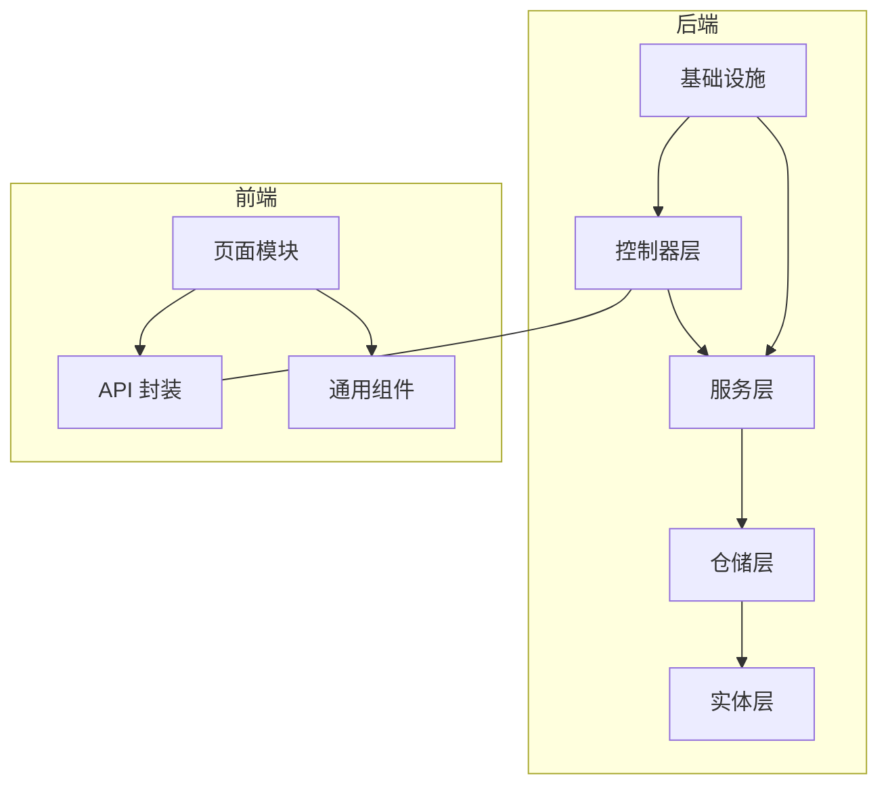
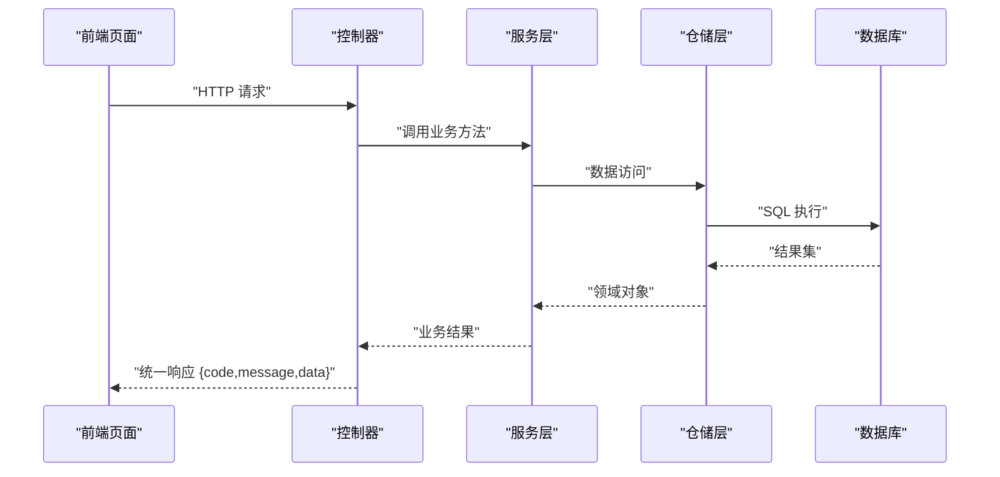
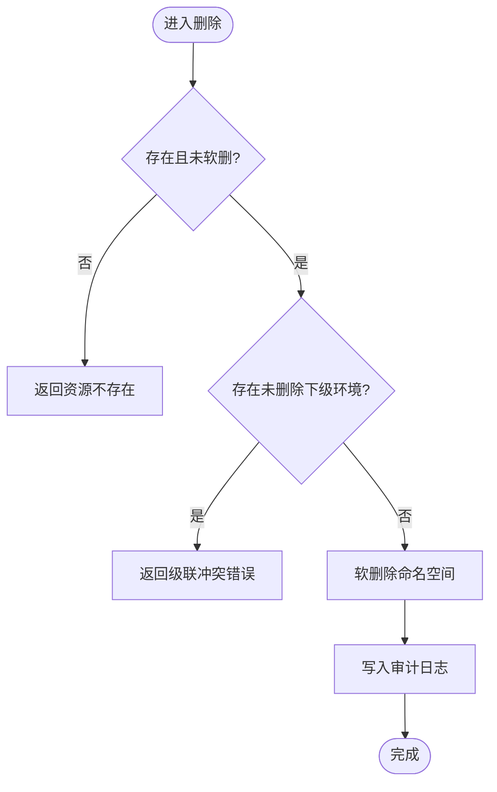
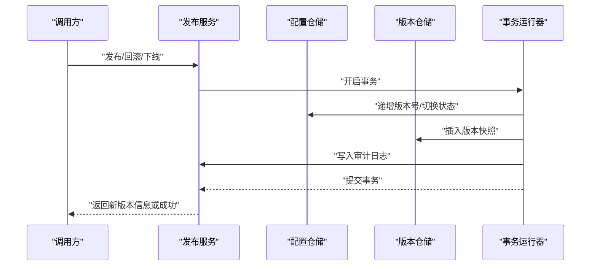
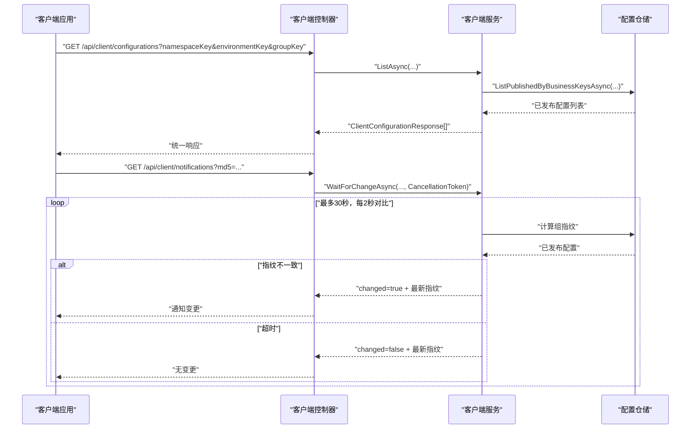
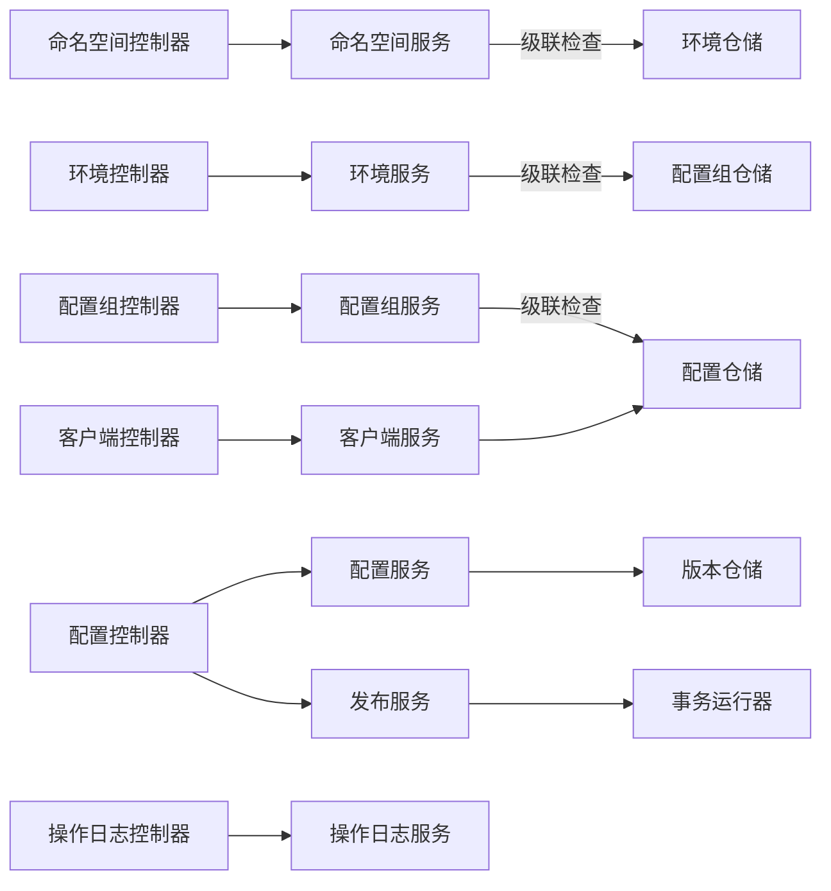

# 模块设计

<cite>
**本文引用的文件**
- [NamespaceController.cs](file://k_config_center/src/Controllers/NamespaceController.cs)
- [EnvironmentController.cs](file://k_config_center/src/Controllers/EnvironmentController.cs)
- [ConfigurationGroupController.cs](file://k_config_center/src/Controllers/ConfigurationGroupController.cs)
- [ConfigurationController.cs](file://k_config_center/src/Controllers/ConfigurationController.cs)
- [ClientConfigurationController.cs](file://k_config_center/src/Controllers/ClientConfigurationController.cs)
- [OperationLogController.cs](file://k_config_center/src/Controllers/OperationLogController.cs)
- [NamespaceService.cs](file://k_config_center/src/Services/NamespaceService.cs)
- [EnvironmentService.cs](file://k_config_center/src/Services/EnvironmentService.cs)
- [ConfigurationGroupService.cs](file://k_config_center/src/Services/ConfigurationGroupService.cs)
- [ConfigurationService.cs](file://k_config_center/src/Services/ConfigurationService.cs)
- [PublishService.cs](file://k_config_center/src/Services/PublishService.cs)
- [ClientConfigurationService.cs](file://k_config_center/src/Services/ClientConfigurationService.cs)
- [OperationLogService.cs](file://k_config_center/src/Services/OperationLogService.cs)
- [ConfigCenterNamespace.cs](file://k_config_center/src/Entities/ConfigCenterNamespace.cs)
- [ConfigCenterEnvironment.cs](file://k_config_center/src/Entities/ConfigCenterEnvironment.cs)
- [ConfigCenterConfigurationGroup.cs](file://k_config_center/src/Entities/ConfigCenterConfigurationGroup.cs)
- [ConfigCenterConfiguration.cs](file://k_config_center/src/Entities/ConfigCenterConfiguration.cs)
- [ConfigCenterConfigurationVersion.cs](file://k_config_center/src/Entities/ConfigCenterConfigurationVersion.cs)
- [ConfigCenterOperationLog.cs](file://k_config_center/src/Entities/ConfigCenterOperationLog.cs)
- [ApiResponse.cs](file://k_config_center/src/Infrastructure/ApiResponse.cs)
</cite>

## 目录
1. [简介](#简介)
2. [项目结构](#项目结构)
3. [核心组件](#核心组件)
4. [架构总览](#架构总览)
5. [详细组件分析](#详细组件分析)
6. [依赖关系分析](#依赖关系分析)
7. [性能考虑](#性能考虑)
8. [故障排查指南](#故障排查指南)
9. [结论](#结论)
10. [附录](#附录)

## 简介
本设计文档面向配置中心后端与前端，系统性说明各模块职责、模块间依赖与通信机制、扩展点与集成方式，并通过架构图与数据流图展示协同工作方式。后端采用控制器-服务-仓储-实体的分层架构，统一响应封装；前端按功能域组织页面与组件，提供配置管理、环境管理、操作审计等能力。

## 项目结构
后端采用清晰的层次划分：
- 控制器层：接收请求、参数校验、调用服务、包装统一响应。
- 服务层：承载业务逻辑，编排事务、跨模块只读校验、审计日志写入。
- 仓储层：数据访问抽象（由实体映射与查询实现）。
- 实体层：数据库表映射与字段约束。
- 基础设施：统一响应、异常、工具方法、数据库初始化等。

前端按功能域组织：
- 页面：命名空间、环境、配置组、配置项、版本历史、操作审计。
- 组件：表格、抽屉、预览、差异对比、状态标签等通用 UI。
- API 层：按资源划分的接口封装与类型定义。

图表来源
- [NamespaceController.cs:1-50](file://k_config_center/src/Controllers/NamespaceController.cs#L1-L50)
- [ConfigurationController.cs:1-115](file://k_config_center/src/Controllers/ConfigurationController.cs#L1-L115)
- [ApiResponse.cs:1-10](file://k_config_center/src/Infrastructure/ApiResponse.cs#L1-L10)

章节来源
- [NamespaceController.cs:1-50](file://k_config_center/src/Controllers/NamespaceController.cs#L1-L50)
- [ConfigurationController.cs:1-115](file://k_config_center/src/Controllers/ConfigurationController.cs#L1-L115)
- [ApiResponse.cs:1-10](file://k_config_center/src/Infrastructure/ApiResponse.cs#L1-L10)

## 核心组件
- 命名空间管理模块：负责命名空间的增删改查与软删除，级联检查依赖环境模块仓储。
- 环境管理模块：在命名空间下管理环境，支持排序与状态控制，删除前检查下级配置组。
- 配置组管理模块：在环境下分组管理配置，删除前检查下级配置项。
- 配置项管理模块：编辑草稿、详情、版本历史；发布/回滚/下线交由发布服务处理。
- 发布服务模块：事务型发布/回滚/下线，保证版本号、快照、生效指针与审计日志一致性。
- 客户端读取模块：按业务 key 拉取已发布配置，并提供长轮询变更探测。
- 操作审计模块：多维度检索操作日志，仅读不写。

章节来源
- [NamespaceService.cs:1-65](file://k_config_center/src/Services/NamespaceService.cs#L1-L65)
- [EnvironmentService.cs:1-67](file://k_config_center/src/Services/EnvironmentService.cs#L1-L67)
- [ConfigurationGroupService.cs:1-69](file://k_config_center/src/Services/ConfigurationGroupService.cs#L1-L69)
- [ConfigurationService.cs:1-110](file://k_config_center/src/Services/ConfigurationService.cs#L1-L110)
- [PublishService.cs:1-116](file://k_config_center/src/Services/PublishService.cs#L1-L116)
- [ClientConfigurationService.cs:1-56](file://k_config_center/src/Services/ClientConfigurationService.cs#L1-L56)
- [OperationLogService.cs:1-20](file://k_config_center/src/Services/OperationLogService.cs#L1-L20)

## 架构总览
后端通过控制器暴露 REST 接口，服务层编排业务逻辑并调用仓储访问数据库，实体层映射表结构。统一响应 ApiResponse 包裹所有返回结果。前端通过 API 封装调用后端接口，页面组件组织用户交互流程。

图表来源
- [ConfigurationController.cs:1-115](file://k_config_center/src/Controllers/ConfigurationController.cs#L1-L115)
- [ConfigurationService.cs:1-110](file://k_config_center/src/Services/ConfigurationService.cs#L1-L110)
- [ApiResponse.cs:1-10](file://k_config_center/src/Infrastructure/ApiResponse.cs#L1-L10)

## 详细组件分析

### 命名空间管理模块
- 职责：命名空间 CRUD、软删除、唯一性约束冲突处理、审计日志记录。
- 关键点：删除前检查是否存在未删除的环境；key 全局唯一；更新时 key 不可改。
- 依赖：环境模块仓储用于级联检查；操作日志仓储用于审计。

图表来源
- [NamespaceService.cs:49-63](file://k_config_center/src/Services/NamespaceService.cs#L49-L63)

章节来源
- [NamespaceController.cs:1-50](file://k_config_center/src/Controllers/NamespaceController.cs#L1-L50)
- [NamespaceService.cs:1-65](file://k_config_center/src/Services/NamespaceService.cs#L1-L65)
- [ConfigCenterNamespace.cs:1-39](file://k_config_center/src/Entities/ConfigCenterNamespace.cs#L1-L39)

### 环境管理模块
- 职责：在命名空间下管理环境，支持排序与状态控制，软删除与唯一性约束。
- 关键点：删除前检查是否存在未删除的配置组；key 在同命名空间内唯一。
- 依赖：配置组模块仓储用于级联检查；操作日志仓储用于审计。

章节来源
- [EnvironmentController.cs:1-52](file://k_config_center/src/Controllers/EnvironmentController.cs#L1-L52)
- [EnvironmentService.cs:1-67](file://k_config_center/src/Services/EnvironmentService.cs#L1-L67)
- [ConfigCenterEnvironment.cs:1-39](file://k_config_center/src/Entities/ConfigCenterEnvironment.cs#L1-L39)

### 配置组管理模块
- 职责：在环境下管理配置组，支持状态控制与软删除。
- 关键点：删除前检查是否存在未删除的配置项；key 在同环境内唯一。
- 依赖：配置模块仓储用于级联检查；操作日志仓储用于审计。

章节来源
- [ConfigurationGroupController.cs:1-53](file://k_config_center/src/Controllers/ConfigurationGroupController.cs#L1-L53)
- [ConfigurationGroupService.cs:1-69](file://k_config_center/src/Services/ConfigurationGroupService.cs#L1-L69)
- [ConfigCenterConfigurationGroup.cs:1-45](file://k_config_center/src/Entities/ConfigCenterConfigurationGroup.cs#L1-L45)

### 配置项管理模块
- 职责：编辑草稿、详情、版本历史；列表附带“有未发布变更”标记。
- 关键点：保存编辑不产生版本、不改状态；md5 服务端计算；列表一次性获取生效版本 md5 做内存比对。
- 依赖：版本仓储用于详情与历史；组仓储用于创建时冗余维度信息；操作日志仓储用于审计。

章节来源
- [ConfigurationController.cs:1-115](file://k_config_center/src/Controllers/ConfigurationController.cs#L1-L115)
- [ConfigurationService.cs:1-110](file://k_config_center/src/Services/ConfigurationService.cs#L1-L110)
- [ConfigCenterConfiguration.cs:1-66](file://k_config_center/src/Entities/ConfigCenterConfiguration.cs#L1-L66)
- [ConfigCenterConfigurationVersion.cs:1-39](file://k_config_center/src/Entities/ConfigCenterConfigurationVersion.cs#L1-L39)

### 发布服务模块
- 职责：发布、回滚、下线；事务型操作保证一致性与可追溯。
- 关键点：版本号原子递增；并发冲突通过唯一约束兜底；回滚生成新快照并保持线性版本；下线仅改变可见性。
- 依赖：配置与版本仓储；事务运行器；操作日志仓储。

图表来源
- [PublishService.cs:24-108](file://k_config_center/src/Services/PublishService.cs#L24-L108)

章节来源
- [PublishService.cs:1-116](file://k_config_center/src/Services/PublishService.cs#L1-L116)

### 客户端读取模块
- 职责：按业务 key 批量/单个拉取已发布配置；长轮询变更探测。
- 关键点：只读 PUBLISHED 且未软删；组指纹基于 key+md5 排序拼接后求 MD5；长轮询最长 30 秒，每 2 秒对比一次。
- 依赖：配置仓储进行五表联查。

图表来源
- [ClientConfigurationController.cs:1-47](file://k_config_center/src/Controllers/ClientConfigurationController.cs#L1-L47)
- [ClientConfigurationService.cs:1-56](file://k_config_center/src/Services/ClientConfigurationService.cs#L1-L56)

章节来源
- [ClientConfigurationController.cs:1-47](file://k_config_center/src/Controllers/ClientConfigurationController.cs#L1-L47)
- [ClientConfigurationService.cs:1-56](file://k_config_center/src/Services/ClientConfigurationService.cs#L1-L56)

### 操作审计模块
- 职责：多维度检索操作日志（命名空间/环境/组/配置/操作类型/操作人/时间区间），分页倒序。
- 关键点：日志只读，不提供删除；写入由各业务服务在相应事务或操作中调用仓储完成。

章节来源
- [OperationLogController.cs:1-31](file://k_config_center/src/Controllers/OperationLogController.cs#L1-L31)
- [OperationLogService.cs:1-20](file://k_config_center/src/Services/OperationLogService.cs#L1-L20)
- [ConfigCenterOperationLog.cs:1-41](file://k_config_center/src/Entities/ConfigCenterOperationLog.cs#L1-L41)

## 依赖关系分析
- 控制器到服务：每个控制器仅做参数接收与响应包装，业务逻辑下沉至服务。
- 服务到仓储：服务通过仓储访问数据，避免直接耦合数据库细节。
- 跨模块只读：删除前的级联检查通过注入对方仓储完成，降低耦合度。
- 事务边界：发布/回滚通过事务运行器统一编排，确保一致性。
- 审计日志：各服务在关键操作后写入审计日志，便于追踪。

图表来源
- [NamespaceService.cs:1-65](file://k_config_center/src/Services/NamespaceService.cs#L1-L65)
- [EnvironmentService.cs:1-67](file://k_config_center/src/Services/EnvironmentService.cs#L1-L67)
- [ConfigurationGroupService.cs:1-69](file://k_config_center/src/Services/ConfigurationGroupService.cs#L1-L69)
- [ConfigurationService.cs:1-110](file://k_config_center/src/Services/ConfigurationService.cs#L1-L110)
- [PublishService.cs:1-116](file://k_config_center/src/Services/PublishService.cs#L1-L116)
- [ClientConfigurationService.cs:1-56](file://k_config_center/src/Services/ClientConfigurationService.cs#L1-L56)

章节来源
- [NamespaceService.cs:1-65](file://k_config_center/src/Services/NamespaceService.cs#L1-L65)
- [EnvironmentService.cs:1-67](file://k_config_center/src/Services/EnvironmentService.cs#L1-L67)
- [ConfigurationGroupService.cs:1-69](file://k_config_center/src/Services/ConfigurationGroupService.cs#L1-L69)
- [ConfigurationService.cs:1-110](file://k_config_center/src/Services/ConfigurationService.cs#L1-L110)
- [PublishService.cs:1-116](file://k_config_center/src/Services/PublishService.cs#L1-L116)
- [ClientConfigurationService.cs:1-56](file://k_config_center/src/Services/ClientConfigurationService.cs#L1-L56)

## 性能考虑
- 列表优化：配置项列表一次性加载生效版本 md5，内存比对减少回查。
- 长轮询：客户端变更探测使用异步等待与取消令牌，避免阻塞线程池。
- 事务串行化：版本号递增在行锁上串行化，避免并发冲突导致的不一致。
- 软删除：全量查询通过全局过滤器过滤软删记录，减少业务侧条件判断。

[本节为通用指导，不直接分析具体文件]

## 故障排查指南
- 唯一键冲突：命名空间/环境/配置组/配置项创建时若 key 冲突，会返回对应业务错误码，需检查唯一索引与输入。
- 级联删除冲突：删除上级资源时若存在未删除的下级资源，将拒绝删除，需自底向上清理。
- 发布并发冲突：并发发布触发唯一约束冲突，返回并发冲突错误，建议重试。
- 资源不存在：更新/删除/回滚等操作若目标不存在或已软删，返回资源不存在错误。
- 审计缺失：确认各服务是否在关键操作后写入审计日志，必要时检查上下文访问器与操作人提取逻辑。

章节来源
- [NamespaceService.cs:26-63](file://k_config_center/src/Services/NamespaceService.cs#L26-L63)
- [EnvironmentService.cs:24-65](file://k_config_center/src/Services/EnvironmentService.cs#L24-L65)
- [ConfigurationGroupService.cs:25-67](file://k_config_center/src/Services/ConfigurationGroupService.cs#L25-L67)
- [ConfigurationService.cs:49-108](file://k_config_center/src/Services/ConfigurationService.cs#L49-L108)
- [PublishService.cs:24-108](file://k_config_center/src/Services/PublishService.cs#L24-L108)

## 结论
该配置中心模块设计以清晰的分层与职责划分为基础，通过服务层编排业务逻辑、仓储层隔离数据访问、实体层映射表结构，实现了高内聚低耦合的架构。发布服务的事务保障与客户端读取的长轮询机制确保了配置的可靠发布与高效同步。前端按功能域组织页面与组件，提供了完整的配置管理能力。整体设计具备良好的扩展性与可维护性，适合持续演进。

[本节为总结性内容，不直接分析具体文件]

## 附录
- 统一响应格式：所有接口返回统一结构 {code, message, data}，业务失败通过 code 表达。
- 实体字段：各实体包含主键、业务键、状态、软删除标记、审计字段等，满足配置中心的隔离、版本与审计需求。

章节来源
- [ApiResponse.cs:1-10](file://k_config_center/src/Infrastructure/ApiResponse.cs#L1-L10)
- [ConfigCenterNamespace.cs:1-39](file://k_config_center/src/Entities/ConfigCenterNamespace.cs#L1-L39)
- [ConfigCenterEnvironment.cs:1-39](file://k_config_center/src/Entities/ConfigCenterEnvironment.cs#L1-L39)
- [ConfigCenterConfigurationGroup.cs:1-45](file://k_config_center/src/Entities/ConfigCenterConfigurationGroup.cs#L1-L45)
- [ConfigCenterConfiguration.cs:1-66](file://k_config_center/src/Entities/ConfigCenterConfiguration.cs#L1-L66)
- [ConfigCenterConfigurationVersion.cs:1-39](file://k_config_center/src/Entities/ConfigCenterConfigurationVersion.cs#L1-L39)
- [ConfigCenterOperationLog.cs:1-41](file://k_config_center/src/Entities/ConfigCenterOperationLog.cs#L1-L41)