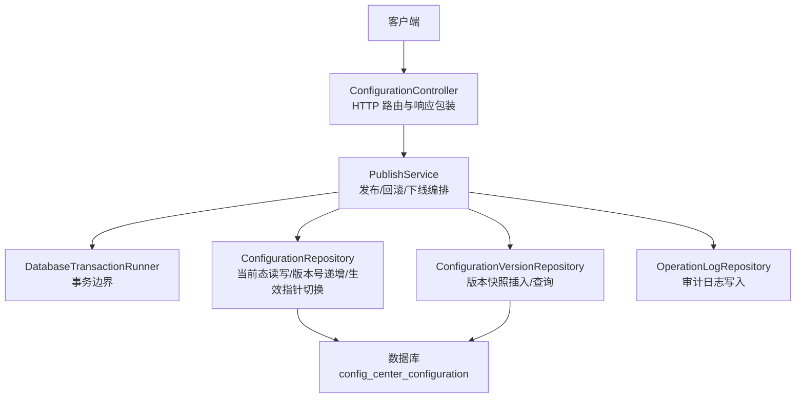
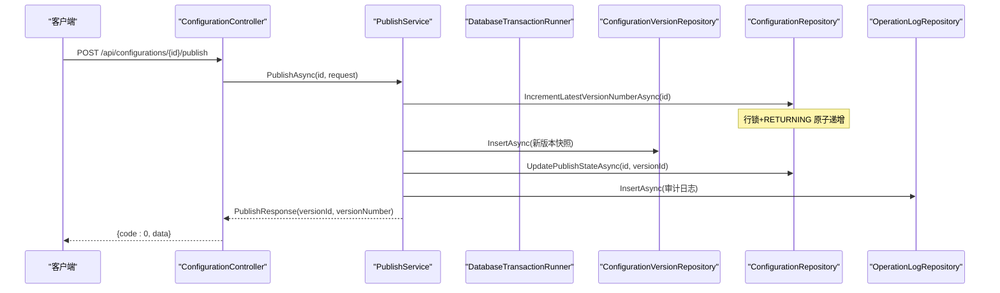
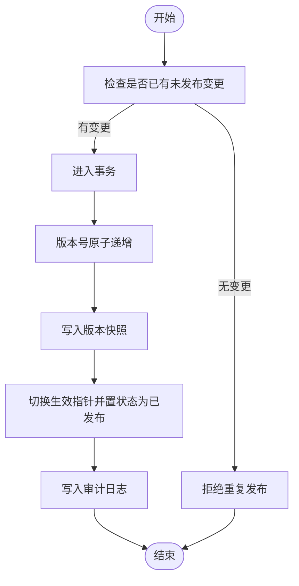
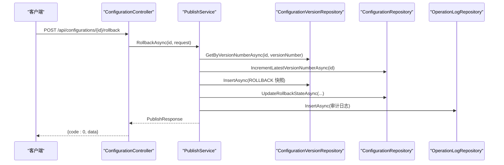
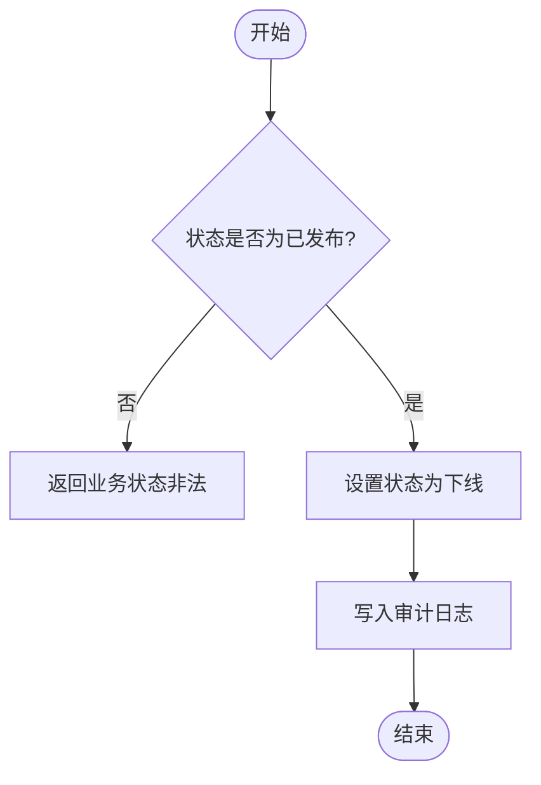
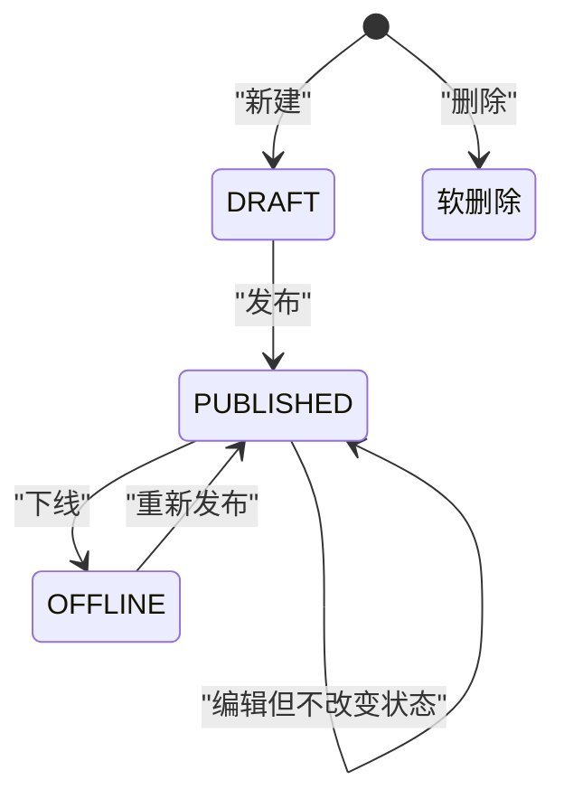
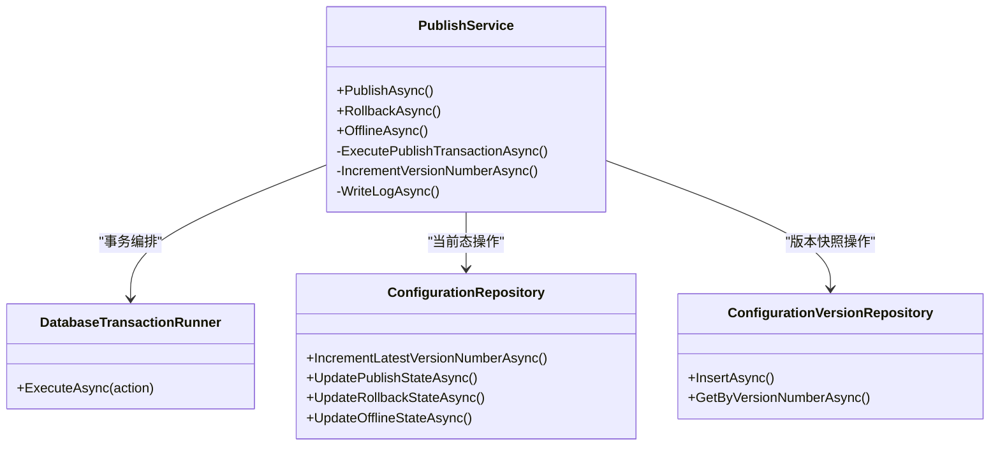
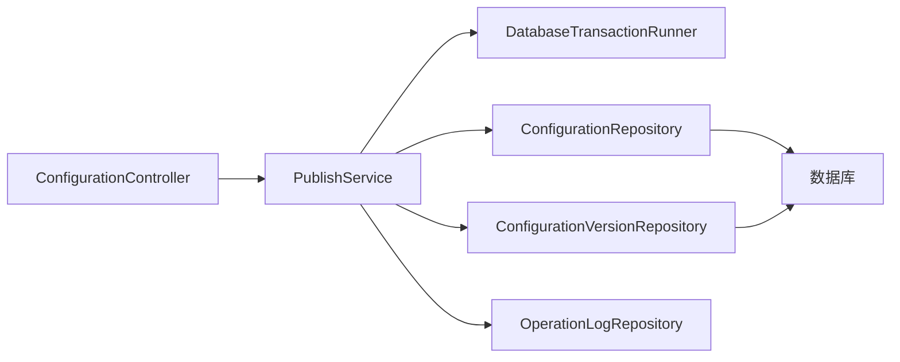

# 发布流程

<cite>
**本文引用的文件**
- [PublishService.cs](file://k_config_center/src/Services/PublishService.cs)
- [ConfigurationController.cs](file://k_config_center/src/Controllers/ConfigurationController.cs)
- [ConfigurationRepository.cs](file://k_config_center/src/Repositories/ConfigurationRepository.cs)
- [ConfigurationVersionRepository.cs](file://k_config_center/src/Repositories/ConfigurationVersionRepository.cs)
- [DatabaseTransactionRunner.cs](file://k_config_center/src/Repositories/DatabaseTransactionRunner.cs)
- [ConfigCenterConfiguration.cs](file://k_config_center/src/Entities/ConfigCenterConfiguration.cs)
- [ConfigCenterConfigurationVersion.cs](file://k_config_center/src/Entities/ConfigCenterConfigurationVersion.cs)
- [ConfigurationRequests.cs](file://k_config_center/src/Models/Requests/ConfigurationRequests.cs)
- [CommonResponses.cs](file://k_config_center/src/Models/Responses/CommonResponses.cs)
- [OperationHelper.cs](file://k_config_center/src/Infrastructure/OperationHelper.cs)
- [BusinessException.cs](file://k_config_center/src/Infrastructure/BusinessException.cs)
- [配置中心设计文档.md](file://docs/设计文档/配置中心设计文档.md)
</cite>

## 目录
1. [简介](#简介)
2. [项目结构](#项目结构)
3. [核心组件](#核心组件)
4. [架构总览](#架构总览)
5. [详细组件分析](#详细组件分析)
6. [依赖关系分析](#依赖关系分析)
7. [性能考虑](#性能考虑)
8. [故障排查指南](#故障排查指南)
9. [结论](#结论)
10. [附录：API 定义与调用示例](#附录api-定义与调用示例)

## 简介
本文件围绕配置中心的“发布流程”进行系统化说明，覆盖从草稿到发布的状态转换、事务与原子性保证、数据一致性校验、并发控制与锁机制、状态管理与审计日志、失败回滚与错误恢复策略，并给出完整的 API 接口定义与调用示例。目标是帮助读者快速理解并安全使用发布能力。

## 项目结构
发布流程涉及控制器、服务、仓储、实体与基础设施等层次：
- 控制器层：接收请求、参数校验、响应包装（如 /api/configurations/{id}/publish）。
- 服务层：编排业务逻辑与事务边界（PublishService）。
- 仓储层：封装数据库操作（ConfigurationRepository、ConfigurationVersionRepository），并通过 DatabaseTransactionRunner 统一事务执行。
- 实体层：当前态配置表与版本快照表。
- 基础设施：异常模型、工具方法（MD5、操作人/IP 提取、唯一冲突识别）。

图表来源
- [ConfigurationController.cs:65-94](file://k_config_center/src/Controllers/ConfigurationController.cs#L65-L94)
- [PublishService.cs:24-114](file://k_config_center/src/Services/PublishService.cs#L24-L114)
- [DatabaseTransactionRunner.cs:5-17](file://k_config_center/src/Repositories/DatabaseTransactionRunner.cs#L5-L17)
- [ConfigurationRepository.cs:75-103](file://k_config_center/src/Repositories/ConfigurationRepository.cs#L75-L103)
- [ConfigurationVersionRepository.cs:41-44](file://k_config_center/src/Repositories/ConfigurationVersionRepository.cs#L41-L44)

章节来源
- [ConfigurationController.cs:1-115](file://k_config_center/src/Controllers/ConfigurationController.cs#L1-L115)
- [PublishService.cs:1-116](file://k_config_center/src/Services/PublishService.cs#L1-L116)
- [DatabaseTransactionRunner.cs:1-19](file://k_config_center/src/Repositories/DatabaseTransactionRunner.cs#L1-L19)

## 核心组件
- PublishService：发布/回滚/下线的业务编排者，负责状态校验、版本号递增、快照写入、生效指针切换与审计日志记录，并以事务包裹关键路径。
- ConfigurationRepository：提供当前态配置的读取、更新、版本号原子递增、生效指针切换、下线等操作；同时提供客户端读取的已发布五表联查。
- ConfigurationVersionRepository：版本快照的只增不删访问，支持按 id、版本号查询与分页历史。
- DatabaseTransactionRunner：基于 SqlSugarScope 的事务入口，确保多仓储操作在同一事务中执行，失败整体回滚。
- OperationHelper：提供 MD5 计算、操作人/IP 提取、PostgreSQL 唯一约束冲突识别。
- 实体 ConfigCenterConfiguration / ConfigCenterConfigurationVersion：分别表示当前态与版本快照，承载状态机字段与发布指针。

章节来源
- [PublishService.cs:9-114](file://k_config_center/src/Services/PublishService.cs#L9-L114)
- [ConfigurationRepository.cs:7-124](file://k_config_center/src/Repositories/ConfigurationRepository.cs#L7-L124)
- [ConfigurationVersionRepository.cs:7-65](file://k_config_center/src/Repositories/ConfigurationVersionRepository.cs#L7-L65)
- [DatabaseTransactionRunner.cs:5-17](file://k_config_center/src/Repositories/DatabaseTransactionRunner.cs#L5-L17)
- [OperationHelper.cs:6-29](file://k_config_center/src/Infrastructure/OperationHelper.cs#L6-L29)
- [ConfigCenterConfiguration.cs:5-66](file://k_config_center/src/Entities/ConfigCenterConfiguration.cs#L5-L66)
- [ConfigCenterConfigurationVersion.cs:5-39](file://k_config_center/src/Entities/ConfigCenterConfigurationVersion.cs#L5-L39)

## 架构总览
发布流程的关键在于“事务内顺序执行 + 行级锁串行化 + 唯一约束兜底”，确保版本号、快照、生效指针与审计日志四者一致。

图表来源
- [ConfigurationController.cs:65-73](file://k_config_center/src/Controllers/ConfigurationController.cs#L65-L73)
- [PublishService.cs:24-54](file://k_config_center/src/Services/PublishService.cs#L24-L54)
- [ConfigurationRepository.cs:75-90](file://k_config_center/src/Repositories/ConfigurationRepository.cs#L75-L90)
- [ConfigurationVersionRepository.cs:41-44](file://k_config_center/src/Repositories/ConfigurationVersionRepository.cs#L41-L44)

## 详细组件分析

### 发布（PUBLISH）流程
- 前置校验：若配置已是 PUBLISHED 且内容与生效版本一致（无未发布变更），拒绝重复发布。
- 事务内步骤：
  1) 版本号原子递增（行锁串行化，避免先读后写竞态）。
  2) 写入不可变版本快照（change_type 为 CREATE 或 UPDATE）。
  3) 切换生效指针（published_version_id 指向新快照，status 置 PUBLISHED）。
  4) 写入审计日志（operation=PUBLISH）。
- 并发控制：通过数据库 UNIQUE(configuration_id, version_number) 作为最终兜底，冲突时转为“发布并发冲突”。

图表来源
- [PublishService.cs:24-54](file://k_config_center/src/Services/PublishService.cs#L24-L54)
- [ConfigurationRepository.cs:75-90](file://k_config_center/src/Repositories/ConfigurationRepository.cs#L75-L90)
- [ConfigurationVersionRepository.cs:41-44](file://k_config_center/src/Repositories/ConfigurationVersionRepository.cs#L41-L44)

章节来源
- [PublishService.cs:24-54](file://k_config_center/src/Services/PublishService.cs#L24-L54)
- [ConfigurationRepository.cs:75-90](file://k_config_center/src/Repositories/ConfigurationRepository.cs#L75-L90)
- [ConfigurationVersionRepository.cs:41-44](file://k_config_center/src/Repositories/ConfigurationVersionRepository.cs#L41-L44)

### 回滚（ROLLBACK）流程
- 目标定位：根据版本号查找历史版本快照，不存在则报错。
- 事务内步骤：
  1) 版本号原子递增。
  2) 以历史版本内容生成新快照（change_type=ROLLBACK，备注可自动生成“回滚自 vN”）。
  3) 同步当前态内容并切换生效指针（status 置 PUBLISHED）。
  4) 写入审计日志（operation=ROLLBACK）。
- 语义：不回退版本号，保持线性递增与可追溯。

图表来源
- [ConfigurationController.cs:75-83](file://k_config_center/src/Controllers/ConfigurationController.cs#L75-L83)
- [PublishService.cs:56-80](file://k_config_center/src/Services/PublishService.cs#L56-L80)
- [ConfigurationRepository.cs:92-97](file://k_config_center/src/Repositories/ConfigurationRepository.cs#L92-L97)
- [ConfigurationVersionRepository.cs:17-23](file://k_config_center/src/Repositories/ConfigurationVersionRepository.cs#L17-L23)

章节来源
- [PublishService.cs:56-80](file://k_config_center/src/Services/PublishService.cs#L56-L80)
- [ConfigurationRepository.cs:92-97](file://k_config_center/src/Repositories/ConfigurationRepository.cs#L92-L97)
- [ConfigurationVersionRepository.cs:17-23](file://k_config_center/src/Repositories/ConfigurationVersionRepository.cs#L17-L23)

### 下线（OFFLINE）流程
- 仅对 PUBLISHED 状态的配置允许下线，将 status 置 OFFLINE，客户端不再可见。
- 不产生版本记录，保留 published_version_id，之后可通过重新发布恢复上线。

图表来源
- [PublishService.cs:82-92](file://k_config_center/src/Services/PublishService.cs#L82-L92)
- [ConfigurationRepository.cs:99-103](file://k_config_center/src/Repositories/ConfigurationRepository.cs#L99-L103)

章节来源
- [PublishService.cs:82-92](file://k_config_center/src/Services/PublishService.cs#L82-L92)
- [ConfigurationRepository.cs:99-103](file://k_config_center/src/Repositories/ConfigurationRepository.cs#L99-L103)

### 状态机图

图表来源
- [配置中心设计文档.md:216-232](file://docs/设计文档/配置中心设计文档.md#L216-L232)

章节来源
- [配置中心设计文档.md:216-232](file://docs/设计文档/配置中心设计文档.md#L216-L232)

### 事务与原子性
- 事务边界：PublishService 通过 DatabaseTransactionRunner.ExecuteAsync 包裹发布/回滚的关键步骤。
- 原子性保证：任一子步骤失败，整体回滚，确保版本号、快照、生效指针、审计日志的一致性。
- 并发控制：
  - 行级锁：版本号递增使用数据库侧 UPDATE ... RETURNING，在行锁上串行化并发发布。
  - 唯一约束兜底：UNIQUE(configuration_id, version_number) 冲突被捕获并转换为“发布并发冲突”。

图表来源
- [PublishService.cs:9-114](file://k_config_center/src/Services/PublishService.cs#L9-L114)
- [DatabaseTransactionRunner.cs:5-17](file://k_config_center/src/Repositories/DatabaseTransactionRunner.cs#L5-L17)
- [ConfigurationRepository.cs:75-103](file://k_config_center/src/Repositories/ConfigurationRepository.cs#L75-L103)
- [ConfigurationVersionRepository.cs:17-44](file://k_config_center/src/Repositories/ConfigurationVersionRepository.cs#L17-L44)

章节来源
- [PublishService.cs:9-114](file://k_config_center/src/Services/PublishService.cs#L9-L114)
- [DatabaseTransactionRunner.cs:5-17](file://k_config_center/src/Repositories/DatabaseTransactionRunner.cs#L5-L17)
- [ConfigurationRepository.cs:75-103](file://k_config_center/src/Repositories/ConfigurationRepository.cs#L75-L103)
- [ConfigurationVersionRepository.cs:17-44](file://k_config_center/src/Repositories/ConfigurationVersionRepository.cs#L17-L44)

### 数据一致性校验
- 无未发布变更检测：当配置已发布且当前 md5 与生效版本 md5 一致时，拒绝重复发布。
- 版本存在性校验：回滚目标版本不存在时报错。
- 状态合法性校验：仅 PUBLISHED 状态可下线。
- 内容完整性：MD5 由服务端计算，不信任前端传值。

章节来源
- [PublishService.cs:24-37](file://k_config_center/src/Services/PublishService.cs#L24-L37)
- [PublishService.cs:56-63](file://k_config_center/src/Services/PublishService.cs#L56-L63)
- [PublishService.cs:82-90](file://k_config_center/src/Services/PublishService.cs#L82-L90)
- [OperationHelper.cs:10-12](file://k_config_center/src/Infrastructure/OperationHelper.cs#L10-L12)

### 并发控制与锁机制
- 行级锁：版本号递增使用数据库侧 UPDATE ... RETURNING，确保并发发布串行化。
- 唯一约束：UNIQUE(configuration_id, version_number) 作为最终兜底，冲突时转换为“发布并发冲突”。
- 事务隔离：SqlSugarScope 单例保证同一异步上下文内的 Repository 操作参与同一环境事务。

章节来源
- [ConfigurationRepository.cs:75-83](file://k_config_center/src/Repositories/ConfigurationRepository.cs#L75-L83)
- [PublishService.cs:94-108](file://k_config_center/src/Services/PublishService.cs#L94-L108)
- [DatabaseTransactionRunner.cs:5-17](file://k_config_center/src/Repositories/DatabaseTransactionRunner.cs#L5-L17)
- [OperationHelper.cs:22-29](file://k_config_center/src/Infrastructure/OperationHelper.cs#L22-L29)

### 发布状态管理
- 状态字段：DRAFT / PUBLISHED / OFFLINE。
- 生效指针：published_version_id 指向当前生效版本快照。
- 最新版本号：latest_version_number 用于版本号递增。
- 发布时间：published_at 记录最近一次发布时间。

章节来源
- [ConfigCenterConfiguration.cs:39-49](file://k_config_center/src/Entities/ConfigCenterConfiguration.cs#L39-L49)
- [配置中心设计文档.md:123-149](file://docs/设计文档/配置中心设计文档.md#L123-L149)

### 发布记录追踪与审计日志
- 版本快照：每次发布/回滚均写入不可变版本记录，包含 change_type、change_remark、created_by、created_at。
- 审计日志：在事务内写入 operation 类型（PUBLISH/ROLLBACK/OFFLINE）、详情 JSON、操作人、客户端 IP、关联维度 ID。

章节来源
- [ConfigCenterConfigurationVersion.cs:15-37](file://k_config_center/src/Entities/ConfigCenterConfigurationVersion.cs#L15-L37)
- [PublishService.cs:49-51](file://k_config_center/src/Services/PublishService.cs#L49-L51)
- [PublishService.cs:75-77](file://k_config_center/src/Services/PublishService.cs#L75-L77)
- [PublishService.cs:90-92](file://k_config_center/src/Services/PublishService.cs#L90-L92)

### 失败回滚与错误恢复
- 事务回滚：任一子步骤抛异常，整体回滚，保证数据一致性。
- 并发冲突：唯一约束冲突被捕获并转换为“发布并发冲突”，建议客户端重试。
- 业务异常：资源不存在、状态非法、目标版本不存在等直接抛出业务异常，由全局处理统一响应。

章节来源
- [DatabaseTransactionRunner.cs:11-17](file://k_config_center/src/Repositories/DatabaseTransactionRunner.cs#L11-L17)
- [PublishService.cs:100-108](file://k_config_center/src/Services/PublishService.cs#L100-L108)
- [BusinessException.cs:3-10](file://k_config_center/src/Infrastructure/BusinessException.cs#L3-L10)

## 依赖关系分析
- 控制器依赖服务：ConfigurationController 依赖 PublishService 与 ConfigurationService。
- 服务依赖仓储与事务：PublishService 依赖 ConfigurationRepository、ConfigurationVersionRepository、OperationLogRepository 与 DatabaseTransactionRunner。
- 仓储依赖 ORM：所有仓储依赖 ISqlSugarClient，通过 SqlSugarScope 实现事务共享。
- 实体与领域模型：仓储在内部映射实体与领域模型（ConfigurationData、ConfigurationVersionData）。

图表来源
- [ConfigurationController.cs:8-12](file://k_config_center/src/Controllers/ConfigurationController.cs#L8-L12)
- [PublishService.cs:14-19](file://k_config_center/src/Services/PublishService.cs#L14-L19)
- [DatabaseTransactionRunner.cs:5-17](file://k_config_center/src/Repositories/DatabaseTransactionRunner.cs#L5-L17)

章节来源
- [ConfigurationController.cs:8-12](file://k_config_center/src/Controllers/ConfigurationController.cs#L8-L12)
- [PublishService.cs:14-19](file://k_config_center/src/Services/PublishService.cs#L14-L19)
- [DatabaseTransactionRunner.cs:5-17](file://k_config_center/src/Repositories/DatabaseTransactionRunner.cs#L5-L17)

## 性能考虑
- 版本号递增采用数据库侧原子操作，减少应用层竞争与锁粒度。
- 版本快照不可变，便于缓存与一致性读取。
- 客户端读取路径通过冗余字段与索引优化，避免深层 JOIN。
- 审计日志与业务变更同事务，保证一致性但需关注写入压力。

[本节为通用指导，不直接分析具体文件]

## 故障排查指南
- 重复发布：若检测到无未发布变更，会拒绝重复发布，请检查当前内容与生效版本是否一致。
- 并发冲突：出现“发布并发冲突”时，建议客户端稍后重试。
- 目标版本不存在：回滚时若目标版本不存在，请确认版本号是否正确。
- 状态非法：非 PUBLISHED 状态无法下线，请先发布再下线。
- 事务失败：若事务内任意步骤失败，整体回滚，请查看日志与数据库约束冲突信息。

章节来源
- [PublishService.cs:24-37](file://k_config_center/src/Services/PublishService.cs#L24-L37)
- [PublishService.cs:94-108](file://k_config_center/src/Services/PublishService.cs#L94-L108)
- [PublishService.cs:56-63](file://k_config_center/src/Services/PublishService.cs#L56-L63)
- [PublishService.cs:82-90](file://k_config_center/src/Services/PublishService.cs#L82-L90)

## 结论
发布流程通过“事务 + 行锁 + 唯一约束”的组合，实现了高可靠、可追溯、可回滚的配置发布能力。状态机清晰、审计完整、并发安全，适合在生产环境中稳定运行。

[本节为总结，不直接分析具体文件]

## 附录：API 定义与调用示例

### 发布配置
- 端点：POST /api/configurations/{id}/publish
- 请求体：{ "changeRemark": "可选备注" }
- 成功响应：{ code: 0, data: { versionId, versionNumber } }
- 错误码：
  - 30002：无未发布变更
  - 30004：发布并发冲突（可重试）

章节来源
- [ConfigurationController.cs:65-73](file://k_config_center/src/Controllers/ConfigurationController.cs#L65-L73)
- [ConfigurationRequests.cs:19-21](file://k_config_center/src/Models/Requests/ConfigurationRequests.cs#L19-L21)
- [CommonResponses.cs:71-74](file://k_config_center/src/Models/Responses/CommonResponses.cs#L71-L74)

### 回滚配置
- 端点：POST /api/configurations/{id}/rollback
- 请求体：{ "versionNumber": 目标版本号, "changeRemark": "可选备注" }
- 成功响应：{ code: 0, data: { versionId, versionNumber } }
- 错误码：
  - 30003：目标回滚版本不存在

章节来源
- [ConfigurationController.cs:75-83](file://k_config_center/src/Controllers/ConfigurationController.cs#L75-L83)
- [ConfigurationRequests.cs:23-26](file://k_config_center/src/Models/Requests/ConfigurationRequests.cs#L23-L26)
- [CommonResponses.cs:71-74](file://k_config_center/src/Models/Responses/CommonResponses.cs#L71-L74)

### 下线配置
- 端点：POST /api/configurations/{id}/offline
- 成功响应：{ code: 0 }
- 错误码：
  - 10001：业务状态非法（非已发布状态）

章节来源
- [ConfigurationController.cs:85-94](file://k_config_center/src/Controllers/ConfigurationController.cs#L85-L94)
- [PublishService.cs:82-92](file://k_config_center/src/Services/PublishService.cs#L82-L92)

### 版本历史与快照
- 列表：GET /api/configurations/{id}/versions?pageIndex=1&pageSize=20
- 单个快照：GET /api/configurations/{id}/versions/{versionNumber}

章节来源
- [ConfigurationController.cs:96-113](file://k_config_center/src/Controllers/ConfigurationController.cs#L96-L113)
- [ConfigurationVersionRepository.cs:25-34](file://k_config_center/src/Repositories/ConfigurationVersionRepository.cs#L25-L34)

### 调用示例（概念性）
- 发布：向 /api/configurations/{id}/publish 发送 POST 请求，携带 changeRemark，成功后返回新版本的 versionId 与 versionNumber。
- 回滚：向 /api/configurations/{id}/rollback 发送 POST 请求，指定目标 versionNumber，成功后返回新的版本快照信息。
- 下线：向 /api/configurations/{id}/offline 发送 POST 请求，成功后该配置对客户端不可见。

[本节为概念性示例，不直接分析具体文件]