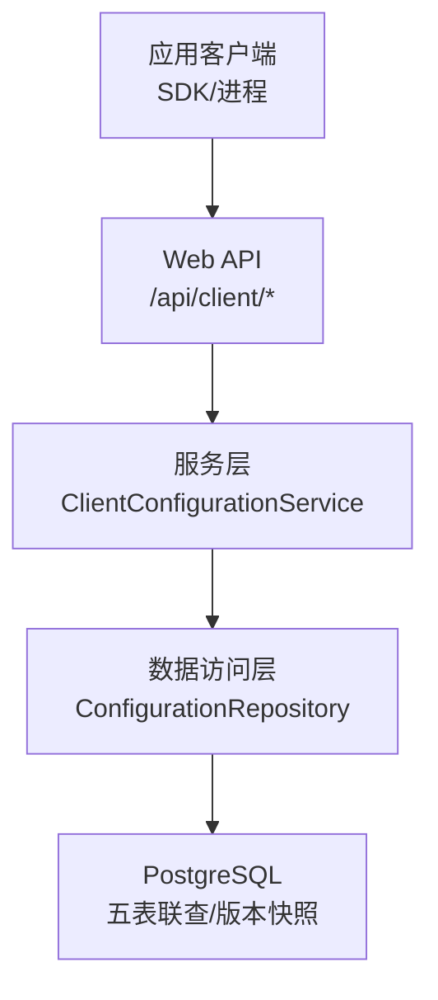
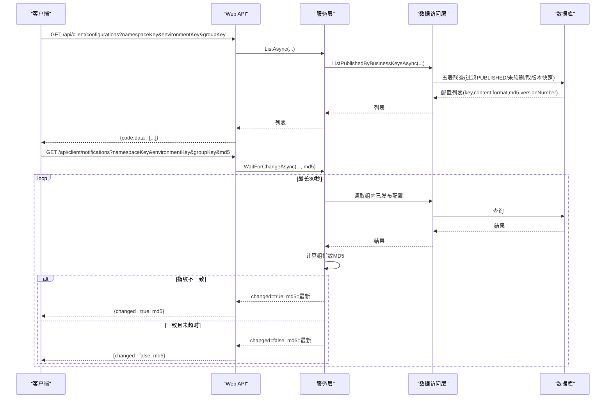
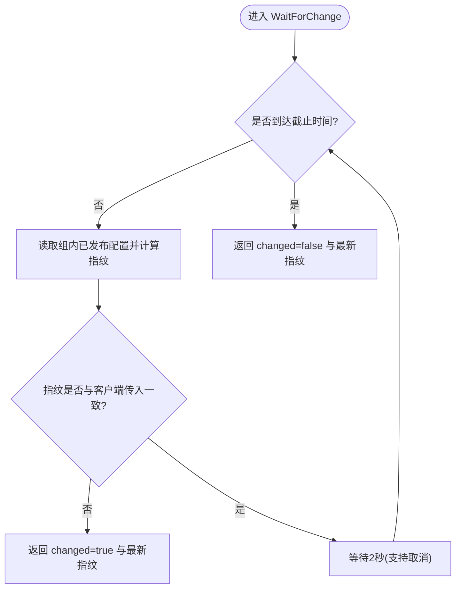
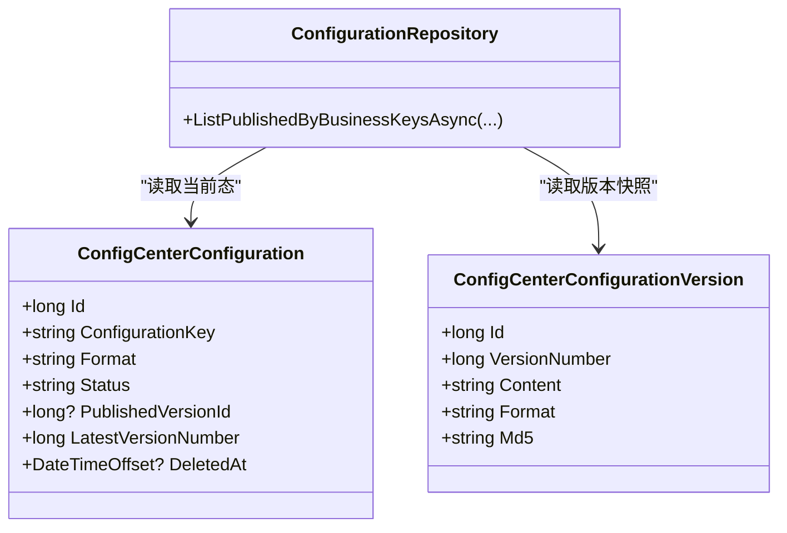
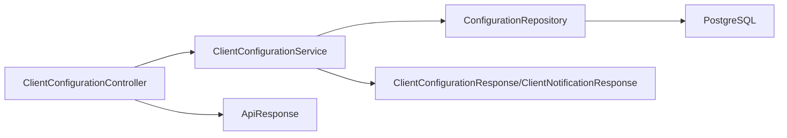
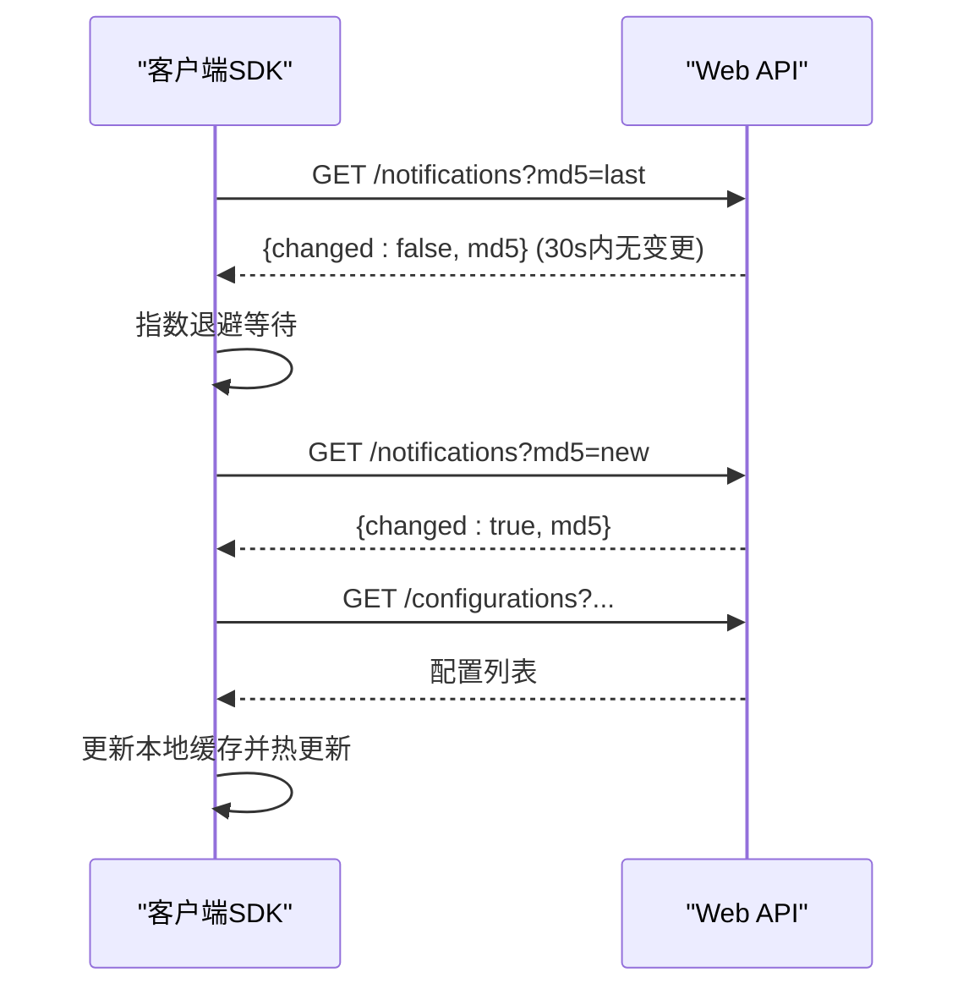

# 客户端集成

<cite>
**本文引用的文件**
- [ClientConfigurationController.cs](file://k_config_center/src/Controllers/ClientConfigurationController.cs)
- [ClientConfigurationService.cs](file://k_config_center/src/Services/ClientConfigurationService.cs)
- [ConfigurationRepository.cs](file://k_config_center/src/Repositories/ConfigurationRepository.cs)
- [ConfigCenterConfiguration.cs](file://k_config_center/src/Entities/ConfigCenterConfiguration.cs)
- [ConfigurationData.cs](file://k_config_center/src/Models/Domain/ConfigurationData.cs)
- [CommonResponses.cs](file://k_config_center/src/Models/Responses/CommonResponses.cs)
- [ApiResponse.cs](file://k_config_center/src/Infrastructure/ApiResponse.cs)
- [BusinessException.cs](file://k_config_center/src/Infrastructure/BusinessException.cs)
- [OperationHelper.cs](file://k_config_center/src/Infrastructure/OperationHelper.cs)
- [appsettings.json](file://k_config_center/appsettings.json)
- [http.ts](file://web/src/api/http.ts)
- [usePolling.ts](file://web/src/hooks/usePolling.ts)
- [configuration.ts](file://web/src/api/configuration.ts)
- [项目整体架构设计.md](file://docs/技术方案/项目整体架构设计.md)
- [配置中心设计文档.md](file://docs/设计文档/配置中心设计文档.md)
</cite>

## 目录
1. [简介](#简介)
2. [项目结构](#项目结构)
3. [核心组件](#核心组件)
4. [架构总览](#架构总览)
5. [详细组件分析](#详细组件分析)
6. [依赖关系分析](#依赖关系分析)
7. [性能考量](#性能考量)
8. [故障处理指南](#故障处理指南)
9. [结论](#结论)
10. [附录：多语言客户端集成模板与最佳实践](#附录多语言客户端集成模板与最佳实践)

## 简介
本章节面向“应用客户端”（非管理端 Portal）的集成，说明如何通过客户端接口读取已发布配置、使用长轮询探测变更、并在本地实现缓存与热更新。后端提供两类能力：
- 按业务键批量/单个拉取已发布配置（只读 PUBLISHED 快照）。
- 长轮询变更探测：携带组指纹 MD5，服务端周期性比对并返回 changed 标志与最新指纹。

该设计确保客户端仅感知业务 key（命名空间/环境/组/配置项），无需关心内部主键；同时通过版本快照与 MD5 保证一致性、可回滚与可观测。

**章节来源**
- [ClientConfigurationController.cs:7-45](file://k_config_center/src/Controllers/ClientConfigurationController.cs#L7-L45)
- [配置中心设计文档.md:10-65](file://docs/设计文档/配置中心设计文档.md#L10-L65)

## 项目结构
从客户端视角，系统由三层组成：
- 客户端 SDK/进程：负责发起 HTTP 请求、维护本地缓存、执行心跳/超时/重连策略、触发热更新。
- 配置中心 Web API：暴露 /api/client 下的读取与长轮询接口，封装服务层与数据访问层。
- 数据库：PostgreSQL，存储命名空间/环境/配置组/配置/版本快照/操作日志等实体。

**图表来源**
- [项目整体架构设计.md:20-47](file://docs/技术方案/项目整体架构设计.md#L20-L47)
- [ClientConfigurationController.cs:7-45](file://k_config_center/src/Controllers/ClientConfigurationController.cs#L7-L45)
- [ClientConfigurationService.cs:7-54](file://k_config_center/src/Services/ClientConfigurationService.cs#L7-L54)
- [ConfigurationRepository.cs:105-124](file://k_config_center/src/Repositories/ConfigurationRepository.cs#L105-L124)

**章节来源**
- [项目整体架构设计.md:20-47](file://docs/技术方案/项目整体架构设计.md#L20-L47)

## 核心组件
- 客户端接口控制器：定义批量拉取、单条拉取与长轮询三个端点，统一响应格式。
- 客户端服务：实现“按业务键查询已发布配置”和“组指纹计算 + 长轮询”。
- 数据访问仓库：实现五表联查，读取 published_version_id 指向的版本快照，过滤软删除。
- 响应模型：ClientConfigurationResponse（内容+MD5+版本号）、ClientNotificationResponse（changed+md5）。
- 工具与异常：统一响应包裹 ApiResponse、业务异常 BusinessException、MD5 计算 OperationHelper。

**章节来源**
- [ClientConfigurationController.cs:7-45](file://k_config_center/src/Controllers/ClientConfigurationController.cs#L7-L45)
- [ClientConfigurationService.cs:7-54](file://k_config_center/src/Services/ClientConfigurationService.cs#L7-L54)
- [ConfigurationRepository.cs:105-124](file://k_config_center/src/Repositories/ConfigurationRepository.cs#L105-L124)
- [CommonResponses.cs:10-21](file://k_config_center/src/Models/Responses/CommonResponses.cs#L10-L21)
- [ApiResponse.cs:1-10](file://k_config_center/src/Infrastructure/ApiResponse.cs#L1-L10)
- [BusinessException.cs:1-11](file://k_config_center/src/Infrastructure/BusinessException.cs#L1-L11)
- [OperationHelper.cs:1-30](file://k_config_center/src/Infrastructure/OperationHelper.cs#L1-L30)

## 架构总览
客户端集成的关键路径如下：
- 首次启动：调用批量拉取接口获取组内所有已发布配置，记录每个配置的 MD5，并计算组指纹 MD5。
- 运行期：定时或事件驱动调用长轮询接口，传入上次指纹；若 changed=true，则重新拉取并更新本地缓存。
- 数据一致性：读取的是 published_version_id 指向的版本快照，避免读到编辑中的草稿。

**图表来源**
- [ClientConfigurationController.cs:13-45](file://k_config_center/src/Controllers/ClientConfigurationController.cs#L13-L45)
- [ClientConfigurationService.cs:27-54](file://k_config_center/src/Services/ClientConfigurationService.cs#L27-L54)
- [ConfigurationRepository.cs:105-124](file://k_config_center/src/Repositories/ConfigurationRepository.cs#L105-L124)

## 详细组件分析

### 客户端接口与响应约定
- 批量拉取：GET /api/client/configurations，参数为 namespaceKey、environmentKey、groupKey；返回 data 为 ClientConfigurationResponse 数组。
- 单条拉取：GET /api/client/configurations/{configurationKey}，同上参数；不存在或未发布返回业务码 10002。
- 长轮询：GET /api/client/notifications，参数含可选 md5；返回 ClientNotificationResponse（changed、md5）。
- 统一响应：HTTP 始终 200，业务失败通过 code/message/data 表达。

**章节来源**
- [ClientConfigurationController.cs:13-45](file://k_config_center/src/Controllers/ClientConfigurationController.cs#L13-L45)
- [CommonResponses.cs:10-21](file://k_config_center/src/Models/Responses/CommonResponses.cs#L10-L21)
- [ApiResponse.cs:1-10](file://k_config_center/src/Infrastructure/ApiResponse.cs#L1-L10)

### 长轮询机制与组指纹
- 组指纹计算：将组内全部已发布配置按 key 排序后拼接 "key=md5"，再整体求 MD5；空组也有确定指纹，保证“最后一个配置被删除”也能触发变更。
- 轮询策略：每 2 秒对比一次，最长挂起 30 秒；客户端断开时通过取消令牌立即结束挂起。
- 增量语义：changed=true 表示组内任一配置有发布/回滚/下线/删除；客户端应重新拉取并替换本地缓存。

**图表来源**
- [ClientConfigurationService.cs:27-54](file://k_config_center/src/Services/ClientConfigurationService.cs#L27-L54)

**章节来源**
- [ClientConfigurationService.cs:27-54](file://k_config_center/src/Services/ClientConfigurationService.cs#L27-L54)

### 数据访问与版本快照
- 五表联查：按 namespaceKey/environmentKey/groupKey 定位组，过滤 status='PUBLISHED' 且未软删除，内容取自 published_version_id 指向的版本快照。
- 并发安全：发布流程在数据库侧原子递增版本号并切换生效指针，避免竞态。
- 可见性：客户端只能读到已发布且未软删除的配置，编辑中的草稿不可见。

**图表来源**
- [ConfigCenterConfiguration.cs:1-66](file://k_config_center/src/Entities/ConfigCenterConfiguration.cs#L1-L66)
- [ConfigurationRepository.cs:105-124](file://k_config_center/src/Repositories/ConfigurationRepository.cs#L105-L124)

**章节来源**
- [ConfigurationRepository.cs:105-124](file://k_config_center/src/Repositories/ConfigurationRepository.cs#L105-L124)
- [配置中心设计文档.md:181-200](file://docs/设计文档/配置中心设计文档.md#L181-L200)

### 错误与异常处理
- 业务异常：BusinessException 携带业务错误码，全局中间件将其转为统一响应 {code,message,data:null}。
- 资源不存在：单条拉取未找到或已发布状态不满足时返回 10002。
- 唯一冲突：数据库唯一约束冲突识别并转业务码。

**章节来源**
- [BusinessException.cs:1-11](file://k_config_center/src/Infrastructure/BusinessException.cs#L1-L11)
- [ClientConfigurationController.cs:23-32](file://k_config_center/src/Controllers/ClientConfigurationController.cs#L23-L32)
- [OperationHelper.cs:22-28](file://k_config_center/src/Infrastructure/OperationHelper.cs#L22-L28)

## 依赖关系分析
- 控制器依赖服务层，服务层依赖仓库层，仓库层直接操作数据库。
- 响应模型与工具类被多处复用，降低耦合。
- 前端示例展示了统一的 HTTP 拦截器与类型收窄，便于对接后端统一响应。

**图表来源**
- [ClientConfigurationController.cs:7-45](file://k_config_center/src/Controllers/ClientConfigurationController.cs#L7-L45)
- [ClientConfigurationService.cs:7-54](file://k_config_center/src/Services/ClientConfigurationService.cs#L7-L54)
- [ConfigurationRepository.cs:105-124](file://k_config_center/src/Repositories/ConfigurationRepository.cs#L105-L124)
- [CommonResponses.cs:10-21](file://k_config_center/src/Models/Responses/CommonResponses.cs#L10-L21)
- [ApiResponse.cs:1-10](file://k_config_center/src/Infrastructure/ApiResponse.cs#L1-L10)

**章节来源**
- [ClientConfigurationController.cs:7-45](file://k_config_center/src/Controllers/ClientConfigurationController.cs#L7-L45)
- [ClientConfigurationService.cs:7-54](file://k_config_center/src/Services/ClientConfigurationService.cs#L7-L54)
- [ConfigurationRepository.cs:105-124](file://k_config_center/src/Repositories/ConfigurationRepository.cs#L105-L124)

## 性能考量
- 读取路径优化：五表联查仅返回必要字段，内容来自版本快照，避免冗余 JOIN。
- 长轮询非阻塞：使用异步延迟与取消令牌，避免占用线程池线程。
- 指纹计算开销：组内已发布配置数量较大时，建议客户端缓存组指纹并按需刷新。
- 连接与超时：前端示例设置 30 秒超时，建议客户端对长轮询设置合理超时与重试退避。

[本节为通用性能建议，不直接分析具体文件]

## 故障处理指南
- 网络异常：前端拦截器统一捕获并提示；客户端 SDK 应实现指数退避重试。
- 业务错误：根据 code 判断，如 10002 表示资源不存在；客户端应降级到本地缓存或提示用户。
- 长轮询中断：服务端通过取消令牌快速退出挂起；客户端应检测断开并重试。
- 配置不一致：当 changed=true 但本地解析失败时，应清空对应配置并重新拉取。

**章节来源**
- [http.ts:24-40](file://web/src/api/http.ts#L24-L40)
- [ClientConfigurationController.cs:23-32](file://k_config_center/src/Controllers/ClientConfigurationController.cs#L23-L32)
- [ClientConfigurationService.cs:27-44](file://k_config_center/src/Services/ClientConfigurationService.cs#L27-L44)

## 结论
本方案通过“已发布快照 + 组指纹 MD5 + 长轮询”的组合，实现了高效、可靠、低开销的配置变更推送。客户端只需关注业务 key，即可实现本地缓存与热更新，满足高可用与一致性要求。

[本节为总结性内容，不直接分析具体文件]

## 附录：多语言客户端集成模板与最佳实践

### 客户端配置读取 API 设计
- 批量拉取：GET /api/client/configurations?namespaceKey={ns}&environmentKey={env}&groupKey={grp}
- 单条拉取：GET /api/client/configurations/{configurationKey}?namespaceKey={ns}&environmentKey={env}&groupKey={grp}
- 长轮询：GET /api/client/notifications?namespaceKey={ns}&environmentKey={env}&groupKey={grp}&md5={lastMd5}
- 响应体：{ code, message, data }，data 分别为配置列表或通知对象。

**章节来源**
- [ClientConfigurationController.cs:13-45](file://k_config_center/src/Controllers/ClientConfigurationController.cs#L13-L45)
- [CommonResponses.cs:10-21](file://k_config_center/src/Models/Responses/CommonResponses.cs#L10-L21)
- [ApiResponse.cs:1-10](file://k_config_center/src/Infrastructure/ApiResponse.cs#L1-L10)

### 长轮询工作原理（连接建立、心跳、超时、重连）
- 连接建立：客户端发起 GET /api/client/notifications，携带上次组指纹 md5。
- 心跳检测：服务端每 2 秒对比指纹；客户端可在上层实现轻量心跳（如每 N 次轮询发送保活请求）。
- 超时处理：服务端最长挂起 30 秒；客户端应设置超时并触发重试。
- 重连策略：指数退避 + 抖动；连续失败达到阈值后降频或告警。

**图表来源**
- [ClientConfigurationController.cs:34-45](file://k_config_center/src/Controllers/ClientConfigurationController.cs#L34-L45)
- [ClientConfigurationService.cs:27-44](file://k_config_center/src/Services/ClientConfigurationService.cs#L27-L44)

### 配置变更探测（MD5 比对、增量更新、全量同步）
- MD5 比对：客户端维护组指纹 MD5；服务端每次轮询返回最新指纹。
- 增量更新：changed=true 时仅拉取受影响组的配置，合并到本地缓存。
- 全量同步：启动时或指纹丢失时执行全量拉取，重建本地缓存与指纹。

**章节来源**
- [ClientConfigurationService.cs:27-54](file://k_config_center/src/Services/ClientConfigurationService.cs#L27-L54)
- [ConfigurationRepository.cs:105-124](file://k_config_center/src/Repositories/ConfigurationRepository.cs#L105-L124)

### 客户端 SDK 设计模式与最佳实践
- 配置缓存：内存中维护 namespace/environment/group -> 配置映射；支持按 key 快速查找。
- 本地持久化：将配置与指纹落盘，重启后恢复；写入前校验 MD5 避免脏数据。
- 热更新机制：收到 changed=true 后，先拉取新配置，再原子替换缓存，保证读路径一致性。
- 容错与降级：网络异常时使用旧缓存；多次失败后降级为短轮询或告警。

**章节来源**
- [http.ts:11-40](file://web/src/api/http.ts#L11-L40)
- [usePolling.ts:1-24](file://web/src/hooks/usePolling.ts#L1-L24)

### 安全通信、认证授权与权限控制
- 认证：阶段一可通过 X-Operator 头标识操作人；生产环境建议接入 Token/证书双向认证。
- 传输安全：建议使用 HTTPS 加密通道。
- 权限控制：按 namespace/environment/group 维度进行鉴权，限制客户端仅能访问其所属范围。
- 审计：写操作记录操作人与 IP；读操作可记录访问来源用于审计。

**章节来源**
- [OperationHelper.cs:14-20](file://k_config_center/src/Infrastructure/OperationHelper.cs#L14-L20)
- [http.ts:16-22](file://web/src/api/http.ts#L16-L22)

### 多语言客户端集成示例与代码模板
- Java/Go/Node.js/Python 等语言均可基于 HTTP 库实现上述 API 调用；核心逻辑包括：
  - 首次全量拉取并构建本地缓存。
  - 启动长轮询循环，携带上次指纹。
  - 收到 changed=true 后增量拉取并热更新。
  - 实现超时、重试、退避与降级策略。
- 参考前端示例：统一拦截器解包 {code,message,data}，类型收窄后直接使用 data。

**章节来源**
- [http.ts:11-55](file://web/src/api/http.ts#L11-L55)
- [configuration.ts:15-59](file://web/src/api/configuration.ts#L15-L59)

### 客户端架构图、通信时序图与故障处理流程图
- 架构图：见“架构总览”图示。
- 通信时序图：见“长轮询工作原理”时序图。
- 故障处理流程图：网络异常、业务错误、长轮询中断、配置不一致的处理流程见“故障处理指南”。

[本节为概念性图示与流程说明，已在各小节给出对应图表来源]