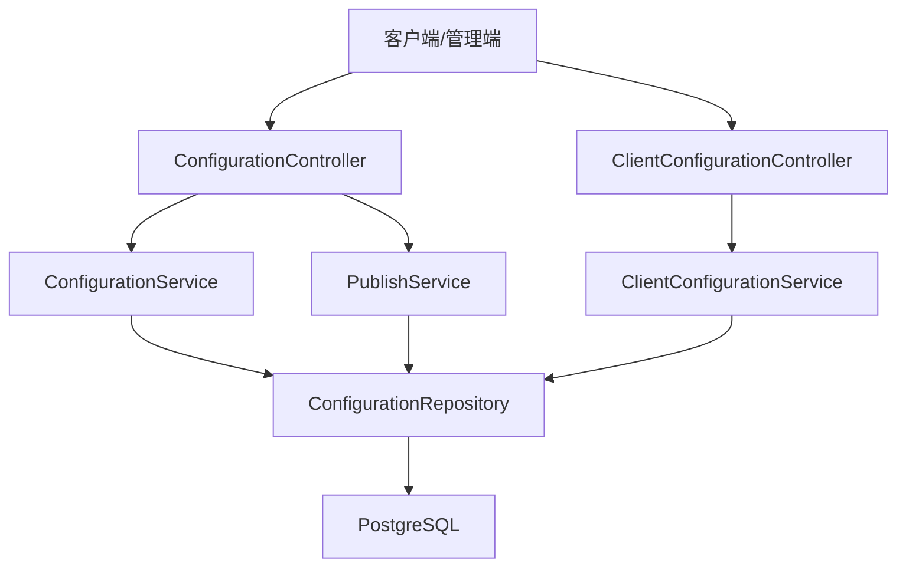
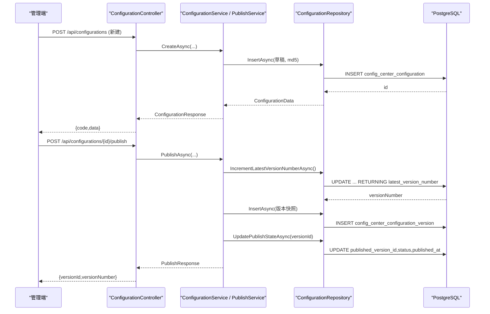
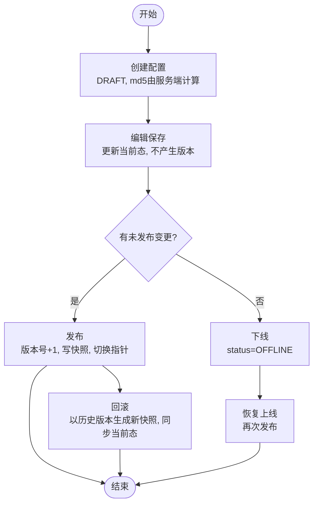
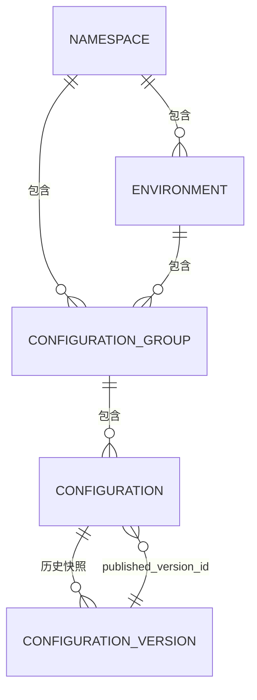
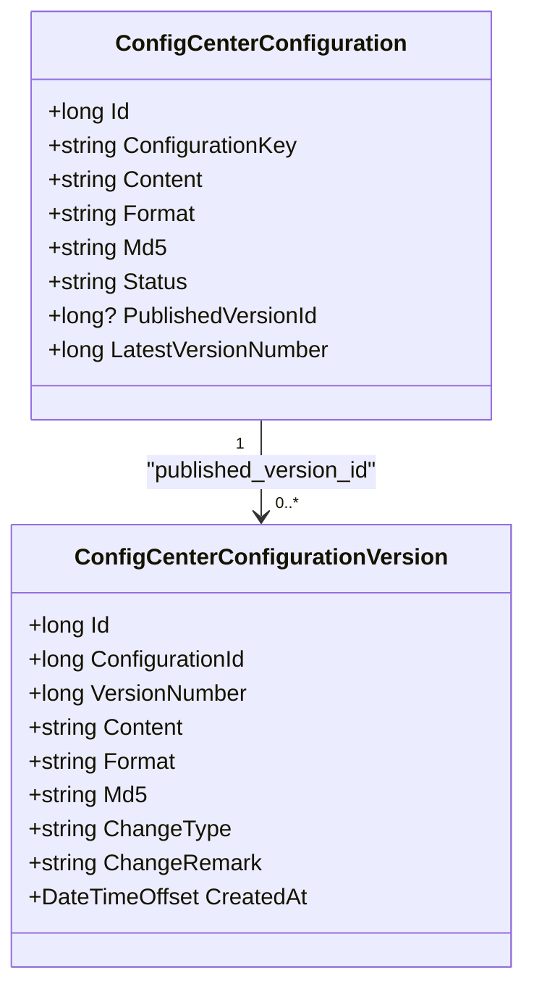
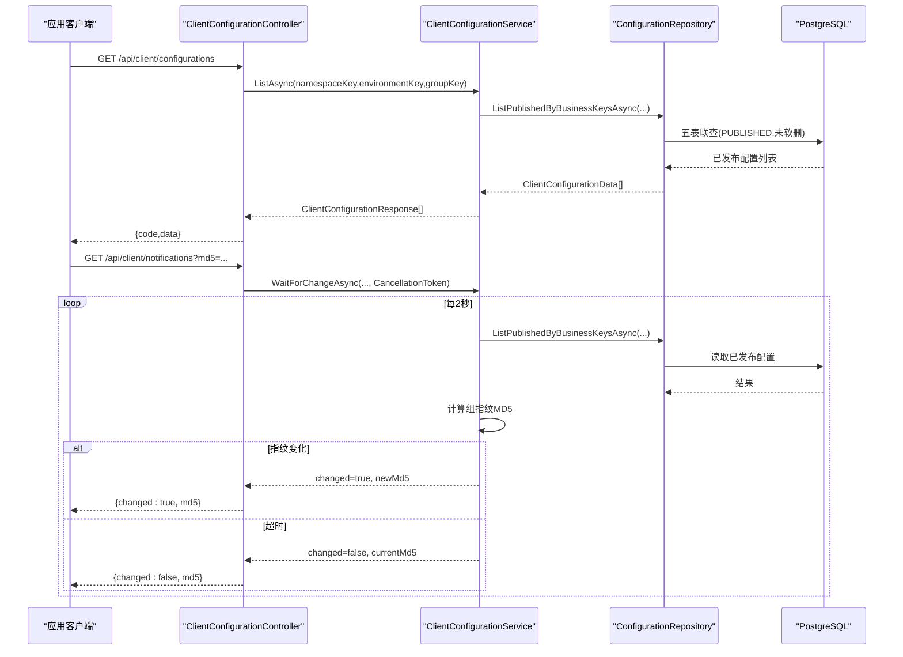
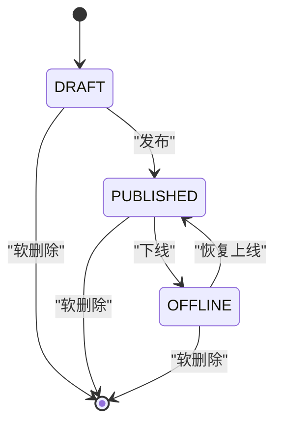
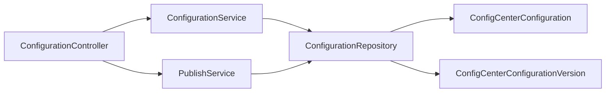

# 核心功能详解

<cite>
**本文引用的文件**
- [ConfigurationController.cs](file://k_config_center/src/Controllers/ConfigurationController.cs)
- [ClientConfigurationController.cs](file://k_config_center/src/Controllers/ClientConfigurationController.cs)
- [ConfigurationService.cs](file://k_config_center/src/Services/ConfigurationService.cs)
- [PublishService.cs](file://k_config_center/src/Services/PublishService.cs)
- [ClientConfigurationService.cs](file://k_config_center/src/Services/ClientConfigurationService.cs)
- [ConfigurationRepository.cs](file://k_config_center/src/Repositories/ConfigurationRepository.cs)
- [ConfigCenterConfiguration.cs](file://k_config_center/src/Entities/ConfigCenterConfiguration.cs)
- [ConfigCenterConfigurationVersion.cs](file://k_config_center/src/Entities/ConfigCenterConfigurationVersion.cs)
- [ConfigurationData.cs](file://k_config_center/src/Models/Domain/ConfigurationData.cs)
- [ConfigurationRequests.cs](file://k_config_center/src/Models/Requests/ConfigurationRequests.cs)
- [ConfigurationResponses.cs](file://k_config_center/src/Models/Responses/ConfigurationResponses.cs)
- [BusinessException.cs](file://k_config_center/src/Infrastructure/BusinessException.cs)
- [配置中心设计文档.md](file://docs/设计文档/配置中心设计文档.md)
- [后端方案.md](file://docs/技术方案/后端方案.md)
</cite>

## 目录
1. [引言](#引言)
2. [项目结构](#项目结构)
3. [核心组件](#核心组件)
4. [架构总览](#架构总览)
5. [详细组件分析](#详细组件分析)
6. [依赖关系分析](#依赖关系分析)
7. [性能考量](#性能考量)
8. [故障排查指南](#故障排查指南)
9. [结论](#结论)
10. [附录](#附录)

## 引言
本文件聚焦配置中心的“配置管理”核心能力，围绕配置的创建、编辑、版本控制、发布、回滚与下线等完整生命周期展开；解释命名空间、环境、配置组的多级组织架构；说明版本快照机制与差异对比支撑；并详述客户端读取的长轮询变更探测实现。通过流程图与状态转换图帮助理解复杂业务逻辑。

## 项目结构
后端采用分层架构：控制器负责参数绑定与响应包装；服务层承载业务规则（编辑、发布、回滚、下线、客户端读取）；仓储层封装数据库访问与事务编排；实体与领域模型隔离，避免数据库结构泄露到上层。

图表来源
- [ConfigurationController.cs:1-115](file://k_config_center/src/Controllers/ConfigurationController.cs#L1-L115)
- [ClientConfigurationController.cs:1-47](file://k_config_center/src/Controllers/ClientConfigurationController.cs#L1-L47)
- [ConfigurationService.cs:1-110](file://k_config_center/src/Services/ConfigurationService.cs#L1-L110)
- [PublishService.cs:1-116](file://k_config_center/src/Services/PublishService.cs#L1-L116)
- [ClientConfigurationService.cs:1-56](file://k_config_center/src/Services/ClientConfigurationService.cs#L1-L56)
- [ConfigurationRepository.cs:1-155](file://k_config_center/src/Repositories/ConfigurationRepository.cs#L1-L155)

章节来源
- [后端方案.md:27-84](file://docs/技术方案/后端方案.md#L27-L84)
- [后端方案.md:86-120](file://docs/技术方案/后端方案.md#L86-L120)

## 核心组件
- 配置项管理（编辑/详情/版本历史）：由 ConfigurationService 承担，专注当前态编辑与版本查询，不处理发布/回滚等事务型操作。
- 发布与回滚：由 PublishService 承担，封装版本号原子递增、不可变快照写入、生效指针切换与审计日志写入的事务流程。
- 客户端读取与变更探测：由 ClientConfigurationService 承担，提供按业务 key 批量/单个拉取已发布配置，以及基于组指纹的长轮询变更探测。
- 数据访问：ConfigurationRepository 统一封装当前态读写、客户端五表联查、版本号原子自增与生效指针切换。

章节来源
- [ConfigurationService.cs:9-12](file://k_config_center/src/Services/ConfigurationService.cs#L9-L12)
- [PublishService.cs:9-13](file://k_config_center/src/Services/PublishService.cs#L9-L13)
- [ClientConfigurationService.cs:7-8](file://k_config_center/src/Services/ClientConfigurationService.cs#L7-L8)
- [ConfigurationRepository.cs:7-8](file://k_config_center/src/Repositories/ConfigurationRepository.cs#L7-L8)

## 架构总览
配置中心以“当前态 + 版本快照”双轨存储为核心：当前态用于编辑与展示，版本表用于不可变的历史快照。发布/回滚在事务内完成“版本号+1 → 写快照 → 切换生效指针 → 写日志”的原子序列，保证一致性。

图表来源
- [ConfigurationController.cs:34-73](file://k_config_center/src/Controllers/ConfigurationController.cs#L34-L73)
- [ConfigurationService.cs:46-64](file://k_config_center/src/Services/ConfigurationService.cs#L46-L64)
- [PublishService.cs:24-54](file://k_config_center/src/Services/PublishService.cs#L24-L54)
- [ConfigurationRepository.cs:75-90](file://k_config_center/src/Repositories/ConfigurationRepository.cs#L75-L90)

## 详细组件分析

### 配置生命周期：创建、编辑、版本控制、发布、回滚、下线
- 创建：新建配置为 DRAFT，latest_version_number=0，服务端计算 md5，组内 key 唯一性由数据库部分唯一索引兜底。
- 编辑：仅更新当前态 content/format/md5/description/tags，不产生版本、不改变 status；“有未发布变更”由服务端比较当前 md5 与生效版本 md5 得出。
- 发布：事务内执行版本号原子递增、写不可变版本快照、切换生效指针、写审计日志；若已是 PUBLISHED 且内容与生效版本一致则拒绝重复发布。
- 回滚：不回退版本号，而是以目标历史版本内容生成新版本（change_type=ROLLBACK），同步当前态内容并切换生效指针。
- 下线：将状态置 OFFLINE，客户端不再可见；保留版本与生效指针，可重新发布恢复上线。

图表来源
- [ConfigurationService.cs:23-32](file://k_config_center/src/Services/ConfigurationService.cs#L23-L32)
- [ConfigurationService.cs:46-87](file://k_config_center/src/Services/ConfigurationService.cs#L46-L87)
- [PublishService.cs:24-92](file://k_config_center/src/Services/PublishService.cs#L24-L92)
- [ConfigurationRepository.cs:75-103](file://k_config_center/src/Repositories/ConfigurationRepository.cs#L75-L103)

章节来源
- [ConfigurationService.cs:23-102](file://k_config_center/src/Services/ConfigurationService.cs#L23-L102)
- [PublishService.cs:24-115](file://k_config_center/src/Services/PublishService.cs#L24-L115)
- [配置中心设计文档.md:181-232](file://docs/设计文档/配置中心设计文档.md#L181-L232)

### 多级组织架构：命名空间、环境、配置组
- 层级模型：namespace → environment → configuration_group → configuration → configuration_version。
- 冗余字段：配置表冗余 namespace_id/environment_id，优化客户端高频按维度读取的性能。
- 唯一约束：各层级通过部分唯一索引（WHERE deleted_at IS NULL）保障业务 key 的唯一性与软删除后可重建。

图表来源
- [配置中心设计文档.md:10-20](file://docs/设计文档/配置中心设计文档.md#L10-L20)
- [配置中心设计文档.md:37-64](file://docs/设计文档/配置中心设计文档.md#L37-L64)
- [ConfigurationRepository.cs:105-124](file://k_config_center/src/Repositories/ConfigurationRepository.cs#L105-L124)

章节来源
- [配置中心设计文档.md:10-64](file://docs/设计文档/配置中心设计文档.md#L10-L64)
- [后端方案.md:552-579](file://docs/技术方案/后端方案.md#L552-L579)

### 版本快照机制与差异对比
- 版本快照：每次发布或回滚都会写入不可变的 configuration_version 记录，change_type 区分 CREATE/UPDATE/ROLLBACK。
- 差异对比：前端可通过获取两个版本的快照内容进行 Diff；服务端提供按 id 与 versionNumber 的版本快照接口。
- 未发布变更判定：当前 md5 与生效版本 md5 不一致即为“有未发布变更”。

图表来源
- [ConfigCenterConfiguration.cs:1-66](file://k_config_center/src/Entities/ConfigCenterConfiguration.cs#L1-L66)
- [ConfigCenterConfigurationVersion.cs:1-39](file://k_config_center/src/Entities/ConfigCenterConfigurationVersion.cs#L1-L39)
- [ConfigurationResponses.cs:47-69](file://k_config_center/src/Models/Responses/ConfigurationResponses.cs#L47-L69)

章节来源
- [ConfigurationService.cs:89-102](file://k_config_center/src/Services/ConfigurationService.cs#L89-L102)
- [ConfigurationController.cs:96-113](file://k_config_center/src/Controllers/ConfigurationController.cs#L96-L113)
- [配置中心设计文档.md:150-165](file://docs/设计文档/配置中心设计文档.md#L150-L165)

### 客户端读取与长轮询变更探测
- 读取路径：按 namespaceKey/environmentKey/groupKey 定位组，只返回 status='PUBLISHED' 且未软删的配置，内容取自 published_version_id 指向的版本快照。
- 长轮询：客户端携带本地组指纹 md5 发起 GET /api/client/notifications；服务端周期性重算组指纹，不一致立即返回 changed=true，一致则挂起最长 30 秒后返回 changed=false。
- 组指纹：组内全部已发布配置按 key 排序拼接 "key=md5" 后整体求 MD5；空组也有确定指纹，确保最后一个配置被删除也能触发通知。

图表来源
- [ClientConfigurationController.cs:13-45](file://k_config_center/src/Controllers/ClientConfigurationController.cs#L13-L45)
- [ClientConfigurationService.cs:11-54](file://k_config_center/src/Services/ClientConfigurationService.cs#L11-L54)
- [ConfigurationRepository.cs:105-124](file://k_config_center/src/Repositories/ConfigurationRepository.cs#L105-L124)

章节来源
- [ClientConfigurationService.cs:11-54](file://k_config_center/src/Services/ClientConfigurationService.cs#L11-L54)
- [后端方案.md:581-595](file://docs/技术方案/后端方案.md#L581-L595)

### 状态机与并发安全
- 状态机：DRAFT → PUBLISHED（发布）、PUBLISHED → OFFLINE（下线）、OFFLINE → PUBLISHED（恢复上线）；任意状态均可软删除。
- 并发安全：版本号原子递增使用数据库侧 UPDATE ... RETURNING，行锁串行化；唯一约束 UNIQUE(configuration_id, version_number) 作为兜底，冲突时转为业务错误码提示重试。

图表来源
- [配置中心设计文档.md:216-232](file://docs/设计文档/配置中心设计文档.md#L216-L232)
- [PublishService.cs:94-108](file://k_config_center/src/Services/PublishService.cs#L94-L108)
- [ConfigurationRepository.cs:75-83](file://k_config_center/src/Repositories/ConfigurationRepository.cs#L75-L83)

章节来源
- [配置中心设计文档.md:216-232](file://docs/设计文档/配置中心设计文档.md#L216-L232)
- [后端方案.md:660-675](file://docs/技术方案/后端方案.md#L660-L675)

## 依赖关系分析
- Controller 依赖 Service：ConfigurationController 同时依赖 ConfigurationService（编辑/版本）与 PublishService（发布/回滚/下线）。
- Service 依赖 Repository：所有业务逻辑通过 Repository 访问数据库，避免直接操作 ORM 实例。
- Repository 依赖 Entities：仅仓储层接触 SqlSugar 实体与连接，对外暴露 Domain 模型。

图表来源
- [ConfigurationController.cs:1-115](file://k_config_center/src/Controllers/ConfigurationController.cs#L1-L115)
- [ConfigurationService.cs:1-110](file://k_config_center/src/Services/ConfigurationService.cs#L1-L110)
- [PublishService.cs:1-116](file://k_config_center/src/Services/PublishService.cs#L1-L116)
- [ConfigurationRepository.cs:1-155](file://k_config_center/src/Repositories/ConfigurationRepository.cs#L1-L155)

章节来源
- [后端方案.md:86-120](file://docs/技术方案/后端方案.md#L86-L120)

## 性能考量
- 冗余字段优化：配置表冗余 namespace_id/environment_id，客户端高频读取避免多表 JOIN。
- 索引策略：部分唯一索引保障 key 唯一与软删除后可重建；查询索引覆盖常见过滤条件。
- 长轮询非阻塞：使用 CancellationToken 与 Task.Delay 实现挂起，避免线程池占用。
- 组指纹计算：按 key 排序拼接后整体求 MD5，空组也有确定指纹，保证变更检测准确性。

章节来源
- [配置中心设计文档.md:238-250](file://docs/设计文档/配置中心设计文档.md#L238-L250)
- [ClientConfigurationService.cs:27-54](file://k_config_center/src/Services/ClientConfigurationService.cs#L27-L54)
- [ConfigurationRepository.cs:105-124](file://k_config_center/src/Repositories/ConfigurationRepository.cs#L105-L124)

## 故障排查指南
- 资源不存在：当配置、版本或已发布配置不存在时，统一返回业务错误码 10002。
- 无未发布变更：对已是 PUBLISHED 且内容与生效版本一致的情况，拒绝重复发布，返回 30002。
- 回滚版本不存在：目标历史版本不存在时返回 30003。
- 发布并发冲突：唯一约束冲突时捕获并转换为 30004，提示重试。
- 业务状态非法：非 PUBLISHED 状态不允许下线，返回 10001。

章节来源
- [BusinessException.cs:1-11](file://k_config_center/src/Infrastructure/BusinessException.cs#L1-L11)
- [PublishService.cs:24-108](file://k_config_center/src/Services/PublishService.cs#L24-L108)
- [ConfigurationService.cs:34-44](file://k_config_center/src/Services/ConfigurationService.cs#L34-L44)
- [ClientConfigurationService.cs:19-25](file://k_config_center/src/Services/ClientConfigurationService.cs#L19-L25)

## 结论
本项目通过“当前态 + 版本快照”的双轨设计与严格的事务边界，实现了配置从创建到发布、回滚、下线的完整生命周期管理；借助命名空间、环境、配置组的多级组织与冗余字段优化，兼顾了灵活性与性能；客户端读取与长轮询变更探测提供了高效、低开销的配置分发机制。整体架构清晰、职责分明，具备良好的可维护性与扩展性。

## 附录
- API 参考：管理端与客户端接口定义见后端方案文档第 7 章。
- 数据库脚本：建表脚本位于 docs/数据库脚本/配置中心建表脚本.sql。
- 前端方案：Portal 前端实现细节见 docs/技术方案/前端方案.md。