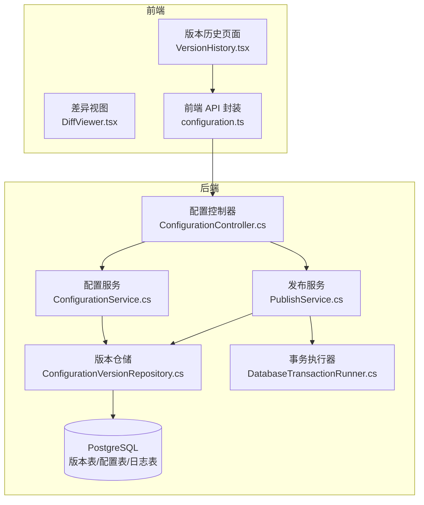
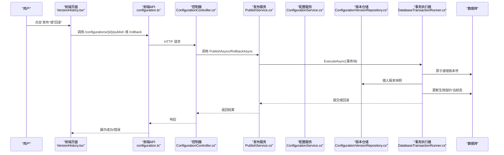
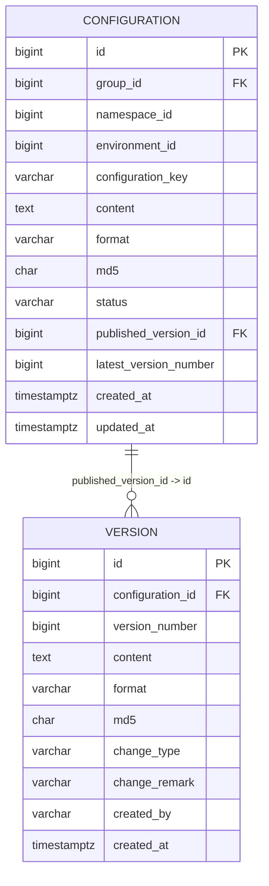
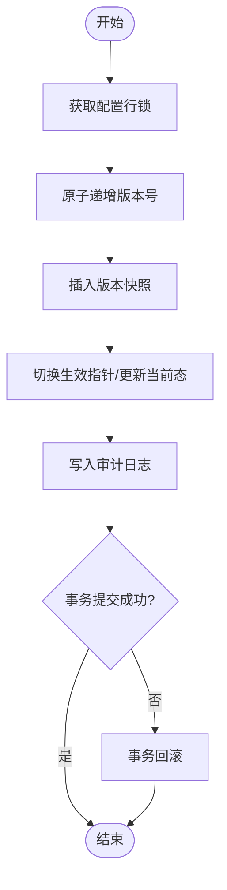
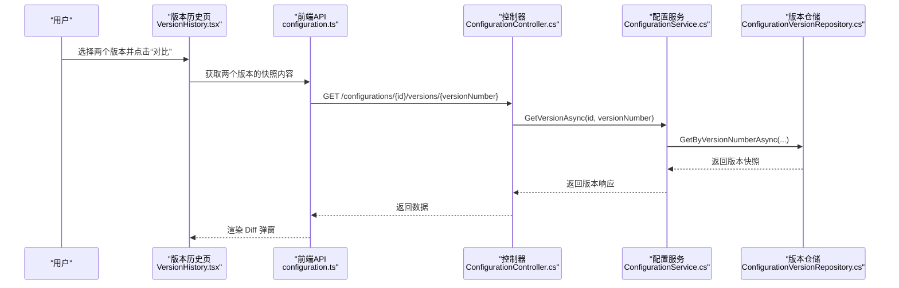
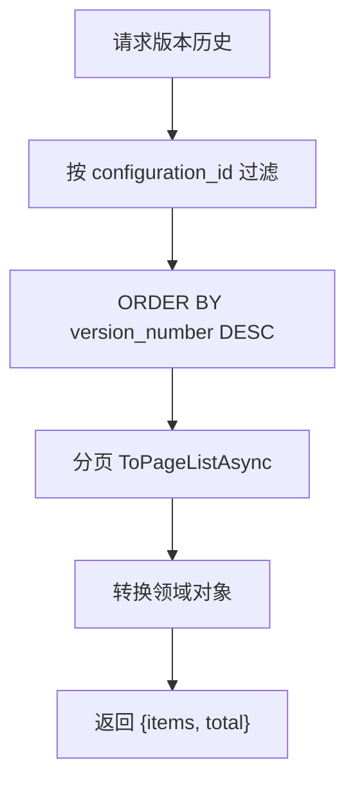
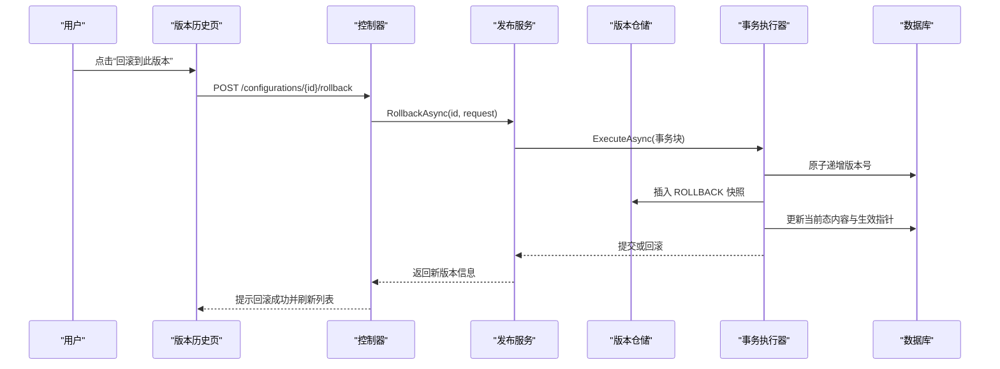
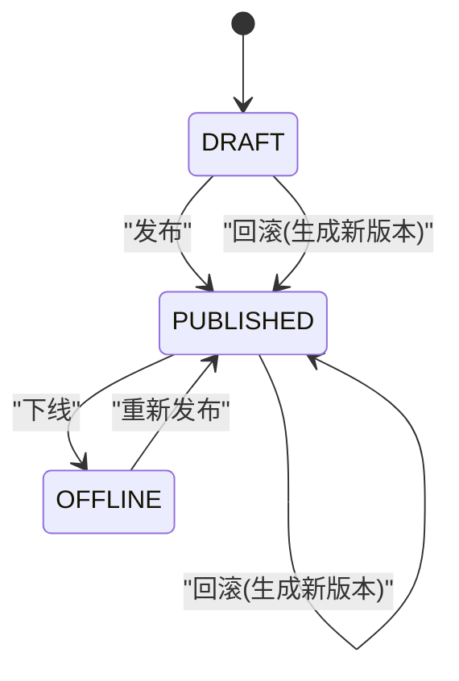
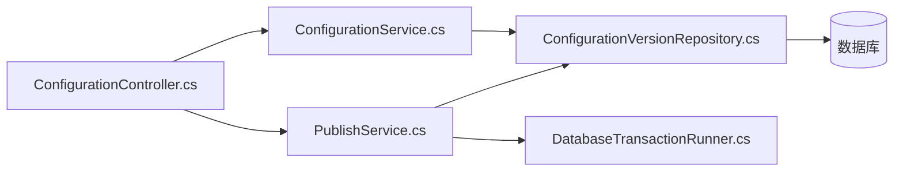

# 版本控制

<cite>
**本文引用的文件**
- [ConfigCenterConfigurationVersion.cs](file://k_config_center/src/Entities/ConfigCenterConfigurationVersion.cs)
- [ConfigurationService.cs](file://k_config_center/src/Services/ConfigurationService.cs)
- [PublishService.cs](file://k_config_center/src/Services/PublishService.cs)
- [ConfigurationController.cs](file://k_config_center/src/Controllers/ConfigurationController.cs)
- [ConfigurationVersionRepository.cs](file://k_config_center/src/Repositories/ConfigurationVersionRepository.cs)
- [DatabaseTransactionRunner.cs](file://k_config_center/src/Repositories/DatabaseTransactionRunner.cs)
- [ConfigurationData.cs](file://k_config_center/src/Models/Domain/ConfigurationData.cs)
- [配置中心建表脚本.sql](file://docs/数据库脚本/配置中心建表脚本.sql)
- [configuration.ts](file://web/src/api/configuration.ts)
- [VersionHistory.tsx](file://web/src/pages/configuration/VersionHistory.tsx)
- [DiffViewer.tsx](file://web/src/components/DiffViewer.tsx)
</cite>

## 目录
1. [简介](#简介)
2. [项目结构](#项目结构)
3. [核心组件](#核心组件)
4. [架构总览](#架构总览)
5. [详细组件分析](#详细组件分析)
6. [依赖关系分析](#依赖关系分析)
7. [性能考虑](#性能考虑)
8. [故障排查指南](#故障排查指南)
9. [结论](#结论)
10. [附录：API 与前端使用示例](#附录api-与前端使用示例)

## 简介
本章节概述配置中心的版本控制能力：通过“当前编辑态 + 不可变版本快照”的设计，实现配置的发布、回滚、下线与历史追溯。版本快照按版本号线性递增，支持差异对比、分页查询与事务保证的数据一致性。

## 项目结构
后端采用控制器-服务-仓储的分层架构；前端基于 React + Ant Design，提供版本历史列表、双版本 Diff 对比与回滚交互。关键路径如下：
- 控制器：接收请求并路由到对应服务
- 服务：编排业务逻辑（草稿保存、发布、回滚、下线、版本查询）
- 仓储：封装数据访问（版本快照插入、分页查询、MD5 批量获取）
- 实体/模型：定义版本表映射与领域数据对象
- 数据库脚本：PostgreSQL 建表与索引、触发器

图表来源
- [ConfigurationController.cs:1-115](file://k_config_center/src/Controllers/ConfigurationController.cs#L1-L115)
- [ConfigurationService.cs:1-110](file://k_config_center/src/Services/ConfigurationService.cs#L1-L110)
- [PublishService.cs:1-116](file://k_config_center/src/Services/PublishService.cs#L1-L116)
- [ConfigurationVersionRepository.cs:1-65](file://k_config_center/src/Repositories/ConfigurationVersionRepository.cs#L1-L65)
- [DatabaseTransactionRunner.cs:1-19](file://k_config_center/src/Repositories/DatabaseTransactionRunner.cs#L1-L19)
- [configuration.ts:1-59](file://web/src/api/configuration.ts#L1-L59)
- [VersionHistory.tsx:1-350](file://web/src/pages/configuration/VersionHistory.tsx#L1-L350)
- [DiffViewer.tsx:1-29](file://web/src/components/DiffViewer.tsx#L1-L29)

章节来源
- [ConfigurationController.cs:1-115](file://k_config_center/src/Controllers/ConfigurationController.cs#L1-L115)
- [ConfigurationService.cs:1-110](file://k_config_center/src/Services/ConfigurationService.cs#L1-L110)
- [PublishService.cs:1-116](file://k_config_center/src/Services/PublishService.cs#L1-L116)
- [ConfigurationVersionRepository.cs:1-65](file://k_config_center/src/Repositories/ConfigurationVersionRepository.cs#L1-L65)
- [DatabaseTransactionRunner.cs:1-19](file://k_config_center/src/Repositories/DatabaseTransactionRunner.cs#L1-L19)
- [配置中心建表脚本.sql:131-226](file://docs/数据库脚本/配置中心建表脚本.sql#L131-L226)
- [configuration.ts:1-59](file://web/src/api/configuration.ts#L1-L59)
- [VersionHistory.tsx:1-350](file://web/src/pages/configuration/VersionHistory.tsx#L1-L350)
- [DiffViewer.tsx:1-29](file://web/src/components/DiffViewer.tsx#L1-L29)

## 核心组件
- 版本实体与领域模型：定义版本快照字段、变更类型、时间戳等，以及当前编辑态与版本快照的领域数据对象
- 版本仓储：提供版本快照的插入、分页查询、按 ID 批量取 MD5、按配置与版本号查询单条快照
- 配置服务：负责草稿保存、详情查询、版本历史分页、单版本快照获取，并在列表接口中计算“是否有未发布变更”
- 发布服务：负责发布、回滚、下线的事务性操作，包含版本号原子递增、写入不可变快照、切换生效指针、写审计日志
- 事务执行器：在 Repository 层统一开启事务，确保多步操作的原子性与一致性
- 控制器：暴露 RESTful 接口，将请求路由到相应服务

章节来源
- [ConfigCenterConfigurationVersion.cs:1-39](file://k_config_center/src/Entities/ConfigCenterConfigurationVersion.cs#L1-L39)
- [ConfigurationData.cs:1-15](file://k_config_center/src/Models/Domain/ConfigurationData.cs#L1-L15)
- [ConfigurationVersionRepository.cs:1-65](file://k_config_center/src/Repositories/ConfigurationVersionRepository.cs#L1-L65)
- [ConfigurationService.cs:1-110](file://k_config_center/src/Services/ConfigurationService.cs#L1-L110)
- [PublishService.cs:1-116](file://k_config_center/src/Services/PublishService.cs#L1-L116)
- [DatabaseTransactionRunner.cs:1-19](file://k_config_center/src/Repositories/DatabaseTransactionRunner.cs#L1-L19)
- [ConfigurationController.cs:1-115](file://k_config_center/src/Controllers/ConfigurationController.cs#L1-L115)

## 架构总览
版本控制的核心流程包括：
- 草稿保存：更新当前编辑态内容，不产生版本
- 发布：原子递增版本号 → 写入不可变版本快照 → 切换生效指针 → 写审计日志
- 回滚：以目标历史版本内容生成新版本（change_type=ROLLBACK），同步当前编辑态并切换生效指针
- 下线：仅改变状态，客户端不再可见
- 版本历史：按版本号倒序分页，支持 Diff 对比与回滚入口

图表来源
- [PublishService.cs:24-80](file://k_config_center/src/Services/PublishService.cs#L24-L80)
- [ConfigurationController.cs:65-83](file://k_config_center/src/Controllers/ConfigurationController.cs#L65-L83)
- [ConfigurationVersionRepository.cs:41-44](file://k_config_center/src/Repositories/ConfigurationVersionRepository.cs#L41-L44)
- [DatabaseTransactionRunner.cs:11-17](file://k_config_center/src/Repositories/DatabaseTransactionRunner.cs#L11-L17)

## 详细组件分析

### 版本快照机制：设计原理与数据结构
- 设计原则
  - 不可变性：版本快照一旦创建不可修改，保障可追溯与审计
  - 线性递增：版本号在同一配置项内严格递增，避免并发冲突
  - 分离当前态与历史态：当前编辑态可多次保存为草稿，发布后才固化成版本
  - 变更类型标记：CREATE/UPDATE/DELETE/ROLLBACK/IMPORT，便于统计与可视化
- 数据结构
  - 版本表字段包括：配置项 ID、版本号、内容、格式、MD5、变更类型、备注、操作人、创建时间
  - 唯一约束：(configuration_id, version_number)，防止重复版本号
  - 外键：指向配置项主表，延迟建立以避免循环依赖
- 存储策略
  - 版本表不设软删除，全量保留
  - 针对查询优化：按 configuration_id 与 version_number 降序索引
  - 列表接口批量取 MD5，减少逐条回查

图表来源
- [配置中心建表脚本.sql:131-226](file://docs/数据库脚本/配置中心建表脚本.sql#L131-L226)
- [ConfigCenterConfigurationVersion.cs:5-38](file://k_config_center/src/Entities/ConfigCenterConfigurationVersion.cs#L5-L38)
- [ConfigurationData.cs:12-14](file://k_config_center/src/Models/Domain/ConfigurationData.cs#L12-L14)

章节来源
- [ConfigCenterConfigurationVersion.cs:1-39](file://k_config_center/src/Entities/ConfigCenterConfigurationVersion.cs#L1-L39)
- [配置中心建表脚本.sql:131-226](file://docs/数据库脚本/配置中心建表脚本.sql#L131-L226)
- [ConfigurationVersionRepository.cs:25-44](file://k_config_center/src/Repositories/ConfigurationVersionRepository.cs#L25-L44)

### 版本号生成规则与并发安全
- 生成规则
  - 版本号在同一配置项内线性递增，初始为 0，首次发布为 1，后续每次发布/回滚均 +1
  - 版本号不回退：回滚会生成新的 ROLLBACK 版本，保持历史可追溯
- 并发安全
  - 版本号递增在数据库行级锁上串行化，避免“先读后写”竞态
  - 唯一约束 (configuration_id, version_number) 作为兜底，冲突时转为并发错误码
  - 事务内顺序执行：递增 → 插入快照 → 切换生效指针 → 写日志，任一步失败整体回滚

图表来源
- [PublishService.cs:94-108](file://k_config_center/src/Services/PublishService.cs#L94-L108)
- [ConfigurationVersionRepository.cs:41-44](file://k_config_center/src/Repositories/ConfigurationVersionRepository.cs#L41-L44)
- [配置中心建表脚本.sql:192-206](file://docs/数据库脚本/配置中心建表脚本.sql#L192-L206)

章节来源
- [PublishService.cs:24-80](file://k_config_center/src/Services/PublishService.cs#L24-L80)
- [PublishService.cs:94-108](file://k_config_center/src/Services/PublishService.cs#L94-L108)
- [ConfigurationVersionRepository.cs:41-44](file://k_config_center/src/Repositories/ConfigurationVersionRepository.cs#L41-L44)

### 版本对比功能：差异算法、可视化与交互
- 差异计算
  - 前端使用 react-diff-viewer-continued，按行对比旧/新文本
  - 版本历史页支持选择两个版本进行 Diff，也支持“当前编辑态 vs 生效版本”预设对比
- 可视化展示
  - 双栏模式显示差异，支持标题标注（如 v1 → v2）
  - 大内容区域滚动查看，弹窗全屏展示
- 用户交互
  - 表格多选限制最多两行，已选满禁用其余勾选
  - 对比按钮在未选满时禁用并提示
  - 回滚弹窗二次确认，支持填写变更备注

图表来源
- [VersionHistory.tsx:100-121](file://web/src/pages/configuration/VersionHistory.tsx#L100-L121)
- [configuration.ts:49-58](file://web/src/api/configuration.ts#L49-L58)
- [ConfigurationController.cs:96-113](file://k_config_center/src/Controllers/ConfigurationController.cs#L96-L113)
- [ConfigurationService.cs:89-102](file://k_config_center/src/Services/ConfigurationService.cs#L89-L102)
- [ConfigurationVersionRepository.cs:17-23](file://k_config_center/src/Repositories/ConfigurationVersionRepository.cs#L17-L23)

章节来源
- [VersionHistory.tsx:100-121](file://web/src/pages/configuration/VersionHistory.tsx#L100-L121)
- [DiffViewer.tsx:1-29](file://web/src/components/DiffViewer.tsx#L1-L29)
- [configuration.ts:49-58](file://web/src/api/configuration.ts#L49-L58)
- [ConfigurationController.cs:96-113](file://k_config_center/src/Controllers/ConfigurationController.cs#L96-L113)
- [ConfigurationService.cs:89-102](file://k_config_center/src/Services/ConfigurationService.cs#L89-L102)
- [ConfigurationVersionRepository.cs:17-23](file://k_config_center/src/Repositories/ConfigurationVersionRepository.cs#L17-L23)

### 版本历史查询：分页加载与性能优化
- 分页加载
  - 后端按版本号倒序分页，返回 items 与 total
  - 前端维护 pageIndex 与 pageSize，支持切换每页条数
- 性能优化
  - 列表接口一次性取出所有生效版本的 MD5，内存比对判断“是否有未发布变更”，避免逐条回查
  - 版本历史查询使用索引 (configuration_id, version_number DESC) 提升排序与分页性能
  - 版本表无软删除，直接全量可追溯，减少过滤开销

图表来源
- [ConfigurationVersionRepository.cs:25-34](file://k_config_center/src/Repositories/ConfigurationVersionRepository.cs#L25-L34)
- [配置中心建表脚本.sql:208-208](file://docs/数据库脚本/配置中心建表脚本.sql#L208-L208)
- [ConfigurationService.cs:89-94](file://k_config_center/src/Services/ConfigurationService.cs#L89-L94)

章节来源
- [ConfigurationVersionRepository.cs:25-34](file://k_config_center/src/Repositories/ConfigurationVersionRepository.cs#L25-L34)
- [ConfigurationService.cs:23-32](file://k_config_center/src/Services/ConfigurationService.cs#L23-L32)
- [配置中心建表脚本.sql:208-208](file://docs/数据库脚本/配置中心建表脚本.sql#L208-L208)

### 版本回滚：业务逻辑与技术实现
- 业务逻辑
  - 以目标历史版本的内容生成新版本，change_type=ROLLBACK
  - 版本号不回退，保持线性递增与历史可追溯
  - 当前编辑态内容同步为目标历史版本值，并切换生效指针
- 技术实现
  - 事务内顺序执行：递增版本号 → 插入 ROLLBACK 快照 → 更新当前态与生效指针 → 写审计日志
  - 异常处理：目标版本不存在抛出业务错误；唯一约束冲突转为并发冲突错误码
  - 前端提供回滚弹窗，二次确认并收集变更备注

图表来源
- [PublishService.cs:56-80](file://k_config_center/src/Services/PublishService.cs#L56-L80)
- [ConfigurationController.cs:75-83](file://k_config_center/src/Controllers/ConfigurationController.cs#L75-L83)
- [VersionHistory.tsx:123-144](file://web/src/pages/configuration/VersionHistory.tsx#L123-L144)

章节来源
- [PublishService.cs:56-80](file://k_config_center/src/Services/PublishService.cs#L56-L80)
- [ConfigurationController.cs:75-83](file://k_config_center/src/Controllers/ConfigurationController.cs#L75-L83)
- [VersionHistory.tsx:123-144](file://web/src/pages/configuration/VersionHistory.tsx#L123-L144)

### 版本流转状态图
- 状态说明
  - DRAFT：草稿态，可多次编辑保存，不产生版本
  - PUBLISHED：已发布，客户端可读，指向某个版本快照
  - OFFLINE：已下线，客户端不可读，但保留 published_version_id
- 流转规则
  - DRAFT → PUBLISHED：发布，生成新版本快照并切换生效指针
  - PUBLISHED → OFFLINE：下线，仅改状态
  - OFFLINE → PUBLISHED：重新发布恢复上线
  - 任意态均可回滚：生成 ROLLBACK 新版本并切换生效指针

图表来源
- [配置中心建表脚本.sql:147-159](file://docs/数据库脚本/配置中心建表脚本.sql#L147-L159)
- [PublishService.cs:24-92](file://k_config_center/src/Services/PublishService.cs#L24-L92)

章节来源
- [配置中心建表脚本.sql:147-159](file://docs/数据库脚本/配置中心建表脚本.sql#L147-L159)
- [PublishService.cs:24-92](file://k_config_center/src/Services/PublishService.cs#L24-L92)

## 依赖关系分析
- 控制器依赖服务：ConfigurationController 依赖 ConfigurationService 与 PublishService
- 服务依赖仓储：ConfigurationService 与 PublishService 依赖 ConfigurationVersionRepository
- 事务边界：PublishService 通过 DatabaseTransactionRunner 在 Repository 层开启事务
- 数据模型：版本实体映射到版本表，领域数据对象用于服务与仓储间传递

图表来源
- [ConfigurationController.cs:1-115](file://k_config_center/src/Controllers/ConfigurationController.cs#L1-L115)
- [ConfigurationService.cs:1-110](file://k_config_center/src/Services/ConfigurationService.cs#L1-L110)
- [PublishService.cs:1-116](file://k_config_center/src/Services/PublishService.cs#L1-L116)
- [ConfigurationVersionRepository.cs:1-65](file://k_config_center/src/Repositories/ConfigurationVersionRepository.cs#L1-L65)
- [DatabaseTransactionRunner.cs:1-19](file://k_config_center/src/Repositories/DatabaseTransactionRunner.cs#L1-L19)

章节来源
- [ConfigurationController.cs:1-115](file://k_config_center/src/Controllers/ConfigurationController.cs#L1-L115)
- [ConfigurationService.cs:1-110](file://k_config_center/src/Services/ConfigurationService.cs#L1-L110)
- [PublishService.cs:1-116](file://k_config_center/src/Services/PublishService.cs#L1-L116)
- [ConfigurationVersionRepository.cs:1-65](file://k_config_center/src/Repositories/ConfigurationVersionRepository.cs#L1-L65)
- [DatabaseTransactionRunner.cs:1-19](file://k_config_center/src/Repositories/DatabaseTransactionRunner.cs#L1-L19)

## 性能考虑
- 列表接口优化：批量获取生效版本 MD5，内存比对“是否有未发布变更”，避免逐条回查
- 版本历史分页：使用索引 (configuration_id, version_number DESC) 提升排序与分页效率
- 版本表不可变且无软删除：减少过滤条件，简化查询
- 前端 Diff 对比：按需加载单个版本快照，避免一次性拉取全部历史内容
- 事务粒度：发布/回滚事务范围最小化，仅包含必要步骤，降低锁持有时间

章节来源
- [ConfigurationService.cs:23-32](file://k_config_center/src/Services/ConfigurationService.cs#L23-L32)
- [ConfigurationVersionRepository.cs:25-34](file://k_config_center/src/Repositories/ConfigurationVersionRepository.cs#L25-L34)
- [配置中心建表脚本.sql:208-208](file://docs/数据库脚本/配置中心建表脚本.sql#L208-L208)

## 故障排查指南
- 重复发布被拒绝：当配置已发布且内容与生效版本一致时，服务端拒绝重复发布
- 并发冲突：多个并发发布导致唯一约束冲突，返回并发冲突错误码，建议重试
- 目标版本不存在：回滚时若目标版本不存在，抛出业务错误
- 权限与审计：操作日志记录操作人、IP、时间与详情，便于审计追踪
- 前端错误提示：HTTP 拦截器统一弹出错误消息，用户可据此定位问题

章节来源
- [PublishService.cs:24-37](file://k_config_center/src/Services/PublishService.cs#L24-L37)
- [PublishService.cs:100-108](file://k_config_center/src/Services/PublishService.cs#L100-L108)
- [PublishService.cs:56-64](file://k_config_center/src/Services/PublishService.cs#L56-L64)
- [ConfigurationController.cs:65-93](file://k_config_center/src/Controllers/ConfigurationController.cs#L65-L93)

## 结论
该版本控制系统通过“当前编辑态 + 不可变版本快照”的设计，实现了安全的发布、回滚与下线能力。版本号线性递增、事务保证与索引优化共同保障了数据一致性与查询性能。前端提供了直观的版本历史、差异对比与回滚交互，提升了运维效率与可观测性。

## 附录：API 与前端使用示例

### 后端 API 接口
- 列表：GET /api/configurations?groupId=&namespaceId=&environmentId=&status=&keyword=
- 详情：GET /api/configurations/{id}
- 新建：POST /api/configurations
- 编辑草稿：PUT /api/configurations/{id}
- 删除：DELETE /api/configurations/{id}
- 发布：POST /api/configurations/{id}/publish
- 回滚：POST /api/configurations/{id}/rollback
- 下线：POST /api/configurations/{id}/offline
- 版本历史：GET /api/configurations/{id}/versions?pageIndex=&pageSize=
- 单版本快照：GET /api/configurations/{id}/versions/{versionNumber}

章节来源
- [ConfigurationController.cs:14-113](file://k_config_center/src/Controllers/ConfigurationController.cs#L14-L113)

### 前端 API 封装
- listConfigurations(params)
- getConfiguration(id)
- createConfiguration(data)
- updateConfiguration(id, data)
- deleteConfiguration(id)
- publishConfiguration(id, data)
- rollbackConfiguration(id, data)
- offlineConfiguration(id)
- listVersions(id, pageIndex, pageSize)
- getVersion(id, versionNumber)

章节来源
- [configuration.ts:18-58](file://web/src/api/configuration.ts#L18-L58)

### 前端组件使用示例
- 版本历史页面：VersionHistory.tsx
  - 分页加载版本列表
  - 选择两个版本进行 Diff 对比
  - 回滚到指定版本并生成新版本
- 差异视图组件：DiffViewer.tsx
  - 双栏模式对比旧/新文本
  - 支持标题标注与滚动查看

章节来源
- [VersionHistory.tsx:44-144](file://web/src/pages/configuration/VersionHistory.tsx#L44-L144)
- [DiffViewer.tsx:16-28](file://web/src/components/DiffViewer.tsx#L16-L28)